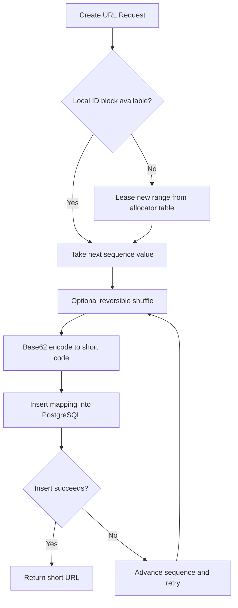
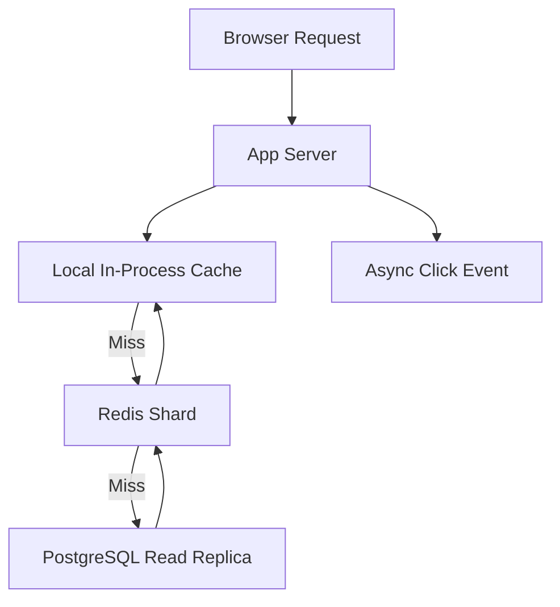

# System Design: URL Shortener

> Design a URL shortening service like bit.ly that handles 100M new URLs per month and 10B redirects per month, with sub-50ms redirect latency and durable link storage.

---

## Concepts Covered

- **Concept 01** - Horizontal vs Vertical Scaling & Auto-scaling
- **Concept 02** - Load Balancing Deep Dive
- **Concept 05** - API Design Patterns
- **Concept 06** - SQL Databases at Scale
- **Concept 10** - Caching Strategies
- **Concept 11** - Consistent Hashing
- **Concept 12** - Data Modeling for Scale
- **Concept 14** - Message Queues & Stream Processing
- **Concept 19** - Fault Tolerance Patterns
- **Concept 21** - Monitoring, Observability & SLOs/SLAs

---

## Step 1: Requirements & Scope

### Functional Requirements

- **Create short URLs**: Given a long URL, generate a unique short code and return a usable short link. This is the core write path because the whole service starts with mapping a long destination to a compact identifier.
- **Redirect on read**: When a user visits a short URL, the system should resolve the code and return an HTTP redirect to the original destination. This is the hot path and will dominate traffic by a wide margin.
- **Support optional custom aliases**: Some users want `short.ly/my-brand` instead of an opaque hash. This matters because branded links are a real business use case, but it introduces uniqueness checks and reserved-word handling.
- **Support expiration**: Users can create links that stop working after a certain time. This keeps the product useful for temporary campaigns and lets operators manage long-term storage growth more intentionally.
- **Basic link metadata lookup**: Users or internal tools should be able to fetch the original URL, creation time, expiration time, and total click count. This is operationally useful even if we are not designing a full analytics dashboard.
- **Delete or disable links**: Abuse, malware, or user mistakes mean operators need a way to deactivate links. This is important for moderation and security response.
- **Track click counts asynchronously**: We want basic aggregate counts, but the redirect path cannot become slower because we insisted on strong real-time analytics. That means analytics is a secondary path, not part of the core read latency budget.

### Non-Functional Requirements

- **Availability target**: 99.99% for redirects. If the redirect service is down, previously created links across the internet are broken, so availability matters more than fancy features.
- **Redirect latency**: p99 under 50ms. A redirect feels broken if it is visibly slow, and users will blame the destination site even though the delay happened in our system.
- **Creation latency**: p99 under 200ms. Writes can be slower than reads, but creation should still feel interactive.
- **Scale**: 100M new URLs per month and 10B redirects per month. That implies a heavily read-dominated workload with a roughly 100:1 read-to-write ratio.
- **Durability**: Once a short URL is created and acknowledged, we should not lose it. Broken public links create trust damage that is hard to undo.
- **Consistency**: Strong consistency for short-code uniqueness and link creation. Eventual consistency is acceptable for click counts and secondary reporting.
- **Security and abuse posture**: The system should support rate limiting, invalid URL validation, and malicious-link takedowns. We are not designing a full anti-abuse platform, but the core design has to leave room for it.

### Out of Scope

- **User accounts and billing**: Those are product features, not the core system-design problem here.
- **Rich analytics dashboards**: We will track aggregate clicks only, because geography, referrer chains, campaign attribution, and charting would create a second large subsystem.
- **Custom domains and DNS management**: Supporting customer-owned domains adds certificate automation, DNS onboarding, and tenant-level routing complexity that is orthogonal to the core mapping service.
- **QR code generation**: Useful, but not part of the storage and redirect challenge.
- **Malware scanning pipeline**: We will acknowledge abuse controls, but we are not fully designing safe-browsing integration or content classification.

Keeping the scope tight matters because the interesting part of a URL shortener is not the marketing surface. It is the combination of a tiny write path, an extremely hot read path, strong uniqueness guarantees, and cheap scalable lookups. Once we solve that cleanly, many product features can layer on top.

---

## Step 2: Back-of-Envelope Estimation

The goal of estimation is not to get the exact production number on day one. It is to force ourselves to size the architecture honestly and understand what is hot, what is cold, and where cost will show up.

### Traffic Estimation

Starting assumptions:
- New URLs created per month: `100,000,000`
- Redirects per month: `10,000,000,000`
- Peak multiplier over average: `3x`

Write traffic:
```text
100,000,000 URLs / 30 days = 3,333,333 URLs per day
3,333,333 / 86,400 seconds = 38.58 writes/sec average
Peak write QPS = 38.58 x 3 = 115.74 writes/sec
```

Read traffic:
```text
10,000,000,000 redirects / 30 days = 333,333,333 redirects per day
333,333,333 / 86,400 seconds = 3,858.02 reads/sec average
Peak read QPS = 3,858.02 x 3 = 11,574.06 reads/sec
```

Read-to-write ratio:
```text
10,000,000,000 / 100,000,000 = 100:1
```

That 100:1 ratio immediately tells us two things. First, the redirect path deserves most of our optimization work. Second, even moderate cache hit rates will dramatically reduce database load.

### Storage Estimation

Per URL record:
```text
short_code           8 bytes   (7-character base62 plus small overhead)
original_url         200 bytes (safe average for modern URLs)
created_at           8 bytes
expires_at           8 bytes
status flags         4 bytes
owner / tenant id    8 bytes   (optional future-proofing)
click_count          8 bytes
row/index overhead   56 bytes
--------------------------------
total                300 bytes per record
```

Storage growth:
```text
100,000,000 records/month x 300 bytes = 30,000,000,000 bytes
= 30 GB/month

30 GB/month x 12 = 360 GB/year

360 GB/year x 5 years = 1,800 GB
= 1.8 TB logical data
```

With replication:
```text
1.8 TB x replication factor 3 = 5.4 TB
```

Analytics events are much larger if we store raw click events, which is exactly why we will not store every redirect synchronously in the primary mapping database. Basic counts stay in the main database; detailed click streams, if ever needed, belong in a separate analytics pipeline.

### Bandwidth Estimation

Writes:
```text
Peak writes/sec = 116
Average request payload ~= 350 bytes
Ingress = 116 x 350 bytes = 40,600 bytes/sec
= 39.6 KB/sec
```

Redirect responses:
```text
Peak reads/sec = 11,574
Average redirect response metadata ~= 300 bytes
Egress = 11,574 x 300 bytes = 3,472,200 bytes/sec
= 3.31 MB/sec
```

This is tiny in bandwidth terms. The challenge is not raw network throughput. The challenge is low-latency lookup and high availability under skewed access patterns.

### Memory Estimation (for caching)

Suppose we cache the hottest 5% of one year's URLs.

```text
100,000,000/month x 12 = 1.2B URLs/year
Hot set = 1.2B x 5% = 60,000,000 URLs
Memory per cached entry ~= 250 bytes payload + metadata = 300 bytes
Cache memory = 60,000,000 x 300 bytes = 18,000,000,000 bytes
= 18 GB
```

If we want headroom for fragmentation, replicas, and key overhead:
```text
18 GB x 1.5 safety factor = 27 GB
```

So a small Redis cluster, for example `3 nodes x 16 GB usable memory`, is already enough for a strong first version. That lines up nicely with **Concept 10 - Caching Strategies**: we do not need to cache the entire world, just the hot working set.

### Summary Table

| Metric | Value |
|--------|-------|
| Write QPS (average) | ~39 |
| Write QPS (peak) | ~116 |
| Read QPS (average) | ~3,858 |
| Read QPS (peak) | ~11,574 |
| Read:Write ratio | 100:1 |
| Storage (5 years, replicated) | ~5.4 TB |
| Cache memory target | ~27 GB |
| Peak egress bandwidth | ~3.31 MB/sec |

---

## Step 3: API Design

This is a classic REST-friendly system. The resources are easy to name, the operations are straightforward, and the clients are often browsers, SDKs, or other backend services. We do not need GraphQL because clients are not assembling arbitrary graphs of related data. We do not need gRPC as the public interface because the payloads are small and human-debuggable HTTP semantics are valuable.

Cross-reference: **Concept 05 - API Design Patterns**.

### Create Short URL

```
POST /api/v1/urls
```

**Parameters:**
| Parameter | Type | Required | Description |
|-----------|------|----------|-------------|
| original_url | string | Yes | Destination URL to shorten |
| custom_alias | string | No | Optional user-defined short code |
| expires_at | string (ISO 8601) | No | Optional expiration timestamp |
| redirect_type | string | No | `301` or `302`, defaults to `302` for analytics-friendly behavior |

**Response:**
```json
{
  "short_url": "https://short.ly/aB3xK9",
  "hash": "aB3xK9",
  "original_url": "https://example.com/very/long/path",
  "created_at": "2026-03-20T10:30:00Z",
  "expires_at": null
}
```

**Design Notes:** This endpoint is the primary write path. Returning both the short URL and hash helps clients that want to store either the full public URL or the internal short code. We validate scheme, host, and maximum length at the edge so bad inputs do not contaminate storage.

### Redirect

```
GET /{hash}
```

**Parameters:**
| Parameter | Type | Required | Description |
|-----------|------|----------|-------------|
| hash | string | Yes | Short code to resolve |

**Response:**
```json
{
  "status": 302,
  "location": "https://example.com/very/long/path"
}
```

**Design Notes:** In production this is really an HTTP redirect with a `Location` header, not a JSON body. I am showing the logical response here so the contract is explicit. We prefer `302` by default because it preserves analytics accuracy, but some customers may opt into `301` for maximal cacheability. That tradeoff should be deliberate rather than hidden.

### Get Link Metadata

```
GET /api/v1/urls/{hash}
```

**Parameters:**
| Parameter | Type | Required | Description |
|-----------|------|----------|-------------|
| hash | string | Yes | Short code |

**Response:**
```json
{
  "short_url": "https://short.ly/aB3xK9",
  "original_url": "https://example.com/very/long/path",
  "created_at": "2026-03-20T10:30:00Z",
  "expires_at": null,
  "click_count": 14523,
  "status": "active"
}
```

**Design Notes:** This endpoint is for internal tools or authenticated clients, not the public hot path. It can tolerate slightly higher latency because it is operational rather than user-facing.

### Disable Link

```
DELETE /api/v1/urls/{hash}
```

**Parameters:**
| Parameter | Type | Required | Description |
|-----------|------|----------|-------------|
| hash | string | Yes | Short code to disable |

**Response:**
```json
{
  "status": "disabled"
}
```

### Error Responses and Rate Limiting

- `400 Bad Request` for malformed URLs or invalid expiration timestamps
- `404 Not Found` for unknown short codes
- `410 Gone` for expired links
- `409 Conflict` for a custom alias collision
- `429 Too Many Requests` with `X-RateLimit-Limit`, `X-RateLimit-Remaining`, and `Retry-After` headers

For public unauthenticated creation, we rate-limit aggressively at the edge using the patterns from **Concept 04 - API Gateway, Reverse Proxy & Rate Limiting**, even though that concept is not central enough to list at the top here.

---

## Step 4: Data Model

### Database Choice

We will use **PostgreSQL** for the authoritative mapping store and **Redis** as a cache, not as the source of truth.

Why PostgreSQL:
- The primary operation is a point lookup by short code, which PostgreSQL handles extremely well with a primary-key index.
- We need strong uniqueness guarantees for short codes and custom aliases.
- The total storage size over five years is in the low-terabyte range, which is comfortably within a well-operated PostgreSQL deployment with replicas and partitioning if needed.
- Operationally, a relational database is a boring and reliable choice for this access pattern.

We considered a wide-column or key-value store such as Cassandra or DynamoDB. They would work, especially at much larger scale, but they add tradeoffs we do not need yet. The URL shortener's write volume is modest. The biggest performance lever is caching, not exotic primary storage. That aligns with **Concept 06 - SQL Databases at Scale** and **Concept 12 - Data Modeling for Scale**.

### Schema Design

```text
Table: urls
├── hash             VARCHAR(8)      PRIMARY KEY         -- Short code used in the public URL
├── original_url     TEXT            NOT NULL            -- Destination URL
├── canonical_hash   BYTEA           NULLABLE            -- Optional dedupe fingerprint if we want duplicate detection later
├── created_at       TIMESTAMP       NOT NULL            -- Creation time
├── expires_at       TIMESTAMP       NULLABLE            -- Optional expiration time
├── status           SMALLINT        NOT NULL            -- Active, disabled, or expired
├── click_count      BIGINT          NOT NULL DEFAULT 0  -- Aggregate counter
├── created_by       BIGINT          NULLABLE            -- Future-proofing for multi-tenant use
│
├── INDEX: idx_urls_expires ON (expires_at) WHERE expires_at IS NOT NULL
├── INDEX: idx_urls_created_at ON (created_at)
└── INDEX: idx_urls_status ON (status, created_at)
```

If custom aliases become a separate concern because we want reserved words or richer alias lifecycle management, we can split them into a second table:

```text
Table: custom_aliases
├── alias            VARCHAR(64)     PRIMARY KEY         -- Human-friendly alias
├── hash             VARCHAR(8)      NOT NULL UNIQUE     -- Maps back to canonical short code
└── created_at       TIMESTAMP       NOT NULL
```

### Access Patterns

- **Resolve redirect**: `SELECT original_url, expires_at, status FROM urls WHERE hash = ?`
  This is a primary-key lookup and should be extremely fast, especially from cache.
- **Create short URL**: `INSERT INTO urls (...) VALUES (...)`
  Strong uniqueness on `hash` protects us from collisions.
- **Lookup metadata**: `SELECT ... FROM urls WHERE hash = ?`
  Same index path as redirect, just a larger projection.
- **Expire links**: `SELECT hash FROM urls WHERE expires_at < NOW() AND status = active`
  The partial expiration index makes cleanup efficient.
- **Increment clicks**: batched asynchronous `UPDATE urls SET click_count = click_count + ? WHERE hash = ?`
  We intentionally keep this out of the synchronous redirect flow.

This is a nice example of access-pattern-driven modeling. The table is boring because the workload is boring in the best possible sense. The hard part is not data modeling complexity. It is choosing the simplest model that still supports growth.

---

## Step 5: High-Level Architecture

### Mermaid Diagram

```mermaid
graph TD
    Users["Users / Browsers / SDK Clients"] -->|GET /{hash}| LB["L7 Load Balancer"]
    Users -->|POST /api/v1/urls| LB
    LB --> App1["Stateless API Server 1"]
    LB --> App2["Stateless API Server 2"]
    LB --> App3["Stateless API Server 3"]

    App1 -->|Cache lookup| Redis["Redis Cache Cluster"]
    App2 -->|Cache lookup| Redis
    App3 -->|Cache lookup| Redis

    App1 -->|Cache miss read| RR1["PostgreSQL Read Replica 1"]
    App2 -->|Cache miss read| RR2["PostgreSQL Read Replica 2"]
    App3 -->|Cache miss read| RR1

    App1 -->|Create / Disable| PG["PostgreSQL Primary"]
    App2 -->|Create / Disable| PG
    App3 -->|Create / Disable| PG

    PG -->|Async replication| RR1
    PG -->|Async replication| RR2

    App1 -->|Publish click events| Queue["Kafka / Durable Queue"]
    App2 -->|Publish click events| Queue
    App3 -->|Publish click events| Queue
    Queue --> Worker["Click Aggregation Worker"]
    Worker -->|Batch updates| PG

    Cron["Expiration Cleanup Job"] -->|Disable expired links| PG
    Health["Health Checks / Metrics"] --> LB
    Health --> App1
    Health --> App2
    Health --> App3
```

### Architecture Walkthrough

Start at the far left with the client. A user clicking `short.ly/aB3xK9` is the dominant path, so the system is optimized around that journey. The request first reaches the L7 load balancer. We choose L7 rather than a bare L4 proxy because it gives us better HTTP-aware health checks, easier TLS termination, and room for rate limiting or path-based routing later. That choice is straight out of **Concept 02 - Load Balancing Deep Dive**.

From the load balancer, the request goes to one of several stateless API servers. Stateless matters here. We do not want any redirect logic pinned to one machine, because that would make horizontal scaling awkward and failover brittle. Any healthy application server should be able to handle any request. That is the operational point of **Concept 01 - Horizontal vs Vertical Scaling & Auto-scaling**: if one API server dies, the load balancer drains it and the others keep serving.

Now the redirect path begins. The application server extracts the short code from the URL and checks Redis first. Redis is the performance layer, not the truth layer. If the code is present, Redis returns the stored destination URL and status in roughly sub-millisecond memory time. The application server validates that the entry is still active and not expired, then immediately returns an HTTP redirect. On a cache hit, the total path is mostly network time plus a tiny amount of application work.

If Redis misses, the same application server queries one of the PostgreSQL read replicas. The query is deliberately boring: look up the row by primary key. That is a good sign. Fast systems are often built around boring, highly optimized primitives. The read replica returns the original URL and expiration metadata. The app server then populates Redis using a cache-aside pattern and returns the redirect response. This is exactly the pattern described in **Concept 10 - Caching Strategies**. We keep the cache warm only for URLs that actually receive traffic, which is more memory-efficient than eagerly caching every new short link.

The write path is different. When a client creates a new short URL with `POST /api/v1/urls`, the request goes through the same load balancer and into the same stateless API fleet, but the server talks to the PostgreSQL primary rather than a replica. The server generates a short code, checks for uniqueness if necessary, inserts the record, and returns the new short URL. This is a low-volume path relative to redirects, so we optimize it for correctness and simplicity rather than extreme throughput.

Notice what we are not doing on the write path: we are not eagerly populating Redis. That is a conscious choice. Many created short URLs may never be clicked. Writing every new URL into cache would fill memory with cold data. Instead, we let the first real redirect request populate the cache naturally. That is a good fit for a read-heavy workload with a strong hot/cold distribution.

Click counting is intentionally off the hot path. After the application server sends the redirect, it publishes a lightweight event into Kafka or another durable queue. The click aggregation worker consumes these events, batches them for a few seconds, and updates PostgreSQL in chunks. The redirect stayed fast because we did not wait for the database update before returning to the user. This is a direct application of **Concept 14 - Message Queues & Stream Processing**. We are using asynchronous processing where eventual consistency is acceptable.

The read replicas exist for both scale and resilience. Under normal operation they absorb the relatively small percentage of requests that miss cache. If one replica fails, the remaining replica can temporarily absorb all misses while the cache still serves most traffic. If the PostgreSQL primary fails, new URL creation is temporarily unavailable, but redirects for already cached and replicated data can continue for a while. That distinction is important: different user journeys have different criticality levels.

There is also an expiration cleanup job running on a schedule. Its job is not glamorous, but it matters. Expired links should stop resolving, and the database should not accumulate unbounded operational clutter. The cleanup worker periodically scans for expired active rows, marks them disabled or expired, and deletes or invalidates related cache entries. That is a simple batch workflow, not an always-on real-time subsystem.

Finally, there is health checking and metrics throughout the system. The load balancer needs to know which app servers are alive. Operators need to know cache hit ratio, replica lag, redirect p99 latency, and queue lag for click aggregation. A system like this often fails gradually before it fails loudly. If cache hit ratio drops, database load increases. If database load increases, latency rises. If latency rises, retries and user-visible errors follow. That is why observability is part of the architecture, not an afterthought.

The nice thing about this design is that each component has a very clear job. The load balancer routes. The API servers stay stateless. Redis accelerates reads. PostgreSQL preserves correctness. Kafka decouples analytics from user latency. The cleanup job handles lifecycle management. None of those components are clever individually, but together they give us a fast, durable, and operable system.

---

## Step 6: Deep Dives

### Deep Dive 1: Short Code Generation Without Painful Collisions

The first non-obvious question in a URL shortener is how short codes are generated. At first glance, hashing the original URL seems natural. Compute SHA-256, take the first few bytes, base62-encode them, and call it a day. The problem is that truncation creates collisions far sooner than people intuitively expect. Once you are creating tens or hundreds of millions of URLs, collision handling becomes part of the write path.

There are three realistic approaches:

1. **Hash and retry**: Hash the URL, truncate, attempt insert, and if the code already exists, salt and retry.
2. **Global sequence**: Use a monotonic counter and base62-encode it.
3. **Range allocation**: Allocate ranges of sequence values to application servers so they can generate locally without a network call every time.

For this design, range allocation is the sweet spot. A single global sequence is correct but can become a coordination choke point if we ever scale write traffic much higher. Hash-and-retry is simple initially, but collision behavior turns into unpredictable write latency. With range allocation, the PostgreSQL primary or a small coordination table hands out blocks like `5,000,001-5,010,000` to an application server. That server can base62-encode values locally until the range is exhausted.

The subtle downside is predictability. Sequentially assigned IDs are easy to enumerate. If that matters, we can apply a reversible permutation before base62 encoding, effectively scrambling the visible codes while preserving uniqueness. We do not need cryptographic perfection here, just enough to avoid obvious sequential exposure.



This flow is worth spelling out because it shows why range allocation is such a pragmatic compromise. In the steady state, the app server is generating codes locally with no extra network round trip. Only when its leased block is exhausted does it ask the allocator for another range. The optional shuffle step is where we hide the obvious sequential pattern from users without reintroducing collision risk. The final insert into PostgreSQL is still valuable even if collisions should never happen in theory, because production systems fail in creative ways. A duplicate-range bug, a bad rollback, or a split-brain allocator should be caught by the database uniqueness guarantee instead of silently generating broken short links.

Cross-reference: **Concept 11 - Consistent Hashing** is relevant for how distributed systems think about key distribution, even though this exact problem is sequence allocation rather than hash-ring placement.

### Deep Dive 2: Redirect Caching and Hot-Key Protection

The redirect path is where the system wins or loses. A 95% cache hit ratio means the database barely notices the read load. A 60% hit ratio means the database becomes the real product. So the caching policy deserves deeper thought.

We use a cache-aside pattern:
- On redirect, check Redis first.
- On miss, load from PostgreSQL replica.
- Write back to Redis with a TTL.
- On disable or expiry, delete the cache entry.

The interesting edge case is the hot-key problem. Most short URLs are cold forever, but a few go viral. One code might suddenly receive hundreds of thousands of requests per second after being shared by a celebrity or embedded in a widely viewed campaign. Even if Redis is fast, one hot key can overload a single shard.

### Mermaid Diagram



### Diagram Walkthrough

This second diagram shows a two-level cache. The request enters the app server and first checks a tiny in-process L1 cache. That cache only holds extremely hot items for a short TTL, maybe 30 to 60 seconds. Its purpose is not broad caching. Its purpose is shielding Redis from sudden flash crowds on a single key.

If the in-process cache misses, the app server checks Redis, which is the main shared cache layer. Redis holds the broader hot set and gives all application servers a common memory-backed lookup layer. If Redis also misses, the app server queries the PostgreSQL read replica, repopulates Redis, and refreshes the local cache.

This hierarchy matters because different kinds of heat deserve different defenses. Redis is great at large shared hot sets, but it still has shard-level bottlenecks. Local in-process caches are excellent at ultra-hot keys because every application server absorbs some of the load independently. The database stays protected because misses collapse quickly back into cache.

If one app server dies, only its tiny L1 cache disappears. That is acceptable because Redis remains the shared layer. If Redis has a partial outage, the L1 cache buys us a little time and softens the immediate shock to the database. This is a nice example of **Concept 19 - Fault Tolerance Patterns** layered on top of **Concept 10 - Caching Strategies**.

### Deep Dive 3: Click Analytics Without Slowing Redirects

If we update `click_count = click_count + 1` synchronously on every redirect, we turn the hot path into a write-amplified database workload. That is exactly the wrong tradeoff for a URL shortener. Redirects are the product. Aggregate counts are secondary telemetry.

So we publish lightweight click events:

```json
{
  "hash": "aB3xK9",
  "timestamp": "2026-03-20T12:00:15Z",
  "status": "redirected"
}
```

The aggregation worker reads a batch every few seconds, groups by hash, and writes one batched update per code instead of one update per click. If a link received 12,000 clicks in the last five seconds, we write one increment of 12,000, not 12,000 separate updates. That massively reduces write pressure.

The tradeoff is eventual consistency. A user looking at metadata may see a click count lagging by a few seconds. That is perfectly acceptable for this product. If a queue is temporarily unavailable, we can buffer a small number of events in memory or local logs and accept bounded analytics loss before we would ever slow the redirect path. That choice reflects business priorities, not technical purity.

Cross-reference: **Concept 14 - Message Queues & Stream Processing** and **Concept 20 - Idempotency, Deduplication & Exactly-Once Semantics** if the analytics path ever becomes important enough to require dedupe on worker retries.

### Deep Dive 4: Expiration and Hash Reuse Policy

It is tempting to reuse expired short codes. Why waste namespace if an old link is gone? In practice, reuse is dangerous. Browsers, chat apps, and users may have cached or bookmarked the old URL. Reassigning the same short code to a different destination creates a trust and security hazard that is far worse than the tiny savings in key space.

With 62 possible characters and 7 positions, we have:

```text
62^7 = 3,521,614,606,208 possible codes
```

At 1.2B new URLs per year, that lasts for thousands of years. So the correct operational choice is to never reuse a short code once issued. Expired links return `410 Gone`. This makes reasoning, debugging, and security response much simpler.

---

## Step 7: Bottlenecks & Scaling

### Identifying Bottlenecks

At around `10x` current scale, peak redirects rise to roughly `115,000 QPS`. The first bottleneck is not PostgreSQL. It is Redis shard concentration and cache hot-key skew. A single Redis node can handle a lot, but a viral code can overload one shard well before total fleet throughput is exhausted. The metric that reveals this is not just average Redis QPS. It is per-shard ops/sec, tail latency, and top-key concentration.

At `100x` scale, the application fleet, Redis cluster, and analytics queue all need expansion. PostgreSQL read replicas will still be fine if cache hit ratio stays high, but if cache hit ratio drops from `95%` to `80%`, database miss traffic jumps from roughly `5,800 QPS` to `23,000 QPS` at 100x scale. That is when the database becomes a real concern.

The write path is less scary. Even `100x` creation traffic is only around `11,600 writes/sec`, which is high but still manageable with partitioning, pooled connections, and careful sequence allocation. Again, the real lesson is that this is not a bandwidth problem. It is a skew and latency problem.

### Scaling Solutions

| Bottleneck | Solution | Impact | New Ceiling | Cross-reference |
|------------|----------|--------|-------------|-----------------|
| Single Redis shard hot key | Add L1 app cache plus Redis cluster sharding | Reduces shard hotspot pressure dramatically | ~10x higher viral-link resilience | Concept 10 |
| Cache miss pressure on replicas | Add more read replicas and protect with admission control | Keeps miss latency stable during cache churn | Tens of thousands of miss QPS | Concept 08 / Concept 06 |
| Queue lag for click events | Increase partitions and aggregation workers | Keeps analytics delay bounded | Near-linear throughput growth | Concept 14 |
| API server saturation | Horizontal auto-scaling of stateless servers | Scales read and write handling linearly | Limited mainly by downstream layers | Concept 01 |

### Failure Scenarios

- **Redis outage**: Redirect traffic falls back to PostgreSQL replicas. The system remains available, but latency rises and we may shed traffic or serve temporary errors if the miss flood is too high. This is why circuit breakers and rate limiting matter.
- **PostgreSQL primary outage**: New URL creation and click-count flushes are degraded until failover, but cached and replica-backed redirects continue. That means the system degrades partially rather than catastrophically.
- **Read replica lag or failure**: Cache misses get slower, but cache hits still succeed. Operators watch replica lag closely because it determines how stale or unavailable miss paths become.
- **Queue outage**: Click counts lag or some analytics are lost, but redirects still work. This is a deliberate graceful degradation choice.
- **App server crash**: The load balancer removes the node. Because servers are stateless, recovery is operationally easy.

This section is where good system design stops being pretty-box architecture and starts looking like production thinking. What breaks first matters more than what works in the happy path.

---

## Step 8: Monitoring & Alerting

### Key Metrics to Track

Business metrics:
- URLs created per minute
- Redirects per second
- 404 and 410 redirect responses
- Disabled-link rate and abuse takedown volume

Infrastructure metrics:
- Redirect latency p50, p95, p99
- Redis cache hit ratio and per-shard ops/sec
- PostgreSQL primary CPU, disk, and connection-pool utilization
- Read replica lag
- Queue lag for click aggregation
- App-server error rate and saturation

### SLOs

- **Redirect availability**: 99.99% over 30 days
- **Redirect latency**: 99% of redirects complete in under 50ms
- **URL creation success**: 99.9% under 200ms
- **Durability**: zero acknowledged link loss
- **Analytics freshness**: 99% of click counts reflected within 30 seconds

### Alerting Rules

- **CRITICAL**: Redirect p99 latency > 200ms for 5 minutes
- **CRITICAL**: Redirect error rate > 1% for 2 minutes
- **WARNING**: Cache hit ratio < 85% for 15 minutes
- **WARNING**: Replica lag > 5 seconds for 10 minutes
- **CRITICAL**: PostgreSQL primary disk > 85%
- **WARNING**: Queue lag implies click analytics freshness > 2 minutes

Cross-reference: **Concept 21 - Monitoring, Observability & SLOs/SLAs**.

---

## Summary

### Key Design Decisions

1. **PostgreSQL as the source of truth** because the write volume is modest, the data model is simple, and strong uniqueness guarantees matter more than exotic horizontal writes.
2. **Redis cache-aside for redirects** because the workload is overwhelmingly read-heavy and cache hits are what keep latency low.
3. **Stateless application servers behind an L7 load balancer** because that makes horizontal scale and failover easy.
4. **Asynchronous click aggregation** because analytics should never dominate the redirect latency budget.
5. **No short-code reuse** because namespace abundance is cheaper than trust and security problems.

### Top Tradeoffs

1. **302 versus 301 redirects**: `302` gives better analytics fidelity, while `301` gives better browser caching and lower repeat load. We favor accuracy by default and let that choice be explicit.
2. **Eventual consistency for click counts**: We accept slightly stale metadata so the hot path stays fast and cheap.
3. **Simple SQL over distributed NoSQL**: We give up theoretically easier infinite write scaling in exchange for operational simplicity and strong correctness at the scale we actually need.

### Alternative Approaches

- For a tiny system, a single PostgreSQL instance with no Redis would be simpler and perfectly adequate.
- For internet-scale redirect volume far beyond this design, a managed key-value store such as DynamoDB plus a global edge cache would be attractive.
- If advanced analytics became the product, we would split the click stream into a dedicated analytics data store and likely change redirect semantics to support richer tracking.

The core lesson from this case study is that a URL shortener is not hard because the business logic is complicated. It is hard because the read path must be extremely cheap, the write path must be unambiguously correct, and the whole system must remain dependable even though most of the interesting traffic is concentrated on a tiny hot subset of keys.
