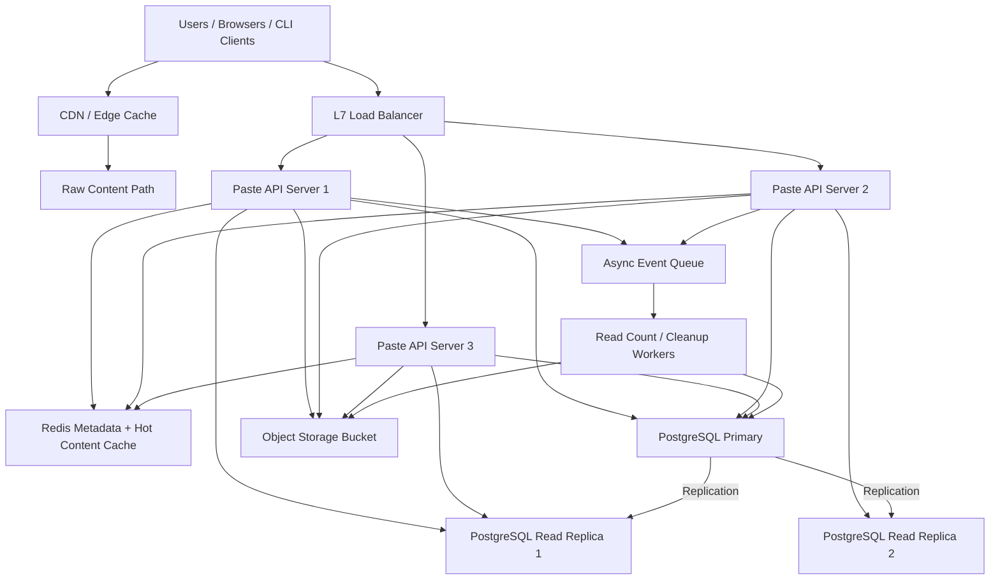
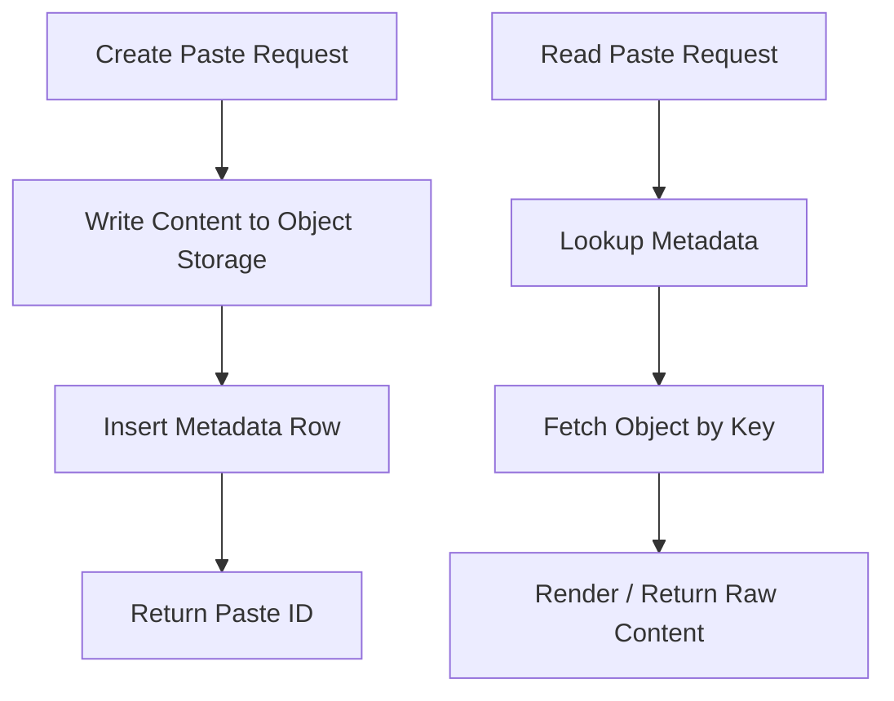

# System Design: Pastebin / Code Sharing Service

> Design a Pastebin-style service that stores 60M new pastes per month, serves 6B paste reads per month, supports expiration, and keeps raw content retrieval fast worldwide.

---

## Concepts Covered

- **Concept 01** - Horizontal vs Vertical Scaling & Auto-scaling
- **Concept 03** - CDN & Edge Computing
- **Concept 05** - API Design Patterns
- **Concept 06** - SQL Databases at Scale
- **Concept 10** - Caching Strategies
- **Concept 12** - Data Modeling for Scale
- **Concept 19** - Fault Tolerance Patterns
- **Concept 21** - Monitoring, Observability & SLOs/SLAs
- **Concept 23** - Blob/Object Storage Patterns

---

## Step 1: Requirements & Scope

### Functional Requirements

- **Create a paste**: Users can submit arbitrary text or code snippets and receive a shareable URL. This is the primary write path and the whole product starts here.
- **Read a paste by ID**: Anyone with the link can view the paste in a rendered page. This is the dominant read path because shared links are the main product surface.
- **Fetch raw paste content**: Clients should be able to retrieve raw text without HTML wrapping. This matters for CLI usage, API integration, and syntax-aware tooling.
- **Support expiration**: A paste can expire after a configured TTL such as 10 minutes, 1 day, or 30 days. This is important because many use cases are temporary sharing, not permanent archival.
- **Optional burn-after-read mode**: Some pastes should disappear after a single successful read. This is a specialized but common feature for secret or one-time sharing behavior.
- **Support syntax metadata**: A paste may include a language hint like `python` or `json`. This improves rendering but should not affect the core storage design.
- **Delete or disable pastes**: Abuse response and user error correction require moderation and administrative delete capabilities.

### Non-Functional Requirements

- **Availability target**: 99.95% for paste retrieval. A paste-sharing product is judged mostly by whether links open reliably.
- **Read latency**: Under 100ms p99 for metadata and under 200ms p99 end-to-end for raw content retrieval, excluding end-user network distance.
- **Write latency**: Under 300ms p99 for normal paste creation. Users tolerate slightly slower writes, but the flow should still feel instant.
- **Scale target**: 60M new pastes per month and 6B reads per month. The system is read-heavy, but the payload size is materially larger than a URL shortener because each object contains actual text content.
- **Durability**: Once a paste is acknowledged, it should not disappear unless it expires, is deleted, or violates policy.
- **Consistency**: Strong consistency for create and delete operations. Eventual consistency is acceptable for secondary counters and CDN invalidation.
- **Security posture**: Prevent serving malware or obvious abuse payloads at scale, and allow fast takedown. We are not building a full content-moderation system, but the design must support safety controls.

### Out of Scope

- **Full user accounts and collaboration**: We are designing anonymous or light-auth sharing, not a GitHub competitor.
- **Version history and diffing**: Useful, but it turns the product into a more complex document system.
- **Search across all public pastes**: That would require a dedicated indexing subsystem and a very different abuse posture.
- **End-to-end secret encryption**: We may support private or burn-after-read semantics, but full zero-knowledge secret storage is a separate product design.
- **Rich code execution or preview environments**: Rendering is enough; we are not building an online IDE.

The central system-design problem here is not just text storage. It is separating metadata from content cleanly, using object storage and CDN behavior intelligently, and handling expiration without turning cleanup into operational pain.

---

## Step 2: Back-of-Envelope Estimation

We need to estimate two different storage planes: metadata and content blobs. That difference is the heart of the design.

### Traffic Estimation

Assumptions:
- New pastes per month: `60,000,000`
- Reads per month: `6,000,000,000`
- Peak multiplier: `3x`

Write QPS:
```text
60,000,000 / 30 days = 2,000,000 pastes/day
2,000,000 / 86,400 = 23.15 writes/sec average
Peak write QPS = 23.15 x 3 = 69.45 writes/sec
```

Read QPS:
```text
6,000,000,000 / 30 days = 200,000,000 reads/day
200,000,000 / 86,400 = 2,314.81 reads/sec average
Peak read QPS = 2,314.81 x 3 = 6,944.43 reads/sec
```

Read:write ratio:
```text
6,000,000,000 / 60,000,000 = 100:1
```

This is again read-heavy, but compared with a URL shortener, each read can involve tens of KB instead of a tiny redirect response. That changes cost and caching strategy significantly.

### Storage Estimation

Assume average paste size:
```text
Average content size = 12 KB
Metadata per paste:
  paste_id           8 bytes
  object_key         64 bytes
  title / hint       64 bytes
  language           16 bytes
  created_at         8 bytes
  expires_at         8 bytes
  status / flags     8 bytes
  read_count         8 bytes
  row/index overhead 216 bytes
--------------------------------
  total metadata     ~400 bytes
```

Content storage:
```text
60,000,000 x 12 KB = 720,000,000 KB/month
= 720 GB/month

720 GB x 12 = 8.64 TB/year
8.64 TB x 5 = 43.2 TB over 5 years
```

With 3x replicated object storage:
```text
43.2 TB x 3 = 129.6 TB effective footprint
```

Metadata storage:
```text
60,000,000 x 400 bytes = 24,000,000,000 bytes/month
= 24 GB/month

24 GB x 12 = 288 GB/year
288 GB x 5 = 1.44 TB

With 3x replication = 4.32 TB
```

This is exactly why we separate metadata from content. The object store carries most of the bytes. The relational database stores the lookup-friendly control plane.

### Bandwidth Estimation

Write bandwidth:
```text
Peak writes/sec = 69.45
Average payload ~= 12 KB content + 1 KB request overhead
= 13 KB

Ingress = 69.45 x 13 KB = 902.85 KB/sec
```

Read bandwidth:
```text
Peak reads/sec = 6,944.43
Average payload delivered = 12 KB

Egress = 6,944.43 x 12 KB = 83,333.16 KB/sec
= 81.38 MB/sec
```

That is raw origin egress. With a healthy CDN hit rate, actual origin egress can drop dramatically for popular public pastes.

### Memory Estimation (for caching)

Suppose we cache metadata for the hottest 20% of the last 90 days and raw content for the hottest 2% of those same objects.

Metadata cache:
```text
60,000,000/month x 3 months = 180,000,000 pastes
Hot metadata set = 180,000,000 x 20% = 36,000,000
Memory per metadata entry ~= 500 bytes
36,000,000 x 500 bytes = 18,000,000,000 bytes
= 18 GB
```

Content cache:
```text
Hot content set = 180,000,000 x 2% = 3,600,000 pastes
Each content blob = 12 KB
3,600,000 x 12 KB = 43,200,000 KB
= 41.2 GB
```

So a reasonable first target is:
- `20 GB` for metadata cache
- `45 GB` for raw content cache
- plus safety headroom, so roughly `80 GB` usable cache cluster memory

### Summary Table

| Metric | Value |
|--------|-------|
| Write QPS (average) | ~23 |
| Write QPS (peak) | ~69 |
| Read QPS (average) | ~2,315 |
| Read QPS (peak) | ~6,944 |
| Content storage (5 years) | ~43.2 TB |
| Content storage with replication | ~129.6 TB |
| Metadata storage with replication | ~4.32 TB |
| Peak origin egress | ~81.38 MB/sec |
| Cache memory target | ~80 GB |

---

## Step 3: API Design

The API is split between a public share surface and a more explicit control API. That is common in content-sharing products because browser reads are often routed differently from authenticated management calls.

Cross-reference: **Concept 05 - API Design Patterns**.

### Create Paste

```
POST /api/v1/pastes
```

**Parameters:**
| Parameter | Type | Required | Description |
|-----------|------|----------|-------------|
| content | string | Yes | Raw text or code snippet |
| title | string | No | Optional display title |
| language | string | No | Syntax hint such as `python` or `json` |
| expires_at | string (ISO 8601) | No | Expiration time |
| burn_after_read | boolean | No | Delete after first successful retrieval |
| privacy | string | No | `public`, `unlisted`, or `private` |

**Response:**
```json
{
  "paste_id": "9f2Kx7Qa",
  "url": "https://paste.example/9f2Kx7Qa",
  "raw_url": "https://paste.example/raw/9f2Kx7Qa",
  "created_at": "2026-03-20T12:00:00Z",
  "expires_at": null
}
```

**Design Notes:** We return both rendered and raw URLs because they are different access patterns. The request body includes content directly for simplicity; for very large payloads we could move to presigned uploads later, but that is unnecessary for our current size envelope.

### Get Rendered Paste

```
GET /{paste_id}
```

**Parameters:**
| Parameter | Type | Required | Description |
|-----------|------|----------|-------------|
| paste_id | string | Yes | Public paste identifier |

**Response:**
```json
{
  "paste_id": "9f2Kx7Qa",
  "title": "Example snippet",
  "language": "python",
  "content": "print('hello world')",
  "created_at": "2026-03-20T12:00:00Z"
}
```

**Design Notes:** The actual web product may render HTML, syntax highlighting, and headers. Logically, the endpoint fetches metadata plus content and returns a page representation. The important design point is that the lookup begins with metadata and resolves to blob content.

### Get Raw Paste

```
GET /raw/{paste_id}
```

**Parameters:**
| Parameter | Type | Required | Description |
|-----------|------|----------|-------------|
| paste_id | string | Yes | Paste identifier |

**Response:**
```json
{
  "content_type": "text/plain",
  "content": "print('hello world')"
}
```

**Design Notes:** This is the path most likely to benefit from CDN caching, because the payload is static text and the output is deterministic.

### Delete Paste

```
DELETE /api/v1/pastes/{paste_id}
```

**Parameters:**
| Parameter | Type | Required | Description |
|-----------|------|----------|-------------|
| paste_id | string | Yes | Paste identifier |

**Response:**
```json
{
  "status": "deleted"
}
```

### Error and Rate-Limit Behavior

- `400 Bad Request` for oversized payloads or malformed expiration settings
- `403 Forbidden` for unauthorized delete or private read
- `404 Not Found` for unknown or already deleted pastes
- `410 Gone` for expired pastes
- `429 Too Many Requests` for abusive create/read volume

We stick with REST because the surface area is simple and resource-oriented. GraphQL would add complexity for no real gain, and gRPC is unnecessary for public browser traffic.

---

## Step 4: Data Model

### Database Choice

We will use **PostgreSQL for metadata** and **object storage for content blobs**.

Why split them:
- Metadata queries want indexes, TTL scans, moderation flags, and small-row lookups. That is a relational-database problem.
- Paste content is immutable, larger, and perfect for cheap durable blob storage. That is an object-storage problem.
- Keeping big text bodies out of PostgreSQL reduces bloat, vacuum pressure, and read amplification on metadata queries.

We considered storing everything in PostgreSQL with a `TEXT` column. That works for small systems and is honestly fine for an MVP. But at the scale in our estimate, large bodies dominate storage and I/O. Using object storage follows the patterns in **Concept 23 - Blob/Object Storage Patterns** and keeps the relational control plane lean.

### Schema Design

```text
Table: pastes
├── paste_id          VARCHAR(16)     PRIMARY KEY         -- Public identifier
├── object_key        VARCHAR(128)    NOT NULL UNIQUE     -- Blob store key
├── title             VARCHAR(256)    NULLABLE            -- Optional display label
├── language          VARCHAR(32)     NULLABLE            -- Syntax hint
├── privacy           SMALLINT        NOT NULL            -- Public, unlisted, private
├── burn_after_read   BOOLEAN         NOT NULL DEFAULT 0  -- One-time read semantics
├── status            SMALLINT        NOT NULL            -- Active, deleted, expired, disabled
├── created_at        TIMESTAMP       NOT NULL
├── expires_at        TIMESTAMP       NULLABLE
├── read_count        BIGINT          NOT NULL DEFAULT 0
│
├── INDEX: idx_pastes_expires ON (expires_at) WHERE expires_at IS NOT NULL
├── INDEX: idx_pastes_status_created ON (status, created_at)
└── INDEX: idx_pastes_privacy_created ON (privacy, created_at)
```

If private pastes or owner-managed pastes become a first-class feature, we can add:

```text
Table: paste_access
├── paste_id          VARCHAR(16)     NOT NULL
├── owner_id          BIGINT          NOT NULL
├── secret_token      VARCHAR(64)     NULLABLE
└── PRIMARY KEY (paste_id, owner_id)
```

### Access Patterns

- **Read metadata by paste ID**: primary key lookup on `pastes`
- **Resolve to blob object key**: same metadata read provides `object_key`
- **Create paste**: insert metadata row after object storage write succeeds
- **Expire or delete pastes**: scan by partial expiration index or by moderation status
- **Count reads**: increment asynchronously or with batched aggregation

This is another textbook example of access-pattern-driven design. The database row tells us what the object is, what its lifecycle state is, and where the actual bytes live. The blob store does not need to support rich queries because the database already answers those.

---

## Step 5: High-Level Architecture

### Mermaid Diagram



### Architecture Walkthrough

The first thing to notice in this architecture is that we have two different read paths. One goes through the general application tier for metadata-rich rendered pages. The other goes through CDN-assisted raw content delivery for static text. That split is the key optimization because not every paste read needs the full application stack.

Start with paste creation. A user submits content to the load balancer, which routes the request to a stateless API server. The API server validates content size, allowed formats, expiration rules, and abuse limits. Then it writes the paste body to object storage and only after that succeeds does it insert the metadata row into PostgreSQL. That ordering matters. If we insert metadata first and the blob write fails, we create dangling records. If the blob write succeeds and the metadata insert fails, we can safely garbage-collect the orphaned object later because it is not discoverable.

Once the metadata insert succeeds, the API server returns the shareable URLs. The write path is not particularly high QPS, so we optimize it for clean sequencing and failure handling rather than raw throughput. Object storage is doing the heavy lifting for durability of the content bytes, while PostgreSQL is tracking the paste's lifecycle and lookup identity.

Now take the common read path for a rendered paste page. The browser hits the load balancer and lands on an API server. That server first checks Redis for metadata and, when useful, possibly the raw content too. If the metadata is cached, we avoid the database entirely. If it misses, the server fetches metadata from a PostgreSQL read replica. The database row tells us whether the paste is active, expired, private, or burn-after-read, and it also tells us the object key in blob storage.

If the raw content itself is also cached, the server assembles the rendered response immediately. If not, it fetches the object from blob storage, possibly stores a hot copy in Redis, and renders the response. This is where **Concept 10 - Caching Strategies** and **Concept 23 - Blob/Object Storage Patterns** come together. The metadata lookup is tiny and relational. The content fetch is larger and blob-oriented. Redis sits in between to protect both the database and the object store from repetitive hot reads.

The raw-content path is even more interesting. If a client requests `/raw/{paste_id}`, we want the CDN to serve it whenever possible. Text pastes are immutable once created, so they are perfect CDN candidates. The edge cache can store the raw object for a TTL, dramatically reducing origin traffic for hot public pastes. When the CDN misses, it fetches from the raw content path behind the load balancer or directly from object storage via a controlled origin integration. This is exactly the kind of workload described in **Concept 03 - CDN & Edge Computing**.

Burn-after-read and expiration behavior create additional control-plane logic. The application server cannot just let a CDN cache everything forever, because some pastes are intentionally ephemeral. For burn-after-read pastes, the first successful read must flip lifecycle state in PostgreSQL, remove or invalidate the object, and evict caches. That means we often bypass aggressive CDN caching for that category or use signed short-lived URLs with very small TTLs. In other words, caching strategy is not one-size-fits-all. It depends on product semantics.

Read counters and cleanup tasks are asynchronous. When a paste is read, the app server emits an event rather than synchronously incrementing the row every time. Aggregation workers batch read-count updates and also run expiration scans. Expiration workers identify rows whose TTL has elapsed, mark them expired, and delete or lifecycle-transition the corresponding object-store keys. That asynchronous approach keeps user-facing reads fast while still maintaining decent operational hygiene.

Failure behavior is easier to reason about because responsibilities are separated. If Redis is down, reads get slower but still work through PostgreSQL plus object storage. If PostgreSQL primary is unavailable, new paste creation and status changes degrade, but existing public raw pastes may still be served from CDN for a while. If object storage has a regional issue, metadata remains intact and the system can return a clear degraded error instead of silently serving broken content. That separation of planes is what makes the system operable.

Finally, the stateless API layer means we can scale horizontally without sticky sessions. One server handling a hot paste today and another tomorrow changes nothing because the state lives in PostgreSQL, Redis, object storage, and the CDN. That is the same boring, resilient pattern we want in most internet-facing systems.

---

## Step 6: Deep Dives

### Deep Dive 1: Metadata Versus Content Separation

This is the architectural decision that defines the whole service. If we store metadata and content together in one relational row, the system is simpler at first but gradually more painful to operate. Large text bodies bloat indexes, increase backup size, and make hot metadata queries touch more storage than necessary.

By separating them, we get:
- cheap durable content storage
- fast metadata lookups
- cleaner CDN integration
- easier lifecycle policies for expired objects

### Mermaid Diagram



### Diagram Walkthrough

The top half of the diagram shows the write ordering. We first write content bytes to object storage, then insert the metadata row. That protects us from discoverable broken references. If object storage fails, there is no metadata row and therefore no public paste. If the metadata insert fails, the blob may exist temporarily but the cleanup process can safely remove it because nothing points to it.

The bottom half shows the read flow. We always start with metadata, not with blob lookup. That is because metadata tells us whether the paste still exists, whether it is private, whether it is burned or expired, and which object key to fetch. The blob store is just a durable byte container. It does not know the product semantics.

This pattern is the storage equivalent of separating control plane from data plane. PostgreSQL answers "what is this object and is it allowed?" The object store answers "here are the bytes." That division is what keeps the system clean as it grows.

Cross-reference: **Concept 12 - Data Modeling for Scale** and **Concept 23 - Blob/Object Storage Patterns**.

### Deep Dive 2: Expiration and Lifecycle Cleanup

Expiration looks easy until you think about all the places a paste can live. There is metadata in PostgreSQL, content in object storage, maybe a hot copy in Redis, and maybe a cached copy at the CDN edge. If a paste expires at exactly 12:00 PM, do all of those disappear instantly? In real systems, no. We aim for bounded staleness and clear semantics.

Our approach:
- PostgreSQL is the source of truth for lifecycle state.
- API reads check metadata state before serving the paste.
- Object storage objects are deleted asynchronously.
- Redis entries are deleted immediately on state transition.
- CDN uses TTLs and, for sensitive categories, much shorter cache lifetimes.

That means an expired paste will stop being served correctly as soon as the metadata state flips, even if the object still exists for a short cleanup window in blob storage. This is a powerful example of why metadata should stay authoritative. Deleting bytes alone is not enough if caches still think the paste exists.

Burn-after-read is even trickier. We need an atomic-enough flow where the first successful read transitions the metadata, invalidates caches, and schedules blob deletion. In practice this is usually implemented with a conditional update on the metadata row so only one reader wins the state transition.

### Deep Dive 3: CDN Strategy for Raw Content

A CDN is not equally useful for every request type here. It is extremely useful for public immutable raw text. It is much less useful for private, burn-after-read, or short-expiry content. So we do not blindly put the entire product behind one generic cache policy.

For public raw pastes:
- set a CDN-friendly cache key based on paste ID
- attach a TTL, for example 10 minutes to 1 hour
- allow edge revalidation or stale-while-revalidate if needed

For sensitive or short-lived pastes:
- bypass or sharply limit CDN caching
- rely on origin checks for lifecycle correctness
- possibly use signed URLs if privacy matters

This is the practical version of **Concept 03 - CDN & Edge Computing**. The CDN is great when product semantics align with immutable public bytes. It is dangerous when lifecycle or access control is dynamic.

### Deep Dive 4: Abuse Controls and Payload Limits

Paste services attract abuse: malware links, credential dumps, spam, and oversized junk payloads. That does not mean the core design must become a full moderation platform, but it does mean we need hooks for safety.

Useful boring controls include:
- per-IP and per-token creation rate limits
- maximum payload size enforcement at the edge
- simple content-classification flags written into metadata
- moderator-driven disable flows
- raw-content serving with safe content headers

The key design point is that moderation state lives in metadata, because that is where read permission is decided. Once again, control plane first, byte plane second.

---

## Step 7: Bottlenecks & Scaling

### Identifying Bottlenecks

At `10x` scale, the first problem is usually not PostgreSQL writes. It is origin bandwidth from object storage and cache pressure for hot content. If a few public pastes suddenly go viral and the CDN hit rate is poor, the blob origin sees repeated text downloads and tail latency rises. The metric to watch is origin egress, not just request count.

At `10x`, metadata lookups can also start to stress read replicas if Redis hit rate drops. That happens when the working set becomes much larger than the cache or when too many pastes have short, bursty popularity windows. Cache hit ratio below roughly 85% is an early warning sign.

At `100x`, the cleanup system itself becomes important. Expiration scans, object deletions, and CDN invalidation rates can form their own operational subsystem. A product with many short-lived pastes is effectively running a continuous lifecycle engine in the background.

### Scaling Solutions

| Bottleneck | Solution | Impact | New Ceiling | Cross-reference |
|------------|----------|--------|-------------|-----------------|
| Origin egress on hot public pastes | Increase CDN coverage and tune edge TTLs | Shifts repetitive reads away from origin | 10x to 100x less origin traffic for hot content | Concept 03 |
| Metadata cache misses | Expand Redis and introduce separate metadata/content tiers | Protects replicas from bursty reads | Higher stable read throughput | Concept 10 |
| Read replica pressure | Add replicas and use adaptive routing | Keeps lookup latency stable | Linear-ish read scaling | Concept 06 |
| Cleanup backlog | Partition lifecycle workers by date bucket | Prevents expiration tasks from starving | Predictable TTL enforcement | Concept 25 |

### Failure Scenarios

- **CDN outage or bypass**: More reads hit origin directly. The system stays up but origin bandwidth and latency increase.
- **Object storage slowdown**: Metadata still resolves, but content fetches slow or fail. We can return graceful errors rather than hanging indefinitely.
- **PostgreSQL primary outage**: New creates, deletes, and lifecycle transitions degrade, but already cached public reads may continue.
- **Redis outage**: Reads fall back to database plus object store, increasing latency but not necessarily total downtime.
- **Cleanup worker lag**: Expired pastes may linger in storage temporarily, but if metadata state is authoritative they should still stop serving correctly.

This is a good place to emphasize that scaling is not just "add more app servers." Here, bytes and lifecycle complexity dominate long before CPU on the application fleet does.

---

## Step 8: Monitoring & Alerting

### Key Metrics to Track

Business metrics:
- Pastes created per minute
- Read volume by rendered versus raw path
- Expired and burn-after-read completions
- Moderation disable events

Infrastructure metrics:
- CDN hit ratio
- Origin egress bandwidth
- Redis hit ratio for metadata and content
- PostgreSQL read and write latency
- Object storage fetch latency and error rate
- Cleanup queue depth and expiration lag

### SLOs

- **Public paste retrieval availability**: 99.95%
- **Rendered page latency**: 99% under 200ms at origin
- **Raw content latency**: 99% under 150ms from origin, with faster edge delivery when cached
- **Paste creation success**: 99.9% under 300ms
- **Expiration correctness**: 99.9% of expired pastes stop serving within 5 minutes of TTL

### Alerting Rules

- **CRITICAL**: Origin read error rate > 2% for 5 minutes
- **WARNING**: CDN hit ratio drops below 70% for 15 minutes
- **CRITICAL**: PostgreSQL primary unavailable
- **WARNING**: Cleanup backlog exceeds 30 minutes of expected work
- **CRITICAL**: Object storage p99 fetch latency > 1 second
- **WARNING**: Redis metadata hit ratio < 80% for 15 minutes

Cross-reference: **Concept 21 - Monitoring, Observability & SLOs/SLAs**.

---

## Summary

### Key Design Decisions

1. **Separate metadata from content** so PostgreSQL stays small and queryable while object storage handles large immutable bytes cheaply.
2. **Use CDN aggressively for public raw content** because repetitive text reads are a perfect edge-caching workload.
3. **Keep lifecycle state authoritative in metadata** so expiration, moderation, and burn-after-read behavior remain correct even when caches exist.
4. **Use Redis for hot metadata and selected hot content** to protect both the database and object store.
5. **Treat cleanup as a first-class subsystem** because TTL-heavy workloads create real background operational pressure.

### Top Tradeoffs

1. **Object storage plus metadata DB versus one relational store**: We accept extra architectural complexity in exchange for far better scaling and storage cost behavior.
2. **CDN performance versus lifecycle precision**: Public immutable content benefits hugely from caching, but sensitive or short-lived pastes need stricter control and lower cacheability.
3. **Asynchronous cleanup versus immediate deletion everywhere**: We accept bounded staleness in storage cleanup so reads stay fast and the system remains operationally simple.

### Alternative Approaches

- For a small internal paste tool, one PostgreSQL table with inline `TEXT` content is simpler and probably the right answer.
- For very large or media-rich pastes, presigned direct uploads to object storage would reduce API-server bandwidth further.
- If discovery and search became important, we would introduce a search index over paste metadata and selected content, but that would materially change the abuse posture of the product.

The design lesson here is that Pastebin is not just "store some text." It is really a storage-tiering problem. Once you understand that metadata, content bytes, CDN behavior, and lifecycle state are distinct concerns, the architecture becomes much more obvious and much easier to operate.
