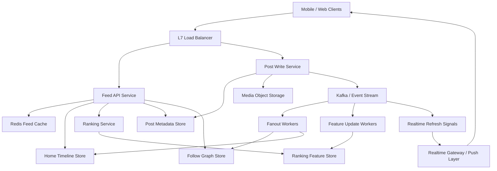
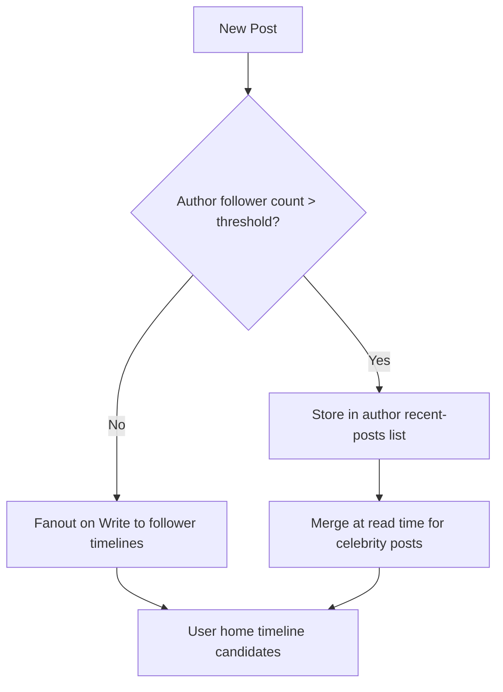

# System Design: Instagram News Feed

> Design an Instagram-style home feed that serves 5B feed reads per day, ingests 120M new posts per day, ranks content in near real time, and handles celebrity fanout without melting the system.

---

## Concepts Covered

- **Concept 01** - Horizontal vs Vertical Scaling & Auto-scaling
- **Concept 02** - Load Balancing Deep Dive
- **Concept 07** - NoSQL Deep Dive
- **Concept 10** - Caching Strategies
- **Concept 12** - Data Modeling for Scale
- **Concept 13** - Synchronous vs Asynchronous Communication Patterns
- **Concept 14** - Message Queues & Stream Processing
- **Concept 15** - Event-Driven Architecture & Event Sourcing
- **Concept 16** - Real-time Communication
- **Concept 21** - Monitoring, Observability & SLOs/SLAs
- **Concept 22** - Microservices vs Monolith
- **Concept 23** - Blob/Object Storage Patterns

---

## Step 1: Requirements & Scope

### Functional Requirements

- **Users can create posts with media and captions**: This is the main write path. A feed system without a reliable post-ingestion flow is just a ranking toy.
- **Users can retrieve a personalized home feed**: The home feed should contain content from followed accounts plus ranked recommendations or freshness adjustments. This is the core read path and the most important product surface.
- **Users can follow and unfollow accounts**: Feed generation depends on the social graph, so follow state is a foundational input, not a side feature.
- **Users can paginate older feed items**: Infinite scroll means we need cursor-based pagination and stable ordering guarantees.
- **Users can see engagement signals**: Like count, comment count, and light interaction metadata help ranking and presentation, even if the authoritative systems for likes and comments live elsewhere.
- **Users can see reasonably fresh posts soon after upload**: The product feels broken if someone posts and their followers cannot see it for minutes.
- **Users can handle celebrity or high-follower accounts**: One global feed design that ignores hot-account behavior will fail the first time a very large account posts.

### Non-Functional Requirements

- **Availability target**: 99.99% for feed reads. This is a primary product path and cannot be treated as a best-effort feature.
- **Feed latency**: p99 under 200ms for the first page of the home feed. Users expect the app to open instantly.
- **Post creation latency**: p99 under 500ms to acknowledge upload metadata, even though fanout and ranking may continue asynchronously.
- **Scale**: 250M daily active users, 5B feed reads/day, and 120M new posts/day.
- **Freshness**: New posts from normal accounts should appear in follower feeds within a few seconds. Large celebrity accounts may use slightly delayed or hybrid serving to protect the system.
- **Consistency**: Follow/unfollow changes and post ownership require strong correctness, but feed ordering and ranking can be eventually consistent.
- **Durability**: Posts, feed edges, and ranking features should survive node failures without user-visible data loss.

### Out of Scope

- **Stories, reels, and live video**: Those are adjacent feed products with different ranking and delivery constraints.
- **Ad-serving architecture**: Ads affect feed ranking but deserve their own system design.
- **Comment and like write paths**: We will reference engagement signals, but we are not fully designing those subsystems here.
- **Search, explore, and hashtag discovery**: Those are separate retrieval products, not the home feed itself.
- **Content moderation pipeline**: Important in reality, but not central to the fanout and ranking design we are focusing on.

The key challenge is balancing freshness, ranking quality, and operational cost. The home feed is one of the classic places where a naive "just query the latest posts from everyone a user follows" approach stops working very quickly.

---

## Step 2: Back-of-Envelope Estimation

A feed system is tricky because raw QPS is only part of the problem. Fanout multiplication and ranking-state maintenance usually dominate cost.

### Traffic Estimation

Assumptions:
- Daily active users: `250,000,000`
- Feed opens per active user per day: `20`
- New posts per day: `120,000,000`
- Peak multiplier: `3x`

Feed reads:
```text
250,000,000 x 20 = 5,000,000,000 feed reads/day
5,000,000,000 / 86,400 = 57,870.37 reads/sec average
Peak read QPS = 57,870.37 x 3 = 173,611.11 reads/sec
```

Post writes:
```text
120,000,000 / 86,400 = 1,388.89 posts/sec average
Peak post write QPS = 1,388.89 x 3 = 4,166.67 posts/sec
```

Read-to-write ratio:
```text
5,000,000,000 / 120,000,000 = 41.67:1
```

That is still read-heavy, but the critical insight is that each write can explode into many downstream feed updates. So the effective internal write amplification is much higher than 4,167 post creates per second.

### Storage Estimation

Post metadata:
```text
post_id             8 bytes
author_id           8 bytes
caption             200 bytes average
media refs          120 bytes
created_at          8 bytes
visibility flags    8 bytes
engagement summary  24 bytes
overhead / indexes  648 bytes
--------------------------------
~1 KB per post record
```

Post storage:
```text
120,000,000 posts/day x 1 KB = 120 GB/day
120 GB/day x 365 = 43.8 TB/year
5 years = 219 TB metadata/logical footprint
```

Media bytes live elsewhere in blob storage, so we are only sizing feed-related metadata here.

Feed edge storage:

If we naively fan out every post to an average of 200 followers:
```text
120,000,000 posts/day x 200 = 24,000,000,000 feed edges/day
```

At 32 bytes per edge:
```text
24,000,000,000 x 32 bytes = 768,000,000,000 bytes/day
= 768 GB/day
```

That is already huge, and it gets absurd for celebrities. This is exactly why we need a hybrid fanout strategy rather than blindly precomputing everything.

Suppose we precompute only for non-celebrity accounts and maintain recent home timelines for the top 50M active users:
```text
50,000,000 users x 500 feed entries/user x 32 bytes
= 800,000,000,000 bytes
= 800 GB hot timeline storage
```

That is large but entirely reasonable for a distributed timeline store or cache-backed feed index.

### Bandwidth Estimation

For the first page of feed reads, suppose the app requests 20 items and the API returns lightweight metadata only, not full media bytes.

```text
Average feed page metadata payload = 20 items x 1 KB/item = 20 KB
Peak feed read QPS = 173,611

173,611 x 20 KB = 3,472,220 KB/sec
= 3.31 GB/sec metadata egress
```

That sounds large, but remember media delivery goes through CDN and object storage, not the feed API response. If the feed service had to inline full media payloads, it would be impossible to operate cleanly.

### Memory Estimation (for caching)

Assume we keep:
- hot home-feed pages for 10M most active users
- 3 cached pages per user
- 20 KB per page

```text
10,000,000 x 3 x 20 KB = 600,000,000 KB
= 572.2 GB
```

That is too large for a single cache tier but very reasonable for a distributed Redis cluster or a specialized timeline cache. It also tells us that we cannot cache every possible page for every user. We need to cache the hot slice and use timeline stores plus ranking services for misses.

### Summary Table

| Metric | Value |
|--------|-------|
| Feed reads/day | 5B |
| Feed read QPS (average) | ~57,870 |
| Feed read QPS (peak) | ~173,611 |
| Post create QPS (average) | ~1,389 |
| Post create QPS (peak) | ~4,167 |
| Post metadata growth/year | ~43.8 TB |
| Hot timeline storage target | ~800 GB |
| Hot feed-page cache target | ~572 GB |

---

## Step 3: API Design

This service sits behind mobile and web clients, so a REST API with cursor-based pagination is the simplest clear surface. Internally, ranking services may use RPC, but externally the product maps well to resource-oriented HTTP.

Cross-reference: **Concept 05 - API Design Patterns**.

### Create Post

```
POST /api/v1/posts
```

**Parameters:**
| Parameter | Type | Required | Description |
|-----------|------|----------|-------------|
| media_ids | array<string> | Yes | References to uploaded media objects |
| caption | string | No | Post caption text |
| visibility | string | No | Public, followers-only, etc. |
| client_timestamp | string | No | Helps with ordering diagnostics |

**Response:**
```json
{
  "post_id": "p_9823412",
  "author_id": "u_7712",
  "created_at": "2026-03-20T12:00:00Z",
  "fanout_status": "queued"
}
```

**Design Notes:** We acknowledge the post once it is durably stored and the fanout event is queued. We do not block the client on the entire feed-distribution process.

### Get Home Feed

```
GET /api/v1/feed/home?cursor=abc123&limit=20
```

**Parameters:**
| Parameter | Type | Required | Description |
|-----------|------|----------|-------------|
| cursor | string | No | Pagination cursor for the next page |
| limit | integer | No | Page size, default 20, max 50 |
| ranking_mode | string | No | Optional client hint like `default` or `latest` |

**Response:**
```json
{
  "items": [
    {
      "post_id": "p_9823412",
      "author_id": "u_7712",
      "caption_preview": "Weekend trip",
      "media_preview_urls": ["https://cdn.example/m/1.jpg"],
      "score": 0.984,
      "created_at": "2026-03-20T11:58:00Z"
    }
  ],
  "next_cursor": "abc124"
}
```

**Design Notes:** The client gets ranked feed items plus lightweight media previews, not the original media bytes. Cursor pagination is essential because offset pagination becomes unstable and expensive in constantly mutating ranked feeds.

### Follow / Unfollow

```
POST /api/v1/users/{target_user_id}/follow
DELETE /api/v1/users/{target_user_id}/follow
```

**Parameters:**
| Parameter | Type | Required | Description |
|-----------|------|----------|-------------|
| target_user_id | string | Yes | Account to follow or unfollow |

**Response:**
```json
{
  "status": "following"
}
```

**Design Notes:** Follow changes are important because they alter fanout targets and ranking candidate generation. They need to be durable and low latency, though feed convergence can still be eventually consistent by a short window.

### Refresh Feed Candidates

```
POST /api/v1/feed/home/refresh
```

**Parameters:**
| Parameter | Type | Required | Description |
|-----------|------|----------|-------------|
| reason | string | No | Client hint such as app_open or pull_to_refresh |

**Response:**
```json
{
  "status": "refresh_queued"
}
```

**Design Notes:** This endpoint is optional but helpful for explicit refresh semantics when the system wants to rebuild or rerank a hot user's feed asynchronously.

Error handling:
- `400` for malformed cursor or invalid parameters
- `401/403` for auth issues
- `404` for unknown users or posts
- `429` for abusive follow/post patterns

---

## Step 4: Data Model

### Database Choice

A news feed almost never lives cleanly in one database. We will use a hybrid model:

- **Post metadata store**: a sharded NoSQL store such as Cassandra or a well-partitioned wide-column store for high write throughput and cheap reads by `post_id`
- **Social graph store**: a sharded relational or graph-friendly store for follower edges
- **Home timeline store**: a wide-column or feed-index store optimized for appends and recent-item retrieval
- **Blob/object storage**: media bytes such as images and video thumbnails

Why not one relational database for everything? Because feed systems are not just "rows in tables." We need append-heavy per-user timelines, huge follow-edge sets, and cheap lookup by post ID. This is exactly the territory of **Concept 07 - NoSQL Deep Dive** and **Concept 12 - Data Modeling for Scale**.

### Schema Design

```text
Table / Collection: posts
├── post_id            UUID / BIGINT     PRIMARY KEY       -- Unique post identifier
├── author_id          BIGINT            NOT NULL          -- Post owner
├── caption            TEXT              NULLABLE          -- Caption text
├── media_keys         LIST<TEXT>        NOT NULL          -- Blob references
├── visibility         SMALLINT          NOT NULL          -- Visibility policy
├── created_at         TIMESTAMP         NOT NULL
├── rank_features      MAP<TEXT, FLOAT>  NULLABLE          -- Precomputed features
└── PARTITION / SHARD: hash(post_id)
```

```text
Table: follow_edges
├── follower_id        BIGINT            NOT NULL
├── followee_id        BIGINT            NOT NULL
├── created_at         TIMESTAMP         NOT NULL
└── PRIMARY KEY (follower_id, followee_id)
```

```text
Table / Collection: home_timeline
├── user_id            BIGINT            PARTITION KEY     -- Feed owner
├── score_bucket       BIGINT            CLUSTER KEY       -- Ranking / ordering bucket
├── post_id            BIGINT            NOT NULL
├── author_id          BIGINT            NOT NULL
├── created_at         TIMESTAMP         NOT NULL
└── PRIMARY KEY (user_id, score_bucket, post_id)
```

### Access Patterns

- **Get post by ID**: lookup in `posts`
- **Get followed accounts for user**: lookup in `follow_edges`
- **Write feed edges for normal accounts**: append to many `home_timeline` partitions
- **Read recent home feed page**: read most recent N items from `home_timeline` for `user_id`
- **Hybrid celebrity fetch**: read recent celebrity posts at query time and merge with home timeline candidates

This data model tells the story clearly: the feed is not one query. It is the combination of a graph, a content store, and a materialized per-user recent timeline.

---

## Step 5: High-Level Architecture

### Mermaid Diagram



### Architecture Walkthrough

We should walk through this architecture in the order users actually feel it. First, someone posts. Later, someone opens the home feed and expects relevant content immediately. Those are different flows, and a good feed system treats them differently.

Start with the post-creation flow. The client sends a create-post request through the load balancer to the Post Write Service. The write service stores media in object storage and writes post metadata to the post store. Once the write is durable, it publishes a `post_created` event into Kafka or a similar event stream. That event is the handoff point between the simple write path and the expensive downstream distribution work. This is a concrete use of **Concept 13 - Synchronous vs Asynchronous Communication Patterns** and **Concept 14 - Message Queues & Stream Processing**. The user should not wait for millions of fanout writes before seeing success.

Fanout workers consume the `post_created` event. For normal accounts with follower counts below a threshold, they read follower IDs from the follow graph store and append feed entries into the home timeline store for those followers. The entry is lightweight: post ID, author ID, and maybe some early ranking features. We are not copying the whole post body into every follower's timeline. That would explode storage and update costs. Instead, we are materializing candidate references.

At the same time, feature-update workers update ranking features such as freshness, engagement priors, author affinity, or topic signals. These features land in a feature store or precomputed rank-feature table. The point is not to compute every ranking signal synchronously on feed read. Some signals can and should be incrementally maintained in the background.

Now switch to the feed-read flow. The client opens the app and hits the Feed API through the load balancer. The Feed API first checks Redis for a cached first page of the user's home feed. This is where latency is won. Highly active users often reopen the feed quickly, and the first page changes incrementally rather than completely. If we can serve a hot cached first page, p99 latency stays excellent.

If the cache misses or the page needs refresh, the Feed API reads the user's recent candidate set from the home timeline store. That store is optimized for exactly this lookup: "give me the newest or highest-scoring N feed references for user X." The API may also fetch additional candidates from celebrity authors or recommendation sources if the hybrid strategy says they were not fully pre-fanned out.

Those candidates then go to the ranking service. The ranking service combines timeline references, user-context signals, feature-store values, freshness, and maybe lightweight policy rules such as diversity constraints or "do not show too many posts from the same author in one screen." The output is a ranked list of candidate post IDs. The Feed API resolves the top items against the post store to fetch captions, media references, and presentable metadata, then returns the assembled feed page.

This two-stage approach matters. The home timeline store is not trying to be the final truth of ranking. It is a candidate store. The ranker is where the ordering logic lives. That separation is important operationally because candidate generation and ranking evolve at different speeds.

The hybrid treatment of celebrity accounts is the next major architectural point. If an account with 50 million followers posts, blindly writing that post into 50 million home timelines immediately is wasteful and dangerous. Instead, the fanout service marks that author as a "pull at read time" or "partial fanout" account. When followers open their feed, the Feed API or ranking service fetches recent celebrity posts from an author-centric store and merges them into the candidate set. This is why celebrity handling is fundamentally different from normal-account handling.

Realtime refresh is optional but valuable. A separate notification or gateway layer can push a "new posts available" signal to active clients. That does not mean we stream the entire ranked feed over WebSockets. It just means active clients can know a refresh is worth making. This is where **Concept 16 - Real-time Communication** helps without becoming the whole design.

Failure behavior is easier to understand once the responsibilities are separated. If Kafka is briefly unhealthy, post creation may degrade because downstream fanout cannot be queued reliably. If Redis is down, feed reads still work but become more expensive because we rebuild from timeline and ranking stores. If the ranking service is slow, we may serve a degraded "latest-first" feed from the candidate store rather than failing completely. That is a classic application of **Concept 19 - Fault Tolerance Patterns**.

Finally, notice that media delivery is not in the feed API core path. The feed response returns media references or preview URLs, but actual media bytes are served via CDN and object storage. That choice keeps feed latency bounded and avoids turning the timeline service into a media-serving bottleneck.

The big lesson from the architecture is that a modern news feed is not one database query. It is a pipeline: post ingestion, event propagation, candidate generation, ranking, caching, and selective realtime signaling. Each stage exists because the scale and skew of the product force it to.

---

## Step 6: Deep Dives

### Deep Dive 1: Fanout-on-Write Versus Fanout-on-Read

This is the central design tradeoff in news feed systems.

- **Fanout-on-write** means when a user posts, we immediately write candidate entries into follower timelines.
- **Fanout-on-read** means when a user opens the feed, we gather recent posts from followed authors and rank them live.

Fanout-on-write makes reads fast because the candidate set is precomputed. But it makes writes expensive and can explode for celebrity accounts. Fanout-on-read makes writes cheap, but feed reads become expensive and inconsistent because we have to gather recent posts across many followed authors in real time.

The practical answer is almost always **hybrid**.

### Mermaid Diagram



### Diagram Walkthrough

This diagram shows the branch that makes hybrid fanout work. When a post arrives, the system checks the author's follower-count bucket or dynamic popularity classification. If the author is below the threshold, the post goes through the normal fanout-on-write path and lands in follower home timelines quickly.

If the author is above the threshold, we do not blindly push the post into every follower timeline. Instead, we store it in an author-centric recent-post list. Then, when users read their feed, the candidate-generation layer merges in recent posts from those celebrity or high-fanout authors.

This approach does not eliminate cost. It moves cost from write time to read time for a carefully chosen subset of authors. That is the right trade because normal accounts remain fast and simple, while celebrity posts stop acting like denial-of-service events against the write path.

Cross-reference: **Concept 14 - Message Queues & Stream Processing** and **Concept 12 - Data Modeling for Scale**.

### Deep Dive 2: Feed Ranking Without Making the System Unreadable

A feed is not just reverse chronological ordering anymore. Users expect personalization, freshness, engagement awareness, and diversity. But ranking systems can easily become so complex that nobody can reason about them operationally.

The safe approach is multi-stage ranking:
- candidate generation from timeline store plus hybrid sources
- lightweight filtering and dedupe
- feature enrichment
- scoring
- business-policy adjustments

This keeps the first stage cheap and the expensive ranking work bounded to a small candidate pool, maybe a few hundred items. The feed service does not need to rank every possible post in the social graph. It only needs to rank a plausible candidate set.

The important system-design insight is that ranking quality is a function of both model quality and candidate quality. If candidate generation misses good posts, the model never gets a chance to rescue the result.

### Deep Dive 3: Caching the First Page Versus Caching Everything

Teams often say "just cache the feed," but that is too vague to be useful. A personalized feed is not one shared object. It is millions of per-user objects with constant mutation. Caching the entire thing is unrealistic.

What is actually effective is:
- cache the first page for highly active users
- keep very short TTLs, maybe seconds
- invalidate or refresh opportunistically when a new high-score candidate arrives
- fall back to timeline store plus ranking for misses

Why the first page? Because most users spend disproportionate time on the first screenful. The second and third pages matter, but the experience is won or lost on the first 20 items. This is a classic targeted application of **Concept 10 - Caching Strategies**.

### Deep Dive 4: Why the Feed Service Should Not Serve Media Bytes

If the feed API starts inlining actual image or video data, it becomes both a recommendation system and a media CDN. That is an anti-pattern. The feed service should resolve identity and ranking, not deliver large immutable objects. Media belongs in object storage and CDN layers, which are purpose-built for huge egress and geographic locality.

This sounds obvious, but it matters. Many system-design answers accidentally make the feed service responsible for too many bytes. Separating metadata from media is what keeps feed QPS and media bandwidth from multiplying each other into chaos.

Cross-reference: **Concept 23 - Blob/Object Storage Patterns**.

---

## Step 7: Bottlenecks & Scaling

### Identifying Bottlenecks

At `10x` scale, the first real bottleneck is usually fanout amplification from hot authors. The symptom is not just high Kafka traffic. It is worker backlog, delayed feed freshness, and spikes in write pressure against the home timeline store.

The second bottleneck is feed first-page cache churn. If too many users refresh too frequently, Redis or the timeline store sees pressure from repeated reconstruction of similar pages. The metric to watch is cache miss ratio combined with ranking-service CPU.

At `100x` scale, ranking service cost and candidate-generation I/O become huge. Even if post creation is only a few thousand QPS, feed reads are well into hundreds of thousands QPS. The slowest stage in the read pipeline sets the product latency.

### Scaling Solutions

| Bottleneck | Solution | Impact | New Ceiling | Cross-reference |
|------------|----------|--------|-------------|-----------------|
| Celebrity fanout storms | Hybrid fanout and author-tier thresholds | Prevents write-path explosion | Orders of magnitude lower write amplification | Concept 12 |
| Cache churn on first page | Multi-tier cache plus short-lived user-page caching | Lowers ranking invocations | Better p99 latency for active users | Concept 10 |
| Ranking-service CPU | Candidate pruning and model tiering | Keeps heavy models off cold reads | More predictable scaling | Concept 21 |
| Timeline-store write pressure | Partition by user ID and replicate append workers | Improves write parallelism | Linear-ish write scaling | Concept 07 |

### Failure Scenarios

- **Event bus lag**: New posts arrive, but timeline fanout is delayed. Feed freshness degrades, though post durability remains intact.
- **Ranking service partial outage**: Serve a fallback latest-first or simple-score feed instead of failing reads entirely.
- **Cache outage**: Feed reads get slower and hit timeline plus ranker more directly, but correctness remains.
- **Timeline-store shard issue**: Some users get stale or incomplete feeds; the blast radius should be bounded by partitioning.
- **Follow graph inconsistency**: Recent follow/unfollow changes may not converge immediately in feeds, but durable graph truth remains correct.

Feed systems must degrade gracefully. A simple, slightly less personalized feed is far better than a 500 error.

---

## Step 8: Monitoring & Alerting

### Key Metrics to Track

Business metrics:
- Feed opens per minute
- Post creation rate
- Fresh-post visibility delay
- Scroll depth and first-page engagement

Infrastructure metrics:
- Feed p50, p95, p99 latency
- Cache hit ratio for first-page feed
- Event-bus lag for fanout topics
- Ranking-service CPU and latency
- Timeline-store read/write latency
- Hot-author fanout backlog

### SLOs

- **Home feed availability**: 99.99%
- **First-page feed latency**: 99% under 200ms
- **Freshness SLO**: 99% of non-celebrity posts visible to followers within 10 seconds
- **Post write durability**: zero acknowledged post loss
- **Fallback quality**: degraded latest-first feed still available if ranking tier is impaired

### Alerting Rules

- **CRITICAL**: Feed p99 latency > 500ms for 5 minutes
- **CRITICAL**: Event-bus lag > 60 seconds on fanout topic
- **WARNING**: First-page cache hit ratio < 70% for 15 minutes
- **WARNING**: Ranking-service timeout rate > 2%
- **CRITICAL**: Timeline-store write failures > 1% for 2 minutes
- **WARNING**: Fresh-post visibility delay exceeds 30 seconds

Cross-reference: **Concept 21 - Monitoring, Observability & SLOs/SLAs**.

---

## Summary

### Key Design Decisions

1. **Use a hybrid fanout strategy** so normal accounts get fast feed distribution while celebrity accounts do not explode write amplification.
2. **Treat the home timeline store as a candidate store, not the final ranker** so ranking logic can evolve independently.
3. **Cache the first page aggressively for hot users** because that is where most user-perceived latency matters.
4. **Keep media delivery out of the feed API path** so the feed service remains a metadata and ranking product, not a CDN.
5. **Use asynchronous event propagation for post fanout** because immediate synchronous distribution is too expensive and too brittle.

### Top Tradeoffs

1. **Fanout-on-write versus fanout-on-read**: We gain fast reads for most users but accept more complex hybrid logic for large accounts.
2. **Ranking quality versus latency**: Better ranking models cost CPU and latency, so we bound heavy ranking to a manageable candidate set.
3. **Cache freshness versus cache efficiency**: Short TTLs keep feeds fresh but reduce hit rate; longer TTLs increase staleness risk.

### Alternative Approaches

- A small social product could use simple fanout-on-read with a relational social graph and avoid a dedicated timeline store entirely.
- A purely chronological feed is operationally simpler and may be the right first version if personalization is not yet the product differentiator.
- A fully precomputed feed for every user would make reads fast but would become too expensive and too fragile under celebrity-scale fanout.

The home feed is one of the clearest examples in system design where product requirements directly shape architecture. Personalization, freshness, and social-graph skew force us into a multi-stage design. Once that is clear, the rest of the system stops feeling magical and starts feeling like a set of concrete, defensible tradeoffs.
