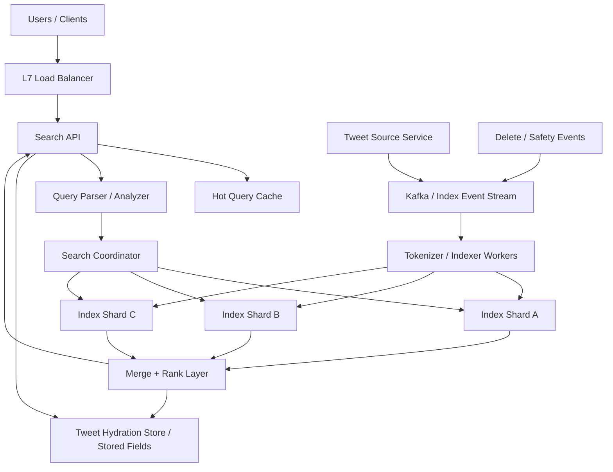
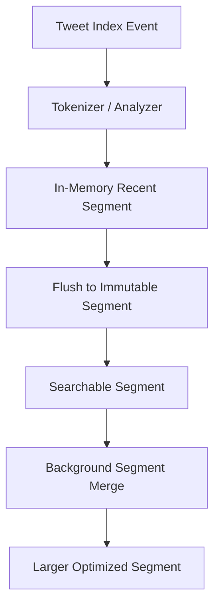

# System Design: Twitter Search

> Design a Twitter-style search system that indexes 500M new tweets per day, serves 300M search queries per day, supports near-real-time searchability, and ranks results by relevance plus freshness.

---

## Concepts Covered

- **Concept 01** - Horizontal vs Vertical Scaling & Auto-scaling
- **Concept 02** - Load Balancing Deep Dive
- **Concept 05** - API Design Patterns
- **Concept 07** - NoSQL Deep Dive
- **Concept 09** - Database Sharding & Partitioning
- **Concept 12** - Data Modeling for Scale
- **Concept 14** - Message Queues & Stream Processing
- **Concept 15** - Event-Driven Architecture & Event Sourcing
- **Concept 21** - Monitoring, Observability & SLOs/SLAs
- **Concept 24** - Search Systems

---

## Step 1: Requirements & Scope

### Functional Requirements

- **Users can search tweets by keyword or phrase**: This is the primary read path. The system must handle natural-language queries over a massive corpus quickly.
- **Users can filter by time, language, account, and engagement signals**: Search without filters is useful, but product-quality search usually needs narrowing tools.
- **New tweets become searchable quickly**: Search that lags by many minutes feels broken on a real-time social platform.
- **Results are ranked by relevance and freshness**: Users searching Twitter usually care about what is both relevant and current, not just the oldest matching post.
- **Users can paginate through search results**: We need stable cursor-based pagination because search result sets are constantly changing as new tweets arrive.
- **Deletes and safety actions remove tweets from search**: If a tweet is deleted or withheld, search should stop surfacing it quickly.
- **Support query suggestions or autocomplete hooks**: Not the main focus, but common enough to shape the API and query-parsing layer.

### Non-Functional Requirements

- **Availability target**: 99.99% for search queries. Search is a top-level product experience, not a secondary report.
- **Search latency**: p99 under 300ms for the first page of results. Search can be slower than feed retrieval, but it still must feel responsive.
- **Index freshness**: 95% of new tweets visible in search within 10 seconds and 99% within 60 seconds.
- **Scale**: 500M tweets/day ingested and 300M search queries/day.
- **Consistency**: Eventual consistency is acceptable for index visibility, but legal removals and deletions should propagate quickly and predictably.
- **Durability**: Source tweet data cannot be lost. Search indexes can be rebuilt, but source events and canonical tweet records must remain durable.
- **Operability**: The system must tolerate shard failures, node restarts, and hot queries without total outage.

### Out of Scope

- **Home timeline ranking**: Search ranking is related but distinct from the home-feed problem.
- **Account search, hashtag discovery pages, and trends ranking**: We may reference them, but we are focusing on tweet search.
- **Ads ranking inside search**: Important in practice, but a separate retrieval and auction system.
- **ML model training pipelines**: We will mention ranking features, but not full model training infrastructure.
- **Moderation policy engines**: We assume safety decisions arrive as events to the search system.

The core challenge is that search is both a retrieval problem and an indexing problem. It is not enough to answer queries well if new tweets are not searchable soon enough, and it is not enough to index quickly if query ranking quality is bad.

---

## Step 2: Back-of-Envelope Estimation

Search systems force us to estimate both read traffic and indexing volume. The source corpus is huge, but the index can be even larger.

### Traffic Estimation

Assumptions:
- New tweets/day: `500,000,000`
- Search queries/day: `300,000,000`
- Peak multiplier: `3x`

Tweet ingestion:
```text
500,000,000 / 86,400 = 5,787.04 tweets/sec average
Peak ingest QPS = 5,787.04 x 3 = 17,361.11 tweets/sec
```

Search query QPS:
```text
300,000,000 / 86,400 = 3,472.22 queries/sec average
Peak search QPS = 3,472.22 x 3 = 10,416.67 queries/sec
```

This is interesting because indexing throughput is actually higher than query throughput on average. That is common in real-time social search. Freshness pressure makes ingestion just as important as query serving.

### Storage Estimation

Source tweet metadata stored elsewhere:
```text
tweet text          320 bytes average
author/time/lang    64 bytes
engagement fields   32 bytes
visibility flags    16 bytes
overhead            80 bytes
--------------------------------
~512 bytes source metadata
```

Search index footprint per tweet:
```text
token postings      1,500 bytes average
stored fields       300 bytes
doc values          200 bytes
segment metadata    200 bytes
--------------------------------
~2.2 KB per indexed tweet
```

Daily index growth:
```text
500,000,000 x 2.2 KB = 1,100,000,000 KB/day
= 1.1 TB/day
```

Yearly:
```text
1.1 TB/day x 365 = 401.5 TB/year
```

If we keep 90 days in hot search storage:
```text
1.1 TB/day x 90 = 99 TB hot index
```

With one replica:
```text
99 TB x 2 = 198 TB hot cluster storage
```

That is large but absolutely believable for a major social search product. It also explains why shard sizing and retention tiering matter so much.

### Bandwidth Estimation

Search response payload:
```text
Assume first page returns 20 tweets
Each tweet summary ~= 1.5 KB after metadata and highlight fields
Response payload ~= 30 KB
```

Peak query egress:
```text
10,416.67 x 30 KB = 312,500 KB/sec
= 305.18 MB/sec
```

Ingest pipeline bandwidth:
```text
17,361 tweets/sec x 2.2 KB indexed payload
= 38,194.2 KB/sec
= 37.3 MB/sec
```

Again, the challenge is not only bandwidth. It is distributed index maintenance and low-latency fan-out across many shards.

### Memory Estimation (for caching)

Hot-query cache:
```text
Assume 500,000 hot queries/day
Keep 3 result pages per hot query
Average cached result set metadata = 40 KB

500,000 x 3 x 40 KB = 60,000,000 KB
= 57.2 GB
```

Term dictionary and query execution memory are separate from this cache. So a realistic search cluster wants large RAM on each node for index segments, OS page cache, and query coordination.

### Summary Table

| Metric | Value |
|--------|-------|
| Tweet ingest QPS (average) | ~5,787 |
| Tweet ingest QPS (peak) | ~17,361 |
| Search QPS (average) | ~3,472 |
| Search QPS (peak) | ~10,417 |
| Daily hot-index growth | ~1.1 TB |
| 90-day hot index with 1 replica | ~198 TB |
| Peak query egress | ~305 MB/sec |
| Hot query cache target | ~57 GB |

---

## Step 3: API Design

The public search surface is REST-friendly. Search queries naturally map to a GET endpoint with filters, while ingestion is usually an internal event-driven write path rather than a public search API call.

Cross-reference: **Concept 05 - API Design Patterns**.

### Search Tweets

```
GET /api/v1/search/tweets?q=rust+lang&cursor=abc123&limit=20
```

**Parameters:**
| Parameter | Type | Required | Description |
|-----------|------|----------|-------------|
| q | string | Yes | Query text |
| cursor | string | No | Pagination cursor |
| limit | integer | No | Number of results, default 20 |
| sort | string | No | `top`, `latest`, or `media` |
| since_id | string | No | Return only tweets newer than ID |
| author_id | string | No | Restrict to one account |
| language | string | No | Restrict by language |

**Response:**
```json
{
  "results": [
    {
      "tweet_id": "t_81232",
      "author_id": "u_88",
      "text": "Rust language keeps getting better",
      "created_at": "2026-03-20T11:58:00Z",
      "score": 0.941,
      "highlight": "Rust language"
    }
  ],
  "next_cursor": "abc124"
}
```

**Design Notes:** Cursor pagination is essential because new tweets arrive continuously, so offset-based pagination becomes unstable. The API should make it explicit that search is a snapshot-like paginated traversal, not a permanent fixed ordering.

### Get Search Suggestions

```
GET /api/v1/search/suggest?q=rust
```

**Parameters:**
| Parameter | Type | Required | Description |
|-----------|------|----------|-------------|
| q | string | Yes | Prefix query |
| limit | integer | No | Max suggestions |

**Response:**
```json
{
  "suggestions": ["rust lang", "rust async", "rust tokio"]
}
```

**Design Notes:** Suggestions are usually backed by a separate prefix or completion index rather than the main full-text query path.

### Internal Tweet Indexed Event

```
POST /internal/v1/search/index/tweet
```

**Parameters:**
| Parameter | Type | Required | Description |
|-----------|------|----------|-------------|
| tweet_id | string | Yes | Canonical tweet ID |
| author_id | string | Yes | Tweet owner |
| text | string | Yes | Tweet body |
| created_at | string | Yes | Creation time |
| language | string | Yes | Language code |
| visibility | string | Yes | Public/searchable status |

**Response:**
```json
{
  "status": "queued"
}
```

**Design Notes:** In production this is usually an event-stream consumer rather than a synchronous API call, but it is useful to show the index contract explicitly.

### Internal Delete from Index

```
DELETE /internal/v1/search/index/tweets/{tweet_id}
```

**Response:**
```json
{
  "status": "delete_queued"
}
```

Delete propagation matters because stale search results are not just a freshness issue. They can become safety or legal issues.

---

## Step 4: Data Model

### Database Choice

The canonical tweet store is separate from the search system. The search subsystem uses a **distributed inverted index**, not a relational database, for primary query execution.

We will use:
- **Source tweet store**: durable canonical storage in a sharded NoSQL or relational backend
- **Event stream**: Kafka-style ingestion bus
- **Search index cluster**: Elasticsearch/OpenSearch-like distributed inverted index or an equivalent custom system
- **Hot query cache**: Redis or in-process coordinator cache

This follows the logic of **Concept 24 - Search Systems**. Search engines are specialized retrieval systems, not general-purpose primary databases.

### Schema Design

```text
Index: tweets_search
├── tweet_id          KEYWORD          -- Exact ID lookup and hydration
├── author_id         KEYWORD          -- Filters and author-specific queries
├── text              TEXT             -- Analyzed full-text field
├── language          KEYWORD          -- Filter and analyzer routing
├── created_at        DATE             -- Recency sort / score boost
├── hashtags          KEYWORD[]        -- Facet and filter support
├── mentions          KEYWORD[]        -- Filter support
├── like_count        LONG             -- Ranking features
├── retweet_count     LONG             -- Ranking features
├── reply_count       LONG             -- Ranking features
├── visibility        KEYWORD          -- Searchability state
│
├── INDEX OPTION: analyzer(text) = language-specific analyzer
├── INDEX OPTION: doc_values(created_at, language, author_id)
└── SHARDING: hash(tweet_id) across N shards
```

We also keep a query cache entry shape like:

```text
Cache key: normalized_query + filter_hash + page_cursor
Value: ranked tweet_id list + lightweight snippets
TTL: short, for example 30-120 seconds
```

### Access Patterns

- **Ingest new tweet**: append document to search index through ingestion pipeline
- **Delete or hide tweet**: update or tombstone indexed document quickly
- **Search by keyword**: query analyzer -> postings retrieval -> ranking -> pagination
- **Filter by author or language**: doc-value or keyword field filtering
- **Hydrate final results**: fetch or read stored fields for top results

The key data-model point is that the search index denormalizes what the query path needs. It is not trying to be the single source of truth for every tweet field in the platform.

---

## Step 5: High-Level Architecture

### Mermaid Diagram



### Architecture Walkthrough

The best way to understand this system is to separate the query path from the indexing path. Users experience search queries. Operators fight indexing freshness and shard health. Both matter equally.

Start with the query path. A user submits a search like `rust lang async`. The request reaches the load balancer, then the Search API. The Search API performs authentication, rate limiting, and request normalization. Query normalization matters because identical semantic searches expressed with different casing or whitespace should converge to the same internal representation. That also improves query-cache efficiency.

The Search API first checks the hot-query cache. Many search systems have a long tail of unique queries, but they also have a meaningful head of repeated trending or news-driven terms. A short-lived cache for hot queries can take a surprising amount of pressure off the cluster during breaking-news events.

If the cache misses, the request goes to the query parser and analyzer. This stage tokenizes the input, normalizes casing, applies language-aware analyzers, maybe handles phrase parsing, and turns the human query string into an executable search expression. This is directly grounded in **Concept 24 - Search Systems**. A search engine is not just doing string matching. It is mapping text into index-compatible terms.

The parsed query then reaches the search coordinator. The coordinator fans the query out to relevant shards. Each shard holds a partition of the tweet index. On that shard, the engine looks up postings lists, evaluates matching documents, scores local candidates, and returns a top-K partial result set. The coordinator then merges shard-local top-Ks into one global ranked candidate set.

That merge layer is where global ranking comes together. It combines BM25-style text relevance, recency boosts, engagement features, safety filters, and sort-mode choices like `latest` or `top`. The result is not yet necessarily the full tweet payload. Often it is a ranked list of tweet IDs plus snippets or stored fields. The Search API may then hydrate any missing result metadata before returning the first page to the user.

Now switch to the indexing path. A tweet is created in the canonical tweet service, not directly in search. That tweet service writes the authoritative record and emits an event into Kafka. Safety actions, deletions, or visibility updates also emit events. This is an important design choice. Search is an eventually consistent projection of canonical content, not the source of truth.

Indexer workers consume those events. They tokenize the tweet text, pick language analyzers, create index documents, and write them into the correct shard based on partition routing. These writes usually land first in smaller recent segments and are later compacted or merged by background index maintenance processes. This is how the system keeps new tweets searchable quickly without constantly rewriting giant index files.

Delete or hide flows are especially important. If a tweet is deleted, the safety event hits the same stream, and indexer workers mark the document deleted or update its visibility state. Query-time filters should also respect visibility. In other words, there are usually two lines of defense: index update propagation and query-time safety enforcement.

Hydration is another subtle but important component. Even if the search index stores enough fields for simple responses, many teams still hydrate from a canonical store or a stored-fields service for the final top results. This keeps the index leaner and lets search ranking evolve without making the index the only place that knows how to assemble tweet display objects.

Failure behavior is layered. If one shard is slow, tail latency rises because distributed search is gated by its slowest participant. If the query cache is cold during a major news event, coordinators and shards suddenly receive many duplicate queries. If indexing lags, queries still work but new tweets take longer to appear. That is why query serving, indexing freshness, and shard operations all belong in the architecture discussion.

The clean mental model is this: the source tweet system produces events, indexer workers build searchable structures, the query path interprets human text into shard-level retrieval, and a rank-and-hydrate layer turns candidates into a user-facing result set. Once you see those stages clearly, the system stops looking like a giant black box called "search."

It is also worth noticing that not all queries behave the same way. A trending hashtag search is usually cacheable but shard-hot. A filtered investigative query across weeks of data may be relatively rare but expensive because it touches more segments and more filters. A "latest" sort emphasizes freshness while a "top" sort emphasizes ranking quality. Real search systems often end up with multiple execution modes hidden behind the same public endpoint because production traffic is not one neat uniform workload.

---

## Step 6: Deep Dives

### Deep Dive 1: Inverted Index and Segment Lifecycle

Search systems scale because they precompute term-to-document mappings rather than scanning tweets linearly. For each analyzed term, the engine stores postings lists that say which tweet documents contain that term, and often also position or frequency information.

The practical implementation is usually segment-based. Indexer workers append new documents into recent segments. Queries search across many segments. Background merge jobs compact smaller segments into larger ones for efficiency.

### Mermaid Diagram



### Diagram Walkthrough

The diagram starts with a tweet event entering the analyzer. Tokenization, language detection, stemming, and normalization happen here. The result is not immediately a giant on-disk index rewrite. Instead, the tweet lands in an in-memory or recent writable segment.

That recent segment is periodically flushed into an immutable searchable segment. Once searchable, the tweet can participate in queries even though the cluster has not yet done any heavy compaction. Later, background merge processes combine many small segments into larger optimized ones. This reduces query overhead, improves compression, and reclaims space from deleted documents.

This segment lifecycle is why search systems can offer near-real-time indexing without paying the cost of rewriting massive monolithic indexes on every new tweet. It is also why indexing and merge metrics matter so much operationally.

Cross-reference: **Concept 24 - Search Systems**.

### Deep Dive 2: Freshness Versus Throughput

Users expect tweets to become searchable quickly, especially during breaking news. But forcing near-instant refresh after every indexed tweet is expensive. Each refresh exposes recent segments to search, which increases overhead.

So we balance:
- refresh often enough to make search feel live
- batch enough writes to keep indexing efficient

A good starting point might be a refresh interval around 1 second for hot recent indexes. That gives acceptable freshness while keeping indexing throughput high. During peak load, the system may degrade gracefully by slightly increasing refresh windows instead of falling over.

The important design insight is that "real-time search" is usually really "near-real-time search." Product teams can tolerate a few seconds. They cannot tolerate cluster instability.

### Deep Dive 3: Ranking Beyond Text Match

Pure keyword relevance is not enough for social search. A tweet that contains the words but was posted five years ago may be less useful than a slightly weaker lexical match from 30 seconds ago. Likewise, spammy repeated keywords should not dominate good content.

So ranking blends:
- text relevance
- recency
- author quality
- engagement signals
- safety and policy filters

This usually works best as multi-stage ranking. Shards produce a modest candidate set based largely on lexical matching and basic filters. The merge layer or a dedicated ranker then applies richer scoring on only those candidates. That keeps latency bounded while still improving result quality.

### Deep Dive 4: Hot Queries and News Spikes

Search traffic is not evenly distributed. During major events, millions of users may search the same few terms within minutes. That makes query caching and shard-level protection crucial.

Useful protections include:
- short-lived hot-query cache
- request coalescing so identical in-flight queries share one backend execution
- coordinator-level circuit breakers
- adaptive shard routing if one replica is overloaded

This is one of the places where **Concept 19 - Fault Tolerance Patterns** directly improves product behavior. Without these protections, news spikes cause the system to do the same expensive work over and over again.

Operationally, this is also where query coalescing earns its keep. If ten thousand users all ask the same breaking-news query at once, the system should prefer doing one expensive coordinator-and-shard execution and sharing the result briefly, rather than repeating identical work ten thousand times. That is not a theoretical micro-optimization. It is how search systems stay calm during the exact moments users care about them most.

---

## Step 7: Bottlenecks & Scaling

### Identifying Bottlenecks

At `10x` current scale, the index cluster becomes the main issue before the API fleet does. The problem is not only more queries. It is more shard fan-out, more merge pressure, and larger hot indexes. If refresh intervals are too aggressive, indexing overhead rises sharply.

Hot-query concentration is another early bottleneck. A single trending query can hammer coordinators and the same set of shards repeatedly. The metric to watch is per-query frequency and per-shard tail latency, not just average cluster CPU.

At `100x`, hydration and stored-field access can become expensive. If every result requires separate fetches from a canonical tweet store, the query path adds network hops and serialization costs. This is why many systems store enough display fields directly in the index for top results.

### Scaling Solutions

| Bottleneck | Solution | Impact | New Ceiling | Cross-reference |
|------------|----------|--------|-------------|-----------------|
| Hot recent index size | Split hot and warm tiers by age | Keeps freshest data on fast nodes | Better query and ingest isolation | Concept 09 |
| Query spikes on trends | Hot-query cache and request coalescing | Reduces duplicate backend work | Much higher spike tolerance | Concept 10 |
| Merge pressure | Tune refresh intervals and add indexing-only nodes | Protects query latency | Higher sustainable ingest throughput | Concept 24 |
| Shard overload | Rebalance shards and add replicas | Improves availability and read scale | More predictable p99 latency | Concept 01 |

### Failure Scenarios

- **Indexer lag**: Queries work, but new tweets appear late. This is a freshness incident, not total outage.
- **Shard replica failure**: Queries route to remaining replicas; capacity drops but availability continues.
- **Coordinator overload**: Tail latency rises across many queries even if shards are individually healthy.
- **Delete pipeline lag**: Removed tweets linger in search too long, which can become a high-severity safety problem.
- **Hydration-store slowdown**: Search can still produce candidate IDs, but final result assembly degrades.

Search systems fail in partial ways. Some failures hurt freshness, some hurt relevance, and some hurt latency. Good monitoring has to distinguish them clearly.

That distinction matters because the response should differ by failure type. If freshness is degraded, the system can still serve slightly older but useful results. If relevance is degraded, the system may simplify ranking temporarily. If latency is the issue, query shedding or cache bias may be the right response. Treating all search incidents as one generic "cluster down" condition is how operators lose valuable recovery options.

---

## Step 8: Monitoring & Alerting

### Key Metrics to Track

Business metrics:
- Search queries per minute
- Zero-result rate
- Click-through rate on top results
- Fresh-tweet visibility lag

Infrastructure metrics:
- Search p50, p95, p99 latency
- Query-cache hit ratio
- Shard CPU, memory, and disk usage
- Index refresh time and merge backlog
- Indexing lag from source event to searchable visibility
- Delete propagation lag

### SLOs

- **Search availability**: 99.99%
- **Search latency**: 99% under 300ms for first page
- **Index freshness**: 95% of tweets searchable within 10 seconds
- **Delete freshness**: 99% of delete/hide actions reflected within 60 seconds
- **Result quality guardrail**: zero-result rate or click-through regression thresholds monitored continuously

### Alerting Rules

- **CRITICAL**: Search p99 latency > 1 second for 5 minutes
- **WARNING**: Query-cache hit ratio drops below 30% during a trend spike
- **CRITICAL**: Indexing lag exceeds 60 seconds
- **CRITICAL**: Delete propagation lag exceeds 5 minutes
- **WARNING**: Merge backlog grows continuously for 30 minutes
- **CRITICAL**: One or more primary shards unavailable

Cross-reference: **Concept 21 - Monitoring, Observability & SLOs/SLAs**.

---

## Summary

### Key Design Decisions

1. **Use a distributed inverted index for retrieval** because tweet search is fundamentally a search-engine problem, not a relational query problem.
2. **Separate canonical tweet storage from search indexing** so search remains a rebuildable projection rather than the source of truth.
3. **Use an event-stream indexing pipeline** to keep ingestion durable and decoupled from source writes.
4. **Blend lexical relevance with freshness and engagement** because social search quality depends on more than token matching.
5. **Protect against hot queries with caching and request coalescing** because real-world social traffic is highly skewed during major events.

### Top Tradeoffs

1. **Freshness versus indexing efficiency**: More frequent refreshes make tweets searchable faster but reduce throughput and increase overhead.
2. **Stored fields versus external hydration**: Storing more in the index speeds reads but increases index size; external hydration shrinks the index but adds latency and dependencies.
3. **More shards versus fewer shards**: More shards improve parallelism and rebalancing flexibility but increase coordination overhead and tail latency risk.

### Alternative Approaches

- Smaller products can use PostgreSQL full-text search or a managed OpenSearch cluster without all this complexity.
- If ranking simplicity matters more than freshness, a batch-oriented index pipeline with slower refresh could be cheaper and easier to operate.
- If autocomplete becomes the dominant use case, a separate specialized prefix index or suggestion engine should exist instead of overloading the main tweet-search path.

The most important lesson in Twitter search is that search quality and search freshness are inseparable. A fast index with bad ranking is disappointing. A great ranking model with stale data is also disappointing. The architecture has to respect both sides of the problem from the start.

That is why search systems of this class are usually healthiest when they acknowledge their two personalities explicitly. One personality is a write-heavy pipeline constantly parsing, enriching, ranking, and indexing new content. The other is a latency-sensitive read path expected to answer broad and often ambiguous human questions in a fraction of a second. Engineering pain shows up when one side is optimized while the other is treated as an afterthought. A tweet search product needs both ingestion discipline and relevance discipline at the same time.

It also helps to remember that user trust in search is cumulative. People do not evaluate the system from one query alone. They notice whether breaking news appears quickly, whether spam terms dominate, whether exact-handle or hashtag lookups feel reliable, and whether stale deleted content keeps surfacing. Those impressions are the output of architecture choices such as refresh cadence, abuse filtering, shard design, and ranking-feature freshness. Search feels like a product problem on the surface, but the user's confidence is built from operational details deep in the serving and indexing stack.

When a design keeps that connection visible, roadmap choices get easier. Investing in better query segmentation, safer cache degradation, more intentional stored fields, or faster index publish windows stops looking like backend polish and starts looking like direct product work. That is exactly the right mindset for a system whose success is measured in whether users believe the search box reflects the living conversation of the platform right now.

The healthiest search teams keep that loop tight. Relevance evaluation, freshness budgets, policy enforcement, and cluster operations are not separate concerns that happen to share hardware. They are one continuous product discipline focused on helping users trust that a query will surface the right conversation at the right moment, even while the underlying corpus is changing constantly.
