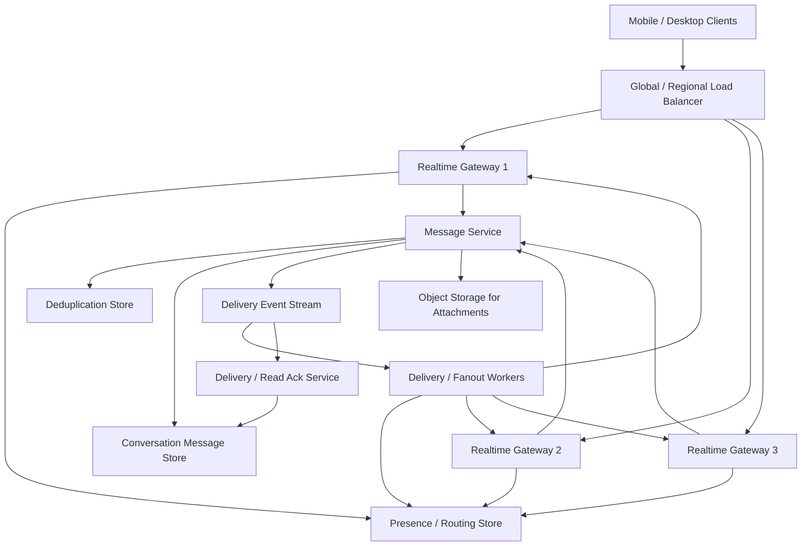
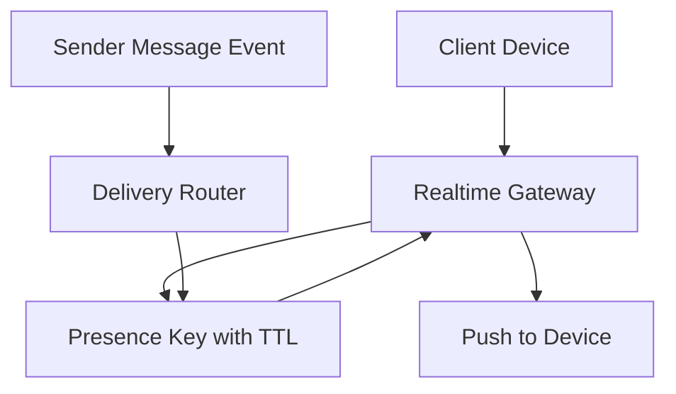

# System Design: WhatsApp Chat System

> Design a WhatsApp-style chat system that supports 50B messages per day, hundreds of millions of concurrent device connections, low-latency delivery, offline sync, and end-to-end encrypted message transport.

---

## Concepts Covered

- **Concept 01** - Horizontal vs Vertical Scaling & Auto-scaling
- **Concept 02** - Load Balancing Deep Dive
- **Concept 07** - NoSQL Deep Dive
- **Concept 12** - Data Modeling for Scale
- **Concept 13** - Synchronous vs Asynchronous Communication Patterns
- **Concept 14** - Message Queues & Stream Processing
- **Concept 16** - Real-time Communication
- **Concept 19** - Fault Tolerance Patterns
- **Concept 20** - Idempotency, Deduplication & Exactly-Once Semantics
- **Concept 21** - Monitoring, Observability & SLOs/SLAs

---

## Step 1: Requirements & Scope

### Functional Requirements

- **Users can send one-to-one chat messages**: This is the primary write path and the minimum product promise.
- **Users can receive messages in near real time when online**: The app should feel live, not poll-driven.
- **Users can fetch missed messages after reconnecting**: Mobile networks are unreliable, so offline sync is not optional.
- **Users can send images or attachments via references**: Media sharing is core to chat usage, though the media transport itself can be separate from text delivery.
- **Users can see delivery states**: Sent, delivered, and read receipts matter because they are part of the social contract of a messaging product.
- **Users can participate in group chats**: Group fanout is one of the main reasons the architecture must be more sophisticated than a single TCP pipe.
- **Users get end-to-end encryption semantics**: The backend should treat message bodies as ciphertext and route them without needing plaintext access.

### Non-Functional Requirements

- **Availability target**: 99.99% for active message send and receive.
- **Delivery latency**: p99 under 200ms for online one-to-one delivery within a region, not counting last-mile network variance.
- **Scale**: 50B messages/day and up to 200M concurrent active device connections at peak.
- **Durability**: Once a message is acknowledged as accepted by the server, it should survive gateway failure and reach the recipient or remain retrievable for sync.
- **Consistency**: At-least-once delivery is acceptable if the client and backend support deduplication. Exactly-once across mobile networks is usually not realistic.
- **Ordering**: Per-conversation ordering should be preserved as much as possible, especially within one-to-one chats. Global ordering is unnecessary.
- **Security**: Servers should not require plaintext for normal routing, indexing, or storage behavior.

### Out of Scope

- **Voice and video calling**: Those require a separate media-plane architecture.
- **Full contact discovery, spam scoring, and abuse prevention**: Important in reality, but separate from message transport core.
- **Rich search over message content**: End-to-end encryption makes that a very different product problem.
- **Multi-device key management deep dive**: We will acknowledge device identity and encryption constraints, but not design the full cryptographic protocol.
- **Presence fidelity at sub-second precision**: We care about useful online state, not perfect global truth.

The central engineering problem is delivering huge message volume reliably across unstable mobile connections while keeping the online path fast and the offline path durable.

---

## Step 2: Back-of-Envelope Estimation

Messaging systems need more than QPS math. Concurrent connections, heartbeats, and fanout matter just as much as raw message count.

### Traffic Estimation

Assumptions:
- Messages/day: `50,000,000,000`
- Peak concurrent connected devices: `200,000,000`
- Peak multiplier for send volume: `3x`

Message send QPS:
```text
50,000,000,000 / 86,400 = 578,703.70 messages/sec average
Peak send QPS = 578,703.70 x 3 = 1,736,111.11 messages/sec
```

Delivery events:
If each message generates a delivery ack and many also generate read receipts, a rough baseline is at least `2x` control traffic over raw sends.

```text
Control-event QPS ~= 1,736,111 x 2 = 3,472,222 events/sec peak
```

Connection heartbeats:
Suppose connected devices heartbeat every 60 seconds.
```text
200,000,000 / 60 = 3,333,333 heartbeat events/sec
```

This is why connection gateways and presence systems are first-class architecture components. The control plane is enormous even before counting actual chat payloads.

### Storage Estimation

Message payload and metadata:
```text
ciphertext body      200 bytes average
message_id           16 bytes
conversation_id      16 bytes
sender_id            8 bytes
recipient_id         8 bytes
timestamp            8 bytes
delivery flags       8 bytes
overhead             36 bytes
--------------------------------
~300 bytes/message
```

Daily message storage:
```text
50,000,000,000 x 300 bytes = 15,000,000,000,000 bytes/day
= 15 TB/day
```

Thirty-day hot retention:
```text
15 TB/day x 30 = 450 TB
```

With replication factor 3:
```text
450 TB x 3 = 1.35 PB
```

That sounds huge because it is huge. Large-scale chat systems are storage-intensive. In practice, retention, compression, media indirection, and cold archival policies matter a lot.

### Bandwidth Estimation

Peak send ingress:
```text
1,736,111 messages/sec x 300 bytes = 520,833,300 bytes/sec
= 496.7 MB/sec
```

Peak message egress for one-to-one only:
```text
1,736,111 x 300 bytes = 496.7 MB/sec
```

But groups change the picture. If average fanout multiplier across all messages is `1.4x` because some traffic is group traffic:
```text
496.7 MB/sec x 1.4 = 695.4 MB/sec
```

### Memory Estimation (for connection and offline state)

Gateway connection memory:
Suppose one mostly idle connection requires around 4 KB of state, buffers, and bookkeeping.

```text
200,000,000 x 4 KB = 800,000,000 KB
= 762.9 GB
```

That tells us immediately we need a large fleet of gateway nodes. If one gateway safely holds 200,000 active connections:
```text
200,000,000 / 200,000 = 1,000 gateway nodes
```

That is a believable fleet size for a global messaging platform.

### Summary Table

| Metric | Value |
|--------|-------|
| Message send QPS (average) | ~578,704 |
| Message send QPS (peak) | ~1,736,111 |
| Heartbeat events/sec | ~3,333,333 |
| Daily message storage | ~15 TB |
| 30-day hot storage (replicated) | ~1.35 PB |
| Peak one-to-one ingress | ~496.7 MB/sec |
| Gateway nodes at 200K conns each | ~1,000 |

---

## Step 3: API Design

A messaging product usually exposes both persistent realtime channels and ordinary HTTP endpoints. To stay close to the template, I will define the logical APIs as REST endpoints, but the online data path is really over long-lived connections.

Cross-reference: **Concept 16 - Real-time Communication** and **Concept 05 - API Design Patterns**.

### Send Message

```
POST /api/v1/messages
```

**Parameters:**
| Parameter | Type | Required | Description |
|-----------|------|----------|-------------|
| conversation_id | string | Yes | One-to-one or group conversation ID |
| client_message_id | string | Yes | Client-generated idempotency key |
| ciphertext | string | Yes | End-to-end encrypted payload |
| media_refs | array<string> | No | Attachment references |
| sent_at | string | Yes | Client send timestamp |

**Response:**
```json
{
  "server_message_id": "m_9234234",
  "status": "accepted",
  "accepted_at": "2026-03-20T12:00:00Z"
}
```

**Design Notes:** The `client_message_id` is critical for deduplication across retries. The server only acknowledges once the message is durably accepted into the backend pipeline.

### Sync Messages

```
GET /api/v1/conversations/{conversation_id}/messages?cursor=abc123&limit=100
```

**Parameters:**
| Parameter | Type | Required | Description |
|-----------|------|----------|-------------|
| conversation_id | string | Yes | Chat or group ID |
| cursor | string | No | Position for incremental sync |
| limit | integer | No | Batch size, max 100 |

**Response:**
```json
{
  "messages": [
    {
      "server_message_id": "m_9234234",
      "client_message_id": "c_123",
      "sender_id": "u_88",
      "ciphertext": "base64payload",
      "sent_at": "2026-03-20T12:00:00Z"
    }
  ],
  "next_cursor": "abc124"
}
```

**Design Notes:** This endpoint handles reconnects and history fetches. Mobile messaging systems should never assume the live socket is the only way messages move.

### Acknowledge Delivery / Read

```
POST /api/v1/messages/{server_message_id}/ack
```

**Parameters:**
| Parameter | Type | Required | Description |
|-----------|------|----------|-------------|
| state | string | Yes | `delivered` or `read` |
| device_id | string | Yes | Which device is acknowledging |

**Response:**
```json
{
  "status": "recorded"
}
```

### Presence Snapshot

```
GET /api/v1/presence/{user_id}
```

**Parameters:**
| Parameter | Type | Required | Description |
|-----------|------|----------|-------------|
| user_id | string | Yes | User presence lookup |

**Response:**
```json
{
  "user_id": "u_88",
  "state": "online",
  "last_seen_at": "2026-03-20T11:59:50Z"
}
```

In practice, live delivery, typing indicators, and active presence updates usually travel over the persistent connection, but these logical endpoints make the semantics concrete.

It is also important that these semantics stay device-aware. A single user identity may have a phone, a desktop client, and a web session active at once. The system therefore routes to user-device pairs, not just to abstract users, and acknowledgments often need to record which device observed which state transition.

---

## Step 4: Data Model

### Database Choice

We will use a hybrid storage model:

- **Message store**: a wide-column or log-friendly NoSQL database such as Cassandra for append-heavy conversation storage
- **Presence store**: Redis or another in-memory TTL-backed store
- **Connection routing map**: fast ephemeral key-value store mapping user/device to gateway
- **Media store**: object storage for attachments
- **Event stream**: Kafka or similar durable queue for delivery and ack events

Why not a single relational database? Because the hot path is append-heavy, high-throughput, and partitioned naturally by conversation. This is classic **Concept 07 - NoSQL Deep Dive** territory. Wide-column stores are much happier handling huge write volumes for immutable message records than a single relational primary.

### Schema Design

```text
Table / Collection: messages_by_conversation
├── conversation_id     BIGINT         PARTITION KEY      -- Conversation or group
├── message_ts          TIMESTAMP      CLUSTER KEY        -- Ordering inside conversation
├── server_message_id   UUID           NOT NULL
├── sender_id           BIGINT         NOT NULL
├── ciphertext          BLOB/TEXT      NOT NULL
├── media_refs          LIST<TEXT>     NULLABLE
├── delivery_state      SMALLINT       NOT NULL
└── PRIMARY KEY (conversation_id, message_ts, server_message_id)
```

```text
Table: dedupe_keys
├── sender_id           BIGINT         NOT NULL
├── client_message_id   VARCHAR(64)    NOT NULL
├── server_message_id   UUID           NOT NULL
└── PRIMARY KEY (sender_id, client_message_id)
```

```text
Presence key: presence:{user_id}:{device_id}
Value: gateway_id + last_seen timestamp
TTL: 60-120 seconds
```

### Access Patterns

- **Append new message**: write to `messages_by_conversation`
- **Fetch recent conversation history**: read latest N entries by `conversation_id`
- **Deduplicate retries**: lookup `(sender_id, client_message_id)`
- **Find online recipient**: resolve presence key to gateway route
- **Group fanout**: fetch member list, then route delivery events

Partitioning by conversation is a natural fit because ordering expectations are per chat, not global.

---

## Step 5: High-Level Architecture

### Mermaid Diagram



### Architecture Walkthrough

The first part of the architecture is the realtime gateway tier. Clients maintain long-lived connections, usually WebSockets or a mobile-optimized persistent TCP protocol, to gateway nodes. The load balancer routes new connections to healthy gateways, but after the connection is established, the gateway becomes the user's live session endpoint. This is where **Concept 16 - Real-time Communication** is central. We are not polling for messages. We are keeping durable connections open and routing live events through them.

Each gateway updates the presence and routing store with which users and devices are currently connected to it. That presence state is intentionally ephemeral and TTL-based. If a gateway stops heartbeating a device, the mapping expires. We do not need perfect global truth. We need a good-enough routing hint so the system knows where to push live messages.

Now walk the send-message flow. A client sends ciphertext plus metadata to its connected gateway. The gateway forwards the request to the message service. The message service first checks the deduplication store using `(sender_id, client_message_id)`. This is how we survive retries when the mobile client is unsure whether the previous attempt succeeded. If the key already exists, we return the existing server message ID instead of writing a duplicate.

If the message is new, the service writes it durably into the conversation message store. Only after that write succeeds do we acknowledge the send as `accepted`. This is an important product contract. The client should not think a message is safely in the system until the backend has actually stored it.

After durable write, the message service publishes a delivery event into Kafka or an equivalent event stream. This event becomes the asynchronous handoff for recipient routing. Delivery workers consume it, resolve recipient routing from the presence store, and attempt live push through the correct gateway if the recipient is online. If the recipient is offline, the message simply remains in the durable conversation store to be pulled on next sync. This is a great example of using **Concept 13 - Synchronous vs Asynchronous Communication Patterns** carefully: server acceptance is synchronous, recipient delivery can be asynchronous.

The one-to-one online path is straightforward. The recipient's gateway receives the event and forwards ciphertext to the device. The device responds with a delivery receipt. That receipt goes back through the gateway into the ack service, which records delivery state and may fan a status update back to the sender's device. Read receipts work similarly, just later in the lifecycle.

Group delivery is the more interesting branch. A group message still writes once to the conversation store, but the delivery workers fan the event out to each group member's active device routes. That can mean one logical write triggering dozens or hundreds of live deliveries. The core storage path remains conversation-partitioned. The extra cost is in routing and online fanout, not in duplicating durable message storage for every member.

Attachments are stored out of band. The chat message contains media references, not the full attachment bytes. Actual media lives in object storage and is fetched separately with authenticated URLs. This keeps the core message transport focused on low-latency metadata and ciphertext movement instead of large binary transfer.

Failure handling is what makes this architecture production-worthy. If a gateway dies, clients reconnect through the load balancer and rebuild presence state. If the delivery worker fails after the durable message write, the message is still safe in storage and can be retried or pulled later. If the presence store is briefly stale, the system may miss the live push opportunity, but the offline sync path still guarantees retrievability. That is why the message store, not the gateway, is the real source of truth.

This architecture also respects end-to-end encryption constraints. The backend routes ciphertext, records metadata, and tracks delivery state without needing plaintext message content. That sharply limits what the server can index or inspect, but it is the correct trade for a privacy-first messaging product.

Seen another way, the platform is two systems layered together. One is a realtime transport fabric for currently connected devices. The other is a durable mailbox and sync system for every device that is offline, reconnecting, or slow. Users mainly notice the first one, because live delivery is what feels magical. But the second one is what makes the product reliable on mobile networks that are constantly dropping, sleeping, or moving between radios.

That distinction is why the send acknowledgment contract matters so much. A send ack means the system durably accepted the message. It does not mean the recipient has already received or read it. Delivery and read states are later, separate transitions. Keeping those boundaries explicit makes both the backend and the UI much easier to reason about.

---

## Step 6: Deep Dives

### Deep Dive 1: Connection Routing and Presence at Huge Scale

When millions of devices are online, the main question is not "is the user online?" It is "which gateway currently owns that device connection?" Presence is therefore really a routing problem with TTL semantics.

### Mermaid Diagram



### Diagram Walkthrough

The device maintains a connection to a gateway. That gateway refreshes a presence key containing routing information, not just "online/offline." When a sender's message event reaches the delivery router, the router checks the presence store to see whether the recipient currently maps to a live gateway.

If yes, the router pushes the event to that gateway and attempts immediate delivery. If not, the router does nothing special because the durable store already guarantees the message can be pulled later. This is a very important design simplification. Presence is an optimization for fast live delivery, not a correctness dependency.

This structure also means gateway failures are survivable. If a gateway disappears, its presence keys expire and devices reconnect elsewhere. The message history does not disappear with the connection.

Cross-reference: **Concept 16 - Real-time Communication** and **Concept 19 - Fault Tolerance Patterns**.

### Deep Dive 2: Delivery Guarantees and Deduplication

Exactly-once delivery in mobile chat sounds nice but is not the honest default. Devices retry, networks flap, acks are lost, and gateways restart. The practical guarantee is at-least-once delivery with deduplication.

That is why the client sends a `client_message_id`. If a sender retries because it never saw the server ack, the message service checks the dedupe table and either returns the existing server message or stores a truly new message. Similarly, recipient devices can dedupe by `server_message_id`.

This approach keeps the system correct even when the transport layer is messy. It is the concrete application of **Concept 20 - Idempotency, Deduplication & Exactly-Once Semantics**. The backend is not pretending duplicates never happen. It is designing so duplicates are harmless.

That is exactly the right engineering posture for mobile messaging. Networks are lossy, phones go to sleep, TCP sessions reset, and users retry manually. A design that relies on the transport being perfect will fail. A design that assumes retries and duplicates will feel much more robust in the real world.

### Deep Dive 3: Group Chat Fanout

Group messaging changes the traffic shape dramatically. One write can imply 50 or 500 live deliveries. A naive architecture might store one physical copy of the message per recipient, but that multiplies storage badly. A better approach is:

- store the message once in the conversation log
- maintain group membership separately
- fan out delivery events to online members
- let offline members pull from the same conversation history later

This keeps durable storage efficient while still supporting large groups. The main challenge becomes delivery-worker throughput and membership caching, not message-store duplication.

### Deep Dive 4: End-to-End Encryption Constraints

Because the server stores ciphertext, it cannot do plaintext indexing, content moderation by message body, or server-side semantic search in the normal path. That is not a bug. It is the architectural consequence of privacy.

The backend still sees:
- sender and recipient identities
- timestamps
- message sizes
- delivery states
- media references

That metadata is enough to route, store, retry, and sync messages. It is not enough to offer content-aware server features without explicitly compromising the encryption model. This is exactly the kind of design boundary worth making explicit in a system design interview and in production architecture.

It also explains why some features become harder than people expect. Server-side search across chat bodies, moderation based on plaintext content, and rich smart-reply generation all become much more constrained. In a privacy-first chat system, those are not free features waiting to be turned on later. They are product choices that interact directly with the encryption model.

---

## Step 7: Bottlenecks & Scaling

### Identifying Bottlenecks

At `10x` scale, the gateway tier becomes the first obvious concern because connection count and heartbeat traffic explode. The problem is often not CPU first. It is file descriptors, per-connection memory, and reconnect storms.

The second bottleneck is group fanout. A few large groups can create spikes in delivery-worker throughput and gateway outbound traffic. The metric to watch is not just total messages/sec, but fanout-weighted deliveries/sec.

At `100x`, the message store and ack pipeline both become major issues. Even if the core write path stays append-only, the control traffic from delivery and read receipts can rival or exceed message sends.

### Scaling Solutions

| Bottleneck | Solution | Impact | New Ceiling | Cross-reference |
|------------|----------|--------|-------------|-----------------|
| Gateway connection pressure | More gateway nodes plus regional routing | Scales concurrent connections horizontally | Near-linear connection growth | Concept 01 |
| Group fanout spikes | Membership caching and fanout workers partitioned by conversation | Stabilizes large-group delivery | Higher fanout throughput | Concept 14 |
| Ack storm load | Batch ack writes and compact state transitions | Reduces small write amplification | Better durability cost profile | Concept 20 |
| Reconnect storms | Backoff, jitter, and resume tokens | Prevents cascading overload after failures | Safer gateway recovery | Concept 19 |

### Failure Scenarios

- **Gateway failure**: Devices reconnect elsewhere. Live delivery is briefly interrupted, but messages are safe in the durable store.
- **Presence-store lag**: Some online users may temporarily miss live push and fall back to sync retrieval.
- **Message-store partial outage**: New message acceptance is impaired, which is high severity because this is the durable source of truth.
- **Delivery-worker backlog**: Online delivery gets slower, but offline retrieval still works.
- **Ack pipeline lag**: Messages still move, but receipt states become stale.

Messaging systems need graceful degradation. "Message eventually syncs after reconnect" is far better than "message was accepted but vanished."

One more failure mode deserves explicit mention: reconnect storms. If a regional network issue or gateway outage forces millions of devices to reconnect at once, the system can see huge spikes in socket handshakes, presence rewrites, and history-sync requests. Good gateways therefore need admission control, jitter, and resumable sync so recovery itself does not become the next outage.

---

## Step 8: Monitoring & Alerting

### Key Metrics to Track

Business metrics:
- Messages sent per minute
- Online delivery success rate
- Offline sync volume
- Group-message fanout size distribution

Infrastructure metrics:
- Concurrent connections per gateway
- Heartbeat success/failure rates
- Message accept latency
- Delivery latency from accept to recipient push
- Message-store write latency
- Delivery-worker lag
- Ack-processing lag

### SLOs

- **Message acceptance availability**: 99.99%
- **Online one-to-one delivery latency**: 99% under 200ms intra-region
- **Offline sync correctness**: zero acknowledged message loss
- **Presence freshness**: 99% of active routes updated within 2 heartbeat intervals
- **Ack freshness**: 99% of delivery receipts reflected within 10 seconds

### Alerting Rules

- **CRITICAL**: Message accept failure rate > 1% for 2 minutes
- **CRITICAL**: Gateway reconnect rate spikes 5x baseline
- **WARNING**: Delivery-worker lag > 30 seconds
- **CRITICAL**: Message-store write p99 > 500ms
- **WARNING**: Ack lag > 60 seconds
- **CRITICAL**: One region loses >20% of gateway capacity

Cross-reference: **Concept 21 - Monitoring, Observability & SLOs/SLAs**.

---

## Summary

### Key Design Decisions

1. **Use long-lived gateway connections** because realtime delivery is the product, and polling is operationally wasteful at this scale.
2. **Treat the durable conversation store as the source of truth** so gateway failures do not cause message loss.
3. **Use at-least-once delivery with deduplication** because retries and reconnects are unavoidable on mobile networks.
4. **Separate media bytes from message transport** so text delivery stays low latency and attachments scale independently.
5. **Keep presence ephemeral and TTL-based** because perfect realtime global truth is less important than practical routing.

### Top Tradeoffs

1. **Exactly-once fantasy versus practical at-least-once**: We choose an honest dedupe-based design that survives real network behavior.
2. **Strong live presence versus cheap scalable presence**: We accept approximate presence to keep routing simple and resilient.
3. **Privacy versus server-side features**: End-to-end encryption limits server visibility, but that is the correct design boundary for a privacy-first messenger.

### Alternative Approaches

- Smaller chat products can use simpler WebSocket fleets and relational message storage without immediately needing a wide-column store.
- A server-side searchable enterprise messenger might choose weaker encryption semantics in exchange for content indexing and compliance features.
- Some group-heavy products may build more specialized fanout infrastructure or channel-oriented logs if massive rooms dominate traffic.

The critical lesson from WhatsApp-style chat is that the system is really two products at once: a realtime connection-routing layer and a durable message-history layer. Confusing those two layers is how teams build chat systems that feel live when healthy but lose correctness during failures.

That split becomes even more important once multi-device behavior enters the picture. A modern messenger is not only synchronizing one sender and one recipient. It is often synchronizing several phones, laptops, tablets, and reconnecting sessions that each see the conversation from slightly different timing and network conditions. The architecture works because the durable history layer provides stable ordering and replay while the realtime layer improves immediacy without becoming the sole source of truth.

End-to-end encryption makes that boundary stricter in healthy ways. It prevents the backend from taking shortcuts such as server-side search, moderation based on plaintext content, or rich ranking over message bodies. That can feel limiting to product teams, but it is exactly why the privacy model is trustworthy. The distributed-systems response is not to weaken encryption. It is to design features, metadata, and operational tooling that respect the encryption boundary while still keeping routing, retries, fanout, and device sync dependable.

The best chat systems therefore optimize for honest guarantees rather than imaginary ones. They do not promise exactly-once delivery on unreliable mobile networks. They promise durable acceptance, ordered sync, device-safe deduplication, bounded retry, and clear read-state semantics. That bundle of guarantees is what makes the experience feel instant when everything is healthy and still feel trustworthy when networks, devices, and gateways misbehave.

That honesty is a strength, not a limitation. Users may never describe it in distributed-systems terms, but they immediately feel the difference between a product that occasionally delays while preserving history correctly and one that appears fast until retries, reconnects, or device sync expose hidden inconsistencies. The architecture earns trust by choosing durable message semantics first and layering realtime polish on top.

That same design choice also makes the product easier to evolve. Features such as disappearing messages, multi-device history transfer, pinned chats, reactions, or richer group controls are much less dangerous when the system already has clear boundaries between durable truth, ephemeral presence, attachment storage, and receipt state. The platform stays healthy because new product ideas are forced to attach to well-defined layers instead of bending the core delivery contract each time something new is added.

That is a big part of why the strongest messenger backends age well. They do not rely on one heroic realtime path to solve every product need. They keep the durable history model stable, let realtime delivery accelerate the happy path, and make retries, offline sync, and device churn boring. In a mobile system that is constantly contending with bad networks and sleeping clients, boring recovery behavior is one of the most valuable product features a team can ship. It is the hidden reliability that makes the visible product feel human, calm, and trustworthy every single day.
