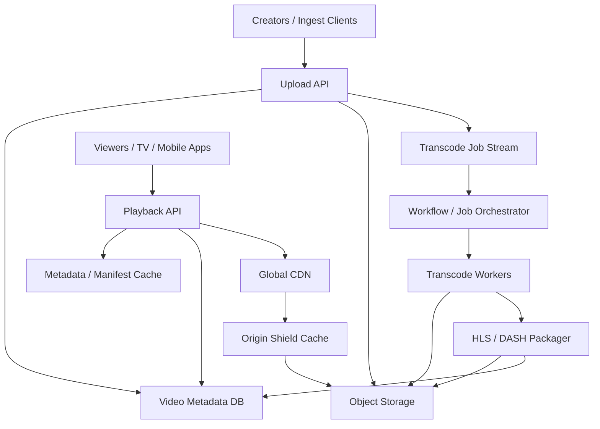
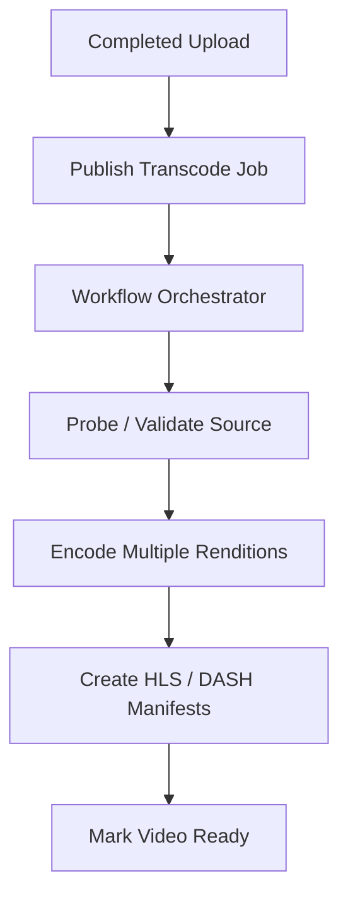

# System Design: YouTube / Netflix Video Streaming

> Design a large-scale video streaming platform that ingests 500K new video uploads per day, serves 200M play requests per day, supports adaptive bitrate streaming, and handles 8M peak concurrent viewers through a CDN-heavy delivery architecture.

---

## Concepts Covered

- **Concept 01** - Horizontal vs Vertical Scaling & Auto-scaling
- **Concept 02** - Load Balancing Deep Dive
- **Concept 03** - CDN & Edge Computing
- **Concept 05** - API Design Patterns
- **Concept 10** - Caching Strategies
- **Concept 13** - Synchronous vs Asynchronous Communication Patterns
- **Concept 14** - Message Queues & Stream Processing
- **Concept 19** - Fault Tolerance Patterns
- **Concept 21** - Monitoring, Observability & SLOs/SLAs
- **Concept 23** - Blob/Object Storage Patterns

---

## Step 1: Requirements & Scope

### Functional Requirements

- **Users can upload video files**: This is the primary content-ingestion path and the start of the supply side of the system.
- **The system transcodes uploads into multiple bitrate renditions**: Streaming platforms need multiple output qualities for different network conditions and device capabilities.
- **Users can start playback quickly**: The player should fetch a manifest and begin streaming with low startup latency.
- **Users can adapt bitrate during playback**: Playback should shift between quality levels without forcing the user to restart the stream.
- **Users can seek, resume, and continue watching**: These are core product expectations for on-demand video.
- **Hot titles should scale globally**: A popular release or viral clip should not collapse the origin infrastructure.
- **The platform should support video metadata and availability states**: Titles must move through stages like uploaded, processing, ready, and removed.

### Non-Functional Requirements

- **Availability target**: 99.99% for playback start and segment retrieval.
- **Playback startup latency**: first frame in under 2 seconds for cached content on decent networks.
- **Transcoding freshness**: Most normal uploads available for playback within minutes, not hours.
- **Scale**: 500K new uploads/day, 200M play sessions/day, and 8M peak concurrent viewers.
- **Bandwidth efficiency**: CDN should absorb the vast majority of segment traffic. Origin should not be the main delivery path.
- **Durability**: Raw uploads and processed renditions must survive infrastructure failures.
- **Consistency**: Eventual consistency is fine between metadata state and global CDN propagation, but the manifest should not reference missing segment objects.

### Out of Scope

- **Recommendation ranking**: Content discovery is a separate and equally large product problem.
- **Live streaming**: Live pipelines have different latency and segmenting requirements.
- **Ad insertion and DRM internals**: Important for real products, but orthogonal to the base streaming architecture.
- **Advanced creator analytics**: We will mention playback events, not design the whole analytics stack.
- **Social feed or comments systems**: Those belong elsewhere.

The heart of the design is the separation of ingest, processing, metadata, and delivery. Video platforms are expensive because bytes dominate, not because CRUD is hard.

---

## Step 2: Back-of-Envelope Estimation

Streaming systems look normal if you only count play requests. They look enormous when you count persistent bandwidth and transcoded bytes.

### Traffic Estimation

Assumptions:
- Uploads/day: `500,000`
- Play sessions/day: `200,000,000`
- Peak concurrent streams: `8,000,000`
- Peak multiplier for request spikes: `3x`

Upload request QPS:
```text
500,000 / 86,400 = 5.79 uploads/sec average
Peak upload QPS = 5.79 x 3 = 17.36 uploads/sec
```

Playback session start QPS:
```text
200,000,000 / 86,400 = 2,314.81 play starts/sec average
Peak play-start QPS = 2,314.81 x 3 = 6,944.43/sec
```

That makes the control plane look manageable, but streaming is driven by concurrency and sustained throughput more than by session-start QPS.

### Storage Estimation

Assume:
- average uploaded source video size: `200 MB`
- average packaged output across all bitrate renditions and manifests: `350 MB`

Raw upload storage/day:
```text
500,000 x 200 MB = 100,000,000 MB/day
= 100 TB/day
```

Processed output/day:
```text
500,000 x 350 MB = 175,000,000 MB/day
= 175 TB/day
```

Yearly processed output:
```text
175 TB/day x 365 = 63,875 TB/year
= 63.9 PB/year
```

If we retain both source and processed files hot for one year:
```text
100 TB/day + 175 TB/day = 275 TB/day
275 TB/day x 365 = 100.4 PB/year
```

With 3x replication or cross-region durable storage:
```text
100.4 PB x 3 = 301.2 PB effective storage footprint
```

This is why object storage is non-negotiable. No general-purpose database belongs anywhere near these bytes.

### Bandwidth Estimation

Assume average streaming bitrate across all viewers is `5 Mbps`.

At peak concurrency:
```text
8,000,000 concurrent streams x 5 Mbps = 40,000,000 Mbps
= 40 Tbps global egress
```

If CDN absorbs 95% of traffic:
```text
Origin egress = 40 Tbps x 5% = 2 Tbps
```

Even 2 Tbps at origin is huge, which is why origin shielding and regional distribution still matter.

### Memory Estimation (for caching)

For the control plane, the most useful cache is not full video data. It is manifests, metadata, and the first few segments of hot titles at origin-shield layers.

Assume:
- 200,000 hot titles
- 2 MB working-set cache per title for manifests plus initial segments

```text
200,000 x 2 MB = 400,000 MB
= 390.6 GB
```

That is a believable origin-shield cache target. Edge CDN caches will hold much more, but we usually treat that as managed edge capacity rather than app memory.

### Summary Table

| Metric | Value |
|--------|-------|
| Upload QPS (average) | ~5.8 |
| Upload QPS (peak) | ~17.4 |
| Play-start QPS (average) | ~2,315 |
| Play-start QPS (peak) | ~6,944 |
| Peak concurrent streams | 8M |
| Global streaming egress at peak | 40 Tbps |
| Origin egress at 95% CDN hit | 2 Tbps |
| Processed video storage/year | ~63.9 PB |
| Origin-shield cache target | ~391 GB |

---

## Step 3: API Design

The playback API surface is a control plane. The real data plane is segment delivery through CDN and object storage.

Cross-reference: **Concept 05 - API Design Patterns**.

### Create Upload Session

```
POST /api/v1/videos/uploads
```

**Parameters:**
| Parameter | Type | Required | Description |
|-----------|------|----------|-------------|
| title | string | Yes | Video title |
| content_type | string | Yes | Source MIME type |
| expected_size_bytes | integer | Yes | Upload size hint |
| visibility | string | No | Public, private, or unlisted |

**Response:**
```json
{
  "video_id": "v_88231",
  "upload_url": "https://upload.example/presigned/abc",
  "status": "pending_upload"
}
```

**Design Notes:** We prefer presigned or direct object-storage uploads so API servers do not proxy giant files. The API creates metadata and upload intent; the bytes go straight to blob storage.

### Finalize Upload

```
POST /api/v1/videos/{video_id}/finalize
```

**Parameters:**
| Parameter | Type | Required | Description |
|-----------|------|----------|-------------|
| upload_etag | string | Yes | Validates object-store write completion |

**Response:**
```json
{
  "video_id": "v_88231",
  "status": "processing"
}
```

### Get Playback Manifest

```
GET /api/v1/videos/{video_id}/playback
```

**Parameters:**
| Parameter | Type | Required | Description |
|-----------|------|----------|-------------|
| device_profile | string | No | Playback capability hint |
| region | string | No | Useful for CDN and rights checks |

**Response:**
```json
{
  "video_id": "v_88231",
  "manifest_url": "https://cdn.example/hls/v_88231/master.m3u8",
  "status": "ready",
  "resume_position_sec": 1830
}
```

**Design Notes:** The playback API returns manifest location and session metadata, not the video bytes. HLS or DASH manifests point the player to segments on the CDN.

### Record Playback Heartbeat

```
POST /api/v1/playback/sessions/{session_id}/heartbeat
```

**Parameters:**
| Parameter | Type | Required | Description |
|-----------|------|----------|-------------|
| position_sec | integer | Yes | Current playback position |
| bitrate_kbps | integer | Yes | Active bitrate level |
| state | string | Yes | playing, paused, buffering |

**Response:**
```json
{
  "status": "recorded"
}
```

This is an analytics and resume-position control-plane endpoint. Segment delivery remains outside the API servers.

That separation is essential. If heartbeats, manifests, and video bytes all shared one scaling path, the system would constantly fight itself. The control plane should stay small, stateful, and policy-aware. The media path should stay cacheable and massively distributable.

---

## Step 4: Data Model

### Database Choice

We use:
- **Metadata store**: relational or wide-column database for video metadata and lifecycle state
- **Object storage**: raw uploads, transcoded segments, thumbnails, subtitles
- **Queue / stream**: job coordination for transcoding and packaging
- **Cache**: manifests and hot metadata

Why this split:
- metadata needs transactional state transitions like `pending_upload -> processing -> ready`
- video bytes are immutable blobs and belong in object storage
- transcoding is asynchronous and job-driven, not an inline request path

This aligns directly with **Concept 23 - Blob/Object Storage Patterns** and **Concept 14 - Message Queues & Stream Processing**.

### Schema Design

```text
Table: videos
├── video_id            BIGINT          PRIMARY KEY
├── owner_id            BIGINT          NOT NULL
├── title               VARCHAR(512)    NOT NULL
├── source_object_key   VARCHAR(256)    NOT NULL
├── status              SMALLINT        NOT NULL          -- pending, processing, ready, removed
├── duration_sec        INTEGER         NULLABLE
├── visibility          SMALLINT        NOT NULL
├── manifest_key        VARCHAR(256)    NULLABLE
├── created_at          TIMESTAMP       NOT NULL
├── ready_at            TIMESTAMP       NULLABLE
└── INDEX: idx_videos_owner_created ON (owner_id, created_at)
```

```text
Table: playback_sessions
├── session_id          UUID            PRIMARY KEY
├── video_id            BIGINT          NOT NULL
├── user_id             BIGINT          NOT NULL
├── started_at          TIMESTAMP       NOT NULL
├── last_position_sec   INTEGER         NOT NULL
├── current_bitrate     INTEGER         NULLABLE
└── INDEX: idx_sessions_user_video ON (user_id, video_id)
```

### Access Patterns

- **Finalize upload and queue transcode**: update `videos.status`
- **Fetch ready manifest**: lookup by `video_id`
- **Resume playback**: query `playback_sessions`
- **Invalidate removed content**: update metadata and purge CDN/origin visibility

The video row is the control-plane entry. Every heavy byte transfer is offloaded to object storage and CDN.

---

## Step 5: High-Level Architecture

### Mermaid Diagram



### Architecture Walkthrough

The architecture naturally splits into two major halves: ingest and playback. They share metadata, but they operate on different timescales and cost structures.

Start with ingest. A creator asks the Upload API to create an upload session. The Upload API writes a metadata row into the video database with status `pending_upload` and returns a presigned upload target. The actual video bytes go directly into object storage. That is a crucial design choice because API servers should not proxy hundreds of megabytes or gigabytes of media if they can avoid it.

Once the upload completes, the client finalizes the session. The metadata row moves to `processing`, and the API publishes a transcode job into the stream or job queue. This is where **Concept 13 - Synchronous vs Asynchronous Communication Patterns** matters. Upload acknowledgment should not block on transcoding, which may take minutes.

The orchestrator reads jobs and schedules transcoding work onto worker pools. Workers fetch the source file from object storage, generate multiple bitrate renditions, and write the output segments back to object storage. The packager then creates HLS or DASH manifests, thumbnail bundles, and maybe subtitle references. Once packaging finishes successfully, the metadata store is updated to `ready` and the manifest key is recorded.

Now switch to playback. A viewer opens a title and hits the Playback API. The Playback API checks a manifest and metadata cache first. If present, it quickly returns the playback manifest URL and any session metadata like resume position. If not cached, it fetches the data from the metadata store and may populate the cache for future requests.

The Playback API is intentionally not the media-serving path. Its job is to authorize playback, return the manifest location, and establish the control-plane session. The actual video segments are fetched by the player from the CDN. This is the only practical way to serve multi-terabit workloads globally. **Concept 03 - CDN & Edge Computing** is the center of gravity here, not a side optimization.

When the CDN misses, the request falls back to an origin-shield cache and then object storage. The origin shield exists to prevent cache misses from every edge PoP independently slamming the object store. It collapses many regional misses into a smaller number of origin fetches. This is one of those invisible but essential layers in real streaming platforms.

Adaptive bitrate streaming is another important part of the read path. The player starts with the master manifest, chooses an initial rendition based on device and network conditions, then requests small segment files. If bandwidth improves or worsens, the player switches rendition level on the next segment boundary. The backend architecture supports this by storing multiple renditions and packaging them into a manifest the player can interpret.

Failure behavior also becomes clearer with this separation. If transcoding workers are backlogged, new uploads take longer to become ready, but existing playback keeps working because it depends on object storage plus CDN. If the metadata DB is slow, playback session creation and manifest lookup are affected, but already cached manifests and CDN-resident segments may still serve active viewers. If a CDN region has problems, viewers may reroute to other edge locations or experience higher latency, but the origin itself stays protected by the shield layer.

Playback heartbeats and session updates are a secondary asynchronous path. The client periodically reports playback position and bitrate back to the Playback API or an analytics ingestion service. These updates drive resume playback and analytics, but they must never sit in the data path of segment delivery.

The architecture works because each component has one job. Upload API handles intent and control. Object storage holds bytes. Workers transform bytes. The metadata DB tracks state. Playback API returns manifests and control metadata. CDN moves the heavy segments. Once you preserve that separation, the system remains understandable even at absurd scale.

It also makes operations more legible. A creator-facing ingest incident and a viewer-facing playback incident are not the same thing, even if they both involve "video." The architecture gives teams enough separation to troubleshoot the media factory, metadata control plane, and global delivery path independently instead of treating the product as one giant black box.

This separation is equally valuable for cost management. Transcoding fleets are optimized for compute. CDN is optimized for repeated egress. Object storage is optimized for durability. Metadata services are optimized for authorization and state lookup. When those concerns blur together, the platform loses the ability to tune each tier for the thing it actually does best.

---

## Step 6: Deep Dives

### Deep Dive 1: Transcoding Pipeline and Why It Must Be Asynchronous

Video transcoding is CPU- and GPU-intensive. Even short clips may take seconds or minutes to transcode across multiple resolutions. That immediately tells us it cannot be part of the upload request-response path.

### Mermaid Diagram



### Diagram Walkthrough

The pipeline begins only after upload is complete. The system publishes a job, and the workflow orchestrator coordinates the steps. First, it probes and validates the source. This catches corrupt files before expensive transcode work begins.

Then the encoder produces multiple renditions such as 240p, 480p, 720p, and 1080p, depending on source quality. Packaging turns those renditions into manifests and segments, which are what players actually consume. Only once that finishes successfully do we mark the video `ready`.

This is a textbook use of asynchronous background processing. The upload path stays responsive, and the expensive work becomes scalable via worker pools.

The orchestrator is also where teams encode product policy. Perhaps a failed thumbnail can retry later without blocking publish, but a failed primary manifest generation cannot. Perhaps very low-resolution sources should skip high-bitrate profiles. Those are workflow decisions, not details that should be left implicit inside worker code.

Cross-reference: **Concept 14 - Message Queues & Stream Processing**.

### Deep Dive 2: Adaptive Bitrate Streaming

Adaptive bitrate streaming is what makes the product feel resilient on real networks. Instead of serving one giant file, we break the video into small segments across multiple quality levels. The player measures bandwidth and buffer health, then chooses the next segment quality dynamically.

This design has a few important implications:
- manifests are tiny but critical control-plane objects
- segments should be small enough for responsive switching, often 2 to 6 seconds
- CDN efficiency improves because popular segments are highly cacheable

The backend does not decide every bitrate switch in real time. The player does. The backend's job is to prepare the renditions and serve them efficiently.

That split is one of the main reasons ABR streaming scales. The player can react to the actual network path it sees, while the backend stays mostly stateless during playback and focuses on making each segment cheap to fetch repeatedly.

### Deep Dive 3: CDN, Origin Shield, and Hot Title Spikes

A new blockbuster release can generate enormous concurrency within minutes. If every edge miss hits object storage directly, origin collapses under duplicate fetches of the same first segments.

That is why we use:
- edge CDN caches close to viewers
- origin-shield caches that collapse miss traffic
- immutable versioned segment URLs so caches stay safe

This is the practical side of **Concept 03 - CDN & Edge Computing**. A streaming platform is basically a sophisticated cache-distribution problem once the content is ready.

### Deep Dive 4: Why Metadata and Media Must Be Separate

Teams sometimes underestimate how much this matters. Metadata wants indexed queries, state transitions, and small low-latency reads. Media wants cheap storage, huge throughput, immutability, and CDN friendliness. Putting those concerns into one system produces something bad at both.

The clean split also makes failure handling better. If metadata says a title is unavailable, playback should stop even if some segments still exist in storage. If media is temporarily unavailable, the metadata row still tells us what happened and what state the title is in. Control plane and data plane are different systems for a reason.

---

## Step 7: Bottlenecks & Scaling

### Identifying Bottlenecks

At `10x` scale, transcoding capacity is the first obvious ingest bottleneck. Uploads may complete fine, but processing backlog will grow and creators will complain about long availability delays.

On the playback side, origin egress and CDN miss rates become the first major threat. Hot new titles tend to hammer the first few manifest and segment objects. The metric that reveals the problem is miss traffic concentration by object, not just average bandwidth.

At `100x`, metadata APIs and playback-session tracking can also become non-trivial, especially if every heartbeat is processed synchronously into one primary store. That is why analytics and control-plane updates should be buffered and aggregated.

### Scaling Solutions

| Bottleneck | Solution | Impact | New Ceiling | Cross-reference |
|------------|----------|--------|-------------|-----------------|
| Transcode backlog | Autoscale worker fleets by queue depth | Faster time-to-ready for uploads | Near-linear ingest scaling | Concept 01 |
| Origin miss storms | Add origin shield and pre-warm hot content | Dramatically lowers duplicate origin fetches | Much higher release-day resilience | Concept 03 |
| Metadata API pressure | Cache manifests and title metadata aggressively | Reduces DB hits on popular titles | Better startup latency | Concept 10 |
| Playback heartbeat volume | Batch or stream analytics updates asynchronously | Prevents control-plane write overload | Lower session-tracking cost | Concept 14 |

### Failure Scenarios

- **Transcode worker outage**: Uploads remain stored, but new content stays in `processing` longer.
- **Metadata DB issue**: Playback authorization and manifest lookup degrade, though already cached edge content may keep some active sessions going.
- **CDN regional issue**: Viewers in affected regions see higher latency or route to alternate PoPs.
- **Object storage slowdown**: Edge misses become slower and transcode workers may stall reading or writing media.
- **Origin shield overload**: Edge hit ratio may remain high, but miss traffic tail latency rises sharply.
- **Release-day cache miss storm**: New blockbuster content can make manifests and first segments miss through several layers at once if the platform did not prewarm correctly.

Streaming systems survive by making cached content cheap and origin work rare.

---

## Step 8: Monitoring & Alerting

### Key Metrics to Track

Business metrics:
- Uploads finalized per minute
- Time from upload complete to playable
- Play starts per minute
- Video startup success rate

Infrastructure metrics:
- Transcode queue depth and age
- Worker success/failure rate
- CDN hit ratio
- Origin egress bandwidth
- Playback startup latency
- Manifest fetch latency
- Object storage read/write latency

### SLOs

- **Playback availability**: 99.99%
- **Playback startup latency**: 99% of starts under 2 seconds
- **Transcode freshness**: 95% of uploads playable within 10 minutes
- **Origin protection**: maintain CDN hit ratio above 95% on steady-state hot content
- **No acknowledged upload loss**: source video durability is mandatory

### Alerting Rules

- **CRITICAL**: Playback startup failures > 1% for 5 minutes
- **WARNING**: CDN hit ratio < 90% for 15 minutes
- **CRITICAL**: Origin egress exceeds safe threshold for 10 minutes
- **WARNING**: Transcode queue oldest job age > 20 minutes
- **CRITICAL**: Manifest fetch p99 > 1 second
- **CRITICAL**: Object storage error rate > 0.5%

Cross-reference: **Concept 21 - Monitoring, Observability & SLOs/SLAs**.

One more operational nuance is worth calling out: startup latency and steady-state delivery health are different failure modes and should be monitored separately. A service can have excellent average CDN hit ratio while still giving users a poor first-frame experience because manifests are slow, entitlement checks are delayed, or the very first segment misses cache during a launch spike. Treating "playback works" as one aggregated metric hides the exact product pain users feel.

It is also useful to separate creator-facing SLOs from viewer-facing SLOs. Creators care about how long it takes for a newly uploaded video to become playable, how often transcodes fail, and whether thumbnails or subtitles publish correctly. Viewers care about startup time, buffering rate, bitrate stability, and whether hot titles remain smooth during major release events. Mature streaming systems monitor both journeys as first-class products because they stress different parts of the architecture.

---

## Summary

### Key Design Decisions

1. **Use direct-to-object-storage upload flow** so the API tier never becomes a giant media proxy.
2. **Make transcoding fully asynchronous** because media processing is expensive and should scale independently.
3. **Serve playback through manifests plus CDN-cached segments** because that is the only sane way to deliver multi-terabit workloads.
4. **Add origin-shield caching** to collapse edge miss storms before they hit object storage.
5. **Keep metadata and media in separate systems** because they have very different access and failure patterns.

Taken together, those choices point to one overarching idea: once a title is ready, playback should become boring. All the complexity should live before publication in the processing pipeline or beside playback in analytics and policy systems, not inside the segment-serving path itself.

### Top Tradeoffs

1. **More renditions versus more storage and transcode cost**: Better playback adaptation costs more bytes and more compute.
2. **Aggressive CDN caching versus purge complexity**: Immutable content is easy to cache, but removals and rights changes require careful invalidation.
3. **Fast startup versus control-plane strictness**: Extra entitlement or policy checks can improve correctness but also hurt startup latency.

### Alternative Approaches

- A smaller internal video platform could start with one or two renditions and a much simpler CDN setup.
- A pure Netflix-style catalog with curated content might have lower ingest complexity but higher release-day hotspot planning.
- A pure YouTube-style UGC platform might need more abuse scanning and creator-processing workflows than this blended design emphasizes.

The main lesson is that streaming platforms are dominated by byte movement and asynchronous processing, not by request-count glamour. Once you separate upload, transcode, metadata, and delivery cleanly, the architecture becomes much easier to reason about and much easier to scale.

That separation also protects the product from mixing catalog correctness with playback correctness. Metadata, entitlements, recommendations, and content policies matter enormously, but they are not the same workload as moving video segments reliably to millions of devices. Keeping those planes distinct lets teams improve personalization, rights management, or creator workflows without destabilizing the hot path that actually starts and sustains playback.

Another enduring lesson is that streaming quality is judged by transitions more than averages. Users remember startup delays, bitrate drops, rebuffer events, and failed resumes much more sharply than they remember a service's average request latency. That is why CDN strategy, manifest design, buffer policy, and segment cache hit rate matter so much. The platform wins when it turns a brutally large distributed system into a sequence of boring, predictable client moments.

Release spikes and popular live moments make this even clearer. During those events, the architecture is being tested less on its theoretical elegance and more on whether cache layers, rollout controls, entitlement checks, and segment delivery stay decoupled under pressure. The strongest streaming systems are the ones that know which pieces must stay synchronous for trust and which pieces can remain deeply asynchronous for scale.

That same architectural discipline also helps when the platform evolves beyond playback into creator tooling, rights enforcement, downloads, ad insertion, or regional catalog rules. Those features are all important, but they should attach to the system through clean control-plane boundaries rather than contaminating the segment-serving path. Streaming platforms stay operable at scale when they keep the core promise simple: if the user is entitled to watch, the bytes should arrive quickly, adaptively, and predictably.

That simplicity is what gives the platform room to grow. Once the media path is isolated and stable, teams can add richer business logic, better recommendation surfaces, or more nuanced rights controls without re-opening the hardest scaling problem in the system. The architecture remains healthy because it protects playback from feature sprawl instead of asking every new capability to share one overloaded path.

That is ultimately why this design scales better than more naive "video app" architectures. It recognizes that creators, catalog operators, rights teams, and viewers are all using the same product through very different system surfaces. By giving each surface the storage, compute, and latency model it actually needs, the platform can improve creator workflows and content policy without putting playback smoothness at risk for the viewer who just wants the next segment to arrive on time.
