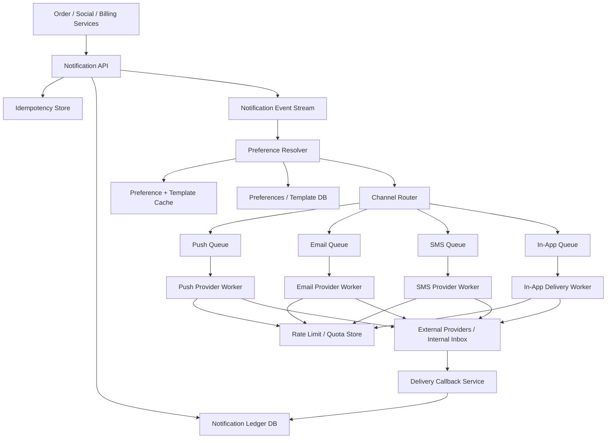
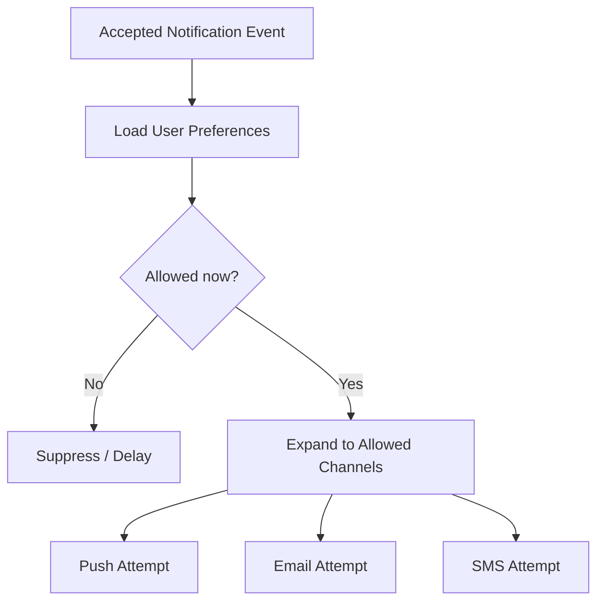

# System Design: Notification System

> Design a multi-channel notification platform that processes 3B notifications per day, supports push, email, SMS, and in-app delivery, respects user preferences and rate limits, and keeps retries from overwhelming downstream providers.

---

## Concepts Covered

- **Concept 01** - Horizontal vs Vertical Scaling & Auto-scaling
- **Concept 04** - API Gateway, Reverse Proxy & Rate Limiting
- **Concept 05** - API Design Patterns
- **Concept 13** - Synchronous vs Asynchronous Communication Patterns
- **Concept 14** - Message Queues & Stream Processing
- **Concept 15** - Event-Driven Architecture & Event Sourcing
- **Concept 19** - Fault Tolerance Patterns
- **Concept 20** - Idempotency, Deduplication & Exactly-Once Semantics
- **Concept 21** - Monitoring, Observability & SLOs/SLAs
- **Concept 22** - Microservices vs Monolith
- **Concept 25** - Distributed Task Scheduling & Workflow Orchestration

---

## Step 1: Requirements & Scope

### Functional Requirements

- **Accept notification events from upstream systems**: Order systems, social events, billing alerts, and security flows all need to submit notification intents.
- **Support multiple delivery channels**: Push, email, SMS, and in-app notifications are the main channels. Different products may use one or several channels for the same event.
- **Respect user preferences and do-not-disturb rules**: The platform must know whether a user opted out, muted a category, or prefers a different channel.
- **Support priority and urgency classes**: Password reset and fraud alerts are different from marketing nudges, and the system should treat them differently.
- **Deduplicate notifications**: Upstream retries or duplicate business events should not spam users.
- **Retry transient failures and quarantine permanent failures**: External providers fail often enough that retry logic is part of the core design.
- **Provide delivery status**: Upstream teams want to know whether a notification was accepted, delivered, throttled, or failed.

### Non-Functional Requirements

- **Availability target**: 99.99% for accepting notification requests. Producers should not block core business flows because one channel provider is degraded.
- **Scale**: 3B notifications/day across all channels.
- **Latency target**: High-priority push notifications should typically dispatch within seconds, while low-priority marketing email can tolerate more delay.
- **Consistency**: At-least-once dispatch is acceptable if deduplication prevents user-visible duplicates.
- **Durability**: Accepted notifications should survive worker restarts and be traceable for audit/debugging.
- **Rate control**: The system must enforce per-user, per-tenant, and per-provider safety limits.
- **Graceful degradation**: If SMS or email providers fail, the rest of the platform should continue functioning.

### Out of Scope

- **Full template-authoring UI**: We will reference templates, not build the entire CMS.
- **ML send-time optimization**: Useful for marketing systems, but not core to delivery architecture.
- **Complete fraud and abuse pipeline**: We will design rate limiting, not a full anti-spam trust system.
- **Inbox feed product**: In-app notifications as a channel are included, but not a rich notification center UI.
- **Cross-region legal routing and compliance details**: Important, but separate from the base architecture.

The interesting part of notification infrastructure is not calling Twilio or APNS. It is shaping asynchronous work so preferences, retries, and rate limits are consistently enforced at scale.

---

## Step 2: Back-of-Envelope Estimation

Notification systems often have more internal work than their top-level request numbers suggest, because one event may branch into several channel deliveries.

### Traffic Estimation

Assumptions:
- Notifications/day: `3,000,000,000`
- Peak multiplier: `3x`
- Average fanout from one upstream event to actual channel sends: `1.3x`

Average notification dispatch QPS:
```text
3,000,000,000 / 86,400 = 34,722.22 notifications/sec
Peak dispatch QPS = 34,722.22 x 3 = 104,166.67 notifications/sec
```

If one upstream event often fans out to more than one channel:
```text
Effective send attempts/sec at peak = 104,166.67 x 1.3
= 135,416.67 channel attempts/sec
```

That distinction matters. A notification platform does not only count business events. It counts actual provider dispatch attempts.

### Storage Estimation

Notification ledger record:
```text
notification_id      16 bytes
user_id              8 bytes
event_type           32 bytes
channel              8 bytes
template_id          8 bytes
payload refs         64 bytes
status               8 bytes
timestamps           24 bytes
attempt_count        4 bytes
provider metadata    64 bytes
overhead / indexes   272 bytes
--------------------------------
~500 bytes per attempt record
```

Daily ledger storage:
Because the ledger stores channel attempts, we should apply the `1.3x` fanout assumption here too.

```text
3,000,000,000 x 1.3 = 3,900,000,000 attempt records/day
3,900,000,000 x 500 bytes = 1,950,000,000,000 bytes/day
= 1.95 TB/day
```

30-day hot retention:
```text
1.95 TB/day x 30 = 58.5 TB
```

With replication factor 3:
```text
58.5 TB x 3 = 175.5 TB
```

This is big, but notification attempt history is operationally valuable, especially for debugging and audits.

### Bandwidth Estimation

Assume average serialized attempt payload is about `1 KB`.

Peak dispatch bandwidth:
```text
135,416.67 attempts/sec x 1 KB = 135,416.67 KB/sec
= 132.24 MB/sec
```

This is not outrageous for backend systems. The hard part is not network cost. It is controlled interaction with external providers that have their own limits and failure modes.

### Memory Estimation (for caching)

The most valuable hot cache entries are:
- user preference bundles
- notification templates
- rate-limit counters

Suppose:
- 50M active users with cached preference snapshots
- 200 bytes per preference bundle

```text
50,000,000 x 200 bytes = 10,000,000,000 bytes
= 9.31 GB
```

Rate-limit counters and hot templates add more, so a `20-30 GB` Redis tier is a reasonable first target.

### Summary Table

| Metric | Value |
|--------|-------|
| Notification QPS (average) | ~34,722 |
| Notification QPS (peak) | ~104,167 |
| Effective peak channel attempts | ~135,417/sec |
| Daily ledger storage | ~1.95 TB |
| 30-day hot storage with replication | ~175.5 TB |
| Peak dispatch bandwidth | ~132 MB/sec |
| Preference/rate-limit cache target | ~20-30 GB |

---

## Step 3: API Design

This platform primarily accepts event intents from other services, so REST or gRPC both work. I will use REST for clarity because the contract is easy to read and debug.

Cross-reference: **Concept 05 - API Design Patterns**.

### Create Notification Request

```
POST /api/v1/notifications
```

**Parameters:**
| Parameter | Type | Required | Description |
|-----------|------|----------|-------------|
| idempotency_key | string | Yes | Prevent duplicate submission |
| user_id | string | Yes | Target user |
| event_type | string | Yes | Logical notification type |
| channels | array<string> | No | Allowed channels, such as push/email |
| priority | string | Yes | low, normal, high, critical |
| template_id | string | Yes | Message template |
| template_vars | object | Yes | Template variables |
| send_after | string | No | Delayed send time |

**Response:**
```json
{
  "notification_id": "n_88231",
  "status": "accepted",
  "accepted_at": "2026-03-20T12:00:00Z"
}
```

**Design Notes:** Upstream systems should get a fast acceptance response once the request is durably recorded, not once APNS or SMTP confirms delivery.

### Get Notification Status

```
GET /api/v1/notifications/{notification_id}
```

**Parameters:**
| Parameter | Type | Required | Description |
|-----------|------|----------|-------------|
| notification_id | string | Yes | Notification record ID |

**Response:**
```json
{
  "notification_id": "n_88231",
  "status": "delivered",
  "channel_results": [
    {
      "channel": "push",
      "status": "delivered",
      "provider_message_id": "apns_123"
    }
  ]
}
```

### Update Preferences

```
PUT /api/v1/users/{user_id}/notification-preferences
```

**Parameters:**
| Parameter | Type | Required | Description |
|-----------|------|----------|-------------|
| user_id | string | Yes | Target user |
| muted_event_types | array<string> | No | Muted categories |
| do_not_disturb | object | No | Quiet-hour window |
| channel_prefs | object | No | Preferred channels |

**Response:**
```json
{
  "status": "updated"
}
```

### Provider Callback

```
POST /api/v1/provider-callbacks/{channel}
```

**Parameters:**
| Parameter | Type | Required | Description |
|-----------|------|----------|-------------|
| provider_message_id | string | Yes | External provider ID |
| status | string | Yes | delivered, bounced, failed |

**Response:**
```json
{
  "status": "recorded"
}
```

Provider callbacks are essential because delivery is often asynchronous and provider-specific.

---

## Step 4: Data Model

### Database Choice

We use a mixed architecture:

- **PostgreSQL or relational store** for templates, user preferences, and configuration
- **Notification ledger store** in a scalable wide-column or partitioned SQL system for attempt history
- **Kafka / durable queues** for acceptance, scheduling, and channel dispatch
- **Redis** for hot preferences, rate limits, and dedupe windows

This division works because config and history have very different access patterns. Preferences are small, hot, and mutable. Attempt ledgers are append-heavy and large. Rate-limit counters are ephemeral and fast.

### Schema Design

```text
Table: notification_requests
├── notification_id      UUID            PRIMARY KEY
├── idempotency_key      VARCHAR(128)    NOT NULL UNIQUE
├── user_id              BIGINT          NOT NULL
├── event_type           VARCHAR(64)     NOT NULL
├── priority             SMALLINT        NOT NULL
├── template_id          BIGINT          NOT NULL
├── send_after           TIMESTAMP       NULLABLE
├── status               SMALLINT        NOT NULL
├── created_at           TIMESTAMP       NOT NULL
└── INDEX: idx_requests_user_created ON (user_id, created_at)
```

```text
Table: notification_attempts
├── notification_id      UUID            NOT NULL
├── channel              VARCHAR(16)     NOT NULL
├── attempt_no           INTEGER         NOT NULL
├── provider             VARCHAR(32)     NOT NULL
├── status               VARCHAR(32)     NOT NULL
├── error_code           VARCHAR(64)     NULLABLE
├── created_at           TIMESTAMP       NOT NULL
└── PRIMARY KEY (notification_id, channel, attempt_no)
```

```text
Table: user_notification_preferences
├── user_id              BIGINT          PRIMARY KEY
├── muted_types          JSONB           NOT NULL
├── quiet_hours          JSONB           NULLABLE
├── channel_prefs        JSONB           NOT NULL
└── updated_at           TIMESTAMP       NOT NULL
```

### Access Patterns

- **Accept new notification**: insert request row, dedupe on idempotency key
- **Resolve user preferences**: point read by `user_id`
- **Append attempt results**: write into `notification_attempts`
- **List user delivery history**: read by `user_id` or join by `notification_id`
- **Apply delayed sends**: scan or schedule by `send_after`

The system is easier to reason about when the authoritative user preference model is separate from the high-volume attempt ledger.

---

## Step 5: High-Level Architecture

### Mermaid Diagram



### Architecture Walkthrough

Everything begins with an upstream service creating a notification intent. That might be an order-confirmation event, a password-reset flow, a follow notification, or a failed-payment reminder. The producer sends the request to the Notification API, which first checks the idempotency store. This is important because upstream systems retry, and we never want retries to turn into duplicate user-visible notifications.

Once deduplication passes, the Notification API records the accepted notification in the ledger and publishes an event into the stream. This design decision is critical: we acknowledge upstream producers when the notification is durably accepted, not when a downstream provider says "delivered." That keeps business systems decoupled from provider-specific delays and failures.

Next comes the preference resolver. This service loads user preferences, quiet hours, allowed channels, and template configuration. We cache hot preference bundles aggressively because they are read on almost every notification. If a user muted marketing email but allows high-priority push alerts, the resolver filters and rewrites the downstream channel plan before anything is sent.

The channel router takes the filtered notification and expands it into concrete channel attempts. For example, a high-priority security alert may route to push plus SMS, while a low-priority weekly digest routes to email only. The router also assigns priority classes so urgent traffic does not sit behind marketing noise. That is where **Concept 25 - Distributed Task Scheduling & Workflow Orchestration** starts to show up in a lightweight form: there is real dispatch policy, not just a flat queue.

Each channel has its own queue. That separation is one of the most valuable architectural decisions in the system. Push, email, and SMS have different latencies, provider APIs, failure patterns, and rate limits. A big email campaign should never starve password-reset SMS. Splitting the lanes lets each worker fleet scale and fail independently.

Channel workers then enforce rate limits and quotas before calling providers. This is where **Concept 04 - API Gateway, Reverse Proxy & Rate Limiting** becomes relevant operationally. External providers have hard limits, and users should not receive a storm of repeated sends because our retry policy was careless. The rate-limit store tracks per-user, per-tenant, and per-provider counters.

Provider calls are mostly asynchronous. Workers submit the message and record provider message IDs. Some providers return immediate success, others provide eventual delivery callbacks, and some only confirm acceptance. The callback service receives delivery updates and writes final state back into the ledger. That ledger then becomes the source of truth for status APIs and operational debugging.

Retries are intentionally not inline. If a provider returns a transient error, the worker republishes the attempt to a delayed retry queue with exponential backoff and jitter. If the provider indicates a permanent failure like "invalid device token" or "hard email bounce," the worker marks the attempt failed and may trigger cleanup such as device-token invalidation.

This architecture degrades gracefully because the channels are isolated. If SMS providers fail, push and email continue. If the preference database is temporarily unavailable, cached preference bundles can handle a portion of traffic. If a queue backs up, only that lane suffers. That is exactly what we want from a notification platform because it sits next to many critical product flows but should not become their single point of global failure.

The final important note is that this system is both event-driven and user-sensitive. It cannot be a dumb fire-and-forget pipe. Preferences, dedupe, rate limits, retries, and provider feedback all materially change what the user experiences. That is why the control plane matters just as much as the channel worker fleets.

It also explains why durability and policy resolution happen before expensive provider interaction. Once the platform accepts the notification, it needs a replayable, inspectable record of what should happen next even if one downstream channel or provider starts failing immediately afterward.

---

## Step 6: Deep Dives

### Deep Dive 1: Preference Resolution Before Channel Fanout

A common beginner mistake is to let every producer decide all channels. That creates duplication, inconsistent quiet-hour behavior, and product teams bypassing user preferences. The platform should resolve preferences centrally before it creates actual send attempts.

### Mermaid Diagram



### Diagram Walkthrough

This diagram shows why preference resolution is a first-class stage rather than a helper library buried inside every worker. A new notification event first loads the user's preference profile. Then the decision engine asks: is this allowed now? Quiet hours, channel opt-outs, and priority exceptions all live here.

If the answer is no, the system can suppress or delay the notification. If yes, it expands the logical event into concrete channel attempts. This keeps user intent centralized and consistent, which is essential in a platform that many upstream teams will use.

Cross-reference: **Concept 15 - Event-Driven Architecture & Event Sourcing** because the channel attempts are derived events, not the original business event itself.

### Deep Dive 2: Retries, Jitter, and Dead-Letter Queues

Notification providers fail all the time. DNS issues, rate-limit bursts, temporary SMTP problems, APNS hiccups, and carrier delays are routine. A good system must retry intelligently without creating retry storms.

The right pattern is:
- classify errors as transient or permanent
- use exponential backoff with jitter for transient failures
- stop retrying on permanent failures
- move poison messages to a dead-letter queue after a threshold

Jitter matters because if 100,000 notifications all retry exactly 60 seconds later, the retry wave can be as damaging as the original failure.

### Deep Dive 3: Priority Isolation

One shared queue for every notification looks simple but behaves badly. Marketing traffic and critical alerts should not share the same lane. Password reset, MFA, fraud alert, and receipt notifications deserve dedicated or priority-aware scheduling.

Useful tactics:
- separate queues by channel and priority
- reserve a portion of worker capacity for urgent classes
- cap low-priority bulk campaigns
- allow graceful shedding of non-critical notification classes

This is where a notification platform stops being "just a queue" and becomes a policy engine.

### Deep Dive 4: Provider Failover and Token Hygiene

Push tokens expire, email addresses hard-bounce, phone numbers go stale, and providers experience partial outages. So provider response handling has to be more than logging.

The platform should:
- mark invalid push tokens inactive
- suppress future sends to hard-bounced emails
- route to secondary providers where product policy allows
- keep provider-specific error categories normalized into internal status codes

Without this hygiene, retries become spam and cost spirals upward.

---

## Step 7: Bottlenecks & Scaling

### Identifying Bottlenecks

At `10x` scale, the first bottleneck is almost always downstream provider capacity or your own rate-limit enforcement, not the Notification API. The internal API can accept requests quickly, but push or SMS lanes back up under spikes.

The second bottleneck is preference-resolution read volume. If preference cache hit rates drop, the system adds database reads to nearly every notification path. That increases latency and creates unnecessary dependency on the configuration store.

At `100x`, ledger write amplification and callback ingestion become significant. A single logical notification may create several attempt records plus multiple status updates.

### Scaling Solutions

| Bottleneck | Solution | Impact | New Ceiling | Cross-reference |
|------------|----------|--------|-------------|-----------------|
| Provider bottlenecks | Channel-isolated queues and provider-level throttles | Prevents one lane from drowning others | Higher safe aggregate throughput | Concept 04 |
| Preference DB pressure | Aggressive caching and versioned preference snapshots | Lowers read amplification | Better p99 dispatch latency | Concept 10 |
| Retry storms | Delayed queues with exponential backoff + jitter | Smoother recovery from provider failures | More stable systems under incident load | Concept 19 |
| Callback volume | Batch callback ingestion and normalized status writes | Reduces tiny write amplification | Better status-pipeline scalability | Concept 14 |

### Failure Scenarios

- **Email provider outage**: Email queue grows, retries engage, but push/SMS/in-app continue.
- **Preference DB outage**: Cached preferences serve hot users; cold misses may be delayed or fail closed depending on policy.
- **Rate-limit store outage**: The system should fail safe for risky channels or use conservative local fallback limits.
- **Worker fleet crash**: Accepted notifications remain durable in queues and ledgers, then replay on recovery.
- **Callback service lag**: User-facing status becomes stale, but actual sends may still be happening.

This is a good example of why channel isolation and durable intent recording matter so much. Notification systems are full of partial failures.

---

## Step 8: Monitoring & Alerting

### Key Metrics to Track

Business metrics:
- Notifications accepted per minute
- Notifications delivered per channel
- Suppression rate due to preferences
- High-priority delivery success rate

Infrastructure metrics:
- Queue depth by channel and priority
- Preference cache hit ratio
- Provider API latency and error rates
- Retry volume and dead-letter queue growth
- Callback processing lag
- Rate-limit rejects by dimension

### SLOs

- **Acceptance availability**: 99.99%
- **High-priority dispatch latency**: 99% enqueued to provider within 5 seconds
- **Low-priority dispatch latency**: 99% within defined campaign SLA
- **Duplicate-send rate**: near zero at user-visible layer
- **Status freshness**: 99% of provider callbacks reflected within 60 seconds

### Alerting Rules

- **CRITICAL**: High-priority queue age > 30 seconds
- **CRITICAL**: Provider failure rate > 5% for critical channel
- **WARNING**: Preference cache hit ratio < 85%
- **WARNING**: Dead-letter queue growth above threshold
- **CRITICAL**: Duplicate-send detection above baseline
- **WARNING**: Callback lag > 5 minutes

Cross-reference: **Concept 21 - Monitoring, Observability & SLOs/SLAs**.

One subtle but important operational practice is to monitor notifications by semantic category, not just by transport channel. If password resets, fraud alerts, marketing campaigns, and social pings are all mixed into one success graph, teams lose the ability to reason about user impact quickly. The platform should make priority and category dimensions visible everywhere from queue dashboards to provider error charts.

Another useful discipline is to track suppression as a success path when it is policy-correct. A muted marketing notification that never sends is not a failure. It is the system doing the right thing. Teams that only count "sends" and "failures" often misread healthy preference enforcement as lost traffic. That mistake leads to pressure to bypass preferences, which is exactly what a central notification platform exists to prevent.

Templating also deserves more architectural respect than it first appears to. Rendering rich notifications with localization, tenant branding, and fallback copy can become a meaningful source of latency and failure if it happens too late or too many times. Mature systems pre-validate templates, cache render fragments aggressively, and keep rendering isolated from the most urgent dispatch paths so that a bad marketing template does not slow security notifications.

Finally, channel economics matter. SMS is expensive, push is cheap but token-fragile, email is flexible but slower and bounce-prone, and in-app delivery is inexpensive but depends on the user opening the product. A good notification platform therefore becomes part policy engine and part cost-control system. Teams use it not just to send messages, but to encode which channels are worth spending on for which user experiences.

That economic view also affects retries and fallback. A critical account-recovery flow may justify an expensive SMS fallback after push failure, while a social-engagement notification should almost never escalate channels because the business value is too low. Good notification platforms make those escalation rules explicit so cost, urgency, and user trust stay aligned.

The same logic applies to batching. Digest emails and low-priority in-app notifications often benefit from aggregation because batching reduces noise and provider cost. High-priority transactional messages should bypass batching entirely. Once a platform supports both patterns intentionally, it becomes much easier for product teams to use notifications responsibly instead of treating every event as equally urgent.

---

## Summary

### Key Design Decisions

1. **Accept and durably record notifications before channel dispatch** so upstream systems stay decoupled from provider behavior.
2. **Resolve preferences centrally** so user intent is enforced consistently across all products and channels.
3. **Split queues by channel and priority** so bulk traffic never starves urgent alerts.
4. **Use explicit dedupe and retry policies** because notification systems live in an at-least-once world.
5. **Treat provider feedback as part of the data model** because delivery status is not a side effect; it is core platform truth.

### Top Tradeoffs

1. **Fast dispatch versus strict central checks**: More policy checks improve correctness but add latency to every send.
2. **At-least-once durability versus duplicate risk**: We choose durable acceptance and then aggressively dedupe rather than pretending retries do not exist.
3. **One generic worker fleet versus isolated channel lanes**: Isolated lanes cost more operationally but prevent one provider failure from becoming a platform-wide incident.

### Alternative Approaches

- Smaller products can start with one queue and one or two channels, then split lanes as priorities and volumes grow.
- Marketing-heavy systems may need more advanced send-time optimization and campaign orchestration than this core platform emphasizes.
- Some products may choose provider-managed fanout features for simplicity, but that gives up policy control, observability, and multi-channel consistency.

The main lesson is that a notification platform is a policy-rich event router, not a thin wrapper around provider APIs. Once you accept that, the architecture choices become much clearer and the system becomes much easier to scale without annoying users.

It is also one of those systems where "small correctness details" are actually product-defining. Quiet-hour handling, duplicate suppression, fallback rules, and provider error normalization all sound like implementation details until users get woken up at 3 AM or receive the same alert three times. That is why the best notification platforms feel boring from the outside: they quietly encode a lot of careful judgment on behalf of every upstream product team.

That kind of boring reliability is exactly what makes the platform valuable. Notification systems are unusual because users often remember their failures more vividly than their successes. A missed fraud alert, a broken password reset, or a spammy duplicate marketing blast creates mistrust that lingers long after the incident is over. The architecture therefore has to optimize for restraint as much as raw delivery throughput.

This is also where channel economics and policy discipline meet. SMS, push, email, and in-app delivery all have different cost profiles, latency expectations, and failure behaviors. A mature platform should help product teams express intent such as "try push first, fall back to email if unopened, never send overnight, and do not exceed one reminder per day" without re-implementing that logic service by service. The central notification architecture earns its keep by making those policies consistent, auditable, and cheap to operate.

Finally, operator experience matters here as much as end-user experience. During incidents, teams need to mute campaigns, reroute around one provider, pause low-priority fanout, or inspect dedupe behavior without guessing. The strongest systems make those controls explicit. When they do, upstream teams can move quickly without turning the notification layer into a constant source of accidental customer harm.

Seen that way, the platform's real output is not just a stream of messages. It is a controlled communication contract between the product and the user. Scaling that contract safely requires durable acceptance, consistent policy evaluation, provider isolation, and humane operator controls. That combination is what turns a noisy operational subsystem into one of the most leverage-rich pieces of infrastructure in the company.

It is that combination of durable intake, centralized policy, and operator control that turns notifications from a risky ad hoc utility into a dependable platform capability. When the system gets these foundations right, product teams can add new journeys and channels confidently because they are building on top of shared guardrails instead of re-learning the same painful delivery lessons one incident at a time.

That is the real scale advantage of a platformized design: not just more throughput, but better institutional memory encoded in software. Every preference rule, fallback path, and dedupe guard becomes a reusable safety rail for the next team and the next campaign.

That reuse is what keeps growth from turning into notification chaos as the product surface expands.

It also gives the company a durable way to improve communication quality over time. Every incident teaches the platform something reusable: a better retry rule, a safer provider fallback, a clearer preference dimension, a stronger campaign throttle, or a smarter delivery-status normalization. When those lessons are absorbed once into the platform instead of repeatedly rediscovered in product teams, the notification system becomes a compound-interest engine for trust rather than a recurring source of accidental customer harm.
