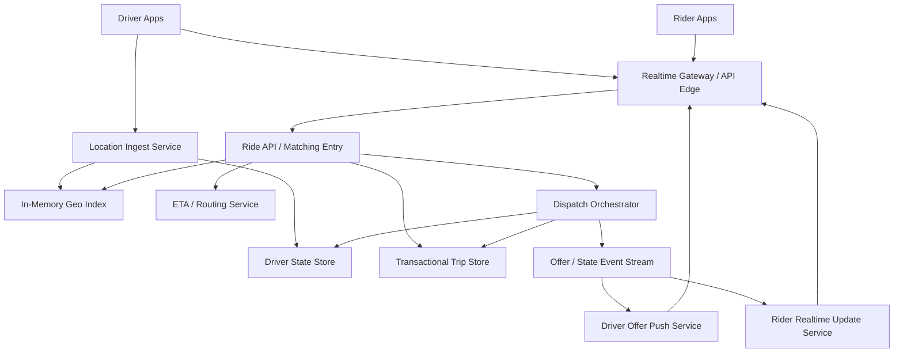
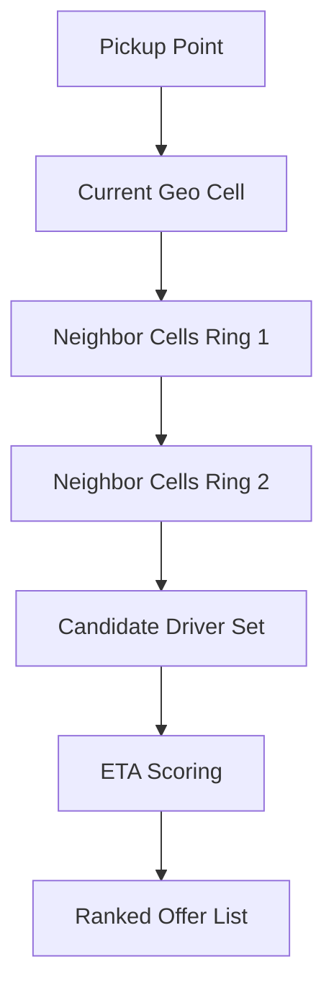

# System Design: Uber / Ride Matching

> Design a ride-matching platform that handles 50M ride requests per day, ingests 400K driver location updates per second at peak, and matches riders to nearby drivers with low-latency ETA-aware dispatch.

---

## Concepts Covered

- **Concept 01** - Horizontal vs Vertical Scaling & Auto-scaling
- **Concept 02** - Load Balancing Deep Dive
- **Concept 05** - API Design Patterns
- **Concept 07** - NoSQL Deep Dive
- **Concept 12** - Data Modeling for Scale
- **Concept 13** - Synchronous vs Asynchronous Communication Patterns
- **Concept 14** - Message Queues & Stream Processing
- **Concept 15** - Event-Driven Architecture & Event Sourcing
- **Concept 16** - Real-time Communication
- **Concept 19** - Fault Tolerance Patterns
- **Concept 21** - Monitoring, Observability & SLOs/SLAs

---

## Step 1: Requirements & Scope

### Functional Requirements

- **Drivers send continuous location updates**: The system needs fresh supply-side state before it can match anything correctly.
- **Riders can request a trip with pickup and destination**: This is the core write path from the rider side.
- **The system finds nearby eligible drivers**: Matching should consider distance, ETA, status, and maybe driver constraints.
- **Drivers receive trip offers in near real time**: Dispatch latency matters because rider experience degrades quickly if matching feels slow.
- **Drivers can accept or reject trip offers**: The matching workflow must handle race conditions and expiration windows.
- **Riders and drivers receive live status updates**: Assignment, ETA, arrival, pickup, and trip progress should update in real time.
- **The system handles hotspot demand and surge behavior**: Urban spikes are not edge cases; they are the normal hard part of the product.

### Non-Functional Requirements

- **Availability target**: 99.99% for trip request acceptance and active-trip state updates.
- **Match latency**: p99 under 2 seconds from rider request to first driver offer in healthy regions.
- **Scale**: 50M ride requests/day, 2M online drivers at peak, and driver location pings every 5 seconds.
- **Consistency**: Strong correctness for "one driver gets one ride assignment at a time." Eventual consistency is acceptable for map smoothing and some rider ETA updates.
- **Durability**: Accepted trip state and payment-relevant milestones must not be lost.
- **Freshness**: Location data should usually be no more than a few seconds old for active matching.
- **Graceful degradation**: If live ETA precision drops during an incident, the system should still accept rides and match conservatively instead of failing entirely.

### Out of Scope

- **Pricing and payment systems**: We will mention surge and fare estimation, but not fully design billing.
- **Navigation engine internals**: We will assume an ETA or routing service exists.
- **Fraud detection and driver safety workflows**: Important but separate.
- **Long-term dispatch optimization and marketplace economics**: We will touch supply-demand balance, not build the whole optimization engine.
- **Food delivery or batch routing variants**: This is the one-rider, one-driver matching case.

The main challenge is that this is both a realtime system and a transactional assignment system. Low-latency matching is useless if two drivers get assigned the same rider or one driver gets double-booked.

---

## Step 2: Back-of-Envelope Estimation

Ride matching looks modest if you only count completed trips. It becomes much more demanding once you count driver pings and dispatch loops.

### Traffic Estimation

Assumptions:
- Ride requests/day: `50,000,000`
- Peak multiplier for commute spikes: `10x`
- Peak online drivers: `2,000,000`
- Driver location update interval: `5 seconds`

Ride request QPS:
```text
50,000,000 / 86,400 = 578.70 ride requests/sec average
Peak ride request QPS = 578.70 x 10 = 5,787.04/sec
```

Driver location update QPS:
```text
2,000,000 online drivers / 5 seconds = 400,000 updates/sec peak
```

That is the real scale driver. Matching requests are not the main write volume. Location churn is.

### Storage Estimation

Trip record size:
```text
trip_id               16 bytes
rider_id              8 bytes
driver_id             8 bytes
pickup/dropoff refs   64 bytes
status timeline       128 bytes
timestamps            32 bytes
price/metadata        64 bytes
overhead/indexes      680 bytes
--------------------------------
~1 KB/trip
```

Trip storage/day:
```text
50,000,000 x 1 KB = 50,000,000 KB/day
= 47.68 GB/day
```

Yearly:
```text
47.68 GB/day x 365 = 17.4 TB/year
```

Location history, if retained long term, is much larger. But for matching we mostly care about the current driver location plus a short rolling history for diagnostics.

Ephemeral location state:
Assume one current location entry per online driver, around `128 bytes`.

```text
2,000,000 x 128 bytes = 256,000,000 bytes
= 244 MB
```

That is tiny. The difficulty is not storing current positions. It is updating and querying them rapidly.

### Bandwidth Estimation

Driver location ingress:
```text
400,000 updates/sec x 100 bytes/update = 40,000,000 bytes/sec
= 38.15 MB/sec
```

Ride request control traffic:
```text
5,787 requests/sec x 2 KB/request = 11,574 KB/sec
= 11.3 MB/sec
```

Again, throughput is manageable. The hard part is low-latency state mutation and geo-query fanout under hotspots.

### Memory Estimation (for caching)

For hot matching we want:
- live driver locations
- nearby-driver cell membership
- surge and market-state counters

Suppose we keep:
- 2M driver states at 128 bytes each = 244 MB
- geo-cell indexes and candidate lists = ~2 GB
- market counters and ETA cache = ~3 GB

A `6-10 GB` in-memory geo and state tier is already enough for one large regional deployment. The cost comes from write/update rate and cross-region scale, not from raw memory volume.

### Summary Table

| Metric | Value |
|--------|-------|
| Ride request QPS (average) | ~579 |
| Ride request QPS (peak) | ~5,787 |
| Peak driver location updates/sec | 400,000 |
| Trip storage/day | ~47.7 GB |
| Trip storage/year | ~17.4 TB |
| Peak location ingress bandwidth | ~38.15 MB/sec |
| Hot geo-state memory target | ~6-10 GB/region |

---

## Step 3: API Design

This system mixes realtime device streams with transactional APIs. I will model the logical surface as REST endpoints, while acknowledging that live updates and offers are pushed over persistent connections.

Cross-reference: **Concept 05 - API Design Patterns** and **Concept 16 - Real-time Communication**.

### Update Driver Location

```
POST /api/v1/drivers/{driver_id}/location
```

**Parameters:**
| Parameter | Type | Required | Description |
|-----------|------|----------|-------------|
| lat | number | Yes | Latitude |
| lng | number | Yes | Longitude |
| heading | number | No | Direction of travel |
| speed_mps | number | No | Optional speed |
| device_timestamp | string | Yes | Device-reported timestamp |

**Response:**
```json
{
  "status": "recorded"
}
```

**Design Notes:** In production this may travel over a streaming channel, but the logical contract is simple: accept frequent position updates.

### Create Ride Request

```
POST /api/v1/rides
```

**Parameters:**
| Parameter | Type | Required | Description |
|-----------|------|----------|-------------|
| rider_id | string | Yes | Requesting rider |
| pickup | object | Yes | Pickup coordinates |
| destination | object | No | Optional destination |
| product_type | string | Yes | e.g. standard, premium |

**Response:**
```json
{
  "ride_id": "r_88231",
  "status": "searching",
  "estimated_wait_sec": 120
}
```

### Accept Driver Offer

```
POST /api/v1/rides/{ride_id}/offers/{offer_id}/accept
```

**Parameters:**
| Parameter | Type | Required | Description |
|-----------|------|----------|-------------|
| driver_id | string | Yes | Driver accepting |
| vehicle_location | object | Yes | Current driver position |

**Response:**
```json
{
  "status": "assigned",
  "ride_id": "r_88231",
  "driver_id": "d_912"
}
```

**Design Notes:** This endpoint must enforce assignment correctness atomically. A driver cannot accept an offer if the ride or driver state already changed.

### Get Active Ride State

```
GET /api/v1/rides/{ride_id}
```

**Response:**
```json
{
  "ride_id": "r_88231",
  "status": "driver_assigned",
  "driver_eta_sec": 180,
  "driver_id": "d_912"
}
```

---

## Step 4: Data Model

### Database Choice

We use a hybrid model:

- **Transactional trip store**: relational database or strongly consistent transactional system for trip and assignment state
- **Geo-state store**: in-memory geospatial index for live driver locations
- **Event stream**: ride state changes, location events, and driver-offer workflows
- **Cache / routing layer**: active ride state and nearby-driver snapshots

Why the split:
- trip assignment correctness wants transactional semantics
- driver locations want fast in-memory mutation and geospatial lookup
- realtime updates want streaming and fanout rather than repeated polling

This is exactly the kind of system where one database cannot do everything well.

### Schema Design

```text
Table: rides
├── ride_id             UUID            PRIMARY KEY
├── rider_id            BIGINT          NOT NULL
├── driver_id           BIGINT          NULLABLE
├── status              VARCHAR(32)     NOT NULL
├── pickup_lat          DOUBLE          NOT NULL
├── pickup_lng          DOUBLE          NOT NULL
├── destination_lat     DOUBLE          NULLABLE
├── destination_lng     DOUBLE          NULLABLE
├── requested_at        TIMESTAMP       NOT NULL
├── assigned_at         TIMESTAMP       NULLABLE
└── INDEX: idx_rides_rider_created ON (rider_id, requested_at)
```

```text
Table: driver_states
├── driver_id           BIGINT          PRIMARY KEY
├── availability        VARCHAR(16)     NOT NULL
├── last_cell_id        BIGINT          NOT NULL
├── last_location_at    TIMESTAMP       NOT NULL
└── last_active_ride_id UUID            NULLABLE
```

```text
Geo index key: cell:{cell_id}
Value: set of nearby available driver_ids
TTL / freshness based on recent location updates
```

### Access Patterns

- **Update driver position**: write latest state and update geo cell membership
- **Find nearby drivers**: query adjacent geo cells
- **Create ride**: insert transactionally into `rides`
- **Assign driver**: atomically move ride and driver state to assigned/busy
- **Read active ride**: lookup by `ride_id`

The geo index is optimized for "who is near this pickup right now?" The trip store is optimized for "what is the authoritative state of this ride?"

---

## Step 5: High-Level Architecture

### Mermaid Diagram



### Architecture Walkthrough

Start with the supply side because everything depends on it. Driver apps send location updates every few seconds through the location ingest service. That service writes the latest driver coordinates into an in-memory geo index and updates the driver-state store with the driver's current availability and freshness timestamp. This is where **Concept 16 - Real-time Communication** meets operational pragmatism: driver location updates are high-frequency state changes, and we cannot afford to route every matching decision through a slow primary database.

The geo index is organized by spatial cells, often using a grid scheme such as H3, S2, or a custom geohash partition. The important property is that nearby points fall into the same or neighboring cells. That lets the system answer "who is near this pickup?" without scanning every active driver in a city.

Now take the rider request flow. A rider app hits the gateway and enters the Ride API or matching entry service. The service creates a transactional ride record in the trip database with status `searching`. This write is important because once we accept the request, we need durable state for dispatch, billing, and recovery. The system then queries the geo index for nearby available drivers and calls the ETA service to score them by estimated arrival, not just straight-line distance.

The matching engine or dispatch orchestrator then picks a small ordered candidate set. This is a subtle but important detail. We rarely broadcast the request to every nearby driver simultaneously. That creates race chaos and poor driver experience. Instead, we usually offer sequentially or in very small batches, perhaps two or three candidates at a time, with short expiration windows.

The dispatch orchestrator writes offer state into the event stream and uses driver-push services to send live offers to candidate drivers through their active gateways. Driver apps respond accept or reject. When the first acceptable response arrives, the orchestrator performs an atomic assignment update: the ride state changes to `assigned`, the driver becomes `busy`, and all remaining outstanding offers are canceled or allowed to expire harmlessly. This is the core consistency boundary in the system.

Meanwhile, rider realtime updates are pushed through the same gateway tier. The rider sees states like `searching`, `driver_assigned`, `driver_arriving`, and so on. This is one of the main reasons to keep a streaming state channel active. The product would feel much worse if every ETA update required client polling.

The ETA service deserves special mention. The closest driver by straight-line distance may not be the fastest driver to the pickup. One-way streets, traffic, and road network constraints matter. So the matching system often does a first-pass geo filter, then a second-pass ETA calculation on a smaller candidate set. That keeps matching accurate without turning every request into a giant routing computation.

Failure behavior is shaped by the separation of planes. If the geo index is briefly stale, matching may be a little less optimal, but the trip database still preserves correctness. If the gateway layer has a regional hiccup, active push updates degrade, but trip state remains intact in the transactional store. If the dispatch worker crashes after creating offers but before assignment finalization, the offer workflow can be replayed from the event stream and trip state tells us the durable truth.

The key architecture lesson is that ride matching is not just a nearest-neighbor query. It is a workflow: ingest fast-moving supply state, create a rider demand record, compute candidate drivers, make expiring offers, commit exactly one assignment, and keep both sides updated in real time. Each stage exists because the product requires both speed and correctness.

That workflow framing is what keeps the system understandable when one stage slows down or behaves oddly.

---

## Step 6: Deep Dives

### Deep Dive 1: Geospatial Indexing for Nearby Driver Lookup

The geo index is the most obvious algorithmic center of the system. We partition map space into cells and maintain, for each hot cell, the set of recently updated available drivers. When a rider requests a trip, we search the pickup cell and neighboring rings outward until we find enough candidates.

### Mermaid Diagram



### Diagram Walkthrough

The search starts in the pickup's home cell. If that cell has enough fresh available drivers, we stop early. If not, we expand to nearby cells in rings. This is much cheaper than scanning all city drivers and usually good enough because most good candidates are physically nearby.

Once we have a candidate pool, we do not dispatch immediately. We run ETA scoring and business filters such as vehicle type, driver status, and maybe marketplace rules. That produces the ranked offer list the dispatch orchestrator actually uses.

This two-step process is what keeps geo search cheap and matching quality decent.

Cross-reference: **Concept 12 - Data Modeling for Scale** because the spatial partitioning is really an access-pattern design decision.

### Deep Dive 2: Dispatch Race Conditions and Offer Expiration

The hard consistency problem is simple to state: one ride should end up with one assigned driver, and one driver should not accept two rides at once. The practical way to enforce this is an atomic compare-and-set style update in the transactional layer.

When a driver accepts, the system checks:
- ride is still in `searching` or compatible `offered` state
- driver is still `available`
- offer has not expired

If all checks pass, it commits the assignment. Everyone else loses the race. This is where "strong consistency for assignment" actually lives. The geo index and offer pushes can be approximate. This state transition cannot be.

### Deep Dive 3: ETA Accuracy Versus Latency

A full routing-engine call for every nearby driver would produce better ETAs but also slow matching. A common compromise is:
- straight-line or cell-distance filtering for first pass
- route-based ETA only for top N candidates

This keeps matching latency low while avoiding obviously bad assignments. It is a classic case of staged decision-making rather than trying to be perfect in one expensive step.

### Deep Dive 4: Supply-Demand Balancing and Surge

Surge is not just pricing. It is also a matching signal. When one area has high demand and low nearby supply, the system can expand search radius faster, prefer drivers heading toward the area, or surface repositioning incentives separately. Even without full pricing design, a matching system should maintain market-level counters for supply and demand imbalance because that context affects operational behavior.

That is a good example of a real system pulling in city- or zone-level state to improve per-request decisions.

---

## Step 7: Bottlenecks & Scaling

### Identifying Bottlenecks

At `10x` scale, location update ingestion becomes the first bottleneck, not ride creation. Four million or more driver updates per second would stress geo-index write paths and cell-set maintenance. The key metrics are update lag and stale-driver percentage, not just CPU.

Hotspot cells are another early problem. A stadium exit or airport queue can concentrate massive demand into a tiny geographic area. One cell or a small ring of cells may suddenly receive far more matching requests than normal.

At `100x`, dispatch workflow contention becomes more visible. More offers, more expirations, more acceptance races, and more realtime pushes mean the orchestration and event stream need careful partitioning.

### Scaling Solutions

| Bottleneck | Solution | Impact | New Ceiling | Cross-reference |
|------------|----------|--------|-------------|-----------------|
| Geo-index write rate | Partition by region/cell and use in-memory sharded workers | Handles higher update throughput | Near-linear write scaling | Concept 01 |
| Hotspot cell overload | Cell splitting / adaptive radius control | Prevents one hotspot from dominating a shard | Better city-event resilience | Concept 19 |
| Dispatch contention | Partition offer workflows by ride or market | Reduces lock and queue contention | More stable p99 match time | Concept 14 |
| ETA service cost | Cache route estimates and cap candidate set size | Lowers compute per request | Faster matching under load | Concept 10 |

### Failure Scenarios

- **Geo-index lag**: Matching uses slightly stale driver positions, which hurts efficiency but not necessarily correctness.
- **Dispatch worker crash**: Offer workflow replays from stream; durable ride state remains in DB.
- **Gateway outage**: Live driver or rider updates degrade, but trip state persists and clients can reconnect.
- **ETA service slowdown**: The system can fall back to simpler distance heuristics rather than refusing to match.
- **Transactional DB issue**: New assignments become unsafe, which is high severity because correctness is on the line.

Ride-matching systems must prefer safe degradation over aggressive but inconsistent behavior.

---

## Step 8: Monitoring & Alerting

### Key Metrics to Track

Business metrics:
- Ride requests per minute
- Match success rate
- Average rider wait time
- Driver acceptance rate

Infrastructure metrics:
- Driver location update lag
- Geo-index stale-entry percentage
- Match latency p50/p95/p99
- Offer acceptance timeout rate
- Gateway reconnect rate
- ETA-service latency
- Trip-store write conflicts

### SLOs

- **Ride request acceptance**: 99.99%
- **First-offer latency**: 99% under 2 seconds
- **Assignment correctness**: effectively zero double-assignment incidents
- **Location freshness**: 99% of active driver states updated within 10 seconds
- **Realtime update freshness**: rider and driver state updates delivered within a few seconds under normal conditions

### Alerting Rules

- **CRITICAL**: Match p99 latency > 5 seconds
- **CRITICAL**: Assignment conflict rate above baseline
- **WARNING**: Driver location lag > 10 seconds in any major market
- **WARNING**: ETA service p99 > 1 second
- **CRITICAL**: Gateway reconnect spike 3x normal in a region
- **WARNING**: Hotspot cell queue depth exceeds threshold

Cross-reference: **Concept 21 - Monitoring, Observability & SLOs/SLAs**.

One operational nuance that often gets missed is market partitioning. Ride systems rarely behave as one homogeneous global fleet. City-level traffic patterns, regulations, geography, airport rules, and driver availability all differ materially. That means dashboards, rate limits, rollout controls, and incident response all need a strong market dimension. A design that only thinks globally often responds too slowly to local failures.

Another practical point is that rider trust depends heavily on the accuracy of state transitions, not just on average ETA quality. If the app says "driver arriving in 2 minutes" and then the assignment silently disappears, user trust drops far more sharply than if the app initially said "finding a driver, this may take longer than usual." Matching systems therefore benefit from conservative communication semantics that reflect confidence, not just optimism.

Driver-side experience also matters more than many simple system-design answers admit. Repeated bad offers, expired requests, or delayed accept confirmations train drivers to distrust the platform and ignore prompts. That means dispatch quality is not only about rider wait time. It also shapes long-term marketplace health by influencing driver acceptance behavior and platform reputation.

Finally, location quality itself is noisy. Phones drift, tunnels kill GPS, battery savers reduce update frequency, and device clocks skew. A production ride system should assume some percentage of incoming position data is stale or low quality and compensate with freshness windows, smoothing, and fallback heuristics. Matching that treats every GPS point as perfect will make avoidable mistakes at scale.

There is also a geographic planning layer that sits above the online matcher. Airports, train stations, events, and dense downtown zones often benefit from special pickup rules or precomputed meeting points because raw curbside coordinates are operationally messy. A real ride platform usually combines the generic matcher with market-specific policies for those known-problem environments.

This is also where simulation and replay become valuable. If the team can replay historical market conditions against new dispatch rules offline, it can evaluate whether a policy helps rider wait time or harms driver fairness before rolling it out citywide. Marketplace systems improve a lot when they can test dispatch logic on realistic traffic, not just on synthetic unit cases.

---

## Summary

### Key Design Decisions

1. **Separate transactional trip state from in-memory geo state** because matching needs both low-latency proximity lookup and strong assignment correctness.
2. **Use staged matching** with geo prefiltering and ETA refinement so the system stays fast without making naive assignments.
3. **Treat dispatch as an offer workflow, not a single query** because accept/reject races are a real production concern.
4. **Push live updates through realtime channels** so riders and drivers see assignment and ETA changes immediately.
5. **Degrade to conservative heuristics when support services fail** because a slower but correct match is better than a fast incorrect one.

### Top Tradeoffs

1. **ETA accuracy versus match latency**: Better route computation helps quality but costs time and compute.
2. **Broader driver offers versus driver experience**: Broadcasting widely may reduce rider wait but annoy drivers and create race complexity.
3. **Fresh location updates versus mobile/network cost**: Faster pings improve matching but raise bandwidth and battery cost.

### Alternative Approaches

- Smaller regional ride platforms can start with a simpler geo index and lower-frequency location updates.
- Some systems may use batch or queue-based marketplace optimization for pre-positioning drivers, which is a separate layer on top of this core matching design.
- Delivery-style platforms often adapt this architecture but add batching and route optimization, which changes the dispatch model substantially.

The key lesson is that ride matching is not primarily a map problem. It is a realtime state-coordination problem with a geospatial front end. Once that clicks, the architecture choices become much more defensible and much less mysterious.

That perspective helps prioritize engineering work well. Better geospatial indexing, cleaner assignment commits, safer dispatch retries, and clearer market-level controls usually do more for platform quality than endlessly polishing one more ETA heuristic in isolation. In ride systems, coordination discipline is the multiplier on every other improvement.

The strongest systems keep that lesson visible in both architecture and operations. They know that marketplace health emerges from many small coordination choices: how long driver offers remain active, how aggressively the system retries after rejection, how stale a location update may be before it is ignored, and how each city is segmented for routing and incident response. Those decisions shape rider wait times, driver trust, and operational stability together.

It is also what makes city-level operations and product promises line up cleanly under real demand. A dispatch engine that is explicit about assignment state, market partitions, and fallback heuristics can be reasoned about by both engineers and operations teams. A dispatch engine that hides those realities behind one global matching score tends to work only on quiet days and becomes confusing precisely when surge or local disruption makes clarity most important.

In the end, ride matching is valuable because it turns messy, noisy, real-world movement into a predictable transaction between two people. That requires geospatial data, but it requires even more discipline around state ownership, retries, and realtime communication. The architectural payoff is a platform that keeps making sane decisions even when traffic, driver supply, and mobile networks are all misbehaving at once.

That is also why the best ride platforms invest heavily in operational visibility by market instead of only at a global level. A dispatch system that can explain why assignments are slowing in one airport, one neighborhood, or one city is far easier to trust and improve than one that only reports aggregate QPS and latency. For this class of system, explainability is not cosmetic. It is part of keeping a living marketplace healthy.

That is also why marketplace systems benefit from treating each city or operating zone as a first-class unit of control. Supply incentives, dispatch tuning, surge behavior, and fallback heuristics rarely behave identically everywhere. The architecture becomes more resilient when it supports local policy and local observability without giving up the shared primitives for identity, payments, trip state, and realtime routing.

Seen that way, the matching engine is both a distributed systems service and an operations product. It succeeds when engineers and city operators can both understand why the marketplace is behaving the way it is, especially when conditions are noisy or demand spikes abruptly.

That shared understanding is one of the biggest competitive advantages a mature ride platform can have.

It is also what makes the system resilient when the environment is messy instead of ideal. Traffic spikes, rain, concerts, partial mapping outages, or short-term driver shortages do not need a perfect algorithmic answer every second. They need a platform that can widen search safely, expose the right operational controls, and preserve assignment correctness while the market rebalances. That kind of resilience is a direct consequence of treating dispatch as coordinated state management first and clever prediction second.

The marketplace stays legible because the system can explain itself one city and one trip at a time. That is a powerful property. It means operations teams can tune local policy without losing the shared guarantees around trip truth, engineers can debug assignment anomalies without guessing, and product promises about ETAs or match reliability can stay grounded in how the dispatch engine actually behaves under pressure. That kind of legibility is one of the hardest things to retrofit later.
