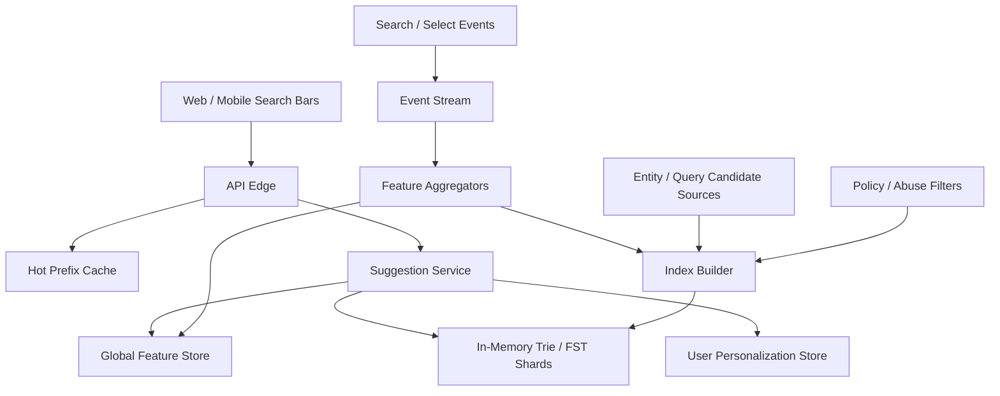
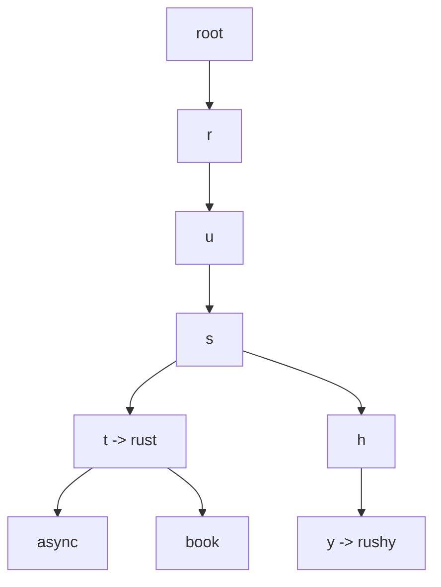

# System Design: Typeahead / Autocomplete

> Design an autocomplete service that serves 5B suggestion requests per day, returns suggestions in under 50ms, ranks by popularity and personalization, and refreshes its index continuously from query and click streams.

---

## Concepts Covered

- **Concept 01** - Horizontal vs Vertical Scaling & Auto-scaling
- **Concept 05** - API Design Patterns
- **Concept 10** - Caching Strategies
- **Concept 12** - Data Modeling for Scale
- **Concept 13** - Synchronous vs Asynchronous Communication Patterns
- **Concept 14** - Message Queues & Stream Processing
- **Concept 21** - Monitoring, Observability & SLOs/SLAs
- **Concept 24** - Search Systems

---

## Step 1: Requirements & Scope

### Functional Requirements

- **Return suggestions as the user types**: This is the core read path. Every keystroke should produce meaningful candidate suggestions.
- **Rank suggestions by popularity and relevance**: Prefix matches alone are not enough; users expect better ordering than alphabetical results.
- **Support typo-tolerant or normalized matching for common cases**: Full fuzzy search may be too expensive for every keystroke, but normalization and some near-match support are valuable.
- **Support personalization when user identity is available**: Frequent or recent user behavior should influence suggestion ordering when possible.
- **Return suggestions with metadata**: For example, suggestion type, display label, or target entity ID.
- **Update suggestions continuously from search logs and source data changes**: Autocomplete quality decays if it never learns from new behavior.
- **Filter abusive or low-quality suggestions**: The system should avoid surfacing spammy or policy-violating suggestions.

### Non-Functional Requirements

- **Availability target**: 99.99% because autocomplete is a top-of-funnel experience that users trigger constantly.
- **Latency target**: p99 under 50ms at the service layer. This is stricter than many search systems because autocomplete happens on every keystroke.
- **Scale**: 500M search sessions/day and around 10 keystrokes per session, which implies 5B suggestion lookups/day.
- **Consistency**: Eventual consistency is acceptable for suggestion freshness. A new trending term can take a short time to surface.
- **Freshness**: Popularity and trend updates should typically reflect within minutes, not days.
- **Efficiency**: The system should avoid hitting heavyweight full-text search infrastructure on every keystroke if a lighter prefix structure can answer the request.
- **Graceful degradation**: If personalization fails, the system should still return global suggestions rather than nothing.

### Out of Scope

- **Full search results page ranking**: We are designing the pre-search suggestion layer.
- **Universal fuzzy matching for arbitrary edit distance**: Useful, but too expensive to make the baseline path.
- **Voice query understanding**: Separate pipeline.
- **Ads or sponsored suggestions**: Common in practice, but not the core system-design problem.
- **Cross-language transliteration models**: We may normalize input, but not design all international language handling.

Autocomplete is deceptively hard because the latency budget is tiny and the query volume is huge. It is one of the cleanest examples of why specialized data structures exist in production systems.

---

## Step 2: Back-of-Envelope Estimation

Autocomplete traffic is dominated by keystrokes, not completed searches.

### Traffic Estimation

Assumptions:
- Search sessions/day: `500,000,000`
- Average keystrokes per session: `10`
- Suggestion lookups/day: `5,000,000,000`
- Peak multiplier: `3x`

Suggestion QPS:
```text
5,000,000,000 / 86,400 = 57,870.37 suggestion requests/sec average
Peak QPS = 57,870.37 x 3 = 173,611.11/sec
```

If 30% of sessions produce a final selection/click event:
```text
500,000,000 x 30% = 150,000,000 selection events/day
150,000,000 / 86,400 = 1,736.11 selection events/sec average
```

Selection volume is much smaller than query volume, but it is strategically important because it drives ranking quality.

### Storage Estimation

Assume:
- 100M unique candidate terms/entities
- average term length plus metadata in trie/fst node representation ~= 20 bytes logical
- overhead for node edges, weights, and compact index structures averages much higher than the raw strings alone

A realistic compressed autocomplete index might average around `50 bytes` per candidate on disk and more in memory, depending on the implementation.

```text
100,000,000 candidates x 50 bytes = 5,000,000,000 bytes
= 4.66 GB compressed index
```

If we hold multiple shards, language partitions, and replicas:
```text
4.66 GB x 2 replicas x 4 regional partitions ~= 37.3 GB
```

Personalization features:
Suppose we maintain recent suggestion weights for 50M active users, 100 recent terms each, around 24 bytes per entry.

```text
50,000,000 x 100 x 24 bytes = 120,000,000,000 bytes
= 111.8 GB
```

That is too large to keep all in one ultra-hot memory tier, so we either keep smaller windows, compress heavily, or store personalization in a secondary fast store rather than the core trie.

### Bandwidth Estimation

Suggestion response payload:
```text
Assume 8 suggestions per response
Average 80 bytes per suggestion with metadata
= 640 bytes/response
Round to 1 KB with headers/JSON
```

Peak egress:
```text
173,611 requests/sec x 1 KB = 173,611 KB/sec
= 169.54 MB/sec
```

This is significant but entirely manageable for a memory-first service.

### Memory Estimation (for caching)

If we cache the top 1M hot prefixes and each cached entry consumes about 2 KB:

```text
1,000,000 x 2 KB = 2,000,000 KB
= 1.91 GB
```

Add personalization lookups, shard-local structures, and overhead, and a `10-20 GB` RAM footprint per major cluster is reasonable.

### Summary Table

| Metric | Value |
|--------|-------|
| Suggestion QPS (average) | ~57,870 |
| Suggestion QPS (peak) | ~173,611 |
| Selection events/sec (average) | ~1,736 |
| Compressed global index size | ~4.66 GB |
| Replicated multi-region index footprint | ~37.3 GB |
| Peak service egress | ~169.5 MB/sec |
| Hot prefix cache target | ~1.9 GB |

---

## Step 3: API Design

Autocomplete is naturally an HTTP GET surface. The requests are short, cacheable for extremely hot prefixes, and easy to debug.

Cross-reference: **Concept 05 - API Design Patterns**.

### Get Suggestions

```
GET /api/v1/autocomplete?q=rust&limit=8
```

**Parameters:**
| Parameter | Type | Required | Description |
|-----------|------|----------|-------------|
| q | string | Yes | Input prefix |
| limit | integer | No | Number of suggestions |
| locale | string | No | Language/region hint |
| user_id | string | No | Optional personalization context |
| scope | string | No | Search scope such as users, products, or general |

**Response:**
```json
{
  "suggestions": [
    {
      "text": "rust async",
      "type": "query",
      "score": 0.92
    },
    {
      "text": "rust book",
      "type": "query",
      "score": 0.88
    }
  ]
}
```

**Design Notes:** The service should normalize the query before cache lookup so that `Rust` and `rust` do not fragment the hot cache.

### Record Suggestion Selection

```
POST /api/v1/autocomplete/events/select
```

**Parameters:**
| Parameter | Type | Required | Description |
|-----------|------|----------|-------------|
| user_id | string | No | Optional user context |
| prefix | string | Yes | Original typed prefix |
| suggestion_text | string | Yes | Selected suggestion |
| position | integer | Yes | Rank position clicked |

**Response:**
```json
{
  "status": "recorded"
}
```

**Design Notes:** This is the primary learning signal for ranking updates.

### Ingest Candidate Update

```
POST /internal/v1/autocomplete/candidates
```

**Parameters:**
| Parameter | Type | Required | Description |
|-----------|------|----------|-------------|
| text | string | Yes | Candidate term |
| type | string | Yes | Query, entity, hashtag, etc. |
| weight | number | Yes | Initial popularity or relevance score |
| locale | string | No | Language partition |

**Response:**
```json
{
  "status": "queued"
}
```

This is typically fed from a stream rather than synchronous API clients, but the contract is worth making explicit.

---

## Step 4: Data Model

### Database Choice

The core suggestion-serving structure should be an **in-memory prefix index**, usually a compressed trie or finite state transducer (FST), backed by asynchronous build pipelines and ranking metadata stores.

We will use:
- **Prefix index**: trie/FST shards in memory for low-latency prefix lookup
- **Ranking feature store**: popularity, recency, and click-through signals
- **Event stream**: search and selection logs
- **Hot prefix cache**: extremely common prefix responses

Why not use the general search engine directly? Because `173K+` requests per second with sub-50ms latency on every keystroke is exactly the workload a specialized autocomplete structure is built for. This is the domain of **Concept 24 - Search Systems** and **Concept 12 - Data Modeling for Scale**.

### Schema Design

```text
Trie / FST Entry:
├── prefix path        compact edges          -- Character transitions
├── terminal term      text                   -- Full suggestion string
├── global_weight      float                  -- Popularity / relevance
├── type               enum                   -- Query, entity, hashtag
├── locale             enum                   -- Language / region bucket
└── target_id          optional               -- Entity lookup or routing
```

```text
Table: suggestion_features
├── suggestion_key      VARCHAR(256)    PRIMARY KEY
├── locale              VARCHAR(16)     NOT NULL
├── popularity_score    DOUBLE          NOT NULL
├── recency_score       DOUBLE          NOT NULL
├── abuse_flag          BOOLEAN         NOT NULL
└── updated_at          TIMESTAMP       NOT NULL
```

```text
Table: user_recent_queries
├── user_id             BIGINT          NOT NULL
├── suggestion_key      VARCHAR(256)    NOT NULL
├── last_used_at        TIMESTAMP       NOT NULL
├── weight              DOUBLE          NOT NULL
└── PRIMARY KEY (user_id, suggestion_key)
```

### Access Patterns

- **Prefix lookup**: traverse trie/FST for normalized `q`
- **Top-K suggestion retrieval**: return highest-weight candidates from the prefix node
- **Personalization merge**: overlay user_recent_queries on global candidates
- **Feature refresh**: update popularity scores from click streams

The design is driven by "read by prefix in microseconds or low milliseconds," not by arbitrary ad hoc querying.

---

## Step 5: High-Level Architecture

### Mermaid Diagram



### Architecture Walkthrough

The query path starts at the client search bar. Every keystroke hits the API edge, which normalizes the prefix and checks a hot-prefix cache. This cache is valuable because autocomplete traffic is highly skewed. Popular prefixes like `we`, `new`, `iphone`, or `near` appear constantly. A short-lived cache can eliminate huge amounts of duplicate work.

If the request misses cache, it goes to the suggestion service. The suggestion service is deliberately thin. Its job is not to run a giant ranking model over a full search corpus. Its job is to retrieve a small candidate set from an in-memory prefix structure, then apply lightweight personalization and business logic.

The trie or FST shards are the heart of the system. Because the service is prefix-oriented, the structure can jump directly to the node representing the normalized prefix and retrieve top candidate completions. This is what makes autocomplete fundamentally different from full search. We are not searching all documents. We are navigating a prefix graph that already knows what terms live under the typed prefix.

Global features then shape result ordering. The feature store may include click-through rates, recency boosts, locale relevance, trending scores, and policy filters. The suggestion service merges these with the raw candidate list from the trie. If user identity is available, it also checks a personalization store for recent or frequent query preferences and reorders a subset of candidates accordingly.

This layered design matters because it keeps the critical path small. The trie returns candidates quickly. The feature merge is lightweight. The service does not fan out to giant downstream systems on every keystroke. That is how we keep p99 under 50ms.

The write and refresh path is asynchronous. Search logs, query submissions, and selection events stream into Kafka or a similar bus. Aggregation workers compute popularity updates, trending signals, and recent-click weights. Those features are written into the global feature store. In parallel, index builders periodically rebuild or incrementally update trie shards.

Candidate sources may include query logs, catalog entities, hashtags, usernames, or other domain-specific dictionaries. Abuse and policy filters run before candidate promotion so bad suggestions do not leak into the main index. This is a subtle but important point: autocomplete systems can become embarrassing quickly if they simply echo raw popular queries with no policy filter.

When a new trending topic emerges, the feature pipeline should surface it within minutes. That does not mean the trie is rewritten every second. Usually the base structure changes less frequently, while weights update more often. In other words, the topology of candidates is relatively stable; the ranking of those candidates is what changes fastest.

Failure behavior is straightforward if we keep the service narrow. If personalization is unavailable, we return globally ranked suggestions. If the hot-prefix cache is cold, the trie still answers quickly. If the feature updater lags, suggestion freshness degrades gradually rather than failing hard. That is the kind of graceful degradation we want in a product feature users trigger billions of times.

The architecture works because it treats autocomplete as a specialized low-latency retrieval system with asynchronous learning loops around it, not as a miniature version of the full search engine.

That distinction also protects the rest of the search stack. If autocomplete reused the heavyweight query planner and retrieval path of the full search engine, every keystroke would compete with actual search requests for the same infrastructure. By keeping a prefix-native serving tier, the product gets predictable latency and the search engine avoids death by a million tiny queries.

That separation is one of the cleanest examples of specialization paying off directly in both latency and operability.

---

## Step 6: Deep Dives

### Deep Dive 1: Trie Versus FST for Prefix Lookup

A naive trie is easy to understand but memory-heavy. Every node may carry child pointers and metadata. At 100M candidates, that can become expensive. A compressed trie or finite state transducer is more memory-efficient because common suffixes and paths can be compacted.

### Mermaid Diagram



### Diagram Walkthrough

This simplified diagram shows the core idea: the prefix path `r -> u -> s` narrows the search space dramatically. Once the user types `rus`, the system only explores the subtree underneath that prefix. The terminal nodes carry complete suggestions and associated weights.

In real systems, we compress these structures and store top-K hints at intermediate nodes so we do not have to explore a huge subtree on every request. That is the practical trick that keeps latency low.

Cross-reference: **Concept 24 - Search Systems**.

### Deep Dive 2: Personalization Without Breaking the Latency Budget

Personalization can easily ruin autocomplete performance if it requires expensive per-user model fetches. A practical design keeps it lightweight:
- fetch a small recent-query profile
- merge it only with the global candidate set from the trie
- cap how much personalization can override global quality

This gives meaningful user-specific behavior without turning every keystroke into a deep feature-join problem.

### Deep Dive 3: Cache Strategy for Prefixes

Caching autocomplete is trickier than caching full responses because the prefix space is huge and the tail is long. We should cache only the head: very common prefixes and maybe some locale-specific hot keys.

Good practices:
- normalize query strings before cache lookup
- keep TTLs short because popularity changes
- use tiny payloads so cache retrieval stays cheap
- avoid caching rare unique prefixes that will never repeat

This is a classic application of **Concept 10 - Caching Strategies**: cache the hot working set, not everything.

### Deep Dive 4: Freshness and Rebuild Strategy

Some updates change weights only. Others introduce entirely new candidates. That suggests two pipelines:
- a fast weight-update path for trending changes
- a slower structural rebuild path for new candidate sets and policy-filtered dictionaries

Trying to rebuild the entire prefix graph every few seconds is wasteful. Trying never to rebuild it at all means new entities or blocked terms never converge properly. The split-path design is the boring and effective compromise.

---

## Step 7: Bottlenecks & Scaling

### Identifying Bottlenecks

At `10x` scale, the biggest danger is tail latency from cache misses plus uneven shard hot spots around popular prefixes. Average QPS may look fine while a few nodes handling ultra-common prefixes become overloaded.

The second bottleneck is feature-update lag. If trending signals take too long to propagate, autocomplete quality becomes stale during exactly the moments users care most, such as breaking news or product launches.

At `100x`, user-personalization lookups can become an issue if they are not tightly bounded. The autocomplete service cannot afford to turn every request into several dependent database calls.

### Scaling Solutions

| Bottleneck | Solution | Impact | New Ceiling | Cross-reference |
|------------|----------|--------|-------------|-----------------|
| Hot-prefix shard skew | Replicate hot shards and cache the head aggressively | Reduces hotspot tail latency | Better peak stability | Concept 01 |
| Feature freshness lag | Stream-based aggregators with minute-level updates | Improves trending responsiveness | Better quality under news spikes | Concept 14 |
| Personalization overhead | Keep user profiles small and local-cacheable | Preserves sub-50ms latency | More stable p99 | Concept 10 |
| Full rebuild cost | Dual-path weight updates plus periodic structural rebuilds | Avoids giant reindex storms | Lower operational risk | Concept 24 |

### Failure Scenarios

- **Hot-prefix cache outage**: Trie service sees more direct load but still functions.
- **Feature updater lag**: Suggestions remain available, but trending quality becomes stale.
- **Trie shard failure**: Some prefixes fail or degrade unless replicas exist; regional failover matters.
- **Personalization store outage**: The service falls back to global suggestions.
- **Bad candidate ingestion**: Policy-filter failures can surface poor suggestions quickly, so ingestion pipelines need safeguards.

Autocomplete should fail soft. Generic but safe suggestions are acceptable. No suggestions or abusive suggestions are not.

---

## Step 8: Monitoring & Alerting

### Key Metrics to Track

Business metrics:
- Suggestion requests per minute
- Suggestion selection rate
- Top-1 and top-3 selection CTR
- Zero-suggestion rate

Infrastructure metrics:
- p50, p95, p99 latency
- Hot-prefix cache hit ratio
- Per-shard QPS and tail latency
- Feature-update lag
- Personalization lookup latency
- Index-build completion times

### SLOs

- **Suggestion availability**: 99.99%
- **Latency**: 99% of requests under 50ms
- **Feature freshness**: trending weights updated within 5 minutes
- **Correctness**: near-zero invalid or policy-blocked suggestions reaching clients
- **Fallback quality**: global suggestions available even if personalization is down

### Alerting Rules

- **CRITICAL**: p99 latency > 100ms for 5 minutes
- **WARNING**: Hot-prefix cache hit ratio < 50%
- **CRITICAL**: Zero-suggestion rate spikes above baseline
- **WARNING**: Feature-update lag > 10 minutes
- **CRITICAL**: One or more trie shards unavailable
- **WARNING**: Personalization-store timeout rate > 5%

Cross-reference: **Concept 21 - Monitoring, Observability & SLOs/SLAs**.

One operational nuance is that autocomplete quality should be monitored in slices, not only in aggregate. Top-1 click-through rate, zero-suggestion rate, and latency for Latin-script English prefixes may all look healthy while another locale or entity type regresses badly. Because autocomplete is usually one of the most frequently used product surfaces, regional or linguistic regressions create outsized user frustration quickly.

Another subtle but important metric is suggestion stability. If the top suggestions for the same prefix jump around wildly from keystroke to keystroke without good reason, users perceive the system as nervous or low quality even if raw relevance metrics are acceptable. Ranking systems for autocomplete therefore need enough smoothing to feel stable while still being fresh enough to surface trends.

Abuse handling also deserves more emphasis than many designs give it. Autocomplete can easily become a distribution channel for harmful, spammy, or embarrassing phrases because it amplifies whatever is popular. That means policy filtering, allow/block lists, and moderator override workflows are not optional bolt-ons. They are part of protecting user trust in the search surface itself.

Finally, autocomplete systems often age badly if no one actively maintains candidate-source quality. Query logs alone can bias suggestions toward noisy, low-quality, or temporary phenomena. Entity catalogs alone can make suggestions sterile and unhelpful. The best systems blend usage signals with curated sources and keep that blend reviewable over time.

Another useful design distinction is between assistive suggestions and authoritative suggestions. Some suggestion types, such as known entities or product SKUs, should be highly stable and mostly curated. Others, such as trending query completions, should be far more dynamic. Mixing both into one undifferentiated ranking pool often hurts the user experience because stable navigational intents get displaced by noisy short-term popularity spikes.

Input normalization is also richer than lowercasing. Production systems usually strip or standardize punctuation, fold accents where appropriate, normalize whitespace, and sometimes map common shorthand or aliases onto canonical forms. These are small details individually, but together they decide whether users feel the system understands what they meant by the third keystroke or forces them to type the exact dictionary spelling.

Finally, product teams often underestimate how much autocomplete can influence eventual search behavior. If the suggestion list steers users toward a narrow subset of queries, it shapes the traffic the full search engine receives and the learning signals collected afterward. That means autocomplete is not just a convenience feature. It is an input-distribution shaper for the entire discovery stack.

That feedback loop means teams should periodically review whether the system is reinforcing only historically popular suggestions and starving newer or niche intents of visibility. Pure click optimization can make autocomplete feel increasingly homogenized over time. Good systems leave room for freshness, diversity, and editorial correction so the surface remains useful rather than self-reinforcing.

Another worthwhile capability is scoped fallback behavior. If a locale-specific shard or personalization source is impaired, the platform should be able to fall back to a broader but still sensible suggestion set rather than returning nothing. Users notice missing suggestions far more than they notice that a result became slightly more generic for a short time.

---

## Summary

### Key Design Decisions

1. **Use a dedicated prefix index** because autocomplete is a specialized prefix-retrieval problem, not a general search query.
2. **Keep the online path tiny** with trie lookup plus lightweight feature merging.
3. **Update ranking signals asynchronously from user behavior** so the system learns from clicks without hurting keystroke latency.
4. **Treat personalization as an overlay, not the whole ranking system** so the service stays fast and resilient.
5. **Cache only the hot head of the prefix distribution** because the long tail is too large and too sparse to cache efficiently.

### Top Tradeoffs

1. **Memory efficiency versus implementation simplicity**: Tries are simple; compressed FST-like structures are more efficient but harder to build.
2. **Freshness versus rebuild cost**: Faster updates improve quality but increase operational complexity.
3. **Personalization quality versus latency budget**: More per-user logic helps relevance but can easily break the 50ms constraint.

### Alternative Approaches

- Small products can start with prefix queries against a search engine or even a database index if traffic is low.
- Heavy entity-centric products may maintain separate indices for users, topics, and products, then merge results.
- Systems with looser latency needs could add fuzzy matching more aggressively, but on-keystroke workloads usually require tighter control.

Autocomplete is one of the best examples of "the right data structure changes the whole system." Once you choose a prefix-native serving model and keep learning asynchronous, the design becomes both fast and operationally reasonable.

It is also a reminder that tiny interfaces can carry huge product weight. A user may spend only a few hundred milliseconds looking at suggestions, but those milliseconds steer what they search for next, what they discover, and whether they trust the product at all. That is why autocomplete deserves first-class architecture rather than being treated as a trivial side feature.

In practice, good autocomplete feels simple precisely because its backend is not. The service has to combine prefix-native data structures, feature freshness, abuse controls, personalization overlays, and strict latency discipline while still appearing effortless to the user. That hidden complexity is what protects the user's sense that the product "just gets it" before the real search even begins.

There is also a strong product-governance angle here. Suggestions are not neutral. They influence what users search for, which entities receive attention, and whether the surface feels safe or embarrassing. That means moderation tools, curated overrides, and quality review loops are not optional extras. They are part of the architecture for any autocomplete system that learns from large-scale user behavior.

Finally, autocomplete is a useful systems-design reminder that not every problem should be solved by making the general search stack work harder. Prefix lookup, top-K suggestion retrieval, and lightweight personalization are special enough to deserve their own serving path. Once teams accept that specialization, the system becomes both faster and easier to evolve without sacrificing the rest of search.

That specialization also creates a healthier product-development loop. Teams can improve moderation policy, candidate-quality curation, trend handling, and personalization overlays independently from the core search index, as long as the publishing boundary stays clean. In other words, the service remains fast because it is narrow, and it remains useful because all the complicated learning work happens before requests reach the hot path. That is exactly the kind of asymmetry good systems design aims for.

When that boundary is preserved, the interface feels instantaneous, stable, and surprisingly intelligent, which is exactly what users expect from a mature search product.

That specialization becomes even more valuable in multilingual or rapidly changing products. Different locales, writing systems, and trending entities can stress candidate generation and ranking in very different ways. A dedicated autocomplete service can adapt its dictionaries, moderation rules, and ranking features per locale without forcing the full search platform to rebuild itself around a keystroke-by-keystroke latency budget.

That flexibility is a big part of why strong autocomplete systems age well. They can incorporate new entity types, new ranking features, and new policy constraints while keeping the online path simple enough to remain fast under enormous traffic.

In a surface this latency sensitive, that kind of architectural headroom is worth a great deal.

It is worth so much because autocomplete sits at the moment where user intent is still being formed. A system that remains fast, stable, and policy-aware at that moment can shape the rest of search in disproportionately positive ways. That is why the right long-term strategy is to keep the online path narrow, keep the offline learning loop rich, and keep the moderation and curation tools close enough that the surface can stay both helpful and trustworthy as the product grows.
