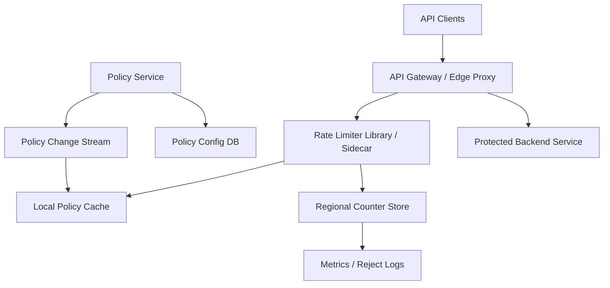
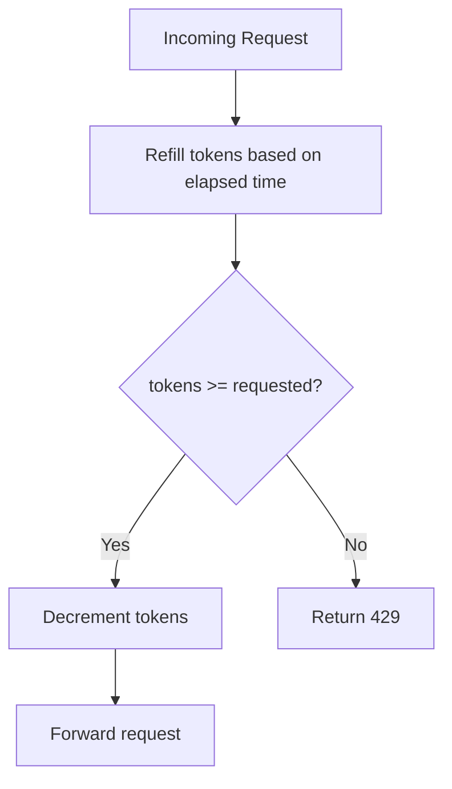

# System Design: Distributed Rate Limiter

> Design a distributed rate-limiting service that protects APIs handling 250K requests per second on average and 1M requests per second at peak, supports multiple rate-limit policies, and works across several regions without becoming a single point of failure.

---

## Concepts Covered

- **Concept 01** - Horizontal vs Vertical Scaling & Auto-scaling
- **Concept 02** - Load Balancing Deep Dive
- **Concept 04** - API Gateway, Reverse Proxy & Rate Limiting
- **Concept 10** - Caching Strategies
- **Concept 11** - Consistent Hashing
- **Concept 17** - CAP Theorem & PACELC
- **Concept 18** - Distributed Consensus Simplified
- **Concept 19** - Fault Tolerance Patterns
- **Concept 20** - Idempotency, Deduplication & Exactly-Once Semantics
- **Concept 21** - Monitoring, Observability & SLOs/SLAs

---

## Step 1: Requirements & Scope

### Functional Requirements

- **Check whether a request is allowed before it reaches the protected service**: This is the core function of the system.
- **Support multiple algorithms or policy types**: For example fixed window, sliding window, or token bucket, even if we standardize on one primary implementation.
- **Enforce limits by multiple dimensions**: IP, user ID, API key, tenant, or route.
- **Return remaining quota metadata**: Clients and upstream services benefit from consistent rate-limit headers.
- **Support burst tolerance**: Some workloads should be allowed short bursts while still enforcing a long-term rate.
- **Support policy updates without redeploying all gateways**: Product teams will change limits and add new rules over time.
- **Provide deterministic behavior under retries**: Duplicate checks or retries should not accidentally double-charge counters more than the chosen semantics allow.

### Non-Functional Requirements

- **Availability target**: 99.99% because the limiter sits on the critical path of protected APIs.
- **Latency target**: p99 under 5ms added overhead per check in-region.
- **Scale**: 250K protected requests/sec average and 1M peak.
- **Consistency**: Precise local enforcement is required. Global multi-region precision can be approximate if clearly bounded and policy-aware.
- **Fault tolerance**: The limiter should degrade predictably under store failures. Teams should choose fail-open or fail-closed by route or policy class.
- **Efficiency**: The service cannot require heavyweight coordination on every request.
- **Observability**: Operators need clear visibility into rejects, hot keys, store health, and drift.

### Out of Scope

- **Web application firewall logic**: This is about request quotas, not deep packet inspection or bot detection.
- **Billing and monetization**: Usage reporting may reuse data, but we are not designing a billing meter.
- **Complex abuse scoring**: We will enforce numeric limits, not full trust-and-safety models.
- **Cross-cloud global edge routing**: We assume requests already reached the appropriate region.
- **Full API gateway product**: The limiter is a subsystem, not the entire gateway.

The core problem is balancing strict enough enforcement with low enough latency. A rate limiter that is theoretically perfect but adds 20ms and becomes a global chokepoint is a bad production design.

---

## Step 2: Back-of-Envelope Estimation

### Traffic Estimation

Assumptions:
- Protected request volume: `250,000 requests/sec average`
- Peak volume: `1,000,000 requests/sec`
- Each request triggers one rate-limit check

Average check throughput:
```text
250,000 checks/sec
```

Peak check throughput:
```text
1,000,000 checks/sec
```

If 5% of requests are rejected at peak:
```text
1,000,000 x 5% = 50,000 rejects/sec
```

That is useful because rejection handling and metrics reporting are non-trivial workloads too.

### Storage Estimation

Suppose we have:
- 10M active keys per day
- 2 policy counters per key on average
- each counter record around 100 bytes in Redis or similar store

```text
10,000,000 x 2 x 100 bytes = 2,000,000,000 bytes
= 1.86 GB active counter state
```

If we keep short-lived windows and hot replicas, the footprint remains small. This is why memory-backed stores are so attractive for rate limiting. The problem is operation rate, not raw storage volume.

Policy metadata:
```text
1,000,000 policies x 500 bytes each = 500,000,000 bytes
= 476.8 MB
```

That easily fits in a replicated configuration store and local caches.

### Bandwidth Estimation

If each check request and response together average around `300 bytes`:
```text
1,000,000 peak checks/sec x 300 bytes = 300,000,000 bytes/sec
= 286.1 MB/sec
```

This is very manageable, which reinforces the point that coordination and hot-key patterns are the true challenges.

### Memory Estimation (for caching)

Active policy cache at the limiter nodes:
```text
1,000,000 policies x 500 bytes = 476.8 MB
```

Active counter store:
```text
~1.86 GB
```

With replicas, overhead, and hot-key buffers, a `10-20 GB` counter cluster per region is a comfortable starting point.

### Summary Table

| Metric | Value |
|--------|-------|
| Average check throughput | 250K/sec |
| Peak check throughput | 1M/sec |
| Active counter state | ~1.86 GB |
| Policy metadata size | ~477 MB |
| Peak limiter network throughput | ~286 MB/sec |
| Practical regional counter memory target | ~10-20 GB |

---

## Step 3: API Design

Even though rate limiting is often embedded in a gateway, treating it as an explicit internal API makes the contract clear.

Cross-reference: **Concept 05 - API Design Patterns** and **Concept 04 - API Gateway, Reverse Proxy & Rate Limiting**.

### Check and Consume Quota

```
POST /internal/v1/rate-limit/check
```

**Parameters:**
| Parameter | Type | Required | Description |
|-----------|------|----------|-------------|
| key | string | Yes | Subject being limited, such as user or IP |
| policy_id | string | Yes | Which policy applies |
| tokens | integer | No | How many units to consume, default 1 |
| timestamp_ms | integer | No | Optional client-side time hint |
| request_id | string | No | Helps dedupe repeated internal retries |

**Response:**
```json
{
  "allowed": true,
  "remaining": 97,
  "reset_at_ms": 1763966400000,
  "limit": 100
}
```

**Design Notes:** The response maps cleanly into rate-limit headers at the API edge. The check and consume happen atomically.

### Preview Policy

```
GET /internal/v1/rate-limit/policies/{policy_id}
```

**Parameters:**
| Parameter | Type | Required | Description |
|-----------|------|----------|-------------|
| policy_id | string | Yes | Policy identifier |

**Response:**
```json
{
  "policy_id": "api-read-standard",
  "algorithm": "token_bucket",
  "capacity": 100,
  "refill_per_sec": 10,
  "mode": "fail_open"
}
```

### Update Policy

```
PUT /internal/v1/rate-limit/policies/{policy_id}
```

**Parameters:**
| Parameter | Type | Required | Description |
|-----------|------|----------|-------------|
| algorithm | string | Yes | token_bucket, fixed_window, etc. |
| capacity | integer | Yes | Burst capacity |
| refill_per_sec | integer | No | Token refill rate |
| mode | string | Yes | fail_open or fail_closed |

**Response:**
```json
{
  "status": "updated"
}
```

The important design point is that policy distribution should be cached at the nodes enforcing limits. The policy store must not be queried on every request.

---

## Step 4: Data Model

### Database Choice

We will use:
- **Redis or equivalent in-memory store** for counters and token buckets
- **Relational or strongly consistent config store** for policies
- **Local node caches** for policy metadata

This is a good fit because rate-limiter counters are short-lived, write-heavy, and small. Policies are durable and relatively slow-changing. That is a very different access pattern.

### Schema Design

```text
Policy record:
├── policy_id          VARCHAR(64)     PRIMARY KEY
├── algorithm          VARCHAR(32)     NOT NULL
├── capacity           INTEGER         NOT NULL
├── refill_per_sec     INTEGER         NULLABLE
├── window_sec         INTEGER         NULLABLE
├── mode               VARCHAR(16)     NOT NULL
├── dimension          VARCHAR(32)     NOT NULL
└── updated_at         TIMESTAMP       NOT NULL
```

```text
Counter key example:
rl:{policy_id}:{subject_key}

Value for token bucket:
├── tokens_remaining
├── last_refill_ts_ms
└── optional dedupe token state
```

For sliding windows we might store:
```text
rlsw:{policy_id}:{subject_key}:{bucket_ts}
value = request count for bucket
```

### Access Patterns

- **Lookup policy by `policy_id`**: cached locally, refreshed from config store
- **Atomic token bucket mutation by subject key**: in Redis or equivalent
- **Read reject counters and metrics**: aggregated asynchronously
- **Invalidate policy cache on change**: event or TTL-based refresh

This is another classic access-pattern design: tiny hot mutable counters, relatively static policies, and no reason to force them into one storage layer.

---

## Step 5: High-Level Architecture

### Mermaid Diagram



### Architecture Walkthrough

The best place to start is the gateway, because most rate limiters only make sense in the context of a protected upstream service. A client request arrives at the API gateway. Before the request is proxied to the backend, the gateway or a colocated limiter library checks the applicable policy.

The limiter first consults a local policy cache. This is a crucial design choice. Policies change far less frequently than request traffic, so reading the configuration database on every request would be wasteful and fragile. Instead, the limiter keeps a local copy refreshed by a policy change stream or short TTL polling.

Once the policy is known, the limiter constructs the counter key based on the policy dimension. That key could represent a user ID, API token, IP address, or tenant-route combination. It then issues an atomic operation against the regional counter store. If we are using a token bucket algorithm, the atomic step refills tokens based on elapsed time, checks whether enough tokens remain, and if allowed, decrements the bucket.

If the check succeeds, the gateway forwards the request to the protected backend. If the check fails, the gateway returns `429 Too Many Requests` with consistent rate-limit headers. The backend never sees the request. That is the point of the system.

This atomic counter mutation is the real hot path. That is why the counter store must be extremely fast and why **Concept 10 - Caching Strategies** only partly applies here. We are not just caching data. We are performing write-heavy distributed state mutation on almost every request.

Policy updates happen out of band. The policy service writes new rules into a configuration database and emits change events. Limiter nodes receive those changes and update local caches. This lets operations teams and product teams change limits without redeploying the entire gateway fleet.

Multi-region behavior is where the design gets interesting. The cleanest and fastest default is regional enforcement: a request hitting a given region uses that region's limiter state. If you need globally strict limits, you can either partition clients to one home region or accept the higher cost of cross-region coordination. This is where **Concept 17 - CAP Theorem & PACELC** shows up in a very practical way. Strong cross-region precision costs latency and availability. Most high-scale systems choose bounded inaccuracy instead.

Failure handling must be explicit. If the counter store is down, should the gateway allow traffic or block it? For public read APIs, fail-open may be acceptable because availability matters more than perfect abuse control. For write-heavy mutation APIs or expensive third-party integrations, fail-closed may be safer. The rate limiter therefore needs policy-specific failure modes, not a one-size-fits-all global switch.

Metrics and logging are another architectural component, not an afterthought. Reject counts, hot keys, policy-cache staleness, and store latency all need to be visible. Rate limiters often fail silently in bad ways: either by not blocking abusive traffic or by blocking too much legitimate traffic. You only notice if you are measuring the right signals.

The system works because the hot path is extremely small: local policy lookup, atomic counter mutation, decision. Everything else, such as policy propagation and metric aggregation, happens off the critical path.

That simplicity is also what makes limiters deployable in many contexts. A route-level API gateway limiter, a service-mesh sidecar limiter, and an internal RPC protection layer can all reuse the same conceptual design if the hot path stays tiny and predictable. Once the limiter demands too much central coordination, it stops being reusable platform infrastructure and turns into a specialized bottleneck.

That boundary between tiny decision loop and richer control plane is what makes the architecture both scalable and reusable.

---

## Step 6: Deep Dives

### Deep Dive 1: Why Token Bucket Is Usually the Best Default

Fixed window is simple but produces burst artifacts at window boundaries. Sliding window is fairer but can be more expensive. Token bucket is a strong production default because it allows bursts up to capacity while enforcing a long-term average rate.

### Mermaid Diagram



### Diagram Walkthrough

Each request triggers a tiny state-machine step. First, the limiter computes how many tokens should have been refilled since the last request. Then it checks whether enough tokens remain. If yes, it consumes tokens and allows the request. If not, it rejects.

The reason this works well operationally is that one small state record represents both burst allowance and long-term rate. You do not need to store large window histories for every key unless your precision requirements demand it.

Cross-reference: **Concept 20 - Idempotency, Deduplication & Exactly-Once Semantics** because duplicate internal calls to the limiter can themselves create subtle overcounting if request retries are not handled carefully.

### Deep Dive 2: Multi-Region Limits Are a Tradeoff, Not Magic

Teams often ask for "a globally strict 100 requests/minute limit" while also expecting sub-5ms local latency. That is where reality pushes back. A globally coordinated counter requires cross-region communication or leader-based ownership. That adds latency and failure sensitivity.

Practical options:
- **Regional limits only**: simplest and fastest
- **Home-region ownership per key**: globally precise but adds routing complexity
- **Approximate split quotas per region**: fast, slightly inaccurate, often good enough

The right answer depends on the cost of over-admission versus the cost of latency and coordination.

### Deep Dive 3: Hot Keys and Sharding

Some clients are much hotter than others. One large tenant or a public NAT IP can become a hot key that overloads a single counter shard. Consistent hashing helps distribute keys, but a single hot key still lands on one place unless you shard that subject internally.

Potential mitigations:
- split by route or operation
- use hierarchical limits, such as tenant plus user
- shard very hot subjects into sub-buckets when exactness can tolerate approximation

This is why real limiters need operational hot-key awareness rather than just theoretical big-O confidence.

### Deep Dive 4: Fail-Open Versus Fail-Closed

This is one of the most important operational choices in the whole design. If the limiter store is unavailable:
- fail-open preserves availability but risks abuse or cost spikes
- fail-closed protects resources but can take down healthy traffic

Neither is universally correct. Authentication endpoints, payment operations, or expensive vendor-backed APIs may want fail-closed. Commodity read endpoints may want fail-open. Good systems make this per-policy or per-route configurable.

Cross-reference: **Concept 19 - Fault Tolerance Patterns**.

---

## Step 7: Bottlenecks & Scaling

### Identifying Bottlenecks

At `10x` scale, the counter store becomes the obvious bottleneck. Ten million checks per second means both more CPU and more hot-key concentration. The danger is not just throughput. It is tail latency on atomic operations.

Policy-cache invalidation is another subtle issue. If policy changes propagate slowly, some gateways enforce stale rules. That may be acceptable briefly, but only if the propagation lag is measured and bounded.

At `100x`, multi-region drift becomes more visible. If each region enforces its own partial view, the gap between desired and actual global limits can become large for very active keys.

### Scaling Solutions

| Bottleneck | Solution | Impact | New Ceiling | Cross-reference |
|------------|----------|--------|-------------|-----------------|
| Counter-store saturation | More shards plus local batching where safe | Higher throughput and lower p99 | Better horizontal scaling | Concept 01 |
| Hot-key concentration | Subject sharding or hierarchical policies | Prevents one tenant from melting a shard | Better fairness and resilience | Concept 11 |
| Policy propagation lag | Event-driven invalidation and short TTL caches | Faster convergence after updates | Safer operational changes | Concept 14 |
| Cross-region drift | Home-region ownership or quota partitioning | Improves correctness bounds | More predictable global behavior | Concept 17 |

### Failure Scenarios

- **Counter store unavailable**: route-specific fail-open or fail-closed behavior engages.
- **Policy service down**: cached policies keep limiters operating for a bounded period.
- **Shard hot spot**: a subset of keys sees elevated limiter latency and increased false rejects or timeouts.
- **Clock skew**: token refill calculations become inconsistent if node clocks drift badly.
- **Retry storm from upstream**: limiter traffic itself can spike due to retries, so the protected system's failure may reflect back into the limiter.

Rate limiters are small systems with disproportionate blast radius. That is why they deserve first-class design attention.

---

## Step 8: Monitoring & Alerting

### Key Metrics to Track

Business metrics:
- Allowed versus rejected request counts by policy
- Top offending keys or tenants
- Route-level fail-open/fail-closed activation counts

Infrastructure metrics:
- Counter-store latency and CPU
- Limiter p50, p95, p99 decision latency
- Policy-cache hit rate and staleness
- Shard hot-key distribution
- Cross-region drift estimates for global policies

### SLOs

- **Limiter availability**: 99.99%
- **Decision latency**: 99% under 5ms in-region
- **Policy freshness**: 99% of changes propagated within 30 seconds
- **Correct rejection accuracy**: bounded false-reject and false-allow rates for key policy classes
- **Hot-key resilience**: no single subject should degrade the entire limiter fleet

### Alerting Rules

- **CRITICAL**: limiter p99 > 20ms for 5 minutes
- **CRITICAL**: counter-store error rate > 1%
- **WARNING**: policy propagation lag > 60 seconds
- **WARNING**: one shard handling disproportionate hot-key load
- **CRITICAL**: fail-open or fail-closed fallback activates above threshold
- **WARNING**: cross-region drift exceeds policy tolerance

Cross-reference: **Concept 21 - Monitoring, Observability & SLOs/SLAs**.

One useful operational distinction is between protective limits and fairness limits. Protective limits defend a shared resource from overload or abuse. Fairness limits try to keep one tenant from dominating a shared system. The same limiter can implement both, but the policy thresholds, failure modes, and expected false-positive tolerance may be very different.

Another subtle concern is clock behavior. Token-bucket refill logic assumes time moves forward sensibly. If limiter nodes or clients have skewed clocks, refill and reset calculations can become inconsistent. Production systems should anchor calculations on trusted server clocks, monitor time sync aggressively, and be careful about any protocol design that allows client-provided timestamps to influence quota correctness directly.

Retry behavior from upstream callers is also part of the limiter design whether we like it or not. If a protected service returns 500s and clients retry aggressively, the limiter may suddenly see a traffic pattern very different from normal request rates. That means the limiter's observability should correlate rejects and store latency with upstream retry storms so teams can distinguish abuse from accidental amplification.

Finally, rate-limit headers are part of product quality, not just protocol polish. Good headers let client libraries back off intelligently, help operators debug throttling, and reduce unnecessary retry loops. Ambiguous or inconsistent limit metadata tends to create more traffic, not less, because callers cannot adapt correctly.

Another useful operational pattern is shadow mode. Before enforcing a new or tighter policy, teams often run it in observe-only mode and record what would have been rejected. That lets them estimate false positives, hot keys, and expected customer impact before turning the policy on. For shared infrastructure, shadow mode is one of the safest ways to roll out aggressive protection.

Token refill precision is another place where implementation detail matters. Integer math, coarse timestamps, and bucket rounding rules can create behavior that is technically "correct" but feels arbitrary to clients near the limit. Mature rate limiters document these details and keep them stable so SDKs and operators can reason about edge behavior consistently.

There is also a user-experience angle for internal developers. If teams see a limiter only as a black box returning 429s, they often work around it badly with retries or request splitting. If they understand the policy semantics, headers, and intended quota model, they are much more likely to build cooperative clients that reduce pressure on the whole platform.

Finally, rate limiting is often layered. A request may pass a coarse edge IP limit, then a tenant-level service limit, then an internal downstream dependency limit. The distributed limiter discussed here is strongest when it acts as a reusable building block in that layered strategy rather than pretending one global check solves every traffic-shaping problem.

It is also useful to think about testing. Rate limiters are notorious for looking correct under small synthetic loads and behaving oddly under bursty real traffic with retries, clock skew, and hot tenants. Load tests should therefore include burst boundaries, policy updates during traffic, topology changes, and simulated store failures. Otherwise the first real high-stakes event becomes the real integration test.

Finally, documentation matters here more than usual because developers consume rate limiting through headers, SDKs, and support tickets. A technically correct limiter that nobody understands will still generate wasted traffic and frustrated teams. Good platform design includes the human contract for how callers should behave when throttled.

---

## Summary

### Key Design Decisions

1. **Use token bucket as the default algorithm** because it balances burst tolerance with efficient state management.
2. **Keep policy lookup local and cached** so the hot path only pays for one atomic counter mutation.
3. **Use regional counter stores** because local latency matters more than perfect global precision in most cases.
4. **Make fail-open/fail-closed configurable per policy** because different APIs have different risk profiles.
5. **Monitor hot keys and drift explicitly** because distributed limiters fail in skewed ways, not just average-throughput ways.

### Top Tradeoffs

1. **Precision versus latency**: globally exact coordination is slower and more fragile than regional approximate enforcement.
2. **Strict enforcement versus availability**: fail-closed protects systems but can create outages; fail-open preserves availability but risks overload.
3. **Simple algorithms versus fairer algorithms**: fixed windows are easy, but token bucket or sliding window behave better under real traffic.

### Alternative Approaches

- Small services can use in-process or single-node Redis limiters without this much complexity.
- Edge CDN or API gateway products may provide built-in rate limiting, which is appealing if their policy model is sufficient.
- If a few ultra-high-value keys need precise global enforcement, they can be routed to a more coordinated path while the rest use fast regional limits.

The most important lesson is that a distributed rate limiter is a control system, not just a counter. It shapes traffic, affects availability, and encodes security posture. That is why being explicit about tradeoffs matters more than pretending there is one universally perfect design.

In practice, the best rate limiters are the ones application teams can reason about. They are fast enough to disappear in healthy operation, transparent enough to debug when throttling happens, and flexible enough to express different risk tolerances for different endpoints. That combination is what turns a limiter from an outage source into a dependable safety boundary.

They also reward restraint. Teams that keep the hot path small, the policies explicit, and the failure modes honest usually end up with a limiter that scales further and surprises operators less than a design that tries to promise globally perfect fairness with no latency cost.

That is also why policy design matters almost as much as the limiter algorithm itself. A beautifully implemented token bucket still creates a poor platform if policies are inconsistent across products, impossible for developers to discover, or too coarse to reflect real business intent. The strongest limiter platforms treat policy as a product surface. They define who owns each class of limit, how teams test changes safely, what headers clients can rely on, and how emergency overrides are applied during incidents. Without that operational discipline, even technically sound limiter infrastructure turns into a source of confusion and support tickets.

Another recurring production lesson is that limiters should be conservative about what they promise. Teams often want a single control that simultaneously blocks abuse, enforces fairness, protects fragile dependencies, and guarantees contractual quotas across multiple regions. Those are related goals, but they are not identical. A limiter built to absorb bot traffic at the edge may tolerate more approximation than a limiter protecting a scarce payment-provider quota. A limiter protecting one internal dependency may need faster failure handling than one shaping public API traffic. The architecture gets clearer once we admit that "rate limiting" is a family of controls sharing primitives rather than one magical universal feature.

There is also a strong testing angle here. Many limiter failures only appear under skew: one hot tenant, one route with pathological retries, one region lagging policy updates, or one shard receiving a burst of identical keys. Unit tests for token refill math are necessary, but they are not enough. High-confidence limiter teams also run simulation traffic, shadow policies, and replay production distributions before tightening limits. That matters because the operational risk is asymmetric. A slight under-enforcement may permit some abuse, but a slight over-enforcement can instantly look like a platform outage to legitimate customers.

One more subtle point is that rate limiting works best when paired with clear client behavior. If SDKs or partner integrations ignore `429` responses, retry immediately, or fail to respect reset hints, the limiter ends up fighting the very ecosystem it is trying to shape. Good platforms therefore publish limit semantics, expose stable headers, and sometimes provide client libraries that implement exponential backoff or token-aware pacing correctly. In other words, the limiter is not only an infrastructure component. It is part of the contract between the platform and its callers.

Finally, the best rate limiters are intentionally boring on the hot path and intentionally rich off the hot path. The live decision should stay tiny: identify subject, read policy from local cache, mutate regional counter, decide. All the complexity such as shadow evaluation, analytics, policy authoring, tenant dashboards, hot-key forensics, and drift measurement belongs around that loop, not inside it. Keeping that boundary clean is what lets the system scale to very high QPS without becoming opaque or fragile. It is also what makes the limiter reusable across edges, gateways, and internal services instead of becoming a one-off solution for one team.

That combination of a tiny synchronous path and a richer asynchronous control plane is the real architectural win. It preserves the low latency the protected service needs while still giving platform teams enough leverage to evolve policies, inspect behavior, and respond to abuse quickly. When a limiter gets this balance right, it stops feeling like a nuisance gate and starts feeling like reliable shared infrastructure.
