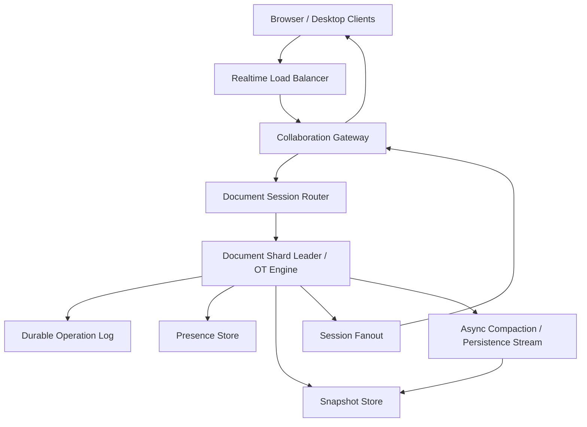
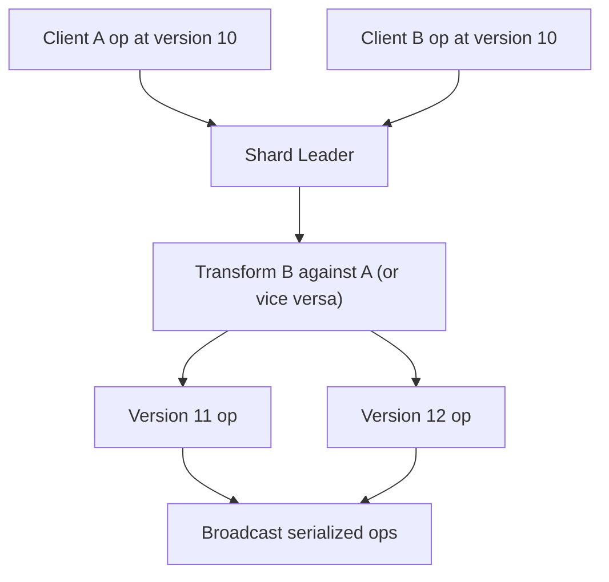

# System Design: Google Docs / Collaborative Editing

> Design a collaborative document editor that supports 30M daily editors, 2B edit operations per day, around 1M concurrently active documents, low-latency multi-user sync, and durable document history.

---

## Concepts Covered

- **Concept 01** - Horizontal vs Vertical Scaling & Auto-scaling
- **Concept 02** - Load Balancing Deep Dive
- **Concept 05** - API Design Patterns
- **Concept 13** - Synchronous vs Asynchronous Communication Patterns
- **Concept 14** - Message Queues & Stream Processing
- **Concept 16** - Real-time Communication
- **Concept 17** - CAP Theorem & PACELC
- **Concept 18** - Distributed Consensus Simplified
- **Concept 19** - Fault Tolerance Patterns
- **Concept 20** - Idempotency, Deduplication & Exactly-Once Semantics
- **Concept 21** - Monitoring, Observability & SLOs/SLAs

---

## Step 1: Requirements & Scope

### Functional Requirements

- **Users can open and edit documents collaboratively**: Multiple users should be able to type into the same document and see changes appear quickly.
- **Users see other participants' changes in near real time**: This is the core product promise of collaborative editing.
- **Users see cursor and presence indicators**: The experience is much better when collaborators can see who is active and where.
- **Users can reconnect and catch up after temporary network loss**: Realtime editors must survive laptop sleep, Wi-Fi blips, and browser refreshes.
- **Document state is durable**: Accepted edits should not disappear because one coordination node crashes.
- **Users can read document history or at least rely on recoverable saved state**: We are not designing a full versioning UI, but the backend needs durable edit history or snapshots.
- **The system resolves concurrent edits deterministically**: Two users typing at once must not produce corrupted or divergent state.

### Non-Functional Requirements

- **Availability target**: 99.99% for active editing sessions and document load.
- **Realtime latency**: p99 under 200ms for edits propagating to other collaborators in the same region.
- **Scale**: 30M daily active editors, 2B edit operations/day, and about 1M concurrently active documents.
- **Consistency**: Document convergence is mandatory. Different clients must converge to the same final state.
- **Durability**: Once the server acknowledges an operation, it should survive node failure.
- **Ordering**: Operations for a given document need a clear serialization strategy.
- **Graceful degradation**: If live cursors lag, the document still must converge correctly.

### Out of Scope

- **Spreadsheet formulas and collaborative slides**: Those have different data models and merge semantics.
- **Full permission and sharing system**: We assume document access is already authorized.
- **Offline-first peer-to-peer editing across long disconnected periods**: We will discuss reconnect, not full offline merge for hours-long divergence.
- **Complex comments, suggestions, and review workflows**: Important product features, but different from the base text-collaboration engine.
- **Rich media embedding and layout engine internals**: We focus on the collaborative state model.

The central challenge is making many clients appear to edit one shared document while the real system is dealing with latency, partial failure, and concurrent operations that arrive in different orders.

---

## Step 2: Back-of-Envelope Estimation

### Traffic Estimation

Assumptions:
- Daily active editors: `30,000,000`
- Edit operations/day: `2,000,000,000`
- Peak multiplier: `3x`
- Peak concurrently active documents: `1,000,000`

Average edit-op QPS:
```text
2,000,000,000 / 86,400 = 23,148.15 ops/sec
Peak op QPS = 23,148.15 x 3 = 69,444.44 ops/sec
```

Presence and cursor traffic:
If 5 cursor/presence updates per active document participant per 10 seconds produce roughly 2x edit traffic during active sessions, the control plane may see another `50K-100K/sec` lightweight events at peak. Exact numbers vary, but the important lesson is that edits are not the only realtime messages.

### Storage Estimation

Operation log size:
```text
op_id                16 bytes
document_id          16 bytes
client_id            8 bytes
base_version         8 bytes
op payload           64 bytes average
timestamp            8 bytes
overhead             40 bytes
--------------------------------
~160 bytes/op
```

Daily op-log growth:
```text
2,000,000,000 x 160 bytes = 320,000,000,000 bytes/day
= 298 GB/day
```

30-day hot op log:
```text
298 GB/day x 30 = 8.94 TB
```

With replication factor 3:
```text
8.94 TB x 3 = 26.82 TB
```

Document snapshot storage:
Assume 200M documents and average snapshot size `50 KB`.

```text
200,000,000 x 50 KB = 10,000,000,000 KB
= 9.31 TB
```

That is entirely manageable in object storage or a document-snapshot store.

### Bandwidth Estimation

Peak edit-op ingress and egress:
```text
69,444 ops/sec x 160 bytes ~= 11,111,040 bytes/sec
= 10.6 MB/sec raw op traffic
```

But edits fan out to collaborators. If average active document has 3 collaborators at peak:
```text
69,444 x 160 bytes x 3 recipients
= 33,333,120 bytes/sec
= 31.79 MB/sec outbound op traffic
```

This is not a bandwidth-dominated system. It is a coordination- and latency-dominated system.

### Memory Estimation (for active session state)

Assume:
- 1M active documents
- 4 KB of in-memory active state per open doc for session metadata, recent ops, and participant presence

```text
1,000,000 x 4 KB = 4,000,000 KB
= 3.81 GB
```

Add buffers and replication overhead, and a regional collaboration cluster with `10-20 GB` active-memory footprint is very reasonable.

### Summary Table

| Metric | Value |
|--------|-------|
| Edit op QPS (average) | ~23,148 |
| Edit op QPS (peak) | ~69,444 |
| Daily op-log growth | ~298 GB |
| 30-day replicated hot op log | ~26.82 TB |
| Snapshot storage for 200M docs | ~9.31 TB |
| Active in-memory session state | ~3.81 GB baseline |

---

## Step 3: API Design

The realtime path usually runs over WebSockets or a similar persistent channel, but we can still model the control contracts clearly.

Cross-reference: **Concept 05 - API Design Patterns** and **Concept 16 - Real-time Communication**.

### Open Document Session

```
POST /api/v1/documents/{document_id}/sessions
```

**Parameters:**
| Parameter | Type | Required | Description |
|-----------|------|----------|-------------|
| client_id | string | Yes | Editing client identity |
| last_known_version | integer | No | Client's last synced version |

**Response:**
```json
{
  "session_id": "s_88231",
  "document_version": 192,
  "snapshot_url": "https://docs.example/snapshots/d_22/192",
  "transport": "websocket"
}
```

### Submit Operation

```
POST /api/v1/documents/{document_id}/ops
```

**Parameters:**
| Parameter | Type | Required | Description |
|-----------|------|----------|-------------|
| session_id | string | Yes | Active client session |
| client_op_id | string | Yes | Deduplication key |
| base_version | integer | Yes | Document version client edited against |
| op | object | Yes | Insert/delete/format operation payload |

**Response:**
```json
{
  "accepted_version": 193,
  "status": "applied"
}
```

### Sync Missing Operations

```
GET /api/v1/documents/{document_id}/ops?from_version=180
```

**Parameters:**
| Parameter | Type | Required | Description |
|-----------|------|----------|-------------|
| from_version | integer | Yes | Client wants ops after this version |
| limit | integer | No | Batch size |

**Response:**
```json
{
  "ops": [
    {
      "version": 181,
      "op": {"type": "insert", "pos": 12, "text": "x"}
    }
  ],
  "current_version": 193
}
```

### Update Presence

```
POST /api/v1/documents/{document_id}/presence
```

**Parameters:**
| Parameter | Type | Required | Description |
|-----------|------|----------|-------------|
| session_id | string | Yes | Active session |
| cursor | object | Yes | Cursor or selection state |

**Response:**
```json
{
  "status": "recorded"
}
```

Presence is eventually consistent and lighter-weight than document operations.

---

## Step 4: Data Model

### Database Choice

For a Google Docs-like central-server model, a strong design is:
- **Durable operation log** per document
- **Periodic document snapshots**
- **Ephemeral presence store**
- **Realtime session routing layer**

We will assume a centralized sequencing model per document shard and use **Operational Transform (OT)** as the primary editing strategy rather than CRDT for this design. Why? Because a central service already exists, low-latency collaboration is required, and OT is a practical fit when the server can serialize operations per document.

### Schema Design

```text
Table / Log: document_operations
├── document_id         BIGINT          PARTITION KEY
├── version             BIGINT          CLUSTER KEY
├── op_id               UUID            NOT NULL
├── client_id           BIGINT          NOT NULL
├── base_version        BIGINT          NOT NULL
├── op_payload          JSON/BLOB       NOT NULL
├── created_at          TIMESTAMP       NOT NULL
└── PRIMARY KEY (document_id, version)
```

```text
Table: document_snapshots
├── document_id         BIGINT          NOT NULL
├── version             BIGINT          NOT NULL
├── snapshot_ref        VARCHAR(256)    NOT NULL
├── created_at          TIMESTAMP       NOT NULL
└── PRIMARY KEY (document_id, version)
```

```text
Presence key: doc:{document_id}:session:{session_id}
Value: cursor / selection / user info
TTL: short, e.g. 30-60 seconds
```

### Access Patterns

- **Open document**: load latest snapshot plus tail ops
- **Append accepted op**: write next version into op log
- **Catch up reconnecting client**: fetch ops after known version
- **Compact history**: create new snapshot after N ops
- **Read presence**: fetch active participants for one document

The access pattern strongly suggests partitioning by `document_id`. That lets one collaboration shard own sequencing for that document.

---

## Step 5: High-Level Architecture

### Mermaid Diagram



### Architecture Walkthrough

The architecture begins with the collaboration gateway. Clients keep a persistent connection to the gateway so edits, cursor movement, and presence updates can travel in both directions with low latency. The gateway itself should remain as stateless as possible. Its job is to authenticate, terminate the connection, and route document events to the correct backend shard.

The document session router maps each open document to a shard leader or owning collaboration node. This ownership model is crucial. For a Google Docs-style centralized OT system, we want one logical sequencer per document at a time. That gives us a clean place to serialize operations and resolve concurrency deterministically.

When a client opens a document, the shard loads the latest durable snapshot and any tail operations after that snapshot. The client receives the current version and joins the active session. Presence entries for that session are written into the presence store with a short TTL. Presence is lightweight and can be approximate; the document content cannot.

Now consider the main edit flow. A user types a character. The client sends an operation referencing the version it believes the document is on. The shard leader receives that op, checks the current authoritative version, and if necessary transforms the incoming operation against any concurrent operations already accepted since the client's base version. That is the heart of OT. Once the transformed operation is accepted, the shard appends it durably to the operation log with the next version number.

Only after durable append do we acknowledge the operation back to the originating client. That is the key durability contract. The shard then fans out the accepted transformed operation to all other active collaborators on the document. Because everyone receives the same serialized version sequence, all clients converge on the same state.

Reconnect behavior is another major path. If a client disconnects and later returns with `last_known_version = 180` while the document is now at version `193`, the shard can send operations 181 through 193 rather than resending the full document. If the gap is large or the client is too stale, the system can send a fresh snapshot plus a shorter tail of operations.

Snapshots exist because replaying unbounded op logs is inefficient. A compaction or snapshot worker periodically materializes the current document state at version N into a snapshot store, often object storage or a compact document database. Future clients load the snapshot and only replay the tail after N. This keeps load times bounded even for very old or heavily edited documents.

Presence and cursor updates follow a lighter path. They flow through the same gateway infrastructure but do not require durable operation-log writes. If a cursor update is dropped, the user experience is slightly worse. If a text operation is dropped after acknowledgment, the document is corrupted. That difference in criticality must shape the architecture.

Failure handling depends on document ownership. If the shard leader for a document fails, another node must take over that document's sequencing responsibility, load the latest durable op-log state, and resume. This is where **Concept 18 - Distributed Consensus Simplified** enters the picture. We do not want split-brain editing where two leaders both accept operations for the same document. Ownership transfer must be coordinated cleanly.

The architecture works because it distinguishes between three different kinds of state: durable document history, ephemeral presence, and live fanout. Trying to treat them all the same would either make the system too slow or too unreliable.

That separation is what lets the product stay fast where it can and strict where it must. Cursor flicker is annoying, but divergent acknowledged text is unacceptable, and the architecture should reflect that asymmetry clearly.

---

## Step 6: Deep Dives

### Deep Dive 1: OT Versus CRDT for This Design

Both OT and CRDT can produce convergent collaborative editing, but they fit different operational assumptions.

- **OT** works well with a central server that can serialize operations per document.
- **CRDT** is attractive for more decentralized or offline-heavy models where replicas merge state without a single central transformer.

For a Google Docs-like centralized web product, OT is a strong fit because we already have a shard leader per document.

### Mermaid Diagram



### Diagram Walkthrough

Two clients edit from the same base version. The server receives both operations. Instead of blindly accepting them as-is, it transforms one relative to the other based on their position and type. Then it emits a serialized sequence of authoritative versions.

That authoritative sequencing is what lets all clients converge. It also explains why the server needs clean per-document ownership. Without a single place deciding the transform order, OT becomes much harder to reason about.

Cross-reference: **Concept 18 - Distributed Consensus Simplified** because "one document, one active sequencer" is an ownership problem as much as an algorithm problem.

### Deep Dive 2: Presence and Cursor State

Presence is not document truth. It is collaborative context. That means we can store it separately with short TTLs and accept occasional loss or lag.

Useful rules:
- cursor updates are small, frequent, and ephemeral
- do not write them into the durable op log
- treat them as broadcast state scoped to one document session

This keeps the critical path reserved for actual document operations.

### Deep Dive 3: Snapshotting and Log Compaction

If a document has 500,000 operations, replaying from version 1 on every open is ridiculous. So the system periodically snapshots the full materialized document at version N. A new client loads snapshot N plus operations `N+1..latest`.

Snapshot cadence is a tradeoff:
- frequent snapshots lower open latency
- infrequent snapshots reduce write and storage overhead

A practical compromise is snapshot every few thousand operations or after a period of intense editing.

### Deep Dive 4: Reconnect and Duplicate Operation Handling

Clients retry when networks flap. If the same `client_op_id` is received twice, the server should not append it twice. That means each shard or op log needs deduplication logic tied to session and client operation IDs.

This is a direct application of **Concept 20 - Idempotency, Deduplication & Exactly-Once Semantics**. Collaborative systems cannot assume clean exactly-once delivery from browsers over the internet.

---

## Step 7: Bottlenecks & Scaling

### Identifying Bottlenecks

At `10x` scale, hotspot documents become the first real issue. Most docs have few collaborators, but some popular or classroom-style documents may have dozens or hundreds of simultaneous editors. Those hotspots concentrate all operations onto one document shard leader.

The second bottleneck is snapshot and compaction backlog. If snapshots lag too far behind, open-document latency rises because too many operations need replay.

At `100x`, leader handoff and shard ownership become more operationally significant. A naive rebalance or failover can interrupt many active collaborative sessions at once.

### Scaling Solutions

| Bottleneck | Solution | Impact | New Ceiling | Cross-reference |
|------------|----------|--------|-------------|-----------------|
| Hot documents | Isolate large collaborative docs onto dedicated leaders | Prevents one hot doc from hurting many cold docs | Better hotspot resilience | Concept 01 |
| Snapshot lag | Background compaction workers and snapshot cadence tuning | Keeps open latency bounded | More stable document loads | Concept 14 |
| Leader failover cost | Fast shard ownership election and replay from durable log | Shorter editing interruptions | Safer failover behavior | Concept 18 |
| Presence flood | Separate presence channel from op-log path | Protects critical editing path | Lower realtime fanout pressure | Concept 16 |

### Failure Scenarios

- **Gateway failure**: Clients reconnect and rejoin sessions. Document truth remains intact.
- **Shard leader failure**: Another node takes ownership, replays durable history, and resumes sequencing.
- **Snapshot-store lag**: Documents still open, but cold-open latency rises.
- **Presence-store outage**: Cursors and participant indicators degrade, but edits still converge.
- **Operation-log issue**: This is high severity because acknowledged edits rely on it for durability.

Collaborative editing systems should degrade from "rich collaborative context" to "basic collaborative correctness," not the other way around.

---

## Step 8: Monitoring & Alerting

### Key Metrics to Track

Business metrics:
- Active editing sessions
- Edit operations per minute
- Document open latency
- Collaboration conflict/transform rates

Infrastructure metrics:
- Op-log write latency
- Shard leader CPU and memory
- Fanout latency to collaborators
- Snapshot lag and compaction backlog
- Presence update volume
- Reconnect rate and resync latency

### SLOs

- **Active editing availability**: 99.99%
- **Edit propagation latency**: 99% under 200ms in-region
- **Document convergence**: zero split-brain or divergent document incidents
- **Snapshot freshness**: keep replay tail under operational threshold for most documents
- **Reconnect catch-up**: 99% of reconnecting clients resync within a few seconds

### Alerting Rules

- **CRITICAL**: op-log write latency p99 > 200ms
- **CRITICAL**: document shard leader unavailable without rapid replacement
- **WARNING**: snapshot backlog exceeds threshold
- **WARNING**: fanout latency > 500ms for active sessions
- **CRITICAL**: elevated duplicate-op or version-mismatch errors
- **WARNING**: reconnect rate spikes above baseline

Cross-reference: **Concept 21 - Monitoring, Observability & SLOs/SLAs**.

One additional operational nuance is that collaboration systems should monitor not only absolute latency but also divergence symptoms. Rising version-mismatch retries, unusually large reconnect catch-up batches, or sudden spikes in client-side resync requests can indicate subtle correctness pressure before users explicitly report document corruption. These are often better early-warning signals than generic CPU graphs.

Another useful distinction is between active editing documents and mostly-read documents. Active docs need realtime fanout and tight sequencing. Read-mostly docs can often be served from snapshot-heavy paths with far lower coordination overhead. If a platform fails to segment those two populations, it tends to overpay for cold documents or underperform on hot collaborative ones.

Cursor and presence quality are also part of the user experience even though they are not the correctness boundary. Poor cursor behavior makes collaboration feel less human and more like random text flicker. Mature systems therefore measure not only whether edits converge, but whether presence and cursor updates remain believable and timely enough that users can actually coordinate socially while editing.

Finally, document shape matters. Long documents with rich formatting, comments, or embedded objects can make transforms and snapshotting more expensive than simple plain-text examples suggest. A system that looks healthy on toy docs may struggle on real enterprise documents unless the team pays attention to payload size, operation complexity, and snapshot growth.

There is also a human-factor angle to collaboration correctness. Users tolerate small cursor jitter or slight avatar lag because those feel cosmetic. They are far less tolerant of "my sentence disappeared" or "the document reverted." That means product trust is tied directly to the integrity of the operation log and sequencing model, not just to average latency charts.

Another practical concern is feature expansion. Suggestion mode, comments, tracked changes, smart chips, and embedded objects all tend to add more operation types and more transformation rules. A design that only works elegantly for insert/delete text operations may not survive the real product roadmap. That is why explicit operation schemas and careful server ownership rules matter so much early on.

Finally, collaborative editing benefits from strong client instrumentation. The server can see accepted versions and fanout timings, but only clients can report perceived divergence, local apply delay, or repeated resync behavior under real browser and network conditions. Mature systems rely on both sides of that telemetry to understand whether collaboration actually feels healthy.

The same principle applies to rollout strategy. Changes to transform logic, operation schemas, or snapshot formats should usually be gated carefully because subtle compatibility bugs can surface only when old and new clients collaborate on the same hot document. Collaboration systems benefit from backward-compatible protocols and slow rollout discipline more than many simpler APIs do.

Another practical issue is cursor semantics during reconnect. If a client vanishes and rejoins after many remote edits, blindly restoring the old cursor position can be misleading or even invalid relative to the transformed document. Good systems treat cursor restoration as a best-effort convenience layered on top of authoritative content convergence, not as something equally durable and exact.

---

## Summary

### Key Design Decisions

1. **Use a central sequencer per document shard** because OT works best when one service serializes operations.
2. **Separate durable operation history from ephemeral presence** so only important state pays the durability cost.
3. **Store snapshots plus tail operation logs** to keep document open and reconnect paths efficient.
4. **Deduplicate client operations explicitly** because browser retries and reconnects are unavoidable.
5. **Design for hotspot documents** because collaborative editors often have a long tail of quiet docs and a small set of very hot shared docs.

### Top Tradeoffs

1. **OT versus CRDT**: OT is simpler for centralized low-latency editing, while CRDT is more natural for decentralized/offline-heavy systems.
2. **Frequent snapshots versus write overhead**: More snapshots improve open latency but cost more background I/O and storage.
3. **Strict sequencing versus horizontal flexibility**: Per-document leadership simplifies correctness but creates ownership and failover complexity.

### Alternative Approaches

- A smaller product can start with a simpler central collaboration server and fewer snapshot optimizations.
- Offline-first editors may prefer CRDTs despite the larger payloads and more complex merge model.
- Products focused more on comments than live typing can relax the realtime latency budget significantly and simplify the backend.

The essential lesson is that collaborative editing is a convergence problem wearing a realtime UX costume. The UI feels like live shared typing, but the backend succeeds or fails based on how well it serializes, transforms, persists, and replays operations.

That is why the collaboration engine should be judged less by how elegant the marketing demo looks and more by how predictable it is under conflict, reconnect, version skew, and hotspot documents. When those hard cases are handled well, the user experience feels natural. When they are not, no amount of cursor animation can save the product.

The nicest thing about a disciplined design here is that it scales conceptually as the product grows. Once the platform clearly separates document truth, session presence, snapshots, and replay, new collaborative features have a much better chance of fitting cleanly instead of becoming one-off hacks layered onto a fragile core.

That framing helps explain why so many apparently "UX" bugs are really distributed-systems bugs in disguise. Cursor jumps, missing text, repeated characters after reconnect, and delayed collaborator presence all feel like interface issues to users, yet they usually trace back to sequencing, duplicate handling, fanout lag, or snapshot freshness. Teams that separate the pretty surface from the operational core too aggressively often misdiagnose problems. A mature collaboration system treats user trust as a direct output of log integrity, transform correctness, and fast catch-up semantics.

Another important practical lesson is that the collaboration server should remain opinionated about ownership. It is tempting to let clients do more transformation logic, more reconciliation, or more presence coordination in pursuit of decentralization. But for a browser-first product with low-latency connectivity, centralized sequencing is often the simpler and safer trade. The server should remain the authority on document version order, accepted operations, and replay behavior. Clients can stay optimistic for responsiveness, but they should not become the ultimate source of truth. That balance keeps the editing experience fast without turning correctness into a multi-device guessing game.

Feature growth is where many simple designs break down. Plain text inserts and deletes are only the beginning. Real products accumulate comments, suggestions, formatting spans, structured objects, tables, mentions, embedded media, and import/export pipelines. Each new object type expands the operation vocabulary and increases the cost of getting transforms wrong. That is why strong collaboration architectures invest early in explicit operation schemas, versioned protocols, and durable replay semantics. Those choices may feel heavy when the product only edits text, but they are what keep the system from collapsing under its own feature roadmap a year later.

Hotspot behavior is another area that deserves explicit respect. Most documents are cold, some are moderately active, and a tiny number become classrooms, incident runbooks, or shared meeting notes with intense simultaneous editing. Those hotspots can dominate shard-leader CPU, fanout pressure, and reconnect storms. The right response is rarely to redesign the whole system. It is to make hotspot detection, shard isolation, and graceful read-only or degraded-presence fallbacks part of the normal operational toolkit. The architecture should be built around the expectation that a few documents will behave like miniature realtime platforms inside the broader product.

Finally, collaborative editing rewards teams that observe both correctness and perception. Server metrics can confirm that operations were sequenced and replayed properly. Client metrics can reveal that local apply delay, cursor jitter, or reconnect churn still make the experience feel broken. The best products watch both. They know that "the document converged eventually" is necessary but not sufficient. What users actually judge is whether collaboration feels trustworthy in the moment: when two people type at once, when Wi-Fi drops, when a laptop sleeps, and when a long document opens after weeks of history. Designing for that full experience is what separates a demo from a dependable system.

In that sense, collaborative editing is a good reminder that distributed systems are often evaluated emotionally before they are evaluated technically. Users do not describe OT convergence or sequencing invariants. They describe whether they trust the document. Building that trust is the real job of the architecture.

That is why disciplined protocol evolution matters so much. Versioned operations, explicit replay semantics, and well-defined fallback behavior for older clients may feel like internal engineering hygiene, but they are what let the product grow without turning every new collaborative feature into a risk to document trust. The architecture succeeds when it keeps change compatible enough that users experience collaboration as continuity rather than as a fragile chain of special cases.
