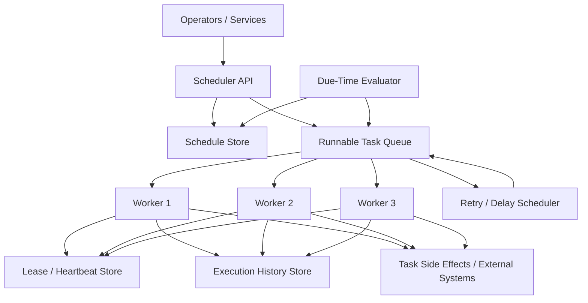
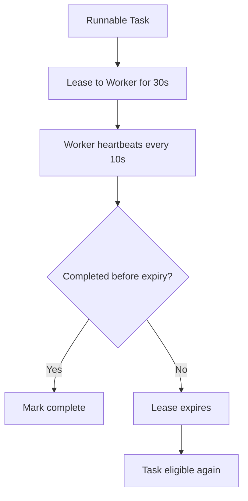

# System Design: Distributed Job Scheduler

> Design a distributed job scheduler that manages 500M task executions per day, coordinates 20M scheduled timers, supports retries and DAG-style workflows, and survives worker or scheduler failures without losing work.

---

## Concepts Covered

- **Concept 01** - Horizontal vs Vertical Scaling & Auto-scaling
- **Concept 05** - API Design Patterns
- **Concept 13** - Synchronous vs Asynchronous Communication Patterns
- **Concept 14** - Message Queues & Stream Processing
- **Concept 15** - Event-Driven Architecture & Event Sourcing
- **Concept 18** - Distributed Consensus Simplified
- **Concept 19** - Fault Tolerance Patterns
- **Concept 20** - Idempotency, Deduplication & Exactly-Once Semantics
- **Concept 21** - Monitoring, Observability & SLOs/SLAs
- **Concept 25** - Distributed Task Scheduling & Workflow Orchestration

---

## Step 1: Requirements & Scope

### Functional Requirements

- **Create scheduled jobs**: Users or internal systems can define one-time, recurring, or delayed tasks.
- **Run tasks when they become due**: Time-based eligibility is the core function of the scheduler.
- **Support retries with backoff**: Many background tasks fail transiently and should retry safely.
- **Support workflow dependencies or DAG-style execution**: Some jobs depend on earlier tasks completing first.
- **Lease work to workers safely**: A task should not be lost if a worker dies, and duplicate execution should be bounded and manageable.
- **Track execution history and status**: Operators need visibility into started, completed, retried, and failed work.
- **Support backfills and manual reruns**: Production systems inevitably need replay or catch-up execution.

### Non-Functional Requirements

- **Availability target**: 99.99% for scheduling and dispatching eligible tasks.
- **Scale**: 500M task executions/day and 20M live timers or schedules.
- **Dispatch latency**: High-priority jobs should begin within seconds of becoming due.
- **Durability**: Once a schedule or runnable task is accepted, it should survive process or node failures.
- **Consistency**: At-least-once execution is acceptable if tasks are designed to be idempotent. Silent task loss is not acceptable.
- **Operability**: The system should expose queue depth, overdue tasks, retry storms, and workflow bottlenecks clearly.
- **Isolation**: Backfills and bulk jobs must not starve realtime or critical workflow tasks.

### Out of Scope

- **Kubernetes cluster management or container orchestration internals**: We assume workers exist and can run tasks.
- **Complex human approval flows**: Workflows may exist, but we are not building a full BPM suite.
- **Per-task business logic**: The scheduler runs arbitrary tasks; it does not know each task's domain details.
- **Full UI for DAG authoring**: We focus on backend mechanics, not authoring UX.
- **Cross-company compliance policy engines**: Important for enterprise workflow products, but orthogonal here.

The interesting system-design question is not "how do I run cron in the cloud?" It is how to turn time and workflow dependencies into durable runnable work without double-running or silently dropping tasks.

---

## Step 2: Back-of-Envelope Estimation

### Traffic Estimation

Assumptions:
- Task executions/day: `500,000,000`
- Scheduled timers tracked at any moment: `20,000,000`
- Peak multiplier: `3x`

Task execution throughput:
```text
500,000,000 / 86,400 = 5,787.04 task starts/sec average
Peak task starts/sec = 5,787.04 x 3 = 17,361.11/sec
```

Timer evaluation pressure:
We do not want to scan 20M timers naively every second. That would be wasteful. The estimate tells us a timer wheel, delayed queue, or efficient due-time index is required.

If 1% of timers become due within a hot minute:
```text
20,000,000 x 1% = 200,000 due timers in a minute
200,000 / 60 = 3,333.33 new runnable tasks/sec
```

That fits comfortably within the execution rate, but only if due-time evaluation is efficient.

### Storage Estimation

Task execution record:
```text
task_id                16 bytes
workflow_id            16 bytes
schedule_id            16 bytes
payload_ref            64 bytes
status                 8 bytes
attempt_no             4 bytes
timestamps             24 bytes
worker_id              16 bytes
overhead/indexes       236 bytes
--------------------------------
~400 bytes/execution record
```

Daily execution history:
```text
500,000,000 x 400 bytes = 200,000,000,000 bytes/day
= 186.26 GB/day
```

30-day hot history:
```text
186.26 GB/day x 30 = 5.59 TB
```

With replication factor 3:
```text
5.59 TB x 3 = 16.77 TB
```

Schedule metadata:
Suppose 20M active schedules at 500 bytes each:
```text
20,000,000 x 500 bytes = 10,000,000,000 bytes
= 9.31 GB
```

That is modest. Again, the difficult part is the state transitions and timer evaluation rate, not storage footprint.

### Bandwidth Estimation

Assume average task dispatch payload and ack metadata is around `1 KB`.

Peak dispatch traffic:
```text
17,361.11 x 1 KB = 17,361.11 KB/sec
= 16.95 MB/sec
```

Even if acknowledgments double this, the traffic is still manageable. Coordination remains the hard problem.

### Memory Estimation (for scheduling hot state)

If we keep the nearest 1M due timers in memory and each entry costs about 128 bytes:
```text
1,000,000 x 128 bytes = 128,000,000 bytes
= 122 MB
```

That tells us a scheduler can keep the hot slice of near-future timers in RAM while persisting the full schedule set durably elsewhere.

### Summary Table

| Metric | Value |
|--------|-------|
| Task starts/sec (average) | ~5,787 |
| Task starts/sec (peak) | ~17,361 |
| Active schedules | 20M |
| Daily execution-history growth | ~186.26 GB |
| 30-day replicated hot history | ~16.77 TB |
| Peak dispatch traffic | ~16.95 MB/sec |
| Near-future timer hot set | ~122 MB |

---

## Step 3: API Design

The scheduler is an infrastructure service. Its clients are other services or operators, so the API surface should prioritize explicitness over consumer prettiness.

Cross-reference: **Concept 05 - API Design Patterns**.

### Create Schedule

```
POST /api/v1/schedules
```

**Parameters:**
| Parameter | Type | Required | Description |
|-----------|------|----------|-------------|
| name | string | Yes | Human-readable schedule name |
| cron | string | No | Cron expression |
| run_at | string | No | One-time schedule time |
| workflow_id | string | Yes | Which task or workflow to trigger |
| payload_ref | string | No | Payload reference |
| priority | string | Yes | low, normal, high, critical |

**Response:**
```json
{
  "schedule_id": "sch_88231",
  "status": "active",
  "next_run_at": "2026-03-21T00:00:00Z"
}
```

### Poll Runnable Tasks

```
POST /api/v1/workers/lease
```

**Parameters:**
| Parameter | Type | Required | Description |
|-----------|------|----------|-------------|
| worker_id | string | Yes | Worker identity |
| queue | string | Yes | Queue or lane |
| limit | integer | No | Max tasks to lease |

**Response:**
```json
{
  "tasks": [
    {
      "task_id": "t_88231",
      "workflow_id": "wf_91",
      "payload_ref": "payload://abc",
      "lease_expiry": "2026-03-20T12:00:30Z"
    }
  ]
}
```

### Ack Task Completion

```
POST /api/v1/tasks/{task_id}/complete
```

**Parameters:**
| Parameter | Type | Required | Description |
|-----------|------|----------|-------------|
| worker_id | string | Yes | Completing worker |
| result_ref | string | No | Optional result pointer |

**Response:**
```json
{
  "status": "completed"
}
```

### Fail and Retry Task

```
POST /api/v1/tasks/{task_id}/fail
```

**Parameters:**
| Parameter | Type | Required | Description |
|-----------|------|----------|-------------|
| worker_id | string | Yes | Worker identity |
| retryable | boolean | Yes | Should the scheduler retry it |
| error_code | string | No | Failure category |

**Response:**
```json
{
  "status": "retry_scheduled"
}
```

---

## Step 4: Data Model

### Database Choice

We use:
- **Schedule store** for durable schedule definitions and next-run metadata
- **Runnable task queue or log** for executable tasks
- **Execution history store** for attempts and outcomes
- **Lease/heartbeat store** for worker ownership

This follows **Concept 25 - Distributed Task Scheduling & Workflow Orchestration** closely. Schedules and runnable tasks are not the same thing and should not be collapsed mentally or architecturally.

### Schema Design

```text
Table: schedules
├── schedule_id         UUID            PRIMARY KEY
├── name                VARCHAR(256)    NOT NULL
├── cron_expr           VARCHAR(128)    NULLABLE
├── run_at              TIMESTAMP       NULLABLE
├── workflow_id         VARCHAR(128)    NOT NULL
├── payload_ref         VARCHAR(256)    NULLABLE
├── priority            SMALLINT        NOT NULL
├── status              VARCHAR(32)     NOT NULL
├── next_run_at         TIMESTAMP       NOT NULL
└── INDEX: idx_schedules_due ON (next_run_at, status)
```

```text
Table / Queue: runnable_tasks
├── task_id             UUID            PRIMARY KEY
├── schedule_id         UUID            NULLABLE
├── workflow_id         VARCHAR(128)    NOT NULL
├── available_at        TIMESTAMP       NOT NULL
├── priority            SMALLINT        NOT NULL
├── attempt_no          INTEGER         NOT NULL
├── status              VARCHAR(32)     NOT NULL
└── INDEX: idx_tasks_available ON (available_at, priority, status)
```

```text
Table: task_leases
├── task_id             UUID            PRIMARY KEY
├── worker_id           VARCHAR(128)    NOT NULL
├── lease_expires_at    TIMESTAMP       NOT NULL
└── heartbeat_at        TIMESTAMP       NOT NULL
```

### Access Patterns

- **Find due schedules**: range scan by `next_run_at`
- **Emit runnable tasks**: insert into `runnable_tasks`
- **Lease available work**: claim runnable tasks with status transition
- **Retry with delay**: update `available_at`
- **Audit execution**: query execution history by task or workflow

The schema mirrors the state machine. That makes operations and debugging far easier.

---

## Step 5: High-Level Architecture

### Mermaid Diagram



### Architecture Walkthrough

The architecture begins with the schedule store. Operators or upstream services create schedules through the Scheduler API. A schedule definition contains the recurrence or one-time trigger plus the workflow or task payload reference. Importantly, that schedule definition is not executable work yet. It is only a promise about future eligibility.

A due-time evaluator, often called the scheduler loop, continuously scans the schedule store for work that has become due. When a schedule crosses its run boundary, the evaluator materializes a runnable task into the task queue and updates the schedule's next-run timestamp if it is recurring. This is the first conceptual divide that makes scheduler systems easier to reason about: schedules create runnable tasks, they do not execute tasks themselves.

Workers do not read schedules directly. They lease runnable tasks from the queue. Leasing matters because distributed workers fail. A worker that simply "takes" work with no lease record can crash and leave the system uncertain whether the task is still active. With leases, the worker claims a task for a bounded time window and renews that lease via heartbeats while it runs.

When a worker receives a task, it records ownership in the lease store, executes the task against external systems, and writes status into the execution history store. If it completes successfully, the task is marked done. If it fails with a retryable error, the task is rescheduled into the retry path with a new `available_at` time based on backoff policy. If it fails permanently, the task is marked failed and may land in a dead-letter or manual review queue.

The retry component is conceptually just another scheduler. It turns "retry after 30 seconds" into a new future available time. That is why delayed retries and time-based workflows naturally belong in the same general architecture.

Workflow support builds on the same pieces. A workflow engine may create child tasks only after prerequisite tasks complete. Those child tasks still become runnable entries in the queue. The scheduler is therefore not just a cron replacement. It is also a durable transition engine for execution state.

The lease store is one of the most critical pieces in failure handling. If a worker dies and stops heartbeating, the lease expires and another worker can reclaim the task. That means the system is usually at-least-once rather than exactly-once. A task may run twice if the first worker performed the side effect and died before recording completion. That is why idempotency belongs in task design, not as an optional extra.

Backfills and priority isolation are also easier to understand in this architecture. A backfill can create millions of runnable tasks without directly burdening the scheduling loop, as long as the queue and worker pools enforce quotas and priorities. Critical real-time tasks can live in separate lanes or queues so bulk catch-up work does not starve them.

This architecture works because it turns the scheduler into a set of explicit state transitions: due schedules become runnable tasks, workers lease tasks, side effects execute, leases expire or complete, retries become future tasks, and workflow dependencies release new work. Nothing magical is hiding in the term "scheduler" once you see those transitions clearly.

That explicitness is also what makes the system debuggable for operators. When someone asks "why did this task run twice" or "why is this workflow stuck," the answer should come from visible state transitions and lease history rather than from opaque timing behavior hidden inside one monolithic scheduler loop.

It is a control plane built from durable state changes, not a timer loop with wishful thinking around failure.

That difference matters enormously at scale.

---

## Step 6: Deep Dives

### Deep Dive 1: Lease and Heartbeat Mechanics

The scheduler's core safety mechanism is the lease. When a worker takes a task, it does not own it forever. It owns it until the lease expires.

### Mermaid Diagram



### Diagram Walkthrough

The worker claims a task and receives a lease, perhaps for 30 seconds. While it runs, it heartbeats every 10 seconds. If it finishes successfully, the task is marked complete and removed from further consideration.

If the worker crashes or stalls, the lease eventually expires. The task becomes eligible for another worker. This is what protects the system from silent task loss. It also explains why idempotency is necessary: re-execution is a feature, not a bug, in recovery paths.

Cross-reference: **Concept 19 - Fault Tolerance Patterns** and **Concept 20 - Idempotency, Deduplication & Exactly-Once Semantics**.

### Deep Dive 2: Timer Evaluation Strategy

Scanning 20M schedules every second is wasteful. Better strategies include:
- indexed `next_run_at` range scans
- timer wheels
- delayed-queue buckets

The right choice depends on timer volume and granularity. The key insight is that scheduling efficiency comes from only looking at the near-future due slice, not the entire universe of schedules.

### Deep Dive 3: Workflow Dependencies

Workflows are not just timed triggers. They model relationships between tasks. One task finishing may release several dependent tasks. Some systems store an explicit DAG. Others keep dependency counters and only emit child runnable tasks when all prerequisites are done.

The architecture remains the same underneath: dependency resolution creates runnable work, and workers lease runnable work. That is why a general scheduler can often grow into a workflow engine rather than being replaced entirely.

### Deep Dive 4: Backfills Without Starving Live Traffic

Backfills can create huge runnable-task floods. If the system treats all tasks equally, a 90-day replay may drown current production jobs. Good schedulers therefore isolate pools or assign priorities:
- live task lanes
- backfill task lanes
- per-tenant quotas
- maximum concurrent runs per workflow

Without this, a recovery tool becomes a new outage source.

---

## Step 7: Bottlenecks & Scaling

### Identifying Bottlenecks

At `10x` scale, the due-time evaluator and queue insertion path become important. If the scheduler cannot materialize runnable tasks quickly enough, work becomes overdue even when worker capacity exists.

Lease-store churn is another issue. High task throughput means many lease writes and heartbeats. If leases are stored in a slow or overloaded system, worker efficiency collapses.

At `100x`, workflow explosions and backfills become the real operational pain. One upstream bug fix can create a huge replay workload that stresses every layer.

### Scaling Solutions

| Bottleneck | Solution | Impact | New Ceiling | Cross-reference |
|------------|----------|--------|-------------|-----------------|
| Due-time evaluation | Partition schedules by time bucket or shard | Faster due-task materialization | More predictable timer handling | Concept 25 |
| Lease-store churn | Coarse heartbeat cadence and efficient lease storage | Lower write amplification | Better worker utilization | Concept 19 |
| Backfill overload | Queue isolation, quotas, and priority lanes | Protects live traffic | Safer replay operations | Concept 14 |
| Workflow fanout bursts | Per-workflow concurrency caps | Prevents downstream thundering herds | More stable execution | Concept 15 |

### Failure Scenarios

- **Scheduler-loop outage**: Existing runnable tasks continue, but new due tasks accumulate as overdue.
- **Queue outage**: Accepted schedules remain stored, but new executable work cannot flow to workers.
- **Worker crash**: Lease expiry returns work to the queue.
- **History-store lag**: Execution status becomes stale, though work may still be progressing.
- **Clock skew**: Due-time evaluation and lease expiry become inconsistent, which is why time sync matters in scheduler fleets.

Schedulers often fail as "silence" rather than obvious errors. Overdue task age is one of the most important signals in the whole system.

---

## Step 8: Monitoring & Alerting

### Key Metrics to Track

Business metrics:
- Tasks executed per minute
- Overdue task count
- Workflow completion rate
- Retry and dead-letter volume

Infrastructure metrics:
- Queue depth by priority lane
- Oldest runnable task age
- Scheduler-loop lag
- Lease expiry rate
- Worker heartbeat failures
- History write latency

### SLOs

- **Scheduling availability**: 99.99%
- **Due-task dispatch latency**: 99% of high-priority tasks start within seconds of eligibility
- **No silent task loss**: all accepted tasks are eventually completed, retried, or terminally failed with status
- **Retry freshness**: delayed retries occur within configured backoff windows
- **Operational visibility**: overdue-task age remains within defined bounds

### Alerting Rules

- **CRITICAL**: oldest runnable task age exceeds threshold
- **CRITICAL**: due-time evaluator lag > 60 seconds
- **WARNING**: retry queue growth above baseline
- **CRITICAL**: worker heartbeat failures spike
- **WARNING**: lease expiries unusually high for one workflow
- **CRITICAL**: queue unavailable or write failures > 1%

Cross-reference: **Concept 21 - Monitoring, Observability & SLOs/SLAs**.

One subtle but important operational practice is to distinguish "overdue because the scheduler is unhealthy" from "overdue because downstream capacity is intentionally constrained." Both show up as delayed tasks, but the remediation is different. The first is a control-plane incident. The second may simply mean quotas, backpressure, or dependency health are doing their job.

Another worthwhile metric is task age by workflow stage. A DAG where one node is always the bottleneck needs a different fix than a flat queue where everything is aging together. Scheduler platforms become much more debuggable when they expose where in a workflow or queueing lane time is actually being spent.

Time semantics also create user-facing surprises. Cron-like schedules around daylight-saving transitions, month boundaries, or missed maintenance windows can produce confusing operator expectations unless the platform makes timezone behavior and catch-up behavior explicit. Great schedulers are often boring precisely because they document and encode these edge cases clearly instead of leaving them to tribal knowledge.

Finally, the scheduler should help teams build idempotent tasks rather than merely demanding it. Clear retry metadata, delivery of attempt numbers, and first-class dead-letter support all make task authors far more likely to design safe handlers. Infrastructure and application correctness reinforce each other here.

For workflow-heavy environments, another practical concern is payload size. Passing giant inline payloads through schedule tables and task queues makes storage, retries, and replay harder than they need to be. Most mature systems store payload references and keep the scheduler focused on orchestration metadata rather than business object bulk transfer.

Another subtle but important design boundary is between "the scheduler knows a task exists" and "the scheduler understands the semantics of the task." The scheduler should know about timing, retries, dependency state, and status. It should not need deep knowledge of whether a task sends email, bills a customer, or recomputes analytics. That separation is what keeps the platform reusable across teams.

Replay safety is also worth emphasizing. Backfills and manual reruns are most dangerous when they are easy to trigger but hard to bound. Strong systems require explicit scope, show estimated volume, and route replay work through isolated queues or quotas so a well-meaning operator cannot accidentally swamp the live production path with one click.

Finally, observability for workflows benefits from both aggregate and per-run views. Queue depth and retry rates tell you about platform health, but workflow graphs, task-state timelines, and per-run audit trails tell you why one specific business process stalled. A scheduler that only exposes one of those views will frustrate operators during incidents.

Another worthwhile design choice is explicit concurrency governance at several layers: per queue, per workflow, per tenant, and sometimes per downstream dependency. Without those controls, the scheduler becomes a perfect amplifier for overload. It will faithfully hand thousands of tasks to workers even when the real bottleneck is a payment API, a warehouse database, or a third-party integration that should only see a few dozen requests per second.

Scheduler correctness also benefits from immutable event history for workflow transitions, even when the system exposes a simpler current-status row. A durable history of `scheduled`, `leased`, `heartbeat`, `completed`, `failed`, and `retried` events makes debugging and replay safer because operators can reconstruct how the platform got to the current state instead of guessing from one final status flag.

Finally, distributed schedulers often end up being shared by many teams with very different maturity levels. The platform should therefore make safe behavior easy: retry defaults, dead-letter handling, idempotency guidance, and protected backfill controls should be opinionated rather than optional. Otherwise the scheduler becomes a place where every team re-discovers the same failure patterns independently.

---

## Summary

### Key Design Decisions

1. **Separate schedules from runnable tasks** because time-based intent and executable work are different states with different scaling needs.
2. **Use leases and heartbeats for worker ownership** so tasks are not lost when workers die.
3. **Treat retries as future scheduled work** because delayed retries are just another timer problem.
4. **Record execution history durably** so operators can understand what happened and replay safely.
5. **Isolate live and backfill traffic** so recovery workflows do not create new outages.

### Top Tradeoffs

1. **At-least-once durability versus exactly-once wishful thinking**: We choose safe replay and require idempotent tasks.
2. **Fast timer evaluation versus implementation simplicity**: scanning everything is simple but does not scale; indexed or wheel-based timing is more efficient.
3. **General scheduler versus full workflow engine**: richer orchestration helps complex processes but adds operational and modeling cost.

### Alternative Approaches

- Small systems can start with managed queues and CronJobs before graduating to a centralized scheduler.
- Some teams may choose a workflow engine such as Temporal from the start if long-running workflows dominate.
- Data pipelines with explicit DAGs may prefer Airflow-like models over a general-purpose task queue.

The main lesson is that distributed scheduling is really about durable state transitions under failure, not about clocks. Time only decides when work becomes eligible. The rest of the system decides whether that work runs safely and observably.

That framing is what keeps scheduler design grounded. Teams often begin by talking about cron syntax and quickly discover their real problems are ownership, retries, idempotency, quotas, and visibility. A strong scheduler design embraces that reality and treats timing as only one input into a larger execution-state machine.

It also makes the platform more reusable. Once the scheduler is built around clear transitions and safe recovery rather than around one narrow trigger style, it can support cron jobs, delayed retries, workflow branches, backfills, and operator reruns with the same core machinery instead of accumulating a separate bespoke tool for each new use case.

That distinction is worth defending because many teams initially picture schedulers as "Cron, but bigger." In reality, once scale and business criticality rise, the timer is the easy part. The harder parts are making sure accepted work is never silently forgotten, retries are bounded and intelligible, leases expire safely, operators can tell why something is stuck, and backfills do not destroy live traffic. A scheduler becomes valuable not because it knows what minute it is, but because it can move work through a durable lifecycle that remains understandable during failure.

Another useful mental model is that schedules, runnable tasks, and execution history are different products sharing one platform. The schedule definition describes intent. Runnable tasks describe immediate work. History describes what actually happened. Mixing those states into one overloaded row or queue often feels simpler early on, but it becomes painful when teams need audit trails, replay, idempotent retries, or workflow inspection. Clean state boundaries are what let the system answer basic but crucial questions like "was this task created," "was it ever leased," "did it run twice," and "why is it overdue right now."

Scheduler platforms also need strong operator ergonomics. When incidents happen, humans need to pause one workflow family, replay a bounded date range, inspect a dead-letter reason, or drain a noisy tenant without understanding every internal table by hand. That means the control plane matters. Good schedulers expose safe replay scopes, workflow-level concurrency limits, clear attempt histories, and explicit task state transitions. They make it hard to accidentally flood the queue with millions of backfill jobs and easy to prove what the platform did after the fact. Operational simplicity here is not a luxury. It is part of correctness.

Multi-tenancy introduces another layer of nuance. One noisy internal service or customer should not be able to fill the runnable queue, consume all worker leases, or create enormous retry storms that obscure everyone else's health. Quotas, lane isolation, and per-workflow visibility are therefore as important as raw dispatch throughput. The platform should be able to say not only "tasks are late" but also "which tenant, which workflow, and which stage is responsible." Without that segmentation, a scheduler incident quickly turns into a blame game with no trustworthy data.

Finally, the scheduler's contract with task authors matters just as much as its internal architecture. If handlers are not idempotent, if retry metadata is unclear, if deadlines and backoff behavior are undocumented, or if payloads are too large and too opaque, the platform will keep paying for application-level confusion. The scheduler should help authors succeed by delivering attempt counts, stable task IDs, deadlines, and first-class dead-letter paths. When that contract is strong, the platform can embrace at-least-once delivery confidently. When it is weak, every retry looks like a bug even when the infrastructure is working exactly as designed.

That is why the best schedulers feel less like timer daemons and more like workflow control planes with strong guardrails. They make time-based execution understandable, replayable, and safe under pressure, which is exactly what large organizations need once simple cron jobs stop being enough.

That control-plane framing also keeps the platform honest about growth. As more teams adopt it, the winning move is not to hide complexity but to contain it with clearer workflow state, safer replay primitives, stronger quotas, and better operator visibility by tenant and queue. When those guardrails are present, the scheduler becomes one of the most stabilizing shared systems in the stack instead of just another place where background work disappears mysteriously.
