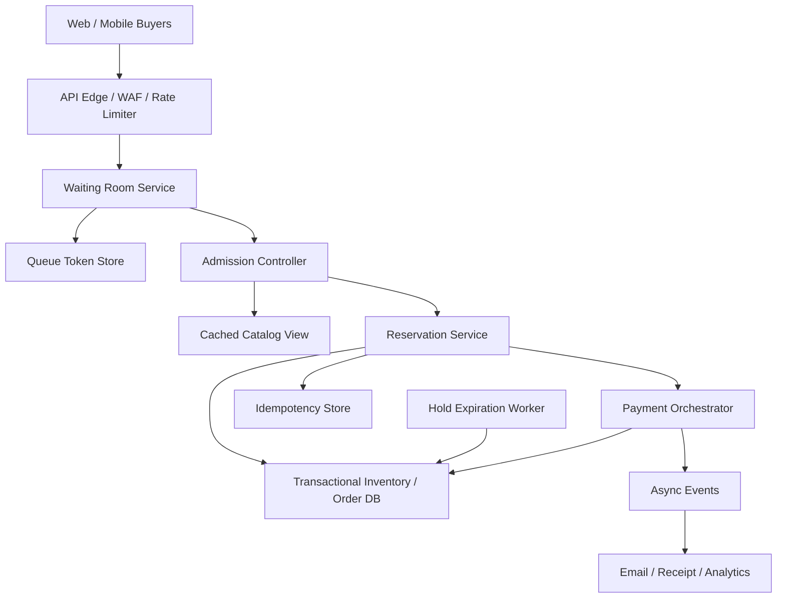
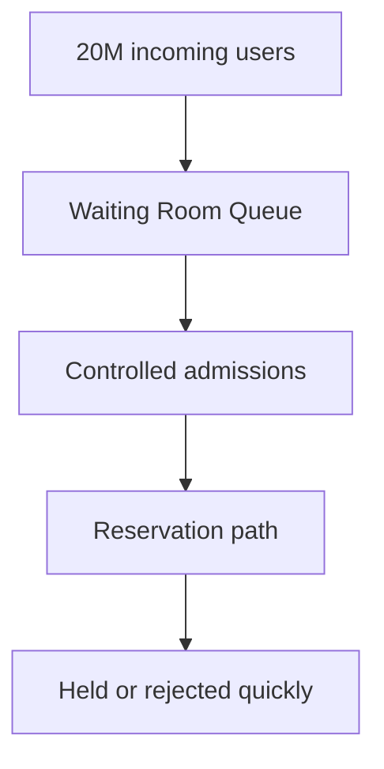

# System Design: E-commerce Flash Sale / Ticketmaster-Style Drop

> Design a flash-sale platform that faces 20M users arriving for a high-demand event, handles 300K purchase attempts per second at peak, maintains strict inventory correctness for 100K scarce items, and degrades gracefully under massive contention.

---

## Concepts Covered

- **Concept 01** - Horizontal vs Vertical Scaling & Auto-scaling
- **Concept 02** - Load Balancing Deep Dive
- **Concept 04** - API Gateway, Reverse Proxy & Rate Limiting
- **Concept 06** - SQL Databases at Scale
- **Concept 10** - Caching Strategies
- **Concept 13** - Synchronous vs Asynchronous Communication Patterns
- **Concept 14** - Message Queues & Stream Processing
- **Concept 15** - Event-Driven Architecture & Event Sourcing
- **Concept 17** - CAP Theorem & PACELC
- **Concept 19** - Fault Tolerance Patterns
- **Concept 20** - Idempotency, Deduplication & Exactly-Once Semantics
- **Concept 21** - Monitoring, Observability & SLOs/SLAs

---

## Step 1: Requirements & Scope

### Functional Requirements

- **Users can enter a waiting room before the sale opens**: This is essential for smoothing traffic and providing perceived fairness.
- **Users can view item availability and pricing**: Inventory presentation matters, even if it is slightly delayed relative to the exact reservation ledger.
- **Users can reserve an item or seat temporarily during checkout**: This is the central correctness boundary. Without a reservation concept, overselling becomes likely.
- **Users can complete payment and convert a reservation into a purchase**: Successful checkout must atomically commit inventory consumption.
- **Users lose reservations after a short timeout**: Scarce inventory should not be locked indefinitely by abandoned carts.
- **The system prevents duplicate purchases from retries or refreshes**: Idempotency is a core part of flash-sale correctness.
- **Operators can throttle, queue, and degrade non-essential features**: A sale platform needs operational controls, not just happy-path APIs.

What makes this system different from ordinary e-commerce is that the product promise is really about allocation under scarcity. Users do not just care whether the site stays up. They care whether the process feels fair, whether the same seat is not sold twice, and whether a temporary hold actually means something. That puts unusual weight on admission control and transactional correctness.

### Non-Functional Requirements

- **Availability target**: 99.99% for waiting-room entry and reservation APIs.
- **Peak scale**: 300K purchase attempts/sec, with millions of users queued before the drop.
- **Reservation latency**: p99 under 500ms for reservation attempts under healthy conditions.
- **Inventory correctness**: Zero oversell of hard inventory such as event tickets or limited physical stock.
- **Consistency**: Strong consistency for reservation and purchase boundaries; eventual consistency is acceptable for read-side catalog views.
- **Graceful degradation**: Queue users, shed non-critical traffic, and preserve purchase correctness under overload.
- **Durability**: Confirmed purchases and reservation expirations must survive failures.

### Out of Scope

- **Search and discovery catalog systems**: We assume users already know what they want to buy.
- **Recommendation engines**: Not relevant during a concentrated drop.
- **Fraud scoring internals**: We may hold orders for review, but not design the fraud engine.
- **Payment gateway internals**: We assume a payment service exists.
- **Long-term fulfillment and shipping**: We focus on the sale window and inventory commitment path.

The central challenge is that the system must remain strict where it matters most and flexible everywhere else. A flash-sale platform is fundamentally a fairness and correctness engine under extreme load.

---

## Step 2: Back-of-Envelope Estimation

### Traffic Estimation

Assumptions:
- Waiting-room users at open: `20,000,000`
- Peak purchase attempts: `300,000/sec`
- Inventory units for the event/drop: `100,000`
- Payment completion ratio from successful reservations: `70%`

Reservation attempts:
```text
Peak reservation attempt rate = 300,000/sec
```

If only 100,000 inventory units exist, most attempts will fail or be queued. That is normal and important to acknowledge. The system is not designed to make everyone happy. It is designed to be correct and fair.

Successful reservations if sold out in 5 minutes:
```text
100,000 / 300 seconds = 333.33 successful reservations/sec on average
```

That contrast is the key design insight:
- **300,000 attempted writes/sec**
- **only a few hundred true inventory wins/sec**

This tells us the system should filter and queue aggressively before requests ever reach the strict inventory path.

### Storage Estimation

Inventory/reservation record:
```text
item_id               16 bytes
reservation_id        16 bytes
user_id               8 bytes
status                8 bytes
hold_expires_at       8 bytes
payment_ref           32 bytes
timestamps            24 bytes
overhead/indexes      144 bytes
--------------------------------
~256 bytes per reservation/order row
```

If 20M users enter the waiting room and 5M make serious purchase attempts:
```text
5,000,000 x 256 bytes = 1,280,000,000 bytes
= 1.19 GB
```

This is not large storage volume. Again, the challenge is concurrency and correctness, not raw bytes.

Waiting-room session state:
Suppose 20M queue entries at 128 bytes each:
```text
20,000,000 x 128 bytes = 2,560,000,000 bytes
= 2.38 GB
```

### Bandwidth Estimation

Purchase attempts:
Assume each attempt request/response pair averages `2 KB`.

```text
300,000/sec x 2 KB = 600,000 KB/sec
= 585.9 MB/sec
```

Waiting-room refresh traffic:
If queued users poll or receive updates, that can be even larger unless we control it. This is why the waiting room often uses lightweight tokens and carefully rate-limited refresh intervals.

### Memory Estimation (for hot state)

Hot in-memory state:
- queue tokens for active waiting-room users: ~2.38 GB
- live reservation counters and seat maps for one drop: say ~1 GB
- rate limits and idempotency keys: another ~2 GB

A `6-8 GB` hot-state tier per major sale region is very reasonable. The pressure is not memory capacity. It is atomic state mutation under insane concurrency.

### Summary Table

| Metric | Value |
|--------|-------|
| Waiting-room entrants | 20M |
| Peak purchase attempts | 300K/sec |
| Successful inventory wins needed | ~333/sec to sell 100K in 5 min |
| Waiting-room hot state | ~2.38 GB |
| Attempt/request bandwidth at peak | ~586 MB/sec |
| Hot operational state target | ~6-8 GB |

---

## Step 3: API Design

The API surface is really a sequence of controlled gates: waiting room, reservation, checkout, confirmation.

Cross-reference: **Concept 05 - API Design Patterns** and **Concept 04 - API Gateway, Reverse Proxy & Rate Limiting**.

### Join Waiting Room

```
POST /api/v1/waiting-room/join
```

**Parameters:**
| Parameter | Type | Required | Description |
|-----------|------|----------|-------------|
| user_id | string | Yes | User joining |
| drop_id | string | Yes | Sale or event identifier |

**Response:**
```json
{
  "queue_token": "q_abc123",
  "status": "queued",
  "estimated_wait_sec": 420
}
```

### Check Waiting Room Status

```
GET /api/v1/waiting-room/{queue_token}
```

**Response:**
```json
{
  "status": "admitted",
  "admission_token": "adm_123",
  "expires_at": "2026-03-20T12:02:00Z"
}
```

### Reserve Inventory

```
POST /api/v1/reservations
```

**Parameters:**
| Parameter | Type | Required | Description |
|-----------|------|----------|-------------|
| admission_token | string | Yes | Proof user cleared waiting room |
| user_id | string | Yes | Buyer |
| item_id | string | Yes | Scarce item or seat ID |
| idempotency_key | string | Yes | Protect retry behavior |

**Response:**
```json
{
  "reservation_id": "res_88231",
  "status": "held",
  "hold_expires_at": "2026-03-20T12:07:00Z"
}
```

### Complete Purchase

```
POST /api/v1/orders
```

**Parameters:**
| Parameter | Type | Required | Description |
|-----------|------|----------|-------------|
| reservation_id | string | Yes | Existing hold |
| payment_token | string | Yes | Payment authorization reference |
| idempotency_key | string | Yes | Checkout dedupe key |

**Response:**
```json
{
  "order_id": "ord_912",
  "status": "confirmed"
}
```

The important thing about these endpoints is not their surface syntax. It is the explicit state transitions they represent.

---

## Step 4: Data Model

### Database Choice

We use:
- **Strongly consistent relational or transactional store** for inventory, reservations, and order state
- **Redis or in-memory store** for waiting-room queues, idempotency keys, and hot counters
- **Queue/stream** for asynchronous payment confirmation, email, and analytics side effects

Why the strong transactional store? Because inventory correctness is the product. This is where **Concept 06 - SQL Databases at Scale** matters more than clever distributed write fanout.

### Schema Design

```text
Table: inventory
├── item_id             BIGINT          PRIMARY KEY
├── drop_id             BIGINT          NOT NULL
├── status              VARCHAR(16)     NOT NULL         -- available, held, sold
├── current_hold_id     UUID            NULLABLE
├── updated_at          TIMESTAMP       NOT NULL
└── INDEX: idx_inventory_drop_status ON (drop_id, status)
```

```text
Table: reservations
├── reservation_id      UUID            PRIMARY KEY
├── item_id             BIGINT          NOT NULL UNIQUE
├── user_id             BIGINT          NOT NULL
├── status              VARCHAR(16)     NOT NULL         -- held, expired, confirmed, canceled
├── hold_expires_at     TIMESTAMP       NOT NULL
├── idempotency_key     VARCHAR(128)    NOT NULL UNIQUE
└── INDEX: idx_reservations_expiry ON (hold_expires_at, status)
```

```text
Table: orders
├── order_id            UUID            PRIMARY KEY
├── reservation_id      UUID            NOT NULL UNIQUE
├── user_id             BIGINT          NOT NULL
├── payment_status      VARCHAR(32)     NOT NULL
├── status              VARCHAR(32)     NOT NULL
└── created_at          TIMESTAMP       NOT NULL
```

### Access Patterns

- **Admit queued user**: validate queue/admission token in memory
- **Reserve item**: transactional update on `inventory` plus insert into `reservations`
- **Expire holds**: scan reservation expiry index
- **Confirm purchase**: convert reservation to order atomically
- **Read catalog availability**: cached or eventually consistent projections by drop

Inventory correctness depends on the authoritative write path, not on the read-side catalog cache.

---

## Step 5: High-Level Architecture

### Mermaid Diagram



### Architecture Walkthrough

The first thing users see is the waiting room. This is not just theater. It is one of the most important scaling controls in the system. When 20 million users show up for 100,000 scarce items, the correct architecture is not "let them all hammer the reservation database equally." The correct architecture is to meter admission.

Users hit the API edge, which includes rate limiting, bot filtering, and coarse admission controls. From there they join the waiting room and receive queue tokens. The waiting-room service tracks queue position or eligibility state in a hot in-memory store. It can release users in controlled batches into the actual purchase flow.

Once admitted, users can read a cached catalog or availability view. This read path should not hit the transactional inventory store for every page load. Catalog data can be slightly stale as long as the authoritative reservation step is correct. This is where **Concept 10 - Caching Strategies** helps: cache the high-volume reads, keep the strict write boundary small.

The reservation service is the heart of the system. When a user attempts to reserve an item, the service validates the admission token, checks the idempotency key, and then performs a transactional update in the database. The item moves from `available` to `held`, linked to a reservation row with an expiration time. This state transition must be atomic. If two buyers race for the same ticket, exactly one should win.

After a successful hold, the user moves into checkout. Payment orchestration may be asynchronous internally, but purchase correctness still depends on the reservation. The user should not be allowed to hold inventory forever. A hold expiration worker scans for expired reservations and releases inventory back to `available`. This lifecycle is not optional. It is what prevents abandoned carts from freezing scarce inventory during a drop.

Once payment is confirmed, the system converts the reservation into a durable order. That transition should also be idempotent because checkout retries happen constantly under user refreshes and network uncertainty. After the order is confirmed, asynchronous events can fan out to email, receipts, analytics, and downstream fulfillment. Those side effects must never sit on the critical path of inventory commitment.

Graceful degradation is built into the architecture. The waiting room can slow or pause admissions. The catalog can serve cached views. The reservation path can reject excess traffic cleanly rather than failing half-open. Optional systems like analytics or email can lag without endangering correctness. This is exactly the operational mindset from **Concept 19 - Fault Tolerance Patterns**.

The architecture works because it sharply separates the user-experience layers from the scarce-inventory write boundary. Most traffic should never reach the strict transactional core. Only a controlled admitted subset gets that far, and once it does, the system is designed to behave conservatively and correctly.

That separation also shapes the user experience. A queue token is not a cosmetic badge. It is proof that the user has been admitted into the part of the system where inventory can be claimed. Likewise, a reservation is not yet a purchase. It is a temporary exclusive claim backed by the database while payment completes. If the system communicates those states clearly, retries and user confusion drop materially. If it does not, the platform sees a storm of avoidable refreshes and duplicate attempts that can easily become part of the load problem.

That is the real strength of the architecture: it aligns traffic shaping, transactional correctness, and user-visible fairness instead of treating them as separate concerns.

---

## Step 6: Deep Dives

### Deep Dive 1: Waiting Room as a Traffic-Shaping Layer

The waiting room is not just a queue. It is a fairness and safety control. Without it, peak traffic would directly translate into contention on the reservation path. That is a recipe for both poor user experience and oversell bugs.

### Mermaid Diagram



### Diagram Walkthrough

The crowd enters the waiting room, not the transactional database. The queue meters users into the reservation path in batches that the system can actually handle. This means users may wait longer, but the system stays correct and responsive for those currently admitted.

That is the real tradeoff: we are choosing fairness and correctness over the illusion of immediate universal access. For a scarce drop, that is the right call.

Cross-reference: **Concept 04 - API Gateway, Reverse Proxy & Rate Limiting**.

### Deep Dive 2: Reservation Holds and Expiry

The hold is the core correctness primitive. Inventory should not become sold the instant a user clicks "buy" because payment may still fail. Instead, we reserve it for a short TTL, perhaps 5 minutes.

The hold lifecycle:
- item becomes `held`
- payment is attempted
- success converts hold to `sold`
- failure or timeout releases the item

This is cleaner than trying to combine payment and inventory into one giant distributed transaction. The hold is the contract between user experience and inventory correctness.

Operationally, hold duration is also an important lever. If the payment provider is stable, a short hold keeps inventory circulating quickly. If payment callbacks are lagging because of an external issue, the platform may need to extend holds slightly for already admitted buyers while slowing new admissions. This is a much better safety valve than letting inventory sit in ambiguous limbo.

### Deep Dive 3: Idempotent Checkout

Flash sales produce refreshes, double-clicks, retries, and browser resubmits constantly. If the checkout endpoint is not idempotent, one successful payment can create two orders or two charges. The `idempotency_key` on both reservation and order creation is therefore essential, not decorative.

This is a direct case study in **Concept 20 - Idempotency, Deduplication & Exactly-Once Semantics**. High contention multiplies retry behavior, so the safest systems assume retries everywhere.

It helps to think in human terms here. Flash-sale users are not patient distributed-systems clients. They double-click, refresh, open multiple tabs, and retry the moment anything looks slow. An architecture that does not assume that behavior will look fine in a synthetic load test and then fall apart during the actual event.

### Deep Dive 4: Graceful Degradation During Overload

Not every feature is equally important during a drop. Features that can degrade:
- high-fidelity analytics
- recommendation panels
- rich seat-map rendering details
- non-critical notification flows

Features that must stay strict:
- waiting room admission
- reservation creation
- hold expiry
- final order confirmation

This prioritization is what keeps the system usable under real overload instead of trying to keep every pixel perfect.

The other useful degradation tool is admission control itself. If the reservation DB starts showing contention or payment callbacks degrade, the waiting room can simply admit fewer users for a few minutes. That feels slower, but it protects the only boundary that truly cannot fail open: scarce inventory correctness.

---

## Step 7: Bottlenecks & Scaling

### Identifying Bottlenecks

At `10x` scale, the first bottleneck is the reservation boundary itself. Even if the database can technically handle a lot of writes, row-level contention on a hot pool of scarce items is brutal. The blast radius is defined by the hottest inventory, not by average throughput.

The waiting room can also become a problem if clients poll too aggressively. Twenty million users checking status every second is a self-inflicted DDoS unless the system enforces bounded refresh intervals or push-style updates.

At `100x`, payment orchestration and hold expiration management become more complex because they create huge numbers of short-lived state transitions. But even then, inventory contention remains the dominant correctness challenge.

There is also a noisy-neighbor problem inside the sale itself. A handful of premium sections or SKUs may absorb most reservation attempts while the rest of the inventory is relatively cold. That means the platform should measure and think in terms of hot inventory partitions, not just overall QPS. Average throughput numbers hide the real operational pain.

### Scaling Solutions

| Bottleneck | Solution | Impact | New Ceiling | Cross-reference |
|------------|----------|--------|-------------|-----------------|
| Reservation contention | Partition inventory and serialize by item or seat section | Reduces hot-row conflicts | Better correctness under spikes | Concept 06 |
| Waiting-room polling storms | Token-based polling intervals or push updates | Protects edge and queue systems | Higher crowd tolerance | Concept 16 |
| Payment latency while holding stock | Short hold TTLs and payment deadlines | Reduces stuck inventory | Faster turnover of scarce items | Concept 19 |
| Catalog read flood | Aggressive caching and CDN for catalog pages | Keeps transactional DB isolated | Much higher browse capacity | Concept 10 |

### Failure Scenarios

- **Waiting-room outage**: New entrants cannot queue, but admitted users may continue.
- **Reservation DB issue**: This is critical; the system should stop admitting more users rather than risk inconsistent oversell.
- **Payment provider slowdown**: Holds may expire more often or checkout time rises; the system should not silently keep stock locked forever.
- **Expiry worker lag**: Inventory appears sold out longer than necessary because stale holds are not released fast enough.
- **Analytics or notification lag**: Acceptable if reservations and purchases remain correct.
- **Bot or retry storm**: Edge controls and queue admission should absorb the surge before it reaches inventory logic.

A flash-sale system should prefer temporary slowness or queuing over any behavior that risks overselling scarce inventory.

---

## Step 8: Monitoring & Alerting

### Key Metrics to Track

Business metrics:
- Waiting-room entrants and admission rate
- Reservation success rate
- Checkout conversion from hold to order
- Oversell incidents, which should be zero

Infrastructure metrics:
- Reservation p50/p95/p99 latency
- DB lock contention and deadlock rate
- Hold expiry backlog
- Waiting-room poll rate
- Rate-limit rejects and bot-detection blocks
- Payment callback latency
- Duplicate checkout-attempt rate

### SLOs

- **Reservation availability**: 99.99%
- **Reservation latency**: 99% under 500ms
- **Inventory correctness**: zero oversell
- **Hold expiry correctness**: expired holds released within bounded delay
- **Queue fairness**: controlled admission without uncontrolled bypass

### Alerting Rules

- **CRITICAL**: any oversell detected
- **CRITICAL**: reservation p99 > 2 seconds
- **WARNING**: waiting-room polling exceeds expected threshold
- **CRITICAL**: hold expiry worker lag > 60 seconds
- **WARNING**: payment success rate drops sharply
- **CRITICAL**: DB lock contention or error rate above threshold
- **WARNING**: duplicate checkout attempts exceed expected baseline materially

Cross-reference: **Concept 21 - Monitoring, Observability & SLOs/SLAs**.

One additional operational reality is that perceived fairness matters almost as much as literal fairness. If users see a clear queue position, understandable timeouts, and deterministic reservation windows, they tolerate scarcity much better than if the platform appears random or glitchy. That makes waiting-room UX and reservation state communication part of the systems problem, not just frontend polish.

Another subtle requirement is operator kill switches. During a sale incident, teams may need to pause admissions, extend hold time slightly, disable optional seat-map features, or reduce per-user purchase limits without redeploying the platform. Systems handling scarcity under pressure benefit enormously from having these coarse control levers ready ahead of time.

Finally, it is worth noting that catalog consistency and reservation consistency should intentionally differ. Users can tolerate seeing "few left" when an item is already gone a few hundred milliseconds later. They cannot tolerate seeing a confirmed checkout for inventory that was never really reserved. That is exactly why the architecture keeps the read-side catalog soft and the reservation path hard.

This distinction also helps teams avoid overengineering the browse experience while underprotecting the purchase core. Flash-sale systems win by being strict at the narrow point where scarcity is committed and relaxed everywhere else that merely informs or queues the user.

That mindset usually leads to better operator behavior too. During a major incident, it becomes obvious which features are safe to disable temporarily and which are sacred. A platform that has already drawn those lines architecturally is much more likely to recover calmly under real pressure.

---

## Summary

### Key Design Decisions

1. **Put a waiting room in front of the sale** because the transactional core should only see controlled admitted traffic.
2. **Use short-lived reservations as the correctness boundary** so payment and inventory do not require one giant distributed transaction.
3. **Keep catalog reads on cached projections** to isolate the scarce inventory write path.
4. **Make checkout idempotent** because user retries are guaranteed under high-stress sale conditions.
5. **Degrade everything except inventory correctness** because the platform's reputation depends more on fairness and correctness than on cosmetic feature completeness.

### Top Tradeoffs

1. **Fairness versus immediacy**: Queuing users slows access but protects correctness and user trust.
2. **Strong consistency versus throughput**: The reservation boundary is stricter and more expensive, but it is where correctness lives.
3. **High feature richness versus operational safety**: During a drop, a simpler system that preserves inventory truth is far better than a fancy system that melts down.

There is also a trust tradeoff worth naming explicitly. A system that admits fewer users, rejects faster, and clearly states queue or hold status can feel conservative. But that conservatism is often what protects the brand from phantom seats, duplicate charges, and public oversell incidents.

### Alternative Approaches

- Smaller inventory drops can use simpler queueing and optimistic holds.
- Section-based or bucketed seat reservations may reduce contention if exact seat choice is not required.
- Some platforms might pre-authorize payment before creating a hold, but that usually worsens user experience unless the inventory is extremely scarce and fraud risk is high.

The main lesson is that flash-sale architecture is not about making a storefront scale. It is about protecting a tiny scarce-inventory core from a giant bursty crowd while still giving users a process that feels fair and predictable.

That is why the waiting room, reservation model, and idempotent checkout flow matter so much more than almost any decorative frontend feature in this class of system. The platform wins by being disciplined about what it promises and by defending the inventory boundary aggressively.

Once you internalize that, the rest of the architecture becomes easier to evaluate. Anything that protects the reservation boundary, smooths admissions, or improves user trust under scarcity is high value. Anything that adds load or complexity without helping those goals should be treated skeptically during the sale path.

That discipline extends to user communication. In a normal ecommerce experience, the platform can recover from vague status messages or a few seconds of ambiguity. In a flash sale, ambiguity destroys trust immediately. Users need to know whether they are waiting, admitted, holding inventory, paying, or out of luck. Those states are not just copywriting choices. They map directly to backend truth and reservation guarantees. If the product language drifts away from the actual system state, operators will find themselves debugging both a technical incident and a public fairness incident at the same time.

It is also worth emphasizing how different seat selection is from generic inventory drops. The moment exact seats or exact scarce slots matter, the contention pattern becomes dramatically more concentrated. A single front-row section can behave like an ultra-hot partition even when the overall event still has lots of capacity elsewhere. That is why section-based partitioning, short hold TTLs, and explicit expiry processing matter so much. The system should assume that a small number of inventory items define the whole event's failure mode and design around those hotspots first.

Bot and retry behavior add another uncomfortable but real dimension. The architecture is not only defending against honest human demand. It is also defending against automation that will aggressively refresh, parallelize, and exploit any admission loophole. That means the waiting room, edge rate limits, session binding, and checkout idempotency all work together as one defensive posture. No single layer is enough. The platform becomes resilient when each layer strips away a class of bad behavior before the next, narrower layer has to deal with it.

Finally, great flash-sale systems are designed with operator control in mind. Teams need to slow admissions, pause a problematic section, extend holds slightly when a payment provider wobbles, or disable expensive seat-map features under duress. Those controls should exist before the sale starts, not as ad hoc heroics during the incident. The strongest systems are the ones that know exactly which guarantees are sacred, which surfaces can degrade, and which levers operators can pull without compromising fairness or inventory correctness.

When that mindset is in place, flash-sale architecture becomes much easier to reason about. The goal is not to make every request succeed instantly. The goal is to ensure every admitted user experiences a process that is controlled, explainable, and anchored in real inventory truth.
