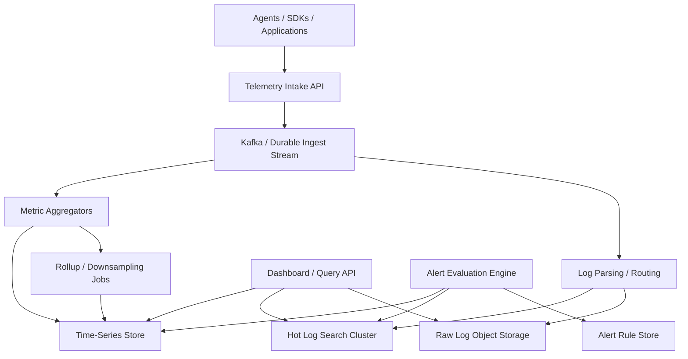
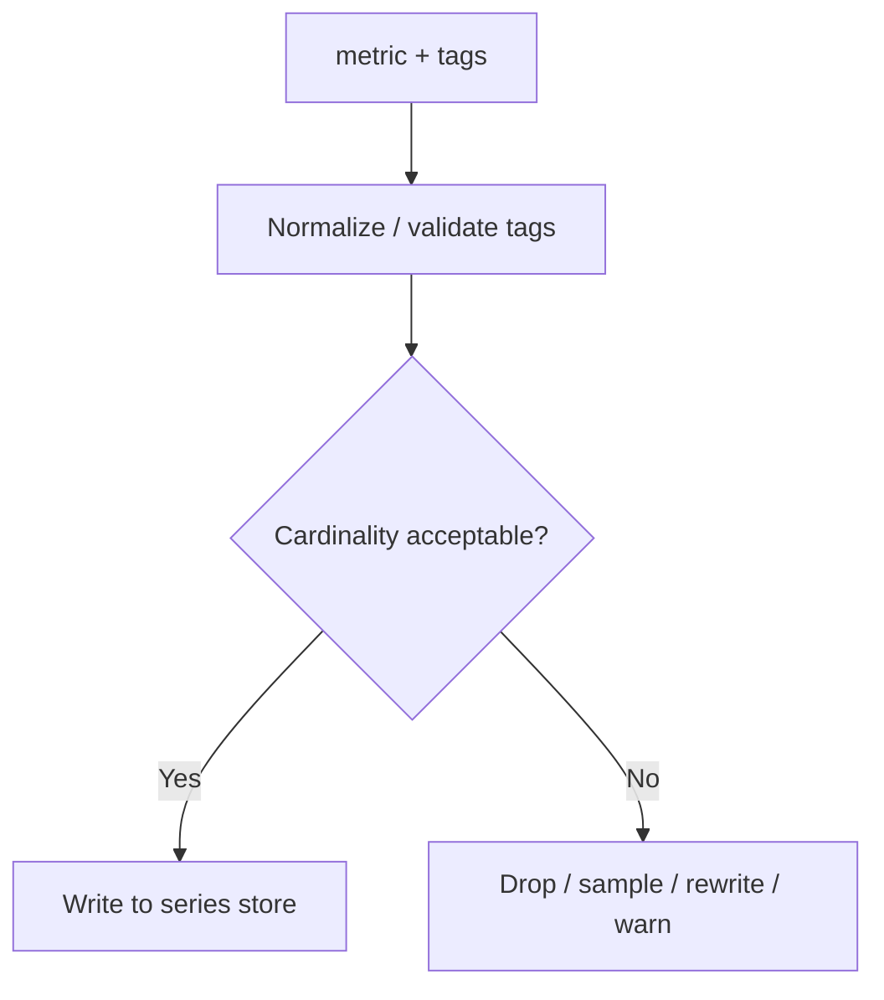

# System Design: Metrics & Logging System

> Design an observability platform that ingests 10M metric points per second on average, handles 10TB of raw logs per day, supports fast dashboards and log search, and evaluates alert rules continuously across high-cardinality telemetry.

---

## Concepts Covered

- **Concept 01** - Horizontal vs Vertical Scaling & Auto-scaling
- **Concept 02** - Load Balancing Deep Dive
- **Concept 07** - NoSQL Deep Dive
- **Concept 09** - Database Sharding & Partitioning
- **Concept 13** - Synchronous vs Asynchronous Communication Patterns
- **Concept 14** - Message Queues & Stream Processing
- **Concept 15** - Event-Driven Architecture & Event Sourcing
- **Concept 17** - CAP Theorem & PACELC
- **Concept 19** - Fault Tolerance Patterns
- **Concept 21** - Monitoring, Observability & SLOs/SLAs
- **Concept 24** - Search Systems

---

## Step 1: Requirements & Scope

### Functional Requirements

- **Ingest metrics from agents and applications**: Counters, gauges, histograms, and summaries should all be supported.
- **Ingest structured and unstructured logs**: Applications need to push log lines and metadata at high volume.
- **Query time-series metrics for dashboards**: Users need fast graphing, downsampling, and grouped aggregations.
- **Search logs by time, tags, and text**: Fast retrieval across recent logs is a core product feature.
- **Evaluate alert rules continuously**: Threshold, anomaly, or SLO-like alerts should run without blocking ingestion.
- **Support retention tiers**: Recent hot data should be fast, while older data can be cheaper and slower.
- **Handle high-cardinality tags sensibly**: Modern telemetry uses labels heavily, and the platform cannot fall over because one team emits too many tag combinations.

### Non-Functional Requirements

- **Availability target**: 99.99% for ingestion and query/control APIs.
- **Scale**: 10M metric points/sec average, 30M/sec peak, and 10TB raw logs/day.
- **Query latency**: Dashboards should usually render within seconds, with common short-range queries in under 1 second.
- **Alert freshness**: Most alerts should evaluate within tens of seconds of underlying signal changes.
- **Durability**: Accepted telemetry should be durable enough for the promised retention tier.
- **Consistency**: Eventual consistency is acceptable between ingestion and query surfaces within a short window.
- **Cost efficiency**: The system must avoid storing every point at full granularity forever.

### Out of Scope

- **Tracing system design**: Related, but a distinct telemetry type and query model.
- **ML anomaly-detection internals**: We will mention alerting, not build the complete analytics science stack.
- **Customer billing model**: Important for SaaS products, but not central to the storage/query architecture.
- **Incident-management and on-call tooling**: We focus on telemetry collection and alert evaluation, not human escalation workflows.
- **Long-term archival analytics across years of raw data**: We will mention retention tiers, not a complete data-lake product.

The central challenge is that observability platforms combine incompatible workloads: ultra-high write ingestion, low-latency recent queries, long-tail historical search, and continuous alert evaluation. One storage engine almost never handles all of that well by itself.

---

## Step 2: Back-of-Envelope Estimation

### Traffic Estimation

Assumptions:
- Metric ingestion average: `10,000,000 points/sec`
- Metric ingestion peak: `30,000,000 points/sec`
- Raw logs/day: `10 TB`
- Peak multiplier for log ingestion: `3x`

Metrics/day:
```text
10,000,000 points/sec x 86,400 sec/day = 864,000,000,000 points/day
```

If raw point payload averages `60 bytes` before compression:
```text
864,000,000,000 x 60 bytes = 51,840,000,000,000 bytes/day
= 51.84 TB/day raw metrics payload
```

This is why rollups and compression are mandatory. Nobody stores all raw points forever in the hot path.

Logs/day are given directly:
```text
10 TB/day raw logs
```

If average log event is 500 bytes:
```text
10 TB/day ~= 10,000,000,000,000 bytes/day
10,000,000,000,000 / 500 bytes = 20,000,000,000 log events/day
20,000,000,000 / 86,400 = 231,481 log events/sec average
Peak log events/sec ~= 694,444/sec at 3x
```

### Storage Estimation

Metrics hot storage:
Suppose we retain raw 10-second granularity for 7 days and compressed rollups afterward.

Raw 7-day metrics:
```text
51.84 TB/day x 7 = 362.88 TB raw
```

If compression and columnar encoding reduce this 5x:
```text
362.88 TB / 5 = 72.58 TB hot metrics footprint
```

Logs hot storage:
Suppose we keep 7 days of searchable hot logs:
```text
10 TB/day x 7 = 70 TB raw logs
```

If the searchable log index adds 30% overhead:
```text
70 TB x 1.3 = 91 TB hot searchable logs
```

With one replica for both metrics and logs:
```text
(72.58 + 91) TB x 2 = 327.16 TB
```

These are absolutely serious storage numbers, which is why observability platforms almost always use retention tiers and partial aggregation.

### Bandwidth Estimation

Metric ingestion bandwidth:
```text
30,000,000 points/sec x 60 bytes = 1,800,000,000 bytes/sec
= 1.68 GB/sec
```

Peak log ingestion bandwidth:
```text
694,444 events/sec x 500 bytes = 347,222,000 bytes/sec
= 331.1 MB/sec
```

Combined ingestion peaks are very large, which is why front-door intake services need to be cheap and horizontally scalable.

### Memory Estimation (for hot aggregation and query state)

Metrics aggregator hot state:
If we maintain 100M active time series in memory at 64 bytes each:
```text
100,000,000 x 64 bytes = 6,400,000,000 bytes
= 5.96 GB
```

Add query caches, alert-state windows, and tag dictionaries, and a regional cluster may easily want `50+ GB` RAM per major aggregation/query node.

### Summary Table

| Metric | Value |
|--------|-------|
| Average metric ingest | 10M points/sec |
| Peak metric ingest | 30M points/sec |
| Raw metric payload/day | ~51.84 TB |
| Raw logs/day | 10 TB |
| Average log event rate | ~231,481/sec |
| Peak combined ingest bandwidth | ~2.01 GB/sec |
| 7-day hot searchable footprint (replicated) | ~327 TB |

---

## Step 3: API Design

The platform exposes two very different surfaces: ingestion and query. Keeping them separate helps performance and operational clarity.

Cross-reference: **Concept 05 - API Design Patterns**.

### Ingest Metrics

```
POST /api/v1/metrics
```

**Parameters:**
| Parameter | Type | Required | Description |
|-----------|------|----------|-------------|
| series | array<object> | Yes | Batch of metric points |
| timestamp_ms | integer | Yes | Observation time |
| metric | string | Yes | Metric name |
| value | number | Yes | Metric value |
| tags | object | No | Key-value labels |
| type | string | Yes | gauge, counter, histogram |

**Response:**
```json
{
  "status": "accepted",
  "points_received": 1000
}
```

### Ingest Logs

```
POST /api/v1/logs
```

**Parameters:**
| Parameter | Type | Required | Description |
|-----------|------|----------|-------------|
| entries | array<object> | Yes | Batched log entries |

**Response:**
```json
{
  "status": "accepted",
  "entries_received": 500
}
```

### Query Metrics

```
GET /api/v1/query/metrics?expr=avg:cpu.usage{service:web}&from=...&to=...
```

**Parameters:**
| Parameter | Type | Required | Description |
|-----------|------|----------|-------------|
| expr | string | Yes | Metric expression |
| from | integer | Yes | Start time |
| to | integer | Yes | End time |
| step | integer | No | Downsampling interval |

**Response:**
```json
{
  "series": [
    {
      "metric": "cpu.usage",
      "points": [[1763966400, 0.82], [1763966460, 0.79]]
    }
  ]
}
```

### Search Logs

```
GET /api/v1/query/logs?q=service:web+status:error&from=...&to=...
```

**Response:**
```json
{
  "results": [
    {
      "timestamp": 1763966400,
      "message": "database timeout",
      "tags": {"service": "web", "level": "error"}
    }
  ],
  "next_cursor": "abc123"
}
```

### Create Alert Rule

```
POST /api/v1/alerts
```

**Parameters:**
| Parameter | Type | Required | Description |
|-----------|------|----------|-------------|
| name | string | Yes | Alert name |
| query | string | Yes | Metric or log query |
| condition | string | Yes | Threshold or rule |
| window_sec | integer | Yes | Evaluation window |

**Response:**
```json
{
  "alert_id": "a_88231",
  "status": "active"
}
```

---

## Step 4: Data Model

### Database Choice

We will not force metrics and logs into one storage engine.

- **Metrics**: write-optimized time-series store with columnar compression and rollups
- **Logs**: raw log storage in cheap object/blob storage plus a searchable recent index
- **Alert state**: smaller durable store for rule definitions and evaluation checkpoints
- **Ingestion stream**: Kafka or similar bus for decoupling intake from storage

Why? Because the access patterns are different:
- metrics want numerical aggregation over time
- logs want time-filtered search with text and tag filters

This is a classic case of specialized storage driven by **Concept 24 - Search Systems**, **Concept 07 - NoSQL Deep Dive**, and **Concept 09 - Database Sharding & Partitioning**.

### Schema Design

```text
Metric point logical model:
├── metric_name         STRING
├── timestamp           LONG
├── value               DOUBLE
├── tags                MAP<STRING, STRING>
└── series_id           HASH(metric_name + normalized_tags)
```

```text
Log entry logical model:
├── timestamp           LONG
├── stream_id           STRING
├── message             TEXT
├── tags                MAP<STRING, STRING>
├── level               STRING
└── source_ref          OBJECT KEY / SEGMENT REF
```

```text
Alert rule:
├── alert_id            UUID
├── query               TEXT
├── condition           TEXT
├── window_sec          INTEGER
├── eval_interval_sec   INTEGER
└── state               OPEN/CLOSED/OK
```

### Access Patterns

- **Append metric points** by `series_id` and time bucket
- **Run rollups** over time windows
- **Search logs** by time range + tags + text
- **Evaluate alerts** over recent metric aggregates or log matches
- **Move older data to cheaper tiers** while preserving some queryability

Data model clarity matters because observability platforms get crushed by accidental cardinality explosions and retention assumptions.

---

## Step 5: High-Level Architecture

### Mermaid Diagram



### Architecture Walkthrough

Everything starts at telemetry intake. Agents, sidecars, and application SDKs push batches of metrics and logs into a horizontally scalable intake API. The intake service should do as little work as possible on the critical path: validate basic payload structure, apply authentication and quotas, and append events into a durable ingest stream. This is a classic use of **Concept 13 - Synchronous vs Asynchronous Communication Patterns**. Ingestion should not block on full indexing or aggregation.

From the stream, the pipeline forks. Metric aggregators consume metric events, normalize tags, compute or batch series identifiers, and write points into the time-series store. They may also pre-aggregate some high-frequency metrics into rollup buckets. Rollup jobs later downsample older data so the platform does not keep raw second-level points forever in the hottest tier.

Log processing follows a different path. Log parsing and routing workers enrich records, split out structured fields, and write raw entries into object storage. For recent logs, they also index searchable fields into a hot search cluster. This split is important. Raw logs are durable and cheap in object storage. Fast recent search comes from the hot index. The system does not need every log line stored forever in the most expensive searchable tier.

The query API sits above both data planes. When a dashboard requests metrics, the API queries the time-series store, which is optimized for range aggregation and downsampling. When a user searches logs, the API hits the hot log search cluster for recent data and may fall back to slower object-backed retrieval for older data outside the hot window. This is a good example of tiered storage shaping query behavior.

Alert evaluation is its own subsystem. It reads rule definitions from the alert-rule store, executes metric or log queries on a schedule, and maintains alert state transitions. This must not run synchronously inside the main ingestion path or the dashboard query path. Alerting is continuous background computation over recent telemetry windows.

High-cardinality tags are one of the major operational pain points. If users attach unbounded tags like `user_id` to metrics, the number of unique series can explode. The platform needs ingestion-time controls, tag normalization, and maybe cardinality limits or sampling for problematic tenants. This is not optional. It is one of the biggest cost and stability levers in observability systems.

Retention tiering is another first-class concern. Recent metrics and logs are queried frequently and should be fast. Older telemetry can be downsampled, compressed further, or moved to colder storage. That means the architecture is not just one cluster. It is a lifecycle pipeline: ingest, store hot, aggregate, tier, and optionally retrieve from colder layers.

Failure handling is easier once the planes are separated. If the hot log search cluster is degraded, raw logs are still landing durably in object storage. If rollup jobs lag, recent raw metrics still exist, but longer-range queries may become more expensive. If alert evaluation falls behind, dashboards can still work. This separation prevents one telemetry use case from taking down all the others.

The architecture works because it respects the reality that observability workloads are heterogeneous. Metrics, logs, queries, alerts, and retention do not want the same data structures, and pretending they do is usually how costs and latency get out of control.

That respect for workload differences is also what keeps the platform economically sane. Once each plane is allowed to optimize for its own retention, indexing, and query patterns, teams can deliver useful observability without forcing every byte of telemetry into the most expensive possible path.

It is a specialization strategy that improves both user experience and cost discipline at the same time.

---

## Step 6: Deep Dives

### Deep Dive 1: High Cardinality and Why It Hurts

Metrics systems love dimensional labels until the label set explodes. A metric like `request.count` with tags `service`, `region`, and `status_code` is manageable. Add `user_id` and you may create millions of mostly useless series.

### Mermaid Diagram



### Diagram Walkthrough

The diagram shows an ingestion-time safeguard. Incoming metric points are normalized, then checked against cardinality policies. If the resulting series space is acceptable, the point is written normally. If not, the platform may sample, reject, or rewrite it according to policy.

This is not just a nice-to-have. Without cardinality control, the time-series store and aggregators can blow up in both cost and performance. That is why the mitigation decision belongs in the architecture discussion.

Cross-reference: **Concept 12 - Data Modeling for Scale** and **Concept 21 - Monitoring, Observability & SLOs/SLAs**.

### Deep Dive 2: Rollups and Retention

Keeping 1-second metric granularity forever is usually wasteful. Most dashboards looking at 30 days of history do not need every second. So observability systems usually:
- keep raw recent points hot
- store 1-minute rollups for medium horizons
- store coarser rollups for long horizons

This makes long-range queries cheap while preserving recent debugging fidelity. The cost tradeoff is obvious and worth explaining because it shapes both product behavior and infrastructure cost.

### Deep Dive 3: Logs Need Both Raw Storage and Search Indexes

If we store only raw logs in blob storage, search is slow and painful. If we index every log forever in a hot search cluster, cost explodes. The usual answer is hot searchable recent logs plus colder raw archives.

Recent logs answer incident-response questions fast. Older logs remain retrievable, but slower. This is a pragmatic production compromise, not a theoretical weakness.

### Deep Dive 4: Alert Evaluation as a Separate Compute Plane

Alerting seems like "just run some queries," but at scale it is its own product. Thousands or millions of alert rules evaluating every minute can generate heavy read load. The alert engine therefore needs:
- separate scheduling and worker capacity
- cached recent aggregates when possible
- stateful dedupe so flapping does not page endlessly

Again, this is not something to bolt into the dashboard API thread pool.

---

## Step 7: Bottlenecks & Scaling

### Identifying Bottlenecks

At `10x` scale, metric-series cardinality and hot-ingest partition skew become the first problems. One noisy tenant or one badly tagged metric can dominate memory and write paths.

For logs, the biggest cost is usually the hot search index, not raw storage. Indexing and keeping recent logs searchable is expensive, especially if every field becomes searchable by default.

At `100x`, alert evaluation can become a platform-scale read workload of its own. A million alert rules scanning recent windows can rival dashboard traffic easily.

### Scaling Solutions

| Bottleneck | Solution | Impact | New Ceiling | Cross-reference |
|------------|----------|--------|-------------|-----------------|
| High-cardinality metrics | Cardinality limits, series caps, and tag governance | Protects TSDB and cost model | Better cluster stability | Concept 21 |
| Hot log indexing cost | Shorter hot-index retention plus raw archival | Reduces expensive search footprint | Cheaper scalable logs | Concept 24 |
| Alert-read amplification | Precompute aggregates and isolate alert workers | Lowers query pressure on hot stores | More predictable alert latency | Concept 14 |
| Ingest partition skew | Shard by series/log stream and autoscale intake | Better write distribution | Higher ingestion throughput | Concept 09 |

### Failure Scenarios

- **Intake API degradation**: Agents may buffer and retry, but prolonged outages risk telemetry gaps.
- **Hot log index outage**: Recent log search degrades; raw log durability can still remain intact in object storage.
- **Rollup lag**: Long-range metrics queries get slower or less complete, while recent raw data remains.
- **Alert engine lag**: Telemetry ingestion continues, but alerting becomes delayed.
- **Cardinality explosion incident**: A bad deploy can flood the system with new series and hurt cluster stability quickly.

Observability platforms need strong guardrails because the most damaging traffic is often generated accidentally by their own customers.

---

## Step 8: Monitoring & Alerting

### Key Metrics to Track

Business metrics:
- Metrics points ingested/sec
- Log events ingested/sec
- Dashboard query latency
- Alert evaluation delay

Infrastructure metrics:
- Series cardinality growth
- Ingest queue lag
- TSDB write and query latency
- Log-index ingestion latency
- Object-storage write failures
- Alert worker backlog

### SLOs

- **Ingestion availability**: 99.99%
- **Common dashboard latency**: 99% under 1 second for recent windows
- **Recent log search latency**: 99% under a few seconds
- **Alert freshness**: critical alerts evaluated within configured windows
- **Telemetry durability**: accepted telemetry retained according to promised hot/cold tiers

### Alerting Rules

- **CRITICAL**: ingestion lag exceeds threshold
- **WARNING**: cardinality growth spikes unusually for one tenant or metric family
- **CRITICAL**: TSDB write failures > 1%
- **WARNING**: hot log-index retention running out of capacity
- **CRITICAL**: alert evaluation lag > configured SLA
- **CRITICAL**: object-storage write errors or backlog above threshold

Cross-reference: **Concept 21 - Monitoring, Observability & SLOs/SLAs**.

One important operational distinction is between telemetry loss and telemetry delay. Some customers care deeply that every metric point eventually arrives, while others care more that dashboards remain near real time even if a tiny fraction of points are sampled or dropped during incidents. The platform should be explicit about which products and retention tiers optimize for which behavior.

Another practical challenge is multi-tenancy fairness. One tenant with a runaway debug log configuration or a badly tagged metric emitter can create cost and stability issues for everyone sharing the ingestion path. Good systems therefore expose tenant-level quotas, noisy-neighbor controls, and clear usage dashboards so operations teams can intervene before the whole platform degrades.

Query planning also matters more than many simple designs admit. A dashboard asking for a 6-hour graph at 10-second resolution is a very different workload from a 30-day grouped percentile view across high-cardinality tags. The query layer should choose downsampled data intelligently, reject or rewrite pathological queries when needed, and surface query-cost clues to users rather than pretending every aggregation is equally cheap.

Log retention policy is similarly product-shaping. Teams often say they want "all logs forever searchable," but few are willing to pay for that. Observability platforms work better when retention tiers are explicit, searchable windows are bounded, and older data retrieval is still possible but slower. That honesty makes both architecture and customer expectations healthier.

Finally, alert quality is not only about evaluation speed. Duplicate alerts, noisy flapping rules, and stale mute states can make a technically functioning platform operationally useless. Mature systems therefore treat alert-state deduplication, cooldowns, and rule-quality tooling as part of the observability product, not as optional extras.

Another operational nuance is sampling strategy. Metric sampling, log sampling, and tail-based retention all reduce cost, but they do so differently and with different failure modes. Teams need to understand what they are giving up. Sampling may be harmless for ultra-high-volume debug logs and disastrous for rare security events or low-frequency SLO signals.

Schema hygiene for logs is similarly important. Free-form JSON is easy to emit and painful to query if field names drift wildly across services. Good observability systems often nudge teams toward normalized field conventions, reserved tag names, and ingestion-time coercion so that cross-service querying remains possible without constant field-by-field translation.

Finally, query fairness matters. One expensive wildcard log query or one dashboard asking for pathological cardinality breakdowns can consume disproportionate shared capacity. Mature platforms expose query-cost hints, cache common dashboard patterns, and sometimes sandbox or throttle pathological query shapes to protect everyone else using the system.

Another important practice is to separate troubleshooting ergonomics from raw storage fidelity. Engineers want rich context during incidents: nearby log lines, tag correlations, service maps, and prebuilt drill-down links. Those product features often rely on lightweight secondary metadata or query caches rather than on storing everything at the most expensive granularity forever. Good observability products invest in these shortcuts because they reduce operator toil without always increasing raw ingest cost.

It is also worth calling out that observability pipelines often become business-critical during outages in other systems. When that happens, telemetry bursts, cardinality spikes, and query demand all rise at the same time. A well-designed platform anticipates this paradox and keeps protective mechanisms around ingest, indexing, and query fairness so the system remains useful when its users need it most.

---

## Summary

### Key Design Decisions

1. **Separate metrics and logs into different storage paths** because their query and retention patterns are fundamentally different.
2. **Use a durable ingest stream** so write-heavy intake stays decoupled from downstream indexing and aggregation.
3. **Adopt retention tiers and rollups** because raw high-frequency telemetry is too expensive to keep hot forever.
4. **Treat alerting as its own compute plane** because continuous evaluation is a serious workload.
5. **Enforce cardinality controls early** because uncontrolled tags can destabilize the whole platform.

### Top Tradeoffs

1. **Query flexibility versus cost**: indexing everything forever is fast but ruinously expensive.
2. **Raw fidelity versus retention**: keeping all raw telemetry improves debugging but costs huge amounts of storage and compute.
3. **Low-latency dashboards versus ingest isolation**: blending read and write workloads too tightly makes both worse.

### Alternative Approaches

- Smaller teams can start with managed Prometheus-style metrics plus a simpler log stack.
- Log-centric organizations may prioritize searchable logs more heavily than high-frequency metrics.
- Deep tracing products would introduce a third major data plane with different storage and query behavior.

The core lesson is that observability platforms succeed by specializing aggressively. Metrics, logs, alerts, and retention each want different optimizations. The architecture should reflect that from the beginning instead of hoping one generic telemetry backend will carry everything elegantly.

That specialization is not a weakness. It is what lets the platform stay useful during the exact moments it matters most, when other systems are failing and engineers are querying telemetry urgently. A design that accepts heterogeneous workloads explicitly is far more likely to stay readable, affordable, and trustworthy over time.

It also creates healthier expectations with users. Teams can understand why recent logs are fast, why old metrics are downsampled, and why alerting has its own state model. Observability products work best when their performance and retention behavior are explainable rather than mysterious.

That specialization is not a sign of architectural messiness. It is usually a sign that the platform is being honest about workload differences. Metrics want compact numeric storage, fast range scans, and aggressive downsampling. Logs want cheap append, selective indexing, and tiered retrieval. Alerting wants repeated computation over recent windows with predictable lag bounds. Trying to collapse those workloads into one storage model usually produces a platform that is mediocre at all of them and expensive to operate. Splitting them deliberately gives teams room to optimize each plane for its real cost drivers.

Cost is also part of the product, not an unfortunate side effect. Observability systems consume whatever budget operators fail to constrain. If the platform makes it easy to emit unlimited tags, store every raw event forever, and run arbitrary wildcard queries across huge windows, customers will eventually discover the bill with surprise and resentment. Strong systems surface the economics early. They show high-cardinality growth, identify noisy tenants, explain hot versus cold retention, and make query cost legible enough that teams can change behavior before the platform becomes adversarial.

Another important lesson is that ingestion durability and query freshness are related but not identical promises. Some teams need near-perfect intake durability even if dashboards trail slightly during incidents. Other teams care much more that recent data appears quickly, even if a small amount of telemetry is sampled or buffered. The platform should be explicit about which guarantees apply to which path. That clarity helps teams choose the right integration pattern and prevents operators from chasing the wrong objective during overload. It is better to say "logs are durable but indexing is delayed" than to pretend the entire system has one universal health state.

User experience matters here too. A platform can be technically correct and still frustrating if queries are unpredictable, alerts flap constantly, or schema conventions drift until cross-service search becomes guesswork. Mature observability products therefore invest in query planners, log field normalization, alert deduplication, mute semantics, and dashboard caching. Those features may feel secondary compared with raw ingestion throughput, but they are what make the system usable day to day. Engineers judge observability platforms by whether they can answer real incident questions quickly, not by how elegant the storage engine looked on paper.

Finally, observability platforms need strong guardrails against accidental self-harm. The most expensive and destabilizing traffic often comes from customers doing ordinary things badly: shipping unbounded trace IDs as metric tags, turning on verbose debug logs across a fleet, or creating dashboard queries that explode cardinality. The architecture should expect that reality and defend itself with quotas, shaping, safe defaults, and clear operator tooling. A platform that only works for perfectly disciplined users is not actually production ready. A platform that remains useful under imperfect user behavior is.

That is also why pricing transparency and product honesty matter so much here. If users can see what high-cardinality labels cost, what hot retention includes, and why some queries are rewritten or rejected, the platform feels like a partner instead of an adversary. Good observability systems do not merely store telemetry. They teach teams how to produce and consume telemetry responsibly enough that the platform stays both affordable and useful as adoption grows.
