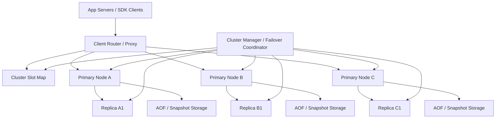
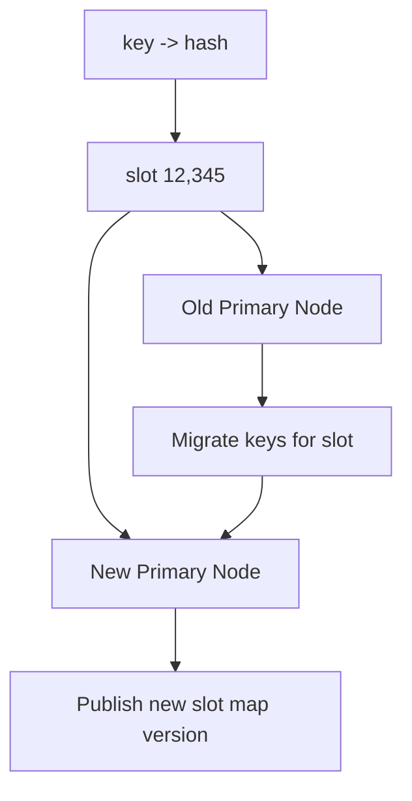

# System Design: Distributed Cache (Redis-Like)

> Design a Redis-like distributed cache that serves 10M operations per second on average, 30M peak, stores a 20TB logical dataset, supports replication and failover, and offers optional persistence for faster recovery.

---

## Concepts Covered

- **Concept 01** - Horizontal vs Vertical Scaling & Auto-scaling
- **Concept 02** - Load Balancing Deep Dive
- **Concept 08** - Database Replication
- **Concept 10** - Caching Strategies
- **Concept 11** - Consistent Hashing
- **Concept 17** - CAP Theorem & PACELC
- **Concept 18** - Distributed Consensus Simplified
- **Concept 19** - Fault Tolerance Patterns
- **Concept 20** - Idempotency, Deduplication & Exactly-Once Semantics
- **Concept 21** - Monitoring, Observability & SLOs/SLAs

---

## Step 1: Requirements & Scope

### Functional Requirements

- **Store and retrieve key-value entries with low latency**: This is the core read and write path of the system.
- **Scale horizontally across many nodes**: A single in-memory node is not enough for large datasets or high throughput.
- **Support replication for high availability**: If a node fails, the cache should continue serving data where possible.
- **Support eviction policies**: Memory is finite, so the system must decide what to evict under pressure.
- **Optionally persist data to disk**: A Redis-like system often offers persistence so restart behavior is better than total cold loss.
- **Expose pub/sub or lightweight messaging primitives**: Common cache systems also act as coordination primitives for applications.
- **Allow rebalancing when nodes are added or removed**: The cluster cannot require a full rehash of the entire keyspace on every topology change.

### Non-Functional Requirements

- **Availability target**: 99.99% for cache access and failover behavior.
- **Latency target**: p99 under 2ms for in-memory reads inside one region.
- **Scale**: 10M ops/sec average and 30M ops/sec peak.
- **Dataset size**: 20TB logical cached data across the cluster.
- **Consistency**: Best-effort or primary-replica semantics are acceptable for most cache workloads, but the system should define them clearly.
- **Recovery behavior**: Node failures should not cause catastrophic full-cache cold starts if persistence or replicas exist.
- **Operational simplicity**: Rebalancing, failover, and hotspot handling should be manageable without manual heroics.

### Out of Scope

- **Full relational query capabilities**: This is a cache, not a general-purpose SQL database.
- **Rich secondary indexing**: We may mention data structures, but not full search or analytics queries.
- **Global multi-region active-active replication**: We focus on a regional cluster design.
- **Enterprise auth and ACL design**: Important in real products, but not the core distributed-cache problem.
- **Long-term durable database replacement semantics**: A cache may persist, but that does not make it a primary system of record for all workloads.

The real engineering problem is not storing bytes in RAM. It is partitioning the keyspace, surviving failures, and making tradeoffs between speed, consistency, and recoverability explicit.

---

## Step 2: Back-of-Envelope Estimation

### Traffic Estimation

Assumptions:
- Average throughput: `10,000,000 ops/sec`
- Peak throughput: `30,000,000 ops/sec`
- Read/write ratio: `4:1`

Read QPS:
```text
10,000,000 x 80% = 8,000,000 reads/sec average
Peak reads/sec = 30,000,000 x 80% = 24,000,000/sec
```

Write QPS:
```text
10,000,000 x 20% = 2,000,000 writes/sec average
Peak writes/sec = 30,000,000 x 20% = 6,000,000/sec
```

This is an enormous operations profile, which is exactly why the cluster must partition aggressively and avoid any central coordinator on the hot path.

### Storage Estimation

Assume:
- average key size: `50 bytes`
- average value size: `1 KB`
- metadata and allocator overhead: `150 bytes`

Per entry:
```text
key          50 bytes
value      1024 bytes
metadata    150 bytes
----------------------
~1,224 bytes/entry
```

For a 20TB logical dataset:
```text
20 TB = 20 x 1024^4 bytes = 21,990,232,555,520 bytes
21,990,232,555,520 / 1,224 ~= 17.96 billion keys
```

With one replica:
```text
20 TB primary + 20 TB replica = 40 TB effective memory footprint
```

Add 25% headroom for fragmentation, failover, and rebalancing:
```text
40 TB x 1.25 = 50 TB practical cluster memory requirement
```

If each node safely contributes `256 GB` usable cache memory:
```text
50 TB / 256 GB ~= 200 nodes
```

That is a believable cluster size for a serious in-memory platform.

### Bandwidth Estimation

Assume each op transfers about `1.2 KB` on average.

Peak bandwidth:
```text
30,000,000 ops/sec x 1.2 KB = 36,000,000 KB/sec
= 34.33 GB/sec aggregate cluster traffic
```

Replication adds more internal traffic:
```text
6,000,000 peak writes/sec x 1.2 KB = 7,200,000 KB/sec
= 6.87 GB/sec write replication traffic
```

This is why cache clusters are often network-sensitive systems, not just memory-sensitive systems.

### Memory Estimation (for control state)

Cluster metadata:
Suppose 200 nodes, 16,384 hash slots, and routing metadata of roughly `2 KB` per slot plus node info.

```text
16,384 x 2 KB = 32,768 KB
= 32 MB
```

Control-plane metadata is tiny. The challenge is data placement and hot-key behavior, not configuration size.

### Summary Table

| Metric | Value |
|--------|-------|
| Average ops/sec | 10M |
| Peak ops/sec | 30M |
| Peak reads/sec | 24M |
| Peak writes/sec | 6M |
| Logical dataset | 20 TB |
| Practical replicated memory target | ~50 TB |
| Approximate node count at 256 GB/node | ~200 |
| Peak aggregate cluster traffic | ~34.33 GB/sec |

---

## Step 3: API Design

Most cache systems expose a command protocol rather than JSON REST. I will still present the logical API shape in a readable form.

Cross-reference: **Concept 05 - API Design Patterns**.

### Get Key

```
GET /api/v1/cache/{key}
```

**Parameters:**
| Parameter | Type | Required | Description |
|-----------|------|----------|-------------|
| key | string | Yes | Cache key |

**Response:**
```json
{
  "hit": true,
  "value": "serialized payload",
  "ttl_sec": 120
}
```

### Set Key

```
PUT /api/v1/cache/{key}
```

**Parameters:**
| Parameter | Type | Required | Description |
|-----------|------|----------|-------------|
| value | string/blob | Yes | Serialized value |
| ttl_sec | integer | No | Optional expiration |
| nx | boolean | No | Only set if absent |

**Response:**
```json
{
  "status": "stored"
}
```

### Delete Key

```
DELETE /api/v1/cache/{key}
```

**Response:**
```json
{
  "status": "deleted"
}
```

### Publish Event

```
POST /api/v1/pubsub/{channel}
```

**Parameters:**
| Parameter | Type | Required | Description |
|-----------|------|----------|-------------|
| payload | string | Yes | Message body |

**Response:**
```json
{
  "subscribers_notified": 42
}
```

The real system would use a binary or RESP-style protocol, but these endpoints capture the logical surface.

---

## Step 4: Data Model

### Database Choice

The cache itself is the primary data structure: in-memory key-value partitions distributed across many nodes. Around it we need:
- **slot map / cluster metadata store**
- **replication topology**
- **optional persistence logs or snapshots**

This is where **Concept 11 - Consistent Hashing** and **Concept 08 - Database Replication** become central.

### Schema Design

Logical entry:
```text
Cache entry
├── key                binary/string
├── value              bytes
├── ttl                optional expiry
├── version            optional CAS/version
└── metadata           eviction / last access / size
```

Cluster metadata:
```text
Slot map
├── slot_id            0..16383
├── primary_node_id    owner of slot
├── replica_node_ids   failover replicas
└── epoch/version      topology version
```

Persistence metadata:
```text
AOF / snapshot state
├── node_id
├── last_snapshot_ts
├── last_aof_offset
└── recovery_status
```

### Access Patterns

- **Point get/set by key**
- **TTL expiration**
- **Replication from primary to replica**
- **Slot migration during rebalance**
- **Failover from replica to primary**

The cluster is optimized for direct key access, not scans or analytics.

---

## Step 5: High-Level Architecture

### Mermaid Diagram



### Architecture Walkthrough

Start with the client side. An application server or SDK wants to read or write a cache key. It either contains smart client routing logic or talks to a lightweight proxy. In either case, the client first needs the cluster slot map. The slot map tells it which primary node currently owns the key's hash slot.

We often use a fixed number of slots, such as 16,384, and hash each key into one slot. That is easier operationally than hashing directly to node IDs because slots can move independently during rebalancing. This is a practical adaptation of the ideas in **Concept 11 - Consistent Hashing**: minimize movement and make node changes manageable.

Once the client knows the slot owner, it sends the request directly to the primary node responsible for that slot. Reads may sometimes be served from replicas, but the safest default is that writes go to the primary for each slot. The primary stores the key in memory, updates its internal metadata, and then replicates the write to one or more replicas asynchronously or semi-synchronously depending on durability policy.

Replication serves two purposes. First, it gives us failover. If Primary Node A dies, Replica A1 can be promoted. Second, it gives optional read scaling for workloads that tolerate replica lag. This is where **Concept 08 - Database Replication** shows up in a cache context. Replication is not only for databases of record.

Optional persistence is another important layer. A Redis-like system often offers append-only files, periodic snapshots, or both. The point is not to make the cache a full replacement for a database. The point is to reduce cold-start pain and improve restart recovery. If a node restarts and can reload most recent state from AOF or a snapshot, cluster recovery is much gentler.

The cluster manager watches node health and topology. It tracks which replicas are healthy, which slot map version is current, and when failover should occur. This is one of the few places where consensus-like coordination matters. We do not want two nodes both believing they are the primary for the same slot. That would create split-brain inconsistencies immediately.

Now consider rebalancing. When we add nodes, the manager assigns some slots from existing primaries to new nodes. Slot migration happens incrementally: a slot enters a moving state, keys are copied, writes are redirected or mirrored temporarily, and once migration completes the slot map version updates. The entire cluster should not freeze or rehash everything globally just because we added one machine.

Hot-key behavior is another major architectural concern. Even if the overall slot distribution is balanced, one giant hot key can overload a single primary. That is why real systems often need local application-level caching, read replicas, or special handling for pathological hot keys. Slot-level balance is necessary but not sufficient.

Failure handling has to be explicit. If a primary fails, the manager promotes a healthy replica, updates the slot map, and clients refresh their routing. There may be a short error window, but the goal is rapid convergence rather than perfect zero-cost failover. If persistence exists, the promoted replica or restarted node also has a better chance of recovering warm state quickly.

Pub/sub is a side capability that many cache systems offer. It fits naturally because clients already maintain connections to cache nodes. But it is important to understand what it is and is not. Pub/sub is usually ephemeral fanout to connected subscribers, not durable messaging with replay. That distinction keeps the system honest.

This architecture works because it cleanly separates the hot data path from the control path. The data path is just route-to-primary, serve or mutate in memory, replicate. The control path handles slot ownership, topology changes, failover, and persistence. Mixing those two mentally is how cache clusters start to feel magical and harder to debug than they should.

---

## Step 6: Deep Dives

### Deep Dive 1: Slot Mapping and Rebalancing

Consistent hashing gets the headlines, but operational clusters often use a slot abstraction because it makes rebalancing easier. Instead of saying "key hashes directly to node 7," we say "key hashes to slot 12,345, and slot 12,345 currently belongs to node 7."

### Mermaid Diagram



### Diagram Walkthrough

The key hashes to a slot, not a node. During migration, the old primary and new primary cooperate to move just the keys in that slot. Once the copy and redirect phase are complete, the cluster publishes a new slot-map version.

This is operationally valuable because only a bounded fraction of keys move when the topology changes. That is the practical cluster-management benefit of slot-based partitioning.

Cross-reference: **Concept 11 - Consistent Hashing**.

### Deep Dive 2: Replication, Failover, and Split-Brain Risk

Replication gives us recovery options, but it also creates decision problems. If a primary disappears, how do we know a replica should take over? And how do we ensure only one replica becomes primary?

This is where a small control-plane consensus or quorum mechanism matters. We do not need heavyweight consensus for every cache write, but we do need a trustworthy failover decision path. The cache cluster is a great example of **Concept 18 - Distributed Consensus Simplified** used sparingly where it actually matters.

### Deep Dive 3: Eviction Policy and Memory Pressure

Caches are finite by definition. Under pressure, the system must decide what to remove. LRU or LFU are common defaults, but the best choice depends on workload shape.

Important operational details:
- eviction should happen before the node falls into OOM chaos
- TTL-only eviction is rarely enough
- hot keys and large objects can distort normal policies

This is a direct application of **Concept 10 - Caching Strategies**.

### Deep Dive 4: Persistence Is for Recovery, Not for Becoming a Full Database

It is easy to oversell persistence and accidentally turn a cache into a pseudo-database. The right mental model is that AOF and snapshots help restart recovery and operational resilience. They do not magically provide the same correctness guarantees or operational ergonomics as a database of record.

That clarity matters because teams often keep too much business-critical state only in a "persistent cache" and then learn the hard way that the operational assumptions are different.

---

## Step 7: Bottlenecks & Scaling

### Identifying Bottlenecks

At `10x` scale, network bandwidth and hot-key concentration become more important than raw memory. Thirty million operations per second with replication is already a heavy east-west traffic problem.

Rebalancing can also become disruptive if not carefully controlled. Moving too many slots at once creates write amplification, cache misses, and tail latency spikes.

At `100x`, control-plane convergence matters more. Topology changes, failovers, and slot-map propagation become frequent enough that clients and routers need efficient refresh behavior.

### Scaling Solutions

| Bottleneck | Solution | Impact | New Ceiling | Cross-reference |
|------------|----------|--------|-------------|-----------------|
| Hot-key overload | Local app caches, replica reads, or key-splitting where valid | Protects one primary from extreme skew | Better hotspot tolerance | Concept 10 |
| Network replication pressure | Partition by slot and optimize replication paths | Lowers write amplification | Higher sustainable write throughput | Concept 08 |
| Rebalance disruption | Move slots gradually with explicit throttles | Reduces user-visible latency during scaling | Safer cluster growth | Concept 11 |
| Failover ambiguity | Quorum-based cluster manager and fencing | Reduces split-brain risk | Safer HA behavior | Concept 18 |

### Failure Scenarios

- **Primary node failure**: Replica promotion occurs, slot map updates, clients retry on new owner.
- **Replica lag**: Recent writes may be missing on a newly promoted node if replication was asynchronous.
- **Manager/control-plane issue**: Data path may continue temporarily, but failover or rebalance becomes unsafe.
- **Persistence corruption or lag**: Restart recovery slows or loses recent data beyond replication guarantees.
- **Network partition**: The system must choose availability versus strict ownership carefully to avoid dual primaries.

Distributed caches are fast partly because they avoid paying for perfect consistency on every operation. That means the failure semantics must be explicit and well understood.

---

## Step 8: Monitoring & Alerting

### Key Metrics to Track

Business metrics:
- Cache hit ratio by client or service
- Eviction rate
- Pub/sub fanout volume
- Warm-restart recovery time

Infrastructure metrics:
- Ops/sec by node and slot
- Memory usage and fragmentation
- Replication lag
- Network throughput
- Failover events and duration
- Persistence snapshot/AOF latency

### SLOs

- **Cache availability**: 99.99%
- **Read latency**: 99% under 2ms in-region
- **Write latency**: 99% under a few milliseconds with replication policy applied
- **Failover recovery**: node loss recovered within bounded seconds
- **Recovery quality**: acceptable bounded data loss only according to configured replication/persistence guarantees

### Alerting Rules

- **CRITICAL**: one or more primaries unavailable without healthy replicas
- **WARNING**: replication lag exceeds threshold
- **CRITICAL**: memory usage or fragmentation above safe limit
- **WARNING**: eviction rate spikes above expected baseline
- **CRITICAL**: failover flapping or repeated leadership changes
- **WARNING**: slot rebalancing duration exceeds plan

Cross-reference: **Concept 21 - Monitoring, Observability & SLOs/SLAs**.

One additional nuance is that not every cached key deserves the same durability or replication treatment. Some workloads cache purely derivable data and are perfectly happy with occasional loss on failover. Others, such as distributed locks, session state, or coordination primitives, need tighter write acknowledgment and more careful failover semantics. A Redis-like system becomes much easier to operate when these usage classes are explicit instead of hidden behind one generic "cache" label.

Allocator behavior and fragmentation also deserve real attention. In-memory systems do not just store user values. They store allocator metadata, object headers, free-space gaps, and replication buffers. Clusters that look safe at 70% logical occupancy can still behave badly if fragmentation rises or large objects churn frequently. That is one reason operators often keep more headroom in cache clusters than simple payload math suggests.

Client behavior is another major variable. Smart clients that understand slot maps can reduce proxy overhead and scale elegantly, but they must refresh topology safely during rebalances and failovers. Dumb clients behind proxies are operationally simpler for some teams, but they centralize more traffic and can create new bottlenecks. The right answer depends on how much client sophistication the organization can realistically support.

It is also important to distinguish cache-aside application usage from primary-state usage such as locks, counters, or ephemeral coordination. Those workloads stress different commands, TTL patterns, and durability expectations. A single cluster can serve several of them, but operators should watch them separately because a pub/sub spike or a lock storm can degrade the cluster in different ways than a normal key-value read workload.

Finally, warm restart behavior can be almost as important as steady-state latency. Many cache incidents are not caused by one node disappearing forever, but by a node rebooting cold and causing a sudden miss storm against downstream databases. Persistence, replication, and staged traffic ramp-up are all valuable mainly because they make recovery safer, not because they turn the cache into a perfect durable store.

Another practical issue is command mix. A cache cluster serving mostly point reads behaves very differently from one serving large hash mutations, sorted-set operations, or blocking coordination primitives. Operators should understand which workloads dominate because CPU cost, memory overhead, and replication pressure vary widely by command family even when total ops/sec looks similar.

Expiration behavior deserves its own attention too. TTL-based caches can create synchronized expiration storms if huge batches of keys share the same lifetime. Good systems spread expirations, support passive plus active expiration, and sometimes add jitter so the cluster does not face self-inflicted miss storms on the minute boundary.

Finally, the cache's relationship with downstream databases should shape operational decisions. If a node fails and the replacement rejoins cold, the right recovery strategy may be gradual traffic ramp-up and prewarming instead of immediate full load. Cache clusters do not live in isolation. Their failure modes often show up first in the databases they were meant to protect.

This is why many teams combine cluster-level recovery with application-level protection such as read-through throttles, stale-read fallbacks, or partial local caches. A cache miss storm is rarely only a cache incident. It becomes an origin incident if recovery behavior is careless. Designing the surrounding ecosystem with the cache in mind is part of building a resilient distributed cache service.

Another useful discipline is workload segmentation. Session state, ephemeral locks, pub/sub messages, and giant object caches often have very different performance and eviction expectations. Running all of them in one cluster can work, but many teams eventually split them into separate pools so one workload does not distort the reliability of the others. That is less elegant on a slide and much healthier in production.

---

## Summary

### Key Design Decisions

1. **Partition the keyspace with slots** because rebalancing and failover are easier to operate than direct node hashing.
2. **Replicate each primary to replicas** so the cluster survives node loss without full cold rebuild.
3. **Use optional persistence for faster recovery** while keeping the mental model clear that this is still a cache.
4. **Keep hot-path routing local to clients or lightweight proxies** so there is no central request bottleneck.
5. **Treat control-plane correctness seriously** because split-brain ownership is one of the fastest ways to corrupt a distributed cache.

### Top Tradeoffs

1. **Consistency versus latency**: stronger write guarantees cost more latency and throughput.
2. **Replication depth versus memory cost**: more replicas improve availability but multiply memory and network usage.
3. **Aggressive eviction versus memory safety**: keeping more data is nice until nodes start thrashing or failing under pressure.

### Alternative Approaches

- Smaller systems can use a single Redis node or simple primary-replica pair and avoid most of this complexity.
- Read-heavy workloads with lower strictness may benefit from client-side local caches layered above the distributed cluster.
- Systems that truly need durable primary storage semantics should use a database designed for that role, not overextend the cache.

The big lesson is that a distributed cache is really a latency-optimized partitioned memory system with just enough replication, persistence, and control-plane coordination to stay practical. Treating it like a magic black box usually leads to surprises. Treating it like a disciplined distributed system makes its tradeoffs much easier to reason about.

That perspective also helps teams decide when not to use the cache for something. If an application needs strong cross-key transactions, long-term durability, or richly queryable data, the cache is usually the wrong primary home for that state no matter how fast it is. The cache is strongest when it stays close to its real job: making access cheap, fast, and recoverable enough for the workloads that genuinely benefit from memory-first design.

At the same time, a well-built cache cluster can be one of the most leverage-rich pieces of infrastructure in a platform. It protects databases, absorbs traffic spikes, speeds product experiences, and provides useful coordination primitives. That is exactly why its replication, failover, and eviction behavior deserve the same level of architectural seriousness as systems that sound more obviously "critical."

That framing matters because cache clusters are often asked to do several jobs at once. Teams want low-latency reads, write-through session state, ephemeral counters, distributed locks, and sometimes pub/sub fanout on the same fleet. Those workloads can coexist, but they do not stress the system in the same way. A lock-heavy cluster cares about failover semantics differently than a read-mostly cache-aside cluster. A pub/sub burst stresses network and client fanout differently than point lookups. The more explicitly operators categorize those usage modes, the easier it becomes to set sane durability expectations and avoid using one shared cluster as if every key had the same operational value.

Another recurring production lesson is that "memory full" is not the only memory problem. Fragmentation, replication buffers, fork-based persistence overhead, and large-object churn can all make a node unhealthy well before simple logical occupancy looks scary. That is why mature operators leave substantial headroom, watch fragmentation and allocator behavior closely, and choose eviction policies deliberately rather than treating them as default settings. In-memory systems are unforgiving when headroom disappears because the failure mode is often sudden latency spikes, eviction storms, or failed background persistence at exactly the wrong time.

Client behavior deserves equal attention. Smart clients that understand slot maps and handle `MOVED` or `ASK` responses correctly can make the cluster scale elegantly, but they must refresh topology safely during rebalances and promotions. Simpler clients behind a proxy reduce application complexity, yet they centralize routing and can create a new bottleneck or failure domain. There is no universal winner. The right design depends on how much client sophistication the organization can support and how much central infrastructure it wants to own. What matters is being explicit about that tradeoff rather than accidentally inheriting it from one client library.

Recovery strategy is another place where disciplined thinking matters more than raw speed. A fast failover that promotes a stale replica blindly may restore availability while serving confusing data. A cold restart that rejoins the cluster instantly may overwhelm downstream databases with a miss storm. Good cache operations therefore think beyond steady-state p99 latency. They plan staged traffic ramp-up, optional persistence for warmer recovery, replica health checks, and downstream protection during warmup. Many real incidents are not "the cache died forever." They are "the cache came back badly and hurt everything around it."

Finally, the healthiest way to use a distributed cache is to remain honest about its role. If the application truly requires durable, globally ordered, strongly consistent primary storage, the answer is not to keep adding knobs until the cache imitates a database badly. The answer is to use the right primary store and let the cache do what it excels at: absorbing latency-sensitive reads and writes with bounded durability tradeoffs. When teams preserve that mental boundary, distributed caches become powerful and predictable. When they erase it, every failover, eviction event, and replication lag spike feels mysterious even though the system is behaving exactly like a cache-shaped distributed system should.
