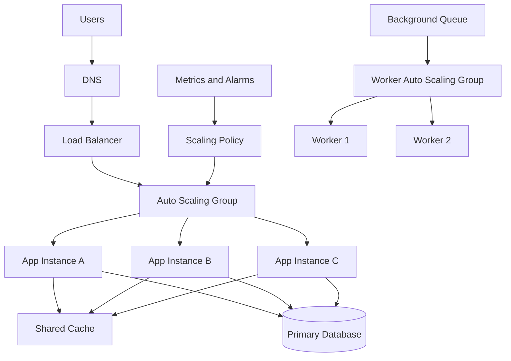

# Horizontal vs Vertical Scaling & Auto-scaling

> Scaling is the discipline of increasing system capacity without letting latency, reliability, or cost spiral out of control as traffic grows.

---

## The Problem

Imagine you run a payments-enabled e-commerce platform that usually sees 800 requests per second during business hours. The entire application sits on one 8 vCPU, 32 GB RAM virtual machine with PostgreSQL on a separate box. On an ordinary day, the app server cruises at 35% CPU, p95 latency stays near 120 ms, and nobody thinks much about capacity.

Then Black Friday starts. Traffic does not double. It jumps to 12,000 requests per second in less than ten minutes. CPU pegs at 100%. The JVM heap starts thrashing. TLS handshakes pile up in the accept queue. Latency that used to be 120 ms becomes 4 seconds, then 12 seconds. Health checks begin to fail, which makes the load balancer stop sending traffic to the only instance you have. In practice, your “scaling strategy” was just hoping that one machine would keep up, and hope is not a strategy.

The first instinct many teams have is “buy a bigger server.” Sometimes that works. Moving from 8 vCPU to 32 vCPU may give you a quick 3x or 4x improvement, especially if the workload is CPU-bound and your application is not well-parallelized yet. But there is a ceiling. Cloud instance catalogs do not go to infinity. Bigger machines cost disproportionately more. Reboots and maintenance become scarier because more traffic depends on one host. A noisy-neighbor issue or kernel-level problem can still take down the whole service.

The opposite instinct is “just add more servers.” That also sounds simple until you discover your application stores session state in local memory, writes uploads to the local filesystem, and depends on one primary database that can only accept so many writes per second. You can add ten more application servers and still be bottlenecked by the database, a hot cache shard, or a queue consumer group that cannot scale with you.

This is why engineers separate scaling into three connected ideas: vertical scaling, horizontal scaling, and auto-scaling. Vertical scaling asks how much one machine can do. Horizontal scaling asks how to split work across many machines. Auto-scaling asks how to adapt capacity over time instead of hard-coding one guess forever. If you do not understand all three, you either waste money by permanently overprovisioning or you discover your real limits during the worst possible traffic event.

---

## Core Concept Explained

Think of a restaurant on a busy weekend. Vertical scaling is giving one chef a bigger stove, a larger prep table, and a second oven. The chef can produce more meals because each person has more powerful equipment. Horizontal scaling is adding more chefs and more prep stations so orders can be processed in parallel. Auto-scaling is the manager watching the line at the door, pulling extra staff onto the floor when the rush starts, and sending people home when demand drops. All three are useful, but they solve different problems.

### Vertical scaling

Vertical scaling, sometimes called scale-up, means increasing the capacity of a single machine. You move from 4 vCPU to 16 vCPU, from 16 GB RAM to 64 GB RAM, from gp3 storage to local NVMe, or from a smaller database class to a larger one. The benefit is simplicity. Your architecture does not necessarily change. One process still handles the workload, one machine still owns the local state, and you often get immediate performance gains with minimal code changes.

This is why vertical scaling is the correct boring answer surprisingly often. If your service handles 2,000 requests per second, fits comfortably on one PostgreSQL primary and two app servers, and your p95 latency problem is caused by an undersized box, buying a larger instance is rational. Teams with fewer than 10,000 daily active users frequently overcomplicate too early. A jump from an `m6i.large` to an `m6i.2xlarge` can cost a few hundred dollars per month and buy months of runway. That is usually cheaper than introducing distributed coordination bugs.

But vertical scaling has hard limits. CPU sockets, RAM channels, NIC throughput, and storage IOPS all cap out. Cloud price curves also get ugly. A 64 vCPU instance is not merely 8x the cost of an 8 vCPU instance in real operational terms because blast radius rises too. Restarting a 256 GB memory database can take materially longer. A hardware failure on the big node hurts more than a failure on one member of a ten-node pool. Vertical scaling also does not magically make software parallel. If one lock, one hot thread, or one single-writer component is the bottleneck, more cores do not linearly help.

### Horizontal scaling

Horizontal scaling, or scale-out, means adding more machines and distributing work across them. For stateless application servers behind a load balancer, this is straightforward in principle: if one node can handle 1,500 requests per second at 60% CPU, four nodes can often handle around 6,000 requests per second, minus coordination overhead. This is why web and API tiers are the first layers teams usually scale horizontally.

Horizontal scaling works best when the workload is divisible. Stateless HTTP request handling is a classic example. Image transformation jobs, background workers processing independent tasks, and stream consumers partitioned by key also scale well. The architectural phrase you will hear is **shared nothing**: each node should do work without depending on mutable local state that only it can see.

That requirement changes how you design systems. Session data moves out of local memory into Redis or signed cookies. Uploaded files go to object storage instead of `/tmp` on one machine. Any node must be able to serve any request, which is why load balancing becomes part of the story immediately. Once you scale horizontally, routing decisions, health checks, draining, and failure domains all matter.

Horizontal scaling also exposes hidden bottlenecks. Teams often scale the stateless tier and then discover the real limit is the primary database handling 8,000 writes per second, not the API servers. Or the service spends 40 ms waiting on a downstream dependency, so adding more app instances only increases concurrency against a struggling database. Horizontal scaling is not “add more boxes and you are done.” It is “move each bottleneck one layer deeper until you understand the true system limit.”

### Auto-scaling

Auto-scaling sits on top of both strategies. It is a control loop that adjusts capacity based on observed or predicted demand. In cloud environments, the usual pattern is to define a group of interchangeable instances, set minimum and maximum size, attach scaling policies, and let the platform add or remove capacity. For example, you might keep a minimum of 6 instances overnight, allow up to 60 during peak, and scale out when average CPU exceeds 55% for five minutes or when request count per target exceeds 1,200 per minute.

Reactive auto-scaling uses current metrics. CPU utilization, queue depth, p95 latency, active connections, memory pressure, and requests per second are common triggers. Reactive scaling is simple, but it is always a little late because it waits for pain to start before acting. If your service takes 90 seconds to boot, register with the load balancer, warm caches, and start serving, a sudden spike can overwhelm the fleet before new nodes are ready.

Predictive auto-scaling tries to get ahead of demand. Some platforms analyze historical patterns, like weekday peaks at 9:00 AM or a steady lunchtime surge. Scheduled scaling is the simplest version: increase minimum capacity from 10 to 25 nodes every Friday from 6:00 PM to 11:00 PM because you know traffic will spike. This is common in commerce, ticketing, and media launches because “predictable spikes” are still spikes. The better your workload is understood, the more aggressively you can pre-warm capacity.

### Scale-out is not enough without scale-in discipline

Teams love talking about scale-out and forget scale-in. Removing capacity safely is just as important. If you terminate instances immediately when CPU drops, you can kill in-flight requests, thrash warm caches, and create oscillation where the fleet grows and shrinks every few minutes. Good auto-scaling policies use cooldown windows, connection draining, health checks, and conservative scale-in thresholds. It is normal to scale out aggressively and scale in slowly.

### Choosing between them

A healthy mental model is this:

- Vertical scaling buys you time and simplicity.
- Horizontal scaling buys you ceiling and fault isolation.
- Auto-scaling buys you elasticity and cost control.

Mature systems usually use all three in layers. A service might vertically scale its database from 16 to 64 vCPU before introducing sharding, horizontally scale its application tier behind an L7 load balancer, and auto-scale worker fleets based on queue lag. The question is never “which one is universally best?” The question is “which bottleneck are we solving right now, at what operational cost, and how soon will the next bottleneck appear?”

---

## Architecture Diagram

### Mermaid Diagram

### Diagram Walkthrough

Start at the top left with `Users`. They send requests that first hit `DNS`, which resolves your service name to the public endpoint of the `Load Balancer`. The load balancer is the entry point that spreads traffic across a fleet instead of one machine. That already shows the difference between vertical and horizontal scaling: we are no longer betting the whole service on a single host.

The load balancer forwards requests to the `Auto Scaling Group`, which is not one server but a pool manager. Inside that group are `App Instance A`, `App Instance B`, and `App Instance C`. In a real deployment this might be 3 instances during quiet periods, 12 during regular peak, and 40 during a flash sale. The auto-scaling group is responsible for launching new instances, attaching them to the load balancer once health checks pass, and removing unhealthy or excess capacity.

Each app instance talks to a `Shared Cache`. That component matters because horizontally scaled nodes cannot rely on local memory for shared state. If a user logs in on App Instance A and the next request lands on App Instance C, the session or hot data still needs to be available. The shared cache is one of the practical enablers of stateless scale-out.

Each app instance also talks to the `Primary Database`. This is important because it shows a classic bottleneck. Even if you scale from 3 app servers to 30, all write-heavy traffic may still converge on one primary database. One request flow is a normal read-heavy API call: user request arrives, load balancer picks an app instance, the app checks the cache, and only then queries the database if needed. Another request flow is a sudden traffic spike: CPU and request metrics rise, `Metrics and Alarms` feed the `Scaling Policy`, and that policy instructs the auto-scaling group to launch more app instances.

The bottom row shows a second scenario involving asynchronous work. `Background Queue` feeds a `Worker Auto Scaling Group`, which manages `Worker 1` and `Worker 2`. This is a different scaling dimension. Your synchronous API fleet may scale on request rate, while your worker fleet scales on queue depth or job age. That is a good reminder that “scaling the system” rarely means one universal knob. Different components scale on different signals and at different speeds.

---

## How It Works Under the Hood

Auto-scaling systems are basically feedback controllers. They measure the current system state, compare it to a target, and adjust capacity. In AWS target tracking, for example, you might say “keep average CPU around 50%” or “keep average requests per target around 1,000.” If the observed metric stays above target for long enough, the platform launches more instances. If it stays below target for a long enough window, the platform removes some.

The tricky part is metric selection. CPU works well for CPU-bound services, but it is a terrible signal for I/O-bound services that mostly wait on the database. Queue depth is better for background workers because 100,000 queued jobs tells you more than CPU alone. Request count per target is often better for web fleets than raw instance CPU because it aligns more closely with user load. Strong teams avoid one-size-fits-all scaling signals and instead pick a metric that correlates with user pain.

Startup latency is another underappreciated detail. A new node is not useful the moment the VM boots. The OS has to start, the application has to initialize, secrets and config must load, JIT compilation may occur, database pools and cache connections are created, and health checks must pass. A Java service may take 60 to 120 seconds before it is truly warm. A containerized Go service may come up in 5 to 15 seconds. That difference matters because reactive scaling on a slow-starting workload can be too sluggish to prevent a brownout.

This is why warm pools, pre-baked images, and scheduled scale-out exist. If you know a sale starts at 7:00 PM, waiting until 7:02 PM to add servers is operational malpractice. Teams pre-warm instances, load popular caches, and sometimes hold extra idle capacity because underprovisioning costs more than a few temporarily unused nodes. Shopify-style traffic bursts during flash sales are usually handled with a mix of headroom, queue-based backpressure, and aggressive pre-scaling.

Scale-in is implemented with more care than people expect. Before terminating a node, a load balancer usually marks it as draining so new requests stop landing there while existing requests finish. Draining might last 30 to 300 seconds depending on request duration. If you skip this, long-running uploads, checkout flows, or streaming responses get cut off. For worker fleets, scale-in often means stop pulling new jobs, finish current work, checkpoint progress, then terminate.

Oscillation is another failure mode. Imagine a policy that adds 4 nodes when CPU exceeds 60% for two minutes and removes 4 nodes when CPU drops below 40% for two minutes. Under choppy traffic, the system may bounce between 8 and 12 nodes all day. Every bounce causes warm-up cost, cache churn, and noisy metrics. Good policies smooth inputs with rolling averages, separate scale-out and scale-in thresholds, and use longer cooldowns for shrink actions.

Vertical scaling has low algorithmic complexity but deep implementation consequences. Moving a database from 64 GB RAM to 256 GB RAM changes buffer pool behavior, checkpoint timing, replication lag under write bursts, and recovery time after failure. You may also hit NUMA effects, where memory locality across CPU sockets begins to matter for performance. On paper, scale-up looks like “bigger box.” Under the hood, it changes the performance profile of the whole system.

Horizontal scaling has its own data-structure and protocol realities. Connection pools multiply. Ten app nodes with 100 DB connections each can overwhelm a database that only tolerates 500 useful concurrent connections. Ephemeral port exhaustion can appear on NAT gateways under huge outbound concurrency. Sticky sessions may keep load distribution uneven. None of these are visible when you run one server on your laptop, which is why scaling is as much about eliminating coordination and state as it is about buying capacity.

---

## Key Tradeoffs & Limitations

The biggest tradeoff is simplicity versus ceiling. Vertical scaling keeps the architecture boring. There are fewer moving parts, fewer failure modes, and easier debugging because one machine sees the whole workload. But once you approach the limits of one machine, the next increment is expensive and the blast radius is large. Horizontal scaling raises the ceiling and improves fault isolation, but you pay with operational complexity, distributed state management, and more subtle failure handling.

Auto-scaling trades lower steady-state cost for more dynamic behavior. That sounds obviously good until you remember that dynamic systems can make bad decisions. If the metric is noisy, if boot times are slow, or if cooldowns are poorly tuned, auto-scaling can amplify instability rather than absorb it. Many teams discover that a manually overprovisioned fleet is cheaper than repeated incidents caused by an auto-scaler that reacts too late.

Choose vertical scaling when the workload still fits comfortably on one stronger machine, the team is small, the application is stateful, or you are buying time before a more invasive redesign. Choose horizontal scaling when the workload is naturally parallel, availability matters, and single-node limits are approaching. Choose auto-scaling when traffic varies materially over time and you have enough observability to trust the control loop. If your application startup takes three minutes and your traffic spikes in thirty seconds, auto-scaling alone will not save you.

What scaling does not solve is a bad architecture. If one SQL query takes 900 ms because of a missing index, four times as many servers merely create four times as many slow queries. If a single downstream API is rate-limited to 2,000 requests per second, your extra web nodes do not create more headroom. Scaling is about multiplying capacity that already works, not rescuing fundamentally inefficient request paths.

---

## Common Misconceptions

**Many people believe vertical scaling is a beginner move and horizontal scaling is the “real” senior-engineering answer.** That sounds sophisticated, but it is wrong. A larger instance is often the highest-leverage fix when the architecture is still simple and demand is moderate. The misconception exists because distributed systems are intellectually interesting, so engineers sometimes confuse complexity with maturity.

**Many people believe horizontal scaling automatically improves availability.** It only does if the nodes are actually independent and traffic can move away from failures cleanly. If every app server depends on one single database, one single Redis node, or one single availability zone, your extra nodes may improve throughput but not resilience. The misconception persists because “multiple servers” feels redundant on the surface.

**A common belief is that auto-scaling means you no longer have to capacity-plan.** In reality, auto-scaling policy design is capacity planning expressed as rules. You still need minimum fleet size, maximum fleet size, target metrics, headroom assumptions, and startup timing. The misconception exists because cloud consoles make scaling look like a checkbox instead of an operating discipline.

**Many teams assume statelessness is optional for horizontal scaling.** You can technically scale with sticky sessions, local temporary files, and per-node caches, but every one of those choices reduces elasticity and complicates failure handling. The correct understanding is that statelessness is not ideology; it is what makes scale-out predictable. The misconception exists because sticky sessions often work in staging and under small load.

---

## Real-World Usage

**Netflix** uses auto-scaling groups extensively on AWS for stateless services and worker fleets. Their philosophy has long been to treat instances as disposable and keep enough redundancy across availability zones so losing one box or one group of boxes does not become an outage. The key implementation choice is not just “scale out,” but “design services so they can be replaced constantly,” which is what makes elastic capacity operationally realistic.

**Shopify** deals with highly predictable but very sharp traffic bursts during flash sales and major commerce events. The important detail is that these spikes are not solved by one mechanism alone. Shopify-style workloads use aggressive caching, queue buffering, admission control, and pre-scaled application capacity because checkout traffic can rise much faster than cold instances can warm. That is a textbook example of why scheduled or predictive scaling often beats purely reactive scaling.

**Slack** has talked publicly about running large numbers of stateless application servers behind load balancers while carefully managing database and cache bottlenecks separately. The scale lesson is that web-tier horizontal scaling is usually the easiest part. The harder engineering work is keeping shared infrastructure, especially storage layers, from becoming the next bottleneck as millions of concurrent users arrive around the same workday peaks.

---

## Interview Angle

**Q: Your service handles 1,500 requests per second on one node today. How would you decide between vertical and horizontal scaling next?**
**How to approach it:**
- Start by asking where the current bottleneck is: CPU, memory, network, disk, database, or downstream dependency.
- Explain that vertical scaling is often the quickest fix if the service is still simple and there is clear instance headroom available in the platform.
- Discuss when horizontal scaling becomes necessary: stateless request handling, rising availability requirements, or nearing the ceiling of one machine.
- Mention that the answer changes if the real bottleneck is the database rather than the app node.

**Q: What metric would you use for auto-scaling and why?**
**How to approach it:**
- Say that the best metric is one that correlates strongly with user pain, not just one that is easy to graph.
- Compare CPU, memory, request count per target, queue depth, and latency as signals.
- Point out that different components need different metrics; web fleets and worker fleets should not necessarily scale on the same thing.
- Call out startup time and cooldown behavior, because a good metric is useless if new capacity arrives too late.

**Q: What can go wrong during scale-in?**
**How to approach it:**
- Talk about connection draining, long-running requests, and in-flight job loss.
- Explain why scale-in is usually slower and more conservative than scale-out.
- Mention cache warmness and oscillation, not just request failure.
- A strong answer shows that cost optimization is secondary to correctness during shrink events.

**Q: If traffic spikes instantly by 10x, why might auto-scaling still fail?**
**How to approach it:**
- Explain the lag between demand increase and new capacity becoming useful.
- Mention cold starts, image pulls, JIT warm-up, and dependency connection setup.
- Discuss pre-scaling, warm pools, scheduled capacity, and graceful degradation as mitigations.
- Tie the answer back to user-facing latency and error-rate impact, not just infrastructure mechanics.

---

## Connections to Other Concepts

**Concept 02 - Load Balancing Deep Dive** is the immediate companion to horizontal scaling. Once you have more than one application node, the question becomes how requests are distributed, how unhealthy nodes are removed, and how draining works during scale-in. In practice, scale-out without a competent load-balancing layer is just a pile of extra servers.

**Concept 06 - SQL Databases at Scale** matters because many “scaling” stories end with the database becoming the real bottleneck. You can triple the size of the app fleet and still be limited by poor indexing, expensive queries, or connection exhaustion on the database tier. That is why senior engineers always ask which layer is saturating, not just whether more app nodes exist.

**Concept 19 - Fault Tolerance Patterns** becomes essential once capacity changes dynamically. Auto-scaling protects against normal demand variation, but retries, circuit breakers, backpressure, and graceful degradation protect the system when scaling is not fast enough or a dependency is unhealthy. Capacity planning and failure handling are separate but tightly linked disciplines.

**Concept 21 - Monitoring, Observability & SLOs/SLAs** is what makes auto-scaling trustworthy. Without good metrics, alerts, and service-level targets, you cannot pick the right scaling signals or know whether the policy is helping. Observability turns scaling from guesswork into a measurable control loop.

**Concept 22 - Microservices vs Monolith** connects because scaling strategy changes with architecture. A monolith may begin with vertical scaling because that is operationally simple, while a microservices architecture often scales different services independently. The tradeoff is that microservices give finer-grained scaling knobs but create more coordination overhead.
