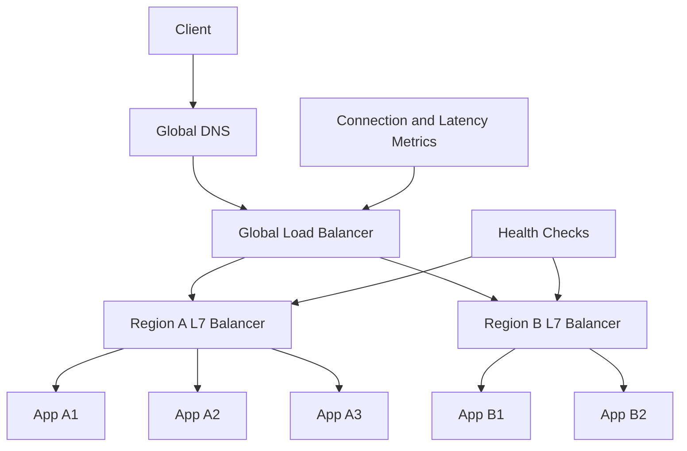

# Load Balancing Deep Dive

> Load balancing is the practice of distributing traffic across multiple healthy targets so one overloaded or failing node does not become the user’s problem.

---

## The Problem

Picture a ticketing platform that opens sales for a stadium concert at 10:00 AM. At 9:59 AM, the site handles 300 requests per second. At 10:00:03, it is hit with 40,000 requests per second. If every request goes to one application server, that server melts instantly. CPU spikes, open file descriptors climb, connection queues back up, and users see blank pages or 502 errors instead of seat maps.

Now imagine you do have ten servers instead of one, but your DNS points straight at them and clients randomly hit whichever IP they cached last. Two servers become overloaded, one has a bad deployment, and one is healthy but receives almost no traffic because of DNS caching quirks. You technically have capacity, but you do not have controlled traffic distribution. That distinction matters a lot in production.

Load balancing exists because adding servers without coordinated traffic management does not produce predictable performance. Systems need a front door that decides where traffic goes, detects unhealthy nodes, retries when appropriate, drains nodes during deploys, and sometimes makes routing choices based on protocol, path, cookie, geography, or latency. Without that front door, horizontal scaling is chaotic rather than useful.

The failure case is not just overload. It is uneven overload. One node may be pinned at 95% CPU while others sit at 30%. A server may still accept TCP connections even though the application thread pool is deadlocked. Sticky sessions may silently send a celebrity’s fan traffic to one machine and starve the rest of the pool. Teams that treat load balancing as a checkbox usually discover these edge cases during launches, failovers, or partial outages.

That is why a real understanding of load balancing goes beyond “round robin across instances.” You need to know what layer the balancer operates at, what information it can inspect, how it decides a target is healthy, when retries are safe, how session affinity changes behavior, and when DNS-based global balancing helps or hurts. Load balancers are one of the boring-looking components that quietly determine whether a scaled system feels smooth or fragile.

---

## Core Concept Explained

Think of load balancing like a smart host at a busy restaurant. The host does not just count tables. They know which servers are overwhelmed, which section is closed, which tables are reserved, and when a large party should be sent to a corner booth instead of split awkwardly. A bad host creates long waits even when half the restaurant is available. A good host keeps the whole room balanced and hides small failures from customers.

### L4 versus L7

Layer 4 load balancing works at the transport layer. It sees IP addresses, ports, and TCP or UDP flows, but not the HTTP path, headers, or cookies inside those connections. L4 balancing is fast because there is less protocol parsing. It is a good fit for raw TCP services, high-throughput proxying, and cases where you want to preserve protocol transparency. A network load balancer can often handle millions of connections with very low overhead.

Layer 7 load balancing works at the application layer, usually HTTP or gRPC over HTTP/2. Because it understands requests, it can do much richer things: route `/api/*` to one pool and `/images/*` to another, terminate TLS, inspect headers, apply rate limits, set cookies for session affinity, and retry idempotent upstream calls. The tradeoff is more CPU cost and more complexity. L7 is the default choice for modern web applications because it gives operators more control where it matters.

### Core algorithms

**Round robin** sends each new request to the next target in sequence. It is simple and works well when all nodes are equally powerful and requests have similar cost.

**Weighted round robin** adjusts for uneven target capacity. A 32 vCPU node can receive more traffic than an 8 vCPU node. This matters during mixed-instance fleets or partial migrations.

**Least connections** sends new traffic to the node with the fewest active connections. This works better than round robin when request duration varies a lot, such as one pool serving both fast API reads and long uploads.

**IP hash** or consistent client hashing tries to send the same client to the same backend. That helps with session affinity, though it can produce uneven distribution when some clients are much busier than others.

**Consistent hashing** is a more scalable version used when mapping keys or long-lived sessions to nodes. When targets change, only part of the mapping moves rather than almost everything. This matters for cache clusters, sticky WebSocket routing, and some proxy layers.

### Health checks

A load balancer is only as useful as its ability to stop sending traffic to broken things. Active health checks probe backends periodically, such as `GET /healthz` every 10 seconds with a 2-second timeout. Passive health checks infer failure from live traffic, such as repeated TCP resets or 5xx responses. Active checks are explicit but can be fooled by shallow endpoints that say “healthy” while the database is down. Passive checks catch real request failures but only after users feel them. Mature systems usually combine both.

### Session affinity and stickiness

Sometimes repeated requests from one client must go to the same backend temporarily. Old-school session storage in local memory is the classic reason. Some WebSocket or long-poll systems also care about affinity to reduce cross-node coordination. The downside is skew: one hot user or one hot tenant can overload a subset of instances while the rest stay cool. Sticky sessions are best treated as a tactical compromise, not the desired steady state.

### Retries, draining, and slow start

Good load balancers do more than pick a node once. If a connection fails before headers are sent, an L7 balancer may retry an idempotent request on another backend. During deployment or scale-in, draining stops new requests from landing on a node and lets in-flight requests finish. Slow start gradually increases traffic to a newly added node instead of dumping full production load on a cold instance that has empty caches and uninitialized JIT paths.

### DNS and global load balancing

At regional or global scale, traffic is often distributed by DNS or an anycast network before it reaches a regional load balancer. DNS-based balancing can route users to the nearest region or fail over away from a bad region. The catch is DNS caching. A 60-second TTL may still behave like several minutes in the wild because clients and recursive resolvers do not always honor TTLs exactly. That is why global balancing is part routing problem and part cache-invalidation problem.

---

## Architecture Diagram

### Mermaid Diagram

### Diagram Walkthrough

The first component is `Client`, which makes a request to `Global DNS`. DNS is the user’s first routing layer. It returns an endpoint for the `Global Load Balancer`, which decides which region should receive the traffic. That decision may be based on geography, latency, regional health, or weighted traffic shifting during a rollout.

From there, traffic goes to either `Region A L7 Balancer` or `Region B L7 Balancer`. These are application-aware load balancers. They can terminate TLS, inspect HTTP paths, enforce header-based routing rules, and choose backends based on algorithms such as least connections or weighted round robin. This is a second layer of decision-making: first choose a region, then choose a specific backend inside that region.

In Region A, requests may land on `App A1`, `App A2`, or `App A3`. In Region B, they may land on `App B1` or `App B2`. The `Health Checks` component continuously probes the regional balancers and their targets. If `App A2` starts returning failures or timing out, Region A’s balancer should stop sending it traffic even if the instance still technically exists. That is the basic “hide failure from the user” job of a load balancer.

One request flow is the normal healthy path: client resolves DNS, global balancing picks the closest healthy region, regional balancing chooses the least busy backend, and the response comes back quickly. Another request flow is a partial regional problem: Region A latency spikes or multiple targets fail health checks, `Connection and Latency Metrics` tell the global layer that Region A is degraded, and more new traffic is shifted toward Region B while the bad targets are drained. The diagram shows how load balancing often happens in layers, not in one magical box.

---

## How It Works Under the Hood

At L4, balancing decisions are made when connections are established. The load balancer tracks connection tables and forwards packets based on flow state. At L7, it usually terminates the client-side connection, parses the application protocol, and opens or reuses a backend connection from a pool. That means an L7 balancer can multiplex many client requests over fewer upstream connections, which is useful for HTTP/2 and gRPC, but it also means the balancer is now an active application component with CPU and memory overhead.

TLS termination is a big part of real deployments. Terminating TLS at the balancer centralizes certificate management and reduces cryptographic work on each backend instance. A modern TLS handshake may take a few milliseconds of CPU time plus round trips, while reused sessions are cheaper. Offloading that to the balancer can materially improve backend efficiency. The tradeoff is that traffic between balancer and backend must still be protected if your threat model or compliance requirements demand encryption end to end.

Health check design is surprisingly subtle. If the check is too shallow, like “return 200 if the process is alive,” traffic will keep going to a node whose worker pool is saturated or whose database dependency is dead. If the check is too deep, it may create load or flap constantly during transient downstream issues. Many teams separate liveness and readiness: liveness means “restart me if this fails,” while readiness means “stop sending me traffic if this fails.”

Least-connections and least-request algorithms sound smarter than round robin, but they depend on accurate counters and request lifecycle tracking. For HTTP keep-alive and HTTP/2, one client connection can carry many sequential or multiplexed requests. Counting raw TCP connections may not reflect actual load. That is why some platforms use outstanding requests, observed latency, or adaptive concurrency as more meaningful scheduling signals than plain connection count.

Slow start is a practical lifesaver. A new instance may pass health checks quickly but still perform worse than warm peers because caches are empty, code paths are cold, and JIT compilation or file-system cache warming has not happened yet. Good load balancers can ramp traffic gradually over 30 to 300 seconds. Without that, the new node can fail under a sudden full share of traffic, get marked unhealthy, and create a feedback loop where no new node survives long enough to warm.

Proxy protocol and forwarded headers matter when preserving client identity. If TLS is terminated upstream or there are multiple proxy layers, the backend may otherwise only see the balancer’s IP. `X-Forwarded-For`, `X-Forwarded-Proto`, or the PROXY protocol are how backends recover original client IP and scheme. This becomes important for logging, rate limiting, geo-routing, and application-level security decisions.

DNS-based balancing has protocol-independent reach but limited real-time control because of caching. You can lower TTLs to 30 or 60 seconds, but resolvers and client libraries may cache longer. This is why many systems combine DNS-based regional steering with fast in-region load balancers and health-aware failover inside each region. DNS gets users roughly to the right place. Regional balancing makes the fine-grained decisions.

---

## Key Tradeoffs & Limitations

L4 load balancing is faster and more transparent, but it cannot do path routing, header inspection, TLS-aware policy, or application-specific retries. L7 gives you those controls, but the balancer becomes more CPU-intensive and operationally central. Choose L4 when you need raw throughput or are balancing arbitrary TCP/UDP services. Choose L7 when you need rich application routing for HTTP or gRPC workloads.

Sticky sessions make some systems easier to ship, but they make capacity management worse. They reduce rebalance flexibility, create uneven hotspots, and complicate instance replacement. If your app can be made stateless with shared storage or signed cookies, that is almost always the more scalable long-term path.

Load balancing also does not eliminate dependency bottlenecks. It can spread traffic beautifully across twenty app nodes while one database, one message broker, or one third-party API still limits the system. It solves distribution, not unlimited capacity. That distinction is important in interviews and in production.

DNS-based global balancing is useful but blunt. It helps with regional steering and failover, but because of caching it is not a precise second-by-second traffic control plane. For fast failover, you often need health-aware routing systems, anycast, or application-level resiliency in addition to DNS.

Managed balancing layers also have a real cost footprint. TLS termination, header parsing, WAF rules, access logging, and retry logic can turn the proxy tier into one of the more expensive parts of the request path at high volume. A team serving `60,000 RPS` through an L7 proxy with heavy observability and security policies is paying for much more than simple packet forwarding.

Retries and slow start are another tradeoff pair that look safer than they really are. Retries can rescue transient failures, but they can also amplify overload by sending two or three upstream attempts for one user request. Slow start protects cold backends, but it also means newly added capacity is not instantly usable. Good load-balancer configuration is about controlling these second-order effects, not just turning features on.

---

## Common Misconceptions

**Many people believe round robin is the default best algorithm.** It is only best when targets are homogeneous and requests have similar cost. In workloads with long-lived connections or uneven request sizes, least-connections or weighted approaches often behave better. The misconception exists because round robin is easy to explain and demo.

**A common belief is that a server passing health checks must be healthy.** In reality, the health endpoint may only prove that the process is alive, not that it can serve real traffic well. A node can return `200 OK` for `/health` while timing out every production request because its thread pool is exhausted. The misconception exists because health checks are often implemented shallowly at first.

**Many teams assume sticky sessions are harmless.** They are often harmless at small scale, which is exactly why the misconception survives. At larger scale, affinity creates hotspots, awkward deploy behavior, and degraded elasticity. The correct understanding is that stickiness is a tradeoff, not a free optimization.

**People often think global load balancing means instant regional failover.** DNS caching alone disproves that. Some clients will keep using an old answer for longer than you want, which is why regional redundancy and graceful degradation still matter. The misconception exists because dashboards show DNS changes propagating faster than real client behavior often does.

---

## Real-World Usage

**Google** uses multi-layer load balancing across its global infrastructure, combining edge routing with per-service backends and deep observability into endpoint health and latency. The key idea is not just scale but policy richness: traffic can be steered by geography, service identity, and backend performance. That is why Google can keep global services responsive despite huge regional variability.

**Netflix** relies heavily on application-aware routing and health-aware traffic management for a massive microservices estate. Their production patterns emphasize fast instance replacement, zone-aware routing, and safe drain behavior during deploys and failures. At their scale, the load balancer is not just a packet shuffler; it is part of the resilience story.

**Cloudflare** operates one of the most visible global traffic distribution systems on the internet. Their edge network terminates enormous amounts of HTTP, TLS, and security traffic close to users, then forwards or serves requests based on policy. The relevant lesson is that global load balancing often merges with CDN behavior and security enforcement once you operate at internet edge scale.

**AWS Elastic Load Balancing** is useful as a practical everyday example because it exposes the design tradeoff directly: Application Load Balancer for request-aware HTTP routing, Network Load Balancer for lower-level TCP and UDP throughput, and Global Accelerator for faster global entry-point steering. Many teams use more than one of these together, which is a good reminder that "the load balancer" is often a stack rather than a single box.

---

## Interview Angle

**Q: When would you choose L4 over L7 load balancing?**
**How to approach it:**
- Compare the information each layer can inspect and the resulting control each one provides.
- Explain that L4 is attractive for raw TCP/UDP throughput and protocol transparency.
- Explain that L7 is preferred when routing decisions depend on HTTP paths, headers, cookies, or TLS-aware behavior.
- Mention operational cost: richer control usually means more overhead.

**Q: How would you design health checks for a production service?**
**How to approach it:**
- Separate liveness from readiness and explain why mixing them causes bad restarts or bad routing.
- Discuss shallow versus deep checks and the tradeoff between realism and stability.
- Mention passive failure detection from real traffic alongside active probing.
- A strong answer includes flapping prevention and graceful removal from rotation.

**Q: Why can sticky sessions become a problem?**
**How to approach it:**
- Start with why teams use them: local session state or reduced coordination.
- Then explain uneven load, poor elasticity, and more complex failover or deploy behavior.
- Offer alternatives such as shared session stores or signed tokens.
- Show nuance by saying stickiness can be acceptable temporarily, not that it is always wrong.

**Q: How would you handle regional failover with DNS-based balancing?**
**How to approach it:**
- Explain what DNS can do well: coarse regional steering and weighted failover.
- Call out TTL and client caching limitations clearly.
- Mention that in-region balancers, retries, and application resiliency are still needed.
- Tie the answer back to user-visible behavior during partial rather than total failures.

**Q: What can go wrong if the load balancer retries upstream requests too aggressively?**
**How to approach it:**
- Start by noting that retries can improve availability for short-lived transient faults.
- Then explain retry amplification, where one user request becomes multiple upstream requests during a partial outage.
- Mention idempotency explicitly because retrying non-idempotent writes can create correctness bugs.
- A strong answer balances success-rate improvement against the risk of turning a small incident into a traffic storm.

---

## Connections to Other Concepts

**Concept 01 - Horizontal vs Vertical Scaling & Auto-scaling** comes first because load balancing is what makes horizontal application scaling usable. Once you have multiple instances, you need controlled request distribution, health-aware routing, and safe drain behavior. In practice, these two concepts are deployed together almost immediately.

**Concept 04 - API Gateway, Reverse Proxy & Rate Limiting** builds on L7 load balancing. Many gateways are effectively specialized L7 proxies with richer policy controls, authentication hooks, and request shaping. Understanding ordinary load balancing makes it much easier to understand why API gateways exist and where they add value.

**Concept 11 - Consistent Hashing** connects to sticky routing and traffic distribution across changing target pools. When session or key-to-node mapping matters, consistent hashing avoids remapping almost everything when nodes are added or removed. That matters for caches, long-lived connections, and some distributed proxy designs.

**Concept 16 - Real-time Communication** is a natural next step because WebSockets and long-lived connections stress load balancers differently from short HTTP requests. Connection duration, affinity, and drain behavior all become more important. A balancer that looks fine for REST traffic can behave very differently under persistent real-time workloads.

**Concept 19 - Fault Tolerance Patterns** matters because retries, timeouts, circuit breakers, and graceful degradation determine what happens when load balancing alone cannot mask backend problems. A good balancer distributes traffic, but resilience patterns decide whether the rest of the system recovers cleanly or cascades into failure.
