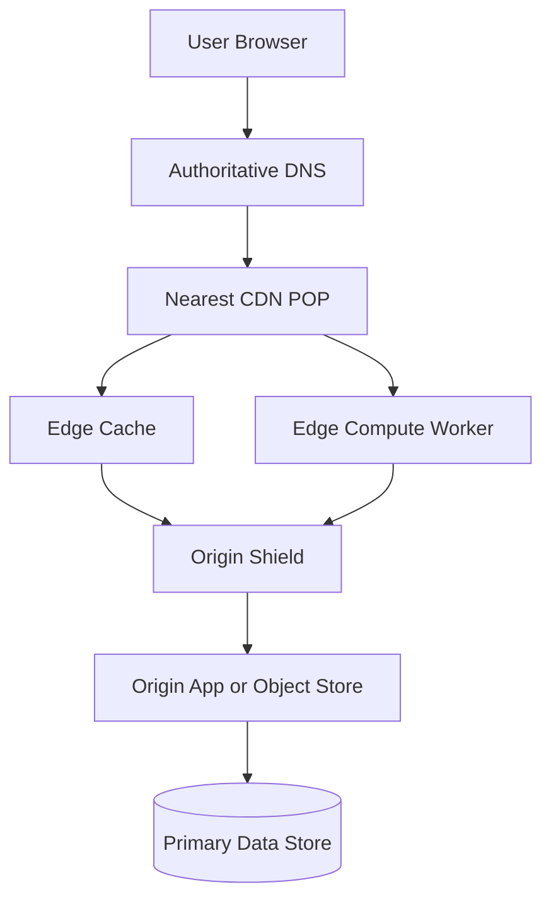

# CDN & Edge Computing

> A CDN and edge layer move content and lightweight logic closer to users so the internet's distance, congestion, and origin bottlenecks stop dominating your latency budget.

---

## The Problem

Imagine you run a consumer learning platform whose web app is hosted in one region in the US. Your biggest audience is in India, Southeast Asia, and the Middle East. A student in Bengaluru opens your homepage and the browser has to fetch `app.js`, `styles.css`, a hero image, ten course thumbnails, and a JSON payload for featured lessons. None of it is cached locally yet. The round trip from India to a US origin can easily be `180 to 250 ms`, and that is before the browser downloads a single byte of actual content.

Under light traffic, the app still "works," but page loads drift into the `3 to 5 second` range. Then your marketing team launches a campaign and traffic jumps from `2,000` page views per minute to `120,000` page views per minute. Suddenly the origin is serving the same static files over and over to users scattered around the globe. Your app servers are wasting CPU on TLS handshakes. The object storage origin is seeing a flood of identical image requests. Users in distant geographies complain that the site feels broken even though your database is fine.

This is the part many teams miss: a system can have perfectly healthy application code and still feel slow because physics is winning. A `200 ms` round trip to a distant region means every cache miss, TLS handshake, redirect, or validation request costs a big chunk of user patience. If your page needs twenty network round trips, you can burn seconds without any backend bug at all.

Now add a second problem. Some content is safe to cache for hours, like versioned JavaScript bundles. Some content changes every few minutes, like trending lessons. Some content is personalized, like "continue watching." If you route all of it to one origin, you pay maximum network cost and maximum origin load. If you cache too aggressively, users see stale prices, stale avatars, or data meant for someone else. The challenge is not just "put files near users." It is deciding what can be cached, where it should be cached, how long it should live, when it should be purged, and what logic is worth running at the edge instead of at the origin.

That is the problem CDNs and edge computing solve. A CDN puts copies of content in many points of presence, or POPs, around the world so most requests are answered near the user instead of near your origin. Edge computing takes that one step further by running small pieces of logic close to the user too, such as authentication checks, bot filtering, redirects, header normalization, localization, image transformation, or lightweight personalization. Without this layer, global traffic turns every distant user into a worst-case latency test and every traffic spike into an origin stress event.

---

## Core Concept Explained

Think of a CDN like a chain of neighborhood grocery stores backed by one central warehouse. If every customer had to drive to the warehouse for milk, bread, and vegetables, the warehouse parking lot would become chaos and customers far away would waste most of their day commuting. The smarter model is to keep popular inventory in smaller stores near customers and restock those stores from the warehouse only when needed. The warehouse is your origin. The neighborhood stores are CDN POPs. Edge compute is like giving each store manager a small amount of authority so they can handle common tasks locally instead of escalating every decision back to headquarters.

At the simplest level, a CDN is a distributed caching layer between users and your origin. When a browser asks for an asset like `/static/app.4f3a.js`, DNS and internet routing send that request to a nearby POP. If that POP already has the object cached, the response is served locally, often in `5 to 20 ms` instead of `150 to 250 ms` from a faraway origin. If the object is not present, the POP fetches it from the origin, stores it for future requests, and then returns it to the user. That is a cache hit and miss model, but pushed to the global network edge instead of living inside one data center.

### What a CDN actually caches

A lot of teams first encounter CDNs through static assets: images, CSS, JavaScript bundles, fonts, and video segments. That is still the most common use case because those objects are read-heavy and often identical for many users. A good CDN can absorb `90%+` of asset requests so your origin only sees the cold misses and purges.

But modern CDNs can also cache dynamic responses if the response is safely shareable. A product listing page that changes every `60 seconds` can still benefit from a short TTL. An API endpoint like `/v1/catalog?category=laptops&page=1` may be cacheable for `15 seconds` or `2 minutes` if the business can tolerate slightly stale listings. For many workloads, the CDN is part of the application architecture, not just a static file bucket.

### Browser cache, CDN cache, and origin cache

There are multiple caching layers, and they are not interchangeable.

The browser cache lives on the user's device and is the fastest possible layer because it requires no network trip. Controlled via headers like `Cache-Control`, `ETag`, and `Last-Modified`, it is perfect for versioned assets such as `app.4f3a.js` that can be cached for a year.

The CDN cache lives in POPs close to users. This is the layer that reduces origin egress, hides latency, and helps absorb bursts.

The origin can also have its own cache, such as NGINX proxy cache, Redis, or application-level response caching. Mature systems often use all three layers together.

### Cache keys, TTLs, and invalidation

The CDN does not magically know which requests are equivalent. It uses a cache key. At minimum, that key often includes the host and path, but it may also include selected query parameters, headers, cookies, device type, language, or even geography. Cache key design is one of the most important parts of CDN engineering. If the key is too broad, users may receive the wrong content. If it is too narrow, hit ratio collapses because every minor variation creates a separate cached object.

TTL, or time to live, controls how long a cached object stays fresh. A versioned JavaScript bundle may have a TTL of one year because the filename changes whenever the content changes. A homepage HTML document might get `60 seconds`. A signed video URL might get `10 minutes`. TTL is not just a freshness knob. It is a load-shaping tool. Longer TTLs reduce origin load and improve hit ratio, but they make invalidation harder.

Invalidation is the act of removing or refreshing cached objects before TTL expiry. The two common approaches are purge-by-key and versioned URLs. Versioned URLs are the boring favorite for static assets because they avoid broad purge storms. Purge APIs are still needed for cases like deleting a compromised file, removing outdated content, or invalidating product detail pages when inventory changes.

### Origin shielding and hierarchical caching

In large systems, every POP pulling misses directly from origin can create a miss storm. Origin shielding solves this by placing an extra caching layer between POPs and origin. A cold POP in Sydney misses, but instead of fetching from your app servers directly, it asks the shield POP. If the shield already has the object, the origin never sees the request. This can dramatically reduce duplicate origin fetches for globally popular objects.

### What edge computing adds

Edge computing means running lightweight code at or near CDN POPs. Instead of forwarding every request to the origin just to rewrite a URL, validate a token, add geo headers, choose a language, or block a bot, the edge runtime does it locally. That can shave `50 to 200 ms` from the path and protect origin capacity.

Examples of good edge tasks include:

- Redirecting users based on country or language.
- Rejecting obvious bot traffic before it reaches origin.
- Validating a signed URL or signed cookie.
- Transforming images into WebP or AVIF close to the user.
- Serving stale content during origin failures.

Examples of bad edge tasks include long database queries, cross-service fanout, or anything that depends on deep transactional state. The edge is good at fast policy and fast data, not at becoming your whole backend.

### Why this matters numerically

The performance win is not subtle. Suppose a user in Singapore reaches a US origin with `210 ms` RTT. A static asset request that needs DNS, TCP, TLS, and the object fetch can easily take `300 to 500 ms` even before download size is considered. Served from a nearby POP, the same request may complete in `10 to 40 ms`. Multiply that across dozens of objects and you can turn a `4 second` first paint into something closer to `1 second` for faraway users. At the same time, origin traffic may drop by `80 to 95%` for cacheable objects.

That combination of latency reduction and origin protection is what makes CDN and edge architecture foundational for global products. It is not cosmetic performance tuning. It is often the difference between a site that feels local everywhere and a site that only feels fast near its data center.

---

## Architecture Diagram

### Mermaid Diagram

### Diagram Walkthrough

Start at the top left with the user browser. The browser does not normally know the IP of your origin server. It first resolves the hostname through authoritative DNS, which returns an address that steers the request to a nearby CDN POP. In many real systems that steering is powered by Anycast and the provider's network map, but the core idea is simple: the user is sent toward the closest useful edge location, not directly to the origin.

Inside the POP, two important components appear: the edge cache and the edge compute worker. For a static asset request like `/assets/app.4f3a.js`, the POP first checks the edge cache. If that file is already cached and still fresh, the POP sends it back immediately. In that flow, the request never touches the origin, the shield, or the database. That is the fast path every high-hit-ratio system wants.

Now consider a cache miss. The POP still receives the request first, but the edge cache does not have the object. Instead of every POP going straight to origin, the request is forwarded to the origin shield. The shield is a centralized higher-level cache that absorbs duplicate misses from many POPs. If the shield has the object, it returns it to the POP and the POP stores it locally for future nearby users. Only if the shield also misses does the request continue to the origin.

The worker path is for requests that need lightweight logic before origin. Suppose the user is requesting a signed video URL or a localized landing page. The edge worker can validate the signature, choose the correct locale, normalize headers, or decide whether the response is cacheable at all. For a simple allow or deny decision, the worker may finish the request locally. For a more involved request, it forwards a cleaned-up request to the shield or origin.

At the bottom of the diagram, the origin app or object store represents your main backend. This is where uncached content is generated or stored. If the request truly needs application logic or a database lookup, the origin talks to the primary data store. The crucial architectural win is that only a fraction of total traffic should reach this layer. The edge and shield tiers should absorb repeated reads, policy logic, and much of the global distance.

Two request flows matter most. The first is the static asset hit path: browser -> DNS -> POP -> edge cache -> browser. The second is the dynamic or cold path: browser -> DNS -> POP -> worker or cache miss -> shield -> origin -> database. Good CDN design tries to keep the second path correct and safe, while making the first path happen as often as possible.

---

## How It Works Under the Hood

Under the hood, most major CDNs rely on Anycast. Multiple POPs advertise the same IP ranges through BGP, and internet routing sends the user to a topologically close edge location. This is why a user can hit the same hostname from Tokyo and land in a different POP than a user in London without changing application code. Anycast is not perfect "nearest in kilometers," but it is usually good enough to keep traffic close.

Once traffic reaches the POP, cache key construction becomes critical. A response for `/product/123` may depend on query parameters, `Accept-Encoding`, `Accept-Language`, or device type. If the CDN varies on too many fields, you get fragmented cache entries and poor hit ratio. If it varies on too few, you leak content across users or locales. Mature teams are extremely explicit here. They often strip irrelevant query parameters like tracking tags, normalize headers, and whitelist only the values that should affect the cache key.

HTTP caching semantics matter more than many system design interviews admit. `Cache-Control: max-age=300` tells caches a response is fresh for five minutes. `s-maxage` can give shared caches a different TTL than browsers. `ETag` and `If-None-Match` allow revalidation so the POP can ask the origin whether content changed without downloading the full object again. `304 Not Modified` responses save bandwidth, but they still cost latency, so revalidation is cheaper than a full fetch but slower than a true hit.

Stale serving is another underused weapon. Headers and CDN policies such as `stale-while-revalidate` and `stale-if-error` allow a POP to serve slightly old content while revalidating in the background or while the origin is unhealthy. This is a big deal operationally. If a homepage can tolerate being `30 seconds` stale during an incident, you may preserve user experience while the backend recovers instead of failing open to a cascade of origin requests.

Edge computing runtimes usually live inside a sandbox with tight CPU and memory budgets. That is by design. Many platforms target single-digit millisecond execution for common paths. A simple redirect, bot check, signed URL verification, or header transform can finish in `1 to 10 ms` at the edge. The edge is fast because the runtime is constrained. If you try to turn it into a full backend with long network fanout and heavy state, latency and complexity spike fast.

Origin shielding changes miss economics. Suppose a new image is requested from 200 POPs after a release. Without shielding, the origin may receive 200 near-simultaneous fetches. With shielding, most or all of those POPs fetch from one shield POP instead. For globally popular assets, this can cut origin requests by an order of magnitude during cold starts and purge events.

There are also non-obvious failure modes. Cache poisoning can happen if an attacker tricks the CDN into storing the wrong variant under a shared key. Personalized responses can leak if cookies are mishandled and the cache key is too coarse. Purge storms can slam origin if a broad invalidation removes millions of hot objects at once. Regional cold starts can hurt if traffic shifts to a new POP that has low cache warmth. And edge workers can accidentally become a dependency bottleneck if every request calls back to an origin auth service anyway.

Protocol-level details matter too. CDNs often terminate TLS at the edge, reuse long-lived origin connections, and support HTTP/2 or HTTP/3 to reduce connection setup cost. QUIC over HTTP/3 can improve performance on lossy mobile networks because connection migration and reduced head-of-line blocking help under real internet conditions. These are not magic bullets, but together with caching and edge logic they make the edge much more than "a bunch of file servers."

---

## Key Tradeoffs & Limitations

Use a CDN when you have global users, repeated reads, large assets, or a need to protect origin from spikes. It is usually the correct boring answer for web apps, media platforms, marketplaces, docs sites, and most public APIs with some cacheable surface area. If you are shipping a static frontend bundle without a CDN, you are usually paying unnecessary latency and egress.

But a CDN is not a substitute for application design. Highly personalized responses, transactional APIs, and rapidly mutating objects often do not cache well. If every request depends on the current user's exact state and every response changes on every call, the CDN may add little besides TLS offload and network proximity. That still has value, but it is less dramatic than a `95%` hit ratio workload.

Edge compute is powerful, but it brings operational cost and some vendor lock-in. Logic at the edge is another execution environment to test, observe, and secure. Teams can end up duplicating business rules between edge and origin if they are not disciplined. Choose edge compute for fast policy, routing, and lightweight transformation. Choose origin services for deep state, transactions, and broad dependency access.

Invalidation is the biggest conceptual tax. Long TTLs improve hit ratio. Short TTLs improve freshness. Purging restores correctness but can create miss storms. Versioned asset names are wonderful because they sidestep most of this. Dynamic HTML and APIs are harder. A good team spends real design effort on what can be safely stale and for how long.

Finally, CDNs cost money. You are paying for transfer, requests, edge execution, and sometimes shielding or advanced security features. The bill is often worth it because origin egress and incident risk would be worse, but the cost model should still be explicit.

---

## Common Misconceptions

**"A CDN is only useful for images and CSS."** That is how many teams first use one, but modern CDNs can accelerate API responses, HTML documents, video chunks, signed downloads, and bot filtering too. The misconception exists because static assets are the easiest win and therefore dominate introductory examples.

**"If I put content on a CDN, every user gets a local cache hit."** The first request to a POP is still a miss, and smaller POPs may evict objects sooner than busy ones. A CDN improves odds and average latency, not the laws of cache warmth. People believe this because CDN diagrams usually omit miss behavior and shielding layers.

**"Setting a short TTL solves invalidation."** A short TTL only limits how stale content can be, and it often destroys hit ratio if overused. For hot assets and pages, versioned URLs and targeted purges are much more effective. The misconception survives because TTL is a single knob and purge strategy is harder work.

**"Edge compute is just serverless moved closer to the user."** There is overlap, but edge runtimes are usually far more constrained in CPU time, memory, and outbound connectivity. They are designed for tiny fast decisions, not for replacing your entire application tier. The misconception happens because both models involve small deployable functions.

**"A CDN automatically makes the origin secure."** It helps with DDoS absorption, TLS termination, and request screening, but a misconfigured origin can still be publicly reachable, underprotected, or overloaded on miss traffic. A CDN is part of a security posture, not the whole posture.

---

## Real-World Usage

**Netflix Open Connect:** Netflix built its own CDN because streaming video at global scale punishes both origin bandwidth and long-haul latency. Open Connect places caches deep inside ISP networks so popular video segments are served close to viewers instead of crossing expensive backbone paths for every play request. The implementation choice is very specific: rather than treating the origin as the center of the universe, Netflix pushes the content distribution layer outward so the hot bytes live near the eyeballs.

**Shopify storefront delivery:** Shopify storefronts serve large numbers of repeated static assets, theme bundles, and product images while also dealing with flash-sale spikes. A CDN in front of storefront traffic lets hot assets and cacheable responses stay near buyers while keeping merchant origin systems from being crushed by repeated reads. The edge layer is especially valuable for bursts because the same landing pages, JS bundles, and images may be requested hundreds of thousands of times in minutes.

**Cloudflare's edge platform:** Cloudflare is itself an example of edge computing being used as a product and as infrastructure. Customers run Workers at edge locations for redirects, auth checks, image processing, bot mitigation, and header transforms, often finishing requests without ever touching origin. The scale detail that matters is not one customer's RPS, but that the platform runs across hundreds of cities, which makes low-latency edge execution economically useful only because it is deeply distributed.

---

## Interview Angle

**Q: What should be cached at the CDN versus kept dynamic at the origin?**
**How to approach it:**
- Start by classifying content into static, semi-dynamic shared, and personalized.
- Talk about correctness first, then latency and hit ratio.
- Mention versioned assets, short-TTL shared content, and no-store personalized responses as the usual default buckets.
- A strong answer includes cache key design, not just TTL.

**Q: How do you prevent a CDN from serving the wrong personalized content?**
**How to approach it:**
- Explain that personalized responses should usually bypass shared cache or vary on carefully selected signals.
- Mention stripping irrelevant cookies and query params so the key is neither too broad nor too fragmented.
- Call out signed URLs, private caching, and origin validation for user-specific objects.
- Show that this is a correctness and security problem, not just a performance problem.

**Q: What is origin shielding and when is it worth using?**
**How to approach it:**
- Define it as a hierarchical cache layer between POPs and origin.
- Explain how it reduces duplicate miss traffic during cold starts and purge events.
- Mention that it is most valuable for globally popular objects or origins that are expensive to hit.
- Discuss the tradeoff: one more layer to understand and sometimes pay for.

**Q: When does edge computing make sense, and when should logic stay in the origin?**
**How to approach it:**
- Put lightweight, latency-sensitive, stateless policy at the edge.
- Keep transactional, state-heavy, or high-fanout logic in the origin.
- Mention resource limits, observability complexity, and vendor-specific runtime constraints.
- Strong answers frame the edge as a fast decision point, not as a universal backend replacement.

---

## Connections to Other Concepts

**Concept 02 - Load Balancing Deep Dive** is closely related because CDNs are effectively global load balancers plus caches at the edge. The difference is that they optimize for geography and repeated content, while classic load balancers optimize for backend selection inside or across regions.

**Concept 04 - API Gateway, Reverse Proxy & Rate Limiting** often sits behind or alongside the CDN layer. A common pattern is to let the CDN terminate public traffic and absorb cacheable reads, then forward the truly dynamic remainder to a gateway that applies auth, quotas, and route policies.

**Concept 10 - Caching Strategies** provides the mental model for hit ratio, TTLs, stampedes, and invalidation. A CDN is just caching moved outward to the network edge, so many of the same tradeoffs show up again with bigger geography and more layers.

**Concept 16 - Real-time Communication** highlights where CDN benefits taper off. Long-lived WebSockets and highly interactive presence traffic are much less cache-friendly, though the edge can still help with TLS termination, initial routing, and nearby ingress.

**Concept 23 - Blob/Object Storage Patterns** pairs naturally with CDN design because object storage is a common origin for images, downloads, and video segments. Presigned URLs, multipart uploads, and immutable object naming become much more effective when a CDN sits in front of the bucket.
