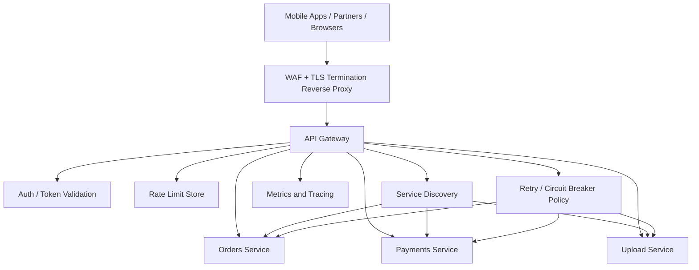

# API Gateway, Reverse Proxy & Rate Limiting

> An API gateway is the control point in front of your services that routes, protects, shapes, and limits traffic so every backend does not have to solve the same edge problems alone.

---

## The Problem

Imagine you run a fintech platform with a public mobile API, partner APIs for merchants, and internal admin APIs for support staff. Six months ago the architecture was simple: mobile apps talked directly to a few backend services, each service handled its own authentication, and nobody thought much about abuse because traffic was only 800 requests per second.

Now the product has grown. Peak traffic is closer to 35,000 requests per second. One partner accidentally ships a bug that retries failed calls in a tight loop and suddenly sends 12,000 requests per second from a single tenant. Another client starts scraping your pricing API aggressively. Meanwhile, your auth logic has drifted. One service validates JWTs correctly, another forgets to check audience, and a third still trusts an old internal header because somebody copied code from a legacy app two years ago.

Routing is becoming a mess too. The mobile team wants `/v2/payments/*` sent to a new service. File uploads should go to a different path because they need larger body limits. Admin requests should require stronger authentication and stricter audit headers. Some partners need per-tenant quotas. Others pay for higher throughput. Every team keeps adding this logic into its own service because "it was faster," so now basic concerns like TLS termination, IP allowlists, request size limits, header normalization, and circuit breaking are duplicated in ten places and implemented ten different ways.

Then an incident hits. One backend starts timing out on database calls. Clients retry aggressively. Because there is no centralized rate limiting, one noisy tenant consumes most of the shared capacity. Good users see latency jump from 90ms to 2.5 seconds. Error rates climb. Support asks a reasonable question: "Why can one bad client take down everyone else?"

This is the problem API gateways, reverse proxies, and rate limiting solve. They create a deliberate edge layer between clients and services. That layer decides where traffic goes, who is allowed in, which requests need rewriting, how much traffic each caller is allowed to send, when to reject or throttle, and how to keep overloaded backends from becoming full-system outages. Without that layer, your architecture does not just scale poorly. It becomes inconsistent, insecure, and unfair under pressure.

---

## Core Concept Explained

Think of this layer like the front desk, security gate, and traffic marshal of a large office building. Visitors do not wander directly into random rooms. They enter through one controlled point, show credentials, get routed to the correct floor, and are stopped if they try to flood the building with twenty people through a one-person badge. The office floors are your services. The front desk and security systems are the reverse proxy, API gateway, and rate limiter.

The terms overlap, which is why they confuse people. A **reverse proxy** is the broadest and oldest concept. It is a server that sits in front of other servers and forwards client requests to them. Clients talk to the proxy, not directly to the backend. NGINX, HAProxy, Envoy, and Cloudflare all act as reverse proxies. A reverse proxy can terminate TLS, add headers, compress responses, cache content, hide backend IPs, and retry failed upstream calls. At minimum, it is a traffic intermediary.

An **API gateway** is a reverse proxy with product and policy brains added on top. It usually understands APIs as first-class objects. It can enforce authentication, route by path or host, apply tenant-specific quotas, transform requests and responses, publish metrics by API key, validate schemas, and centralize cross-cutting rules that would otherwise be duplicated in every service. If a reverse proxy is "traffic forwarding infrastructure," an API gateway is "traffic forwarding infrastructure plus API management and policy."

In practice, modern gateways are almost always built on reverse proxy technology. Envoy can be used as a raw reverse proxy, as a service mesh data plane, or as the engine behind a gateway product. Kong is an API gateway built on NGINX. AWS API Gateway behaves like a managed gateway product. The implementation substrate and the product surface are not the same thing.

### Routing and protocol handling

One of the gateway's most visible jobs is routing. An L7 gateway can inspect HTTP hostnames, paths, headers, methods, cookies, or even JWT claims to decide where a request should go. `/v1/orders/*` may route to the legacy monolith. `/v2/orders/*` may route to a new service. Requests with `Host: admin.example.com` may go through stricter auth middleware. File uploads may route to a service with larger body limits and longer timeouts.

Request transformation is part of the same story. The gateway may normalize headers, inject `X-Request-Id`, add `X-Forwarded-For`, convert external auth tokens into internal identity context, strip untrusted client-supplied headers, or rewrite paths before forwarding. That sounds minor until you realize ten backend teams no longer need to implement those chores separately.

### Authentication and authorization

Gateways are commonly the first policy checkpoint. They validate API keys, OAuth tokens, mTLS client certs, JWT signatures, or signed partner headers before the backend sees a request. This does not mean backends should blindly trust everything forever, but it does mean expensive cryptographic validation and basic access control can be centralized. A gateway may reject a request in 2 to 5ms instead of letting it burn 100ms of backend CPU before discovering the caller was never authorized.

Good gateways also distinguish authentication from authorization. Authentication answers, "Who are you?" Authorization answers, "What are you allowed to do?" A partner with a valid token might still not have access to the `/admin/refunds` API. Centralizing those rules helps because it avoids one service forgetting a permission check while another remembers.

### Reverse proxy versus service discovery

Another reason gateways matter is that they hide backend movement. If a service autoscaling group grows from 6 to 24 instances, or a Kubernetes deployment replaces pods every few minutes, clients should not care. The gateway integrates with service discovery or load balancers so backend membership can change without forcing clients to learn new addresses. This is especially important for mobile apps and third-party partners, which may cache endpoints for months.

### Rate limiting and quotas

Rate limiting is where fairness enters the picture. Without it, one client can monopolize shared capacity through malice, bugs, or success. A rate limiter answers questions like:

- How many requests per second can one API key send?
- How many writes per minute can one tenant perform?
- How many expensive queries should one user be allowed to make concurrently?
- What should happen when they exceed the limit: reject, delay, or degrade?

The two classic algorithms are **token bucket** and **leaky bucket**.

In a token bucket, tokens are added to a bucket at a fixed rate, say 100 tokens per second with a burst size of 200. Each request consumes a token. If tokens remain, the request is allowed immediately. If the bucket is empty, the request is rejected or delayed. This is great when you want steady average rate plus controlled bursts. An API client can make a short burst of 200 requests, but it cannot sustain that forever.

In a leaky bucket, requests arrive into a queue-like bucket and drain out at a steady rate. That smooths traffic more aggressively. It is useful when downstream systems need steadier flow and bursts are harmful. The tradeoff is latency. You may end up delaying requests that could otherwise have been served immediately.

There are also fixed-window and sliding-window counters. A fixed window is simple, like "1,000 requests per minute." The problem is boundary burstiness. A client can send 1,000 requests at 12:00:59 and another 1,000 at 12:01:01. A sliding window reduces that cliff by counting over rolling intervals, often at the cost of more state and computation.

### Multi-tenant guardrails

Senior teams do not just limit by IP. They limit by tenant, user, endpoint class, and sometimes by cost. A `GET /status` request is not the same as a GraphQL query that fans out into 50 database reads. Shopify's GraphQL API is a good example of cost-based limiting: more expensive queries consume more of a bucket. That is often smarter than naive request counting because it aligns the limit with actual backend pain.

### WAF, retries, and resilience

Gateways also sit in a useful spot for basic security and resilience controls. A WAF-style rule can reject obviously malicious payloads, block oversized bodies, or rate-limit credential stuffing attempts before they hit application code. Retries and circuit breakers can be applied here too, but carefully. A gateway that blindly retries `POST /payments` without idempotency can double-charge customers. A circuit breaker that opens when a backend error rate spikes can shed load and fail fast instead of amplifying an outage through long timeout queues.

The practical takeaway is simple: a gateway is not just a fancy router. It is where traffic policy, fairness, identity, and operational safety become consistent across your platform.

---

## Architecture Diagram

### Mermaid Diagram

### Diagram Walkthrough

Starting from the far left, clients include mobile apps, partner systems, and browsers. They do not talk directly to backend services. They first hit the edge reverse proxy, which is the public-facing layer responsible for terminating TLS, enforcing basic WAF rules, and hiding the private network layout of the services behind it. This is where obviously bad traffic can be dropped early, before it consumes application resources.

After that, traffic moves to the API gateway. The gateway is the policy brain of the diagram. It decides which backend should receive the request, whether the caller is authenticated, whether the request is within quota, what headers need to be injected, and how to record the request for observability. The gateway is where `/v1/orders/*` may go to Orders Service, `/payments/*` goes to Payments Service, and large file uploads are steered to Upload Service with different body-size and timeout rules.

The first request flow is a normal authenticated API call. A partner sends `POST /payments`. The reverse proxy terminates TLS and forwards the request to the gateway. The gateway calls the Auth component or validates the JWT locally, then checks the Rate Limit Store for that tenant's token bucket state. If the tenant is still within quota, the gateway consults service discovery to find healthy Payments Service instances, applies retry and circuit-breaker policy, forwards the request, and emits metrics and tracing data.

The second request flow is an abusive or buggy client. Suppose one integration starts sending 5,000 requests per second even though its contract allows 200. The reverse proxy still accepts the TCP and TLS connection, but the gateway's rate limiter checks the tenant's bucket and finds it empty. Instead of sending the flood downstream, the gateway returns a `429 Too Many Requests` response immediately, often with `Retry-After` headers. That protects Orders, Payments, and Uploads from unfair load generated by one tenant.

Service discovery sits off to the side because backend instances are not static. Orders Service may have 8 healthy instances right now and 14 ten minutes later. The gateway does not hard-code addresses. It discovers healthy upstreams dynamically. Metrics and tracing are also attached to the gateway because this is the ideal place to measure per-tenant rate, upstream latency, rejection counts, and retry behavior. The gateway therefore becomes both the traffic controller and one of the best observability points in the whole system.

---

## How It Works Under the Hood

At the protocol level, most API gateways are HTTP-aware reverse proxies. They accept a client TCP connection, often terminate TLS there, parse the HTTP request, and then decide whether to reuse or open an upstream connection to the backend. Reusing upstream keep-alive connections matters a lot. If the gateway had to perform a full TCP and TLS handshake to a backend for every request, it would waste latency and CPU. Connection pooling lets one gateway node handle tens of thousands of requests per second efficiently while keeping backend connection churn under control.

Rate limiting is usually implemented with a fast shared state store plus atomic operations. Redis is common because `INCR`, Lua scripts, and expirations make counters and token buckets practical at high speed. For example, a token bucket limiter might store `tokens_remaining` and `last_refill_timestamp` per API key. On each request, a small atomic script computes how many tokens should have refilled since the last request, caps the bucket at the burst size, subtracts one token if available, and returns allow or reject. With Redis round-trip latency around 0.5 to 1ms in-region, that is usually acceptable. For very high rates, gateways also use local in-memory shadow buckets with periodic synchronization to reduce central-store pressure.

Leaky bucket implementations often behave more like queues or paced counters. Instead of allowing all currently available tokens instantly, the limiter calculates whether the arrival rate exceeds the steady drain rate and either delays or rejects excess requests. That can smooth traffic into fragile downstreams, but it means the limiter itself becomes part of your latency story. If your SLO is p95 under 150ms, a limiter that adds 80ms of queueing might be unacceptable.

Header handling is a surprisingly important security detail. If a client can supply `X-Forwarded-For` or `X-User-Id` and the gateway forwards it blindly, internal services may trust forged identity or source information. Mature gateways strip untrusted hop-by-hop and identity headers, then add canonical versions after authentication and routing decisions are complete. They also stamp trace IDs, tenant IDs, and request IDs so downstream systems can correlate logs and traces consistently.

Retries and circuit breakers also need careful semantics. The gateway must know whether an operation is safe to retry. `GET` is often idempotent. `POST /payments` often is not, unless the API contract requires an idempotency key. Gateways frequently use retry budgets, per-try timeouts, and only retry network or 502/503-style transport failures, not arbitrary application errors. Circuit breakers track rolling error rates or consecutive failures and stop sending traffic to clearly unhealthy upstreams for a cooldown period. That protects backends from retry storms and keeps queue buildup under control.

Service discovery under the hood can come from DNS, Kubernetes endpoints, Consul, xDS, or cloud target groups. The gateway needs an eventually fresh view of which instances are healthy and what weights they should receive. Good gateways also support outlier detection and passive health signals so one backend that is technically "up" but returning slow 5xx-heavy responses can be ejected before a full incident develops.

Failure modes are where this layer gets real. If the rate limit store goes down, do you fail open and risk overload, or fail closed and block legitimate traffic? If auth is slow, do you queue, degrade, or reject? If the gateway cluster itself is undersized, you have concentrated too much control in one hot layer. That is why production gateways are deployed as horizontally scaled stateless fleets with local caching, clear timeout budgets, and strong observability on rejection reasons, upstream latency, and per-tenant load.

---

## Key Tradeoffs & Limitations

**Choose a reverse proxy alone when your needs are mostly transport and routing.** If you only need TLS termination, header normalization, compression, and simple upstream balancing, a plain reverse proxy is usually enough. It is simpler to operate and easier to reason about. Choose a full API gateway when you need per-tenant auth, quotas, developer-facing API policy, version routing, or centralized transformation logic.

**Centralization improves consistency but creates a powerful choke point.** A gateway makes auth, routing, and rate limiting uniform across teams. That is great. It also means a bad gateway rule can break every service at once. Operational maturity matters here: staged rollouts, config validation, and clear dashboards are not optional.

**Rate limiting protects fairness, but poorly chosen limits create artificial outages.** A bucket set too low turns legitimate launches into self-inflicted incidents. A bucket set too high is basically theater. Choose per-tenant and per-endpoint limits based on backend capacity, business tiers, and request cost, not round numbers chosen in a meeting.

**Gateways do not remove the need for backend authorization and resilience.** You still need defense in depth. If a backend trusts any internal caller blindly, one misrouted request or compromised service can bypass intent. Likewise, a gateway cannot save a badly designed backend that does N+1 queries, ignores timeouts, or explodes under modest concurrency.

**Do not add a heavyweight gateway too early if your system is tiny.** A startup with one API service and a handful of trusted clients may get more value from a straightforward reverse proxy plus application-level auth than from a full gateway platform. But once multiple teams are repeatedly solving the same edge concerns, centralization pays for itself quickly.

---

## Common Misconceptions

**"API gateway and load balancer mean the same thing."** They overlap, but they are not identical. A load balancer spreads traffic across healthy capacity. A gateway does that plus higher-level API concerns like authentication, quotas, request transformation, and tenant policy. The confusion exists because many gateway products include load balancing under the hood.

**"Rate limiting is just about blocking attackers."** In reality, many rate-limit incidents come from legitimate clients with retry bugs, partner misuse, or one tenant's success outgrowing the assumptions of shared infrastructure. Rate limiting is a fairness and stability tool as much as a security control. People miss this because security teams often own the first version of it.

**"If the gateway validates auth, backends do not need authorization checks anymore."** Centralized auth reduces duplication, but blindly trusting the edge is dangerous. Internal calls, misconfigurations, and privilege changes still need protection closer to business logic. The misconception survives because teams understandably want to simplify duplicated security code.

**"A `429` means the system is broken."** Sometimes it means the system is working exactly as designed. Rejecting excess requests quickly is often better than letting all requests queue until everyone times out. This misconception exists because clients experience rejection as failure, even when it is intentionally preserving overall service health.

**"Retries at the gateway always improve reliability."** Retries can help transient network failures, but they can also multiply load during incidents and duplicate non-idempotent operations. Smart retries require idempotency awareness, budgets, and strict timeouts. The myth survives because "just retry" sounds harmless in happy-path thinking.

---

## Real-World Usage

**Netflix (Zuul):** Netflix publicly described Zuul as the edge gateway for routing, authentication, canary control, and resilience policy in front of a huge fleet of backend services. One of the big lessons from Zuul is that the edge layer is not just a dumb proxy. It applies filters, routes traffic during deployments, and gives one place to add cross-cutting control without baking that logic into every microservice.

**Shopify (GraphQL Admin API limits):** Shopify documents a leaky-bucket-style rate limit for its GraphQL Admin API where queries consume cost points rather than identical flat request units. That is a very mature gateway pattern because it ties the limit to backend work, not just HTTP count. A cheap query and an expensive query should not consume the same budget if the goal is protecting shared capacity fairly.

**Cloudflare:** Cloudflare's core business is effectively a globally distributed reverse proxy network with WAF, rate limiting, bot protection, caching, and traffic steering built into the edge. The interesting systems lesson is that protection works best close to the client. Rejecting malicious or excessive traffic at the nearest edge POP is far cheaper than letting it traverse the internet and hit your origin services first.

---

## Interview Angle

**Q: When would you use a reverse proxy without a full API gateway?**
**How to approach it:**
- Start by separating simple traffic mediation from product-level API policy.
- Mention cases where TLS termination, compression, and upstream routing are enough.
- Explain that small systems often do not need developer portals, quotas, schema mediation, or tenant-aware controls yet.
- Show judgment by framing the gateway as a complexity trade, not an automatic upgrade.

**Q: How would you design rate limiting for a multi-tenant API?**
**How to approach it:**
- Clarify the unit of fairness first: IP, user, API key, tenant, endpoint, or request cost.
- Compare token bucket, leaky bucket, and sliding window approaches based on burst tolerance and smoothness needs.
- Discuss where state lives, how to keep the limiter fast, and what headers or error codes clients should receive.
- Mention premium tiers, noisy neighbors, and backend-specific limits as real follow-up tradeoffs.

**Q: What can go wrong if the gateway retries upstream requests?**
**How to approach it:**
- Start with idempotency. Safe retries depend on the API contract, not just HTTP transport.
- Discuss retry storms, tight timeout stacks, and the need for retry budgets and circuit breakers.
- Mention that retries should usually target transient failures, not arbitrary business-level 4xx/5xx responses.
- Strong answers connect gateway behavior to downstream overload during incidents.

**Q: Why centralize authentication and quotas at the edge?**
**How to approach it:**
- Explain consistency and efficiency: one place to validate tokens and one place to enforce fairness.
- Mention that it reduces duplicated code and makes policy changes faster.
- Balance that by saying backends still need defense in depth for authorization and sensitive operations.
- Tie the answer to observability: centralization gives better metrics by tenant and endpoint.

---

## Connections to Other Concepts

**Concept 02 - Load Balancing Deep Dive** sits directly underneath this topic. Most API gateways are also L7 reverse proxies and often perform upstream balancing, health checking, and traffic draining. The difference is that this concept adds policy and tenant control on top of those traffic-distribution mechanics.

**Concept 05 - API Design Patterns** determines what the gateway is protecting and shaping. REST, gRPC, GraphQL, and webhooks have different needs around versioning, request size, idempotency, and quota design, so the gateway policy should reflect the API style instead of pretending every endpoint behaves the same way.

**Concept 19 - Fault Tolerance Patterns** is tightly connected because retries, circuit breakers, timeouts, and graceful degradation often start at the gateway. A misconfigured edge retry policy can amplify an outage, while a well-tuned one can isolate a struggling dependency before it drags the rest of the system down.

**Concept 20 - Idempotency, Deduplication & Exactly-Once Semantics** matters whenever the gateway is allowed to retry or when clients retry after receiving `429` or `503` responses. If write APIs are not idempotent, seemingly harmless gateway behavior can create duplicate charges, orders, or messages.

**Concept 21 - Monitoring, Observability & SLOs/SLAs** becomes critical once the gateway is in place because this layer is the best vantage point for tracking per-tenant rate, auth failures, rejection counts, upstream latency, and saturation. A gateway without strong observability is just a bigger blast radius with better marketing.
