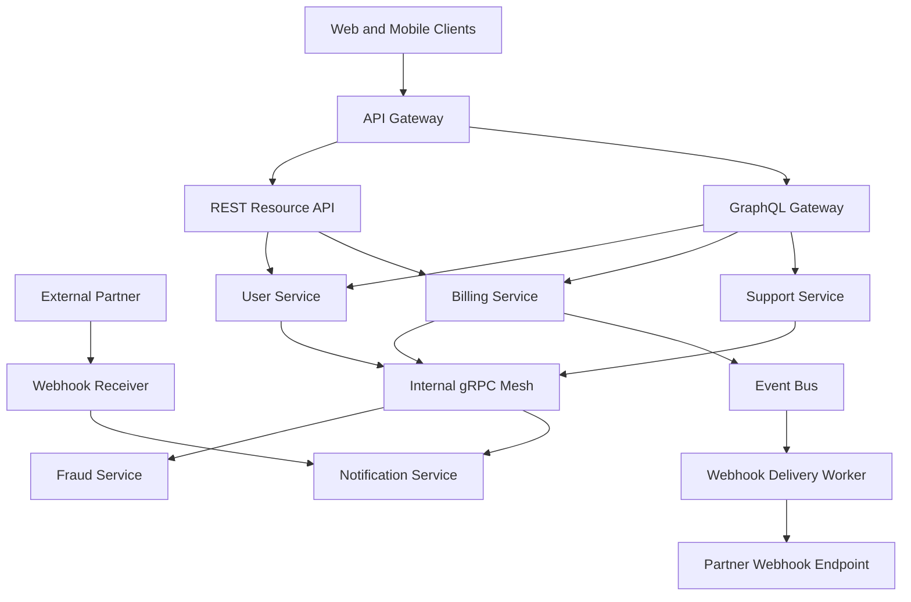

# API Design Patterns

> API design patterns are the shapes and contracts we use to expose data and behavior so clients can integrate safely, efficiently, and without turning every product change into a breaking change.

---

## The Problem

Imagine a fast-growing B2B SaaS company with one mobile app, one web dashboard, several internal services, and a few hundred third-party integrations. At first, the team exposes a handful of JSON endpoints and moves quickly. A customer profile screen calls `/users/123`, the billing page calls `/invoices`, and a webhook posts `payment_succeeded` events to partners. For a few months, everything feels simple.

Then product complexity arrives. The mobile team wants one screen that combines user profile, subscription status, invoices, feature flags, and support tickets. The frontend now makes six HTTP calls, and on a 4G network the page takes 1.8 seconds to become interactive. Meanwhile, the internal fraud service needs very low-latency machine-to-machine calls and is wasting CPU serializing large JSON payloads for fields it never uses. External partners want notifications, but half of them cannot receive traffic reliably, so webhook retries create duplicates and support tickets. The platform team also wants to rename fields and split one service into three, but fears breaking every client at once.

This is the problem API design patterns solve. An API is not just a URL and a JSON body. It is a long-lived contract between producers and consumers with real performance, compatibility, and operational consequences. If you pick the wrong pattern, clients overfetch or underfetch, latency grows through chatty round trips, schema changes become land mines, and reliability problems show up as customer-visible bugs. A "simple" API can quietly turn into the slowest and hardest-to-evolve part of the system.

The painful part is that no single pattern wins everywhere. REST is excellent for broad interoperability and resource-oriented systems. gRPC is fantastic for typed internal RPC and streaming. GraphQL shines when clients need flexible querying across multiple data sources. Webhooks are useful when the server needs to notify an external consumer asynchronously, but they come with delivery, idempotency, and versioning pain. Senior engineers do not ask, "Which one is best?" They ask, "Which contract shape fits this client, this latency budget, this evolution path, and this failure model?"

---

## Core Concept Explained

Think of API design like running a shipping company. REST is a standard catalog with clearly labeled packages and predictable forms. gRPC is a private high-speed conveyor belt between your own warehouses where both sides agree on exact package formats. GraphQL is a custom order desk where the client says exactly which items it wants in one trip. Webhooks are outbound notifications saying, "Your shipment changed state; come react to it." All four move information, but they optimize for different kinds of work.

### REST

REST is the default pattern most engineers learn first because it maps well to web primitives. You expose resources such as `/users`, `/orders`, and `/subscriptions`, and clients interact with them through HTTP verbs like `GET`, `POST`, `PUT`, `PATCH`, and `DELETE`. A good REST API uses HTTP semantics properly: `GET` is safe and cacheable, `POST` creates or triggers work, `PATCH` partially updates, status codes convey meaning, and headers carry metadata like pagination cursors or idempotency keys.

REST works well when the domain is resource-oriented and many different clients need broad compatibility. Every language has an HTTP client. Proxies, CDNs, API gateways, and observability tools understand it naturally. JSON payloads are human-readable, which helps debugging and onboarding. For external APIs, that matters a lot. Stripe, GitHub, and Twilio built ecosystems largely because developers can inspect requests with `curl` and understand responses quickly.

The downside is chattiness and fixed response shape. A mobile screen that needs six related resources may need six round trips unless you design aggregation endpoints. JSON is also verbose. A 2KB JSON payload might shrink to 700 to 1,200 bytes as protobuf depending on field names and structure. At scale, that becomes real bandwidth and CPU cost.

### gRPC

gRPC is an RPC framework that usually runs over HTTP/2 and uses Protocol Buffers for schema definition and serialization. Instead of saying "here is a URL for a resource," you define methods like `GetUserProfile`, `CreateInvoice`, or `StreamEvents`, each with typed request and response messages. Client and server code can be generated from `.proto` files, which gives strong type safety and consistent schemas across languages.

gRPC is especially strong for internal service-to-service communication. HTTP/2 multiplexing allows many requests over one connection, reducing head-of-line blocking compared with opening many separate HTTP/1.1 connections. Binary protobuf payloads are smaller and faster to parse than large JSON documents. In practice, internal calls that carry structured data often see 20% to 50% lower payload size and noticeable CPU savings when moving from JSON REST to protobuf.

gRPC also supports four interaction styles: unary request-response, server streaming, client streaming, and bidirectional streaming. That makes it a good fit for internal control planes, recommendation pipelines, or log and metrics fan-in where messages flow continuously rather than as isolated request-response pairs. The tradeoff is ergonomics. Browsers do not talk to raw gRPC as naturally as backend services do, debugging binary payloads is harder, and public API consumers are much less likely to want `.proto` tooling.

### GraphQL

GraphQL flips the contract shape. Instead of the server defining one fixed response per endpoint, the client sends a query describing the fields it wants. That is powerful when different clients need different slices of the same logical graph. A mobile app may ask for `user { id name avatar }` while an admin dashboard asks for `user { id name avatar invoices tickets permissions }`. Both hit one endpoint, but the response shape is tailored to the client.

This solves overfetching and underfetching elegantly. It also centralizes schema composition. A GraphQL gateway can stitch data from user, billing, support, and recommendation services into one client-facing query. For frontend teams, that can cut multiple network trips into one. But GraphQL shifts complexity to the server. Resolver design matters, batching matters, and careless implementation creates the N+1 query problem where one top-level query fans into dozens or hundreds of backend calls. Query cost control matters too. A client can ask for a deeply nested graph that is valid in schema terms but expensive in operational terms.

GraphQL is best when client flexibility is a first-order requirement and the organization can invest in schema governance, caching strategy, and resolver performance discipline. It is not a free upgrade over REST. It is a deliberate trade: less client rigidity in exchange for more server-side sophistication.

### Webhooks

Webhooks are outward asynchronous callbacks. Instead of a client polling `GET /payments/123` every 10 seconds asking whether a payment settled, the platform sends an HTTP POST to the consumer when `payment.succeeded` happens. This is the right shape when the server has new information and the consumer needs to react later. Stripe, Shopify, GitHub, and Slack all rely heavily on webhook ecosystems for this reason.

The trap is assuming a webhook is "just an HTTP request." It is actually a distributed delivery system. Receivers may be down. Networks fail. Retries create duplicates. Events arrive out of order. Signatures need verification. Consumers need idempotency because they may process the same event three times if the sender does exponential backoff for 5xx or timeout responses. If you do not model webhooks as at-least-once event delivery, you will build a fragile integration surface.

### Cross-cutting design choices

No matter which pattern you choose, several design concerns keep showing up.

**Idempotency** means a repeated request should not accidentally create repeated side effects. In external payment APIs, this is non-negotiable. A client timeout after `POST /charges` does not tell the caller whether the server created the charge. If the client retries, the server needs an idempotency key so both requests collapse to one logical operation.

**Pagination** matters for any list endpoint or query that can grow. Offset pagination is simple but degrades on large datasets and can drift under concurrent writes. Cursor pagination is harder to implement but scales better and is more stable for feeds and event lists.

**Versioning and schema evolution** decide how safely the API can change. REST often uses additive field evolution plus date-based or header-based versions when breaking changes are unavoidable. Protobuf encourages field number stability, reserving removed field numbers, and additive schemas. GraphQL typically prefers additive evolution and deprecation rather than hard versioned endpoints. The principle is the same everywhere: do not break old clients casually.

The senior view is that API design is not a style debate. It is contract design under latency, compatibility, and operational constraints.

---

## Architecture Diagram

### Mermaid Diagram

### Diagram Walkthrough

Starting from the top left, web and mobile clients do not talk directly to every backend service. They first go through the API Gateway. The gateway is the front door where authentication, routing, quotas, and request normalization usually happen. Its job in this diagram is not to implement business logic. Its job is to route the caller toward the API contract shape that makes sense for that caller.

From the gateway, one path goes to the REST Resource API. This is the conventional endpoint layer for clients that want predictable resource-based interactions such as `GET /users/123` or `POST /subscriptions`. The REST API forwards requests to the underlying services such as User Service or Billing Service. This path is usually the easiest for third-party integrators and for simple clients that value stable, debuggable HTTP interactions.

The second path from the gateway goes to the GraphQL Gateway. This layer is useful when the client wants a custom-shaped response built from several services in one request. In the diagram, GraphQL fans out to User Service, Billing Service, and Support Service. A profile page can ask for account details, invoices, and support tickets in one query, and the GraphQL layer assembles one response instead of forcing the client to orchestrate multiple calls itself.

Inside the service layer, User Service, Billing Service, and Support Service all connect to the Internal gRPC Mesh. This is where typed, low-latency service-to-service communication happens. For example, Billing Service may call Fraud Service through gRPC during authorization because it wants a compact binary payload, generated clients, deadlines, and possibly streaming for batched risk features. Notification Service may also sit behind the gRPC mesh for fast internal calls.

The event path starts when Billing Service publishes state changes to the Event Bus. A payment success or subscription renewal event is placed on the bus rather than sent synchronously to every external consumer. The Webhook Delivery Worker consumes those events, applies retry and signing logic, and sends outbound HTTP POST calls to the Partner Webhook Endpoint. This separation is critical because external consumers are not reliable enough to sit on the synchronous request path.

There is one more flow shown on the left side: an External Partner can send inbound webhooks to the Webhook Receiver. That receiver verifies signatures, validates payload shape, and then forwards the event to Notification Service or another internal handler. So the diagram contains two important scenarios. In the request-response scenario, clients enter through the gateway and are routed to REST or GraphQL, with internal service work handled over gRPC. In the event-driven scenario, state changes go onto the event bus and are delivered outward through webhook workers, while inbound partner events enter through a verified receiver and are processed asynchronously.

---

## How It Works Under the Hood

REST mostly rides on HTTP semantics, so its "under the hood" behavior is tightly connected to caches, proxies, and status codes. `GET` requests can be cached by browsers or CDNs when headers allow it. `ETag` and `If-None-Match` can save bandwidth by turning a full response into a 304 round trip. That makes REST particularly strong for public-facing read APIs where interoperability matters as much as raw speed. The implementation risk is often not protocol-level complexity but contract sprawl: too many one-off endpoints, inconsistent naming, and unbounded list responses.

gRPC is more protocol-heavy. It typically uses HTTP/2 frames, multiplexed streams, and protobuf messages with numbered fields. Field numbers matter because they are the stable wire identity. If you remove field 7 and later reuse field 7 for something else, an older client can deserialize nonsense. That is why protobuf evolution rules say to reserve removed field numbers and prefer additive change. In high-throughput internal systems, protobuf serialization can be materially cheaper than JSON. A JSON document with repeated field names and nested strings may take significantly more bytes on the wire and more CPU to parse than the equivalent protobuf message, especially at tens of thousands of requests per second.

GraphQL's hardest under-the-hood problem is execution planning. One client query may look neat on the outside but explode inside the server if resolvers naively fetch per field or per child object. The classic N+1 problem is a query that loads 100 users and then runs 100 separate billing lookups and 100 separate support lookups. The fix is batching and caching at resolver time, often with tools like DataLoader or domain-specific aggregation layers. Query depth limits, field cost scoring, and persisted queries are also operational defenses. Without them, one clever client can generate expensive recursive queries that saturate backend dependencies.

Webhooks look simple because they use HTTP, but their real mechanics resemble a message queue with signatures. The sender stores an event, signs it, attempts delivery, and retries with backoff if it gets a timeout or 5xx. Typical retry windows range from minutes to days depending on product needs. The receiver must verify authenticity, usually with an HMAC signature and timestamp, reject replays outside an allowed window, and process the event idempotently. That often means storing event IDs in a dedup table or durable log before applying side effects. If a partner's endpoint returns `200 OK` before its own database commit finishes, the sender thinks delivery succeeded even if the partner loses the event internally. That is why mature receivers enqueue work before acknowledging.

Streaming deserves special mention because it changes API shape from isolated calls to long-lived channels. gRPC server streaming or bidirectional streaming works well for internal systems that exchange many small messages over time, such as telemetry or control updates. GraphQL subscriptions and SSE can provide client-facing real-time updates, but they introduce connection lifecycle, backpressure, and reconnection concerns. Streaming is powerful when the message count is high or latency matters, but wasteful if the workload is still fundamentally coarse request-response.

Finally, idempotency and backward compatibility are not add-ons. They are the mechanics that make retries and upgrades safe. A payment API without idempotency is a financial incident waiting to happen. A protobuf schema that renumbers fields casually is a deployment trap. An API contract is easy to draw and hard to evolve, which is exactly why design discipline matters.

---

## Key Tradeoffs & Limitations

**Choose REST when broad compatibility, debuggability, and HTTP-native behavior matter most.** If you are building a public API for thousands of external developers, REST plus JSON is often the boring winning choice. It works through proxies, is easy to inspect, and fits existing tooling. Choose gRPC instead when both sides are your systems, latency budgets are tighter, and typed contracts plus streaming matter more than curl-friendliness.

**Choose GraphQL when clients need query flexibility and the organization can afford gateway complexity.** GraphQL can dramatically improve frontend productivity for screens that combine many data sources. But if your team does not invest in schema ownership, resolver batching, and query cost controls, GraphQL becomes an expensive abstraction that hides poor backend behavior. For a small product with one client and stable screens, a few well-designed REST endpoints can be simpler and safer.

**Choose webhooks when the producer needs to notify consumers asynchronously, not when you need guaranteed synchronous completion.** Webhooks are excellent for "something happened; react later" flows. They are a poor fit when the caller needs an immediate guaranteed outcome. If the integration requires strong acknowledgement and ordering, a polling API, partner-facing queue, or explicit fetch-after-event design may be better.

**Every pattern still needs versioning and compatibility discipline.** REST can break clients with renamed JSON fields. gRPC can break clients by reusing protobuf field numbers. GraphQL can break clients by removing fields without a deprecation window. Webhooks can break consumers by changing event shape or delivery semantics silently.

If your application has fewer than a handful of clients and latency is not a bottleneck, mixing every API style at once usually creates complexity for no gain. Start with the simplest contract that fits the actual consumers, then add specialized patterns only when a clear workload demands them.

---

## Common Misconceptions

**"REST is old, so gRPC or GraphQL must be better."** Many people mistake newer tooling for a universally better architecture. In reality, REST remains the best fit for many public APIs because humans can debug it easily, HTTP infrastructure understands it natively, and external consumers value familiarity more than binary efficiency. The misconception exists because internal platform teams often publish performance wins from gRPC or GraphQL without mentioning that their environment is controlled and their clients are mostly first-party.

**"GraphQL eliminates overfetching, so it automatically improves performance."** GraphQL can reduce client-side overfetching, but that does not mean the server does less work. A poorly implemented GraphQL resolver layer can create many more backend calls than a single optimized REST endpoint. The misconception seems true because the network response looks leaner from the client's perspective, while the server's hidden work gets ignored.

**"gRPC is only about speed."** Speed is important, but gRPC's real value is typed contracts, generated clients, deadlines, rich streaming support, and consistent service definitions across languages. If the only reason you want gRPC is "it is faster," you may ignore operational downsides like weaker browser ergonomics and more difficult ad hoc debugging. The misconception exists because performance benchmarks are easier to market than schema governance benefits.

**"Webhooks are reliable because they use HTTP."** HTTP tells you how a request was transported, not whether the consumer processed the event exactly once or in order. Webhooks are fundamentally at-least-once delivery and need signatures, retries, deduplication, and dead-letter handling. People believe otherwise because the happy path demo shows one POST request and one 200 response.

**"Versioning means adding `/v2` and moving on."** Path versioning is only one tool, and overusing it often multiplies maintenance burden. Good API evolution is mostly additive change, deprecation policy, and compatibility testing. The misconception exists because explicit version numbers feel clean, while the harder work of long-term contract stewardship is less visible.

---

## Real-World Usage

**Stripe** is one of the clearest examples of pragmatic REST done well. Their public API is JSON over HTTP, they use idempotency keys for mutation safety, and they rely heavily on webhooks so merchants do not have to poll for every payment lifecycle event. The design choice is deliberate: Stripe optimizes for external developer experience first, which is why inspectable HTTP contracts matter more than squeezing every last byte off the wire.

**GitHub** runs both REST and GraphQL because different client problems justify different contract shapes. Their REST API remains important for ecosystem compatibility and simple resource access, while their GraphQL API helps clients ask for nested repository, issue, and user data in one query. That dual approach is a good reminder that API style should follow consumer needs rather than ideology.

**Google** uses gRPC heavily for internal service communication because typed protobuf contracts, HTTP/2 multiplexing, and streaming fit large service meshes well. At that scale, saving payload size, standardizing schemas across languages, and using generated stubs reduce both latency and integration drift. The lesson is not that everyone should expose gRPC publicly. The lesson is that internal machine-to-machine APIs often have very different priorities from external developer APIs.

**Slack** is a strong webhook example. Apps integrate by receiving event callbacks and slash-command or interaction payloads rather than constantly polling Slack for every change. That works because the producer has the freshest state and can push updates outward, but it also means integrators must verify signatures, handle retries, and make handlers idempotent.

---

## Interview Angle

**Q: When would you choose REST over GraphQL for a new product API?**
**How to approach it:**
- Start with the client landscape: one client with stable needs versus many clients with different data requirements.
- Discuss debuggability, cacheability, tooling familiarity, and external developer ergonomics as reasons REST often wins.
- Contrast that with GraphQL's strengths for query flexibility and aggregation across domains.
- A strong answer says the choice depends on consumer variability, not on which technology is more fashionable.

**Q: How would you prevent duplicate side effects when a client retries an API call?**
**How to approach it:**
- Bring up idempotency keys immediately for non-idempotent mutations like payment creation or order placement.
- Explain storage of the request fingerprint or result keyed by idempotency token and a bounded retention window.
- Mention that retries happen because of timeouts and ambiguous failures, not just client bugs.
- Strong answers also separate transport retry safety from business-operation deduplication.

**Q: Why might a GraphQL API become slower than a REST API?**
**How to approach it:**
- Explain resolver fan-out and the N+1 query problem.
- Discuss batching, caching, and query cost limits as mitigation techniques.
- Mention that one HTTP request does not guarantee one cheap backend execution path.
- Show that you understand performance must be measured end-to-end, not only by counting frontend round trips.

**Q: What makes webhook design hard?**
**How to approach it:**
- Frame webhooks as at-least-once event delivery rather than simple outbound HTTP.
- Mention signatures, retries, duplicate delivery, out-of-order arrival, and receiver downtime.
- Talk about acknowledging quickly after durable enqueue, then processing asynchronously.
- Strong answers make idempotency and observability part of the webhook story, not optional extras.

---

## Connections to Other Concepts

**Concept 04 - API Gateway, Reverse Proxy & Rate Limiting** is the operational layer that often sits in front of these patterns. The gateway decides which requests reach REST endpoints, GraphQL entry points, or webhook receivers, and it is usually where auth, quotas, and request shaping happen.

**Concept 13 - Synchronous vs Asynchronous Communication Patterns** explains why REST, gRPC, and GraphQL usually sit in the synchronous camp while webhooks are an asynchronous callback model. Understanding that split helps you choose the right latency and reliability expectations for each API shape.

**Concept 16 - Real-time Communication** builds on the streaming ideas introduced here. If unary REST calls are no longer enough and the client needs live updates, you start considering SSE, WebSockets, or streaming gRPC depending on whether the consumer is browser-facing or internal.

**Concept 20 - Idempotency, Deduplication & Exactly-Once Semantics** goes deeper on one of the hardest cross-cutting API concerns. Retries, webhook redelivery, and client timeouts all become safer only when idempotency and deduplication are designed explicitly.

**Concept 22 - Microservices vs Monolith** affects API style choice because internal service boundaries create demand for typed RPC, event callbacks, and schema evolution discipline. A monolith may survive comfortably with a few REST endpoints, while a large microservice estate often benefits from gRPC internally and a more curated external API surface.
