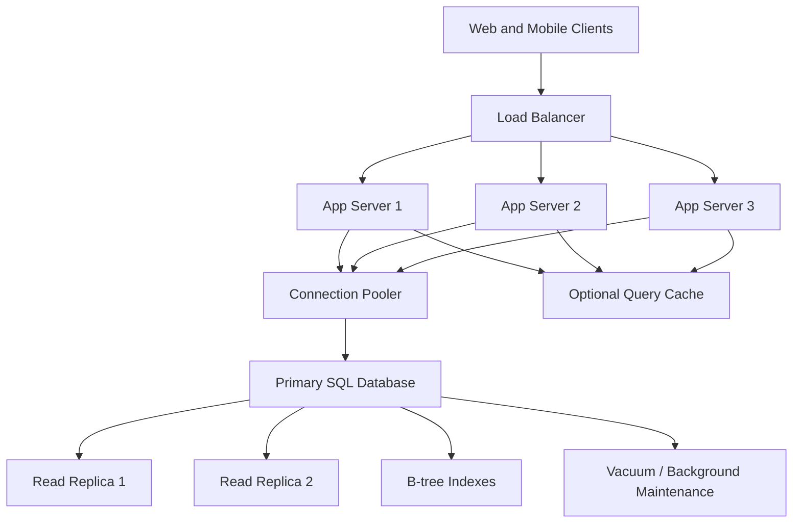

# SQL Databases at Scale

> SQL databases at scale are about making a relational database keep its correctness guarantees while query volume, dataset size, and concurrency grow far beyond what a default single-node setup can comfortably handle.

---

## The Problem

Imagine an e-commerce company running its entire order system on one PostgreSQL primary. For months, things look healthy. The database serves about 2,500 reads per second and 400 writes per second, the biggest table fits comfortably in memory, and most checkout queries complete in 8 to 15ms.

Then the business grows in three directions at once. The mobile app launches in three new countries, a recommendation engine starts joining against product, price, and inventory tables on every request, and finance adds heavier reporting queries during business hours. Now the database is handling 20,000 reads per second, 2,000 writes per second, and a much larger working set. Queries that were once index-friendly now trigger sequential scans on tens of millions of rows. Connection pools fill up. CPU sits above 90%. The p95 for checkout jumps from 40ms to 700ms, and a few bad joins push p99 into multi-second territory.

What makes SQL scaling painful is that the database is usually on the critical path of correctness. If a cache serves stale data, users may reload and recover. If an order write times out halfway through a transaction, or a hot row is locked for hundreds of milliseconds, money movement and inventory correctness are on the line. You cannot casually trade away consistency the way you might in a feed or analytics system.

This is why "SQL does not scale" is such a misleading statement. SQL databases absolutely scale, but not by accident. They scale when indexes reflect access patterns, when query plans stay predictable, when connection counts are controlled, when MVCC bloat is monitored, when writes are shaped carefully, and when you know the exact point where one primary stops being enough. Without that discipline, a relational database becomes the classic bottleneck everyone blames after growth. With it, one well-tuned PostgreSQL or MySQL cluster can handle tens of thousands of QPS and terabytes of data before you need more drastic architecture changes.

---

## Core Concept Explained

Think of a SQL database like a very strict warehouse. Every item has an exact shelf location, every movement is recorded, and every worker has rules about who can touch what and when. That strictness is why SQL databases are so valuable. You get transactions, constraints, joins, and a declarative language for asking complicated questions. The cost is that if the warehouse layout, worker flow, and lookup process are badly designed, the whole operation slows down at once.

### Start with access patterns, not tables

The beginner mental model for SQL design is "what entities do I have?" The production mental model is "what queries dominate the system?" A relational schema can look beautifully normalized on paper and still perform terribly if your hottest endpoint needs five joins, a sort, and a filter on an unindexed column. The database does not care that the model is elegant. It cares whether the plan can find rows quickly and whether concurrent work can happen without constant waiting.

That is why scaling SQL starts with the hot paths:

**Point reads** such as `SELECT * FROM users WHERE id = ?` are usually easy. With a primary-key B-tree index, these can stay under 1ms to 3ms on warm pages even with very large tables.

**Range queries** such as "orders from the last 30 days for merchant X" depend heavily on index order. A composite index on `(merchant_id, created_at DESC)` is very different from separate indexes on each column. One matches the access path directly. The other may still force expensive bitmap scans, sorting, or heap fetches.

**Join-heavy queries** are where many systems get into trouble. Joins are not bad by themselves. A properly indexed join between two medium tables can still run in a few milliseconds. The problem appears when row counts explode, statistics go stale, or the join order chosen by the planner no longer fits reality.

### Indexing is the first scaling lever

Relational databases are not slow because they are relational. They are slow when they are forced to read too much data. Indexes are how you avoid that.

A B-tree index works well for equality and ordered range lookups because it keeps keys sorted. PostgreSQL and MySQL both use B-trees for most default indexes. If your query filters on `email`, sorts by `created_at`, and only returns a few rows, the right composite index can cut a 400ms query down to 4ms by avoiding a huge scan plus sort.

Composite indexes matter because SQL queries usually filter on combinations of columns, not isolated ones. An index on `(tenant_id, status, created_at)` can support:

- `WHERE tenant_id = ?`
- `WHERE tenant_id = ? AND status = ?`
- `WHERE tenant_id = ? AND status = ? ORDER BY created_at DESC`

But it does not efficiently support `WHERE status = ?` alone, because B-trees follow left-prefix rules. That is a subtle point juniors often miss and seniors rely on constantly.

You also need to know when not to index. Every extra index speeds some reads but makes writes more expensive because inserts, updates, and deletes must maintain it. A table receiving 10,000 writes per second with eight secondary indexes can spend more time updating indexes than storing the row itself. That is why scaling SQL is always a read-write trade, not just a quest for more indexes.

### Query planning and why plans change under growth

SQL databases do not execute your query literally in the order you wrote it. They parse it, rewrite it, estimate row counts, and choose an execution plan. That plan might use an index scan, bitmap heap scan, nested-loop join, hash join, merge join, or even a sequential scan if the planner thinks that is cheaper.

The planner is only as good as its statistics. If a table has grown from 1 million rows to 80 million rows and `ANALYZE` statistics are stale, the planner can choose a plan that was correct last month and disastrous today. That is how a query suddenly goes from 20ms to 2 seconds even though the application code did not change.

At scale, teams stop treating `EXPLAIN` as an advanced debugging tool and start treating it as daily hygiene. You inspect cardinality estimates, actual rows versus estimated rows, buffer reads, and sort spill behavior. If a sort spills to disk because `work_mem` is too low for a huge aggregation, a report that should take 300ms can take 12 seconds. If a nested-loop join runs against far more rows than estimated, one bad query can pin CPU for long enough to slow unrelated traffic.

### Connection pooling and concurrency control

One of the most common ways to crash a healthy SQL database is not with data size, but with too many concurrent connections. A PostgreSQL server can often handle a few hundred active sessions comfortably, but thousands of application-side connections create memory pressure, process overhead, and lock contention long before the raw query volume should have been a problem.

That is why connection pooling is foundational. A pooler like PgBouncer or application-level pooling keeps database connections reusable and bounded. If 200 app instances each open 50 direct connections, that is 10,000 sessions. If those same instances share a pool capped at 200 or 400 active backend connections, the database has room to breathe.

Pooling also forces a useful truth: not every request deserves its own immediate database slot. Queuing some application work for a few milliseconds is much safer than letting the database thrash under uncontrolled concurrency.

### Transactions, MVCC, and contention

Relational databases scale because they let many transactions operate concurrently while preserving correctness. PostgreSQL does this through MVCC, or Multi-Version Concurrency Control. Instead of readers blocking writers by default, old row versions remain visible to transactions that still need them. That is why many reads can proceed without waiting on every write.

But MVCC is not free. Updates create dead tuples that vacuum must clean up. Long-running transactions prevent cleanup and increase table and index bloat. Hot rows, such as a single inventory counter or account balance row updated thousands of times per second, still create contention because only one writer can hold the row lock at a time.

So practical SQL scaling means reducing both data work and contention work. You optimize plans, but you also redesign write patterns. Maybe inventory reservations become append-only events plus periodic reconciliation instead of direct decrement on one row 20,000 times per second. Maybe tenant-level counters are sharded by bucket. Maybe expensive reporting reads move to replicas or a warehouse.

### Where the limits show up

A single strong SQL primary can take many teams surprisingly far. Modern cloud instances with 32 to 64 vCPUs, 256GB to 512GB RAM, and fast NVMe-backed storage can serve very serious production workloads. But eventually you hit one or more boundaries:

- the working set no longer fits memory, so random reads become disk-sensitive
- write amplification from indexes and vacuum grows too high
- one primary cannot safely absorb the write rate
- one table or tenant becomes a hot spot
- operational tasks like vacuum, schema changes, or backfills start competing with product traffic

That is when replication, partitioning, careful denormalization, or sharding enter the picture. SQL scaling is really the story of delaying that point as long as possible with excellent fundamentals.

---

## Architecture Diagram

### Mermaid Diagram

### Diagram Walkthrough

Start at the top left with web and mobile clients. They do not connect to the database directly. They first hit the load balancer, which spreads traffic across three stateless application servers. That part is important because SQL scaling is rarely just about the database box. The application tier controls how many requests become database queries, how many connections get opened, and whether hot reads are cached or repeated unnecessarily.

From each application server, the next stop is the connection pooler. The pooler is one of the most important components in the diagram even though it looks simple. Its job is to cap and reuse backend connections so the database does not get flooded by thousands of simultaneous sessions. Instead of every request opening a fresh database connection, the application borrows one from the pool, runs the query, and returns it. This keeps backend concurrency bounded and predictable.

The primary SQL database sits in the middle because it is still the source of truth for writes. Inserts, updates, deletes, and consistency-sensitive reads go here. Attached to it conceptually are the B-tree indexes, because those indexes are what make hot queries fast enough to scale in the first place. Also attached is background maintenance such as vacuum in PostgreSQL or equivalent cleanup activity, because stale row versions and table bloat are operational issues that directly affect scaling.

Two read replicas hang off the primary. They exist to absorb read traffic that does not need the freshest possible state. That might include catalog browsing, dashboards, or search results that can tolerate slight lag. The key detail is that replicas help reads, not write throughput. Every authoritative write still lands on the primary first.

There are two useful flows to picture. In the normal transactional flow, a user updates a cart or places an order. The app server takes a pooled connection, writes to the primary, and commits the transaction there because correctness matters. In the browse-heavy flow, a user loads product pages or reporting data. The app may check the optional cache first for very hot objects, then use the pooler and route read-only traffic to a replica if staleness is acceptable. That split is what lets one SQL topology handle both correctness-critical writes and much larger read volume.

---

## How It Works Under the Hood

At the storage layer, most SQL engines store table data in pages, commonly 8KB blocks in PostgreSQL. B-tree indexes are separate page structures that map key values to row locations. A point lookup on an indexed primary key is fast because the database traverses a shallow tree, often just a few page reads when the index is warm in memory. Without the index, the engine may need to scan large portions of the table page by page.

Joins are executed through algorithms, not magic. A nested-loop join is excellent when the outer side is small and the inner side has a supporting index. A hash join is often better when both sides are larger and equality conditions dominate. A merge join can be efficient when both inputs are already sorted. At scale, the wrong join choice is expensive because it multiplies work. If the planner thinks 500 rows will match and actually 500,000 do, a nested loop can explode into millions of random index lookups.

MVCC is another under-the-hood behavior that matters deeply in PostgreSQL. An update does not overwrite a row in place for every transaction view. It creates a new tuple version and marks the old one obsolete for future cleanup. That design lets readers avoid blocking on most writers, but it also means dead tuples accumulate until vacuum reclaims them. If vacuum falls behind on a hot table receiving millions of updates per hour, table bloat grows, indexes become less efficient, and even simple reads get slower because more dead data must be skipped.

Connection management is mostly about protecting the database scheduler. PostgreSQL creates a backend process per connection. Each process consumes memory and CPU scheduling overhead even when idle. If a service suddenly fans out to 5,000 open sessions, throughput can fall not because each query is terrible, but because context switching and memory pressure eat the machine alive. Poolers like PgBouncer are so effective because they let 10,000 front-end requests share a much smaller number of real backend sessions.

Locks and isolation levels are where "SQL at scale" stops being only a performance topic and becomes a correctness topic. Row-level locks protect updates from trampling each other. Higher isolation levels such as `REPEATABLE READ` or `SERIALIZABLE` give stronger guarantees but can reduce throughput or force transaction retries. In practice, most high-scale OLTP systems use `READ COMMITTED` or `REPEATABLE READ` plus careful application logic because fully serializable behavior on every endpoint is often too expensive.

Finally, note the physical limits. Once random I/O no longer stays in memory, each miss can cost tens to hundreds of microseconds on NVMe and milliseconds on worse storage. Once the write-ahead log is generated faster than replicas or storage can absorb it, lag and commit latency rise. Once one hot partition or tenant dominates traffic, the problem is no longer "SQL versus NoSQL." It is that one concurrency hotspot is overwhelming one shared writer.

---

## Key Tradeoffs & Limitations

SQL is the right answer when correctness, transactions, and joins matter, but those benefits are not free. The database has to maintain indexes, enforce constraints, manage locks, and preserve isolation semantics. A sloppy schema in MongoDB can still be sloppy. A sloppy schema in PostgreSQL can become both slow and operationally dangerous because more correctness machinery is involved.

Indexes are the clearest example of the read-write tradeoff. Choose more indexes when your dominant problem is slow reads on stable query patterns. Choose fewer indexes when your write path is already heavy and the cost of maintaining five secondary indexes per row is hurting throughput. A system doing 90% reads on a product catalog should absolutely invest in carefully designed indexes. A high-ingest event table receiving 50,000 inserts per second may need minimal indexing plus downstream rollups instead.

Connection pooling solves many concurrency problems, but it can hide backpressure rather than remove it. If the pool is too large, the database thrashes. If the pool is too small, the application queues or times out. The correct number depends on CPU, query mix, lock behavior, and replica topology. There is no magic default.

Choose SQL scaling techniques like indexing, pooling, query tuning, and replicas when a single relational primary still fundamentally matches the workload. Choose partitioning or sharding only when one writer or one dataset boundary becomes the real ceiling. If your app has fewer than 10,000 DAU and a single PostgreSQL instance with proper indexes easily serves the traffic, jumping straight to Vitess or homegrown sharding is complexity theater.

One more limitation: read replicas and partitioning buy time, but they do not make bad queries good. If every important endpoint depends on `SELECT *` plus ORM-driven N+1 patterns, scaling architecture will only postpone the pain. The boring work of knowing your top queries still matters most.

---

## Common Misconceptions

**"SQL databases do not scale, so serious systems must move to NoSQL."** That belief survives because people see big companies discuss Cassandra, DynamoDB, or custom storage layers and assume relational systems top out early. In reality, properly indexed PostgreSQL and MySQL clusters handle enormous production workloads for Shopify, GitHub, Stripe, and many others. The correct understanding is that SQL scales very well until your exact workload pushes beyond one writer or one dataset boundary.

**"If a query is slow, just add an index."** Indexes are powerful, but they are not free and they are not universal. A bad query can still sort huge result sets, join too much data, or force random heap access even with extra indexes. The correct understanding is that indexing, query shape, row estimates, and table design all interact. The misconception exists because adding an index sometimes does produce dramatic wins, so people overgeneralize from the success.

**"More database connections means more throughput."** Many teams only learn the opposite after an outage. Beyond a certain point, more sessions mean more memory, more scheduler overhead, and more lock competition. The correct understanding is that bounded concurrency often improves throughput because the database spends more time executing useful work and less time managing contention.

**"Joins are inherently bad at scale."** Poorly indexed joins are bad. Unnecessary joins are bad. But relational joins themselves are one of the reasons SQL is so productive. A hot join between indexed tables can stay comfortably in the low-millisecond range for years. The misconception exists because ORMs and unbounded query generation make joins the visible villain, when the real issue is often data access discipline.

**"Read replicas solve SQL scaling."** Replicas help read volume and failover, but they do not increase the write throughput of the primary. They also introduce lag and routing complexity. People think they solve everything because dashboards often improve dramatically after replicas are added, but the write bottleneck is still there waiting for the next phase of growth.

---

## Real-World Usage

**GitHub and MySQL** are a classic example of relational scaling with discipline rather than hype. GitHub has written about operating large MySQL estates with heavy reliance on schema design, query tuning, replicas, and failover automation. The key lesson is that a globally used product with massive repository metadata can still lean on relational storage when the team takes query plans and topology management seriously.

**Shopify and MySQL/Vitess** show what happens when a commerce workload grows beyond a comfortable single-primary footprint. Shopify has discussed combining careful MySQL operations with Vitess to manage routing, topology, and larger-scale partitioning concerns. The interesting thing is that they did not skip the fundamentals. Indexing, replicas, controlled schema changes, and operational rigor still came first.

**Stripe and PostgreSQL** are another strong example. Stripe has publicly described the importance of transactional correctness, careful schema evolution, and operational controls around databases because payments cannot tolerate casual inconsistency. For a payments company, the value of SQL is not just speed. It is the ability to express and preserve money movement invariants while still serving high traffic with replicas, pooling, and tuned query paths.

---

## Interview Angle

**Q: Your PostgreSQL database is slow. What is the first thing you look at?**
**How to approach it:**
- Start with the top queries by total time and call count, not with hardware shopping.
- Mention `EXPLAIN ANALYZE`, missing indexes, row estimate mismatches, sort spills, and lock waits.
- Show that you would separate read load, write load, and connection pressure before proposing fixes.
- Strong answers avoid saying "scale horizontally" before proving the real bottleneck.

**Q: When should you add a composite index instead of separate indexes?**
**How to approach it:**
- Explain left-prefix behavior and why query patterns matter more than schema beauty.
- Use a concrete example like `(tenant_id, created_at)` versus two isolated indexes.
- Mention that separate indexes can still force bitmap scans or extra sorting.
- Include the write-cost tradeoff so the answer does not sound one-sided.

**Q: Why is connection pooling so important for SQL databases?**
**How to approach it:**
- Explain that databases have a practical concurrency ceiling well below "infinite app threads."
- Talk about backend memory, process scheduling, and lock contention.
- Mention tools like PgBouncer or driver-level pools and why bounded concurrency can improve throughput.
- Strong answers connect pooling to resilience, not just performance.

**Q: When do read replicas stop being enough?**
**How to approach it:**
- Say clearly that replicas scale reads, not the write path.
- Mention replication lag, read-after-write consistency issues, and operational routing complexity.
- Explain that once write throughput or one hot table becomes the limiter, partitioning or sharding enters the conversation.
- Show that you understand replicas as a stage in scaling, not the end state.

---

## Connections to Other Concepts

**Concept 08 - Database Replication** follows naturally from this file because replicas are usually the next lever after one primary can still handle writes but not the read volume. The query tuning and indexing discipline discussed here determines whether replicas actually help or just copy bad behavior to more machines.

**Concept 09 - Database Sharding & Partitioning** is the next step when a single SQL writer or dataset boundary becomes the real bottleneck. You should only get there after exhausting the basics from this file, because sharding a system with bad queries just creates bad queries on more shards.

**Concept 10 - Caching Strategies** often sits in front of scaled SQL systems to absorb repeated reads that would otherwise hit the same indexes over and over. A Redis cache can take pressure off the primary and replicas, but it only works well when the underlying SQL queries are already sane and invalidation rules are clear.

**Concept 12 - Data Modeling for Scale** connects directly because schema design determines whether your SQL engine gets to use tight indexes and predictable joins or has to fight skew, hot rows, and awkward access patterns. Good SQL scaling starts with data modeling decisions made long before the first incident.

**Concept 17 - CAP Theorem & PACELC** becomes relevant once replicas, failover, and multi-region SQL enter the picture. As soon as you care about synchronous versus asynchronous replication, consistency guarantees, and added latency for stronger durability, you are living inside the tradeoffs those frameworks describe.
