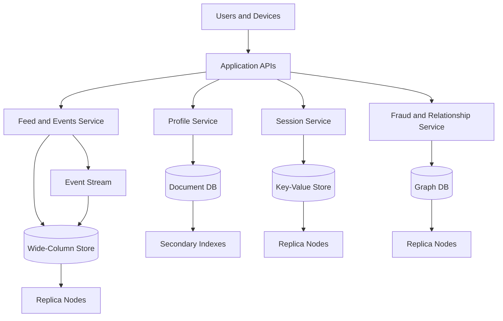

# NoSQL Deep Dive

> NoSQL is a family of database designs that trades the one-size-fits-all relational model for data models optimized around specific access patterns, scale limits, and distribution needs.

---

## The Problem

Imagine you are building a global consumer app that mixes user profiles, shopping carts, activity feeds, device sessions, fraud signals, and a social graph. On day one, putting everything in PostgreSQL feels sensible. The schema is clean, foreign keys are comforting, and the team already knows SQL. At 2,000 requests per second, the system behaves.

Then the product gets real traction. Your session table is handling 150,000 reads per second. Feed fanout writes are arriving in bursts of 80,000 events per second. Product metadata is semi-structured because merchants keep adding custom attributes like battery health, screen size, fabric blend, or GPU clock speed. Fraud checks need to ask "how many hops away is this user from previously banned accounts?" in under 50ms. The same relational design that felt elegant at small scale starts looking like a compromise everywhere.

Some tables become wide and sparse because not every entity has the same attributes. Some queries depend on multi-hop relationships that are painfully awkward in joins. Some workloads are so write-heavy that the database spends more time managing index updates and lock contention than serving business logic. The team responds by adding read replicas, bigger instances, and more indexes, but the fundamental mismatch remains: one data model is being forced to serve several completely different access patterns.

This is the problem NoSQL solves. Not "SQL is bad" and not "joins are dead." The real point is that different workloads want different storage shapes. A key-value store is ideal when you already know the exact key and need a result in 1 to 5ms. A document store is useful when related fields naturally live together and the schema evolves often. A wide-column store is built for massive write throughput and predictable partition-based reads. A graph database exists because "friends of friends who bought X and work at Y" is not the same problem as "find row by primary key."

Without NoSQL thinking, teams often do one of two bad things. They either overload a relational database with workloads it was not chosen for, or they adopt a random NoSQL product because it sounds "web scale" without understanding why the model exists. The deeper lesson is that NoSQL is about matching data storage to workload shape before scale turns every query into a fight.

---

## Core Concept Explained

Think of NoSQL like choosing the right physical storage in a warehouse. You do not store frozen food, fragile glass, heavy steel beams, and handwritten legal records in the exact same container just because they are all "inventory." You use freezers for one thing, padded shelves for another, pallet racks for another, and secure cabinets for yet another. Databases work the same way. The job is not to be ideologically consistent. The job is to store and retrieve data efficiently for the way the business actually uses it.

The phrase "NoSQL" is a little misleading because it sounds like one product category. It is really a collection of non-relational data models that make different tradeoffs around schema flexibility, distributed writes, partitioning, indexing, and consistency. Most NoSQL systems assume distribution from the start rather than treating replication and sharding as optional add-ons.

### Document databases

A document database stores data as self-contained records, usually JSON-like objects. MongoDB and Couchbase are classic examples. A product document might contain `name`, `price`, `brand`, `inventory`, `images`, and nested `specs` fields that vary by category.

The strength of document databases is aggregate-oriented reads and writes. If your application usually loads or updates the entire customer profile, order summary, or product listing as one unit, storing it as one document is natural. Reads are often fast because related data lives together, and schema evolution is easier because one document can have fields another does not. The cost is that cross-document joins are limited or awkward, and secondary indexes can become expensive if you try to recreate relational flexibility at document-store scale.

### Key-value stores

Key-value databases are the simplest NoSQL model. You provide a key and get a value back. Redis, DynamoDB, Riak, and FoundationDB can all act in this style, though they differ internally. The mental model is a giant distributed hash map.

This model is extremely powerful when access patterns are simple and known ahead of time. Session stores, feature flags, rate-limit counters, carts, idempotency records, and user preference blobs all fit well. Single-digit millisecond latency is realistic at very high scale because the database does not need to plan a complex query. The downside is obvious: if you do not know the key, the database has much less to help you. Secondary access paths must be designed explicitly, usually by duplicating data or maintaining additional indexes elsewhere.

### Wide-column databases

Wide-column systems such as Cassandra, ScyllaDB, and HBase are built around partitions and sorted rows rather than general-purpose relational tables. You choose a partition key, and all rows for that partition are stored together, often sorted by clustering columns. This makes them excellent for time-series and event-style workloads.

The big strength here is distributed write throughput. Cassandra-style systems use log-structured storage and sequential disk-friendly writes, so large clusters can absorb hundreds of thousands or millions of writes per second while staying available across nodes and zones. The price you pay is query discipline. You do not start with arbitrary SQL and hope the optimizer figures it out. You design tables around exact query paths up front. If you later need a new read pattern, you often create a new table that stores the same logical data differently.

### Graph databases

Graph databases such as Neo4j, JanusGraph, or Amazon Neptune model entities as nodes and relationships as edges. They exist because some questions are fundamentally relationship-first. Fraud rings, knowledge graphs, recommendation paths, network topology, and organizational hierarchies are examples. If your core question is "what is connected to what, and how many hops away?" a graph model is often dramatically more natural than flattening everything into join tables.

Graph databases shine when traversals matter more than bulk scans. A query like "find all users within three hops of a compromised seller" is graph-shaped in a way that key-value and document stores are not. The tradeoff is that graph systems are usually not the cheapest answer for simple high-volume key lookups or append-heavy event ingestion.

### Distribution, denormalization, and access patterns

Most NoSQL systems assume data will be partitioned. A partition key determines which node owns a record, and replication copies that partition to additional nodes for durability and read availability. This is why data modeling in NoSQL starts with access patterns, not with pure business entities. The first question is often "what will the key be?" or "what partition should answer this query?" rather than "what third normal form should this table satisfy?"

That leads directly to denormalization. In relational systems, duplication is treated cautiously because joins are cheap and normalization protects integrity. In NoSQL, duplication is often deliberate. You may store the same order in a customer-centric document, a merchant-centric document, and an analytics event stream because each supports a different hot query path. Storage is cheaper than tail latency and failed fanout queries. The discipline moves from "avoid duplication" to "duplicate intentionally and know how updates propagate."

### Secondary indexes and consistency

NoSQL systems often support secondary indexes, but they are not free magic. In a distributed environment, a secondary index may mean additional writes, scatter-gather reads, or asynchronous maintenance. A MongoDB index on `email` is great when it fits a targeted lookup. A low-cardinality index like `status=active` across a huge dataset can become a hotspot or an expensive scan.

Consistency is also model-dependent. Many NoSQL databases offer tunable or workload-specific guarantees rather than one global default. You might do strongly consistent reads for account settings, eventually consistent reads for recommendation widgets, and quorum writes for fraud markers. The practical question is not "is eventual consistency bad?" The real question is "for this user action, how stale can data be before it harms correctness or trust?"

The most useful way to think about NoSQL is not as a replacement for SQL. It is a set of specialized tools. Pick document stores for aggregate-centric flexible data, key-value stores for exact lookups, wide-column stores for partitioned write-heavy workloads, and graph databases for traversal-heavy relationships.

---

## Architecture Diagram

### Mermaid Diagram

### Diagram Walkthrough

Starting from the top left, users and devices send requests into the application APIs. The API layer is not talking to one universal database. Instead, it routes different workloads to services that each use the storage model that best matches their access pattern.

The Profile Service talks to the document database. This is where aggregate-style entities such as user profiles, merchant listings, or catalog entries live. If a mobile app opens a profile page, the service can fetch one document by ID and return nested attributes like preferences, addresses, and device settings together. The secondary indexes next to the document store represent query paths such as "find profile by email" or "find merchants by category and city." Those indexes make targeted lookups possible, but they also add write cost every time a document changes.

The Session Service talks to the key-value store. A login request creates or updates a session record keyed by something like `session:<token>`. A follow-up request with the same token becomes a direct key lookup, which is why this path is fast and predictable. The replica nodes show that the data is copied to other machines so one node failure does not erase every active session.

The Feed and Events Service uses the event stream plus the wide-column store. New events first land on the stream, then get written into the wide-column store partitioned by something like `user_id` or `device_id`, with timestamps as clustering keys. That structure makes "fetch the latest 50 events for user 123" efficient because the database knows exactly which partition owns the data and how rows are ordered within it.

The Fraud and Relationship Service talks to the graph database. This path is for questions that depend on edges and traversals, such as "which accounts share this device?" or "is this merchant connected to previously blocked entities within two hops?" A graph store is chosen because relationship-centric queries become simpler when edges are first-class data.

Two important flows make the diagram concrete. In the profile flow, a request comes through the API, hits the Profile Service, reads one document from the document database, and may also use a secondary index to find the correct document. In the fraud flow, the API hands a request to the Fraud Service, which traverses nodes and edges in the graph database to decide whether to block or flag an action. Same product, same API surface, completely different storage needs underneath.

---

## How It Works Under the Hood

Under the hood, many NoSQL systems are built around partitioning plus replication. A key or partition key is hashed or range-mapped to a shard, and that shard is replicated to multiple nodes. In a Dynamo-style system, a partition might live on three replicas across three availability zones. Reads can go to one or more replicas depending on the consistency level, and writes may be acknowledged after one replica, a quorum, or all replicas respond.

Key-value stores usually optimize for simple request paths. A lookup often becomes "hash key -> locate partition -> read value," which is why median latency can stay near 1 to 5ms even at huge scale. The reason the model is fast is not magic. It is the absence of query planning and the narrowness of the access path.

Document databases add richer query and index behavior. MongoDB, for example, stores BSON documents and typically uses B-tree-like indexes for primary and secondary access paths. The convenience of nested fields and flexible schema is real, but so is the internal cost. Updating one document can require rewriting indexed fields, maintaining multiple index entries, and sometimes moving the document if it grows significantly. That is one reason large frequently mutating documents can become expensive even though reads look elegant.

Wide-column systems such as Cassandra and ScyllaDB usually rely on log-structured merge-tree storage. Writes land in a commit log for durability and a memtable in memory, then flush to immutable SSTables on disk. Background compaction merges those files over time. This design makes writes cheap and sequential, which is why sustained write throughput is excellent. The downside is that reads may consult several SSTables, and tombstones from deletes can accumulate until compaction clears them. Poor data models with too many tombstones or extremely wide partitions can quietly destroy read performance.

Graph databases store adjacency information so traversal is cheap. Instead of joining giant tables to discover relationships, the engine can follow edges directly from one node to connected nodes. That locality is what makes multi-hop queries feasible in milliseconds or low hundreds of milliseconds rather than exploding into application-managed joins and scans. The catch is that horizontal partitioning becomes harder when many traversals cross partition boundaries.

Secondary indexes are where many NoSQL surprises begin. In distributed NoSQL systems, an index may be local to each shard, global across shards, or maintained asynchronously. That means a query on a secondary field can turn into fanout work across many partitions if the index does not align with the partition key. Experienced teams treat every index as part of capacity planning, not as a convenience toggle.

Failure modes are also different from what teams expect coming from a single-node SQL system. Hot partitions happen when too much traffic lands on one partition key, like all writes for a viral creator or all events for `tenant:free`. Replica repair can consume network bandwidth after node failures. Eventual consistency can surface as stale reads right after writes unless the application uses stronger read semantics.

The practical lesson is that NoSQL performance comes from narrow, intentional access paths and storage engines tuned for distribution. If you try to make a NoSQL database behave like a general-purpose relational engine with arbitrary joins and cross-partition filters, you usually pay the complexity cost without getting the speed benefit.

---

## Key Tradeoffs & Limitations

**Choose a document database when the natural unit of read and write is an aggregate.** User profiles, product catalogs, CMS content, and settings blobs fit well when most operations load or update a self-contained object. Do not choose it if your workload is dominated by multi-document joins and cross-entity transactions that need strict consistency. You can simulate relational behavior, but you will usually get a more complex and less predictable system than just using PostgreSQL.

**Choose a key-value store when the request already knows the key.** Sessions, idempotency keys, carts, counters, and configuration are ideal because the lookup path is exact and latency-sensitive. Do not choose key-value because you hope to "figure out queries later." If the business needs to search by many fields, slice data in many ways, or run analytics-style filters, a pure key-value model becomes painful quickly.

**Choose a wide-column store when write throughput and partition-aware query patterns dominate.** Time-series events, inbox storage, feed items, IoT telemetry, and immutable append-heavy workloads are strong fits. Do not choose it when the team expects arbitrary querying. Cassandra is powerful, but it rewards designing tables for known reads and punishes improvisation later.

**Choose a graph database when the core value is in traversals.** Fraud networks, social graphs, access-control inheritance, recommendation relationships, and dependency graphs fit naturally. Do not choose graph databases for simple CRUD workloads or giant append-only event logs just because "relationships exist everywhere." Every application has relationships. Not every application is traversal-first.

NoSQL also does not remove operational cost. You still manage partition keys, replication topology, compaction or vacuum-like maintenance, index growth, and failure handling. If your application has fewer than 10,000 daily active users and a single PostgreSQL instance handles the load comfortably, introducing three different NoSQL systems is not sophistication. It is architecture debt arriving early.

---

## Common Misconceptions

**"NoSQL means no schema."** Many people hear "schema-less" and imagine the database imposes no structure at all. In reality, the structure still exists; it has simply moved from strict DDL enforcement into application code, validation layers, or document conventions. The correct understanding is that NoSQL often gives flexible schema evolution, not freedom from data modeling. This misconception exists because changing a JSON document feels easier than running a migration, so people confuse flexibility with the absence of schema.

**"NoSQL is always faster than SQL."** A well-indexed PostgreSQL query can return in under 1ms and support transactional correctness that many NoSQL systems intentionally trade away. NoSQL is faster when the chosen model matches the access path, such as exact-key lookup or partition-local reads, not because the label itself grants performance. The misconception survives because teams often compare a good NoSQL fit to a badly designed relational schema and conclude the category is inherently faster.

**"Eventual consistency means random inconsistency."** Eventual consistency is not the same as chaos. It usually means replicas may lag briefly and different read paths may observe updates at different times depending on consistency level and topology. The correct understanding is that consistency behavior is usually configurable and workload-specific. People think it is random because they have not mapped user actions to explicit read and write guarantees.

**"You can swap document, key-value, wide-column, and graph databases interchangeably."** They are all NoSQL, but that does not make them equivalent. A graph database answers relationship traversals differently from a key-value store, and a wide-column store rewards partition-first modeling that looks nothing like document aggregates. The misconception exists because the industry often markets NoSQL as one big bucket instead of several distinct models with different strengths.

**"Denormalization is just duplication and therefore bad."** In NoSQL systems, denormalization is often a deliberate performance strategy. Duplicating data across documents or tables can eliminate cross-partition joins and keep hot queries local to one partition. The right understanding is that duplication is acceptable when update propagation is explicit and the read benefit is worth it. The misconception comes from importing relational purity rules into a distributed system with different cost curves.

---

## Real-World Usage

**Amazon and Dynamo/DynamoDB:** Amazon's shopping cart problem is the classic key-value and always-available data story. Internal Dynamo prioritized availability and partition tolerance so a cart write could succeed even during node failures, with reconciliation handling conflicts later. DynamoDB turned many of those ideas into a managed service where partition keys, global secondary indexes, and predictable single-digit millisecond reads are the core contract. The interesting part is not just scale; it is that the data model is built around exact access paths rather than general relational querying.

**Netflix and Cassandra:** Netflix has spoken publicly about using Cassandra for high-volume, highly available distributed data, including metadata and service-side state that must survive regional and instance churn. Cassandra works well for this because writes are cheap, replication is built in, and partition-oriented reads match many service access patterns. Netflix did not choose Cassandra because it is a fashionable NoSQL badge. They chose it because the system needed continuous availability and predictable distributed behavior under very high request rates.

**Meta and TAO:** Meta built TAO as a graph-inspired distributed data store for the social graph, where the dominant questions are relationship lookups such as who follows whom and what objects connect to which users. TAO sits in front of MySQL but exposes an API centered around objects and associations rather than relational joins. The design shows why relationship-centric workloads often deserve a different model from generic transactional storage.

---

## Interview Angle

**Q: When would you choose a document database over a relational database?**
**How to approach it:**
- Start with access patterns: are you reading and writing one aggregate, like a profile or product listing, most of the time?
- Discuss schema variability and nested data as benefits, but also mention multi-document transaction limits and cross-document query costs.
- Show judgment by saying document databases are strong when the aggregate boundary is clear, not just when the team wants to avoid migrations.
- Expect follow-ups on indexing and what happens when the product later needs cross-document analytics.

**Q: How would you model a time-series workload in a NoSQL system?**
**How to approach it:**
- Talk about partition keys first, because hotspot and partition size decisions dominate the design.
- Mention using a wide-column model with something like `device_id + day bucket` as partition key and timestamp as clustering key.
- Explain why appends are fast and why queries like "latest 100 points" stay partition-local.
- Bring up retention, tombstones, and compaction because operational details are part of a strong answer.

**Q: What can go wrong with secondary indexes in NoSQL databases?**
**How to approach it:**
- Explain that indexes in distributed systems have real write amplification and can force cross-partition work.
- Contrast a targeted high-cardinality lookup with a low-cardinality index that creates hotspots or giant scans.
- Mention that every new index should be treated as a new workload with storage and capacity implications.
- Strong answers tie index design back to the partition key, not just the field being searched.

**Q: How do you decide between key-value, document, wide-column, and graph?**
**How to approach it:**
- Frame the answer around the dominant query shape, not around vague statements like "graph for social apps."
- Ask whether the request knows the key, needs nested aggregates, depends on ordered partition scans, or requires multi-hop traversal.
- Discuss how consistency needs and operational complexity differ across models.
- Make it clear that sometimes the right answer is still SQL if the workload is transactional and relational.

---

## Connections to Other Concepts

**Concept 06 - SQL Databases at Scale** is the natural comparison point for this file. Understanding indexing, query planning, and connection pooling in SQL makes the NoSQL tradeoffs clearer because you can see exactly what each model is choosing to optimize or give up.

**Concept 08 - Database Replication** connects directly because most NoSQL systems treat replication as a first-class part of the design rather than an optional afterthought. Read consistency, failover behavior, and replication lag all shape how safe a NoSQL read path really is.

**Concept 09 - Database Sharding & Partitioning** is almost inseparable from NoSQL. Partition keys, hot shards, resharding pain, and cross-partition query limits are central to how NoSQL systems scale, so this concept is really the operational continuation of what this file introduces.

**Concept 12 - Data Modeling for Scale** builds on the denormalization and access-pattern-first thinking described here. Once you accept that storage models should follow read and write paths, data modeling becomes less about pure normalization and more about designing around hotspots, fanout, and query locality.

**Concept 17 - CAP Theorem & PACELC** explains why many NoSQL systems make the consistency and latency tradeoffs they do. If you want to understand why a database chooses eventual consistency, quorum reads, or lower-latency replicas, the CAP and PACELC framing becomes the next layer of understanding.
