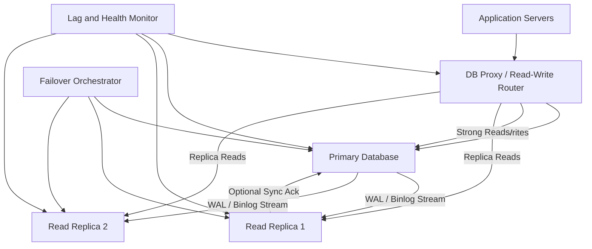

# Database Replication

> Database replication is the practice of keeping multiple copies of the same data in sync so reads can scale, failures can be survived, and one machine does not become the only source of truth.

---

## The Problem

Imagine a fintech API that keeps all customer balances and transaction history on one PostgreSQL primary. On a normal day, the system serves about 4,000 reads per second and 800 writes per second. Median read latency is 12ms, writes commit in 20ms, and everyone feels good about the architecture.

Then payroll day arrives. Mobile clients start refreshing balances every few seconds. Support agents open customer ledgers. Fraud systems run additional verification queries. Read traffic jumps from 4,000 QPS to 35,000 QPS in under ten minutes. The primary database is now doing the worst possible job: it is trying to serve critical writes and a mountain of repetitive reads at the same time. CPU climbs above 90%, buffer cache churn increases, and queries that usually return in 10ms now take 400ms to 2 seconds. Worse, writes slow down too, because they are competing for the same disk, memory, and lock manager.

Now add failure. The primary sits on one machine, in one availability zone, with one set of disks. If the host dies, the AZ has a networking issue, or someone pushes a bad kernel patch, the database is gone until the team restores it or promotes a backup. "We have backups" is not a satisfying answer when customers are staring at failed payments in real time. Backups are for recovery after loss. They are not for continuing to serve live traffic while a machine disappears.

This is the pain replication solves. Replication gives you additional copies of the data, usually one writer plus one or more followers. Those followers can absorb reads, provide warm failover targets, and sometimes live in other zones or regions so a single infrastructure event is not a full outage. But replication is not free magic. The copies are often slightly behind, failover can lose recent writes, multi-primary systems can conflict, and "read from any replica" can quietly violate user expectations when someone writes data and then immediately reads stale state. Replication makes databases safer and bigger, but only if you understand exactly what is being copied, how fast, and with what guarantees.

---

## Core Concept Explained

Think of replication like a newsroom with one lead editor and several copy desks. The lead editor approves every final change to an article. Copy desks receive those approved edits and update their own copies so more readers can be served without crowding one person. If the lead editor is delayed, the copy desks may be a few moments behind. If two editors in different cities both edit the same paragraph at the same time without coordination, you now have conflict instead of scale. That is database replication in human form.

At the highest level, replication means one database node produces a stream of changes and one or more other nodes apply those changes in the same order. In a traditional primary-replica setup, the primary accepts writes and commits them locally. After commit, it ships the changes to replicas. Replicas replay those changes and become near-current copies of the primary. Applications usually send writes to the primary and some or all reads to replicas.

### Primary-replica replication

This is the most common model because it is operationally understandable. There is one authoritative writer. Every insert, update, and delete happens there first. The change is then encoded as a replication record and delivered to followers. In PostgreSQL this is the WAL, or Write-Ahead Log. In MySQL this is typically the binary log, or binlog. The exact internal format differs, but the idea is the same: the database records durable change events in a sequential log, and replicas consume that log.

Primary-replica helps in three big ways. First, it scales reads. If one primary can handle 5,000 reads per second comfortably but your application needs 25,000, then five replicas can absorb the extra demand if your routing layer is smart. Second, it improves availability. If the primary dies, one replica may be promoted instead of restoring from last night's backup. Third, it improves topology flexibility. You can keep local replicas in the same region for low-latency reads and distant replicas in another region for disaster recovery.

The catch is lag. Replicas are not usually updated in the exact same microsecond as the primary commit. In a healthy same-region async setup, replication lag may be 10 to 100ms. Under heavy write bursts, long-running transactions, or slow disks, that lag can rise to seconds or even minutes. If a user changes their profile photo and immediately refreshes from a lagging replica, they may still see the old photo.

### Synchronous vs asynchronous replication

Synchronous replication means a write is not considered committed until one or more replicas confirm receipt or durability. This gives stronger guarantees. If the primary crashes right after commit, the acknowledged data should already exist elsewhere. The tradeoff is latency. A write that used to commit in 4 to 8ms on one local node may now take 8 to 20ms if it waits for another zone, and far more if it waits across regions.

Asynchronous replication means the primary commits locally first and replicas catch up afterward. This is much faster and more common for read scaling. The downside is possible data loss on failover. If the primary commits transaction T, returns success to the client, and dies before a replica receives T, then a promoted replica will not have that write. That gap can be tiny, but in real systems tiny gaps matter.

There is also a middle ground. Semi-synchronous replication, used in some MySQL setups, waits until at least one replica confirms it received the change, though not necessarily that it applied or fully fsynced it. This reduces data-loss windows without taking the full latency hit of strictly synchronous quorum commits.

### Multi-primary replication

Multi-primary, sometimes called multi-master, allows more than one node to accept writes. This sounds ideal because it appears to solve both availability and global write latency. In practice it moves the hardest problem to conflict resolution. If two regions both update the same customer record, which version wins? Last-write-wins is simple but can silently discard important updates. Application-level merge logic is possible, but only when the data model supports it.

Multi-primary works best when writes are naturally partitioned or commutative. Shopping cart item increments, append-only event streams, and geographically isolated tenants can fit. Global row-level contention on user profiles or bank balances usually does not. That is why many production systems that seem "multi-region writable" are actually doing careful partitioning, leader-based routing, or consensus-backed replication rather than unconstrained write-anywhere.

### Read-your-writes and routing

One of the most important application-level consequences of replication is read consistency. Users expect that after they create a post, change a password, or update shipping details, the next read shows the new state. Pure replica-based reads break that assumption when lag exists.

Teams solve this several ways. The blunt approach is "read from primary after write" for a short window. Another is session stickiness, where a user who just wrote is pinned to the primary or to a replica that has caught up to a certain log sequence number. PostgreSQL can expose WAL LSN positions, and MySQL can use GTIDs so the application or proxy can wait until a chosen replica has replayed at least the required point before serving the read. This is a much more precise approach than simply hoping lag is low.

The deeper lesson is that replication is not just a database topology. It changes the meaning of a read. Once more than one copy exists, your application must decide which copy is acceptable for which use case.

---

## Architecture Diagram

### Mermaid Diagram

### Diagram Walkthrough

Starting from the top left, the application servers do not connect directly to an arbitrary database node. They first go through a DB proxy or read-write router. That router has one crucial job: make sure writes and consistency-sensitive reads go to the right place. When an application issues an insert, update, or delete, the router sends it to the primary database because that is the only node in this topology that accepts authoritative writes.

The primary database sits in the center because it is the source of the replication stream. Every committed change is written to the WAL or binlog stream and then forwarded to Read Replica 1 and Read Replica 2. Those replicas are full database nodes with the same schema and nearly the same data, but they are usually read-only from the application's point of view. Their main purpose is to offload read traffic and stand by as failover candidates.

The first important request flow is the normal read-scaling path. A user requests a product page or customer history. The application asks the router for a replica-safe read. The router checks health and lag information from the lag and health monitor, then chooses Replica 1 or Replica 2. If lag is low and the query is not consistency critical, the request is served from a replica instead of the primary. That keeps expensive reporting and browsing reads away from the write node.

The second important flow is a write followed by a strong read. Suppose a user changes their billing address and then immediately reloads the account page. The write goes to the primary. The application or router then knows the follow-up read must reflect that write, so it either sends the read back to the primary or waits until a replica has replayed at least the relevant log position. This is why the router has separate arrows for strong reads and replica reads.

The monitor and orchestrator on the right represent operational control. The lag and health monitor measures how far behind each replica is, whether replication is broken, and whether nodes are even reachable. The failover orchestrator uses that information when something bad happens. If the primary dies, the orchestrator can promote the most up-to-date healthy replica, update the router, and restore write traffic. That failover path is the whole reason replication improves availability, but it only works if lag, health, and promotion logic are treated as first-class parts of the design.

---

## How It Works Under the Hood

The core primitive behind most relational replication is a sequential change log. In PostgreSQL, every durable modification is recorded in the WAL before the relevant data pages are considered safely committed. Replicas maintain a receiver process that streams WAL records from the primary and a replay process that applies them locally. PostgreSQL WAL segments are 16MB by default, though streaming avoids waiting for a whole segment to fill before shipping changes. In MySQL, the binlog serves a similar role, and replicas use an I/O thread to fetch log events plus one or more SQL or applier threads to replay them.

That separation matters because lag has multiple stages. A replica can be behind because it has not received the log yet, because it received the log but has not flushed it to disk, or because it has the log but is slow to apply it. A long-running transaction on the primary can also create ugly lag behavior. If the transaction holds changes open for 30 seconds and then commits, replicas may suddenly need to replay a huge burst. On older MySQL configurations, single-threaded apply could turn one hot table into seconds of replica delay. Modern parallel replication helps, but ordering constraints still limit perfect concurrency.

Synchronous replication changes the commit path. Instead of "write WAL locally, fsync, return success," the primary now waits for one or more replicas to confirm they received or durably persisted the relevant log position. Same-zone ack can add just a couple of milliseconds. Cross-zone ack often adds 2 to 10ms. Cross-region synchronous ack can add tens or hundreds of milliseconds depending on geography, which is why truly synchronous global replication is usually paired with consensus systems and deliberately chosen latency budgets.

Failover is mostly a metadata problem wrapped around a data problem. The orchestrator needs to answer three questions quickly: which node is definitely down, which replica is most up to date, and how do clients find the new writer? If failure detection is too eager, transient packet loss can trigger false promotion. If two nodes are both allowed to think they are primary, you get split-brain: both accept writes, both diverge, and reconciliation becomes a human nightmare. Production systems avoid that with fencing, leases, quorum decisions, or an external consensus service so only one writer identity is valid at a time.

Read-your-writes is another under-the-hood detail that shows up in application behavior. If the app records the WAL LSN or GTID associated with a successful write, it can later ask a replica whether it has replayed at least that point. If yes, the read is safe from that replica. If no, the router can fall back to the primary. This is vastly better than blanket "all reads go to replicas" logic because it converts replication lag from a hidden correctness bug into an explicit routing choice.

Storage and network cost matter too. Every replica replays the full write workload, which means replication does not make writes cheaper overall. It makes writes more expensive in exchange for safer reads and failover. A primary doing 50MB/s of WAL generation with three replicas is now shipping roughly 150MB/s of replication traffic, plus the local I/O of applying changes on each follower. That is manageable in-region but becomes very real in multi-region topologies or when a replica falls behind and needs large catch-up bursts.

Finally, note what replication does not do. It does not split one hot write stream across multiple machines unless the design is truly multi-primary or sharded. A single primary with five replicas can serve many more reads, but the primary is still the write bottleneck. That is why replication often comes before sharding, not instead of it.

---

## Key Tradeoffs & Limitations

**Choose primary-replica replication when you need boring read scaling and fast failover.** It is the default for a reason. One writer keeps the mental model simple, replicas offload analytics and browse traffic, and failover is operationally possible without restoring from backup. If your workload is 90% reads and 10% writes, this is often the highest-value change you can make after a single database stops being enough.

**Choose synchronous replication when losing an acknowledged write is unacceptable and you can afford extra latency.** Financial ledgers, control planes, and metadata systems often care more about durability than shaving 5ms off commit time. Choose asynchronous replication when write latency and throughput matter more and the business can tolerate a small data-loss window during rare failovers.

**Be skeptical of multi-primary unless the data model is naturally partitioned or conflict-friendly.** Multi-primary looks elegant on whiteboards and gets painful in production once clocks drift, network partitions happen, or two regions update the same row differently. If your application has globally shared mutable records, leader-based writes are usually safer.

**Replication increases operational overhead.** You now monitor lag, replication slots, binlog retention, replica disk growth, failover orchestration, and reader routing rules. A small startup doing 2,000 total QPS on one well-sized PostgreSQL instance may gain very little from replicas compared with better indexes, cache tuning, and connection pooling.

**Replication does not scale writes on a single dataset.** If the primary handles 8,000 writes per second and your business needs 40,000 writes per second to one logical table, more replicas do nothing for that ceiling. That is the point where partitioning, batching, denormalization, queueing, or sharding enter the conversation.

Choose replication when the pain is read load, failover time, or regional copy availability. Choose sharding when the pain is write throughput or dataset size beyond one writer's limits.

---

## Common Misconceptions

**"Replication is basically the same thing as backup."** It is not. Replication copies current state and usually copies mistakes too. If an operator drops a table or an application corrupts rows, replicas eagerly follow along. Backups exist so you can recover old known-good data. Replication exists so you can keep serving and fail over quickly. People confuse them because both create more than one copy of the data.

**"Adding replicas makes the database scale in every direction."** Replicas mostly scale reads, not writes. Every write still starts on the primary in a primary-replica architecture, and replicas actually add work because they must receive and apply that write too. This misconception survives because dashboards often show more total query capacity after replicas are added, which hides the fact that write capacity did not move much.

**"Async replication lag is so small that users will never notice it."** Sometimes lag is tiny, and sometimes a long transaction, network hiccup, or slow replica turns 50ms into 5 seconds. User-facing flows notice 5 seconds immediately. The correct understanding is that async replicas are only safe for reads that tolerate staleness or are routed carefully. The misconception exists because healthy systems are quiet most of the time.

**"Failover is instant if a replica exists."** A replica helps, but promotion still requires failure detection, split-brain prevention, DNS or proxy updates, and application reconnection. Even excellent systems may spend 10 to 60 seconds detecting and stabilizing around a failure. People believe failover is instant because architecture diagrams compress messy operational steps into one neat arrow.

**"Multi-primary means no single point of failure and no downside."** Multi-primary removes one obvious writer bottleneck but introduces conflict handling, ordering ambiguity, and more complex failure modes. You trade visible centralization for less visible correctness risk. It looks attractive because "more than one writer" sounds like the best of all worlds.

---

## Real-World Usage

**GitHub and MySQL read replicas:** GitHub has written publicly about running large MySQL estates where replicas absorb substantial read load and give operators promotion targets during incidents. The design choice is not exotic: one writable primary per topology, multiple replicas, careful lag monitoring, and deliberate failover tooling. The important lesson is that even at very large scale, boring primary-replica patterns remain useful because they are understandable under stress.

**Shopify's MySQL and Vitess-based topology:** Shopify has discussed operating large MySQL deployments behind Vitess, where primaries handle writes and replicas support reads and failover across a huge commerce workload. Flash sales create ugly read bursts, and replicas let browse-heavy traffic stay off the writer while failover orchestration keeps merchant impact manageable. The interesting part is not just "they have replicas" but that routing and topology metadata are treated as part of the product, not as side plumbing.

**Google Spanner's synchronous replication model:** Spanner is a great example of choosing stronger guarantees at the cost of complexity. Leaders accept writes, but data is replicated synchronously across a quorum before commit. That gives excellent durability and consistent failover behavior, but it only works because Google accepted the latency tradeoff and built a system around consensus, clock uncertainty handling, and well-defined leader regions. It is the opposite end of the spectrum from casual async MySQL replicas, which makes it a valuable comparison point.

---

## Interview Angle

**Q: Why do replicas help reads but not usually writes?**
**How to approach it:**
- Start by separating read throughput from write throughput in the architecture.
- Explain that writes still funnel through the primary in a primary-replica system, while reads can be distributed.
- Mention that replicas add durability and failover value, but they also replay the same writes, so they do not remove the primary write bottleneck.
- Strong answers connect this to when sharding becomes necessary.

**Q: How would you prevent a user from seeing stale data right after a write?**
**How to approach it:**
- Say explicitly that naive "read from any replica" breaks read-your-writes.
- Discuss routing the next read to the primary, session stickiness, or waiting for a replica to catch up to a specific WAL LSN or GTID.
- Mention that not every read needs the same consistency level, so the answer should be endpoint-specific.
- Show you understand the tradeoff between lower primary load and stronger user expectations.

**Q: What are the risks during database failover?**
**How to approach it:**
- Talk about data loss windows with async replication, not just downtime.
- Mention split-brain, stale replicas being promoted, client reconnect storms, and incorrect DNS or proxy state.
- Explain why health checks and promotion rules need fencing or quorum, not just "if ping fails, promote."
- Strong answers distinguish infrastructure failure from correctness failure.

**Q: When would you choose synchronous replication over asynchronous replication?**
**How to approach it:**
- Frame it as a business decision about durability versus latency.
- Give examples where losing an acknowledged write is unacceptable, such as money movement or control metadata.
- Contrast that with browse-heavy or feed-style systems where an extra few milliseconds of commit latency may be less acceptable than rare failover loss.
- Mention that geography matters because synchronous cross-region acks are much more expensive than same-zone acks.

---

## Connections to Other Concepts

**Concept 06 - SQL Databases at Scale** comes right before replication because most teams encounter replication after they have already optimized queries, indexes, and connection pools on one primary. Replication is the next lever once a single SQL node is serving too many reads or needs a faster failover story.

**Concept 09 - Database Sharding & Partitioning** builds directly on this topic. Replication helps when the writer is still one machine but reads are the bottleneck. Sharding enters when even one primary can no longer handle the write rate or total dataset size, and then each shard usually has its own replicas.

**Concept 10 - Caching Strategies** is commonly layered on top of replication. A cache can absorb the hottest reads, replicas can serve the colder misses, and the primary can stay focused on writes. The tricky part is that both caching and replication introduce staleness, so together they require very deliberate invalidation and consistency rules.

**Concept 17 - CAP Theorem & PACELC** explains the tradeoffs hidden inside sync and async replication choices. Waiting for replicas improves consistency and durability but increases latency, while async replication lowers write latency but accepts windows of divergence after failure.

**Concept 18 - Distributed Consensus Simplified** matters because the hardest part of replication is often not shipping logs but electing one safe writer during failure. Once you care about split-brain prevention, quorum, and leader promotion, you are already standing on consensus concepts whether the database exposes them directly or not.
