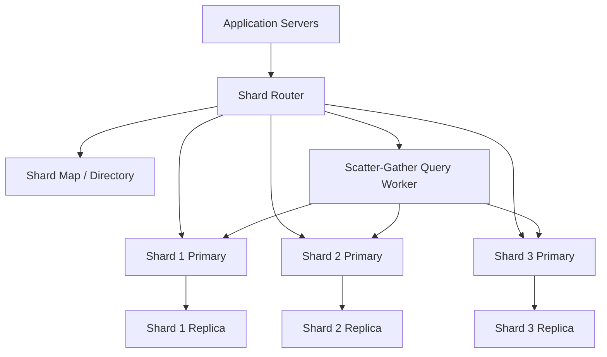

# Database Sharding & Partitioning

> Sharding and partitioning are the techniques that split a dataset into smaller pieces so one database no longer has to store, index, and serve every row by itself.

---

## The Problem

Imagine you run a marketplace that started with one healthy PostgreSQL primary. In year one, it stores 80 million orders, handles 3,000 writes per second, and answers most queries in under 15ms. Life is good. The team adds read replicas, an application cache, and better indexes. For a while that is enough.

Then the business grows into multiple countries. The `orders` table crosses 2.5TB. Hot indexes no longer fit comfortably in memory. Autovacuum falls behind. Checkout traffic spikes to 35,000 writes per second during major sales, and the table that tracks order state becomes a lock hotspot because everyone updates recent rows at once. Queries that used to scan a few thousand pages now wade through gigantic indexes. A query that filtered by `seller_id` and date range used to take 20ms. Now it takes 600ms because the planner still has to reason about a monster table with years of cold data.

At this point, adding more CPU or RAM to the primary helps only a little. You can move from a 16 vCPU box to a 64 vCPU box and maybe recover some headroom, but the improvement is temporary. The write-ahead log is still one stream. The hottest indexes are still on one machine. Maintenance becomes terrifying because reindexing, schema changes, and backup restores all scale with the size of the whole database. One host failure now threatens a multi-terabyte recovery path.

This is the problem sharding and partitioning solve. Instead of forcing one database node to own every row for every tenant, every geography, and every time period, you split the data into smaller slices. Each slice has smaller indexes, lower write contention, and more predictable performance. But this is also where systems stop being simple. Once data is split, you need routing logic, resharding plans, cross-shard queries, shard-aware IDs, and operational discipline. Sharding is not "make database faster." It is "trade one giant bottleneck for many smaller systems you now have to coordinate."

---

## Core Concept Explained

Think of a library that has grown too large for one building. At first, one central branch works fine. Then the collection grows to millions of books, the checkout desk gets overloaded, and customers spend more time waiting than reading. You now have a few options. You can build a bigger central library. That is vertical scaling. You can keep one system but divide books into floors by topic. That is partitioning. Or you can open multiple branches across the city and decide which branch owns which books and which patrons. That is sharding.

The first important distinction is that **partitioning** and **sharding** are related but not identical. Partitioning usually means splitting data into smaller logical parts inside one database system or tightly managed cluster. PostgreSQL table partitioning is a classic example: one logical table called `orders`, but separate partitions for January, February, March, and so on. The database still presents one namespace, one query engine, and one connection endpoint. Sharding usually means splitting data across multiple independent database servers or clusters, where the application or a proxy must know which shard to use.

### Vertical vs horizontal partitioning

Vertical partitioning splits by columns or related tables. Suppose a `users` table has hot columns like `id`, `email`, and `status`, but also rarely used profile blobs, marketing preferences, and audit metadata. You can separate the cold columns into another table so the hot working set stays smaller. This reduces row width, cache pressure, and index bloat. Vertical partitioning is often the cheaper first move because it reduces storage and I/O without changing the routing model.

Horizontal partitioning splits by rows. Instead of one `orders` table containing every order ever created, you might keep current-year orders in one partition and older years in others. Or you might split rows by geography, tenant, or customer ID range. Horizontal partitioning is where you start deciding not just what the row looks like, but where the row lives.

### Sharding strategies

Once you shard, the entire design revolves around the **shard key**, the attribute that determines placement. Pick badly and you build a permanent hotspot.

**Range sharding** assigns contiguous ranges to shards. Users `1-10 million` live on Shard A, `10 million-20 million` on Shard B, and so on. The advantage is that range queries are efficient. Asking for all orders from `2026-03-01` to `2026-03-07` is easy if your range aligns with time. The downside is skew. Recent timestamps, popular seller ranges, or high-growth customer IDs can all hammer the last shard while older shards stay mostly idle.

**Hash sharding** runs the shard key through a hash function, then maps the result to a shard. This distributes load more evenly because adjacent customer IDs no longer land on the same node. If you hash `user_id % 16`, then user 101 and 102 likely go to different places. The downside is that range queries become hard. "Give me all users created last week" may require querying every shard unless another index or data pipeline exists.

**Directory-based sharding** adds an indirection layer. Instead of deriving the shard from a simple formula, you keep a lookup table that says tenant 42 lives on Shard G, tenant 43 on Shard M, and so on. This is operationally more complex because the directory must stay correct and available, but it gives you flexibility. You can move one noisy tenant to a fresh shard without rehashing the whole system.

### Partitioning within a shard

Production systems often combine both ideas. Each shard is already one independent database cluster, and then each shard internally uses partitions by time or status. For example, a commerce system might shard by `merchant_id`, then partition each shard's `orders` table by month. That gives smaller indexes inside each shard and keeps retention jobs local instead of forcing one global table to do everything.

### Why the shard key matters so much

The shard key determines three things at once: load distribution, query shape, and resharding pain. If most reads and writes are by `user_id`, then sharding by `user_id` is natural. If the busiest query is "latest posts for a user," then sharding by `post_id` can make writes look neat while making the main read path miserable. Good sharding is access-pattern design disguised as infrastructure.

This is also why some teams avoid sharding until they absolutely need it. If a single well-tuned PostgreSQL primary can still handle 15,000 writes per second with good SSDs and enough memory, sharding early may be pure self-inflicted complexity. But once one node cannot keep the active working set, index set, and write stream under control, partitioning and sharding become the next serious lever.

---

## Architecture Diagram

### Mermaid Diagram

### Diagram Walkthrough

Starting from the top left, the application servers do not connect directly to one universal database. They first talk to the shard router. The router's job is to look at the shard key on each request and decide which shard owns that data. In a user-centric system, the router might inspect `user_id`. In a multi-tenant SaaS product, it might inspect `tenant_id`.

The shard map or directory sits beside the router because the router needs metadata, not guesswork. In a simple hash-sharded system, the map may just encode that hash bucket `0-255` currently belongs to Shard 1, `256-511` belongs to Shard 2, and so on. In a directory-based system, it may literally store tenant-to-shard assignments. This component is critical because if it is stale or wrong, writes go to the wrong place and the whole design breaks.

The middle row shows three primary shards. Each shard is its own independent database writer. That is the core scaling win of sharding: instead of one primary handling all writes, Shard 1 handles only its subset of rows, Shard 2 handles another subset, and Shard 3 handles the rest. If load is evenly distributed, three shards can support roughly three times the write throughput of one equivalent primary, though real-world gains are lower because routing and coordination add overhead.

Each shard primary replicates to a local replica. Those replicas serve the same purposes they do in any replicated system: read scaling, backups, and failover targets. The key detail is that replication now happens per shard, not globally. If Shard 2 becomes unhealthy, you promote its replica. You do not fail over the entire database universe.

The scatter-gather query worker exists because some queries cannot be answered from one shard. Suppose an admin wants "all merchants with failed payouts in the last hour" and the shard key is `merchant_id`. No single shard has all the relevant rows. The router sends that request to the worker, which fans the query out to Shards 1, 2, and 3, waits for results, and merges them. That is convenient, but it is also expensive, because the latency now depends on the slowest shard plus the merge step.

There are two useful flows to picture. In the normal request flow, a customer checkout write enters the router, the router looks up the owning shard from the directory, and the write goes to exactly one shard primary. That is the fast path you design around. In the administrative reporting flow, the router recognizes the query spans multiple shards, hands it to the scatter-gather worker, and that worker coordinates reads across every shard before returning one merged answer. Sharded systems stay healthy when the first flow is common and the second flow is rare.

---

## How It Works Under the Hood

Under the hood, sharding is mostly a routing problem married to a data movement problem. The routing problem is straightforward on paper: compute a shard from the shard key, open a connection to that shard, and issue the query. The hard part is that the routing rule changes over time. When you add Shard 4, the old placement rule is no longer sufficient unless you are willing to remap massive amounts of data. That is why simple modulo formulas like `user_id % 4` age badly. Changing from 4 shards to 5 remaps almost every key. Directory maps and consistent-hash-like techniques exist because naive remapping is operationally brutal.

Resharding is where the real cost shows up. Suppose one shard holds 800GB and is now overloaded. You want to split it into two 400GB shards. A safe reshard usually happens in phases. First, create the new shard and copy historical data in the background. Second, start dual-writing new changes to both old and new placements or record a change stream that can be replayed. Third, cut traffic over for a specific key range or tenant set. Fourth, verify row counts, checksums, lag, and application correctness before finally retiring the old placement. On a busy production system, that can take hours or days, not minutes.

Cross-shard queries are expensive because there is no free global index anymore. A local B-tree index on Shard 7 tells you where rows are inside Shard 7, but it says nothing about Shards 1 through 6 or 8 through 16. If you need a truly global lookup like "find order by external payment reference," you often have only three options. One, make that field part of the shard key or a routing table. Two, maintain a global secondary index service, which is really another distributed system. Three, scatter the query to every shard and merge the results. Option three is easy to code and awful at scale.

Hot partitions happen when the shard key distributes rows evenly but not traffic evenly. Time-based range sharding is the classic example. If all new writes go to "today's shard," then one shard gets all the write heat while older shards do nothing. Social systems see the same pattern with celebrity users: one `user_id` becomes hot enough that even hash sharding still leaves one shard or one logical tenant overloaded. Teams solve this with techniques like bucketing a tenant across multiple subshards, salting hot keys, or moving the hottest tenants to dedicated shards using a directory-based map.

Transactions also change meaning in a sharded system. Inside one shard, a normal SQL transaction still works. Across shards, atomicity becomes much harder. Two-phase commit exists, but it is slow, operationally fragile, and often avoided in high-scale user traffic. Many teams redesign workflows so a request touches one shard whenever possible, and anything cross-shard becomes asynchronous, compensating, or eventually consistent.

Storage and maintenance behavior improve locally but get more repetitive globally. Reindexing a 300GB shard is much more pleasant than reindexing a 3TB monolith. Backups are smaller per shard. Vacuum and compaction jobs touch smaller working sets. But now you have 16 backups, 16 compaction schedules, 16 failover plans, and 16 sets of lag metrics. Sharding shrinks each unit of pain while multiplying the number of units you operate.

The final under-the-hood truth is that partitioning inside one database and sharding across databases often coexist because they solve different bottlenecks. Partitioning helps the planner prune irrelevant data and keeps local indexes smaller. Sharding distributes total write load and total dataset ownership. Mature systems usually end up using both because one alone is rarely enough once the scale becomes truly uncomfortable.

---

## Key Tradeoffs & Limitations

**Choose partitioning when one database server is still viable but one giant table is not.** If your `events` table is 4TB but most queries only touch the last seven days, monthly or daily partitions can dramatically reduce scan and maintenance cost without forcing the application to become shard-aware. This is the lower-complexity move and should usually come before full sharding.

**Choose sharding when one writer or one storage node is the bottleneck.** If a single primary tops out at 12,000 writes per second and you need 60,000, replication and caching will not solve it. Independent shards can. But the price is application complexity, routing metadata, resharding runbooks, and more painful operational debugging.

**Range sharding is great for locality and terrible for skew.** Choose it when range queries dominate and your ranges are naturally balanced, like archival time windows with write load spread elsewhere. Skip it when "the newest bucket" is always the busiest path, because you will create one permanent hot shard.

**Hash sharding is great for distribution and poor for analytics-style queries.** Choose it when point lookups by shard key dominate and evenness matters most. Skip it when the main product requirement is ad hoc filtering across the whole dataset, because scatter-gather becomes your tax on every interesting query.

**Directory-based sharding gives flexibility at the cost of another critical system.** It is often the right long-term answer for multi-tenant SaaS because you can move one giant tenant without moving everyone. But now you must run a highly available shard map, cache it correctly, invalidate it safely, and recover it during incidents.

If your app has fewer than 10,000 DAU and one PostgreSQL instance with proper indexes is cruising at 20% CPU, sharding is a terrible idea. It adds cost, slows development, and creates failure modes you do not need yet.

---

## Common Misconceptions

**"Sharding is just partitioning with a fancier name."** They are related, but not equivalent. Partitioning often stays inside one database engine and one connection endpoint, while sharding crosses multiple independent databases and pushes routing complexity outward. People confuse them because both involve splitting data into pieces.

**"Once you shard, the database scales linearly forever."** In reality, you move the bottleneck rather than eliminating bottlenecks permanently. Hot tenants, cross-shard joins, global indexes, and resharding events all create new ceilings. The misconception exists because whiteboard math like "8 shards equals 8x throughput" ignores operational overhead and traffic skew.

**"Hash sharding automatically prevents hotspots."** Hashing distributes keys, not necessarily workload. If one user generates 50,000 writes per second, that user still lands on one hash outcome unless you intentionally split the tenant further. People believe hashing solves everything because it smooths average distribution, which hides extreme outliers.

**"Cross-shard queries are fine because databases are fast."** One well-indexed query on one shard may take 8ms. The same query scattered to 32 shards plus merge time can take 150ms or 800ms, especially when one shard is slow. The misconception survives because early prototypes run on a handful of shards and small datasets.

**"You can pick any shard key and fix it later."** Changing the shard key usually means moving huge amounts of data and rewriting routing assumptions. It is one of the most expensive "later" problems in data architecture. People underestimate this because shard key choice looks like a schema detail when it is really an access-pattern contract.

---

## Real-World Usage

**YouTube and Vitess:** YouTube created Vitess to make large MySQL sharded deployments manageable. The important detail is not just that data is split across MySQL instances. Vitess adds a routing layer, shard metadata, resharding workflows, and query rewriting so applications do not manually open connections to specific shards. That is a strong example of how real sharding requires control-plane tooling, not just multiple databases.

**Instagram's user-centric PostgreSQL sharding:** Instagram has discussed using PostgreSQL heavily while scaling user data by sharding around user-related ownership boundaries. The reason this works is that many core access patterns are naturally user-scoped: fetch this user's profile, posts, relationships, or timeline components. By keeping user-centric operations local, they avoided turning every hot path into a cross-shard join.

**Shopify merchant isolation patterns:** Shopify's public engineering work around scaling commerce data shows why tenant-aware placement matters. Large merchants can behave very differently from long-tail stores, especially during flash sales. A directory-style placement model lets a platform isolate especially hot merchants, spread load more deliberately, and keep one giant tenant from setting the performance profile of everyone else.

---

## Interview Angle

**Q: How would you choose a shard key for a new system?**
**How to approach it:**
- Start with access patterns, not schema aesthetics. Ask what field appears in the hottest reads and writes.
- Discuss distribution, locality, and future growth together, because a shard key must serve all three.
- Mention hot-tenant risk, cross-shard query frequency, and whether resharding flexibility is required.
- A strong answer names candidate keys and explains why some are rejected.

**Q: What problems show up after sharding a SQL database?**
**How to approach it:**
- Talk about routing, resharding, cross-shard joins, global uniqueness, and operational tooling.
- Mention that transactions and constraints are easy inside one shard and much harder across shards.
- Explain that observability gets more complicated because "database latency" is now a fleet of latencies.
- Strong answers show that sharding solves scale but taxes product development and operations.

**Q: When is partitioning enough and when is sharding necessary?**
**How to approach it:**
- Frame partitioning as a way to keep one logical database healthy by pruning data and shrinking indexes.
- Frame sharding as the step you take when one writer or one storage node is no longer enough.
- Use concrete thresholds or symptoms like write saturation, backup size, maintenance windows, and working-set fit.
- Mention that many mature systems use both, not one or the other.

**Q: How would you handle a hot shard caused by one giant customer?**
**How to approach it:**
- Start with diagnosis: confirm whether the pain is data size, write rate, or query skew.
- Discuss directory-based reassignment, dedicated shards, bucketing that tenant further, or queueing writes.
- Mention the migration path, not just the target architecture, because moving live tenants is the hard part.
- Strong answers acknowledge that the best fix depends on whether the hotspot is temporary or structural.

---

## Connections to Other Concepts

**Concept 06 - SQL Databases at Scale** comes right before sharding because teams should exhaust cheaper SQL optimizations first. Index design, query tuning, connection pooling, and partition pruning often buy far more than people expect before a single primary truly reaches its limit.

**Concept 08 - Database Replication** is the direct precursor to this topic. Replication helps when reads and failover are the problem, but it does not multiply write capacity on one logical dataset. Sharding enters when each shard needs its own writer because one writer is no longer enough.

**Concept 11 - Consistent Hashing** becomes relevant when you want stable placement and lower remapping cost as shards change. Simple modulo hashing causes painful full-fleet reshuffles, while consistent hashing-style ideas reduce how much data has to move during growth.

**Concept 12 - Data Modeling for Scale** is tightly coupled to shard design because the right shard key depends on access patterns. A beautiful logical model that ignores tenant boundaries, time locality, and hot keys will turn into an ugly sharding problem later.

**Concept 10 - Caching Strategies** is often used to delay or soften sharding pain. A Redis layer can absorb the hottest read paths and reduce pressure on overloaded shards, but it cannot fix a write-saturated shard or eliminate the need for a good shard key.
