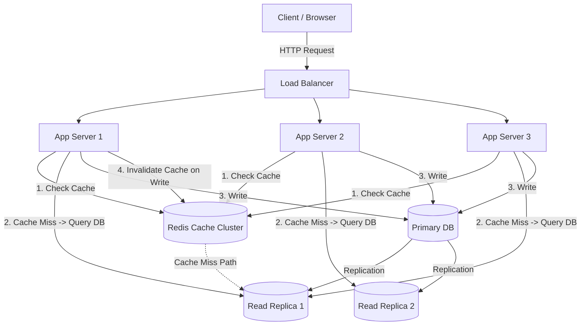

# Caching Strategies

> Caching is the practice of storing copies of frequently accessed data in a faster storage layer so that future requests for that data can be served more quickly than fetching it from the original source.

---

## The Problem

Imagine you're running an e-commerce platform. Your product catalog lives in a PostgreSQL database. Every time a user opens your homepage, your app queries the database for the top 50 trending products. That query joins three tables — products, reviews, and pricing — and takes about 15ms to execute.

At 100 users per second, that's manageable. Your database handles it fine.

Now your app gets featured in a major tech newsletter. Traffic jumps to 10,000 users per second. Suddenly, you're firing 10,000 identical queries per second at your database — the same 50 trending products, over and over. Each query still takes 15ms, but now the database's connection pool is saturated. Queries start queuing. Response times spike from 15ms to 3 seconds. Some requests time out entirely. Your homepage shows blank product cards. Users leave.

Here's the absurd part: 95% of those 10,000 queries per second are returning the exact same data. The trending products list changes maybe once every 5 minutes. You're asking your database the same question ten thousand times a second and getting the same answer every single time.

This is the problem caching solves. Instead of asking the database every time, you store the answer in a faster layer — like Redis, which sits in memory — and serve it from there. A Redis lookup takes about 0.5ms compared to 15ms for your PostgreSQL query. That's a 30x speedup. More importantly, you've reduced database load from 10,000 QPS to near zero for this query, because everyone is reading from the cache.

But caching isn't just "put Redis in front of your database." The real challenge is deciding what to cache, when to update the cache, what to do when the cache goes down, and how to prevent subtle bugs where users see stale data. Get these wrong and caching creates more problems than it solves — stale prices on products, inventory counts that don't match reality, or a thundering herd that crashes your database the moment the cache expires.

---

## Core Concept Explained

Think of caching like a chef's prep station. In a busy restaurant kitchen, a chef doesn't walk to the refrigerator every time they need butter. They keep a small dish of butter at their prep station — faster to reach, instantly available. When the dish runs out, they make one trip to the fridge to refill it. The fridge is the database, the prep station is the cache, and the butter is your hot data.

The fundamental idea behind caching is the **Pareto principle applied to data access**: in most applications, roughly 20% of the data serves 80% of the requests. If you identify that hot 20% and keep it in a faster storage layer, you dramatically improve performance for the majority of your users while only using a fraction of the storage.

### Where Caching Happens

Caching isn't a single layer — it can exist at multiple points in your architecture, and each layer serves a different purpose.

**Client-side cache**: The browser stores static assets (images, CSS, JS) and sometimes API responses. Controlled via HTTP headers like `Cache-Control` and `ETag`. This is the fastest cache because there's zero network latency — the data never leaves the user's device. But you have limited control over it, and invalidation is tricky.

**CDN cache**: Services like CloudFront or Akamai cache your content at edge locations worldwide. When a user in Tokyo requests an image, it's served from a Tokyo edge server instead of your US-based origin server. This reduces latency from ~150ms (cross-Pacific round trip) to ~5ms (local data center). CDNs are excellent for static content and can even cache dynamic API responses with short TTLs.

**Application-level cache**: This is what most people mean when they say "caching" in system design. An in-memory store like Redis or Memcached sits between your application servers and your database. Your app checks the cache first; if the data is there (a "cache hit"), it returns immediately. If not (a "cache miss"), it queries the database, stores the result in the cache, and then returns it. Redis operates at ~100,000 operations per second on a single node, compared to ~10,000-30,000 QPS for a typical PostgreSQL instance.

**Database-level cache**: Databases maintain their own internal caches. PostgreSQL has a shared buffer cache (typically configured at 25% of available RAM) that keeps frequently accessed pages in memory. MySQL has the InnoDB buffer pool that serves a similar purpose. You don't manage these directly, but understanding they exist helps explain why "warm" databases perform better than freshly restarted ones.

### Cache Writing Strategies

This is where caching gets nuanced. The core question is: when data changes, how and when does the cache get updated? There are four main strategies, each with distinct tradeoffs.

**Cache-Aside (Lazy Loading)**: The application manages the cache explicitly. On read: check cache → if miss, read from DB → write to cache → return. On write: write to DB → delete from cache (don't update it). This is the most common pattern because it's simple and the application has full control. The downside is that every cache miss requires two trips (DB read + cache write), and there's a brief window where the cache and database are inconsistent after a write. Redis and Memcached are typically used in this pattern.

**Write-Through**: Every write goes to both the cache and the database synchronously. The cache is always up-to-date, which eliminates the inconsistency window of cache-aside. The downside is write latency increases because you're waiting for both the cache write and the database write to complete. Also, you might cache data that's rarely read — wasting memory on cold data. This pattern works well when you have a high read-to-write ratio and need strong consistency.

**Write-Back (Write-Behind)**: Writes go to the cache first, and the cache asynchronously flushes to the database in batches. This gives you the fastest write latency (just a cache write, which is ~0.5ms) and reduces database load because writes are batched. The risk is data loss — if the cache node dies before flushing to the database, those writes are gone. Use this when write speed matters more than durability, like for analytics counters or activity feeds where losing a few data points is acceptable.

**Write-Around**: Writes go directly to the database, bypassing the cache entirely. The cache only gets populated on reads (via cache-aside). This avoids polluting the cache with data that might never be read, but means the first read after a write always results in a cache miss. This is good for write-heavy workloads where most written data is rarely read back immediately.

### Eviction Policies

Caches have limited memory. When the cache is full and new data needs to be stored, you need a policy for deciding what to kick out. The most common policies are:

**LRU (Least Recently Used)**: Evict the data that hasn't been accessed for the longest time. This works well for most workloads because it assumes recently accessed data is likely to be accessed again. Redis uses an approximated LRU by default — it samples a handful of keys and evicts the least recently used among the sample, which is more memory-efficient than maintaining a perfect LRU ordering.

**LFU (Least Frequently Used)**: Evict the data that's been accessed the fewest times. This is better than LRU when you have some data that's accessed rarely but repeatedly (like a product that sells slowly but steadily) mixed with data that's accessed in bursts (like a trending topic that spikes and dies). Redis supports LFU since version 4.0.

**TTL (Time-To-Live)**: Every cached item expires after a set time regardless of access patterns. Simple and predictable. Often combined with LRU — items expire naturally via TTL, and LRU handles eviction when memory pressure hits before TTLs expire.

---

## Architecture Diagram

### Mermaid Diagram

### Diagram Walkthrough

Starting from the top, a client sends an HTTP request that first hits the load balancer. The load balancer distributes requests across three stateless application servers — stateless meaning none of them hold user-specific data in memory, so any server can handle any request.

When an app server receives a read request — say, "get product details for product ID 12345" — it follows the cache-aside pattern. Step 1: it checks the Redis cache cluster first. Redis stores data in memory and responds in about 0.5ms. If the product data is in Redis (a cache hit), the app server returns it immediately. For a well-tuned cache, this happens 85-95% of the time.

Step 2 only happens on a cache miss. The app server queries one of the PostgreSQL read replicas. The read replicas are copies of the primary database that handle read traffic, reducing load on the primary. The query takes about 5-15ms depending on complexity. After getting the result, the app server writes it into Redis with a TTL (say, 10 minutes) so subsequent requests for the same product are served from cache.

Step 3 handles write operations. When a user updates something — like a seller changing a product price — the write goes to the primary PostgreSQL database. The primary then replicates the change to the read replicas asynchronously (typically within milliseconds, but can lag under heavy load).

Step 4 is cache invalidation. After writing to the database, the app server deletes the corresponding key from Redis. It deletes rather than updates because deletion is simpler and safer — the next read will see a cache miss, fetch fresh data from the database, and repopulate the cache. This avoids race conditions where two simultaneous writes could leave the cache with stale data.

---

## How It Works Under the Hood

### Redis Internals (How the Most Popular Cache Actually Works)

Redis stores all data in main memory using a hash table as its primary data structure. Keys are hashed to bucket positions, and values are stored as Redis objects that can represent strings, lists, sets, sorted sets, or hashes. This in-memory storage is what gives Redis its speed — there's no disk I/O on reads.

For memory management, Redis uses `jemalloc` as its allocator and tracks memory usage internally. When you set `maxmemory` (say, 16GB), Redis will begin evicting keys according to your chosen policy once that threshold is reached. The approximated LRU works by sampling — by default, Redis samples 5 random keys from the keyspace and evicts the one with the oldest access time. Increasing the sample size (via `maxmemory-samples`) improves LRU accuracy at the cost of slightly more CPU per eviction.

For persistence (protecting against data loss on restart), Redis offers two mechanisms. RDB (Redis Database Backup) takes point-in-time snapshots at configured intervals by forking the process — the child writes the snapshot while the parent continues serving requests using copy-on-write. AOF (Append-Only File) logs every write operation and can replay them on restart. AOF is more durable (you can configure `fsync` to happen every second or on every write) but uses more disk I/O and disk space. Many production deployments use both: RDB for faster restarts and AOF for minimal data loss.

### Cache Stampede (Thundering Herd) Problem

This is one of the most dangerous caching failure modes. Imagine a cache key that's accessed 5,000 times per second expires. In the instant it expires, all 5,000 requests simultaneously experience a cache miss. They all query the database at once. The database, which was happily handling 50 QPS (because the other 4,950 were served by cache), is suddenly hit with 5,000 queries in one second. It buckles.

There are several solutions.

**Lock-based approach (lease)**: When a cache miss occurs, the first thread acquires a lock (using Redis `SETNX`) and fetches from the database. Other threads see the lock and wait (or return a stale value) instead of also querying the database. Once the first thread repopulates the cache, it releases the lock and all waiting threads read from cache.

**Early expiration (probabilistic refresh)**: Instead of waiting for the TTL to actually expire, each request has a small probability of refreshing the cache before expiration. The probability increases as the TTL approaches zero. This spreads cache refreshes over time instead of having them all happen at once. XFetch is a well-known implementation of this approach.

**Never expire (background refresh)**: The cache key never expires. A background worker periodically refreshes it. This eliminates stampedes entirely but requires managing the background refresh logic and means data can be stale between refresh intervals.

### Cache Invalidation Strategies

Phil Karlton famously said there are only two hard things in computer science: cache invalidation and naming things. Here's why invalidation is hard.

**TTL-based**: Simple and predictable but trades off freshness. A 5-minute TTL means users might see data that's up to 5 minutes old. For a product catalog, this is usually fine. For a bank balance, it's not.

**Event-based**: When data changes, publish an event that triggers cache invalidation. This is near-real-time but requires an event infrastructure (like Kafka or Redis Pub/Sub) and careful handling of event ordering and delivery guarantees.

**Version-based**: Store a version number with each cached item. On write, increment the version. On read, check if the cached version matches the current version. This avoids the ABA problem where data changes to A -> B -> A and a TTL-based cache never notices the intermediate change.

---

## Key Tradeoffs & Limitations

**Memory cost vs performance gain**: Redis memory is 5-10x more expensive per GB than SSD storage. Caching your entire database in Redis defeats the purpose — you should cache the hot 10-20% of data that serves 80%+ of reads. Monitor your cache hit ratio: below 80% and you should re-evaluate what you're caching.

**Consistency vs speed**: Every cache introduces a window of inconsistency. Cache-aside with deletion-on-write minimizes this window to the time between the DB write and the cache delete (usually milliseconds). But for financial data, even milliseconds of inconsistency might be unacceptable, in which case you might skip caching for those specific operations and accept higher latency.

**Complexity vs simplicity**: Adding a cache layer means your team now manages another piece of infrastructure. Redis needs monitoring, backup, failover configuration, and cluster management. For a small service with a few hundred QPS, a well-indexed database might be all you need. Don't cache prematurely.

**Choose caching when**: Read-to-write ratio is high (10:1 or more), the same data is requested repeatedly, slight staleness is acceptable, and database load is a bottleneck.

**Skip caching when**: Write-heavy workload with low read frequency, data must be absolutely real-time consistent, dataset is small enough that the database handles it comfortably, or access patterns are highly random with no hot data.

---

## Common Misconceptions

**"More caching is always better."** In reality, caching data that's rarely accessed (cold data) wastes expensive memory and adds latency through cache misses. If your cache hit ratio is below 80%, you're caching the wrong things. Worse, caching writes that are never read (common with write-around) creates a false sense of optimization while your cache fills with useless data.

**"Redis is just a cache."** Redis is frequently used as a cache, but it's actually a full-featured data store. It supports data structures like sorted sets (used for leaderboards), streams (used for event logs), pub/sub (used for real-time notifications), and Lua scripting for atomic operations. Many systems use Redis as a primary data store for specific use cases, not just as a cache layer in front of a database.

**"Caching eliminates the need to optimize your database."** A cache masks slow queries — it doesn't fix them. If your cache goes down (and it will, eventually), every slow query hits the database directly. If those queries haven't been optimized with proper indexes, your database will collapse under the sudden load. Always optimize your database queries first, then add caching for additional performance.

**"Cache invalidation is solved by setting a TTL."** TTL handles expiration but doesn't handle correctness. If a user updates their profile photo and the old photo is cached with a 1-hour TTL, they'll see the old photo for up to an hour. For user-facing data changes, you need active invalidation (delete the key on write) combined with TTL as a safety net.

**"Distributed caches are infinitely scalable."** Redis Cluster partitions data across nodes, but it doesn't magically handle hot keys. If one product goes viral and 50,000 requests per second hit a single Redis key, that key lives on a single shard, and that shard becomes the bottleneck. Solutions include local in-memory caching (L1 cache) on app servers for ultra-hot keys, or using read replicas within the Redis cluster.

---

## Real-World Usage

**Facebook (TAO)**: Facebook built TAO (The Associations and Objects cache), a custom distributed caching layer that serves billions of requests per second. TAO sits in front of MySQL and caches the social graph — user relationships, posts, and comments. It uses a write-through strategy where writes go to both the cache and MySQL, and it handles cross-datacenter invalidation to keep caches consistent across Facebook's global infrastructure. At peak, TAO serves over 99% of read requests from cache.

**Twitter (timeline caching)**: Twitter uses Redis extensively for caching user timelines. When a user with millions of followers tweets, Twitter uses a fanout-on-write approach — it pre-computes and caches the timeline for each follower. This means the "read" (loading your timeline) is a simple Redis lookup, which is critical because timeline reads happen orders of magnitude more often than tweet writes. Twitter maintains one of the largest Redis deployments in the world, with thousands of Redis instances.

**Netflix (EVCache)**: Netflix built EVCache, a distributed caching solution based on Memcached, that handles tens of millions of requests per second across their global infrastructure. EVCache is used for everything from user session data to personalized recommendations to video metadata. Netflix replicates cache data across availability zones so that a single zone failure doesn't cause a cache stampede against their databases. They've shared that EVCache has a global hit rate above 99%.

---

## Interview Angle

**Q: You're designing a system and your interviewer asks "how would you handle a hot key problem in your cache?"**
**How to approach it:**
- Start by explaining what a hot key is — a single cache key receiving disproportionate traffic, like a trending topic or viral product.
- Discuss solutions in order of complexity: local in-memory L1 caches, key replication, then shard-level read scaling.
- Explain the tradeoffs of each option, especially memory duplication versus invalidation complexity.
- Mention that the right answer depends on whether the hot key is temporary or structurally hot.

**Q: How would you ensure cache consistency with the database?**
**How to approach it:**
- Start with cache-aside and delete-on-write as the boring default.
- Explain why deleting is often safer than updating because it avoids stale overwrite races.
- Discuss the inconsistency window and whether that window is acceptable for the workload.
- If stronger guarantees are needed, mention write-through and event-driven invalidation.

**Q: Your cache goes down. What happens and how do you handle it?**
**How to approach it:**
- Describe the immediate blast radius: cache misses turn into a database traffic surge.
- Talk about circuit breakers, request shedding, graceful degradation, and connection pool protection.
- Mention high availability patterns such as Redis Sentinel, Redis Cluster, or multi-AZ Memcached deployments.
- Explain cache warming to avoid another spike during recovery.

**Q: When would you NOT use caching?**
**How to approach it:**
- Show judgment by naming workloads where caching adds little or negative value.
- Call out strict consistency systems, write-heavy workloads, and random-access patterns with poor locality.
- Explain that small systems often get more value from query optimization than from adding Redis.
- Make it clear that operational complexity is part of the cost model.

---

## Connections to Other Concepts

**Concept 11 - Consistent Hashing**: When scaling a cache beyond a single node, consistent hashing determines which node stores which keys. Without consistent hashing, adding or removing a cache node would invalidate nearly every key because traditional modular hashing remaps most keys. Consistent hashing ensures only about 1/N of keys move when a node changes, which is critical for keeping hit rates stable during scaling.

**Concept 08 - Database Replication**: Caching and replication are complementary read-scaling strategies. Replication creates copies of your database to handle more read traffic, while caching keeps the hottest data in a faster storage layer. A common production architecture uses both so that Redis absorbs 85-95% of reads and replicas handle the remaining misses.

**Concept 03 - CDN & Edge Computing**: A CDN is essentially a geographically distributed cache for static and sometimes semi-dynamic content. Many of the same principles apply, including TTL tuning, cache invalidation, and hit-ratio optimization. The key difference is that CDN caching optimizes network latency, while Redis optimizes application and database latency.

**Concept 14 - Message Queues & Stream Processing**: Event-driven cache invalidation often relies on queues or streams. When a write occurs, a service can publish an event that invalidation workers consume to delete or update related cache keys across multiple services. This becomes important once your architecture grows beyond a single application process.

**Concept 19 - Fault Tolerance Patterns**: Cache outages are a common source of cascading failure. Circuit breakers, bulkheads, and graceful degradation patterns determine whether a cache incident becomes a minor latency bump or a full system outage. Designing the cache layer without these patterns is a reliability mistake.
