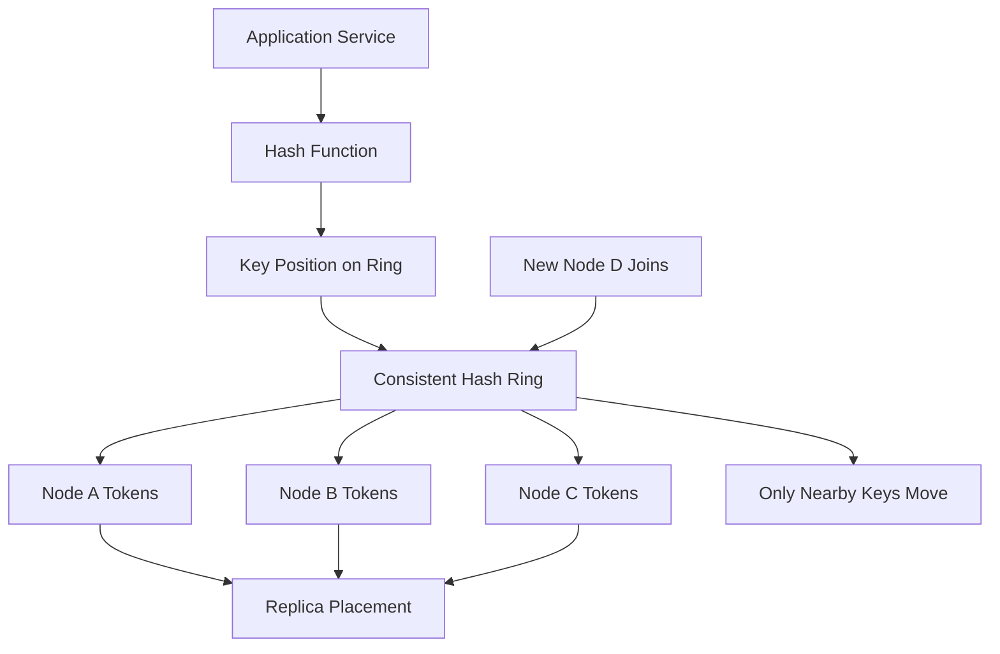

# Consistent Hashing

> Consistent hashing is a way to spread keys across changing sets of servers so that when a node is added or removed, only a small fraction of keys have to move.

---

## The Problem

Imagine you run a distributed cache cluster for product pages on a busy marketplace. Ten cache nodes sit behind your application fleet, and each node holds roughly 50GB of hot objects. During a normal hour, the cluster serves 120,000 cache reads per second with a 92% hit rate, which keeps your database comfortable.

Then one cache node fails. If your system assigns keys with a simple formula like `hash(key) % 10`, the moment the cluster changes from 10 nodes to 9, almost every key gets remapped. In practice that means a catastrophic cold-cache event. Product `123` that used to live on node 7 now goes to node 4. Product `124` moves somewhere else. Nearly the entire working set is suddenly "missing," even though the data still exists on surviving nodes. Your hit rate crashes from 92% to 15%, the database sees a 6x read surge, and p99 latency jumps from 40ms to 1.8 seconds.

Now flip the scenario. Traffic grows, so you add an eleventh node to increase capacity. That should be a good thing. But with naive hashing, adding one node again remaps almost everything, so scaling out creates the same giant cache miss storm as a failure. You wanted more capacity and got a self-inflicted outage instead.

This is the problem consistent hashing solves. It gives you a key-to-node mapping that stays mostly stable as membership changes. Add one node to a ten-node ring and only about 1/11 of the keys should move. Lose one node from ten and only the keys that belonged to that node should be reassigned. That single idea turns cluster resizing, failover, and rolling maintenance from a full-cache meltdown into a manageable rebalancing event. It is one of those concepts that sounds abstract on a whiteboard but becomes painfully concrete the first time a cluster change remaps millions of hot keys.

---

## Core Concept Explained

Think of a circular running track with mile markers painted around it. Every data key, like `user:1234` or `product:9981`, is assigned a marker on that track by a hash function. Every server is also assigned one or more markers on the same track. To decide where a key belongs, you stand at the key's marker and walk clockwise until you hit the first server marker. That server owns the key. If that server disappears, you keep walking until you hit the next one. If a new server appears, only the keys that fall into its newly claimed segment move.

That is the intuition behind consistent hashing: keys and nodes both live in the same logical hash space, which is often visualized as a ring from `0` to `2^32 - 1` or `0` to `2^64 - 1`. The ring is not a network topology. It is just a mathematical ordering of points.

### Why modular hashing breaks

The naive approach for assigning a key to a node is `hash(key) % N`, where `N` is the number of nodes. It is simple, fast, and completely fine when `N` never changes. The problem is that `N` does change in real systems. If `N` goes from 10 to 11, the modulus changes for almost every key. Statistically, about 10/11 of keys move. That is disastrous for caches and expensive for storage systems.

Consistent hashing replaces "divide by node count" with "find the next node on a ring." Because the ring ordering is stable, adding or removing one node only affects nearby regions of the ring rather than every key in the system.

### Ring architecture

In the simplest version, each physical node gets one position on the ring. Suppose you have three nodes:

- Node A at hash position `100`
- Node B at `600`
- Node C at `900`

If a key hashes to `650`, you move clockwise and land on Node C. If a key hashes to `920`, you wrap around the ring and land on Node A. That wraparound property is why people draw a circle instead of a line.

This design gives the core rebalancing behavior you want. If Node D is added at `700`, only the keys between `600` and `700` move from Node C to Node D. Everything else stays where it was. If Node B fails, only the keys in B's segment move to the next live node clockwise.

### Virtual nodes

Real systems do not usually stop at one point per physical node because hash distributions are never perfectly even. With only one token each, one node may accidentally own 40% of the ring and another only 15%. That leads to uneven memory use, uneven traffic, and hotspots.

The standard fix is virtual nodes, sometimes called vnodes. Instead of giving one server one point, you give it many points, often 100 to 256 tokens or more depending on the system. A cluster with 20 physical nodes and 128 virtual nodes each has 2,560 ring positions. That smooths the distribution dramatically. It also makes weighted capacity easy: a node with twice the RAM or CPU can simply be given roughly twice as many tokens.

Virtual nodes are one of those details that separates a toy explanation from a production-ready design. Without them, consistent hashing works in principle but behaves poorly in practice.

### Membership changes

Consistent hashing is valuable because clusters change constantly. Nodes fail. New nodes are added. Old nodes are replaced. Instances are drained for maintenance. With consistent hashing:

- Adding one node moves only the keys in the intervals that node now owns.
- Removing one node moves only the keys that node owned.
- Replacing one node with another at the same token set can keep remapping extremely small.

That means scaling operations are proportional to the changed capacity, not to the whole cluster. In a 12-node cache cluster, adding one node ideally remaps about 1/13 of the keys, roughly 7.7%. Compare that to modular hashing, which would remap about 12/13, or 92.3%.

### Replica placement

Consistent hashing also helps with replicas. If replication factor is 3, the primary owner of a key is the first node clockwise from the key position, and the next two distinct nodes clockwise can hold replicas. That produces a stable, deterministic placement rule. When a node fails, reads or writes can continue on the next replica candidates without recomputing a completely different layout.

### Where it gets used

This shows up in distributed caches, object stores, key-value databases, message routing, and even some load-balancing systems. Memcached client libraries use ring hashing to pick which cache server holds a key. Dynamo-style systems use token ranges to place data across storage nodes. Proxies use ring-hash policies to keep requests for the same session or tenant landing on the same backend while minimizing disruption during backend changes.

So the headline idea is simple: stable placement under change. But the real reason engineers care is that stable placement protects hit rate, network transfer volume, and operational sanity.

---

## Architecture Diagram

### Mermaid Diagram

### Diagram Walkthrough

Starting from the top left, the application service needs to read or write a key such as `cart:91827` or `video:chunk:44`. It does not pick a node by counting how many servers exist. Instead it first sends the key through a hash function. That hash function turns the key string into a numeric position on the ring, such as `4,128,551,902` in a 32-bit space.

That numeric result becomes the key position on the ring. The ring is shown as a logical component in the center because it is the stable map that both clients and servers agree on. Around that ring are token positions belonging to Node A, Node B, and Node C. In a real cluster each physical node has many tokens, not just one, but the diagram abstracts that into "Node A Tokens" and so on.

The first request flow is the normal lookup flow. The application hashes the key, finds its position, then walks clockwise on the ring until it finds the first token owned by a live node. If that token belongs to Node B, Node B becomes the primary owner for the key. If the system uses replicas, the next distinct nodes clockwise are chosen as additional owners. That is what the "Replica Placement" box represents: the placement rule is derived from ring order, not from a separate random algorithm.

The second request flow is the membership-change flow. A new node, Node D, joins the cluster and inserts its own tokens into the ring. The important outcome is captured by the "Only Nearby Keys Move" box. Keys that fall into the token intervals newly claimed by Node D move to it. Keys that are nowhere near those intervals stay exactly where they were before. That is the operational win of consistent hashing. Adding capacity does not force a cluster-wide reshuffle.

You can also imagine a failure flow using the same diagram. If Node B disappears, the application still hashes the key to the same position on the ring, but now the first live node clockwise may be Node C. Only the segment that used to map to Node B changes ownership. Everyone else keeps serving the same keys from the same nodes, which is why cache hit rates and replica locality stay far more stable than with naive modulo-based placement.

---

## How It Works Under the Hood

Under the hood, a consistent hash ring is usually implemented as a sorted map of token positions to node identities. Each token is the hash of some node-specific string like `node-a#17`. When a client needs to place a key, it hashes the key once, then performs a binary search over the sorted token list to find the first token greater than or equal to the key hash. If the search falls off the end, it wraps to the first token in the list. With `V` total virtual nodes, lookup is typically `O(log V)` after hashing.

Virtual nodes are the critical balancing mechanism. If you have 50 physical nodes and assign each 128 virtual nodes, you get 6,400 token positions. The variance of ownership drops dramatically compared with giving each node a single token. Systems like Cassandra historically exposed token counts directly because token granularity affects both balance quality and operational cost. More tokens improve smoothness, but they also increase metadata size, rebalance bookkeeping, and failure-recovery complexity.

Replica placement usually walks clockwise and selects the next `R` distinct nodes, where `R` is the replication factor. The word "distinct" matters because a node may have many tokens close together on the ring, but you do not want all replicas on the same machine. In multi-rack or multi-zone systems, placement logic is often topology-aware: choose the next distinct nodes that are also in different racks or availability zones. That turns the ring into a placement primitive, not the full placement policy.

Hotspot handling is where consistent hashing needs help. A perfect ring can still be skewed if one key is disproportionately popular. If one tenant generates 40,000 requests per second to a single key, that traffic still lands on one primary token range and maybe a few replicas. The ring minimized remapping cost, but it did not split the hot key. Common mitigations include key replication with suffixes, request coalescing, local L1 caches, or splitting a hot tenant across subkeys. Consistent hashing solves balance across many keys, not hotness of one key.

Membership changes also have operational mechanics. When a node joins, it announces its tokens, clients or routers refresh their ring view, and the affected key ranges begin migrating. In a cache, migration may be lazy: misses refill the new owner naturally. In a storage system, migration is explicit data streaming. If a new node should own 8% of the ring in a 12TB cluster, roughly 960GB may need to move. That is much better than moving nearly all 12TB, but it is still substantial network and disk work.

Failure handling depends on ring-view consistency. If half the clients think Node D exists and the other half do not, writes can go to different owners. Mature systems therefore centralize membership in a service registry, gossip protocol, or coordinator and version the ring configuration. Clients roll forward to new ring views in a controlled way rather than making independent guesses.

It is also worth comparing consistent hashing with rendezvous hashing, also called highest-random-weight hashing. Instead of placing nodes on a ring, rendezvous hashing computes a score for each node for a given key and chooses the highest-scoring node. It has an elegant property: no ring, no wraparound, and natural support for picking the top `k` nodes. The tradeoff is that a naive implementation evaluates every node per lookup, which is `O(N)` rather than `O(log V)`. For clusters with dozens of nodes, that can be perfectly acceptable. For very large routing tables, ring-based methods or precomputed tables may be more efficient.

Finally, consistent hashing does not magically guarantee equal load. Hash distributions are probabilistic, workloads are skewed, and node sizes differ. The ring gives you graceful change behavior and good average balance. Production systems still need monitoring for per-node QPS, bytes stored, rebalance duration, and token skew.

---

## Key Tradeoffs & Limitations

The biggest benefit of consistent hashing is stability under change, but you pay for that stability with extra complexity. Someone has to manage token assignment, ring versioning, health status, and rebalancing logic. For a three-node internal service that rarely changes membership, simple partition maps may be easier to reason about than a full ring.

Virtual nodes improve balance, but they increase metadata and operational churn. A cluster with 200 nodes and 256 virtual nodes each means 51,200 token entries. That is still manageable, but it is no longer conceptually tiny. Rebuilding ring maps, debugging skew, and explaining ownership to on-call engineers become harder than in a fixed-shard design.

Choose consistent hashing when nodes come and go and remapping cost matters, especially for caches, storage clusters, and sticky routing. Choose a static partition map when membership is stable and you want explicit operator control over where each range lives. Choose rendezvous hashing when implementation simplicity and weighted selection matter more than using a ring abstraction.

Consistent hashing also does not solve every scaling problem. It minimizes how many keys move when membership changes, but it does not reduce the cost of moving the keys that do need to move. If each node owns 2TB of immutable blobs, losing one node still triggers a large data transfer. It also does nothing for a pathological hot key, poor replica placement across zones, or clients that are running stale ring metadata.

If your application has fewer than a handful of cache nodes and can tolerate a full warm-up after rare maintenance events, consistent hashing may be unnecessary complexity. But once a cluster is large enough that "node change equals cluster-wide remap" becomes painful, the trade flips quickly in its favor.

---

## Common Misconceptions

**Many people believe consistent hashing guarantees perfectly equal distribution.** It does not. It gives good probabilistic balance and excellent remapping behavior, but real rings still have skew, especially without enough virtual nodes. The misconception exists because diagrams show beautifully even circles, while real hash outputs are messy.

**A common belief is that consistent hashing solves hotspot problems automatically.** It only spreads many independent keys across nodes. One ultra-hot key still lands on one primary placement and can overload that shard. People believe the misconception because "balanced distribution" sounds like "balanced traffic," but those are not the same thing.

**Many engineers assume virtual nodes are an optional optimization.** In small demos they are optional. In real clusters they are usually what makes the distribution acceptable, especially when node sizes differ or membership changes frequently. The misconception survives because the single-token explanation is simpler to teach.

**People often think the ring is the whole system.** In practice the ring is only one component. You still need membership coordination, replica health, zone awareness, and data migration mechanics. The misconception exists because consistent hashing is usually introduced mathematically before the operational pieces are discussed.

**Some believe rendezvous hashing is always superior because it avoids a ring.** It is elegant, but "better" depends on workload, cluster size, and implementation constraints. Ring hashing can be more efficient for large repeated lookups with precomputed structures, while rendezvous hashing can be simpler and more flexible for moderate node counts.

---

## Real-World Usage

**Amazon Dynamo** made token-based partitioning famous. In the Dynamo paper, each storage node owns positions on a logical ring and keys are placed by hashing into that space, with replicas stored on the next nodes clockwise. The real production value was not just even distribution but graceful membership change in an environment where failures and repairs were expected.

**Memcached clients using Ketama-style hashing** are a classic cache example. Large web applications used consistent hashing so that adding or removing one cache server would only invalidate a small portion of the keyspace instead of blowing away the entire cluster's hit rate. That mattered enormously when a cluster held gigabytes or terabytes of hot session and page-fragment data.

**Envoy ring-hash load balancing** uses consistent-hash-style routing so requests with the same header, cookie, or other key can land on the same backend. This is useful for session affinity and cache locality while still limiting remapping during backend membership changes. It is a good reminder that consistent hashing is not only about data storage; it is also a traffic-routing tool.

**Akamai-style CDN mapping** has historically relied on hashing and stable assignment ideas to keep clients or content mapped predictably across a changing global edge network. At CDN scale, minimizing remap is not just about cache hits but also about avoiding unnecessary origin fetches and keeping locality strong across thousands of servers.

---

## Interview Angle

**Q: Why is consistent hashing better than `hash(key) % N` for distributed caches?**
**How to approach it:**
- Start with the operational event: node added, removed, or failed.
- Explain that modulo hashing remaps most keys when `N` changes, while consistent hashing only remaps the affected segments.
- Use a concrete example such as 10 nodes becoming 11 and only about 1/11 of keys moving.
- Tie the answer to cache hit rate and database protection, not just algorithm elegance.

**Q: What problem do virtual nodes solve?**
**How to approach it:**
- Explain uneven range ownership when each physical node has only one token.
- Show how many virtual tokens smooth the distribution and allow weighted capacity.
- Mention the tradeoff: more metadata and slightly more complicated rebalancing.
- A strong answer connects vnodes to production balance, not just textbook theory.

**Q: How would you place replicas on a consistent hash ring?**
**How to approach it:**
- Start with the first owner as the first node clockwise from the key.
- Then walk clockwise to select the next distinct nodes, respecting rack or zone diversity if available.
- Mention failure handling and the need to skip dead or duplicate physical nodes.
- Strong answers call out that replica placement policy often adds topology awareness on top of the ring.

**Q: When would you choose rendezvous hashing instead of ring-based consistent hashing?**
**How to approach it:**
- Compare their mental models first: ring plus binary search versus per-node scoring.
- Mention that rendezvous hashing can be simpler and naturally produces top-k owners.
- Explain the cost of naive `O(N)` scoring and when that is acceptable.
- Show judgment by saying the choice depends on cluster size, update frequency, and implementation simplicity.

---

## Connections to Other Concepts

**Concept 09 - Database Sharding & Partitioning** is the closest neighbor to this topic. Consistent hashing is one concrete way to assign partitions or shards to storage nodes while keeping rebalancing manageable as the cluster grows.

**Concept 10 - Caching Strategies** often relies on consistent hashing under the hood once a cache grows beyond one node. The caching policy decides what lives in the cache, while consistent hashing decides which node should own each cached item and how painful membership changes will be.

**Concept 08 - Database Replication** connects through replica placement. A ring can identify the primary owner of a key and then choose the next nodes clockwise as replicas, but replication adds the separate questions of how writes are propagated and what consistency guarantees those replicas provide.

**Concept 02 - Load Balancing Deep Dive** intersects with consistent hashing when a proxy wants affinity without massive remapping during backend changes. Ring-hash or cookie-hash routing lets related requests land on the same backend while preserving graceful change behavior.

**Concept 19 - Fault Tolerance Patterns** matters because consistent hashing is fundamentally about graceful failure handling at the placement layer. When a node disappears, only a bounded portion of traffic or data should move, which reduces the chance that one failure cascades into a system-wide overload event.
