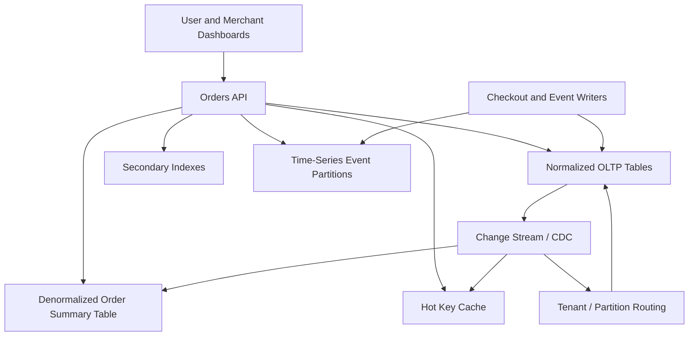

# Data Modeling for Scale

> Data modeling for scale is the practice of shaping your tables, documents, keys, and indexes around real access patterns so the system stays fast when traffic, tenants, and data volume grow by orders of magnitude.

---

## The Problem

Imagine you are building a fast-growing B2B commerce platform. In month one, the data model looks elegant. You have normalized tables for `customers`, `orders`, `order_items`, `shipments`, `payments`, `products`, `warehouses`, and `inventory_events`. Every relationship is clean. Every piece of data lives in exactly one place. On a normal day with 5,000 orders, queries run in 10 to 20ms and everyone feels smart.

Then growth happens. One enterprise tenant lands and starts placing bursty wholesale orders across hundreds of SKUs. The customer dashboard now loads the last 100 orders, joins line items, shipment states, payment status, and warehouse availability, then filters by region and date. What used to be one polite query is now a multi-join monster touching millions of rows. p95 latency climbs from 40ms to 1.8 seconds. The hottest tenant owns 35% of all traffic, so one part of the database is constantly overloaded while other parts sit mostly idle.

The pain gets worse in places that do not look like database problems at first. A background job calculating revenue by merchant now scans an ever-growing orders table. A single "popular product" key gets hit 20,000 times per second and becomes a hot partition. One new secondary index doubles write cost because every insert now updates more storage structures. A schema change that seemed harmless turns into a three-hour migration because the table has 2 billion rows and the database cannot rewrite it without blowing the maintenance window.

This is the problem data modeling for scale solves. At small scale, you can get away with modeling data the way it looks conceptually. At large scale, you have to model it for how it is actually read, written, partitioned, cached, indexed, and evolved over time. A beautiful conceptual model can become an operational disaster if it creates hot keys, expensive joins, write amplification, or unbounded partitions. Good data modeling is not just about correctness. It is about making the common path cheap, the rare path tolerable, and future growth survivable.

---

## Core Concept Explained

Think of data modeling like designing a warehouse. If you organize boxes alphabetically because it feels tidy, you may end up putting the most frequently picked items on the highest shelves at the farthest wall. The warehouse is technically organized, but the workers spend all day walking. A well-designed warehouse puts high-turnover items near the loading dock, bulky items in places with enough space, and cold inventory in slower storage. Data modeling works the same way. The question is not just "what data exists?" The deeper question is "which data gets accessed together, how often, and under what latency budget?"

The biggest mindset shift is **access-pattern-first design**. Junior engineers often start from entities: users, orders, products, messages, invoices. Senior engineers start from queries and write paths: "show a user's last 50 orders in under 100ms," "append one new event per device every second," "look up a merchant by domain," "load a chat channel's latest 25 messages," "aggregate daily revenue by tenant." Those access patterns determine what shape the data should take.

### Normalization vs denormalization

Normalization reduces duplication and keeps updates clean. In a normalized SQL design, `users` live in one table, `addresses` in another, and `orders` reference them by ID. This is excellent for consistency and storage efficiency. If a shipping address changes, you update one row, not 200 copies. That is why normalization is usually the right starting point for transactional data.

But at scale, read cost matters just as much as write correctness. If a dashboard query always needs order summary, merchant name, current payment status, and recent shipment events together, forcing a five-table join on every page load may be the wrong shape even if it is logically pure. Denormalization means intentionally duplicating some data to make the common read cheaper. That might mean storing `merchant_name` on an order summary table, maintaining a materialized `user_order_feed`, or precomputing daily aggregates. The tradeoff is obvious: faster reads in exchange for more complex writes and data freshness rules.

The senior move is not "normalize everything" or "denormalize everything." It is: normalize the source of truth where correctness matters, and denormalize read models where latency matters.

### Access patterns drive keys and indexes

Every data store rewards some access patterns and punishes others. PostgreSQL loves well-indexed point lookups and range scans on B-tree-friendly columns. DynamoDB loves predictable primary-key access and punishes scans. Cassandra handles massive write throughput well but gets unhappy when partitions grow without bound. Elasticsearch is superb for text search but not your source of truth for money movement.

That means the primary key is not just an ID choice. It is a traffic-distribution choice. If all requests for a "global config" document hit one key, that key becomes a hotspot. If all time-series events for a device go into a single unbounded partition, reads may stay easy at first and become awful later. Good keys spread write load, preserve useful locality, and support the most important reads with minimal extra work.

Secondary indexes are powerful, but they are not free. In PostgreSQL, each new index means extra disk, extra memory pressure, and extra write cost because inserts and updates must maintain the index structure. In DynamoDB, a global secondary index can double or triple write amplification because each write fans out to more storage paths. Add indexes for high-value queries, not because "someone might need to filter by that one day."

### Hot keys and skew

One of the most common scaling failures is not overall volume but skew. Ten million evenly distributed requests are easier than one million requests all hitting the same tenant, the same product, or the same partition. Hot keys appear in social graphs, trending hashtags, celebrity profiles, and top-selling products. Once skew exists, average metrics lie to you. The whole cluster can look 40% utilized while one shard is melting at 100%.

The data model needs to anticipate skew. Common techniques include tenant-aware partitioning, bucketing by time or suffix, write sharding for counters, and separating ultra-hot entities into their own storage path. If one customer generates 50x more traffic than everyone else, pretending all tenants are equal is not a modeling decision. It is wishful thinking.

### Time-series and append-only patterns

A lot of scaled systems are really event systems in disguise. Metrics, logs, order events, audit trails, chat messages, clickstreams, and financial ledger entries are all append-heavy. Modeling them as mutable current-state rows often creates pain. An append-only pattern is usually safer and faster: insert a new event, keep historical order, then build derived views for the current state.

Time-series data especially benefits from bounded partitions. You may partition by day, hour, tenant plus day, or device plus week depending on access patterns. The reason is not fashion. It is operational control. If each partition is a day, retention is easy, queries prune quickly, and compaction stays manageable. If all time-series data lives in one giant logical bucket, every maintenance task becomes harder.

### Multi-tenant and relationship modeling

Multi-tenant systems need a deliberate choice between shared tables and tenant isolation. A shared table with `tenant_id` on every row is operationally simple and efficient at small to medium scale. It also makes per-tenant analytics, authorization filters, and sharding decisions straightforward if the key design is good. But if a few tenants become enormous, you may need tenant-based partitioning, separate physical databases for whales, or hybrid isolation where most tenants share infrastructure and the top 1% get dedicated capacity.

Relationships matter too. Many-to-many graphs look elegant in ER diagrams and brutal in production. If an application constantly asks "what are the latest 20 things for this user?" then a feed table or denormalized join table may be far more useful than reconstructing that answer from normalized base records each time. Modeling is about turning expensive repeated computation into cheaper stored structure.

### Schema evolution

Finally, scale turns schema change into a first-class design concern. Adding a nullable column to a small table is trivial. Rebuilding an index on 4TB of data is not. Good models evolve safely through additive changes, backfills, dual reads or writes, and version-tolerant producers and consumers. If your design only works when you can stop the world for migrations, it is not actually ready for scale.

---

## Architecture Diagram

### Mermaid Diagram

### Diagram Walkthrough

Starting from the top left, users and merchant dashboards send requests into the Orders API. That API is the entry point where access patterns get translated into storage choices. Not every request goes to the same underlying shape of data, even though they all feel like "order data" to the caller.

The normalized OLTP tables in the center represent the source of truth. This is where the system stores core entities such as orders, order items, payments, and shipments in a form optimized for transactional correctness. When checkout writers create a new order, that write goes into the OLTP tables first because this is the authoritative state that downstream systems can trust.

There is also a separate path for time-series event partitions. Checkout flows and other writers emit append-only events such as `order_created`, `payment_authorized`, `inventory_reserved`, and `shipment_scanned`. Those events are written to partitioned time-series storage because they are naturally ordered by time and often queried in batches by time window, tenant, or entity.

The most important asynchronous path starts when OLTP changes feed a change stream or CDC pipeline. That stream builds the denormalized order summary table and refreshes hot-key cache entries. This is the key modeling idea: do the expensive joining and reshaping once on write or near-write, so read-heavy dashboards do not have to reconstruct the same answer on every request.

The secondary indexes on the right support important alternate lookups, such as finding orders by external reference, merchant domain, or customer email. They are shown as separate components because they are separate cost centers. Every index makes some read cheap and every write more expensive.

Two request flows make the diagram concrete. In the transactional flow, a checkout request goes through the API into the normalized OLTP tables, emits events into the time-series partitions, and then propagates through the change stream to refresh read models. In the dashboard flow, a merchant requests the last 50 orders. The API first checks the hot-key cache for a precomputed summary. If the cache misses, it uses the denormalized order summary table and relevant secondary indexes instead of reconstructing the view with many deep joins against the OLTP core. That is exactly what data modeling for scale is trying to accomplish: keep the write path correct while making the dominant read path cheap.

---

## How It Works Under the Hood

Under the hood, data modeling decisions show up as storage layout, index maintenance, and partition behavior. In PostgreSQL, a B-tree index stores keys in sorted order across 8KB pages. A point lookup on an indexed UUID or bigint can return in well under 1ms when the working set is warm. But every extra secondary index means inserts and updates must also modify more B-tree pages, which increases write latency and WAL volume. A table with six secondary indexes can cost materially more to write than the same table with two.

LSM-tree-based systems have different tradeoffs. Cassandra, RocksDB-backed stores, and many managed NoSQL systems make writes cheap by appending to memtables and SSTables, then compacting later. That is great for high write throughput, but secondary indexes, wide partitions, and read amplification can become painful if the model is not aligned with query patterns. Cassandra in particular strongly prefers partition keys that keep partitions bounded; once partitions grow into hundreds of megabytes, compaction and repair become much more expensive.

Hot partition behavior is one of the most important under-the-hood realities. DynamoDB is a good mental model because AWS makes the numbers explicit: an individual partition can sustain roughly 3,000 strongly consistent read capacity units or 1,000 write capacity units before adaptive behavior or repartitioning enters the picture. If you choose a partition key like `tenant_id` and one tenant becomes disproportionately hot, no amount of cluster average capacity saves you from that local ceiling. This is why bucketing, composite keys, or write sharding are modeling tools, not premature optimization.

Time-series modeling is really about retention and pruning. If you partition events by day and tenant, queries for "tenant X over the last 7 days" only touch seven partitions instead of the entire corpus. Deletes become cheaper because whole old partitions can be dropped instead of issuing row-by-row deletes. On the other hand, partitioning too finely creates metadata overhead and small-file problems. A table with hourly partitions for light traffic may be more operationally complex than helpful. The right boundary is driven by volume and common query windows.

Denormalized read models typically rely on asynchronous maintenance. A CDC pipeline reads committed changes from the source tables, transforms them into read-friendly shape, and writes them into summary tables, search indexes, or caches. The critical engineering question is freshness. If your read model is 300ms behind, a merchant dashboard probably does not care. If a fraud decision engine is 300ms behind, it might. Modeling therefore includes a latency budget for propagation, not just a logical schema.

Schema evolution at scale is mostly about avoiding big bang rewrites. Safe patterns include additive columns, backfill jobs in chunks, dual-writing old and new formats, and cutting reads over after validation. Unsafe patterns are in-place rewrites of multi-billion-row tables during peak hours and assuming all services upgrade simultaneously. The more distributed the architecture becomes, the more the schema has to be version tolerant. A scaled system is rarely one binary reading one table.

Finally, remember that the model is only good if the access patterns stay bounded. Unbounded arrays in documents, unbounded partition width in wide-column stores, or "fetch all child rows" joins in a hot request path all look fine in development and fail under real cardinality. Scaled data models are not just logically valid. They are bounded in size, bounded in fan-out, and explicit about which operations are supposed to stay cheap.

---

## Key Tradeoffs & Limitations

**Choose normalization when correctness, transactional integrity, and update simplicity matter most.** Financial balances, canonical customer records, and operational source-of-truth tables usually belong here. The downside is that high-fanout reads may become expensive if every request reconstructs its answer from many normalized tables.

**Choose denormalized read models when read latency dominates and slight propagation delay is acceptable.** Dashboards, feeds, search results, and analytics summaries are common examples. The price is write-path complexity, asynchronous reconciliation, and the need to explain why two views of "the same entity" may differ briefly.

**Choose append-only time-series or ledger models when history matters more than in-place mutation.** Audit trails, telemetry, and financial events fit this well. Skip append-only as the only model when the dominant requirement is cheap random updates to current state and historical lineage has little value.

**Be conservative with secondary indexes.** Add an index when a query is operationally important and frequent enough to justify write cost. If your product has 5,000 DAU and one admin search runs twice a day, a full extra index may be wasted complexity. If the query is on the critical request path at 20,000 RPS, the index is probably worth it.

**Do not treat one data model as universal across all stores.** A design that is ideal in PostgreSQL may be terrible in DynamoDB, and a DynamoDB single-table design may be awkward in a relational system. Choose SQL-first modeling when you need joins, transactions, and strong relational integrity. Choose NoSQL-first modeling when predictable key access, huge write volume, or horizontal partitioning are the dominant constraints.

Data modeling also does not rescue a bad product requirement. If the business asks for unbounded fan-out queries, arbitrary filtering on every field, and sub-50ms latency on fresh global data, the model cannot make all three cheap at once. Sometimes the right answer is changing the feature contract, not just changing the schema.

---

## Common Misconceptions

**"The most normalized schema is always the most scalable."** It is often the cleanest conceptual model, but not always the cheapest operational model. A perfectly normalized design can force repeated joins, extra network round trips, and expensive aggregation work on every hot read path. The correct understanding is that normalization is great for source-of-truth integrity, while denormalization is often necessary for scaled reads. This misconception exists because normalization is heavily taught in database fundamentals, while access-pattern-driven tradeoffs come later.

**"Denormalization is just sloppy duplication."** Bad denormalization is sloppy duplication. Good denormalization is an intentional, measured trade that converts repeated expensive computation into cheaper stored structure. It exists because read latency and throughput matter. The misconception survives because duplicated data feels aesthetically wrong even when it is operationally correct.

**"If the average load is low, the data model is fine."** Hot keys and skew make averages misleading. One tenant, one celebrity account, or one popular product can overload a single partition while the cluster average looks healthy. The correct understanding is that you model for worst hot paths, not just global averages. The misconception exists because dashboards default to averages and hide local hotspots.

**"Secondary indexes are basically free."** Every index has storage, memory, and write-maintenance cost. In some systems they also create background compaction or replication overhead. The right understanding is that indexes are purchased performance, not free performance. The misconception comes from development datasets being too small to expose the cost.

**"Schema evolution is a migration problem, not a modeling problem."** At scale, the ability to evolve without downtime is part of the model itself. Column choice, key format, version fields, and additive compatibility all affect how safely you can change the system later. People separate them because early projects can get away with one-off migrations and manual coordination.

---

## Real-World Usage

**Discord message storage** is a classic example of modeling around access patterns. Discord has written about storing messages in a way that matches how chat systems are actually used: fetch messages by channel, usually in time order, with very high write volume. That naturally favors append-heavy patterns and carefully bounded partitions keyed by channel and time-related identifiers rather than relational joins across many normalized message tables. The modeling choice exists because chat workloads care about ordered retrieval far more than elegant ER diagrams.

**Stripe's ledger model** is a great example of append-only thinking. Stripe treats financial movement as immutable balance transactions and derives current balances from a durable event history rather than mutating one fragile "balance" row in place as the only source of truth. That model makes reconciliation, auditing, and replay possible, which matters when money and compliance are involved. It is a reminder that sometimes the right data model is chosen less for query beauty and more for correctness under failure and investigation.

**Twitter's timeline and social graph read models** show why denormalization is a data-modeling decision, not just a caching trick. A home timeline is not built by joining every followed account and every tweet live at read time for every user. Systems at that scale precompute or partially materialize read-friendly structures because reconstructing the answer from normalized relationships on demand would be too slow and too expensive. The important lesson is that the dominant user-facing query often deserves its own dedicated model.

**Uber's trip and marketplace systems** also demonstrate tenant and locality-aware modeling. Demand, drivers, trips, and pricing are not uniformly distributed across the globe. Modeling by city, region, or marketplace segment helps keep hot operational data local and avoids letting one geography dominate global storage paths. That is not only a scaling concern; it is also a correctness and latency concern in a highly real-time business.

---

## Interview Angle

**Q: How do you decide when to denormalize a model?**
**How to approach it:**
- Start with the hot read paths and quantify them: frequency, latency target, and current query cost.
- Explain that source-of-truth tables can stay normalized while read models become denormalized.
- Discuss freshness requirements because denormalization often implies asynchronous propagation.
- A strong answer makes denormalization a measured trade, not a reflex.

**Q: What makes a partition key good or bad?**
**How to approach it:**
- Talk about cardinality, load distribution, and whether the key aligns with dominant reads.
- Mention skew explicitly: a key can look valid and still create hot partitions if one value dominates traffic.
- Discuss locality and bounded size, especially for time-series or tenant data.
- Good answers connect key choice to real platform limits, not just abstract hashing.

**Q: How would you model a high-write event stream such as metrics or chat messages?**
**How to approach it:**
- Favor append-only writes and time-bounded partitions over in-place mutation.
- Mention retention, pruning, and query windows like "last hour" or "last 50 messages."
- Bring up ordering requirements and why unbounded partitions become dangerous.
- Show that current-state views can be derived separately if needed.

**Q: When is adding another secondary index the wrong answer?**
**How to approach it:**
- Explain the write amplification and storage cost of each added index.
- Ask whether the query is on a critical path or just an occasional operational query.
- Offer alternatives such as read models, search systems, or offline analytics tables.
- Strong answers treat indexes as part of the cost model, not as free database magic.

**Q: How would you model a multi-tenant system where one tenant is 100x larger than the rest?**
**How to approach it:**
- Start by explaining why averages are misleading and why whale tenants can dominate one shared key or partition.
- Discuss tenant-aware partitioning, dedicated storage for outlier tenants, or a hybrid model where most tenants stay shared.
- Mention operational concerns such as noisy-neighbor isolation, per-tenant backups, and analytics boundaries.
- Strong answers show that tenant isolation is both a data-modeling and capacity-planning decision.

---

## Connections to Other Concepts

**Concept 06 - SQL Databases at Scale** is the most direct foundation for this file. Query plans, composite indexes, connection pools, and relational joins determine how far a normalized model can go before you need denormalized read paths or partition-aware redesign.

**Concept 07 - NoSQL Deep Dive** matters because access-pattern-first modeling becomes even more explicit in document, key-value, and wide-column systems. Many NoSQL databases force you to decide the partition key and query shape up front, which makes good modeling impossible to treat as an afterthought.

**Concept 09 - Database Sharding & Partitioning** is what happens when a good logical model still outgrows one physical writer or one physical dataset boundary. The partition keys, tenant boundaries, and hot-key lessons from this file become the raw material for a safe sharding strategy.

**Concept 10 - Caching Strategies** often sits on top of data models that already identify hot reads and hot keys. If you model a feed, profile, or order summary around dominant access paths, caching that shape becomes far easier and more effective than caching arbitrary relational joins.

**Concept 11 - Consistent Hashing** becomes relevant once the model needs to spread hot entities or partitions across multiple nodes. Good key design decides what should be distributed. Consistent hashing decides how to place that data with minimal remapping when capacity changes.
