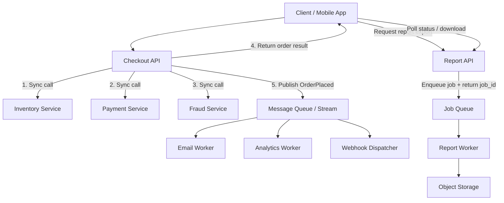

# Synchronous vs Asynchronous Communication Patterns

> Synchronous communication asks another system for an answer right now, while asynchronous communication hands work off and lets the answer arrive later or somewhere else.

---

## The Problem

Imagine an online grocery platform during a weekend promotion. A customer taps "Place Order," and the checkout API does five things in sequence: validate the cart, reserve inventory, authorize payment, call a fraud service, create a delivery slot, and send confirmation. On a quiet day, the whole request finishes in about 280ms, which feels instant.

Then the promotion starts. Traffic jumps from 1,200 checkouts per minute to 18,000. One downstream dependency slows from 40ms to 250ms. Another times out 2% of the time, so the checkout service retries it. Suddenly the full request path is no longer 280ms. It becomes 1.8 seconds at p95 and 6 seconds at p99. Mobile clients give up. Users tap the button twice. Duplicate requests appear. Inventory gets reserved but payment fails, or payment succeeds but the email service times out and the whole request is marked as an error even though the order actually exists.

This is the central communication problem in distributed systems: which work must be completed before you respond, and which work should be decoupled so one slow dependency does not drag the entire user experience down with it? If everything is synchronous, latency compounds and failures cascade. If everything is asynchronous, users stop getting immediate answers and the system becomes harder to reason about because results arrive later and in different places.

Systems break when teams do not make this boundary explicit. A user-facing request starts calling six services "just for convenience." A reporting job is built as a single HTTP request and times out after 30 seconds. A fire-and-forget message is sent without durability guarantees, and now invoices disappear whenever a worker restarts. The point of understanding synchronous versus asynchronous communication is not to memorize definitions. It is to decide, with precision, where you need immediate coordination, where you need decoupling, and what correctness guarantees you are trading to get either one.

---

## Core Concept Explained

Think of synchronous communication like standing at a coffee counter and waiting for the barista to hand you the drink before you leave. You place the order, the barista makes it, and you stand there until the answer is ready. Asynchronous communication is like ordering at the counter, getting a receipt number, and sitting down while the kitchen prepares it. You do not block the front desk on the whole cooking process. The work continues, but your interaction with the counter ends earlier.

In system design, **synchronous communication** usually means request-response. One service calls another and waits for a result before continuing. This is how normal HTTP APIs, gRPC unary calls, and many RPC systems behave. The caller often has a timeout budget such as 200ms, 500ms, or 2 seconds. If the callee does not answer in time, the caller must decide whether to retry, fail, or degrade.

Synchronous communication is the right choice when the caller truly cannot continue without the answer. Payment authorization is a classic example. If a checkout flow needs to know whether a card was approved, "we will tell you later" is not acceptable in most cases. Inventory reservation is similar when overselling is dangerous. Authentication, permission checks, and fraud gates are also commonly synchronous because the user-facing decision depends on them immediately.

The strength of synchronous communication is clarity. The caller knows whether the operation succeeded, failed, or timed out before it responds upstream. That makes correctness easier to explain. It also aligns well with interactive user experiences, where humans expect something to happen in 100 to 500ms, not "eventually."

But synchronous communication has a hidden tax: **latency adds up across every hop**. If Service A calls B, B calls C, and C calls D, then the user's latency is not just the slowest service. It is the sum of multiple network round trips, queueing delays, serialization time, and tail latency from each downstream. Five services with 50ms median latency do not necessarily produce a 250ms end-to-end path. Under load, p99 latency in one dependency can dominate the entire chain. This is why a synchronous architecture can feel fine in staging and fail spectacularly during real traffic spikes.

**Asynchronous communication** breaks that direct waiting relationship. A caller sends work somewhere durable or semi-durable, and the work continues later. That "somewhere" might be a queue such as SQS or RabbitMQ, a stream such as Kafka, a background job table in a database, or even a webhook target that will receive the result later. The important part is that the producer and consumer are no longer coupled to the same live request.

There are several common async patterns.

**Fire-and-forget** is the lightest form. Service A emits an event or sends a message and does not wait for the work to finish. This is fine for non-critical side effects such as analytics, audit trails, or best-effort notifications. It is dangerous for business-critical actions unless the message is durable and the consumer is designed for retries.

**Queued background work** is the most common business pattern. A request creates a job, stores it durably, and returns quickly with `202 Accepted` or a success response for the primary action. Workers later process the job. Email sending, invoice PDF generation, thumbnail creation, machine learning feature extraction, and webhook delivery all fit here. The user does not need the work completed in the original latency budget, so async turns a fragile long request into a resilient short one.

**Async workflows with callbacks, polling, or webhooks** are used when the result matters but not immediately. A report export API may return a `job_id`, let the user poll status, and later provide a download URL. A payment platform may accept a charge attempt synchronously but deliver settlement updates asynchronously via webhooks. In both cases, the system still communicates outcome, just on a different timescale and often through a different channel.

The deeper distinction is not "fast versus slow." It is **coordination now versus coordination later**. Synchronous communication gives immediate coordination and a simpler mental model, but it ties availability and latency together. If the dependency is slow or unavailable, the caller is slow or unavailable too. Asynchronous communication loosens that dependency. Producers can keep accepting work even when consumers are briefly behind, as long as the queue has capacity and the business tolerates delay.

That is why async patterns are so good at absorbing bursts. Suppose you receive 50,000 image-processing requests in one minute, but the workers can only complete 12,000 per minute. A synchronous design fails immediately because the request path is longer than the client's timeout budget. An asynchronous design can accept the burst, persist jobs, and let workers drain the backlog over the next few minutes. The user experience changes from "wait for processing" to "we're working on it," which is often much more survivable.

But async is not automatically better. It introduces **eventual consistency** and **state complexity**. The system now has "accepted but not done yet," "done but not yet visible here," and "failed after initial success" states. Product teams must design for those states explicitly. Users need status pages, retries must be idempotent, and operators need visibility into backlog age, not just HTTP latency. If the business process requires a definitive answer before moving forward, async can actually make things worse by hiding uncertainty behind delayed work.

So the senior-engineer rule is straightforward: use synchronous communication when you need an answer in the critical path and the dependency can realistically meet the latency and availability budget. Use asynchronous communication when the work can happen later, when you need burst absorption, or when decoupling producers from consumers makes the system more resilient. Most mature systems use both in the same request flow.

---

## Architecture Diagram

### Mermaid Diagram

### Diagram Walkthrough

Starting from the top left, the client or mobile app sends a checkout request to the Checkout API. This API is the user-facing entry point, so it owns the latency budget that the user actually feels. Inside that request, the API makes three synchronous calls: one to the Inventory Service, one to the Payment Service, and one to the Fraud Service. These are shown as steps 1, 2, and 3 because the order matters. The system cannot safely confirm the order without reserving stock, authorizing payment, and checking fraud rules.

Once those synchronous checks complete successfully, the Checkout API returns the order result back to the client. That is step 4. This is the critical-path synchronous portion of the diagram. The user gets an immediate answer about whether the order was accepted. That keeps the interaction inside a human-friendly latency window, ideally a few hundred milliseconds rather than multiple seconds.

After the response, the Checkout API publishes an `OrderPlaced` event to the message queue or stream. That is step 5. This is where the diagram switches from synchronous to asynchronous communication. Email confirmation, analytics ingestion, and webhook delivery do not need to block the user. If the email worker is slow for a minute, the checkout should still succeed. Each worker consumes the same event and does its own follow-up work independently.

The bottom half of the diagram shows a second scenario: a long-running report export. The client asks the Report API to generate a large export. Instead of keeping an HTTP request open for 45 seconds, the Report API enqueues a job into the Job Queue and immediately returns a `job_id`. A Report Worker later processes the job, writes the finished file to object storage, and updates status.

The client then polls the Report API for status or a download link. That means the user still gets an answer, but not in the same request that created the work. This bottom flow is a classic asynchronous workflow with polling. The top flow is a mixed model: synchronous communication for decisions that must happen now, and asynchronous communication for side effects that can happen later.

Every component in the diagram exists to make that separation explicit. The synchronous services protect correctness in the order path. The queue protects the user experience from non-critical downstream latency. The report workflow shows how asynchronous communication turns a timeout-prone interaction into a durable, user-visible process.

---

## How It Works Under the Hood

Synchronous request chains are essentially latency multiplication machines. Each hop involves network overhead, request serialization, thread scheduling, downstream queueing, business logic execution, and a response trip back. A single in-region service-to-service call might look cheap at 5 to 15ms median latency. But if one request fans out to four dependencies and each dependency has a p99 of 120ms under load, your end-to-end tail latency quickly gets ugly. This is why teams often budget internal timeouts aggressively, such as 50 to 200ms per dependency for an endpoint that must finish in under 500ms overall.

Timeout propagation matters more than most people realize. If the client has a 2-second timeout but the API gateway waits 2 seconds, the application waits 2 seconds, and each downstream waits 2 seconds, then you do not have a coherent timeout strategy. You have layered waiting that can exceed the user's patience and tie up threads long after the client disconnected. Good synchronous systems propagate deadlines downward. If only 180ms remains in the request budget, the next dependency does not get to wait a full second.

Retries make this both better and worse. A retry can rescue a transient failure such as a single dropped packet or a short-lived overload spike. But retries also amplify traffic. If Service A retries B twice, and B retries C twice, a single original request can explode into multiple downstream attempts. During incidents this becomes a retry storm. That is why retry policies need limits, jittered backoff, and awareness of idempotency. Retrying a GET or an idempotent payment-auth check is not the same as retrying a charge-creation call that might duplicate money movement.

Asynchronous systems move the pressure into queues and worker fleets. Internally, a queue gives you storage plus delivery mechanics. Producers append work. Consumers pull or receive it, process it, and acknowledge completion. RabbitMQ tracks acknowledgments per message. SQS uses visibility timeouts so a message becomes visible again if the consumer fails before delete. Kafka records events in partitioned append-only logs where consumers track offsets rather than deleting messages. The implementation differs, but the effect is similar: the producer can hand work off durably and continue.

Backpressure is the key under-the-hood concept for async systems. If producers generate 20,000 jobs per second and workers can only process 12,000, the queue grows. That growth is not automatically bad. It is exactly what protects the producer from immediate failure. But backlog depth and oldest-message age become operational signals. A queue with 50 messages is healthy. A queue with 9 million messages and a 47-minute oldest age means your "eventually" is becoming a product problem.

Workers need concurrency control too. If one worker process spawns unlimited parallel jobs, it can overwhelm the database or an external API just as badly as a synchronous request path would. Mature async systems bound concurrency, use rate limiters, and sometimes apply per-tenant fairness so one noisy customer cannot monopolize the worker fleet.

There is also a correctness detail that shows up in real async systems: **accepted is not completed**. The moment a system returns `202 Accepted`, it has made a promise about durable intent, not final success. That means the enqueue step itself must be reliable. If the API returns success before persisting the job or event, work can vanish. This is why patterns like the transactional outbox exist: write business data and the outbound event record in one local transaction, then publish later from the outbox so you do not lose messages between database commit and queue publish.

Finally, asynchronous communication changes storage and observability requirements. You need job state tables, dead-letter queues, retry counts, event IDs, trace correlation across producer and consumer boundaries, and dashboards for lag, throughput, and failure rates. In synchronous systems, the HTTP request itself is the unit of observation. In asynchronous systems, you now need to observe work that lives longer than one request and may hop across several components before it finishes.

---

## Key Tradeoffs & Limitations

**Choose synchronous communication when correctness depends on an immediate answer.** Authentication, payment authorization, inventory reservation, and permission checks usually belong here. The user or upstream system cannot proceed safely without the result. Synchronous communication is also easier to reason about because success and failure are immediate and localized to one request path.

**Choose asynchronous communication when work can happen later or when burst absorption matters.** Email delivery, analytics pipelines, report generation, webhook dispatch, media processing, and cache warming are all better candidates. Async gives you resilience against short outages and traffic spikes because producers and consumers do not need to run at the exact same rate.

The cost of synchronous design is tight coupling. Your availability is pulled toward the weakest dependency in the chain, and your latency budget is shared across every hop. The cost of asynchronous design is more states, more infrastructure, and more operational ambiguity. Instead of "done or failed," you now have "queued," "in progress," "retrying," "poisoned," and "completed but not yet visible downstream."

Async also does not solve everything. If the business truly requires a yes-or-no answer now, a queue only postpones the hard part. A user requesting a bank transfer confirmation does not want "we accepted your request and might tell you later whether the balance check passed." In those situations, asynchronous communication can make the product feel unreliable even if the infrastructure is technically more resilient.

One useful decision rule is this: choose sync when the consumer's answer is part of the same product interaction, and choose async when the work is a follow-up effect or a long-running process. If your system has fewer than a few thousand requests per minute and one service talking to one database, synchronous HTTP may be perfectly fine. Introducing queues too early can add more operational overhead than value. But once traffic spikes, fan-out grows, or timeouts become a recurring failure mode, async is often the cleaner design.

---

## Common Misconceptions

**"Asynchronous communication is always faster."** It often makes the user-visible request faster because you return earlier, but the total work still has to happen somewhere. A video transcoding job that takes 90 seconds is still a 90-second job even if the API responds in 80ms with a `job_id`. The misconception exists because people confuse lower request latency with lower end-to-end completion time.

**"Synchronous communication is simpler."** It is simpler only while the dependency graph is shallow and reliable. Once one request fans out to many services with retries, deadlines, fallbacks, and circuit breakers, synchronous systems become quite subtle. The misconception survives because a single HTTP call is easy to understand in isolation.

**"Putting a queue in the middle guarantees nothing gets lost."** A queue improves durability, but only if the producer actually writes to it reliably and consumers acknowledge work correctly. Messages can still be dropped by bad producer logic, duplicate processing can still happen, and poison messages can still clog a pipeline. People believe the misconception because the queue feels like a safety blanket once it appears in the architecture.

**"Fire-and-forget is good enough for non-critical work."** Best-effort delivery is fine only if you truly mean best-effort. Many teams say analytics, emails, or webhooks are non-critical until finance, growth, or partners depend on them. The misconception exists because side effects look optional until the business attaches real value to them.

**"Retries are harmless."** Retries can be essential, but they are one of the most common ways systems amplify incidents. Without backoff, idempotency, and limits, retries turn one failing request into many failing requests. The misconception exists because retries help in small tests and hide the overload cost until production traffic appears.

---

## Real-World Usage

**Stripe** is a strong example of mixing both models deliberately. Card authorization and payment confirmation are synchronous because the API caller needs an immediate answer about whether the payment was accepted. But many downstream effects, such as settlement updates, subscription renewals, dispute notifications, and partner integrations, are delivered asynchronously through webhooks and event streams. That split keeps the payment API responsive while avoiding tight coupling between the core payment path and every downstream system.

**Uber** uses synchronous communication in rider flows where immediate coordination matters, such as requesting a ride, receiving an ETA, or confirming that a driver accepted. At the same time, a huge amount of follow-up work is asynchronous: receipts, event logging, analytics, fraud signals, and batch feature generation. That combination matters at Uber scale because city-level bursts can be extreme, and not every consequence of a trip request belongs in the same live request path.

**LinkedIn** created Kafka specifically to support large-scale asynchronous event distribution across producers and consumers that should not be tightly coupled. Activity streams, metrics pipelines, and downstream data consumers all benefit from the append-only event model because producers can publish once and many independent consumers can process at their own pace. The lesson is not merely "use Kafka." It is that async communication becomes foundational once many teams need the same stream of events without sharing one fragile request chain.

**Shopify** is another practical example: checkout must synchronously coordinate payment and order creation, but confirmations, merchant webhooks, analytics, and many back-office processes are better handled asynchronously. Flash-sale traffic makes that boundary especially important because queues can absorb bursts that would otherwise make the core commerce path unstable.

---

## Interview Angle

**Q: How do you decide whether a dependency should be synchronous or asynchronous?**
**How to approach it:**
- Start from product semantics: does the caller need the answer before responding to the user?
- Discuss latency budget, availability needs, and whether the work is in the critical path or a side effect.
- Mention operational impact: sync couples failures directly, async introduces eventual consistency and backlog management.
- Strong answers usually include one concrete example of each pattern.

**Q: What can go wrong when a synchronous request fans out to many services?**
**How to approach it:**
- Talk about compounded tail latency, timeout propagation, and retry amplification.
- Mention that one degraded dependency can drag down the whole endpoint even if the others are healthy.
- Bring up thread exhaustion or connection-pool exhaustion in the caller under load.
- A strong answer explains how to shrink the critical path rather than only saying "add retries."

**Q: How would you design an API for a task that can take 30 seconds?**
**How to approach it:**
- Explain why holding an HTTP request open for the entire duration is fragile.
- Suggest returning `202 Accepted` plus a `job_id`, then using polling, webhook callbacks, or status pages.
- Mention durable enqueueing, idempotent job creation, and user-visible progress states.
- Good answers connect API shape to user experience, not just backend convenience.

**Q: Why do asynchronous systems still need careful failure handling?**
**How to approach it:**
- Mention duplicates, poison messages, dead-letter queues, retries, and backlog growth.
- Explain that async hides failures from the request path, but it does not remove them.
- Bring up observability signals like consumer lag, oldest-message age, and failure rate by worker.
- Strong answers show that queues shift where failure appears rather than making it disappear.

---

## Connections to Other Concepts

**Concept 14 - Message Queues & Stream Processing** is the natural next step because most practical asynchronous communication is implemented with queues or streams. Once you decide a task should be decoupled from the request path, you need to understand delivery guarantees, partitions, offsets, acknowledgments, and consumer groups.

**Concept 15 - Event-Driven Architecture & Event Sourcing** builds on the async side of this topic. Synchronous versus asynchronous communication is the local decision about one interaction. Event-driven architecture turns asynchronous messaging into the organizing principle of the whole system.

**Concept 16 - Real-time Communication** adds another wrinkle: not every low-latency interaction is strictly synchronous request-response. WebSockets, SSE, and push-based systems often combine asynchronous server push with user expectations that still feel immediate. That makes this concept a useful foundation for understanding real-time systems.

**Concept 19 - Fault Tolerance Patterns** matters because timeouts, retries, circuit breakers, and graceful degradation are what keep both sync and async communication from failing badly under stress. Communication style alone does not make a system resilient; the protective patterns around it do.

**Concept 20 - Idempotency, Deduplication & Exactly-Once Semantics** becomes especially important once you introduce asynchronous retries and background workers. If a message is delivered twice or a job is retried after a timeout, idempotent handlers are what prevent double emails, double charges, or duplicate side effects.
