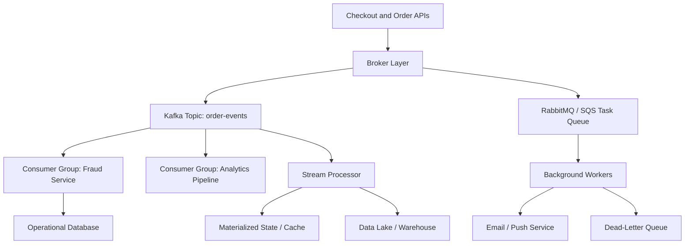

# Message Queues & Stream Processing

> Message queues and streams let systems hand work off asynchronously, smooth traffic spikes, replay important events, and process data continuously instead of forcing every service to talk in lockstep.

---

## The Problem

Imagine you run a food-delivery platform. When a customer places an order, your API does not just write one row to one database. It has to charge a card, reserve inventory, notify the restaurant tablet, trigger courier matching, update the customer's real-time order screen, send analytics events, and maybe kick off fraud checks. On a quiet afternoon that chain feels manageable. At `500 orders per second`, your synchronous API might still squeeze through if every dependency behaves.

Now make it dinner rush. Order volume jumps to `8,000 orders per second` for twenty minutes in a major metro, while promotional pushes trigger even more notification and analytics traffic. Suddenly the checkout service is waiting on six downstream systems. One of them is a bit slow, one has a temporary rate limit, and one is fine but has a queue of its own. End-to-end latency goes from `150 ms` to `4 seconds`, customers retry, and your retries generate even more load. The user thinks "place order" is one operation. The system knows it is really ten.

This is where synchronous architecture starts to hurt. If every request has to wait for every side effect to finish before returning, the slowest dependency becomes part of the user-facing path. If a downstream service is unavailable for five minutes, your upstream service either fails too or starts buffering work in memory until it crashes. Worse, even when nothing is broken, traffic bursts become hard to absorb because every system must scale at the same speed at the same time.

Message queues and stream-processing systems exist to break that coupling. Instead of forcing the checkout API to do everything immediately, it can persist an event or enqueue a job in a durable broker and let downstream workers handle it independently. That makes the system more resilient, but it introduces new design questions: do you want queue semantics or log semantics, should you choose Kafka or RabbitMQ or SQS, how much ordering do you really need, what happens if a consumer crashes after processing but before acknowledging, and when does "exactly once" mean something real versus something a vendor page implied? Those are the real engineering questions behind the buzzwords.

---

## Core Concept Explained

Think of a restaurant front desk during a busy night. A queue is like a ticket rail in the kitchen: each ticket represents one unit of work, one cook picks it up, and once the dish is prepared that ticket is done. A stream is more like a permanent order ledger: every order is recorded in sequence, multiple teams can read the same ledger for different purposes, and new teams can come back later to replay old entries. Both move work asynchronously, but they optimize for different ideas.

At the simplest level, a **message queue** is about handing off work. A producer sends a message, the broker stores it durably, and one consumer or worker eventually processes it. Once it is acknowledged, the message is usually removed or considered complete. This is a great fit for background jobs such as sending email, resizing images, generating PDFs, charging cards with retry semantics, or pushing notifications. You care that the work happens, but you usually do not need every worker in the company to read the same message forever.

A **stream** or **log-based system** is different. Producers append records to an ordered log, and consumers maintain their own position, usually an offset. The broker keeps the log for some retention window such as `24 hours`, `7 days`, or even indefinitely. One consumer group might build analytics. Another might materialize a search index. A third might feed fraud detection. That replayability is the defining property. Kafka is the classic example: messages are not "owned" by one worker. They are appended to partitions, retained, and independently read by many consumers.

### Queues vs logs

This distinction matters because it shapes how you design the rest of the system.

**Queue semantics** prioritize work distribution. If ten workers are pulling from one RabbitMQ queue, you want each message processed by one worker, not all ten. Ordering is usually best-effort or limited to a queue, and the message is conceptually transient once consumed. Queues are great when the system's question is, "How do I make sure some worker eventually does this task?"

**Log semantics** prioritize shared history. If ten different services want to read the same order event for different reasons, a stream lets all ten do so without competing. Ordering is defined within a partition, not globally across the whole topic. Streams are great when the system's question is, "How do I keep an ordered history of facts that multiple downstream systems can consume independently?"

### Kafka vs RabbitMQ vs SQS

**Kafka** is built around an append-only distributed log. Producers write to topics, topics are split into partitions, and partitions are replicated across brokers for durability. Consumers track offsets and can rewind them. Kafka shines when throughput is high, retention matters, and multiple independent consumers need the same data. It is common to see a Kafka cluster handle hundreds of MB/s per broker and millions of messages per second across a fleet when partitioning is done well. The tradeoff is complexity: partitions, rebalancing, broker operations, replication lag, and consumer tuning are real work.

**RabbitMQ** is a traditional message broker built around exchanges, queues, bindings, routing keys, acknowledgments, and flexible delivery semantics. It is excellent for work queues, command-style messaging, and routing patterns such as fanout, topic, or direct delivery. RabbitMQ typically feels simpler than Kafka when you want tasks to be distributed to workers and removed after acknowledgment. It supports ordering inside a queue better than highly parallelized consumer-group patterns, but very large persistent workloads can hit limits sooner than Kafka-style logs.

**Amazon SQS** is the managed-cloud answer when you want queue semantics without running brokers yourself. Standard SQS gives practically unlimited scale with at-least-once delivery and best-effort ordering. FIFO SQS gives ordering and deduplication, but with lower throughput ceilings than standard queues. The big win is operational simplicity: no brokers to patch, no Zookeeper or controller issues, and auto-scaling worker fleets can poll it cheaply. The downside is higher per-message latency than in-memory brokers, fewer advanced stream semantics, and cloud lock-in if your architecture leans too hard on platform-specific integrations.

### Partitions, ordering, and consumer groups

Ordering is where junior engineers often over-assume. In Kafka, order is guaranteed **within one partition**, not across the whole topic. If you need all events for `order_id=123` to remain ordered, you usually key by `order_id` so those events land on the same partition. But if you spread one entity's events across partitions, global ordering disappears. That is often fine. What you usually need is per-entity ordering, not one universal timeline for the whole system.

Consumer groups are how Kafka scales reads. Each partition is read by at most one consumer within a group, so if a topic has `24 partitions`, one consumer group can scale to roughly `24` actively reading members before extra consumers sit idle. A different consumer group gets its own independent read of the same topic. That is why analytics and fraud detection can both read the same events without stepping on each other.

RabbitMQ and SQS have related but different scaling models. With RabbitMQ, multiple workers can compete for messages on one queue, and prefetch settings determine how many unacknowledged messages a worker can hold. With SQS, workers poll messages and gain temporary ownership through the visibility timeout. If a worker crashes before deleting the message, that message becomes visible again after the timeout and another worker can process it.

### Retention, replay, and dead-letter queues

Retention is the superpower of log systems. If a consumer had a bug for the last six hours, you can often fix it and replay the stream from an earlier offset. That makes backfills, rebuilding materialized views, and debugging far easier. Queues usually do not provide the same replay story because messages are meant to be worked and cleared.

Dead-letter queues exist because some messages will fail repeatedly. Maybe the payload is malformed, maybe a downstream record no longer exists, or maybe the consumer code has a persistent bug. Rather than blocking the whole queue forever, brokers let you route repeatedly failed messages to a DLQ after `N` attempts. That protects forward progress, but it is not the same thing as solving the problem. A DLQ is a quarantine area, not success.

### Stream processing

Once you have a durable stream, you can do more than simple consume-and-write. A stream processor such as Kafka Streams, Flink, Samza, or Spark Structured Streaming can join events, aggregate windows, compute rolling counts, detect anomalies, and materialize continuously updated state. For example, you can count failed payment attempts per card over a `5-minute` tumbling window and feed that into a fraud model with sub-second freshness. This is fundamentally different from nightly batch analytics. The system is reacting continuously as events arrive.

---

## Architecture Diagram

### Mermaid Diagram

### Diagram Walkthrough

Starting from the top left, the `Checkout and Order APIs` are the producer side of the system. When a customer places an order, the API does not synchronously call every downstream dependency and wait for all of them to finish. Instead, it writes messages into the `Broker Layer`, which represents the asynchronous handoff boundary. That boundary is the key design decision: it separates the user-facing request from slower or burstier downstream work.

The broker layer fans the message into two different patterns. The first path goes to the `Kafka Topic: order-events`. This is the log-style path. The topic stores an ordered history of events, split into partitions. Multiple downstream systems can consume the same order events independently without competing. In the diagram, one consumer group feeds the `Fraud Service`, another feeds the `Analytics Pipeline`, and the `Stream Processor` reads the same topic to compute continuously updated derived state.

The second path goes to the `RabbitMQ / SQS Task Queue`. This is the work-queue path. Instead of preserving one durable replayable history for many readers, it is distributing discrete tasks to `Background Workers`. Those workers might send emails, schedule SMS notifications, generate invoices, or call slower external systems. Once the work succeeds and the worker acknowledges or deletes the message, that task is done. If a worker keeps failing the same task, the message is moved to the `Dead-Letter Queue` so one poisoned message does not block the whole lane.

The first important flow is the event-stream flow. An order is placed, the API publishes an `order_created` event to Kafka, and the fraud service consumes it within its own consumer group. At the same time, the stream processor reads the same event, updates a materialized state store or cache, and eventually pushes aggregates to the data lake or warehouse. Because these readers have independent offsets, analytics falling behind does not stop fraud detection from staying current.

The second important flow is the work-queue flow. The API emits a "send confirmation email" task to the queue. One background worker receives it, calls the email or push service, and acknowledges the message on success. If the email provider returns repeated `5xx` errors or the payload is malformed, retries happen according to policy. After too many failures, the task lands in the DLQ for inspection. That flow shows why queues are about work completion, while the Kafka topic is about durable shared history.

The components at the bottom represent outputs, not just storage. `Materialized State / Cache` is where low-latency derived results can live, such as per-merchant order counts or rolling fraud scores. `Operational Database` represents systems updated by event consumers. `Data Lake / Warehouse` is the long-term analytics sink. One broker layer is feeding all of them, but the paths and guarantees are intentionally different depending on whether the system needs durable replay, one-worker ownership, or continuous stateful computation.

---

## How It Works Under the Hood

Kafka works because it treats messaging as a replicated append-only log. Producers write records to a topic partition, each record gets a monotonically increasing offset, and consumers store the last committed offset they processed. Internally, partitions are written sequentially to disk, which is why Kafka can achieve very high throughput on commodity hardware. Sequential disk I/O is dramatically cheaper than random writes, and the OS page cache does a lot of heavy lifting. A single partition can often handle tens of MB/s, but the actual ceiling depends on message size, acknowledgment policy, compression, and replication factor.

Replication in Kafka is partition-based. Each partition has a leader broker and follower replicas. Producers usually write to the leader. If you configure a replication factor of `3` and require `acks=all`, the broker waits until the record is committed to all in-sync replicas before acknowledging success. That improves durability but increases latency compared with `acks=1`. "Exactly once" in Kafka is real only in a narrow sense: idempotent producers avoid duplicate writes from retries, and transactions let a consumer-producer pipeline atomically commit output plus offsets. That is powerful, but it still does not make arbitrary side effects in an email service or payment gateway magically exactly once.

RabbitMQ works differently. Messages are routed through exchanges into queues. A worker receives a message, processes it, and acknowledges it. If it dies before acking, the broker can redeliver. Prefetch matters a lot here. If a worker grabs `500` messages and then slows down, those messages are effectively stuck behind it. Sensible prefetch settings, often in the low tens rather than the hundreds, improve fairness and reduce latency spikes. RabbitMQ can preserve queue order reasonably well, but parallel consumers and retries can still reorder observable completion.

SQS hides the broker, but the mechanism is still important. When a worker receives a message, SQS makes it invisible for the visibility-timeout window, perhaps `30 seconds`. If the worker finishes, it deletes the message. If not, the timeout expires and another worker can see it again. This is why SQS is at-least-once by design. A slow worker plus a short visibility timeout can create duplicate processing even when nothing is "wrong." Correct consumers therefore need idempotency tokens, deduplication keys, or sink-side upserts.

Stream processors add state and time semantics. If you are computing rolling revenue per store over a `15-minute` hopping window, the processor needs not only the raw events but also local state stores and a model of event time versus processing time. Late-arriving events are a classic edge case. A payment-confirmed event might arrive `90 seconds` late because of upstream retries. If your window closes too aggressively, your aggregates become wrong. Mature systems let you configure allowed lateness, watermarks, and retractions so the processor can update results when delayed data eventually appears.

Failure modes are the whole game here. A poison-pill message can loop forever without a DLQ. A rebalance in Kafka can pause consumers for seconds if membership changes are too frequent. A topic with `8 partitions` cannot usefully parallelize across `50` consumers in one group, which surprises people who think consumers scale linearly forever. A queue can look "healthy" while age-of-oldest-message quietly climbs and indicates workers are falling behind. Under the hood, messaging systems are coordination systems, storage systems, and failure-recovery systems all at once.

---

## Key Tradeoffs & Limitations

**Choose a queue when the primary goal is task handoff. Choose a stream when the primary goal is shared history.** If you want one worker to send one email or generate one invoice, RabbitMQ or SQS often fit better than Kafka. If you want five independent downstream systems to read the same order events and one of them may need to replay a week of history, Kafka is usually the better fit.

**Kafka gives you huge throughput and replay, but it also gives you operational complexity.** You are taking on partitions, replication, retention, consumer lag, broker scaling, and key-selection decisions that affect ordering forever. If your whole workload is "run 20,000 background jobs per hour," Kafka is usually overkill. If your workload is "fan one event to analytics, search, fraud, and billing while keeping replay," Kafka starts to earn its cost.

**RabbitMQ feels simpler for command-style work, but it is not ideal for every analytics pipeline.** It shines when you care about routing flexibility, task acknowledgments, and mature work-queue behavior. It is less natural when you need long retention, multiple independent readers of the same exact history, or replay from arbitrary past offsets.

**SQS removes broker operations, but you pay in latency and control.** It is great when a managed service is worth more than millisecond-level tuning. It is less appealing when you need very low-latency fanout, local broker features, or portable infrastructure outside AWS.

**Do not promise "exactly once" unless you can describe every boundary.** Broker-level guarantees do not automatically extend into your database, email provider, or third-party API. If your consumer writes to Postgres and then crashes before acking, the broker may redeliver and the database may see the write twice unless the sink is idempotent. Choose at-least-once plus idempotent consumers for most real systems. Choose stronger transactional semantics only when the workload truly needs them and you can enforce them end to end.

**Do not use stream processing when a simple cron batch or direct request is enough.** If a small SaaS app has `3,000` DAU and only needs a nightly revenue report, introducing Kafka, Flink, and watermark tuning is architecture cosplay. Use the boring tool until the latency, throughput, or coupling problem is real.

---

## Common Misconceptions

**Many people believe a message queue automatically makes a system reliable.** In reality, it only moves the failure boundary. If consumers are non-idempotent, the DLQ is ignored, or the backlog grows faster than workers can drain it, the system is still failing. The misconception exists because adding a broker often makes the API recover first, which hides the downstream mess.

**A common belief is that Kafka is just a faster RabbitMQ.** They overlap, but the mental model is different. Kafka is a durable partitioned log built for retention and independent replay, while RabbitMQ is a broker optimized for routed delivery and work-queue semantics. People confuse them because both can carry JSON messages between services.

**Many teams hear "exactly once" and assume duplicates are solved everywhere.** Usually exactly-once claims apply only inside a controlled pipeline, such as producer-to-Kafka-to-consumer offsets with transactions. The moment you call an external API, send an email, or write to a non-transactional sink, duplicates can still happen. The misconception survives because vendor documentation often states the strongest guarantee first and the boundary conditions second.

**People often think ordering is global by default.** It is usually not. Kafka gives partition ordering, FIFO SQS gives queue ordering under specific throughput constraints, and RabbitMQ can still show reordered completion when multiple workers and retries are involved. The misconception exists because diagrams show one neat line of messages rather than the parallel reality of production traffic.

**A dead-letter queue is not a success path.** Putting bad messages into a DLQ does protect the main flow, but it does not mean the business operation is complete. Someone still has to inspect, fix, replay, or deliberately discard that message. Teams like DLQs because they stop the fire alarm, which can make it easy to forget the unresolved work piling up behind them.

---

## Real-World Usage

**LinkedIn and Kafka:** LinkedIn created Kafka because traditional messaging systems were not a good fit for the scale and replay requirements of activity streams, metrics, and log ingestion. Kafka let them keep durable ordered histories that multiple independent systems could consume, rewind, and reprocess. That architecture decision is why Kafka became the reference design for high-throughput event streaming across the industry.

**Uber's event backbone:** Uber has written about using Kafka-based event pipelines to move trip-state changes, marketplace signals, and operational telemetry across hundreds of services. The important detail is not just scale. Many downstream systems need the same trip events for different reasons: rider updates, driver matching, fraud detection, and analytics all consume the same base facts with different latencies and processing logic.

**Netflix streaming data platforms:** Netflix has described large event pipelines where operational events feed near-real-time analytics, monitoring, and stateful processing systems. Their use of Kafka-style infrastructure and stream processing reflects a common mature pattern: the event log becomes a central nervous system for the platform, and downstream teams build specialized processors rather than requesting point-to-point synchronous integrations for everything.

---

## Interview Angle

**Q: When would you choose Kafka over RabbitMQ or SQS?**
**How to approach it:**
- Start with the access pattern, not the product name: do you need replayable shared history or one-time task execution?
- Mention multiple independent consumers, retention, and high throughput as Kafka strengths.
- Contrast that with operational simplicity and task semantics, where RabbitMQ or SQS may be better.
- Strong answers avoid declaring one broker "best" in the abstract.

**Q: How do you preserve ordering in an event-driven system?**
**How to approach it:**
- Explain that true global ordering is expensive and often unnecessary.
- Talk about per-entity ordering using keys, such as routing all `order_id=123` events to the same partition.
- Mention the cost: fewer effective parallelism lanes for hot keys.
- Good answers connect the ordering requirement to business correctness rather than treating it as a default checkbox.

**Q: Why is at-least-once delivery usually acceptable in practice?**
**How to approach it:**
- Say explicitly that duplicates are easier to handle than silent loss in many business workflows.
- Describe idempotent consumers, deduplication keys, and upsert-style sinks.
- Mention that stronger guarantees usually add latency and complexity.
- A strong answer explains where at-least-once is unacceptable, such as some financial boundaries without idempotency protection.

**Q: What is the role of a dead-letter queue?**
**How to approach it:**
- Explain that a DLQ isolates repeatedly failing messages so healthy work can continue.
- Mention retry thresholds, poison-pill messages, and operator workflows.
- Call out that DLQs require monitoring and replay procedures; otherwise they become silent graveyards.
- Strong answers treat DLQs as operational tooling, not a guarantee of correctness.

---

## Connections to Other Concepts

**Concept 13 - Synchronous vs Asynchronous Communication Patterns** sets up why queues and streams exist at all. Message brokers are one of the main tools for turning tight synchronous dependency chains into looser asynchronous workflows with different latency and reliability tradeoffs.

**Concept 15 - Event-Driven Architecture & Event Sourcing** builds directly on this topic. Once you understand brokers, topics, consumer groups, and replay, event-driven architecture stops sounding magical and starts looking like a set of concrete design choices about facts, consumers, and side effects.

**Concept 19 - Fault Tolerance Patterns** matters because retries, backoff, DLQs, and graceful degradation are inseparable from queue-based systems. A broker can absorb a failure spike, but resilience patterns determine whether consumers recover cleanly or create a retry storm.

**Concept 20 - Idempotency, Deduplication & Exactly-Once Semantics** is the natural companion concept because almost every real queue or stream delivers at least once somewhere in the pipeline. That means duplicates are not an edge case. They are a core design constraint that sink systems must handle deliberately.

**Concept 21 - Monitoring, Observability & SLOs/SLAs** becomes critical once asynchronous systems are in play. You no longer look only at request latency. You now care about consumer lag, message age, DLQ depth, retry volume, and processing time distributions to know whether the system is healthy.
