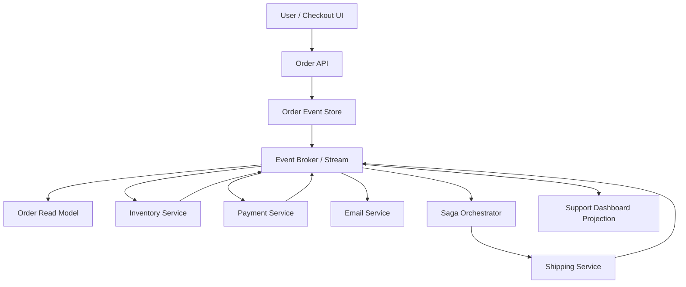

# Event-Driven Architecture & Event Sourcing

> Event-driven architecture turns business changes into durable messages that other services can react to, while event sourcing goes one step further and stores those changes as the system's permanent source of truth.

---

## The Problem

Imagine an e-commerce platform where placing an order means one API call triggers eight synchronous downstream calls in sequence. The checkout service calls payment, then inventory, then fraud, then coupon validation, then shipping, then email, then analytics, then CRM. On a normal day, each downstream hop takes 20 to 80ms, so the whole chain finishes in about 450ms. It is not elegant, but it works.

Then Black Friday arrives. Traffic jumps from 1,500 checkouts per minute to 40,000. The payment service starts timing out at p99. Because checkout is waiting synchronously, those timeouts block inventory reservations and hold HTTP threads open. Retries pile up. The email service is suddenly part of the critical path even though no customer would cancel a purchase because a receipt email was late by 30 seconds. Some orders charge the card but fail before the CRM update, some reserve inventory but never confirm shipping, and the support team now has the worst problem possible: partial truth scattered across multiple databases.

This is the pain event-driven architecture is meant to reduce. Instead of forcing every reaction to happen inline while the user waits, the system records the important business fact first: "OrderPlaced", "PaymentCaptured", "InventoryReserved", "ShipmentCreated". Other services subscribe to those facts and react independently. That changes the shape of failure. A temporary email outage no longer needs to block checkout. Analytics can fall behind without corrupting the order flow. A fraud review can happen asynchronously if the business rules allow it.

Event sourcing exists because some domains need even stronger guarantees than "publish an event after state changes." In a normal CRUD system, the current row is all you have. If the balance changed from 500 to 475, you know the current state but not always the exact sequence of decisions that produced it. In event sourcing, the stream of events itself becomes the system of record: `AccountOpened`, `FundsDeposited`, `CardPurchaseAuthorized`, `RefundIssued`. That gives auditability, replay, and time travel, but it also adds a lot of modeling and operational complexity. If you misuse it, you get a fragile distributed system that is slower to build and harder to reason about than a boring relational app.

---

## Core Concept Explained

Think about a newspaper newsroom. A command is the editor telling a reporter, "Write the article about the election." It is directed and imperative. An event is the newsroom bulletin that says, "The article was published at 6:02 PM." That bulletin is a fact about something that already happened. Many teams can react to it. The print desk schedules the page. Social media posts the link. Analytics records engagement. Archives stores the copy. None of those consumers need to block the editor from publishing the article in the first place.

That distinction between **commands** and **events** matters. A command expresses intent and usually expects exactly one owner. "ChargeCard" should be handled by the payment service, not by three random services racing each other. An event expresses fact and can have zero, one, or many consumers. `CardCharged` may matter to accounting, email, fraud, and loyalty points systems at the same time. Mixing those two ideas is how teams create muddy event systems where everything becomes a vaguely named message and nobody can tell whether it is a request, a fact, or a side effect.

### Event-driven architecture

Event-driven architecture, or EDA, means services communicate primarily by emitting and reacting to events rather than synchronously calling one another for every step. In a typical design, one service persists a business change and publishes an event to a broker such as Kafka, SNS/SQS, RabbitMQ, or NATS. Interested consumers subscribe and do their work independently. The publisher does not need to know who all the consumers are, which is the main decoupling benefit.

There are several patterns inside EDA:

**Pub/sub fan-out** means one event can trigger many downstream reactions. `OrderPlaced` can wake up billing, notifications, analytics, and warehouse systems at the same time.

**Event-carried state transfer** means the event contains enough business data for consumers to act without immediately calling back to the source service. That reduces chatty follow-up calls but makes schema discipline much more important.

**Notification events** are lighter. They say "something happened" and consumers fetch details elsewhere. This is simpler at first but often recreates coupling through extra synchronous calls.

**Choreography** means there is no single central coordinator. Each service reacts to the relevant event and emits new events. This scales team ownership well, but it can become hard to reason about because the workflow is spread across many services.

**Orchestration** means one component, often called a workflow engine or saga orchestrator, decides the steps and reacts to success or failure. This centralizes the control flow but reduces service autonomy.

### Event sourcing

Event sourcing is more specific than event-driven architecture. It says the durable history of events is the canonical source of truth, and current state is derived from replaying those events. Instead of storing "order status = shipped" as the only truth, you store a sequence like `OrderCreated`, `PaymentAuthorized`, `InventoryReserved`, `LabelGenerated`, `OrderShipped`. To reconstruct current state, you replay that stream in order. To answer "what was the order state yesterday at 4 PM?" you replay only up to that time.

That is incredibly powerful in domains where the history matters as much as the present state. Financial ledgers, compliance-sensitive workflows, inventory movement, user permission changes, and trading systems all benefit from having a durable audit trail that is not an afterthought. But it changes how you model everything. Updates become appended events. Deletion usually becomes a new event like `CustomerDeactivated` rather than physically removing rows. Reads are often served from **projections** or **read models** built from the event stream, because replaying millions of events on every query would be too slow.

### CQRS and read models

CQRS, or Command Query Responsibility Segregation, is frequently paired with event sourcing, though it is not mandatory. The command side validates intent and writes events. The query side serves optimized read models built from those events. For example, the command side may store an immutable order stream, while the query side maintains a denormalized "customer order history" table for fast UI reads. That read model may be eventually consistent by a few hundred milliseconds or a few seconds, depending on the workload.

The reason CQRS appears so often here is practical. Event stores are excellent at preserving history and enforcing aggregate-level rules, but they are often awkward for ad hoc queries like "show all delayed orders in Delhi placed by premium users in the last 7 days." A denormalized read model answers that in milliseconds.

### Sagas and workflows

Once a business transaction crosses multiple services, you need a replacement for local database transactions. That is where the **saga pattern** comes in. A saga is a sequence of local actions with compensating actions if later steps fail. In an order flow, the steps may be: reserve inventory, authorize payment, create shipment. If shipment creation fails permanently, the compensation may be: refund payment and release inventory.

There are two common saga styles. In a choreographed saga, services emit events and each service knows how to react to success or failure. In an orchestrated saga, a workflow component explicitly tells each service what to do next and what to compensate if a step fails. Choreography is more decentralized. Orchestration is easier to visualize and debug.

### Eventual consistency

EDA almost always introduces eventual consistency. The order service may return success once it has durably recorded `OrderPlaced`, while the customer-facing projection, warehouse system, and analytics dashboard catch up a second later. That is not a bug. It is the design tradeoff. The system chooses decoupling and resilience over immediate global consistency. Good designs make this visible and controlled. Bad designs pretend everything is synchronous when it is not, which is how users end up seeing confusing states like "payment received" but "order not found" for a few seconds.

### When to stop

The senior-engineering lesson is that EDA and event sourcing are not maturity badges. If you have one service, one database, and a few thousand daily transactions, emitting five domain events and maintaining four projections may add more complexity than value. Choose these patterns when replay, audit history, asynchronous fan-out, or cross-service workflow recovery are real business needs, not because the architecture diagram looks modern.

---

## Architecture Diagram

### Mermaid Diagram

### Diagram Walkthrough

Starting from the top left, the user or checkout UI sends a request to the Order API. The API is the synchronous entry point for the business action. Its first critical job is not to call every downstream dependency inline. Its first job is to validate the command and durably record the initial event in the Order Event Store. In this example, that event is something like `OrderPlaced`.

Once the event is written, the Order Event Store publishes it to the event broker or stream. The broker is the fan-out backbone. It does not contain business logic itself. Its job is to durably hold the event long enough for subscribers to consume it in order. Several consumers are attached to that broker. One consumer builds the Order Read Model so the customer can query current order status quickly without replaying the entire event stream. Another builds the Support Dashboard Projection, which may be optimized for agents searching by email, phone number, or shipment status.

The first important flow is the happy path. The user places an order, the Order API writes `OrderPlaced`, and the broker delivers that event to Inventory Service and Payment Service. Inventory reserves stock and emits something like `InventoryReserved`. Payment authorizes the charge and emits `PaymentAuthorized`. The Saga Orchestrator listens for those outcomes. Once it sees the required success events, it tells Shipping Service to create the shipment. Shipping then emits `ShipmentCreated`, and both the customer read model and support dashboard projection update. The user may have received the original API success in 100 to 200ms, while the rest of the system catches up asynchronously over the next few hundred milliseconds.

The second important flow is the failure path. The user still places the order, and the initial event is still durably recorded. Inventory succeeds, but Payment emits `PaymentFailed`, or Shipping later emits `ShipmentCreationFailed`. The Saga Orchestrator sees that event and decides what compensation to trigger. It may tell Inventory Service to release the reservation and may avoid creating the shipment altogether. Those compensating outcomes are also emitted as events so projections and downstream systems converge on the corrected state.

Notice what is absent from the diagram: direct synchronous calls from the Order API to every other service. That is the design point. The broker and event store let the system absorb delayed consumers, replay missed events, and keep a clear durable history of what happened, even when individual services are temporarily slow or unavailable.

---

## How It Works Under the Hood

Under the hood, most event-driven systems rely on append-only logs. Kafka is the classic example. A topic is split into partitions, and each partition is an ordered sequence of records identified by offsets. Consumers track the last offset they processed. That is why replay is possible: if a consumer bug is fixed, the consumer can seek back to an earlier offset and rebuild a projection from history. RabbitMQ and SQS behave differently internally, but the same practical idea appears: durable messages, consumer acknowledgments, and retry semantics.

Event sourcing adds stricter ordering requirements. Usually events are stored per aggregate or entity stream, such as `order-12345` or `account-9981`. The write side appends the next event only if the expected stream version matches, which is effectively optimistic concurrency control. If two requests try to append conflicting events to the same stream at the same version, one fails and must retry or be rejected. That is how event stores prevent two commands from silently overwriting one another.

Rebuilding state by replaying every event from day one sounds scary, and sometimes it is. If one aggregate has 10,000 events and replaying each event takes 50 microseconds, rebuilding that aggregate from scratch still takes about 500ms, which may be acceptable occasionally but not on every request. That is why event-sourced systems use **snapshots**. Every 100 or 500 events, the system stores a compact representation of current state. Future rebuilds start from the latest snapshot and replay only the tail.

Schema evolution is another core under-the-hood concern. Events are contracts. If `OrderPlaced` used to contain `couponCode` as a string and a new service expects a structured object, you cannot casually change the payload and forget the past. Old events still exist on disk. Production systems solve this with versioned schemas, compatibility rules, and often schema registries. Avro and Protobuf are common choices because they make forward and backward compatibility rules explicit. Without versioning discipline, replay becomes dangerous because consumers no longer understand older events.

Delivery guarantees are usually weaker than people hope. Many platforms honestly deliver **at least once**, which means duplicates are possible after crashes, retry loops, or consumer restarts. That is why consumers need idempotency. If `PaymentAuthorized` is processed twice, the projection should not double-count revenue and the shipping workflow should not print two labels. Exactly-once claims usually mean "exactly once within a constrained pipeline with transactional writes and careful offset management," not magic across arbitrary services and databases.

The **outbox pattern** is one of the most important practical techniques here. A service writes its local database change and an "outbox" row in the same local transaction. A background publisher then reads the outbox and emits the corresponding event to the broker. This avoids the classic bug where a service updates the database successfully but crashes before publishing the event, or publishes the event and crashes before committing the database row. If your team says it is doing event-driven architecture without solving that dual-write problem, it probably has hidden consistency bugs.

Storage cost is real in event sourcing. If each event averages 1KB and the system records 40 million events per day, that is roughly 40GB of new raw event data daily before replication, indexes, or backups. With three replicas and retained history, you are quickly into terabytes. That is fine when auditability and replay matter. It is wasteful when you only needed one `orders` table and a nightly backup.

---

## Key Tradeoffs & Limitations

Event-driven architecture improves decoupling and resilience, but it also makes control flow harder to see. In a synchronous service graph, you can often trace the request path in one call stack. In an event-driven workflow, the business transaction may unfold across five services and ten events over several seconds or minutes. That is powerful, but it raises the bar for observability, dead-letter handling, and operator understanding.

Event sourcing gives you auditability, replay, and temporal queries, but it changes the development model significantly. Developers must think in immutable domain events instead of row updates, projection rebuilding must be supported, schema evolution becomes a long-term responsibility, and debugging often requires reading event streams rather than inspecting one current row. If the team is not ready for that discipline, the architecture becomes expensive ceremony.

Choose plain event-driven pub/sub when your main goal is asynchronous fan-out, decoupling non-critical side effects, or processing workflows outside the user request path. Choose event sourcing when the history itself is a product requirement: finance, compliance, inventory movement, user-permission audit, or business processes where replay is valuable. Choose ordinary CRUD with a good relational schema when the domain mostly cares about current state, not perfect historical reconstruction.

Do not use event sourcing just to look advanced. If your app has fewer than 10,000 daily transactions, one primary database, and no audit or replay requirement, storing every state change forever may add operational burden for almost no user value. Likewise, do not use choreography for every workflow if the business process already has a clear central owner. A workflow engine may be simpler than pretending "fully decentralized" is always more elegant.

Eventual consistency is the permanent limitation. Some user journeys genuinely need immediate read-after-write behavior or multi-entity invariants. In those cases you may need synchronous boundaries, consensus-backed writes, or carefully limited transaction scopes instead of pushing everything onto an event bus.

---

## Common Misconceptions

**Many people believe event-driven architecture removes coupling.** It removes some forms of runtime coupling, especially synchronous availability coupling, but it does not remove semantic coupling. Producers and consumers still depend on shared event meanings, schema versions, ordering assumptions, and business timing. The misconception exists because decoupling is often advertised too broadly.

**A common belief is that event sourcing is just adding an audit log.** An audit log is usually a side record written after the fact. Event sourcing is much stronger: the event stream is the canonical write model, and current state is derived from it. The misconception exists because both preserve history, but their role in the architecture is completely different.

**Many teams think CQRS is mandatory whenever event sourcing appears.** In practice, small event-sourced aggregates can serve simple queries directly, especially during early phases. CQRS becomes valuable when read patterns diverge or when query performance would suffer from replay-heavy access. The misconception survives because many conference talks present event sourcing and CQRS as a bundled package.

**People often assume eventual consistency means incorrect data.** Usually it means different parts of the system converge at slightly different times, not that the business result is wrong. If the order projection updates 300ms after the event is recorded, the data is still correct once the system catches up. The misconception exists because user interfaces often expose intermediate states poorly.

**Many believe a broker guarantees exactly-once business processing.** Most brokers guarantee message durability and some delivery semantics, not end-to-end uniqueness across your payment system, email sender, and read model. Correctness still depends on idempotent consumers, deduplication keys, and careful workflow design. It seems true on the surface because vendor terminology around exactly-once is usually very optimistic.

---

## Real-World Usage

**LinkedIn and Kafka:** LinkedIn created Kafka because they needed a durable, high-throughput event backbone for activity streams, log ingestion, and downstream analytics. Over time Kafka grew into a central nervous system for moving business and infrastructure events across many teams. The important architectural lesson is that a durable ordered log enables replay and many independent consumers without forcing every producer to know every downstream use case up front.

**Uber's trip and marketplace platform:** Uber has written extensively about using Kafka-backed event streams to connect dispatch, trip state, pricing, payments, fraud, and analytics systems. A rider requesting a trip creates a chain of business events that many services react to, and those services cannot all be tied to one synchronous request path without collapsing latency and reliability. Uber's scale made asynchronous workflows and replayable event pipelines a necessity rather than an academic preference.

**Nubank and financial events:** Nubank has described building heavily event-driven financial systems where durable streams and asynchronous processing help handle massive transaction volume with strong auditability requirements. In financial domains, keeping an append-only history of business actions is often more valuable than overwriting a row in place because dispute resolution, compliance review, and system reconstruction all depend on knowing exactly what happened and when. That is one of the clearest real-world arguments for event-oriented design in the first place.

---

## Interview Angle

**Q: When is event-driven architecture a better fit than synchronous APIs?**
**How to approach it:**
- Start by comparing user-facing latency needs, availability coupling, and whether downstream work must complete before responding.
- Call out fan-out and non-critical side effects as the classic event-driven sweet spot.
- Mention that synchronous APIs are still better when the caller needs an immediate authoritative answer.
- Strong answers frame this as a business workflow choice, not a style preference.

**Q: What is the difference between an event and a command?**
**How to approach it:**
- Explain that a command expresses intent and usually has one owner, while an event describes something that already happened.
- Use concrete examples like `ChargeCard` versus `CardCharged`.
- Mention why confusing the two causes design ambiguity around ownership and failure handling.
- A strong answer also notes that events can have many consumers, while commands should not.

**Q: Why would you use event sourcing, and when would you avoid it?**
**How to approach it:**
- Lead with domains that care deeply about history, replay, and auditability.
- Then discuss the costs: snapshots, projections, schema evolution, and more complex debugging.
- Explain that CRUD is usually the right answer when current state matters more than perfect historical reconstruction.
- Strong answers resist treating event sourcing as a default.

**Q: How do you keep an event-driven workflow correct when messages can be duplicated?**
**How to approach it:**
- Talk about at-least-once delivery as the normal case.
- Mention idempotency keys, deduplication tables, and idempotent projections or side effects.
- Bring up the outbox pattern and consumer offset tracking to avoid dual-write and reprocessing bugs.
- A strong answer separates broker guarantees from application-level correctness.

---

## Connections to Other Concepts

**Concept 13 - Synchronous vs Asynchronous Communication Patterns** is the conceptual foundation for this file. Event-driven architecture is one of the most important concrete forms of asynchronous communication, and its tradeoffs only make sense if you already understand when it is acceptable for work to happen after the user request returns.

**Concept 14 - Message Queues & Stream Processing** provides the transport layer that many event-driven systems rely on. Kafka topics, consumer groups, RabbitMQ queues, SQS retries, and replay behavior are the practical machinery underneath the publisher-consumer relationships described here.

**Concept 20 - Idempotency, Deduplication & Exactly-Once Semantics** is tightly coupled to event-driven design because brokers and consumers routinely deliver duplicates or retries. If event consumers are not idempotent, a single replay or retry can create double shipments, double emails, or incorrect projections.

**Concept 21 - Monitoring, Observability & SLOs/SLAs** becomes more important once workflows are asynchronous and spread across multiple services. You need traces, lag dashboards, dead-letter visibility, and projection freshness metrics, or else the business flow disappears into the event bus.

**Concept 25 - Distributed Task Scheduling & Workflow Orchestration** connects directly through sagas and orchestrated business processes. Once you decide that a multi-step workflow needs a central coordinator instead of pure choreography, you are already moving toward workflow engines, durable execution, and orchestrated retries.
