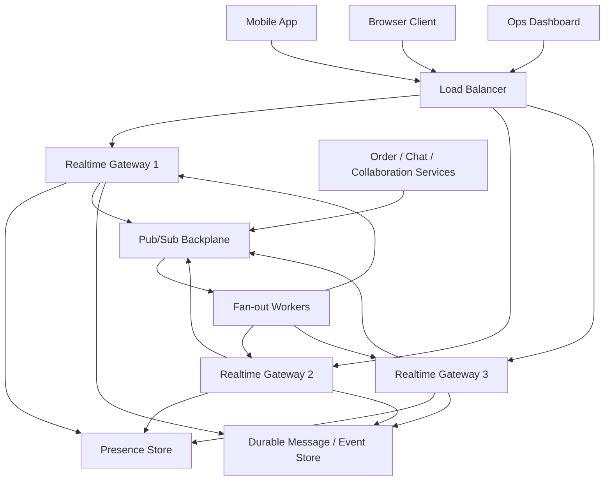

# Real-time Communication

> Real-time communication is the set of techniques that let systems push fresh information to users quickly enough that the experience feels live instead of refresh-driven.

---

## The Problem

Imagine you are building a live operations dashboard for a food-delivery company. Dispatchers watch drivers move on a map, restaurants accept or reject orders, customers expect order status to change from "preparing" to "picked up" to "arriving" without touching refresh, and support agents need to see the same truth at nearly the same moment. On a quiet afternoon the system tracks 15,000 active users and about 40,000 state changes per second across orders, driver locations, chat messages, and presence updates.

Now imagine you implement that experience with ordinary request-response polling every 5 seconds. If 15,000 clients each ask "anything new?" every 5 seconds, that is 3,000 requests per second even when nothing changed. During a dinner rush, the active user count jumps to 250,000. Suddenly the platform is doing 50,000 mostly-empty requests per second just to discover whether updates exist. Your API layer burns CPU serializing unchanged JSON, your database gets hammered by repeated reads for data that is already stale by the time it returns, and users still see delayed state because a 5-second poll interval means the best-case freshness is 0 to 5 seconds behind reality.

Lower the poll interval to 500ms and it gets worse. Now the system does half a million requests per second and still wastes work when nothing changed. Raise the interval to 10 seconds and users complain that the product feels broken. Chat messages appear late, collaborative cursors jump, presence indicators lie, and live scores are no longer live. This is the core problem real-time communication solves: the system needs a more efficient way to keep many clients synchronized with frequently changing state.

Real-time communication is not just "use WebSockets." The hard part is choosing the right transport, deciding where connection state lives, distributing one update to thousands or millions of interested clients, keeping long-lived connections healthy through load balancers and deploys, and preventing one hot channel from melting your fan-out path. Get it right and the product feels magical. Get it wrong and you end up with stale dashboards, dropped messages, overloaded gateways, and a fleet of servers doing mostly useless work.

---

## Core Concept Explained

Think of real-time communication like the difference between checking your mailbox every 30 seconds versus having a doorman who hands you letters the moment they arrive. Polling is the repeated walk to the mailbox. Push-based communication is the doorman. The more often information changes, and the more people waiting on it, the more expensive the mailbox model becomes.

At a high level, real-time systems are about reducing the delay between an event happening and a user seeing the result. There are four common delivery patterns, and they differ in cost, complexity, and capability.

### Polling

Polling is the simplest model. The client asks the server at fixed intervals whether new data exists. If the user is on a stock screen and the browser polls `/prices` every 3 seconds, the server returns either the latest prices or a "no change" response. Polling is easy to implement and works through almost every proxy, CDN, and firewall because it is just ordinary HTTP.

The downside is waste. Most polls return either unchanged data or empty acknowledgements. If 100,000 clients poll every 2 seconds, that is 50,000 requests per second even before a single meaningful update is sent. Polling is often acceptable for low-scale admin panels, dashboards where 5 to 30 second freshness is fine, or systems where updates are rare and the operational simplicity matters more than efficiency.

### Long polling

Long polling improves on normal polling by letting the server hold the request open until new data arrives or a timeout expires. The client sends a request, the server waits up to, say, 20 seconds, and responds only when it has something new or the timer runs out. The client then immediately opens the next request.

This reduces the number of empty requests because idle periods do not generate one request every second. It still uses the request-response model, which is helpful when browsers, corporate proxies, or older infrastructure make full-duplex connections inconvenient. But long polling still has request churn because each delivered update usually requires the client to reconnect. At high scale that means a lot of HTTP headers, TLS reuse pressure, and repeated routing decisions.

### Server-Sent Events

Server-Sent Events, or SSE, keep one HTTP response open and let the server stream text events from server to client. It is effectively one-way push from server to browser. This works very well for timelines, notifications, dashboards, and live feeds where the browser mostly listens and the client can send commands through ordinary HTTP POSTs.

SSE is simpler than WebSockets in several ways. It is built on HTTP semantics, has automatic browser reconnection behavior, and works naturally with event IDs for resume behavior. But it is one-way. If the client needs to send frequent low-latency messages back, such as in chat typing indicators or collaborative editing cursor movement, SSE alone is not enough.

### WebSockets

WebSockets upgrade an HTTP connection into a persistent full-duplex channel. Once established, both client and server can send messages independently without reissuing HTTP requests. That makes WebSockets a common default for chat, multiplayer collaboration, live trading screens, and high-frequency presence updates.

The power of WebSockets is that you pay the handshake once and then keep sending frames over the same connection. A single well-tuned gateway server can often hold tens of thousands of mostly idle WebSocket connections if memory and file-descriptor limits are configured correctly. But the tradeoff is operational complexity. Long-lived connections mean load balancers need proper idle timeouts, deploys need connection draining, and horizontal scale requires a backplane so a message entering Gateway A can reach a user currently connected to Gateway B.

### Presence and fan-out

Real-time systems are rarely just about one message moving from one sender to one receiver. They usually include **presence**, meaning "who is online, typing, viewing, or active," and **fan-out**, meaning one event must reach many subscribers. A group chat with 50 members is easy. A celebrity livestream with 500,000 viewers is not. If every new event has to be individually looked up against a database table of subscribers, your system will fall over. Real-time architecture depends on efficient channel membership, pub/sub distribution, and often tiered fan-out where edge gateways only hold connection state while an internal message backbone handles topic distribution.

### Choosing the right transport

Choose polling when simplicity matters most and a few seconds of latency are acceptable. Choose long polling when you need better freshness but still want request-response compatibility. Choose SSE when the browser mainly needs one-way updates such as notifications or dashboards. Choose WebSockets when both sides need low-latency bidirectional messaging or when reconnect overhead would otherwise dominate. The best answer is often mixed: mobile push notifications for wake-up, WebSockets for active sessions, and ordinary HTTP for durable state fetches and writes.

The key senior-level insight is that "real-time" is a product requirement, not a protocol name. Start by asking how quickly the user must see the change, how many subscribers each event has, whether the client needs to talk back continuously, and how expensive stale state is to the business. Then choose the simplest transport that satisfies those numbers.

---

## Architecture Diagram

### Mermaid Diagram

### Diagram Walkthrough

Starting from the top left, three types of clients enter the system: a mobile app, a browser client, and an operations dashboard. They all connect first to the load balancer. The load balancer is not the system that understands chat rooms or order channels. Its job is simpler and more important: terminate or pass through connections, route them to healthy realtime gateway nodes, and stop sending new traffic to nodes that are draining or unhealthy.

Below the load balancer are three realtime gateways. These are the servers that actually hold long-lived connections such as WebSockets or SSE streams. Each gateway keeps track of which client connections are attached to it and which channels those clients are subscribed to. If Browser Client is watching order `1234` and a support dashboard is subscribed to the same order, the gateway knows those connections are interested in the same topic.

Each gateway writes connection liveness into the presence store. The presence store is where the system answers questions like "is this user online?", "which device is active?", or "which gateway currently holds this connection?" Presence is usually short-lived state with TTLs and heartbeats. If a gateway stops refreshing a user's heartbeat, the system can mark that user offline after a timeout such as 30 or 60 seconds.

The pub/sub backplane is the system-wide distribution layer. Producer services on the left publish events into it: new chat messages, order status changes, location updates, or collaboration deltas. The backplane does not talk directly to every end user connection. Instead, fan-out workers read events from the backplane, determine which gateways or channels need them, and then deliver those messages back to the appropriate realtime gateways.

There are two important flows to picture. In the first flow, a user sends a chat message from the mobile app. The connection lands on Gateway 1 through the load balancer. Gateway 1 authenticates the connection, writes presence, persists the message to the durable history store if needed, and publishes the event to the pub/sub backplane. Fan-out workers then distribute that message to whichever gateways currently host members of the chat room, including maybe Gateway 2 and Gateway 3.

In the second flow, an order service changes an order from "preparing" to "picked up." That producer service publishes an event directly into the backplane. Fan-out workers determine which clients care about order `1234`, and the corresponding gateways push the update to browsers, phones, or dashboards already subscribed. The durable history store matters here because if a client disconnects and reconnects, it can fetch missed messages or the latest snapshot instead of relying on the gateway to remember everything forever.

---

## How It Works Under the Hood

WebSockets start as ordinary HTTP. The client sends a request with `Connection: Upgrade` and `Upgrade: websocket`, plus a key used in the handshake. If the server accepts, it responds with `101 Switching Protocols` and the connection becomes a framed bidirectional stream. After that, messages are no longer HTTP requests. They are WebSocket frames, which can be text or binary. Control frames such as ping, pong, and close are used to detect liveness and terminate cleanly.

This matters operationally because the load balancer and gateway now need to care about connection duration rather than just request duration. A normal REST request may live for 20 to 300ms. A WebSocket may live for minutes or hours. If the load balancer has a 60-second idle timeout and the app sends no heartbeats, the connection dies even though nothing is functionally wrong. That is why many realtime systems send heartbeat frames every 15 to 30 seconds and configure LB idle timeouts above that, often 60 to 300 seconds depending on the provider.

SSE works differently. It keeps one HTTP response open and streams lines such as `event: update` and `data: {...}`. Because it is text over HTTP, it behaves more naturally through some proxies and is easier to debug with curl-like tools. Browsers also automatically reconnect and can send `Last-Event-ID`, which helps resume after disconnect. But SSE is still one-way, so the client usually uses separate HTTP requests to send actions back.

Connection state creates the next major challenge. If a user connected through Gateway 2, and a new message is published by a backend service talking to Gateway 1, how does Gateway 1 know where to send it? You need shared routing state, usually stored indirectly through channel membership maps, user-to-gateway mappings, or pub/sub subscriptions. Redis pub/sub can work for smaller systems. Kafka, NATS, or custom brokers are common when event rates or channel counts grow. The point is that the gateways cannot be isolated islands if clients connect to many nodes.

Presence is usually implemented with heartbeats plus expirations. Every connected client periodically refreshes a key like `presence:user123=device4` with a TTL of 30 seconds. If the heartbeat stops, the key disappears and downstream systems infer offline state. This is intentionally approximate. A presence badge does not need the same durability guarantees as money movement. Systems that try to make presence perfectly accurate often pay too much in write amplification and coordination.

Fan-out math is where realtime systems get dangerous. One user message into a room of 20 members means 20 outbound deliveries. One score update into a sports channel with 2 million listeners means 2 million outbound deliveries. That is why channel segmentation, hierarchical fan-out, and batching matter. A broker may deliver one event per gateway rather than one event per client, and the gateway then duplicates it only across its local connections. If 2 million clients are spread across 200 gateways, the backbone does 200 deliveries and the gateways do the last-mile push.

Backpressure is another underappreciated issue. Some clients are slow. Mobile radios pause, browser tabs background, and users on weak networks cannot consume messages as fast as the producer emits them. If you buffer forever, memory explodes. If you drop everything, user experience collapses. Good systems define limits: maybe each connection gets a bounded queue of 100 messages or 1MB of buffered data. If the client falls behind, the system drops the connection and asks it to reconnect and resync from durable history.

Finally, realtime systems usually combine push with pull. Push is excellent for "something changed." Pull is still useful for durable truth. A collaboration app may push cursor movement and patch deltas over WebSockets, but after reconnect the client may fetch the full document snapshot over HTTP. A chat app may push new messages instantly, but history pagination still uses ordinary REST or gRPC. This hybrid model keeps the push layer lean and lets the durable data layer do what it is good at.

---

## Key Tradeoffs & Limitations

Choose polling when the freshness requirement is soft and infrastructure simplicity is more valuable than efficiency. A metrics page refreshing every 15 seconds for 1,000 internal users does not need a WebSocket cluster. The added connection state, backplane, and observability burden would be wasted complexity.

Choose SSE when the browser mostly needs one-way updates and you want something easier to operate than bidirectional sockets. It fits notifications, status dashboards, and live feeds well. Choose WebSockets when users need to send low-latency data back continuously, such as chat, typing indicators, presence heartbeats, collaborative cursors, or game state.

The biggest tradeoff is operational cost. Long-lived connections consume memory, file descriptors, heartbeat traffic, and careful deployment logic. A gateway holding 40,000 WebSocket connections may use hundreds of megabytes of RAM before application payloads are counted, and a fleet holding 2 million concurrent connections needs capacity planning that looks different from ordinary stateless HTTP autoscaling.

Real-time transport also does not guarantee real-time business correctness. A chat bubble can arrive instantly while the durable write behind it is still pending. Presence can be approximate. Collaboration updates can arrive fast but still require conflict resolution. Use realtime channels for freshness, not as an excuse to skip durable storage, idempotency, or replay strategy.

There are also network and product constraints. Corporate proxies sometimes break WebSockets. Mobile devices go to sleep and reconnect unpredictably. Browsers cap concurrent connections differently. If your application has fewer than 10,000 active concurrent users and updates matter only every few seconds, realtime infrastructure may be pure overhead. If your core product promise is "everyone sees changes within 100ms," then it becomes worth paying for.

---

## Common Misconceptions

**Many people believe WebSockets are automatically the best answer for anything called realtime.** In reality, some realtime products only need one-way updates every few seconds, which SSE or even polling can handle with much less operational complexity. The correct understanding is that transport choice depends on bidirectionality, fan-out shape, and latency requirements. The misconception exists because WebSockets are the most famous realtime protocol, so they get recommended before the actual problem is understood.

**A common belief is that polling is always bad.** Polling is wasteful at high concurrency and low latency targets, but it is still a perfectly sensible solution for low-scale dashboards, admin tools, or products where a 5 to 30 second delay is acceptable. The correct view is that polling is bad only when the numbers make it bad. People dismiss it too quickly because they learn the elegant distributed solution before they learn to price operational simplicity.

**Many teams assume presence must be perfectly accurate.** It usually cannot be. Network drops, backgrounded mobile apps, and heartbeat timing mean "online" often really means "last heartbeat within the last 30 seconds." The correct understanding is that presence is usually probabilistic and approximate. The misconception exists because the UI shows a clean green dot, which hides the messy infrastructure behind it.

**People often think one message equals one delivery.** In group systems, one message can explode into thousands or millions of outbound pushes, and that fan-out cost is usually the real scaling problem. The correct model is that publish cost and delivery cost are separate. The misconception survives because single-user demos do not reveal the multiplication factor.

**Many assume long-lived connections remove the need for normal APIs.** They do not. Realtime channels are great for deltas, events, and liveness, but clients still need durable fetch APIs for history, snapshots, rehydration, and missed-event recovery. The misconception feels true because the socket is already open, so teams are tempted to send everything over it whether or not that is the right design.

---

## Real-World Usage

**Slack** built its user-facing realtime experience around persistent client connections so messages, typing indicators, and presence updates can show up immediately across desktop, web, and mobile sessions. Slack has discussed separating the fast delivery path from durable storage and background processing, which is exactly the right design lesson: the socket path should make the UI feel live, while durable systems keep truth and replay. At enterprise scale, that means huge connection fleets plus careful routing and reconnect behavior during deploys.

**Discord** is a strong example of gateway-heavy realtime architecture. Discord publicly documents a Gateway API built around long-lived WebSocket connections, heartbeats, and sharding. Sharding exists because one gateway process cannot efficiently hold all global connection state forever; clients are partitioned across gateway shards, and downstream systems distribute events to the right shard. That is a textbook case of how connection state and fan-out become first-class scaling concerns.

**Figma** is a well-known collaboration example where realtime is not just chat-like message delivery. Multiple users edit the same design file, move cursors, and see each other's actions almost immediately. That experience depends on low-latency sync, but also on conflict handling and a durable source of truth. Figma's engineering work illustrates the key point that realtime transport alone is not enough; the system also needs an update model that can merge or sequence concurrent edits safely.

---

## Interview Angle

**Q: When would you choose SSE over WebSockets?**
**How to approach it:**
- Start by asking whether the client mostly needs one-way updates or true bidirectional low-latency messaging.
- Explain that SSE is simpler for notifications, live dashboards, and feed updates because it stays closer to normal HTTP behavior.
- Contrast that with WebSockets for chat, collaboration, or gaming where the client talks back frequently.
- Strong answers mention operational simplicity, proxy compatibility, and reconnect behavior.

**Q: How do you design a chat system so messages reach users connected to different gateway nodes?**
**How to approach it:**
- Separate connection termination at gateways from system-wide message distribution.
- Discuss a pub/sub or stream backplane so one inbound message can be routed to whichever gateways hold room members.
- Mention durable storage for history and reconnect recovery instead of relying on gateway memory alone.
- Bring up fan-out cost explicitly because that is usually the scaling bottleneck.

**Q: What are the main failure modes in a realtime connection service?**
**How to approach it:**
- Talk about load balancer idle timeouts, broken heartbeats, reconnect storms, and slow consumers.
- Mention bounded per-connection buffers and backpressure so one bad client does not consume unbounded memory.
- Include deploy and scale-in behavior: connections need draining or resumable reconnects.
- A strong answer connects network instability to product behavior, not just server metrics.

**Q: How would you model presence for millions of users?**
**How to approach it:**
- Explain heartbeat plus TTL as the default pattern.
- Call out that exact accuracy is unrealistic, so the system should aim for bounded staleness rather than perfection.
- Mention that presence state is ephemeral and should usually live in a fast store rather than a heavy relational write path.
- Show nuance by distinguishing "online sometime in the last 30 seconds" from "actively reading this exact room."

---

## Connections to Other Concepts

**Concept 13 - Synchronous vs Asynchronous Communication Patterns** provides the conceptual backdrop for this topic. Realtime channels feel synchronous to users because the response is immediate, but the internals often rely on asynchronous brokers, buffers, and retries to move events safely between services and gateways.

**Concept 14 - Message Queues & Stream Processing** is tightly coupled to realtime fan-out. Once events need to travel from producers to many gateway nodes, queues or pub/sub backplanes become the internal transport that keeps the outward realtime experience from depending on one process or one machine.

**Concept 15 - Event-Driven Architecture & Event Sourcing** connects because many realtime systems publish domain events and then project them into user-facing channels. Chat delivery, collaboration updates, and presence changes often become far easier to scale when they are modeled as event streams instead of direct point-to-point calls.

**Concept 19 - Fault Tolerance Patterns** matters because reconnect storms, dead gateways, and overloaded fan-out workers are classic cascading-failure triggers. Timeouts, circuit breakers, graceful degradation, and controlled backpressure are what keep a realtime outage from turning into a full platform outage.

**Concept 21 - Monitoring, Observability & SLOs/SLAs** becomes essential once connection counts, delivery latency, dropped-message rates, and reconnect rates matter. Realtime systems are judged on user-perceived freshness, so you need metrics that tell you not only whether the gateway is alive, but whether updates are reaching users within the promised latency budget.
