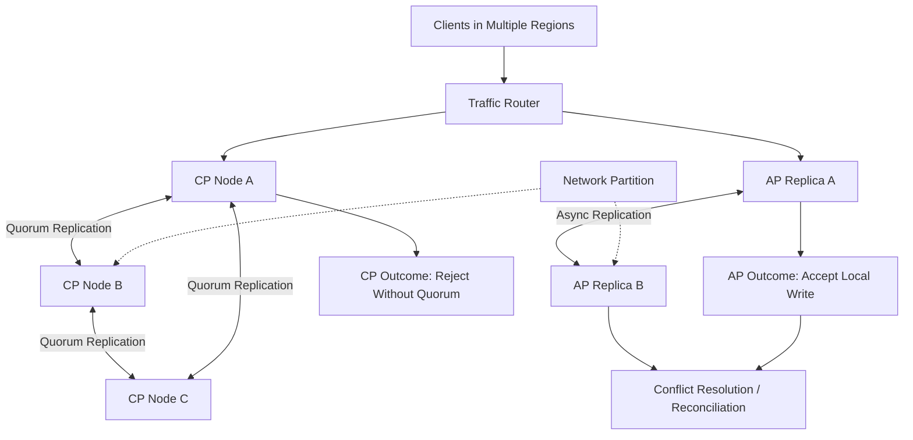

# CAP Theorem & PACELC

> CAP and PACELC are decision frameworks for understanding how distributed systems behave when networks fail and what they trade even when the network is healthy.

---

## The Problem

Imagine you run a globally distributed inventory service for a flash-sale platform. At 9:00 PM, a celebrity sneaker drop opens and traffic jumps from 2,000 requests per second to 75,000 requests per second across users in Mumbai, Frankfurt, and Virginia. Every request is hitting inventory counts for a tiny set of SKUs. Customers expect the count they see to be real, the checkout they submit to succeed, and the site to stay up even if one region has trouble.

Then a partial network partition hits between Europe and the US. The links are not fully dead, just flaky enough that cross-region replication times out unpredictably. Region A can still serve users. Region B can still serve users. But they cannot reliably agree on the latest inventory state. If both regions keep accepting writes independently, you can oversell limited stock and spend the next six hours canceling orders. If one region stops accepting writes until quorum returns, some users see errors even though "their" local region looks healthy.

That is the pain CAP is about. It is not an abstract theorem for whiteboards. It is the question of what your system chooses when coordination becomes unreliable: preserve a single up-to-date view of truth, or keep answering requests even if different parts of the system disagree temporarily. In a payments ledger, taking the wrong side can create financial loss. In a social feed, taking the wrong side can create unnecessary downtime.

PACELC matters because life is not only about failures. Most of the time, your network is healthy. Even then, you still decide whether to wait for extra replicas and cross-region confirmations in exchange for stronger consistency, or return faster with weaker guarantees. A same-region replica ack might add 2 to 5ms. A cross-region consistency hop might add 50 to 150ms. For a configuration database, that may be fine. For a home feed or ad impression counter, it may be a terrible trade. CAP and PACELC exist because distributed systems are fundamentally built on unreliable links, variable latency, and business requirements that do not all want the same thing.

---

## Core Concept Explained

Think of CAP like two bank branches connected by a phone line. As long as the line is healthy, both branches can coordinate and make sure an account balance stays identical everywhere. But if the line goes down and both branches still want to serve customers, they have to choose. They can freeze withdrawals until coordination returns, preserving correctness. Or they can keep serving customers locally, accepting that the balance may temporarily diverge and need reconciliation later. That is the heart of the theorem.

### What CAP actually says

CAP stands for **Consistency**, **Availability**, and **Partition tolerance**, but the common slogan "pick any two" is misleading. The real statement is narrower and more useful: **when a network partition happens, a distributed system has to choose between consistency and availability**.

In this context, **consistency** means every read sees the most recent successful write, or an error. That is closer to linearizability than to the vague "the data eventually looks okay" meaning people sometimes use in application conversations. If a value is updated in one region and another client reads immediately from another region, a consistent system either returns the new value or refuses the read because it cannot guarantee freshness.

**Availability** means every request to a non-failing node receives a non-error response, even if that response may not reflect the latest global write. The system is still answering, not timing out waiting for coordination. In practice this often means a region can continue accepting local writes or serving local reads while detached from the rest of the cluster.

**Partition tolerance** means the system continues operating despite dropped, delayed, or reordered messages between nodes. In any real multi-node deployment, especially across zones or regions, you do not get to opt out of partitions. The network will sometimes act as if parts of the system cannot talk. That is why the practical debate is never "C, A, or P?" It is "given that P is real, do we choose more C or more A when it happens?"

### Why CA is usually a trap

People often talk about CA systems as if they are a peer to CP and AP. In practice, a truly distributed CA system only exists if you assume partitions do not happen or you collapse to a single node. A single PostgreSQL instance can feel CA because there is no cross-node coordination problem inside one machine. The moment you replicate it across nodes and require both copies to remain coordinated, the network enters the picture and the CA fantasy disappears.

That is why senior engineers usually talk about CAP only for systems that actually replicate state across failure boundaries. A local process cache is not a CAP discussion. A single Redis node is not a CAP discussion. A control-plane database stretched across three availability zones absolutely is.

### CP systems

CP systems preserve consistency during a partition by refusing operations that cannot safely achieve quorum. Leader-based databases and coordination systems often live here. If a leader loses contact with a majority of replicas, it steps down or stops accepting writes. That hurts availability, but it prevents split-brain.

Systems like ZooKeeper, etcd, and many Raft-backed services are deliberately CP because they store metadata, leader leases, service discovery information, or cluster membership. Wrong answers in those systems are worse than temporary unavailability. If your scheduler thinks two primaries exist, you have a bigger problem than one failed request.

### AP systems

AP systems preserve availability during a partition by letting separated nodes continue serving requests and reconciling later. Dynamo-style databases are the classic example. Each side accepts writes locally, attaches enough metadata to detect concurrent updates, and merges using version vectors, last-write-wins, or application-specific conflict resolution.

This works best when the data can tolerate divergence. Shopping carts are the textbook case because adding the same item twice or merging two independently edited carts is usually acceptable. User likes, feed fanout markers, ad counters, and some telemetry streams also fit well. A ledger or seat-allocation system usually does not.

### Where PACELC comes in

CAP explains behavior during partitions. PACELC extends the conversation to the much more common case where there is **no partition**. The acronym says: **if there is a Partition, choose Availability or Consistency; Else, choose Latency or Consistency**.

This matters because many systems that are technically CP or AP still make very different choices in the healthy path. Google Spanner is effectively a **PC/EC** style system: during partitions it favors consistency, and when healthy it still accepts extra latency to preserve globally consistent reads and writes. Cassandra is closer to a tunable **PA/EL** system by default: during partitions it leans toward availability, and when healthy it often chooses lower latency unless the client explicitly asks for stronger consistency levels.

That difference is why CAP alone is incomplete for architecture tradeoffs. Two systems may both handle partitions sensibly, yet one adds 80ms to writes because it waits for remote confirmation and the other returns in 8ms because it does not. PACELC gives language for that healthy-state cost model.

### Real latency intuition

The else-side of PACELC is not theoretical. Same-host memory access is measured in nanoseconds. A local SSD read may be tens to hundreds of microseconds. Cross-AZ RTT in a cloud region is often around 1 to 3ms. US east to US west can be roughly 60 to 80ms round trip. India to US east can be 180 to 250ms. If your database requires global synchronous agreement before acknowledging a write, those physics show up directly in user latency.

So the practical question becomes: what is the business value of stronger guarantees, and where is that value worth the latency bill? Configuration state, schema metadata, payment records, and lease ownership often justify paying it. Activity feeds, metrics ingestion, and notification fanout often do not.

### What CAP and PACELC do not tell you

These frameworks do not tell you how to design schemas, how to resolve conflicts, how to set timeouts, or how to build a good developer experience. They do not replace thinking about idempotency, retries, caching, queues, or observability. They simply force you to admit that distributed state has unavoidable tradeoffs and that the right answer depends on the cost of being wrong versus the cost of being unavailable or slow.

---

## Architecture Diagram

### Mermaid Diagram

### Diagram Walkthrough

Starting from the top, clients in multiple regions send requests to a traffic router. The router represents whatever front door your system uses: DNS, a global load balancer, or a service proxy. Its job is just to get requests to a nearby serving path. The important part of the diagram is that the router can send those requests into two very different styles of datastore behavior.

On the left is the CP cluster: Node A, Node B, and Node C. These three nodes replicate through a quorum protocol. In normal operation, a write arrives at one node, that node coordinates with the others, and the write is only considered successful once a majority agrees. That is why the arrows between the CP nodes are labeled quorum replication. If the cluster has three nodes, it usually needs at least two to agree before a write can safely commit.

Now look at the dashed partition marker. It represents a network split or enough message loss that one or more links cannot be trusted. In that state, the CP side chooses safety over local responsiveness. If Node A cannot reach a majority, it should not keep accepting writes. That is why the CP path leads to the box labeled "Reject Without Quorum." The user may see an error or timeout, but the system avoids creating two conflicting truths.

On the right is the AP path. Replica A and Replica B exchange updates asynchronously rather than waiting for a quorum before acknowledging each write. In healthy conditions, writes accepted in one region are replicated quickly to the other. During a partition, Replica A can still accept a local write even though Replica B may not know about it yet. That is why the AP side leads to "Accept Local Write."

But accepting local writes is not the end of the story. Those divergent writes eventually flow into the conflict resolution or reconciliation component. That component might merge shopping cart contents, compare version vectors, prefer one write based on timestamps, or send a conflict back to the application for manual handling. This is the hidden cost of availability under partition: the system stays up, but somebody has to reconcile different versions of reality later.

There are two concrete flows worth picturing. In the normal healthy flow, a client write goes through the router and either the CP cluster reaches quorum quickly or the AP replicas replicate fast enough that divergence stays small. In the partition flow, the CP path rejects writes once quorum is lost, while the AP path keeps serving locally and pushes the complexity into later merge logic. That is exactly the distinction CAP is trying to make explicit.

---

## How It Works Under the Hood

Under the hood, CAP tradeoffs show up in coordination algorithms and replication metadata. In a CP system, the critical primitive is quorum. If there are `N` replicas, the system commonly needs a majority of `floor(N/2) + 1` to safely elect a leader or commit a write. With three nodes, that means two. With five nodes, that means three. This is what prevents two isolated minorities from both believing they are the current source of truth.

Leader-based systems enforce that through leases, terms, or epochs. A leader only remains valid while it can keep proving to a majority that it is alive. If it loses that majority because of a partition, it must step down. That is why etcd, ZooKeeper, and Raft-backed databases can become unavailable during partitions even when a node is still running fine locally. They are refusing to guess.

AP systems use a different toolset. Instead of refusing local progress, they record enough metadata to reason about concurrent updates later. Dynamo introduced vector clocks for this reason. Cassandra, Riak, and related designs use combinations of quorum tunables, hinted handoff, read repair, anti-entropy repair, and timestamps to keep replicas converging eventually. A write may be accepted by one replica and queued for later delivery to another. If two replicas accept conflicting writes while partitioned, the system resolves the conflict based on timestamps, merge functions, or application logic.

That is where PACELC becomes operationally concrete. Suppose a global database has replicas in Virginia, Frankfurt, and Singapore. If the healthy-path write requires two remote acknowledgments, p99 latency will reflect those inter-region RTTs. A single region local write might finish in 3 to 8ms. A write that waits for intercontinental quorum may land closer to 80 to 200ms depending on geography and storage behavior. That is not just a database number. It changes API response times, request timeouts, and the amount of concurrency your app servers need to maintain throughput.

Quorum math also creates tunable middle ground. In quorum-based AP-ish stores, clients can choose read and write consistency levels such as `ONE`, `QUORUM`, or `ALL`. If `R + W > N`, then a read and a write overlap on at least one replica, which can improve consistency. But even that does not magically create linearizability if clocks, background repair, and conflict resolution semantics remain loose. Tunable quorums are powerful, but they demand precision about what guarantee is actually being offered.

Failure detection itself is another hidden complexity. Networks do not hand you a clean "partition started at 12:03:04" event. They give delayed packets, dropped packets, and asymmetric reachability. One node may think another is down while the reverse is not true. That ambiguity is why false failovers and split-brain protection are so hard. A CP system usually prefers to sacrifice some availability rather than let two leaders exist. An AP system usually prefers to continue serving and accept that reconciliation cost later.

Storage and repair overhead also matter. AP systems that keep multiple versions, tombstones, or hinted writes are not getting availability for free. They are paying in background compaction, repair traffic, read amplification, and operational debugging complexity. CP systems pay in coordination latency, leader failover time, and sometimes lower steady-state throughput. Neither side is cheap. They just spend their complexity budget in different places.

The most senior-level takeaway is that CAP and PACELC are about **failure semantics and latency semantics**, not vendor labels. Two databases with the same marketing category can behave very differently depending on configuration, geography, and client consistency settings. You cannot outsource this thinking to a feature matrix.

---

## Key Tradeoffs & Limitations

**Choose CP when wrong answers are more expensive than temporary errors.** Financial ledgers, inventory reservation, schema metadata, service discovery, feature-flag control planes, and lease ownership usually fit here. If showing stale or conflicting state can cause money loss or infrastructure corruption, it is usually better to reject some requests during a partition and recover cleanly later.

**Choose AP when continued operation matters more than immediate global agreement.** Activity feeds, shopping carts, IoT telemetry, ad counters, notifications, and some collaboration metadata often fit better. These systems can tolerate temporary divergence if they stay responsive and converge later. But "tolerate divergence" must be true in the business sense, not just in the architecture diagram.

**PACELC forces you to price healthy-state latency honestly.** A globally consistent write path can be beautiful for correctness and brutal for UX. If your p99 write latency jumps from 15ms to 140ms because you wait for remote replicas, your product team will feel that. Choose stronger consistency in the healthy path when the guarantee is worth the latency tax, not because "stronger" sounds universally better.

**Do not use CAP as a universal design shortcut.** CAP does not tell you whether a monolith or microservice is better, whether to shard first, or whether Redis should sit in front of PostgreSQL. It also says little about durability, cost, or developer ergonomics. If a team uses CAP to avoid more specific design thinking, that is usually a sign they know the slogan but not the system.

**Some workloads want different answers for different endpoints.** A single product can be CP for payment authorization, AP for notification counters, and somewhere in between for catalog reads. That is why copying one database style across every subsystem often leads to either unnecessary latency or unnecessary inconsistency.

Choose CP when the cost of divergence is high. Choose AP when the cost of stopping is higher. Choose PACELC tradeoffs based on whether users feel the added latency more sharply than they value the extra coordination.

---

## Common Misconceptions

**"CAP means you can pick any two of consistency, availability, and partition tolerance."** That slogan is catchy but wrong. In real distributed systems, partitions are not optional, so the meaningful choice appears when they happen: do you preserve consistency or stay available? The misconception exists because the three-letter mnemonic is easier to remember than the actual theorem.

**"CA systems are a normal option for distributed databases."** They are usually not. You can behave as if you are CA only by avoiding real partitions in the model or collapsing to one node. Once you replicate across machines and failure domains, the network can separate nodes and force the tradeoff. The misconception survives because product marketing often blurs single-node behavior and distributed behavior together.

**"AP means the system has no consistency at all."** That is also wrong. AP systems often provide eventual consistency, session guarantees, tunable quorums, or conflict-resolution rules. They are not random. They simply allow temporary divergence under partition instead of blocking progress. The misconception exists because people hear "availability" and assume it means "anything goes."

**"CP systems are always correct and therefore always safer."** CP systems avoid a class of split-brain and stale-read problems, but they can still be misconfigured, suffer bad failovers, or violate application-level invariants above the storage layer. They are safer for certain semantics, not magically perfect. The misconception exists because refusing requests feels principled, so people overestimate how much correctness that refusal buys by itself.

**"PACELC replaces CAP, so CAP is outdated."** PACELC extends CAP; it does not invalidate it. CAP still explains behavior under partition. PACELC adds the healthy-state latency-versus-consistency tradeoff that CAP leaves out. The misconception exists because new frameworks often get presented as total replacements instead of refinements.

---

## Real-World Usage

**Google Spanner** is one of the clearest PACELC examples in production. Spanner uses leader-based replication and quorum commits to preserve strong consistency across replicas. That gives developers globally consistent reads and transactions, but it also means writes pay the latency cost of coordinated agreement. Google chose that because the systems using Spanner often value correctness and externally consistent transactions more than minimum possible latency.

**Amazon Dynamo and Dynamo-inspired systems** are the classic AP reference point. Dynamo was designed so services like shopping cart storage could continue operating during partitions rather than failing closed. It used techniques like version vectors, sloppy quorums, and hinted handoff so replicas could keep serving and reconcile later. The reason this was a good trade is that cart contents are mergeable in ways bank balances are not.

**Kubernetes control planes backed by etcd** are a practical CP example every infrastructure team eventually touches. etcd is designed to provide a strongly consistent source of truth for cluster state, leader elections, and configuration. If quorum is lost, the control plane would rather stop accepting updates than let two parts of the cluster believe different truths about scheduling or ownership. That is exactly the right choice for infrastructure metadata, even though it can make outages feel more abrupt.

---

## Interview Angle

**Q: Why is "pick any two" an oversimplification of CAP?**
**How to approach it:**
- Start by defining the terms in the distributed-systems sense, especially consistency as "latest write or error."
- Explain that partitions are not optional in real multi-node systems, so the meaningful tradeoff appears when the network is broken.
- Use one concrete example, such as inventory or service discovery, to show why the system must either reject or risk divergence.
- Strong answers make the theorem practical instead of reciting the slogan.

**Q: When would you intentionally choose a CP system?**
**How to approach it:**
- Anchor the answer in the cost of a wrong answer: double leadership, double spending, oversold stock, corrupted metadata.
- Mention leader election, control planes, locks, configuration state, and money movement as examples.
- Acknowledge the downside clearly: some requests fail during partitions or leader elections.
- Show judgment by saying not every feature in the product needs the same choice.

**Q: How does PACELC change the conversation beyond CAP?**
**How to approach it:**
- Explain that CAP is about partition-time behavior, while PACELC adds healthy-state latency versus consistency.
- Use real RTT numbers to make the tradeoff concrete, especially for cross-region writes.
- Mention that two systems can both survive partitions but still feel very different to users because one waits for more coordination.
- Strong answers connect theory to p99 latency and UX, not just acronyms.

**Q: Can an AP system still offer strong guarantees to clients?**
**How to approach it:**
- Say "sometimes, but only for specific operations and configurations," not a blanket yes or no.
- Talk about tunable consistency, session stickiness, conflict resolution, and application-level merge rules.
- Make it clear that strong guarantees for one request path do not mean the whole system is globally linearizable.
- A strong answer separates storage semantics from product semantics.

---

## Connections to Other Concepts

**Concept 08 - Database Replication** is the most direct precursor to this topic. As soon as one primary has followers in other zones or regions, replication lag, synchronous acknowledgments, and failover semantics turn into CAP and PACELC decisions whether the team uses that vocabulary or not.

**Concept 14 - Message Queues & Stream Processing** often gets used to soften the user-facing consequences of CAP tradeoffs. If a system chooses consistency and temporarily rejects writes, queues can absorb work for later processing. If it chooses availability, streams often become the mechanism for reconciliation and repair.

**Concept 18 - Distributed Consensus Simplified** goes deeper into the CP side of this file. CAP tells you why you may need to sacrifice availability to preserve a single truth under partition. Consensus explains how leader election, quorum, and log agreement actually implement that choice.

**Concept 19 - Fault Tolerance Patterns** connects because partitions are just one class of failure. Retries, backoff, circuit breakers, and graceful degradation determine whether CAP-driven decisions become controlled errors or cascading outages. The theory only helps if the surrounding system handles failure well.

**Concept 20 - Idempotency, Deduplication & Exactly-Once Semantics** becomes especially important in AP and eventually consistent flows. When retries, delayed replication, and reconciliation are normal, duplicate work and out-of-order effects appear constantly. Idempotency is what keeps those systems sane at the application boundary.
