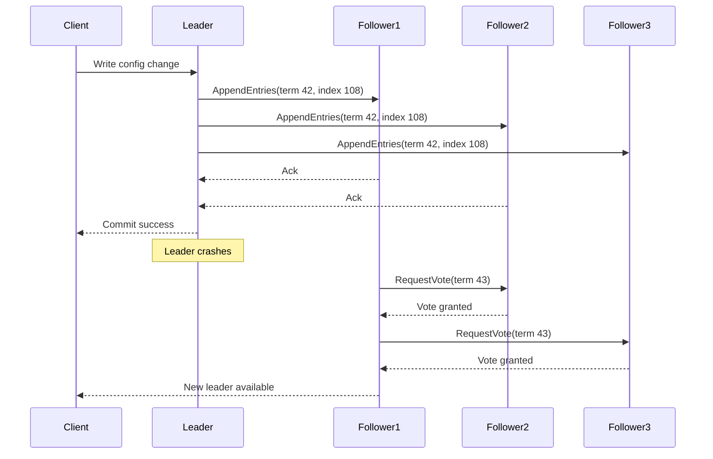

# Distributed Consensus Simplified

> Distributed consensus is the set of techniques that lets multiple machines agree on one leader and one ordered history of decisions even when some machines fail or the network gets weird.

---

## The Problem

Imagine you run a workflow platform that schedules payroll jobs for large enterprises. The system has three scheduler nodes so a single machine failure does not stop payroll. Every morning, one node is supposed to act as the leader, assign due jobs, and write checkpoint metadata so workers do not run the same payroll twice.

That sounds straightforward until the first real incident. A network partition hits one availability zone. Node A can still see the database, but Node B and Node C can still see each other and most of the worker fleet. Node A thinks, "I was the leader a second ago, so I should keep issuing schedules." Node B times out waiting for A's heartbeat and decides, "The leader is dead, I should take over." Now two different machines believe they are in charge.

The failure is not theoretical. Node A enqueues payroll run `#48192` once. Node B enqueues it again. Workers pull both tasks because, from their perspective, they arrived from apparently valid schedulers. Some employees get paid twice. Others get partial rollback entries because downstream systems cannot reconcile the duplicate state cleanly. Support now has a severe incident, finance has a trust problem, and engineering has learned the hard way that "three nodes" is not the same thing as "one agreed system."

This is the problem consensus solves. It is not mainly about speed. It is about agreement under failure. Which node is the current leader? Which write is the authoritative one? In what order did configuration changes happen? Can we safely promote a replica, grant a lock, or declare a job committed without risking split-brain? Without consensus, distributed systems often work beautifully on calm days and become dangerous precisely when the network or a node misbehaves. Consensus is the machinery that turns "a cluster of servers" into "a system that can still make one coherent decision."

---

## Core Concept Explained

Think of consensus like a board of directors approving company decisions. If one executive can approve spending on their own, decisions are fast but fragile. If five directors must agree, decisions are slower, but the company is less likely to make contradictory commitments because one person was unreachable or mistaken. The key is not that everyone talks all the time. The key is that there is a clear rule for when a decision counts.

In distributed systems, consensus means a set of nodes agreeing on a single ordered sequence of facts or commands. Those commands might be "set current leader to Node B," "store config version 19," "grant this lock," or "commit transaction X." The hard part is doing that while machines crash, disks stall, packets are delayed, or clocks drift.

### Why leader election matters

Many consensus systems are leader-based because one writer is easier to reason about than many concurrent writers. In Raft, one node is the leader and the others are followers. Clients send writes to the leader. The leader appends the write to its replicated log and sends it to followers. Once a majority confirms the entry, the system considers that entry committed.

Leader election is what prevents chaos when the current leader disappears. If followers stop hearing leader heartbeats for a randomized timeout window, typically something like 150 to 300ms in many Raft-style implementations, one follower becomes a candidate and asks the others for votes. If it wins a majority, it becomes the new leader. If it does not, another election happens.

This majority rule is the first core intuition. In a three-node cluster, a majority is two. In a five-node cluster, a majority is three. That means a three-node cluster can survive one failure, and a five-node cluster can survive two. It also explains why people prefer odd numbers. Four nodes do not let you tolerate more failures than three for leader election, but they do add another machine that must stay in sync.

### Quorum and majority writes

A quorum is the minimum number of nodes that must participate for a decision to count. In most leader-based consensus systems, that quorum is a majority. The reason majority quorums are so useful is overlap. Any two majorities in the same cluster must share at least one node. That shared node prevents two different leaders from safely committing two conflicting histories at the same time.

Suppose a five-node cluster has Nodes A, B, C, D, and E. A majority is three. If Nodes A, B, and C commit an entry, then any future majority must include at least one of those nodes. That overlap is what carries forward the most recent committed state. It is the safety anchor that makes "new leader after failure" different from "random node starts making things up."

### Terms, logs, and ordering

Consensus is not only about choosing a leader. It is also about choosing one ordered history. Raft uses **terms** as logical election epochs. Every time a node starts an election, it increments the term. If a node sees a higher term than its own, it steps down because it has evidence that a newer election happened somewhere else.

The replicated log is equally important. Every client write becomes a log entry with a term and index. Followers are not supposed to invent new entries. They copy the leader's log in order. If a follower has conflicting entries, the leader forces that follower to roll them back and align with the authoritative history. This sounds harsh, but it is exactly what you want. In consensus, "two partially valid histories" is not an acceptable end state.

Once an entry is stored on a majority and the leader advances the commit index, the nodes can apply that entry to their local state machine. The state machine might be a key-value store, a metadata registry, a lock service, or part of a database. Consensus is not the whole application. It is the ordered decision layer underneath it.

### Split-brain prevention

Split-brain is when two nodes both believe they are the legitimate leader. Consensus protocols are specifically designed to prevent that from becoming a committed reality. A node cannot safely become leader without winning a majority. If the network splits 2-3 in a five-node cluster, only the side with three nodes can form a majority and elect a leader. The isolated pair may still think something is wrong, but it cannot make authoritative progress.

This is why consensus can feel frustrating during outages. Sometimes the protocol intentionally refuses to accept writes even though some nodes are still alive. That is not failure of the design. That is the design choosing correctness over contradictory progress.

### Membership changes

Changing cluster membership is harder than it looks. If you simply replace one node list with another in one step, you can create windows where old nodes and new nodes disagree about what majority means. Raft handles this with joint consensus. For a period, the cluster requires agreement from overlapping old and new configurations. That sounds more complicated because it is. Membership change is one of the most error-prone parts of consensus systems, which is why production-grade implementations treat it as a first-class protocol feature rather than an afterthought.

### Why consensus is used selectively

Consensus is expensive compared with a single-node write. A leader typically must fsync its log, send replication RPCs, wait for majority acknowledgments, then commit. In a healthy single-region cluster that might mean a write latency of 3 to 10ms for metadata that would take sub-millisecond time on one local process. Across regions, consensus can be tens or hundreds of milliseconds. That is why teams use it for configuration, metadata, leader election, scheduling, locks, and transaction coordination, not for every clickstream event or image upload.

Consensus is the boring, disciplined answer to a narrow but critical question: how do several machines act like one decision-maker when failure is guaranteed to happen eventually?

---

## Architecture Diagram

### Mermaid Diagram

### Diagram Walkthrough

Start with the first line of the diagram. A client sends a write request to the current leader. In a real system, that write might be "update service config," "grant lease to scheduler-7," or "record metadata for job checkpoint 108." The important detail is that the client does not try to write to every node itself. It talks to the leader because the leader is the single coordinator for new log entries.

The leader then sends `AppendEntries` messages to Follower1, Follower2, and Follower3. Each message includes the current term, the log index, and the new entry that should be appended. These followers are not deciding whether they personally like the change. Their job is to verify the log ordering and persist the leader's entry if it fits the expected history.

Follower1 and Follower2 send acknowledgments back. That is enough for a majority because the cluster has four nodes in the diagram and the leader plus two followers gives three copies. At that point, the leader can safely tell the client the write is committed. Notice what is not required: the leader does not need every node to respond. Follower3 might be slow or partitioned, and the system can still make progress because a majority confirmed the entry.

That first half of the diagram is the normal write flow. It shows the essence of consensus in steady state: leader receives command, replicates to followers, waits for a quorum, then commits. The second half shows the failure path, which is where consensus really earns its keep.

The note over the leader marks a crash. Heartbeats stop. Follower1 times out first, which is common because Raft uses randomized election timeouts specifically to reduce the chance that many followers start elections at the exact same moment. Follower1 sends `RequestVote` messages with a higher term, term 43, to Follower2 and Follower3. By asking for votes with a newer term, it is proposing itself as the next leader.

Follower2 and Follower3 grant votes. Now Follower1 has a majority and becomes the new leader. That is why the final line says "New leader available." The client can redirect future writes there, either because it was told explicitly or because a proxy or discovery layer now points to the newly elected leader.

There are two critical scenarios embedded in the diagram. In the normal scenario, the leader commits writes only after majority acknowledgment. In the failure scenario, a new leader appears only after majority votes. Those two majority decisions are what prevent split-brain. A minority side of a partition might still be alive, but it cannot both elect a legitimate leader and commit conflicting new state.

---

## How It Works Under the Hood

Under the hood, Raft and similar protocols rely on a handful of invariants rather than magical intelligence. The first is the **log matching property**: if two logs contain an entry with the same index and term, then all previous entries are identical. Leaders enforce this by including the previous log index and term in `AppendEntries` RPCs. If a follower's history does not match, it rejects the append, and the leader backs up until it finds the last shared point. This is how divergent uncommitted histories get repaired after failures.

The second important detail is persistence. Consensus is pointless if a node acks an entry that only lives in RAM and then loses power. Production systems usually require the leader to fsync the log entry locally before counting it as durable, and followers often do the same before acknowledging. On NVMe SSDs in the same region, that may still keep median write latency in the single-digit milliseconds. On slower disks or cross-zone networks, the number grows quickly. Consensus latency is not just network time. It is network plus storage durability.

Failure detection is usually based on timeouts, but timeouts do not prove a node is dead. They only prove a node did not answer in time. That distinction matters. Consensus protocols are designed so safety does not depend on perfect clocks or perfect failure detection. A follower can start an election because it waited 250ms without hearing from the leader, but if the old leader is still alive and has a higher-term or more up-to-date log evidence, it will force the follower to step down. Timeouts drive liveness. Terms and quorum drive safety.

Election timing is deliberately randomized because identical timeouts create endless collisions. If all followers start elections exactly 200ms after the leader disappears, they can keep splitting votes 1-1-1 in a three-node cluster. Randomizing the timeout window, such as 150 to 300ms, makes it much more likely one candidate gets a clean head start and wins.

Membership changes require special handling because the definition of quorum changes when the node set changes. Raft's joint consensus approach temporarily requires overlapping majorities from the old configuration and the new one. That prevents the dangerous situation where one subgroup believes Node X is leader under the old cluster and another subgroup believes Node Y is leader under the new cluster, both with apparently valid quorums.

Consensus systems also need log compaction. A long-running cluster can accumulate millions of log entries. Replaying all of them on restart would be painfully slow. So implementations take snapshots of the applied state machine and truncate older log prefixes. etcd, Consul, and CockroachDB all do versions of this. Without compaction, the protocol remains correct but operationally miserable.

There are also failure modes consensus does not solve. If the application submits the same business command twice, consensus will faithfully replicate the duplicate command twice unless the layer above it uses idempotency. If the leader is alive but overloaded, the protocol may remain correct while user-visible latency becomes terrible. Consensus is a correctness tool, not a full performance or business-logic tool.

Finally, remember the throughput implications. A five-node cluster has better fault tolerance than a three-node cluster, but it usually has worse write latency and more operational cost. A common production compromise is three nodes for most control-plane clusters and five only when the business really needs tolerance of two failures or wants more careful placement across zones.

---

## Key Tradeoffs & Limitations

**Choose consensus when the cost of disagreement is worse than the cost of latency.** Cluster membership, service discovery, locks, scheduler leadership, metadata, and transaction coordination are classic examples. If two nodes disagree about who owns the leader role for a Kubernetes control plane or a distributed scheduler, the blast radius is huge. Paying a few extra milliseconds per write is worth it.

**Choose something simpler when temporary inconsistency is acceptable.** If you are building a product feed, clickstream pipeline, or analytics dashboard where eventual convergence is fine, full consensus is often overkill. A single-region primary-replica database or an append-only log with asynchronous consumers can be dramatically cheaper and easier to run.

**Consensus preserves one ordered history, but it does not remove all application-level complexity.** You still need idempotency, retry safety, snapshotting, backup strategy, and capacity planning. A consensus-backed scheduler can still enqueue the same logical job twice if the caller retries without a stable job ID. A consensus-backed config store can still distribute a bad configuration very reliably.

**Odd-sized clusters are not always "bigger is better."** Three nodes tolerate one failure. Five tolerate two. Seven tolerate three, but each write now fans out to more peers and the operational surface area grows. If your company has one small control-plane service doing a few hundred writes per second, a seven-node Raft cluster is usually complexity theater.

**Consensus becomes especially expensive across regions.** If your majority quorum spans Mumbai, Frankfurt, and Virginia, write latency is now bound by long-haul round trips and disk durability in multiple places. Choose cross-region consensus only when the business truly requires those failure guarantees. Choose regional leaders with asynchronous replication when low latency matters more than immediate cross-region agreement.

Choose consensus for coordination-critical state. Choose asynchronous replication, caching, or partitioned write paths when the workload is dominated by throughput and not by "everyone must agree right now."

---

## Common Misconceptions

**"Consensus means every node must agree before a write succeeds."** In most practical protocols, a majority is enough, not unanimity. Requiring all nodes would make progress far too fragile because one slow follower would block the entire cluster. The misconception exists because "agreement" sounds like "everyone signs the paper," but distributed consensus is really about overlapping quorums.

**"Leader election is just picking the fastest node."** Consensus protocols do not elect leaders based on raw horsepower. They elect leaders based on term and log safety conditions. A fast node with stale log state should not become leader. People believe this because operationally we often want strong nodes as leaders, but safety rules come first.

**"Consensus solves split-brain completely."** Consensus prevents split-brain from becoming committed authoritative state if the implementation is correct and quorum rules are respected. It does not stop minority partitions from being alive, serving stale reads, or confusing poorly written clients. The misconception exists because diagrams compress "split-brain prevention" into a simple majority box and hide all the client behavior around it.

**"If my database uses Raft, my whole application is automatically correct."** Consensus only protects the ordering and commitment of replicated commands. It does not stop duplicate external requests, buggy business logic, or non-idempotent side effects like sending two emails. This misconception exists because consensus is powerful, and powerful tools get mistaken for complete solutions.

**"More nodes always mean a safer consensus cluster."** More nodes increase failure tolerance only if they are placed sensibly and if the extra latency and operational cost are acceptable. A five-node cluster spread badly across one rack can be worse than a well-placed three-node cluster across three zones. The misconception persists because people confuse node count with resilience quality.

---

## Real-World Usage

**etcd in Kubernetes** is one of the clearest real-world examples. Kubernetes stores cluster state such as pods, leases, config, and leader-election records in etcd, which uses a Raft-like consensus model. The reason is obvious in hindsight: if two API servers or controllers disagree about the authoritative cluster state, scheduling and control decisions become dangerous very quickly. Most production guidance recommends odd-sized etcd clusters, often three or five members, precisely because the system is optimizing for correct coordination, not for raw write throughput.

**CockroachDB** uses Raft internally for each data range. Instead of one giant consensus group for the whole database, it divides data into ranges and runs consensus per range. That design lets CockroachDB keep strong consistency and automatic failover while scaling horizontally, but it also shows why consensus is expensive: leadership, quorum, and replica placement become part of the storage engine itself, not just an external lock service.

**HashiCorp Consul** uses consensus for service discovery metadata, health state, and session/lock primitives. That is a perfect fit for consensus because the value is not mainly "store lots of bytes." The value is "make one trusted decision about service registration and lock ownership even during failure." Teams rely on Consul precisely because stale or conflicting service metadata can cause cascading outages in dynamic environments.

**Kafka's KRaft mode** is another useful example. Kafka moved away from ZooKeeper for metadata management by embedding a Raft-based quorum for broker metadata and controller leadership. The log data path of Kafka is built for high throughput and partitioned streaming, but the metadata path still needs strong agreement. That separation is a good lesson: not every part of a system needs consensus, but the parts that manage authority often do.

---

## Interview Angle

**Q: Why do consensus systems usually use three or five nodes instead of two or four?**
**How to approach it:**
- Start by defining majority quorum and how many failures each cluster size can tolerate.
- Explain that odd numbers maximize failure tolerance for a given number of nodes.
- Mention the latency and cost tradeoff of larger clusters so the answer does not sound purely mathematical.
- Strong answers tie quorum math back to real operational placement across availability zones.

**Q: What happens if the leader crashes right after acknowledging a write?**
**How to approach it:**
- Ask whether the write had reached a majority or only the old leader.
- Explain that a majority-committed entry survives leader failover, while an uncommitted entry may be rolled back.
- Mention terms, leader election, and log matching as the mechanisms that preserve the committed history.
- Show awareness that client retry behavior still matters after failover.

**Q: Why is consensus considered expensive?**
**How to approach it:**
- Break the cost into network round trips, majority acknowledgments, fsyncs, and operational complexity.
- Contrast it with a single-node local write or asynchronous replication.
- Mention that the right comparison is usually "cost of consensus versus cost of disagreement," not just raw latency.
- A strong answer names specific workloads where consensus is justified and where it is overkill.

**Q: How do you prevent split-brain in a scheduler or metadata system?**
**How to approach it:**
- Start with quorum-based leader election instead of ad hoc heartbeats alone.
- Discuss leases, fencing tokens, or term numbers so stale leaders cannot keep acting authoritatively.
- Mention minority partitions and why they should stop making progress.
- Good answers connect the protocol to business impact, like duplicate jobs or conflicting configs.

---

## Connections to Other Concepts

**Concept 08 - Database Replication** is the closest precursor because replication teaches you how state moves across nodes, but consensus adds the stronger requirement that nodes agree on one leader and one committed order. Many replication systems avoid full consensus for speed, while metadata systems embrace it for safety.

**Concept 17 - CAP Theorem & PACELC** gives the tradeoff frame for consensus systems. Leader-based quorum writes are often explicitly choosing consistency over availability during partitions, and PACELC explains why they also pay latency cost even when there is no partition.

**Concept 19 - Fault Tolerance Patterns** complements consensus by showing what the rest of the system must do around a failing cluster. Consensus can elect a new leader, but circuit breakers, retries, and graceful degradation determine how clients survive that election window.

**Concept 20 - Idempotency, Deduplication & Exactly-Once Semantics** matters because consensus only guarantees ordered commitment inside the cluster. It does not guarantee that clients will not retry the same request or that external side effects happen only once. You need idempotency above the consensus layer to make end-to-end behavior safe.

**Concept 25 - Distributed Task Scheduling & Workflow Orchestration** is one of the most practical applications of consensus. Schedulers need one authoritative leader, durable checkpoint state, and protection against double execution during failover. Consensus is often the invisible safety mechanism that makes a distributed scheduler trustworthy.
