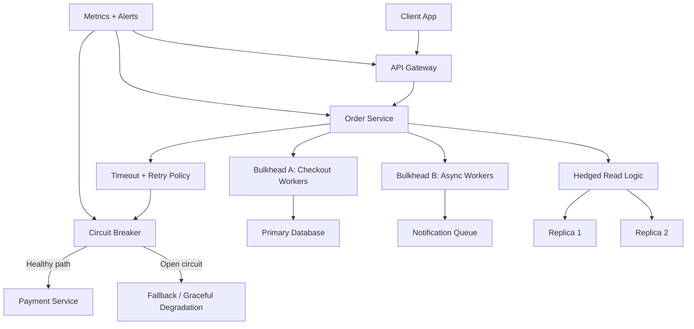

# Fault Tolerance Patterns

> Fault tolerance patterns are the safety mechanisms that keep one slow dependency, one overloaded shard, or one partial outage from becoming a full-system failure.

---

## The Problem

Imagine you run a food-delivery platform during a big cricket final. Orders usually arrive at about `2,500 requests per second`, and the checkout path calls five things in sequence: user profile, inventory, pricing, payments, and notifications. On a normal evening, the whole path finishes in about `180ms`, and nobody thinks much about the fact that the order service depends on half the company.

Then the payments provider starts timing out. Not failing fast, just hanging for `8 to 12 seconds` per request. Your order service threads pile up waiting on sockets. The connection pool to the payment client fills. Upstream requests from the API gateway keep arriving because the service still looks alive at the process level. CPU stays moderate, which fools the dashboards for a while, but latency explodes. p99 moves from `250ms` to `15 seconds`. Mobile clients retry. The gateway retries too. Suddenly a dependency issue that started in one provider becomes a self-inflicted traffic multiplier inside your own system.

Now the failure spreads sideways. Because the order service is stuck on payment calls, it stops draining requests to inventory. Inventory workers start timing out too. Notification jobs fall behind. Some users see duplicate orders because retries are not idempotent. Others see empty restaurant menus because the fallback path was never designed. The support team says "the whole site is down," but the ugly truth is that the whole site is down because one piece was allowed to fail in the most contagious way possible.

This is the real problem fault tolerance patterns solve. They do not prevent dependencies from failing. Networks will partition, databases will stall, caches will disappear, and third-party APIs will rate-limit you at the worst moment. What these patterns do is contain the blast radius. They decide how long to wait, when to stop retrying, which work to isolate, which features to degrade, and how to fail in a way that protects the rest of the system. Without them, partial failures are rarely partial for long.

---

## Core Concept Explained

Think of fault tolerance like fire doors in a building. The doors do not stop fires from starting. Their job is to keep one room's problem from filling the whole building with smoke before people can react. In distributed systems, retries, circuit breakers, bulkheads, timeouts, and graceful degradation are those fire doors. They are not about perfection. They are about containing damage long enough for the system and the operators to recover.

The first pattern almost every healthy system needs is the **timeout**. A timeout is an explicit statement that a dependency gets a limited budget to respond. If an internal inventory call normally finishes in `20ms` and p99 is `80ms`, setting a `5 second` timeout is not caution. It is negligence. That timeout guarantees threads and sockets stay occupied long after the request has stopped being useful to the user. Good systems budget time across the whole request path. If the end-to-end SLO is `300ms`, maybe the gateway gets `30ms`, the main service `150ms`, and downstream calls `40ms` to `60ms` each. The timeout is the first line of blast-radius control because it stops slow failure from becoming resource exhaustion.

The next pattern is **retry with backoff and jitter**. Retries are reasonable because many failures are transient: a packet drop, a brief leader election, a hot thread pool that recovers milliseconds later. But the difference between a helpful retry and an outage amplifier is policy. Retrying immediately three times just triples load exactly when the dependency is least able to handle it. Exponential backoff spaces the attempts out. Jitter randomizes them so thousands of clients do not retry in lockstep. For example, instead of retrying at `100ms`, `200ms`, and `400ms` exactly, a service might retry with full jitter anywhere from `0-100ms`, then `0-200ms`, then `0-400ms`. That spreads pressure across time rather than creating synchronized spikes.

Then comes the **circuit breaker**. A circuit breaker watches the outcome of calls to a dependency and changes behavior when failure crosses a threshold. In the closed state, traffic flows normally. If the dependency starts timing out or returning too many `5xx` responses, the breaker opens. Once open, calls fail fast immediately instead of waiting on the dead dependency. After a cooldown, the breaker moves to half-open and allows a small number of test requests through. If those succeed, it closes. If they fail, it opens again. The circuit breaker matters because it protects the caller from wasting all of its threads, connections, and latency budget on a dependency that is already unhealthy.

**Bulkheads** isolate resources so one bad class of work cannot starve everything else. The name comes from ships: you want compartments so one hole does not sink the whole vessel. In software, this often means separate thread pools, connection pools, queues, or even whole cell-based service deployments. Suppose your order service sends both payment requests and restaurant metadata reads through the same executor. If payment stalls, metadata stalls too, even though the restaurant service is healthy. Split them into separate bulkheads, and the payment incident becomes a degraded checkout path instead of a total UI outage.

**Graceful degradation** is what happens after you decide not everything is worth failing for. If recommendations time out, show popular items instead. If live driver location is stale, show the last known location with a "refreshing" badge. Graceful degradation is senior engineering in one sentence: preserve the core value of the system, even if the nice-to-have pieces temporarily disappear.

Two more subtle patterns matter a lot at scale. **Hedged requests** send a duplicate request to another replica when a call is taking unusually long, usually after a short delay like the p95 latency threshold. This reduces long-tail latency for read-heavy systems where occasional stragglers dominate p99. Google famously discussed this in "The Tail at Scale." The tradeoff is extra load, so it is only safe when used carefully against idempotent and overprovisioned read paths. **Fallback behavior** is related but distinct. A fallback can return cached data, a default value, a stale-but-safe response, or a queued acknowledgment like "we accepted your request and will finish later." The key is that fallback is an intentionally designed degraded answer, not an exception stack trace pretending to be resilience.

All of these patterns are shaped by **failure domains**. If every service in one availability zone shares the same cache cluster, load balancer, and database primary, then the failure domain is larger than your service boundary. Great fault tolerance is often about drawing smaller failure domains: one zone should fail without taking another, one tenant should not starve another, one queue backlog should not freeze the whole control plane. Patterns like retries and circuit breakers are local tactics. Failure-domain design is the macro strategy that decides how much damage one incident is allowed to do.

The important thing to internalize is that fault tolerance patterns are not independent checkboxes. Timeouts without retries can be too brittle. Retries without circuit breakers are dangerous. Circuit breakers without observability become mysterious traffic drops. Graceful degradation without product alignment confuses users. Bulkheads without load shedding can still fill every compartment. The goal is not to "add resilience patterns." The goal is to decide exactly how the system behaves under stress and make that behavior boring, bounded, and intentional.

---

## Architecture Diagram

### Mermaid Diagram

### Diagram Walkthrough

Starting from the top left, the client app sends a request to the API gateway. The gateway is the public entry point, and one of its jobs is to protect the rest of the system with request deadlines, authentication, and often basic rate limiting. It then forwards the request to the order service, which is where the main business logic for placing an order lives.

Inside the order service, the first important component is the timeout and retry policy. That box represents the rule set governing outbound dependency calls. When the order service needs to talk to the payment service, it does not wait forever. It gives the call a bounded time budget and, if the failure looks transient, it may retry with exponential backoff and jitter. This is deliberate: the service is trying to rescue brief network noise without creating synchronized retry storms.

The next box is the circuit breaker. The timeout and retry policy feeds into it because the breaker needs to observe whether calls are succeeding, timing out, or failing fast. If the payment service is healthy, the breaker stays closed and traffic flows through the healthy path to the payment service. That is the normal request flow. A user places an order, the order service validates inventory and price, the payment call succeeds, and the order commits normally.

Now look at the failure flow. If payment starts timing out or returning too many errors, the breaker opens. Once it opens, calls stop waiting on payment and immediately move to the fallback path. That fallback might mean returning a temporary "payment processing delayed" state, offering cash-on-delivery only, or queueing the order for later retry depending on the product rules. The key idea is that the service no longer burns its entire request budget on a dependency that is already unhealthy.

Below that, the order service splits work into two bulkheads. Bulkhead A handles synchronous checkout workers that must finish before the user sees success. Bulkhead B handles asynchronous workers pushing notifications into the queue. This matters because if notifications fall behind or the queue slows down, those resources do not consume the worker pool needed for actual checkout. One noisy workload is boxed away from another.

On the lower right, the hedged read logic fans out to Replica 1 and Replica 2. This is a separate scenario from payment. Suppose the order service needs a restaurant availability read and one replica becomes a straggler. The service can send a second read to another replica after a short threshold and use whichever response returns first. That reduces tail latency, but because it costs extra traffic it should only be used where the read path is safe and idempotent.

Finally, the metrics and alerts component watches the gateway, service, and circuit breaker. Without this visibility, operators would just see "some requests failed." With it, they can tell whether failures came from timeout saturation, an open breaker, queue lag, or replica stragglers. The diagram as a whole shows two fundamental flows: the healthy path where dependencies respond normally, and the degraded path where the service protects itself, isolates work, and still returns something useful instead of collapsing.

---

## How It Works Under the Hood

Under the hood, most of these patterns are just resource-control and decision algorithms wrapped around ordinary RPC or database calls. A timeout usually becomes a deadline attached to a request context, plus cancellation of the socket or in-flight future if the deadline expires. That cancellation detail matters. If your application gives up but the downstream call keeps consuming a connection for another 10 seconds, you did not actually reclaim the resource that was hurting you.

Exponential backoff is simple math with surprisingly deep operational consequences. A common formula is `base * 2^attempt`, capped at a maximum like `1 second` or `5 seconds`. Jitter randomizes the actual delay. Full jitter, popularized in Amazon's Builders Library, selects a random value between `0` and the exponential cap. That is often better than a fixed deterministic backoff because it prevents a thundering herd of synchronized retries. For example, if `10,000` clients all retry at exactly `200ms`, you get a new spike at `200ms`. If they retry randomly across `0-200ms`, the dependency sees a spread-out recovery curve instead.

Circuit breakers are usually sliding-window counters or rolling percentage evaluators. They track recent call outcomes over a time window or request count window such as the last `20 seconds` or last `100 requests`. If error rate rises above a threshold like `50%`, or if consecutive timeouts cross a limit, the breaker opens. In half-open mode, only a small number of requests are allowed through. That probe behavior prevents the dependency from being flooded during recovery. Good implementations also separate failure categories. A circuit breaker should not open because of client-side validation errors or expected `404` responses. It should react to signals that indicate the dependency is unhealthy or unreachable.

Bulkheads work by physically separating concurrency limits. That can be separate thread pools, distinct async semaphores, different database connection pools, or even separate Kubernetes deployments and autoscaling groups. Imagine one service with `200` worker threads. If image thumbnail generation and payment authorization share all 200, then a thumbnail storm can starve payments. Split them into `40` thumbnail workers and `160` payment workers, and the thumbnail backlog stops crossing that boundary. Cell-based architectures extend this idea further by isolating whole slices of the system, such as a region, tenant segment, or business unit, so overload stays local.

Hedged requests are timing algorithms. The first request goes out as normal. If it exceeds a delay threshold such as the `95th percentile` of historical latency, a duplicate goes to another replica. The client takes the first successful response and cancels the slower one. This reduces p99 dramatically in read-dominated systems with occasional stragglers, but it can easily backfire if used on write paths or already-saturated dependencies. A service doing hedged reads at `20,000 QPS` with a `5%` hedge rate is generating an extra `1,000 QPS` by design. That is acceptable only when the replicas can safely absorb it.

Graceful degradation and fallback paths also have concrete storage and state implications. Serving a stale menu from Redis is only safe if you know how stale is acceptable and how to label it. Returning a synthetic "we are processing your request" response is only safe if there is durable async machinery behind it, like a queue with at-least-once delivery and idempotent workers. Otherwise fallback becomes a lie. This is why resilience work often touches product semantics, not just platform code.

One nasty edge case is retry multiplication across layers. Suppose the client retries twice, the gateway retries twice, and the service retries twice. One failing dependency call can become `3 x 3 x 3 = 27` attempts before anyone notices. This is how partial outages turn into full overload. Mature systems centralize retry ownership or at least define which layer is allowed to retry which class of operation. Another edge case is timeout inversion: a service timeout longer than the caller's timeout. Then the caller gives up first, but the server keeps burning resources on work whose result nobody will read.

Finally, fault tolerance depends heavily on feedback loops. If you do not observe breaker state, queue depth, pool saturation, and fallback rate, you cannot tell whether the system is resilient or quietly shedding important business functions. The patterns are operational algorithms, not decorative middleware. They need thresholds, capacity budgets, and tuning based on real latency distributions rather than optimistic guesses.

---

## Key Tradeoffs & Limitations

These patterns make systems safer, but they are not free. Timeouts that are too short create false failures. Retries increase total request volume. Circuit breakers can protect a dependency and still reduce your own success rate if they open too aggressively. Bulkheads improve isolation but lower peak efficiency because idle capacity in one compartment cannot always help another. Choose them when you care more about bounded failure than perfect average utilization.

The clearest "choose X when, choose Y when" tradeoff is around retries and fallbacks. Choose retries when failures are likely transient and the operation is idempotent or otherwise safe to repeat. Choose fallback or fail-fast when the dependency is clearly overloaded or when repeating the action could double-charge a card or create duplicate work. If your payment provider is returning `429` with rate-limit headers, a smarter strategy is often to stop and degrade rather than keep hammering.

Circuit breakers are great when one dependency failure could otherwise exhaust the caller's resources. They are less useful when failures are rare, fast, and cheap to handle. In a small internal service doing `50 RPS` with a healthy database and no long-tail issues, a complex breaker library may add more moving parts than value. Similarly, hedged requests are worth considering for high-volume read paths with painful tail latency, but they are a bad idea for write-heavy systems or expensive machine-learning inference calls where duplicates are costly.

Graceful degradation also has a business tradeoff. Sometimes showing stale data is better than showing nothing. Sometimes it is dangerous. A slightly stale restaurant menu may be acceptable for 30 seconds. A stale bank balance or stale inventory count during flash sales may be unacceptable. The engineering question is never just "can we degrade?" It is "what degraded behavior is still honest and safe for this product?"

Most importantly, fault tolerance patterns do not solve capacity planning or correctness by themselves. A circuit breaker will not create inventory that does not exist. A retry policy will not fix a permanently broken downstream schema. If your service has fewer than `10,000` DAU, one SQL database, and one well-behaved internal API dependency, you may not need the full pattern catalog.

---

## Common Misconceptions

**Many people believe retries always improve reliability.** In reality, retries improve reliability only when the failure is transient and the repeated operation is safe. Retries against an overloaded dependency often multiply load and make recovery slower. The misconception exists because retries work beautifully in happy-path demos and quietly cause pain only during real incidents.

**A common belief is that circuit breakers prevent outages.** They do not prevent the dependency from failing. What they do is prevent one dependency failure from consuming all the caller's threads, connections, and latency budget. The misconception exists because the phrase "circuit breaker" sounds like a magic shield, when it is really a containment mechanism.

**Many teams assume graceful degradation means "return anything instead of failing."** That is dangerous. A degraded response must still be truthful and safe. Serving stale recommendations is fine; serving stale payment status or pretending an order succeeded when it only got queued is not. The misconception exists because fallback code often gets written under pressure and judged only by uptime, not by correctness.

**People often think bulkheads are just a fancy infrastructure pattern for big tech.** In practice, even small systems use bulkheads every time they separate worker pools, queues, or connection limits. The correct understanding is that bulkheads are simply resource isolation. The misconception survives because the nautical metaphor makes the idea sound more exotic than it is.

**Some engineers believe hedged requests are a universal latency fix.** They are not. Hedging reduces long-tail latency by intentionally creating duplicate work, which is safe only on specific read paths with spare capacity. The misconception exists because the performance improvement in case studies is impressive, while the hidden cost in extra traffic is easy to miss.

---

## Real-World Usage

**Amazon and the Builders Library** have written extensively about retries, timeouts, and jitter because they learned the hard way that retries without randomness can synchronize into retry storms. Their guidance is very concrete: use timeouts everywhere, back off exponentially, and add jitter so large client populations do not all retry at the same moment. This is not theoretical polish. At Amazon scale, even a tiny percentage of synchronized retries can translate into massive burst traffic against recovering systems.

**Netflix and Hystrix-era resilience engineering** made circuit breakers, bulkheads, and fallback behavior famous in microservice architectures. Hystrix wrapped remote calls with thread-pool isolation, rolling error-rate detection, circuit breaking, and fallback logic. The deeper lesson from Netflix is not that every team should copy Hystrix today. It is that once a service depends on many other services, protecting call chains from cascading failure becomes a first-class architectural requirement, not optional polish.

**Google's "The Tail at Scale" work** is the classic real-world example for hedged requests and long-tail latency reduction. Google showed that at massive fan-out, even rare stragglers dominate user-visible latency because one slow shard can hold the whole request hostage. Carefully sending a duplicate read to another replica after a short delay reduced tail latency significantly. The important nuance is that Google applied this where operations were safe to duplicate and where the fleet had enough headroom to absorb the extra work.

---

## Interview Angle

**Q: How would you design retries for a dependency that times out intermittently?**
**How to approach it:**
- Start by asking whether the operation is idempotent or otherwise safe to repeat.
- Discuss bounded retries, exponential backoff, and jitter instead of immediate loops.
- Mention ownership: decide which layer is allowed to retry so the system does not multiply attempts across client, gateway, and service.
- Strong answers connect retry policy to timeout budgets and dependency capacity.

**Q: When should a circuit breaker open, and what should happen after that?**
**How to approach it:**
- Explain that the breaker should respond to meaningful failure signals like timeouts and high `5xx` rates, not every error.
- Walk through the closed, open, and half-open states.
- Mention fail-fast behavior plus a degraded path such as fallback, queueing, or temporary feature disablement.
- A strong answer includes observability so operators can see breaker state instead of guessing.

**Q: How do bulkheads help during partial failure?**
**How to approach it:**
- Define bulkheads as resource isolation: separate worker pools, queues, connection pools, or service cells.
- Give a concrete example where one noisy feature would otherwise starve a critical one.
- Discuss the tradeoff that isolated capacity can sit idle while another compartment is under pressure.
- Show that the goal is bounded blast radius, not perfect hardware efficiency.

**Q: When can fault tolerance patterns backfire?**
**How to approach it:**
- Talk about retry storms, false-positive breaker trips, stale fallbacks, and hedged requests creating excess load.
- Explain that resilience patterns need tuning based on latency distributions and product correctness, not just copied defaults.
- Mention that badly designed degradation can preserve uptime while damaging user trust.
- Strong answers show judgment that resilience and correctness must be balanced together.

---

## Connections to Other Concepts

**Concept 14 - Message Queues & Stream Processing** connects directly because queues are one of the safest fallback tools in fault tolerance. When a synchronous path is unhealthy, teams often move non-critical work like notifications or reconciliation into async processing rather than blocking the user-facing request.

**Concept 16 - Real-time Communication** stresses fault tolerance patterns differently from plain request-response systems. Long-lived WebSocket connections make draining, bulkheads, and graceful degradation harder because failure can affect thousands of sessions at once instead of one short request at a time.

**Concept 17 - CAP Theorem & PACELC** provides the tradeoff language behind many resilience decisions. Choosing to fail fast, serve stale data, or wait for a slower but more consistent dependency is often really a consistency-versus-latency decision under normal operation or partition.

**Concept 20 - Idempotency, Deduplication & Exactly-Once Semantics** is a crucial companion because retries are only safe when repeating the operation does not create double side effects. Fault tolerance patterns and idempotency are tightly coupled in payment systems, order creation, and any workflow that spans multiple services.

**Concept 21 - Monitoring, Observability & SLOs/SLAs** is what makes these patterns operable. You cannot tune a circuit breaker, hedge threshold, or fallback policy responsibly unless you can see timeout rates, dependency saturation, open-circuit events, and user-impact metrics in production.
