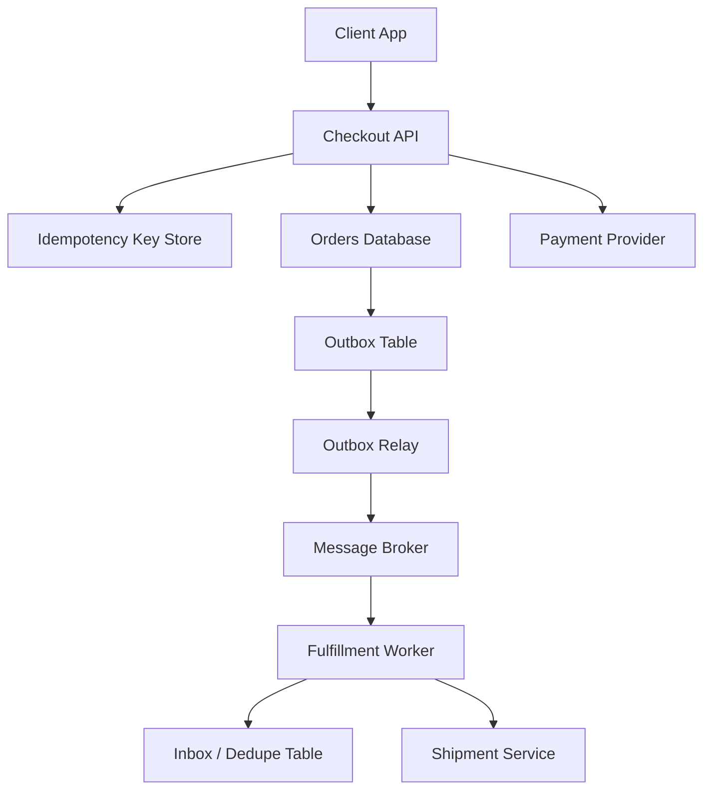

# Idempotency, Deduplication & Exactly-Once Semantics

> This concept is about making retries safe, preventing duplicate work, and being honest about what "exactly once" really means in distributed systems.

---

## The Problem

Imagine you run a payments API for an e-commerce checkout service. A customer clicks "Pay Now" for a $249 order. Your API receives the request, talks to the payment provider, writes the order row, publishes an event for fulfillment, and then tries to return `200 OK` to the client.

But the network between your API and the mobile app hiccups at the worst possible moment. The payment actually succeeds. The order row is written. The event is queued. The client never sees the response because the TCP connection dies after 2.5 seconds.

What does the client do next? It retries. That is the correct behavior from the client's point of view. The user still wants to buy the item, and as far as the app knows the first request may have failed completely.

Now your system has a dangerous ambiguity. Was the first request never processed, partially processed, or fully completed? If the retry creates a second payment authorization, you double-charge the user. If it creates a second order row, fulfillment may ship two boxes. If the email worker sees the same event twice, the user receives two confirmation emails. If your inventory service decrements stock twice on a single SKU with only one item left, you have just manufactured an oversell bug from a network timeout.

This is not a rare corner case. Retries happen everywhere: mobile clients retry on bad cellular links, API gateways retry on upstream resets, workers retry after timeouts, webhooks are redelivered by providers like Stripe and Shopify, and queue consumers get at-least-once delivery by design. A modern distributed system without explicit duplicate handling is effectively betting that networks, processes, and clients will behave perfectly. They do not.

This is why idempotency, deduplication, and exactly-once semantics matter. They are the tools that let you say, "If the same intent shows up twice, do not do the destructive thing twice." But they are also frequently misunderstood. Idempotency at the HTTP layer is not the same as deduplication in a message queue. Kafka's exactly-once semantics does not mean your whole business workflow is magically duplicate-proof. These concepts solve real problems, but only if you are precise about what is being deduplicated, where the boundary lives, and how long the guarantee lasts.

---

## Core Concept Explained

Think of idempotency like a coat-check ticket. You hand over your coat, the attendant gives you ticket `A123`, and later you come back waving that same ticket. Whether you ask once or five times, the system should map that ticket to the same coat, not hand you five different coats or charge you five times. The repeated request represents the same intent, so the effect should be the same.

In system design, **idempotency** means that repeating the same operation should not change the outcome after the first successful application. If `charge customer X for order Y` is idempotent, then retrying that exact intent does not create extra charges. The response may be replayed, the same resource may be returned, or the system may say "already done," but the side effect does not happen again.

That sounds simple until you ask what "the same operation" means. In practice, systems define sameness with an **idempotency key**. A client generates a unique key such as `pay_order_8472_attempt_1`, or more commonly a UUID, and sends it along with the request. The server stores that key with the result of the first completed request. If the same key shows up again, the server does not execute the side effect again. It returns the saved result or the saved resource reference.

There are several patterns here.

**Idempotent create with stored response**: The server persists the key, request fingerprint, status, and response body. On the first request, it performs the work, stores the output, and returns it. On retries, it returns the stored response. Stripe popularized this pattern for payment APIs because it makes timeout recovery much safer for clients.

**Idempotent create with unique business key**: Sometimes the natural business identifier is the dedupe key. An order number, transfer ID, or external event ID can be declared unique in the database. If the same create arrives again, the system reads the existing row instead of inserting a new one. This is often simpler and stronger than using a separate cache for dedupe.

**Idempotent update**: Some operations are naturally idempotent if they set state to a specific value rather than incrementing it. `set status = shipped` is idempotent. `increment stock_sold by 1` is not. This is why API shape matters. A `PUT` that declares the target state is often easier to reason about than a `POST` that expresses "do the action again."

Now compare that with **deduplication**. Deduplication is broader and often weaker. It means detecting repeated messages or requests and suppressing duplicates within some window or scope. Queue systems commonly support dedupe windows. AWS SQS FIFO, for example, lets you suppress duplicate messages with the same deduplication ID for a 5-minute window. That is useful, but it is not the same as a permanent business guarantee. If the same duplicate arrives 20 minutes later, the queue's native dedupe window may no longer help.

This leads to a useful distinction:

- Idempotency is usually about **safe re-execution of the same intent**.
- Deduplication is usually about **spotting repeated delivery of the same payload or message ID**.
- Exactly-once semantics is usually about **making one specific processing boundary appear duplicate-free**, not about the entire business system.

That last part is where most confusion lives. In production, most distributed systems are built on top of **at-least-once delivery** because it is safer than at-most-once delivery. At-most-once means a message can be lost and never retried. At-least-once means duplicates are possible, but loss is less likely. The normal production answer is therefore not "eliminate duplicates from physics." It is "accept at-least-once delivery and make handlers idempotent."

For APIs, that often means idempotency keys plus a durable store. For asynchronous workflows, it usually means some combination of:

- an **outbox pattern** on the producer side, so events are written transactionally with local state changes,
- an **inbox or dedupe table** on the consumer side, so repeated messages are recognized,
- and **idempotent business logic** that can safely say "I already processed event `E123` for order `8472`."

The outbox pattern matters because services often have two side effects: update local database state and publish a message. If you write the database row and crash before publishing the event, downstream systems never hear about it. If you publish the event and crash before committing the database write, downstream systems react to a fact that never became true. The outbox fixes this by writing the event into the same database transaction as the local business row. A relay process later publishes the outbox rows to Kafka, RabbitMQ, or another broker. That turns a dual-write race into a single local transaction plus eventual publication.

On the consumer side, the inbox pattern records processed message IDs in durable storage. When a message is received, the consumer first checks whether the message ID was already handled. If yes, it skips the side effect. If not, it performs the work and records the message ID. In SQL systems, this is often implemented with a table keyed by `(consumer_name, message_id)` and a unique constraint. A second delivery then becomes a no-op instead of a second shipment or second email.

Payment and order systems are where this becomes concrete. Suppose a checkout service receives a charge request with idempotency key `c7f8...`. It inserts a row into `idempotency_keys`, calls the payment provider, writes the order, and stores the response. If the client retries after a timeout, the service sees the same key and returns the original result. Later, an `order_created` event is delivered twice to the fulfillment worker. The worker checks its inbox table, sees that event `evt-9921` was already handled, and skips the second shipment. Nothing about the transport became magically duplicate-free. The application simply got good at recognizing repeated intent.

That is the real mental model. Exactly-once behavior in user-facing workflows usually comes from carefully composed pieces: durable keys, transactional boundaries, replay-safe handlers, and storage-enforced uniqueness. The system still lives on unreliable networks and crash-prone machines. It just no longer lets those realities leak into duplicate business side effects as often.

---

## Architecture Diagram

### Mermaid Diagram

### Diagram Walkthrough

Starting at the top left, the client app sends a checkout request to the Checkout API. That request includes an idempotency key generated by the client or the caller's SDK. The API does not immediately charge the card and hope for the best. It first talks to the Idempotency Key Store, which is a durable table or key-value store that remembers whether this exact logical request has already been processed.

In the first request flow, the key is new. The API reserves or inserts the idempotency key, then proceeds with the real business work. It calls the Payment Provider to authorize or capture the payment. It also writes the order into the Orders Database. Crucially, the order write is paired with an Outbox Table entry. That means the local state change and the future event publication are captured together inside one database transaction rather than being treated as two unrelated writes.

After the order and outbox row are committed, the API can store the final result associated with the idempotency key. If the client receives the response, great. If the client times out and retries with the same key, the API checks the key store again, sees that the request already completed, and returns the saved response instead of creating a second order or second charge. That is the first duplicate-defense boundary.

Now look at the asynchronous side. The Outbox Relay reads committed rows from the outbox table and publishes them to the Message Broker. This separates business transactions from broker availability. If Kafka or RabbitMQ is temporarily slow, the order row is still safely committed locally and the relay can retry publication later.

The second request flow happens on the consumer side. The Fulfillment Worker receives an `order_created` message from the broker. Before it calls the Shipment Service, it checks the Inbox or Dedupe Table. If message `evt-9921` has never been processed by this worker, the worker records it and proceeds to create the shipment. If the broker redelivers the message because of a timeout, consumer restart, or offset replay, the worker sees the message ID in the inbox table and skips the second shipment.

Every component in the diagram exists to protect a boundary where duplicates can appear. The idempotency key store protects the synchronous API boundary. The outbox protects the producer's transaction-versus-publish boundary. The inbox protects the consumer's delivery boundary. The system still uses retries, still allows at-least-once delivery, and still tolerates crashes, but it keeps those mechanics from multiplying business side effects.

---

## How It Works Under the Hood

The boring implementation detail that makes idempotency work is usually a durable row with a unique key. A typical SQL schema stores `idempotency_key`, a hash of the canonicalized request body, a status like `in_progress` or `completed`, a response payload or resource ID, and timestamps. The unique index is the real guardrail. Two concurrent requests with the same key should not both decide they are first.

There are a few subtleties here.

First, **the key alone is not enough**. Good systems also store a request fingerprint. If a client accidentally reuses the same idempotency key with a different payload, the server should reject it with something like `409 Conflict` rather than silently reusing the previous result. Otherwise one key becomes an accidental alias for unrelated operations.

Second, **in-progress state matters**. Suppose request A inserts the key and starts work. Before it finishes, the client retries. What should the retry see? Many APIs return the final cached response only once status becomes `completed`. During `in_progress`, they may return `409`, `425`, or a retriable status saying the original request is still being processed. This avoids a race where two workers both perform the side effect because neither can tell whether the other has finished.

Third, **retention policy is part of correctness**. Keeping every idempotency key forever can be expensive. If you process 50 million API operations per day and each key record averages 300 bytes including indexes, that is roughly 15 GB of raw storage per day before replication and overhead. Most systems therefore keep keys for a defined period such as 24 hours, 48 hours, or 7 days, depending on client retry behavior and business risk. That is why idempotency guarantees are often time-bounded.

Deduplication windows work similarly in messaging systems. SQS FIFO offers a 5-minute dedupe window. Kafka consumers often implement their own inbox table with whatever retention they need. The choice is economic as well as technical. A 24-hour dedupe window for billions of events may need partitioned storage, TTL cleanup jobs, and careful indexing. Short windows are cheaper but allow rare late duplicates through.

The outbox pattern is usually implemented with one SQL transaction:

1. insert or update business rows,
2. insert an outbox row with event ID and payload,
3. commit once.

A separate relay process then polls or streams the outbox table and publishes messages. Some teams mark rows as sent after broker acknowledgement. Others use monotonic sequence IDs and idempotent producer features. The important point is that the database commit is the source of truth, not the moment the broker accepts the message.

The inbox pattern mirrors this on the consumer side. A common technique is:

1. begin transaction,
2. insert `(consumer_id, message_id)` into inbox table,
3. if insert fails because of unique constraint, rollback and skip,
4. perform side effect and local state change,
5. commit.

That design works because the dedupe record and the side effect's local state change share one transaction. If the consumer crashes before commit, both are lost and the message can be retried safely. If commit succeeds, the dedupe record exists and the next delivery becomes a no-op.

This is also where "exactly once" marketing needs translation. Kafka's exactly-once semantics can guarantee that within Kafka Streams or between an idempotent producer and transactional consumer pipeline, a record is not duplicated in certain broker-visible ways. That is valuable. But if your application consumes a message, calls an external payment gateway, and then crashes before writing its local transaction marker, the external side effect may already have happened. The broker cannot undo that. End-to-end exactly once across arbitrary databases and third-party APIs is usually not a property you buy from middleware. It is something you approximate with idempotent endpoints, transactional logs, and reconciliation.

Finally, transactional boundaries define what can actually be made atomic. A single Postgres transaction can atomically update your order row and outbox row. It cannot atomically update Postgres, Kafka, and a third-party payment processor unless you introduce a distributed transaction protocol, which most internet systems avoid because of latency and operational cost. That is why sagas, compensating actions, and reconciliation jobs exist. They are not proof of failure. They are proof that systems cross boundaries where true atomicity ends.

---

## Key Tradeoffs & Limitations

**Choose idempotency keys when a client may retry a side-effecting request and duplicate execution would be expensive.** Payments, order creation, account provisioning, and webhook handlers are the classic examples. If the cost of a duplicate is a double charge or duplicate shipment, the storage and implementation overhead are absolutely worth it.

**Choose lightweight deduplication when the goal is reducing duplicate processing, not creating a forever guarantee.** Queue-level dedupe windows and cache-based message-ID suppression can be enough for notifications, metrics ingestion, or low-value repeated work. They are cheaper than durable per-event tables, but they are also weaker.

**Do not confuse exactly-once semantics with global magic.** Exactly-once is usually scoped to one pipeline or storage boundary. If your workflow crosses an API gateway, a SQL database, Kafka, and a third-party email or payment system, there is no free universal guarantee. You still need idempotent external calls, consumer inbox tables, or compensating actions.

The cost side is real. Idempotency stores grow quickly, inbox tables need cleanup, and unique constraints on hot keys can create contention. If your system handles 100,000 writes per second, a poorly designed dedupe table can become its own bottleneck. This is why partitioning by time, tenant, or hash and aggressively expiring old records often becomes necessary.

There is also a product tradeoff. If you keep keys for only 24 hours, a duplicate arriving three days later may slip through unless you also use a stable business identifier like `order_id` or `payment_intent_id`. If you keep keys forever, storage and index cost grow indefinitely. Choose short-lived key stores when retries are near-term. Choose durable business uniqueness when the business domain itself requires permanent de-duplication.

If your application has a few hundred operations per day and duplicate side effects are cheap to reverse, a full inbox/outbox/idempotency-stack may be overkill. But once retries are normal and side effects are costly, boring duplicate control is not optional. It is part of correctness.

---

## Common Misconceptions

**"Idempotent means the request runs only once."** It does not. The request may run multiple times or be delivered multiple times. Idempotency means repeated execution produces the same final effect after the first successful application. This misconception exists because "no duplicates in outcome" sounds similar to "no duplicates in execution," but they are not the same thing.

**"If I use Kafka exactly-once semantics, my whole workflow is exactly once."** Kafka can make strong guarantees within Kafka-managed transactional boundaries, but it cannot make your payment gateway, email provider, or database side effects universally atomic. The correct understanding is that broker-level guarantees are local tools, not end-to-end business guarantees. The misconception exists because product names compress a narrow guarantee into a broad-sounding phrase.

**"A UUID in the request body is enough for idempotency."** Not unless the server actually stores and enforces it. A random key that is never checked is just decorative entropy. Real idempotency requires a durable uniqueness boundary plus behavior for repeats and payload mismatches. This misconception exists because generating keys is easy while implementing the storage and replay logic is the hard part.

**"Deduplication windows solve duplicates permanently."** They only solve duplicates that arrive inside the chosen window. Late retries, replayed events from recovery, or cross-system duplication outside that window can still happen. The correct understanding is that windowed dedupe is a probabilistic or bounded guarantee. It feels stronger than it is because most retries happen quickly in healthy systems.

**"POST can never be idempotent."** HTTP method semantics do not prevent you from making a `POST /payments` safe to retry with an idempotency key. The method is not the whole design. The storage behavior, uniqueness constraints, and replay logic matter more. The misconception exists because people memorize REST trivia and mistake it for system behavior.

---

## Real-World Usage

**Stripe payments** are the textbook example. Stripe lets clients send an idempotency key with create-style API calls so that retries caused by timeouts or network failures do not create duplicate charges or duplicate payment intents. The important implementation detail is not just the key itself but the fact that Stripe stores the result and replays it for the same key, which makes client retry logic safe under ugly network conditions.

**Shopify webhook processing** is a strong deduplication example. Commerce platforms redeliver webhooks because delivery failures are normal, and Shopify includes stable event identifiers that receivers are expected to use for dedupe. A robust consumer stores those webhook IDs durably so that inventory updates, fulfillment steps, or email side effects are not applied twice when Shopify retries the same event.

**Kafka Streams and transactional producers** are the best-known "exactly-once" example inside a streaming platform. Kafka can coordinate producer idempotence, transactional writes, and offset commits so that stream-processing topologies avoid duplicate output within Kafka-managed boundaries. The key lesson is that this is real and useful, but still scoped. Once the workflow leaves Kafka and talks to external systems, the application must reintroduce idempotency and dedupe at those edges.

**AWS SQS FIFO queues** are a good practical example of bounded deduplication. They allow a deduplication ID and preserve ordering within a message group, which is attractive for workflows like payment status changes or order-step processing. But the built-in dedupe lasts only for a limited time window, which is exactly why engineers still add application-level idempotency when the business effect is expensive.

---

## Interview Angle

**Q: How would you prevent duplicate charges if the client retries after a timeout?**
**How to approach it:**
- Start with the ambiguity problem: the first request may have succeeded even though the client never saw the response.
- Introduce an idempotency key plus a durable store keyed by that value.
- Explain response replay, payload fingerprint checks, and how concurrent duplicate requests are handled.
- Strong answers mention that the payment provider itself may also need an idempotent reference.

**Q: What is the difference between idempotency and deduplication?**
**How to approach it:**
- Define idempotency as safe repetition of the same intent and deduplication as suppression of repeated deliveries.
- Mention that dedupe is often windowed or best-effort while idempotency is usually tied to business correctness.
- Use a concrete contrast like API request retries versus broker duplicate deliveries.
- A strong answer avoids treating the terms as interchangeable.

**Q: Why is exactly-once semantics so hard in distributed systems?**
**How to approach it:**
- Point out that networks, brokers, clients, and external systems can all retry or crash independently.
- Explain that you can get strong guarantees inside one transactional boundary, but not across arbitrary systems for free.
- Mention outbox/inbox patterns, idempotent handlers, and compensating actions as the practical answer.
- Strong answers are honest about boundaries instead of promising magic.

**Q: How would you design a consumer for at-least-once delivery?**
**How to approach it:**
- Start with the assumption that duplicate delivery is normal.
- Describe an inbox or dedupe table with a unique constraint on message ID.
- Explain how the side effect and dedupe marker should share one local transaction when possible.
- Mention cleanup strategy and how long dedupe records need to be retained.

---

## Connections to Other Concepts

**Concept 05 - API Design Patterns** connects directly because idempotency is often exposed at the API contract level. Decisions about `POST` versus `PUT`, resource identifiers, webhook retries, and request headers shape whether clients can safely retry without duplicate side effects.

**Concept 14 - Message Queues & Stream Processing** is the natural companion topic because queues usually give you at-least-once delivery, not duplicate-free delivery. That means idempotent consumers and dedupe stores are what turn broker retries into safe business behavior.

**Concept 15 - Event-Driven Architecture & Event Sourcing** builds on the same mechanics. Once services communicate through events, duplicates, replay, and handler re-execution become normal operational realities rather than rare bugs. Idempotent event handlers are what keep event-driven systems practical.

**Concept 19 - Fault Tolerance Patterns** matters because retries are one of the main reasons duplicates exist in the first place. Timeouts, backoff, circuit breakers, and hedged requests improve resilience, but they also increase the need for duplicate-safe downstream operations.

**Concept 25 - Distributed Task Scheduling & Workflow Orchestration** ties in because schedulers and workflow engines re-run jobs after crashes, lease expiry, or uncertain completion. If task handlers are not idempotent, workflow recovery can create duplicate emails, duplicate shipments, or duplicate billing steps.
