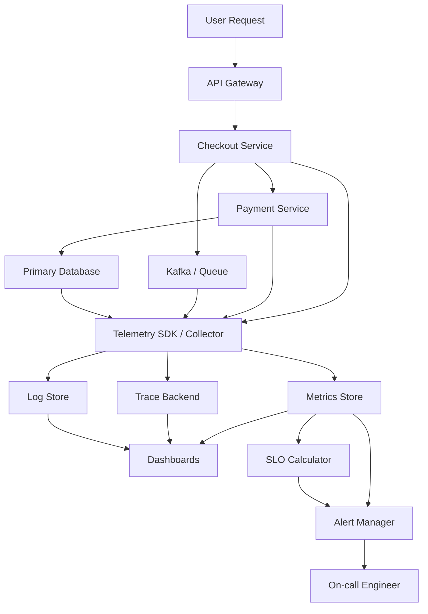

# Monitoring, Observability & SLOs/SLAs

> Monitoring and observability are the systems that tell you when production is hurting, why it is hurting, and whether your users are still getting the reliability you promised.

---

## The Problem

Imagine you run a food-delivery platform. On a normal Friday evening, the checkout API handles 8,000 requests per second, median latency stays around 120ms, and order success rate is 99.7%. Then a popular cricket match ends, millions of people open the app at once, and traffic jumps to 45,000 requests per second in less than five minutes.

At first, nothing looks obviously broken. CPU on some services is only 60%. Databases are not fully pegged. But customers start complaining that payments spin forever, restaurant menus load partially, and drivers cannot see fresh assignments. One availability zone has a noisy network issue, one Kafka consumer group is lagging, and one new release added a high-cardinality metric label that is overwhelming the time-series backend. Different teams are looking at different dashboards, and each dashboard tells only part of the story.

Without good monitoring, your team notices the incident late because no alert maps cleanly to user pain. Without observability, they waste thirty minutes debating whether the real problem is the payment gateway, the recommendations service, or the message bus. Without SLOs, nobody can answer the most important operational question: "How bad is this for users right now, and how close are we to violating the reliability target we told the business?"

This is why mature systems do not treat telemetry as a nice-to-have after the product is built. They treat it as part of the product. If a service cannot tell you its request rate, error rate, latency distribution, dependency failures, and user-facing objective status, then it is operating blind. That blindness is expensive. It turns a five-minute issue into a forty-five-minute outage, burns on-call engineers out, and creates a culture where reliability gets argued from anecdotes instead of measured from data.

---

## Core Concept Explained

Think of observability like running an intensive care unit. A nurse is not making decisions from one number on one screen. They need heart rate, oxygen saturation, blood pressure, medication history, and context about what changed recently. If one metric moves, they need a way to connect that movement to the patient, the treatment, and the timeline. Production systems are the same. One chart that says "CPU is 72%" is not understanding. It is just one vital sign.

At a high level, monitoring answers, "Is something wrong, and should someone wake up?" Observability answers, "Given the telemetry we emit, can we understand why the system is behaving this way?" The two overlap, but they are not identical. Monitoring is often threshold-driven and expectation-based. Observability is investigation-oriented and asks better questions after the unexpected happens.

### Metrics, logs, and traces

The classic observability stack has three pillars.

**Metrics** are numeric aggregates measured over time. They are cheap to query and excellent for dashboards and alerts. Examples are requests per second, p95 latency, queue depth, CPU saturation, replica lag, and cache hit rate. Metrics are what you use when you want to know whether checkout latency moved from 180ms to 900ms over the last ten minutes, or whether error rate rose from 0.2% to 7%. In well-tuned systems, metrics back most alerting because they are compact and fast.

**Logs** are discrete event records. A single request might emit log lines for authentication, validation failure, SQL timeout, or a deployment version tag. Logs preserve detail that metrics intentionally throw away. They are useful when you need exact payload context, stack traces, order IDs, tenant IDs, or business events. The tradeoff is that logs are expensive to store and query at scale. A busy fleet can generate terabytes per day if logging is undisciplined.

**Traces** connect work across service boundaries. A single customer request might touch the API gateway, user profile service, fraud service, payment service, and three databases. A trace shows that entire path as one logical unit with timings for each span. Tracing becomes especially valuable once a single customer action fans out into dozens of service calls where no one service "owns" the whole latency story.

### Monitoring frameworks that actually help

Good teams do not stare at arbitrary graphs. They use frameworks that map telemetry to system behavior.

The **RED method** is popular for request-driven services: monitor Rate, Errors, and Duration. For an HTTP API, that means requests per second, error rate, and latency percentiles. If you only had three graphs for a service, these are often the right three.

The **USE method** is more infrastructure-oriented: Utilization, Saturation, and Errors. For a database, you might look at CPU utilization, connection saturation, and I/O errors. For a Kafka broker, you might track disk utilization, partition under-replication as saturation-like pressure, and broker request errors.

These frameworks matter because they stop teams from building vanity dashboards. A dashboard with 60 charts and no decision structure is not observability. It is wallpaper.

### SLI, SLO, and SLA

This is where telemetry becomes product reliability instead of just technical introspection.

An **SLI**, or Service Level Indicator, is the measured signal. For example, "the percentage of checkout requests that complete successfully in under 500ms" is an SLI. It is measurable and user-relevant.

An **SLO**, or Service Level Objective, is the target for that SLI. Example: "99.9% of checkout requests should succeed in under 500ms over a rolling 28-day window." That objective is not random. It is a reliability budget decision. If you choose 99.9%, you are allowing about 43.2 minutes of badness per 30 days. If you choose 99.99%, you are allowing about 4.32 minutes. That one extra nine is not a slogan. It is a major engineering and staffing cost difference.

An **SLA**, or Service Level Agreement, is the external promise, often with contractual or financial consequences. Many teams should have more SLO discipline than SLA ambition. Saying "we will pay credits if availability drops below 99.99%" is easy for marketing and painful for operations if the engineering system underneath cannot actually support it.

### Error budgets change behavior

The most useful SLO concept in practice is the **error budget**. If your SLO allows 0.1% bad requests in a month, that 0.1% is the budget. When the service is healthy, you are spending the budget slowly and can afford launches, migrations, or experiments. When incidents burn half the monthly budget in two days, the signal is clear: slow feature risk down and focus on reliability.

This is what good observability changes operationally. It moves reliability conversations out of opinion mode. Instead of arguing "this outage felt bad," teams can say, "we burned 35% of the monthly checkout error budget in one incident, and p99 stayed above 1.5 seconds for 18 minutes." That is actionable. That changes release policy, staffing, and roadmap priority.

---

## Architecture Diagram

### Mermaid Diagram

### Diagram Walkthrough

Starting from the top left, a user request enters through the API gateway. The gateway is the public entry point, and it usually emits the first telemetry for the request: request count, status code, latency, route name, and a trace context header. That trace context is important because it lets downstream services connect their work to the same end-to-end request.

From the gateway, traffic moves into the Checkout Service. This service might validate the cart, call the Payment Service, and publish an event to Kafka or another queue for downstream fulfillment. In the diagram, the Checkout Service touches both the Payment Service and the queue because real customer flows often involve synchronous work and asynchronous side effects. Each of those components emits telemetry through a shared SDK or collector path.

The Payment Service then talks to the primary database. That means the request path now spans at least three critical layers: application code, messaging, and storage. If the database becomes slow, the trace should show the Payment Service waiting on the database span. If Kafka consumer lag rises and downstream processing falls behind, the metrics backend should show queue depth or lag increasing even if the synchronous API path is still mostly healthy.

All of that telemetry flows into the Telemetry SDK or Collector block in the center. In practice this may be OpenTelemetry collectors, language SDKs, sidecars, or agents. Their job is to receive raw spans, logs, and metrics from the services, normalize metadata such as service name and environment, and forward the data to the right storage systems.

Below that collector are three separate destinations: a metrics store, a log store, and a trace backend. The metrics store powers fast dashboards and alerts. The log store holds detailed event records for deeper debugging. The trace backend reconstructs request journeys across services. This separation matters because each data type has different query patterns and cost characteristics.

On the right side, dashboards read from metrics, logs, and traces to give humans one place to investigate incidents. Alert Manager reads from metrics directly and from the SLO calculator. That SLO calculator takes a user-facing SLI, like successful checkouts under 500ms, and compares actual performance against the reliability target. If the SLO burn rate spikes, alerts go to the on-call engineer even if no single machine metric looks catastrophic.

There are two especially important flows here. The first is the incident-detection flow: metrics show a jump in checkout latency, Alert Manager fires, and the on-call engineer lands in a dashboard that links directly to the offending traces and logs. The second is the product-reliability flow: the SLO calculator continuously turns raw telemetry into business-facing reliability status, so teams can see not just "a service got slower" but "we are spending this month's error budget too quickly."

---

## How It Works Under the Hood

Time-series metrics systems are optimized around append-heavy writes and aggregate queries. Prometheus-style systems scrape or receive samples and store them as timestamped values keyed by metric name plus labels. That label design is powerful and dangerous. Labels like `service=checkout` or `region=ap-south-1` are useful. Labels like `user_id=1234567` or `order_id=abc-9981` create **high cardinality**, meaning millions of unique time series. That explodes memory usage, index size, and query cost. One badly chosen label can take a healthy metrics cluster and make it fall over.

Metric types matter too. **Counters** only go up and are ideal for requests, errors, and bytes sent. **Gauges** move up and down, which works for queue depth or in-flight requests. **Histograms** and **summaries** are what let you reason about latency percentiles. If you only log average latency, you can miss the fact that median stayed at 90ms while p99 blew up to 6 seconds. In practice, percentiles or histogram buckets are what make latency monitoring useful.

Log pipelines work differently. Logs are usually written locally, shipped by an agent such as Fluent Bit or Vector, parsed, enriched, and then indexed into a search backend. This is why structured logs are such a big deal. A JSON log with fields for `service`, `route`, `error_code`, `tenant_id`, and `trace_id` is queryable. A giant interpolated string is not. At scale, teams often sample or drop noisy info logs because logging every successful request at 50,000 RPS can create tens of terabytes per day with little debugging value.

Tracing adds another layer of overhead and another set of tradeoffs. Each request gets a trace ID, and each step inside the system creates spans with start time, end time, parent-child relationships, and tags. Full tracing for every request is often too expensive in large systems, so teams sample. Head-based sampling makes the decision at the start of the trace, which is simple but can miss rare slow paths. Tail-based sampling waits until the trace finishes and keeps the unusual or slow ones, which is more insightful but requires buffering and more backend sophistication.

SLO alerting also works differently from threshold alerting. A naive alert says, "page if error rate exceeds 5% for five minutes." That can miss slow burns and overreact to tiny services. SLO-based alerting often uses **burn rate**, which measures how quickly you are spending the error budget. A service with a 99.9% monthly SLO is allowed 0.1% bad events. If the current rate implies you will spend an entire month's budget in one hour, that is urgent. If you are burning only slightly above target on a low-volume service, a page may not be justified.

Dashboards and alert rules need aggregation discipline as well. Aggregating everything globally can hide localized pain. A service might look fine overall while one region is on fire. But splitting every graph by region, cluster, pod, route, tenant, and status code can make dashboards unreadable. Good observability systems expose drill-down paths: start from the fleet view, then pivot into the failing dimension. That is why good metadata design is operationally important, not just analytically nice.

Finally, telemetry itself can become a failure mode. Instrumentation libraries consume CPU, tracing headers increase payload size, synchronous log shipping can stall request handlers, and overloaded collectors can drop data right when incidents begin. Mature teams treat the observability stack as production infrastructure with its own scaling, sampling, retention, and failure-isolation plans.

---

## Key Tradeoffs & Limitations

**Choose metrics for fast detection, logs for detail, and traces for cross-service causality.** Each signal type answers a different question well, and trying to force one tool to do all three creates pain. If you only have logs, alerting becomes slow and expensive. If you only have metrics, debugging gets vague. If you only have traces, cost can become unmanageable fast.

**Observability is not free.** A startup running one service at 500 requests per second does not need the same tracing footprint as a company with 2,000 microservices. Storage, index costs, sampling pipelines, dashboard sprawl, and alert tuning all take real engineering time and money. Logging every request payload and tracing every span can become one of the most expensive parts of the platform.

**SLOs help only when the SLI reflects user experience.** If you define the SLI as "HTTP 200 responses from the API gateway," you can meet the target while users still suffer from stale data, broken asynchronous processing, or partial checkout failures. Good SLOs measure what the user actually experiences, not what is easy for engineers to count.

**More dashboards do not automatically mean more operational clarity.** Teams that create separate dashboards for every service, team, cluster, and migration often overwhelm themselves. Choose a small set of high-signal service dashboards, one or two golden dependency dashboards, and clear drill-down links rather than building a wall of charts no one trusts.

Choose heavy tracing and broad instrumentation when you have a distributed system where causality is hard to reconstruct. Choose lighter instrumentation when the architecture is simple and cost or latency overhead matters more. Do not pretend the same observability shape is correct for every system size.

---

## Common Misconceptions

**"If we collect enough logs, we are observable."** Logs are valuable, but without consistent structure, correlation IDs, and fast aggregate signals, they turn incident response into grep at scale. The correct understanding is that logs are one part of observability, not the whole story. This misconception exists because early-stage teams often solve their first few incidents by searching logs and assume that scales forever.

**"CPU and memory dashboards tell us whether users are fine."** Infrastructure metrics matter, but they are not user experience. A service can be under low CPU pressure while timing out on a downstream dependency or serving stale data. The correct understanding is that user-facing latency, error rate, and success-path SLIs must sit above raw host health. The misconception exists because host dashboards are easy to get from cloud platforms on day one.

**"An SLO is just a fancy SLA."** An SLA is an external promise with potential business consequences, while an SLO is an internal engineering target used to manage reliability deliberately. Teams should usually set more nuanced and operationally useful SLOs than they expose in public SLAs. The misconception exists because the acronyms sound similar and are often discussed together.

**"Distributed tracing will automatically tell us the root cause."** Tracing is incredibly helpful, but it still depends on good instrumentation, sensible sampling, and human reasoning. A trace can show that payment latency exploded in one span, but you still need supporting metrics or logs to know whether the cause was lock contention, a third-party timeout, or a bad deploy. The misconception exists because trace visualizations feel so explanatory that people over-credit them.

**"Higher SLOs are always better."** Moving from 99.9% to 99.99% sounds like a tiny improvement, but it cuts tolerated monthly downtime by roughly 10x. That usually means more replicas, more testing, more operational discipline, and higher cost. The correct understanding is that SLO targets are economic choices, not moral choices. The misconception survives because the extra nine looks small in writing.

---

## Real-World Usage

**Google SRE** popularized SLOs and error budgets as a first-class operational model. Instead of treating every incident as equally important, Google teams tie alerting and release policy to whether a service is spending its error budget too quickly. That is powerful because it connects telemetry to product decisions, not just dashboards. Google's earlier systems like Dapper and Borgmon also influenced how tracing and fleet-level monitoring are designed across the industry.

**Uber** built systems such as M3 for metrics and Jaeger for distributed tracing because a ride request crosses many services with strict latency expectations. At Uber scale, you cannot diagnose rider ETA inflation or surge-pricing anomalies by staring at one service graph. You need high-cardinality metrics, service-to-service traces, and fleet-wide views that still let engineers drill into one city, one route, or one dependency path.

**Netflix** created Atlas for dimensional metrics because they needed fast operational insight across a large, fast-changing microservices environment. The interesting lesson from Netflix is not just "they have dashboards." It is that their monitoring model assumes services are elastic, ephemeral, and globally distributed, so telemetry must remain useful even as instances appear and disappear continuously. That is a very different observability problem from one static server fleet.

---

## Interview Angle

**Q: What is the difference between monitoring and observability?**
**How to approach it:**
- Start by saying monitoring is about detecting known failure modes, while observability is about understanding novel ones from emitted telemetry.
- Explain that monitoring often powers dashboards and alerts, while observability includes the investigative workflow across metrics, logs, and traces.
- Mention that a strong production system needs both rather than choosing one term as superior.
- Good answers avoid vague philosophy and tie the distinction back to incident response.

**Q: How would you define an SLO for a checkout service?**
**How to approach it:**
- Begin with the user action that matters, not an internal component metric.
- Define a measurable SLI such as successful checkouts under a latency threshold over a rolling window.
- Discuss why the exact target should reflect business expectations and engineering cost, not copy another company's number.
- Mention error budgets and what engineering decisions change when the budget burns too fast.

**Q: Why are high-cardinality metrics dangerous?**
**How to approach it:**
- Explain that labels create unique time series, and too many unique combinations explode storage and query cost.
- Give a concrete bad example like `user_id` or `order_id` as a metric label.
- Offer alternatives such as logs, traces, exemplars, or controlled bucketing for detailed context.
- Strong answers connect cardinality to platform failure, not just "Prometheus does not like it."

**Q: If an alert wakes you up at 3 AM, what makes it a good alert?**
**How to approach it:**
- Say it must map to user or system harm that needs human action now.
- Mention symptoms plus enough context to triage quickly: affected service, region, SLO impact, recent deploys, or linked dashboards.
- Call out alert fatigue and why low-signal pages make future incidents worse.
- A strong answer distinguishes page-worthy alerts from ticket-worthy or dashboard-only signals.

---

## Connections to Other Concepts

**Concept 19 - Fault Tolerance Patterns** is tightly linked because telemetry is what tells you whether retries, circuit breakers, and graceful degradation are helping or making things worse. Without good monitoring, resilience patterns can quietly amplify incidents instead of containing them.

**Concept 13 - Synchronous vs Asynchronous Communication Patterns** matters because the right telemetry differs between request-response paths and queue-backed workflows. Synchronous paths care deeply about latency percentiles and immediate error rate, while asynchronous flows often need queue depth, lag, and end-to-end completion SLIs.

**Concept 14 - Message Queues & Stream Processing** connects directly to observability because consumer lag, partition skew, replay behavior, and dead-letter queue growth are all monitoring problems first. A queueing system that cannot expose its health clearly becomes a silent failure factory.

**Concept 17 - CAP Theorem & PACELC** shapes what you monitor during partitions and latency tradeoffs. If a system chooses consistency over availability under partition, your SLOs and alerts should reflect that user-facing behavior instead of assuming one universal failure pattern.

**Concept 22 - Microservices vs Monolith** becomes easier to reason about once you understand observability cost. A monolith can often be monitored with simpler dashboards and logs, while a microservices estate usually forces investment in tracing, correlation IDs, and service-level objectives just to stay operable.
