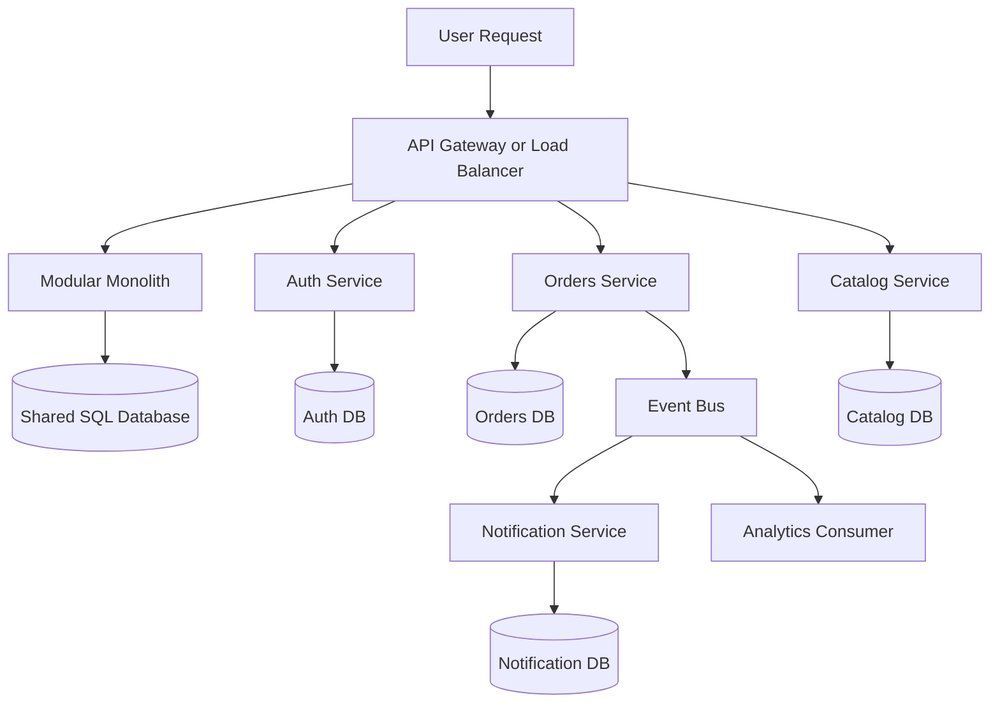

# Microservices vs Monolith

> The real choice is not "old architecture versus modern architecture" but whether your system, team, and failure tolerance benefit more from one deployable unit or many smaller ones.

---

## The Problem

Imagine a fast-growing SaaS company that started with one Rails or Spring application, one PostgreSQL database, and a small team of six engineers. In year one, that monolith is a gift. Everyone runs the same codebase locally, one deployment updates the whole product, and a new feature like "invoices with email receipts" can be built by touching the billing model, the email service, and the admin UI in one pull request. The application serves 2,000 requests per second, deploys in five minutes, and most incidents can be debugged from one set of logs.

Then the company grows. It now has 40 engineers across identity, billing, reporting, notifications, and search. Release coordination gets painful because five unrelated features are all waiting for one shared deployment window. A billing bug can force a rollback that also removes a fully working search feature. The app startup time is now seven minutes, test suites take over an hour, and every schema change makes half the company nervous. The mobile team wants a faster auth roadmap, the reporting team wants a different database access pattern, and the infrastructure team wants to scale only the traffic-heavy API endpoints instead of the whole application.

That is when somebody says, "We need microservices." Sometimes they are right. If one module now needs 20x the traffic of the rest, if teams are tripping over each other, and if one deployable unit is creating organizational drag, breaking the system apart can be the right move. But sometimes it is exactly the wrong move. A small company serving 5,000 daily active users can easily turn one understandable monolith into ten flaky services, three queues, a service mesh, and an incident calendar full of timeout chains. They solve coordination pain by creating distributed-systems pain.

This concept exists because architecture style determines what kinds of complexity you pay for. A monolith concentrates complexity inside one codebase and one release unit. Microservices move that complexity into networks, contracts, team boundaries, and operations. Without understanding the tradeoff, teams make architecture decisions based on fashion instead of constraints. That is how you end up with either a "big ball of mud" monolith that nobody can change safely, or a microservice sprawl where a simple user signup now depends on 12 network hops and three asynchronous repair jobs.

---

## Core Concept Explained

Think of a monolith versus microservices like running a restaurant. A monolith is one big kitchen. Everyone shares the same pantry, the same ticket printer, and the same line. That makes communication easy. If the dessert chef needs strawberries, they are five steps away. But if the fryer station catches fire, the whole kitchen stops. Microservices are closer to a food hall. The pizza team, the noodle team, and the coffee team all run their own stations. They can move faster inside their own booth, but now every shared customer experience depends on coordination between separate operators, payment terminals, and order pickup rules.

### What a monolith really is

A monolith is not "bad code" and it is not automatically "legacy." It simply means the system is developed, tested, deployed, and usually scaled as one unit. The application may still be well structured internally. A good modular monolith can have clear domain boundaries, separate packages, strict interfaces, and dedicated owners for auth, billing, and reporting. The difference is that the boundaries are enforced inside one process instead of across the network.

That has big practical advantages. A function call inside one process is measured in nanoseconds or microseconds. A network call between services is measured in milliseconds and can fail in dozens of ways. One transaction across one relational database is straightforward. Keeping data consistent across five services with independent stores often means sagas, outboxes, retries, and reconciliation jobs. Local development is also simpler. Cloning one repository and running one app plus one database is usually easier than booting fifteen services and waiting for all of them to discover each other.

Monoliths work especially well when teams are still learning the domain. Early in a product's life, boundaries are guesses. If you split the system too early, you freeze guesses into service APIs and ownership maps before you truly know what changes together. A modular monolith lets the team evolve the domain model quickly without turning every refactor into a cross-service protocol migration.

### What microservices actually buy you

Microservices mean the system is broken into independently deployable services, each responsible for a narrower capability. A user-facing request might travel through an API gateway, hit an auth service, call an orders service, emit an event to a notifications service, and later update analytics asynchronously. Each service may have its own datastore, scaling rules, deployment cadence, and team ownership.

The biggest upside is organizational and operational independence. If billing traffic spikes to 8,000 requests per second during month-end invoice generation while profile updates sit at 200 requests per second, those services can scale differently. If the search team wants Rust for indexing and the billing team wants Java for transaction workflows, microservices allow that. If one service needs weekly deploys and another needs ten deploys a day, independent release units help. This is why microservices often make sense for larger organizations before they make sense for small ones.

Microservices also improve blast-radius isolation when done well. A bad deployment to recommendations should not take down payments. A memory leak in image processing should not force a restart of the login system. When boundaries align with real business capabilities and dependencies are controlled, one service can fail degraded while the core product stays alive.

### Where microservices go wrong

The trap is assuming service boundaries remove complexity instead of relocating it. They replace in-process calls with RPC, add serialization and network latency, and force every interface to become an API contract. The moment two services own related data, consistency becomes a system design problem. If the orders service creates an order but the inventory service times out before reservation, what is the truth? In a monolith, that might be one transaction. In microservices, it might be a saga with compensating actions.

Teams also underestimate operational surface area. Ten services usually mean ten dashboards, ten deploy pipelines, ten sets of alerts, and ten ways to be partially broken. Observability stops being optional. Service discovery, retries, backoff, rate limiting, and circuit breaking become normal infrastructure rather than advanced topics. Local development can slow dramatically. A bug fix that used to require one breakpoint may now require tracing messages across a queue, three HTTP hops, and two databases.

### The modular monolith middle ground

The most useful senior-engineer insight here is that monolith versus microservices is not binary. A modular monolith is often the best stepping stone and sometimes the final answer. You keep one deployable unit but organize by domain, not by technical layer. Instead of `controllers/`, `models/`, and `services/` for the whole app, you structure the code around `billing`, `identity`, `catalog`, and `reporting`, each with explicit interfaces. You can even prohibit direct cross-module imports except through defined contracts.

That approach buys many microservice benefits earlier than people realize: clearer ownership, easier reasoning, and less accidental coupling. At the same time, it avoids distributed transactions, service meshes, and per-service on-call burden. If a boundary proves stable and independently valuable later, that module can be extracted into a service with much less drama because the code already behaves like one internally.

### How to choose

The boring but correct answer is that architecture should follow pressure. If one codebase, one database, and one deployment still let the team ship reliably, do not split it because a conference talk made microservices sound mature. If the real pain is test time, fix the test pyramid. If the real pain is one overloaded table, solve the data issue. If the real pain is that 12 teams are blocked on one release train and one failure can take out everything, now service boundaries may be worth the operational cost.

Choose a monolith when you need speed of product iteration, domain learning, easy transactions, and low operational overhead. Choose microservices when you have real scaling asymmetry, team-level ownership boundaries, different reliability needs by capability, and the operational maturity to handle distributed failure. Choose a modular monolith when you want to prepare for service extraction without paying the network tax too early.

---

## Architecture Diagram

### Mermaid Diagram

### Diagram Walkthrough

Starting from the top left, a user request enters through an API gateway or load balancer. That edge component is the stable entry point regardless of whether the company runs a monolith or a microservice architecture behind it. It handles routing, authentication checks, and sometimes rate limiting before the request reaches application logic.

The left side of the diagram shows the monolith path. The edge sends traffic into one modular monolith process, which then talks to a shared SQL database. In this model, auth logic, orders logic, and catalog logic are still separate in code, but they live inside one deployment unit and usually share one persistence layer. A typical request flow here might be "create order": the monolith validates the user, checks catalog data, writes the order row, and commits in one database transaction. The big benefit is that there are no network hops between those domain operations. The call stack is local and the data consistency model is straightforward.

The right side of the diagram shows the microservice path. The same edge layer can route login traffic to the Auth Service, browsing traffic to the Catalog Service, and checkout traffic to the Orders Service. Each service has its own datastore because independent ownership without data ownership usually fails in practice. Auth writes to the Auth DB, orders to the Orders DB, and catalog to the Catalog DB. This gives teams autonomy, but it also means a single user action may touch multiple systems.

One important microservice flow is synchronous request handling. Suppose the user signs in. The edge sends the request to Auth Service, which checks credentials, reads from Auth DB, and returns a token. That flow is still relatively simple because it stays mostly inside one service boundary. Another important flow is mixed sync-plus-async work. A user places an order, Orders Service writes to Orders DB, then publishes an event to the event bus. Notification Service consumes the event to send email or SMS, and an Analytics consumer records the purchase for dashboards. That pattern avoids making checkout wait on email delivery, but it introduces eventual consistency and retry behavior.

The diagram is meant to make one point visually obvious: the monolith centralizes control and data, while microservices distribute both. The monolith has fewer moving parts but larger blast radius. The microservice layout offers independent scaling and clearer ownership, but every box and arrow is another operational dependency you must understand, monitor, and recover when it misbehaves.

---

## How It Works Under the Hood

Under the hood, the biggest difference is not source-code layout but execution and coordination cost. In a monolith, a call from billing logic to user logic is an in-process function call. It may cost microseconds, share memory, and participate in one transaction. In a microservice system, the same logical interaction might become an HTTP or gRPC call with JSON or Protobuf serialization, TLS termination, connection pools, retries, and timeout budgets. A single network hop inside one region often adds 1 to 5ms in healthy conditions. A chain of six service calls can add tens of milliseconds before any database work begins.

Data ownership is where architecture style really starts to bite. Monoliths commonly use one relational database with foreign keys and ACID transactions across modules. That makes invariants easy to enforce. If an order row and a payment row must appear together or not at all, one database transaction can do it. In microservices, teams are strongly encouraged to avoid one giant shared database because a shared database recreates tight coupling through the back door. But once services own separate stores, consistency becomes explicit. You may need sagas, outbox patterns, or reconciliation workers to keep business state coherent across failures.

Deployment mechanics differ too. A monolith is one artifact, maybe a 500MB container or a JVM binary with all domains bundled together. Startup might take 60 to 180 seconds if dependency wiring, caches, and migrations are heavy. Microservices are smaller per unit, but you may now operate dozens of containers and rolling deployments in parallel. That improves per-service independence but increases fleet-level coordination. At scale, the platform cost of service discovery, secret distribution, ingress control, and per-service CI/CD is substantial. The engineering labor can easily dominate the raw compute bill.

Team topology shapes the success or failure of the move. A six-person startup with shared context can coordinate inside one codebase more easily than across ten service contracts. A 200-engineer organization with separate product areas may benefit from service boundaries because social coordination becomes the actual bottleneck. This is why Conway's Law matters here: software boundaries often reflect communication boundaries whether teams admit it or not. Microservices tend to work best when each service maps to a stable business capability with a team that can own it end to end.

Failure behavior also changes qualitatively. In a monolith, a null-pointer crash can take down the whole process, but debugging usually happens in one place. In microservices, partial failure is the default mode. The auth service may be healthy while the notifications service is timing out and the analytics consumer is lagging by 20 minutes. That sounds better because the whole site is not down, but it means the product can be "half broken" in many more ways. Engineers need correlation IDs, traces, queue lag dashboards, and well-defined degradation behavior to know whether an incident is annoying, dangerous, or merely noisy.

Finally, extraction cost is real. Taking a module out of a monolith is rarely just "copy the code into a new repo." You have to define APIs, split schemas, create auth boundaries, backfill data ownership, and add operational tooling. This is why the internal quality of the monolith matters so much. A tightly coupled monolith with no module boundaries is hard to split. A disciplined modular monolith with explicit interfaces is often one refactor away from a clean service extraction when the pressure truly arrives.

---

## Key Tradeoffs & Limitations

**Choose a monolith when product speed and domain learning are your main constraints.** If your team is under 15 engineers, your workload is manageable on one database, and most user-facing features still cut across multiple domains, a monolith is usually the most efficient answer. One deploy, one debugger, and one transaction model are serious advantages, not architectural shame.

**Choose microservices when the pain is genuinely about independent scaling, independent release cadence, or stable team ownership.** If search needs a different datastore, billing needs stricter reliability, and media processing needs separate capacity planning, splitting those concerns can pay off. But be honest about cost. You are signing up for network failures, distributed tracing, contract versioning, and more on-call surface area.

**Choose a modular monolith when you want clearer boundaries without distributed tax.** This is often the best answer for companies in the awkward middle stage. It gives you a path toward extraction while preserving in-process performance and easy transactions. Many teams skip this step and regret it because they confuse "modular" with "not ambitious enough."

Microservices do not automatically improve performance. For CPU-heavy hotspots, isolating a service can help because you scale only that service. For request latency, they often make things worse because synchronous hops accumulate. A monolith with efficient SQL queries may beat a microservice architecture that scatters one page load across eight RPC calls and three caches.

Microservices also do not guarantee team autonomy if the data model is still shared conceptually. If every change in Orders requires coordinated changes in Payments, Inventory, and Notifications, then separate deployables may only hide organizational coupling behind API boundaries. Architecture cannot compensate for unclear domain ownership.

The final limitation is reversibility. It is much easier to split a well-structured monolith than to merge twenty badly designed services back together. That asymmetry is why senior engineers are conservative about service creation. Premature microservices create durable operational debt.

---

## Common Misconceptions

**"Microservices are more scalable, so they are the mature architecture."** They can be more scalable for the right workloads, but only when independent scaling actually matches the demand pattern. A monolith on a few well-sized instances can handle impressive load, especially with caching and read replicas. The misconception exists because people hear about Netflix and Uber, then forget those companies adopted microservices under team and scale pressures most products never reach.

**"Monolith means spaghetti code."** A monolith can be a mess, but that is a code quality problem, not a deployment-shape problem. A modular monolith with strict domain boundaries is often easier to maintain than a service fleet with poor contracts and duplicated business rules. The misconception survives because many teams only consider architecture after their monolith is already unhealthy.

**"Microservices let teams move independently."** They can, but only if service boundaries match business ownership and data contracts are stable. If the boundaries are wrong, teams end up in constant multi-service coordination, version negotiation, and migration planning. People believe the myth because independent deployments are visible, while hidden coupling through workflows and shared data is harder to notice until later.

**"Shared databases make microservices simpler, so they are a good compromise."** Shared databases often preserve the worst part of a monolith while adding network complexity on top. Services become independently deployed but still tightly coupled by tables, locks, and schema changes. The misconception exists because sharing one database delays hard data-ownership work, which feels convenient in the short term.

**"A monolith must eventually be broken up."** Some systems should be, many never need to be, and some are better recomposed after over-splitting. If the monolith still deploys safely, scales acceptably, and matches team structure, breaking it apart may destroy more value than it creates. The misconception exists because architecture narratives often reward visible change more than stable effectiveness.

---

## Real-World Usage

**Amazon** is the classic microservices reference point because internal teams own narrow capabilities with strong service boundaries and APIs. The organizational reason mattered as much as the technical one: independent teams needed to ship without one central release train. That architecture works at Amazon's size because they invested heavily in platform tooling, observability, and service ownership discipline. Those hidden prerequisites are as important as the service count.

**Shopify** has written and spoken about deliberately preserving monolithic and modular patterns longer than many teams expect because coordinated commerce workflows still benefit from tight consistency and shared domain understanding. Even at very large scale, not every business capability became an independently deployed service immediately. That is a good reminder that "large company" does not automatically mean "everything is microservices."

**GitHub** famously operated as a large Rails monolith for a long time while serving enormous traffic and engineering complexity. They scaled vertically and horizontally, introduced background jobs, and improved internal modularity before extracting every possible service. The lesson is not that services are bad. It is that a disciplined monolith can carry a company much farther than architecture fashion suggests.

**Uber** is a useful counterexample because city-level scale, rapid team growth, and operational specialization made service decomposition more necessary. Ride matching, pricing, maps, and identity have different scaling and reliability profiles. Uber's story shows where microservices become practical, but it also shows the cost: heavy investments in platform engineering, observability, and developer tooling.

---

## Interview Angle

**Q: When would you keep a monolith instead of splitting into microservices?**
**How to approach it:**
- Start with current pain, not ideology: release coordination, scaling asymmetry, team contention, or lack thereof.
- Mention team size, domain maturity, and the value of simple transactions and local debugging.
- Explain that a modular monolith is often a stronger intermediate answer than immediate service extraction.
- Strong answers make it clear that "monolith" can be a deliberate choice, not a default failure state.

**Q: What are the biggest hidden costs of microservices?**
**How to approach it:**
- Talk about network latency, partial failure, observability requirements, and contract versioning.
- Mention data consistency explicitly because that is where many interview answers stay too shallow.
- Include local development and on-call burden, not just cloud compute cost.
- A strong answer distinguishes between engineering complexity and organizational benefit.

**Q: How do you decide service boundaries?**
**How to approach it:**
- Anchor the answer in business capabilities and ownership, not frameworks or folder names.
- Discuss change frequency, data ownership, and whether two things truly need separate scaling or reliability models.
- Mention that boundaries should be stable enough to survive product evolution, not just current org charts.
- Good answers also admit that boundaries are hypotheses and may need refinement.

**Q: Why is a modular monolith often a better first step?**
**How to approach it:**
- Explain that it enforces domain boundaries while avoiding distributed transactions and network hops.
- Mention easier refactoring, faster local development, and simpler incident debugging.
- Connect it to reversibility: extracting later is easier than recomposing many services.
- Show that you understand "do the simpler thing first" is often senior judgment, not caution.

---

## Connections to Other Concepts

**Concept 04 - API Gateway, Reverse Proxy & Rate Limiting** becomes much more important once you adopt microservices. A monolith may expose one main application entry point, but a service fleet usually needs centralized routing, auth enforcement, quota control, and request transformation at the edge.

**Concept 13 - Synchronous vs Asynchronous Communication Patterns** sits at the heart of this architecture choice. Monoliths often rely on in-process synchronous coordination, while microservices must deliberately choose which interactions remain synchronous and which should move to queues or events to avoid latency chains.

**Concept 15 - Event-Driven Architecture & Event Sourcing** is a common companion to microservices because asynchronous events help decouple service workflows. The downside is that event-driven coordination replaces simple local transactions with eventual consistency and replay complexity, which is exactly why service boundaries should be chosen carefully.

**Concept 19 - Fault Tolerance Patterns** matters more in a microservice world because partial failure becomes normal. Circuit breakers, retries, backoff, and graceful degradation are often optional improvements in a monolith but become foundational patterns when one user request crosses multiple services.

**Concept 21 - Monitoring, Observability & SLOs/SLAs** is the operational reality check for this topic. A monolith can often be debugged from one log stream and one database. A microservice fleet requires traces, service-level metrics, and clear error budgets, otherwise independence at design time becomes chaos during incidents.
