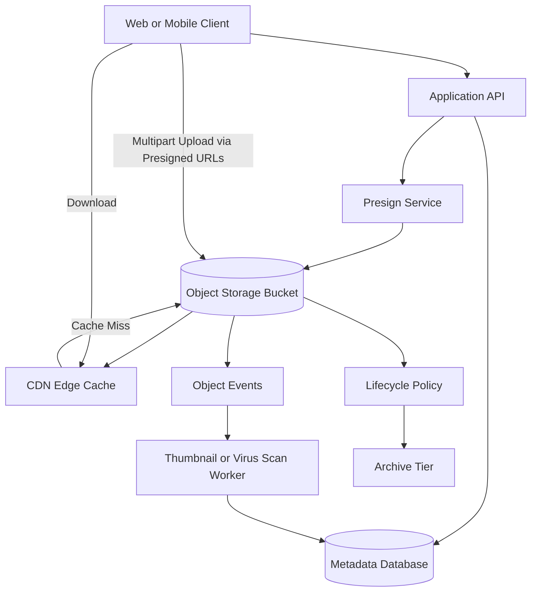

# Blob/Object Storage Patterns

> Object storage is a system for storing large immutable blobs behind keys so applications can keep files durable, cheap, and globally accessible without treating them like local disks.

---

## The Problem

Imagine you are building a product where users upload photos, invoices, videos, and PDF reports. At launch, the engineering team keeps everything on the local disk of two application servers. A user uploads a 12MB image, the API process writes it to `/var/app/uploads`, and the database stores the path. It works fine when the company has 2,000 daily active users and a few gigabytes of media.

Then growth arrives. Upload traffic rises from 50 files per minute to 8,000 files per minute during a marketing campaign. One server fills its SSD. Another serves stale paths because a deployment replaced the instance and wiped local files. A load balancer sends a download request to server B for a file that only exists on server A, so the user gets a 404 even though the database record exists. Backups explode in size. Cross-region disaster recovery becomes ugly because copying terabytes of mixed application binaries and user files between machines is slow and operationally fragile.

The next failure is usually cost or latency. If your API servers proxy every 200MB video upload through the app layer, network egress and CPU usage spike for no real business reason. A 1Gbps instance can only push about 125MB/s in perfect conditions, which means a handful of concurrent uploads can monopolize bandwidth. Suddenly app servers are acting like expensive file movers instead of doing actual application work.

This is the problem object storage solves. It gives you a durable, highly available place to store blobs - images, videos, backups, documents, ML artifacts, logs - as named objects instead of blocks on a mounted filesystem. Clients can upload directly with presigned URLs. CDNs can cache downloads at the edge. Lifecycle policies can move cold files to cheaper tiers. Metadata can live in a database while bulk bytes live in storage optimized for durability. Without this pattern, file-heavy systems eventually become a pile of brittle local disks, oversized backups, and app servers doing jobs they were never meant to do.

---

## Core Concept Explained

Think of object storage like a warehouse of sealed boxes. Each box has a label, some metadata on the outside, and contents you do not partially edit once the box is sealed. You can put boxes in, fetch them by label, replicate them, archive them, or destroy them by policy. What you do not do is mount the warehouse like a local notebook and constantly rewrite byte 417 in place. That is the mental shift that makes object storage click.

Traditional block storage exposes raw disks. A filesystem sits on top and lets you mutate files in place. Object storage is different. You store an entire blob under a key such as `users/4831/avatars/2026-03-19.png`. The system treats that object as a unit. Reads fetch the whole object or byte ranges. Writes usually create a new object version or replace the old one atomically. There is no expectation of POSIX file locking, low-latency random writes, or mounting the bucket as if it were an ext4 disk.

S3 made this model mainstream. You create a bucket, write objects into it, and retrieve them by key. The object can be a 40KB thumbnail, a 200MB mobile app build, or a 4TB backup shard. Amazon S3 allows objects up to 5TB, and multipart upload lets you send them in pieces, typically with parts from 5MB up to 5GB, with at most 10,000 parts. That matters because no serious system wants a single 200GB HTTP request that must succeed end to end without interruption.

### Why object storage exists

Object stores are optimized for a different set of goals than databases or local filesystems:

**Durability:** S3 famously advertises 99.999999999 percent durability, commonly called 11 nines. That does not mean no failures ever happen. It means the platform is designed so losing an object is extraordinarily unlikely by replicating or erasure-coding data across multiple devices and facilities.

**Cheap scale:** Object storage is much cheaper per GB than high-performance block storage or RAM. That makes it suitable for datasets in the tens of terabytes, petabytes, or more.

**Simple access model:** Applications use HTTP APIs like `PUT`, `GET`, `HEAD`, and `DELETE` instead of managing disks, RAID arrays, or mounted NFS shares.

**Decoupling compute from storage:** App servers can be replaced freely because files do not live on instance-local disk. This is one of the biggest operational wins.

### Direct upload and presigned URL patterns

One of the most important production patterns is keeping the application server out of the bulk data path. Instead of sending file bytes through the API tier, the client first asks the application for permission to upload. The app authenticates the user, validates content type and expected size, creates a storage key, and returns a presigned URL or temporary credentials. The client then uploads directly to object storage.

That pattern has three advantages. First, the app server does much less network work. Second, uploads become more reliable because the storage service is built for large transfers and retries. Third, security improves because the generated URL can be limited to one object key, one HTTP verb, and a short TTL such as 10 minutes.

Presigned download URLs work similarly. Instead of making every private asset publicly readable, the application issues a short-lived signed URL for one object. That is common for invoices, private reports, export archives, or premium media files.

### Metadata patterns

A common beginner mistake is trying to force all business queries onto the object store itself. Object stores are great at "get object by exact key" and weak at "find all PDFs uploaded by tenant 918 in the last 7 days where status is approved." That is why serious systems separate blob bytes from searchable metadata. The database stores object key, owner, MIME type, size, checksum, lifecycle state, and business relationships. The bucket stores the bytes.

This split also helps with rename and versioning semantics. Instead of renaming objects in place, many systems write a new object and update metadata pointers transactionally or semi-transactionally. Object storage keys should be treated as stable identifiers, not user-facing filenames.

### CDN integration and range reads

Object storage often sits behind a CDN because the access pattern is extremely cache-friendly. Static images, JS bundles, video segments, downloadable archives, and profile assets benefit from edge caching. A CDN can reduce download latency from 150ms-plus cross-region origin fetches to 10-30ms edge hits for nearby users. It also protects the origin bucket from repeated hot reads.

Range requests matter too. Video players and large download clients rarely want all bytes at once. They may request byte ranges such as `0-1048575` for preview or seek operations. Object storage APIs and CDNs typically support this well, which is another reason they fit media-heavy systems.

### Lifecycle policies

Not every object should live forever in the expensive "hot" tier. Lifecycle policies let you move cold data to cheaper classes after a threshold such as 30, 90, or 365 days. Logs might move from standard storage to infrequent access after a month, then to archive after a quarter, then be deleted after seven years. This is one of the quiet superpowers of object storage: you can automate retention and cost control instead of making engineers babysit storage growth.

The core lesson is simple. Treat object storage as durable blob infrastructure, not as a local directory tree that happens to live in the cloud.

---

## Architecture Diagram

### Mermaid Diagram

### Diagram Walkthrough

Starting at the top left, the web or mobile client talks to the application API first, not directly to the bucket. That first call is for authorization and metadata, not for moving bulk bytes. The application verifies who the user is, checks whether they are allowed to upload or download a file, decides which logical object key to use, and records initial metadata such as owner, file type, expected size, or upload state in the metadata database.

The application then calls the presign service. In small systems this can simply be code inside the API, but the role is the same: generate a short-lived signed upload or download capability for one object path. The signer is connected to the object storage bucket because it creates credentials or signatures that the bucket will accept. For a large upload, the client may receive multiple presigned URLs, one per multipart upload chunk.

The first major flow is direct upload. After the client receives presigned URLs, it uploads file parts straight to the bucket. The application server is no longer in the data path, which saves bandwidth and reduces tail latency on the API fleet. Once all parts are uploaded, the client or backend completes the multipart upload so the object becomes visible as a single logical blob.

The second flow is download. The client requests a file URL, and the system serves it through the CDN. If the object is already cached at the edge, the CDN returns it immediately, often in tens of milliseconds. If it is a cache miss, the CDN fetches the object from the bucket, caches it according to policy, and then returns it to the client.

On the right side, object events trigger asynchronous workers. A new upload may kick off antivirus scanning, thumbnail generation, media transcoding, or metadata extraction. Those workers usually write results back to the metadata database rather than mutating the original object. Finally, the lifecycle policy and archive tier represent cost governance. As objects age, the storage platform can automatically transition them to cheaper classes or delete them according to retention rules. The important design idea is that object storage handles bytes, while the application and metadata systems handle meaning, permissions, and workflow state.

---

## How It Works Under the Hood

Under the hood, object storage systems separate metadata management from bulk data placement. A control plane tracks buckets, object keys, ACLs or IAM policies, lifecycle settings, and version metadata. A data plane stores the bytes across many disks and nodes. That split is why object stores can scale to billions or trillions of objects without pretending every object is a normal filesystem inode on one server.

Durability usually comes from replication, erasure coding, or both. Small hot objects may be synchronously replicated across devices or availability zones. Large cold objects may be striped into fragments with parity, similar to RAID ideas but at a massive distributed scale. Erasure coding reduces storage overhead compared with three full copies while still allowing reconstruction after disk or node failure. The tradeoff is more CPU and network work during writes and rebuilds.

Multipart upload exists because large transfers fail in the real world. If a 40GB upload breaks at 39GB and you only support one monolithic request, the client restarts from zero. Multipart upload lets each part be retried independently. After completion, the storage system assembles the logical object. This is also why checksums matter. Production systems commonly track per-part checksums and an overall object hash so corruption can be detected before the file is marked complete.

Consistency is better than many engineers assume, but still nuanced. Amazon S3 now provides strong read-after-write and strong list consistency for standard operations, which removed a whole category of old workarounds. But "object storage consistency" is still not the same as "the whole workflow is strongly consistent." CDN caches can serve stale copies. Cross-region replication can lag by seconds or minutes. Lifecycle transitions are asynchronous. Event notifications can be delayed or delivered at least once. A file upload product still needs careful state handling even if the underlying bucket API is strongly consistent.

Performance characteristics also differ from block storage. Object stores are excellent at high-throughput large-object reads and writes, but not at low-latency in-place mutation. A small metadata lookup in PostgreSQL might take 1 to 5ms in-region. An S3 `GET` for a private uncached object may take tens of milliseconds before payload transfer even starts. That is fine for files and media, but terrible for OLTP-style record updates. This is why people say object storage is not a database and not a local disk.

Key design matters more than many teams expect. Some object stores used to suffer from partition hotspots if too many sequential keys shared a prefix like `2026/03/19/000001`, `000002`, `000003`. Modern providers are much better at auto-partitioning, but good key hygiene still helps. Randomized prefixes, tenant sharding in the path, or UUID-based segments can spread load and make abuse isolation easier.

Another under-the-hood concern is garbage collection of incomplete workflows. Multipart uploads that never finish still consume storage. Temporary presigned objects may be abandoned. Versioned buckets can accumulate delete markers and old copies. Good systems run cleanup jobs, lifecycle rules, and inventory scans to remove orphaned state. Otherwise "cheap storage" quietly becomes an expensive leak.

Finally, object storage security is largely policy-driven. Bucket policies, IAM roles, object ACLs, KMS encryption keys, and signed URLs all interact. Most mature teams keep buckets private by default and expose access through CDN rules or short-lived signatures. The failure mode to fear is not just outage. It is accidental public exposure of a whole bucket because someone treated object storage like a harmless file share.

---

## Key Tradeoffs & Limitations

Object storage is the right boring answer when you need durable blobs, simple HTTP access, CDN friendliness, and cheap growth into terabytes or petabytes. It is usually the wrong answer when you need POSIX semantics, low-latency random writes, file locking, or database-style queries.

The biggest benefit is decoupling. App servers stop carrying user files on local disks, deployments become safer, and storage can scale independently from compute. But the cost is a weaker programming model. You cannot casually append to the middle of a file, rename huge directory trees instantly, or ask the bucket to run relational queries over business metadata.

Choose direct-to-object-storage upload when files are medium or large, user traffic is high, and the application tier should not proxy raw bytes. Choose app-proxied upload only when you truly need inline inspection before any bytes are accepted, or when clients are too constrained to talk to storage APIs directly. Even then, many teams still split the flow so the app performs authorization and scanning asynchronously instead of staying in the middle forever.

Choose object storage over block storage when durability, scale, and HTTP accessibility matter more than filesystem behavior. Choose block storage when a database, VM, or search node needs low-latency mounted volumes. Choose a shared filesystem when multiple machines genuinely need file semantics rather than object semantics. If your workload is "read and write lots of 8KB records in place," object storage is the wrong tool.

There are also subtle money tradeoffs. Storage per GB is cheap, but request costs, cross-region replication, CDN cache misses, lifecycle retrieval fees, and egress can dominate the bill. A system that serves 50TB per day of video directly from the origin bucket without CDN shielding will learn this painfully. Cheap-at-rest does not mean cheap-in-motion.

One more hard limit: object storage does not solve coordination. If two users upload conflicting versions of a report, or a workflow depends on "virus scan must finish before object becomes downloadable," you still need application-level state, versioning, and orchestration.

---

## Common Misconceptions

**Many people believe object storage is just a cheaper filesystem.** It is cheaper at scale, but the access model is fundamentally different. There is no assumption of in-place mutation, low-latency directory traversal, or POSIX locks. The misconception exists because buckets and folders look visually similar in cloud consoles.

**A common belief is that S3-style storage is always eventually consistent, so you must code around stale reads everywhere.** That used to be a practical concern for some systems, but modern S3 semantics are much stronger for ordinary reads and listings. The correct understanding is that stale behavior now more often comes from CDN caches, cross-region replication, or asynchronous workflows than from the basic `PUT` and `GET` path itself.

**Many teams think presigned URLs are insecure by default.** They are only insecure when scoped poorly or given long TTLs. A properly generated presigned URL can be limited to one object key, one method, a short time window, and sometimes even content-length or checksum constraints. The misconception exists because signed URLs look like public links even when they are really temporary capabilities.

**People often assume object storage means infinite throughput with no hotspots.** In practice, request concentration, bad key patterns, missing CDN layers, and huge multipart storms can still create bottlenecks or cost spikes. The right understanding is that object stores are massively scalable platforms, not magic portals that exempt you from architecture.

---

## Real-World Usage

**Dropbox Magic Pocket** is one of the clearest object-storage-at-scale examples. Dropbox built Magic Pocket to store exabytes of user content with erasure coding, background repair, and strong separation between metadata services and blob storage. The notable design choice was optimizing for huge object fleets and storage efficiency instead of treating uploaded files like local filesystem artifacts forever.

**Meta's Haystack photo system** is another classic. Meta described storing billions of photos by separating metadata lookup from large immutable photo blobs, reducing expensive filesystem metadata access and optimizing for straightforward object retrieval. The lesson maps directly to modern object storage patterns: keep bytes in a blob-oriented layer and keep searchable metadata somewhere built for indexing.

**Netflix** uses object storage patterns throughout its media pipeline even though the final viewer path involves specialized delivery infrastructure. Large source assets, intermediate artifacts, subtitles, images, and supporting media metadata often live in storage systems shaped like object stores, then get distributed through CDN and edge delivery layers. The architectural insight is that origin durability and global delivery are separate jobs, and object storage is usually the right origin layer.

---

## Interview Angle

**Q: Why would you use presigned URLs instead of uploading files through the application server?**
**How to approach it:**
- Start with bandwidth and CPU offload: app servers should authorize uploads, not proxy every byte forever.
- Mention reliability for large files, especially with multipart upload and client-side retries.
- Discuss security boundaries: short TTL, one object key, one method, private bucket by default.
- A strong answer also calls out metadata validation and post-upload verification.

**Q: When is object storage the wrong choice?**
**How to approach it:**
- Say explicitly that object storage is poor for low-latency random writes and POSIX-style file semantics.
- Contrast it with block storage for databases and shared filesystems for workloads needing mounted directories.
- Mention business-query limitations: exact-key retrieval is easy, metadata filtering is not.
- Strong answers explain what tool they would use instead, not just what they would avoid.

**Q: How would you design uploads for 20GB video files on unstable mobile networks?**
**How to approach it:**
- Lead with multipart upload, resumability, and direct-to-storage transfers.
- Mention checksums, completion APIs, and orphaned-upload cleanup.
- Talk about asynchronous post-processing such as transcoding and virus scanning.
- Include cost and CDN considerations for later playback.

**Q: How do you keep private files private while still letting users download them efficiently?**
**How to approach it:**
- Start with private buckets and application-controlled authorization.
- Mention presigned URLs, signed CDN cookies or tokens, and short expiration windows.
- Bring up auditability, revocation limits, and cache behavior for private assets.
- Strong answers balance security with performance instead of defaulting to "just make it public."

---

## Connections to Other Concepts

**Concept 03 - CDN & Edge Computing** is the most direct neighbor to this topic. Object storage is often the origin, while the CDN is the global distribution layer that reduces latency and offloads repeated reads. You rarely discuss one in production without the other.

**Concept 04 - API Gateway, Reverse Proxy & Rate Limiting** connects because presigned upload and download flows usually begin at an authenticated API edge. The gateway or API layer decides who is allowed to obtain a signed URL, what object key they may access, and what rate limits protect the system from abuse.

**Concept 12 - Data Modeling for Scale** matters because serious object-storage systems never rely on the bucket alone for business queries. They store metadata such as ownership, content type, lifecycle state, and checksums in a model built for query patterns, while the bucket stores only bytes.

**Concept 19 - Fault Tolerance Patterns** becomes important when uploads fail halfway, cross-region replication lags, or a CDN outage shifts traffic back to the origin bucket. Retries with backoff, graceful degradation, and clear failure domains determine whether file delivery incidents stay local or become full-system pain.

**Concept 24 - Search Systems** is a natural extension because users rarely search raw blobs directly. They search metadata, OCR text, extracted fields, and indexed content derived from objects. In many real products, object storage is the source of bytes and the search system is the source of discoverability.
