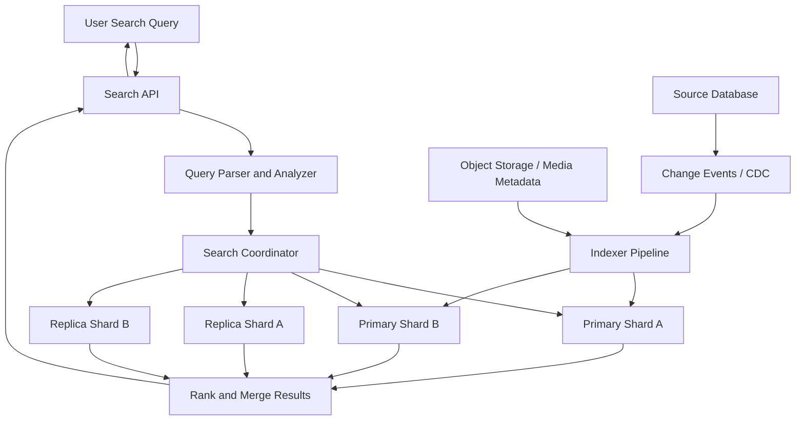

# Search Systems

> Search systems turn messy human queries into fast, relevant results by building specialized indexes that can retrieve and rank documents far more efficiently than a transactional database can.

---

## The Problem

Imagine you run a marketplace with 40 million listings. A buyer types `wireless noise cancelling headphones under 200` into the search bar, and they expect useful results in well under a second. They do not care that your product data lives in PostgreSQL, that titles are inconsistent, or that some sellers wrote `ANC headset` while others wrote `bluetooth over-ear headphones`. They want the right products, ranked sensibly, filtered by price, brand, and rating, with autocomplete helping them before they even finish typing.

If you try to do that with ordinary SQL alone, you hit limits quickly. A `LIKE '%headphones%'` query on tens of millions of rows is slow. It does not understand stemming, synonyms, typos, phrase matching, or weighted fields. It cannot easily answer, "Show documents containing these terms, score title matches higher than description matches, sort by a relevance formula, then aggregate counts for brands and price buckets." A relational database can absolutely do simple lookup and exact filtering. It is just not optimized to be a great full-text relevance engine.

At small scale this feels tolerable. Maybe the catalog has 100,000 products, and a basic text index plus a few filters gets results back in 80ms. Then growth happens. Traffic reaches 8,000 queries per second during sale events. Sellers update prices continuously. Users expect fresh inventory, typo tolerance, multilingual queries, and instant suggestions under 50ms while typing. Now you are not solving one problem. You are solving three at once: fast retrieval, good ranking, and acceptable freshness.

This is why search systems exist. They build specialized data structures, usually inverted indexes, that answer text queries efficiently. They tokenize and normalize documents ahead of time instead of parsing everything at query time. They distribute the index across shards, replicate it for availability, and expose ranking controls that let "title contains the exact phrase" matter more than "description contains a synonym once." Without a dedicated search system, the search bar in a product, content, or knowledge application eventually becomes the most visibly disappointing part of the user experience.

---

## Core Concept Explained

Think of a search system like an old library card catalog, except much faster and much smarter. A normal database is organized around documents themselves: here is row 38192, here are its columns, go fetch it. A search engine is organized around words and terms: here is the term `headphones`, here is every document that contains it, and here is metadata about where and how often it appears. That reversal is the key idea.

### Inverted indexes

The foundational data structure is the **inverted index**. Instead of storing only "document 17 contains these words," the engine stores "this word appears in documents 17, 43, and 98." That means when a user searches for `noise cancelling`, the engine can jump directly to the postings lists for `noise` and `cancelling`, intersect or union them, and evaluate candidate documents without scanning the whole dataset.

This is why a search engine feels fundamentally different from a database text filter. On a catalog with 100 million documents, a well-built inverted index can reduce the query from "look through everything" to "look through a very small candidate set that already contains the terms we care about." Lucene-based systems such as Elasticsearch and OpenSearch are built around this idea.

### Tokenization and analyzers

Raw text is not useful by itself. Search engines first run documents and queries through an **analyzer** pipeline. That usually includes:

**Tokenization**: splitting text into terms. `Wireless Noise-Cancelling Headphones` may become `wireless`, `noise`, `cancelling`, `headphones`.

**Normalization**: lowercasing, accent folding, punctuation cleanup, or Unicode normalization so `Cafe` and `cafe` behave sensibly.

**Stemming or lemmatization**: reducing `running`, `runs`, and `run` toward a common root so users do not need perfect grammar alignment.

**Stop-word handling**: deciding what to do with very common words like `the`, `a`, or `for`.

**Synonym expansion**: treating `tv` and `television`, or `sneakers` and `running shoes`, as related.

Analyzers are where search quality often lives or dies. A poor analyzer makes a sophisticated search engine feel dumb. A good analyzer can make even a fairly simple ranking model feel surprisingly relevant.

### Ranking and relevance

Retrieval answers, "Which documents could match?" Ranking answers, "Which of those should come first?" Search engines usually score candidates based on signals such as term frequency, field importance, phrase proximity, recency, popularity, click signals, and business rules. A title match is often worth much more than a description match. An exact phrase like `wireless mouse` is usually better than a document where `wireless` appears once and `mouse` appears in a completely different context.

Elasticsearch and OpenSearch inherit Lucene's default BM25 relevance scoring, which is a probabilistic ranking model. You do not need to memorize the full formula to use it well. What matters is the intuition: rare terms carry more weight than common ones, repeated meaningful terms matter, and overly long documents do not get infinite credit just because they contain every word many times.

Most real systems add domain-specific ranking on top. E-commerce search often blends textual relevance with inventory, conversion rate, margin, seller quality, and geographic availability. Job search may boost title, location, salary band, and personalization. Internal knowledge search may weight document freshness and team ownership more heavily than popularity.

### Indexing pipeline and freshness

A search engine is not usually the source of truth. The canonical data often lives in PostgreSQL, MySQL, DynamoDB, object storage, or event streams. Documents are copied into the search index through an ingestion pipeline. That pipeline may be batch-based, event-driven, or a mix of both.

This creates an important tradeoff: **search is often near real-time, not instantly real-time**. Elasticsearch commonly refreshes an index every second by default, which means a newly indexed document may not be visible to search for up to about one second. For product catalogs or article search that is usually fine. For fraud controls or exact balance lookups, it often is not.

### Shards and replicas

Once the index gets large, one node is not enough. Search engines split data into **shards**, which are logical partitions of the index. Each shard may also have one or more **replicas** for read scaling and failover. A search request is usually broadcast to relevant shards, each shard returns its top local matches, and a coordinating node merges those into the final ranked result set.

This is why search scaling has a different feel from scaling a primary database. Query latency depends on the slowest shard involved, not just average node speed. Too many shards create coordination overhead. Too few shards create oversized partitions that are slow to recover and hard to rebalance. Many teams try to keep shards in the rough 20GB to 50GB range, though the right number depends heavily on query patterns, hardware, and mapping design.

### Autocomplete is not just smaller search

Autocomplete and full-text search are related but not identical. Full-text search optimizes for expressive queries and relevance over a corpus. Autocomplete optimizes for sub-100ms prefix suggestions while the user is still typing. Many systems use edge n-grams, completion suggesters, or finite state transducers for autocomplete because the access pattern is different. If you reuse a heavy full-text query path for every keystroke, the search bar will feel laggy even if normal search is acceptable.

### When Elasticsearch or OpenSearch is appropriate

Elasticsearch and OpenSearch are appropriate when you need flexible text search, faceting, aggregation, and operationally mature distributed indexing without building your own engine from Lucene. They shine for product search, document search, log search, knowledge bases, and many internal admin interfaces. They are overkill when you only need exact lookups, prefix matching on a small table, or a dataset so small that PostgreSQL full-text search already satisfies latency and relevance goals.

The senior-engineering lesson is that search systems are specialized infrastructure for one of the most human-facing parts of an application. The value is not just speed. It is the combination of retrieval, ranking, filtering, and explainable tradeoffs between relevance and freshness.

---

## Architecture Diagram

### Mermaid Diagram

### Diagram Walkthrough

Start at the top left with the user search query. A human types something like `noise cancelling headphones` into the application. That request first reaches the Search API, which is the stable service boundary for clients. The API is where authentication, request validation, tenant scoping, and query-level business rules usually live. It does not usually do heavy retrieval itself. Its job is to prepare a safe and meaningful search request for the engine.

The next component is the query parser and analyzer. This is where the raw query string is tokenized, normalized, and interpreted. If the system supports synonyms, phrase queries, field boosts, or typo handling, that logic starts here. A user may type `tv stand`, but the parser may expand `tv` to `television` or lower the weight of overly broad terms. This step matters because search quality depends on the query representation being compatible with the way documents were indexed.

From there the request moves to the search coordinator. The coordinator does not necessarily store the authoritative data itself. Instead, it figures out which shards should participate and fans the query out. In the diagram there are two primary shards and two replica shards. In practice the coordinator may choose primaries or replicas depending on health, load, and routing strategy. This is the main query flow: the search request is distributed, each shard evaluates the query locally against its own inverted index, and each shard sends back its top local matches plus relevance scores.

Those partial results converge in the rank-and-merge stage. This component combines shard-local answers into one global top-N result set. It may apply tie-breaking rules, field collapsing, business boosts, or post-filtering before sending the final results back to the Search API and then to the user. This is why search latency depends on more than raw lookup speed. Even after retrieval, the system still needs to coordinate, merge, and often compute facets or highlights.

The second major flow is the indexing path at the bottom of the diagram. The source database remains the system of record for product, document, or content data. Changes from that database are captured through change events or CDC, which then flow into an indexer pipeline. Object storage can also feed the pipeline with metadata or derived content, such as PDF text extraction or image labels. The indexer transforms source records into searchable documents and writes them into the primary shards. Those shard updates then become visible to search after the engine refreshes its segments. This indexing flow is where freshness tradeoffs appear: the application may commit a record instantly to the source database, but the search result may show up a few hundred milliseconds or one second later depending on the refresh policy.

---

## How It Works Under the Hood

Under the hood, most production search engines are built on Lucene-like segment architecture. Documents are indexed into immutable **segments**, and each segment contains its own inverted index, stored fields, term dictionary, and metadata. New writes do not rewrite the entire index. They are appended into new segments, which are later merged in the background. This is one reason search systems can ingest steadily while still serving queries, but it is also why indexing has refresh and merge behavior that operators need to understand.

The term dictionary maps terms to postings lists. A postings list typically contains document IDs and may also contain term frequency and positional information. Positions are what make phrase queries and proximity queries possible. If a user searches for `distributed cache`, the engine can do more than ask whether both words exist. It can ask whether they appear next to each other in the right order. That dramatically improves relevance.

Lucene's default BM25 ranking uses term frequency, inverse document frequency, and document-length normalization. The practical interpretation is simple. A term that appears in very few documents is more informative than a term appearing in almost all documents. Repeating an important term several times can strengthen the signal, but with diminishing returns. A 20,000-word document is not automatically better than a 40-word product title just because it contains more query terms overall.

Autocomplete often uses different internal structures from full-text search. Edge n-grams are a common choice: `laptop` may generate tokens like `l`, `la`, `lap`, `lapt`, and so on. That makes prefix matching fast, but it increases index size significantly, often by several multiples depending on token settings. Completion suggesters and finite state transducers can be more memory efficient for curated suggestion lists. The right choice depends on whether you want free-form prefix recall or carefully managed suggestion quality.

Freshness comes from the refresh model. In Elasticsearch and OpenSearch, indexing a document does not make it immediately visible to search in the strictest sense. The engine refreshes periodically, commonly every second, opening new searchers on recent segments. If you reduce the refresh interval to 100ms, search results become fresher but indexing throughput drops and resource overhead rises. If you increase it to 30 seconds, indexing becomes cheaper but users may think the system is broken because their new document cannot be found.

Deletes and updates are not free either. A Lucene update is effectively a delete plus a reindex of the new version. Deleted documents linger until background merges reclaim space. That means heavy churn workloads, such as constantly rewriting ranking signals for millions of products, can create merge pressure, disk amplification, and temporarily inflated index size. This is one reason search engines are happiest when documents are relatively stable or updates are batched intelligently.

Distributed search adds another layer of cost. A query hitting 20 shards can easily be slower than the same logical query hitting 4 shards because every additional shard means more network fan-out and more partial results to merge. Oversharding is a classic operational mistake. Teams often create far too many shards early because empty shards feel harmless. Later they discover that every query now pays a coordination tax and every cluster rebalance touches hundreds of tiny partitions.

Replica strategy matters too. Replicas improve availability and can absorb read traffic, but every replica also consumes storage and must apply the same indexing work. A cluster with 3 primary shards and 2 replicas per shard is really maintaining 9 copies of shard data across the cluster. That may be exactly right for a user-facing search product that cannot go dark during a node failure. It may be wasteful for an internal admin console used by 30 people.

Finally, search failures are often subtle rather than binary. A query can "work" while relevance degrades because synonyms drifted, analyzers were misconfigured, one shard is stale, or index mappings changed between versions. That is why good search teams measure not just uptime and latency but also zero-result rates, click-through on top results, indexing lag, shard skew, and query error categories.

---

## Key Tradeoffs & Limitations

Search systems are powerful, but they are not a replacement for your primary database. They duplicate data, introduce eventual consistency, require custom mappings, and need careful operational tuning. If your application only needs exact ID lookup, simple filtering, or a few thousand rows of data, PostgreSQL with a good index is often the better boring choice.

Relevance is also expensive in a way that transactional systems are not. Once product managers ask for synonyms, typo tolerance, boosting, recency weighting, personalization, and explainable results, your "simple search feature" becomes an ongoing product and operations investment. Two systems with identical latency can feel wildly different to users if one has better analyzers and ranking logic. That means search quality work never fully ends.

Freshness is the central tradeoff. Choose aggressive refresh when the user must see new content quickly. Choose slower refresh when indexing throughput and cluster efficiency matter more. For example, a help-center search index might tolerate 5 to 30 seconds of lag, while a live marketplace inventory index often needs sub-second visibility for out-of-stock items.

Choose Elasticsearch or OpenSearch when you need full-text retrieval, faceting, relevance tuning, and a mature distributed engine. Choose database-native search when the dataset is moderate, consistency must be tighter, or the team cannot absorb another operational subsystem. Choose a custom engine only when the domain is specialized enough that general-purpose search no longer fits, such as large-scale code search, ad retrieval, or deeply personalized ranking systems.

One more limitation: search engines are excellent at finding candidate documents, but they are not automatically great at truth-critical workflows. If a query must return the exact current balance, inventory count, or authorization state, the source-of-truth database should still own that decision. Search is usually where users discover things, not where the system makes final correctness-sensitive commitments.

---

## Common Misconceptions

**Many people believe search is just a database query with a text index.** That is only partly true. Search systems are optimized for retrieval and ranking, not just filtering rows that contain a string. They use inverted indexes, analyzers, shard coordination, and ranking models that behave very differently from `LIKE` queries or even database full-text extensions. The misconception exists because small demos blur the difference until scale or relevance requirements expose it.

**A common belief is that better ranking is only a machine-learning problem.** In reality, a huge amount of search quality comes from analyzers, field design, phrase handling, and sensible boosts before any ML enters the picture. A broken tokenizer can ruin a search experience faster than a mediocre ranking model. People believe ranking is mostly ML because recommendation and search are often discussed together.

**Many teams assume replicas make search free to scale.** Replicas help query throughput and high availability, but they also increase storage cost and indexing work. Every replica has to store and maintain the same index data. The misconception persists because read scaling is the most visible benefit while the write and storage amplification are less obvious.

**People often think near real-time means real-time.** In Elasticsearch and OpenSearch, a document that has been indexed may still not be searchable until the next refresh, often around one second later. That is usually acceptable, but it is not zero-lag consistency. The misconception exists because a one-second delay feels instantaneous in many apps until someone tests a workflow that depends on exact freshness.

**Many engineers believe autocomplete is just full-text search on a shorter string.** It is usually a different workload with stricter latency expectations and different indexing strategies. A good autocomplete path often uses prefix-oriented data structures or specialized suggesters. The misconception survives because both features live behind the same search box.

---

## Real-World Usage

**LinkedIn Galene** is one of the best-known large-scale search systems in industry engineering writing. LinkedIn built Galene to support member, job, company, and content search across massive datasets with near real-time updates. The architecture separated online serving from index building and emphasized federated retrieval so different verticals could be searched and blended efficiently. The important lesson is that search at LinkedIn scale is not one index plus one ranking function. It is a distributed product platform.

**Wikimedia's Elasticsearch-based search stack** powers search across Wikipedia and related projects in many languages. That means analyzers, stemming, language-specific processing, and index freshness all matter in very practical ways. They use Elasticsearch because full-text relevance, language-aware tokenization, and distributed indexing are much better fits than asking a transactional database to answer multilingual encyclopedia search.

**GitHub Code Search** is a useful contrast case because it shows that specialized search domains often stretch beyond standard document search. GitHub built a custom engine optimized for code retrieval, symbol awareness, and very fast interactive query response over enormous repositories. The core lesson still applies to general search systems: retrieval structure, indexing strategy, and ranking signals must match the domain, or the search experience feels wrong even when the infrastructure is technically fast.

---

## Interview Angle

**Q: When would you introduce Elasticsearch or OpenSearch instead of staying on PostgreSQL?**
**How to approach it:**
- Start with the workload: full-text relevance, typo tolerance, faceting, and ranking are the main reasons to introduce a search engine.
- Explain the operational cost honestly: another cluster, eventual consistency, mappings, and tuning.
- Mention that small datasets or exact-match use cases often stay simpler and safer on the database.
- Strong answers frame the choice as a product-quality and scale tradeoff, not just a performance trick.

**Q: How do shards and replicas affect search performance?**
**How to approach it:**
- Separate their roles: shards partition data, replicas duplicate data for availability and read scaling.
- Explain that too many shards increase coordination overhead, while too few create huge partitions and slow recovery.
- Mention that replicas help reads but also add storage and indexing amplification.
- Show you understand the "slowest shard wins" effect in distributed search.

**Q: Why can a newly created document fail to appear in search immediately?**
**How to approach it:**
- Explain the distinction between source-of-truth write success and search-index visibility.
- Mention indexing pipelines, refresh intervals, and near real-time behavior explicitly.
- Discuss when that lag is acceptable and when the application must fall back to the primary database.
- A strong answer includes freshness tradeoffs rather than pretending zero lag is free.

**Q: How would you design autocomplete separately from full-text search?**
**How to approach it:**
- Start with the latency target: autocomplete often needs sub-50ms responses per keystroke.
- Discuss prefix-oriented indexing strategies such as edge n-grams or completion suggesters.
- Mention that ranking, filtering, and query structure are usually simpler but much more sensitive to latency.
- Show that you understand autocomplete as a specialized search workload, not just a smaller query.

---

## Connections to Other Concepts

**Concept 05 - API Design Patterns** connects directly because search is almost always exposed through an API surface with filters, pagination, ranking options, and result metadata. Designing that API well determines whether clients can evolve safely without turning the search backend into a leaky abstraction.

**Concept 12 - Data Modeling for Scale** matters because the way you model searchable documents determines index quality, update cost, and facet usefulness. Denormalization decisions that are awkward in the source database are often necessary in the search index so queries can run fast and rank sensibly.

**Concept 14 - Message Queues & Stream Processing** often powers the indexing pipeline. CDC events, document transformation jobs, dead-letter handling, and replay for reindexing all fit naturally into queue and stream-based designs once the search index stops being a simple batch export.

**Concept 21 - Monitoring, Observability & SLOs/SLAs** is essential for search because latency alone is not enough. You also need visibility into indexing lag, shard skew, zero-result rates, slow queries, and relevance regressions if you want the search bar to stay trustworthy.

**Concept 23 - Blob/Object Storage Patterns** shows up when search indexes content derived from large files such as PDFs, images, or media metadata. Object storage usually holds the original assets, while the search system indexes extracted text and metadata so users can discover those assets efficiently.
