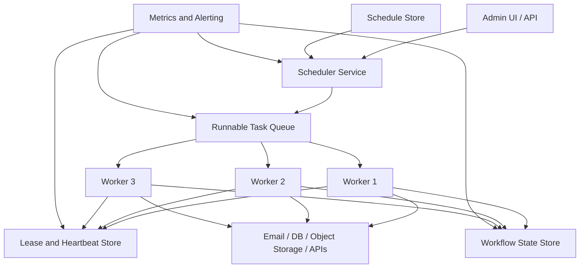

# Distributed Task Scheduling & Workflow Orchestration

> Distributed task scheduling is the set of patterns and systems that decide when background work should run, which worker should run it, and how multi-step workflows recover when parts of the system fail.

---

## The Problem

Imagine you run a payroll and invoicing platform for 12,000 businesses. Every night at midnight in each customer's local timezone, the system needs to generate invoices, sync tax data, email PDFs, update analytics tables, and retry any failed payment reconciliation jobs from earlier in the day. At small scale, a single Linux box with a few `cron` entries seems fine. One job runs at `00:05`, another at `00:10`, and the rest follow in sequence.

Then the company grows. Instead of 20 nightly jobs, you now have 200,000 tasks spread across timezones, tenants, and priorities. Some tasks finish in 300ms. Others fan out into ten downstream API calls and can take 8 minutes. A scheduler restart at the wrong moment causes duplicate invoice generation. A worker crashes halfway through sending tax filings, so half the work committed and half never did. The support team asks, "Did the job run?" and engineering cannot answer confidently because the only evidence is a log line on one node that rotated away two hours ago.

This is where plain cron stops being a cute utility and starts becoming operational risk. Cron assumes one machine, weak coordination, simple time-based triggers, and limited recovery logic. It does not know which jobs are already leased by another worker, which workflows are waiting on upstream dependencies, or whether re-running a task will double-charge a customer. It especially does not help when you need backfills, retries with jitter, human visibility, or guarantees like "run this task at least once, but never send the same email twice."

Distributed scheduling exists because background work becomes business-critical surprisingly early. Payments, report generation, media transcoding, fraud checks, cleanup tasks, machine learning feature pipelines, and daily aggregates all depend on it. Without a deliberate scheduler and workflow model, teams end up with ghost jobs, duplicate side effects, stuck retries, and on-call engineers manually re-running production scripts at 3 AM. Scheduling is really about control: time, ownership, recovery, visibility, and safe re-execution.

---

## Core Concept Explained

Think of a distributed scheduler like an airport operations center. Flights have departure times, gates, crews, weather constraints, maintenance dependencies, and recovery procedures when something goes wrong. A good operations center does not just shout "leave now" every minute. It tracks what is ready, what is blocked, what is already assigned, what missed its slot, and how to recover without sending two planes to the same runway. Task scheduling works the same way.

At the simplest level, a scheduler answers three questions:

1. **When should work become eligible to run?**
2. **Which worker owns that work right now?**
3. **What should happen if the worker dies, the task fails, or the workflow only partially completes?**

### Scheduled tasks versus workflows

A scheduled task is usually one unit of work triggered by time or an external event. Examples include "run billing summary every hour," "delete expired sessions every 10 minutes," or "start a database backup at 2 AM." If the task succeeds, the story ends. If it fails, you often retry it.

A workflow is larger. It is a graph of tasks with state between them. "Generate month-end invoice" might involve computing totals, generating a PDF, uploading the file to object storage, emailing the customer, and posting an accounting event. Some steps can run in parallel. Some must wait. Some are compensatable. The workflow engine therefore stores durable state about progress, retries, and dependencies rather than just firing off one job.

This distinction matters because cron is decent at "run one command every hour" but terrible at "run a 9-step workflow with human retries, idempotent side effects, and fan-out to 20 workers."

### Core building blocks

Most production schedulers are built from the same components.

**Scheduler service:** decides that work is due. It scans a schedule table, a timer wheel, or a delayed queue and turns "should run at 01:00" into an actual runnable task record.

**Task queue:** stores runnable jobs until workers claim them. This can be backed by Kafka, RabbitMQ, SQS, Redis streams, PostgreSQL rows with `FOR UPDATE SKIP LOCKED`, or an engine-specific log.

**Workers:** processes that lease and execute tasks. They send heartbeats while running and report success, retryable failure, or permanent failure.

**State store:** keeps workflow progress, retry counts, last run time, next run time, input payloads, and audit history. Without durable state, restart behavior gets guessy fast.

**Lease or visibility timeout mechanism:** prevents two workers from thinking they both own the same task. A worker claims the job for a bounded window, renews while healthy, and loses ownership if it disappears.

**Retry and backoff policy:** says whether a failed task should retry immediately, after exponential backoff, after a fixed delay, or not at all.

### Cron limitations

Cron is elegant because it is small. That is also why it fails at distributed scheduling. It has no shared state across machines, no central visibility, weak missed-run semantics, no durable lease concept, and limited retry behavior. If you put the same cron entry on two machines for availability, you usually get duplicate execution unless you bolt on external locking. If one machine is down at the scheduled time, cron does not magically coordinate catch-up work for you. Kubernetes CronJobs improve the control surface by storing schedules in the control plane and offering policies like `Forbid` or `Replace`, but they are still mostly job launchers, not full workflow engines.

### Task leasing and heartbeats

The most important practical concept is ownership. In a distributed system, you cannot simply say "worker A is running task X" and trust that forever. The worker might die after claiming it. Networks partition. Pods get evicted. Processes hang without exiting.

So schedulers use leases. A worker claims a task for, say, 30 seconds. Every 10 seconds it sends a heartbeat. If heartbeats stop, the lease expires and another worker can reclaim the task. This is how SQS visibility timeouts, Temporal activity heartbeats, and many homegrown job systems all converge on the same underlying pattern.

Leases solve one problem and create another: duplicate execution is still possible. If a worker finishes the side effect but crashes before acknowledging completion, the task may be retried elsewhere. That is why distributed scheduling almost always pairs with idempotency keys, dedupe tables, or workflow replay semantics.

### At-least-once is the honest default

Most schedulers provide at-least-once execution, not exactly-once execution. That means the system tries hard not to lose work, even if that means a task occasionally runs twice. This is usually the right trade. Lost invoice generation is often worse than duplicate compute, as long as the side effects are idempotent. Truly exactly-once side effects require application-level coordination with durable state, and even then the guarantee is usually narrower than marketing language implies.

### Backfills and dependency graphs

Real systems do not just run future jobs. They re-run old periods. A backfill says, "Recompute all daily aggregates from January 1 to January 31 because the revenue formula was wrong." That sounds simple until you realize a month-long backfill can enqueue tens of thousands of tasks and starve real-time work. Good schedulers isolate pools, priorities, or rate limits so backfills do not crush production latency.

Dependency graphs matter for the same reason. Workflow A might depend on task B and task C finishing first. Airflow models this as DAG edges. Temporal models it as deterministic workflow code that blocks until child activities or timers complete. Either way, the scheduler is no longer just a clock. It becomes a state machine that coordinates time, order, and recovery.

---

## Architecture Diagram

### Mermaid Diagram

### Diagram Walkthrough

Starting from the top left, an admin UI or API creates schedules, workflow definitions, or manual backfills. That might be a user saying "run nightly billing at 01:00 UTC," an operator triggering a replay for yesterday's failed reports, or an internal service registering delayed work. Those definitions are stored in the schedule store, which contains the durable record of when work should be eligible.

The scheduler service continuously reads the schedule store and determines what is due. When the current time crosses a run boundary, or when a timer inside a workflow expires, the scheduler writes runnable items into the task queue. This is the first important flow: time-based intent becomes executable work. The queue is not the schedule itself. It is the holding area for work that is ready right now.

Below the queue sit three workers. In production there might be 30 or 300, but the pattern is the same. Each worker polls or receives tasks from the queue and tries to claim ownership through the lease and heartbeat store. That store is critical because it answers the question, "Who owns this task at this moment?" If Worker 2 takes a task, it also creates or renews a lease record with a timeout. As long as Worker 2 keeps heartbeating, other workers leave that task alone.

The second important flow is execution plus recovery. Suppose Worker 2 takes a "generate invoice PDF" task. It records progress in the workflow state store, executes the actual side effects against the systems on the right, and then marks the task complete. If Worker 2 crashes halfway through, the heartbeat stops, the lease expires, and the task becomes eligible again. Another worker can reclaim it. That is why the workflow state store matters: it preserves what has already happened, what is retryable, and what still needs to run.

The systems on the right represent real side effects such as sending email, writing rows to a database, uploading files to object storage, or calling third-party APIs. This is where idempotency becomes essential. If a worker crashes after uploading a PDF but before acknowledging completion, the retried task must not create a second inconsistent invoice.

Finally, the monitoring and alerting component watches scheduler lag, queue depth, lease expirations, worker heartbeat failures, retry storms, and overdue tasks. Without that visibility, the whole diagram can technically be running while the business still misses deadlines. In practice, operators care less about whether the scheduler process is alive and more about whether scheduled work is finishing within its expected time window.

---

## How It Works Under the Hood

Under the hood, distributed schedulers are mostly durable state machines. The hard part is not "sleep until 02:00." It is recording enough metadata that the system can restart, fail over, retry, and answer audit questions without losing correctness.

One common pattern is a database-backed schedule table with columns like `next_run_at`, `status`, `retry_count`, `lease_owner`, and `lease_expires_at`. A scheduler loop scans for rows where `next_run_at <= now()` and `status = pending`, then atomically transitions them into queued work. In PostgreSQL-backed systems, `FOR UPDATE SKIP LOCKED` is a boring but effective way to let multiple scheduler or worker processes safely compete for work without double-claiming the same row.

Another pattern uses delayed queues or timer wheels. Instead of scanning a full table every second, the scheduler stores timers in buckets keyed by time. This is more efficient when there are millions of future timers. A hashed timing wheel can keep insertion and expiration checks close to O(1) on average, which matters if you are managing large numbers of short-lived delays, such as workflow sleeps or retry timers.

Leasing is typically implemented with expirations rather than permanent locks. For example, a worker may claim a task with a 30-second lease and heartbeat every 10 seconds. If network jitter or a stop-the-world GC pause makes that risky, the team may widen the lease to 60 seconds. That is a throughput versus recovery tradeoff. Short leases reduce failover time but increase accidental duplicate reclaims. Longer leases reduce duplicate risk but make stuck work linger longer before another worker can recover it.

Retries usually rely on exponential backoff with jitter. A common pattern is retry delays of 5s, 30s, 2m, 10m, then dead-letter or human intervention. Jitter matters because a thousand failed tasks retrying at the exact same moment can create synchronized load spikes. Full jitter spreads retries over a range and reduces thundering-herd behavior.

Workflow orchestration engines go one level deeper by persisting execution history. Temporal and Cadence, for example, store workflow event histories so workflow code can be replayed deterministically after failure. That is conceptually powerful: the workflow does not need to remember its state in local memory because its durable event history lets the engine reconstruct it. The price is programming discipline. Workflow code must be deterministic under replay, which changes what libraries, clocks, randomness, and side effects are safe.

Dependency graphs also introduce scheduling math. If a workflow has 1 root task, 20 child tasks, and a join step that waits for all 20, the engine must track which branches completed and whether one failure should cancel the rest. DAG schedulers like Airflow materialize this as graph state per run. Queue-first systems often model it as child task counters, dependency edges, or orchestration code that awaits completion.

Backfills stress every part of the system. Reprocessing 90 days of hourly jobs means 2,160 intervals for one pipeline. If each interval fans into 50 tasks, that is 108,000 runnable items before you even count retries. Mature schedulers therefore support concurrency caps, separate worker pools, per-tenant quotas, or priority queues so old work does not drown out fresh work.

Finally, clock behavior matters. Schedulers that rely on wall-clock time must handle daylight saving changes, leap seconds, timezone rules, and node clock skew. A task that runs at "midnight local time" is not a universal timestamp. Serious systems normalize internal scheduling to UTC, store tenant timezone metadata explicitly, and define what should happen when a scheduled local time occurs twice or not at all during DST transitions.

---

## Key Tradeoffs & Limitations

**Choose cron when the problem is truly small and local.** A single host running one daily backup, one log rotation, and one cleanup script does not need a workflow engine. Adding Temporal, Airflow, or a custom distributed scheduler for that is pure operational overhead. The right boring answer for five low-risk jobs is often still cron.

**Choose a distributed scheduler when you need shared visibility, recovery, or multi-node ownership.** Once jobs matter to revenue, require retries, or must survive node death cleanly, centralized state becomes worth it. That said, you are now operating another control plane: scheduler health, database growth, worker pools, backfill pressure, and retry storms all become things someone must understand.

**Choose workflow orchestration when tasks have durable dependencies, human visibility requirements, or compensation logic.** If the job is "run one SQL script every hour," orchestration is likely overkill. If the job is "charge card, reserve inventory, emit events, notify downstream systems, and compensate on partial failure," orchestration is usually the safer design.

**Do not confuse scheduling with guaranteed correctness.** Schedulers can trigger work reliably, but they cannot make non-idempotent tasks safe by themselves. If "send invoice" can run twice, you still need idempotency keys or dedupe logic. If a downstream API has a hard rate limit of 100 requests per second, the scheduler still needs throttling and backpressure.

**Time-based systems remain operationally awkward.** DST changes, missed windows, cluster restarts, and priority inversions all show up eventually. A scheduler can reduce chaos, but it cannot remove the fundamental complexity of "run the right work, once it is due, in a distributed environment with failures."

Choose simple schedulers for simple periodic work. Choose workflow engines when business processes, recovery rules, and auditability dominate the problem. Do not pay the workflow-engine tax for glorified cron, and do not trust cron with revenue-critical orchestration.

---

## Common Misconceptions

**"Cron is enough if I just run it on two machines."** Many teams think high availability for scheduled work means copying the same cron entry onto a second host. In reality, that usually buys you duplicate execution, not coordinated failover. The correct understanding is that distributed scheduling needs shared state or leasing, not just multiple clocks. The misconception exists because redundancy feels like availability until both machines do the same irreversible thing.

**"Exactly-once execution is what good schedulers provide."** Most real schedulers provide at-least-once execution plus tools to make side effects safe. A worker can crash after performing the action but before recording success, which means the task may re-run. The correct understanding is that exactly-once usually lives at the application boundary through idempotency or transactional design. The misconception exists because vendors understandably market stronger guarantees than the underlying failure model really allows.

**"A workflow engine is just a queue with prettier UI."** Queues store runnable work, but workflow engines also store timers, dependency state, retries, compensation paths, and execution history. They solve a larger state-management problem than a simple queue. The misconception exists because both systems move work to workers, so from a distance they can look similar.

**"If a task is background work, it is less important than request-path code."** In many businesses the background path is the business: billing, payroll, notifications, search indexing, settlement, reporting, media processing. Users may not click the button live, but the outcome still affects money and trust. The misconception exists because background tasks are less visible than a 500 error in the UI.

**"Backfills are just bigger retries."** A backfill often behaves differently from ordinary failure recovery because it can flood queues, saturate databases, and contend with live traffic for hours. It needs rate limits, isolation, and observability of its own. The misconception exists because both involve running work again, but the scale and blast radius are very different.

---

## Real-World Usage

**Airbnb and Apache Airflow:** Airbnb created Airflow to manage large numbers of data pipelines with explicit dependencies, retries, schedules, and backfills. The important implementation choice was modeling workflows as DAGs, not shell scripts chained with hope. That made it possible to reason about thousands of scheduled tasks per day, inspect failed nodes visually, and rerun specific steps without replaying the entire pipeline blindly.

**Uber and Cadence:** Uber built Cadence, the predecessor to Temporal, because business workflows like trip processing, refunds, and long-running operations needed durable state across worker restarts and service failures. The notable design choice was event-history-based workflow execution, where workflow state could be reconstructed after failure rather than living only in process memory. That is exactly the sort of model plain job queues struggle with once workflows run for minutes, hours, or days.

**Kubernetes CronJobs in platform teams:** Many companies use Kubernetes CronJobs for periodic operational work such as backups, report generation, cache warmups, or cleanup tasks. The useful part is that the control plane tracks job creation and supports concurrency policies like `Forbid` and retry settings at the job layer. The limitation is equally important: CronJobs are fine for discrete scheduled jobs, but teams usually outgrow them for stateful multi-step workflows with rich dependency graphs.

**Netflix Conductor and orchestration-heavy platforms:** Netflix created Conductor to coordinate microservice workflows such as media processing and operational pipelines. The practical lesson is that once many services participate in one business process, orchestration state becomes its own product concern. Teams want visibility into which step is waiting, which step failed, and whether a workflow can be resumed instead of restarted from scratch.

---

## Interview Angle

**Q: Why is plain cron usually not enough for distributed background work?**
**How to approach it:**
- Start with coordination problems: no shared lease model, weak visibility, and duplicate execution across hosts.
- Mention recovery semantics: cron does not track workflow state, retries, or durable ownership well.
- Use a concrete example such as invoice generation or payroll where duplicates or missed runs matter.
- Strong answers separate "periodic trigger" from "durable distributed execution."

**Q: How would you prevent the same scheduled job from running twice after a worker crash?**
**How to approach it:**
- Explain leases and heartbeats first, because ownership must expire when a worker disappears.
- Then explain why leases alone are not enough and why idempotent side effects are still required.
- Mention visibility timeouts, retry windows, and dedupe keys as practical tools.
- Strong answers acknowledge that duplicate attempts are often acceptable if side effects are safe.

**Q: When should you choose a workflow engine instead of a queue plus workers?**
**How to approach it:**
- Frame the answer around dependency graphs, long-running timers, human visibility, and compensation logic.
- Say that simple fire-and-forget tasks usually do not justify a workflow engine.
- Mention that workflow engines add operational and programming complexity, especially around deterministic replay.
- Good answers treat this as a cost-benefit tradeoff, not a badge of sophistication.

**Q: How would you run a massive backfill without hurting real-time jobs?**
**How to approach it:**
- Talk about isolated worker pools, concurrency limits, and priority queues.
- Mention rate limiting against downstream dependencies like databases or third-party APIs.
- Explain observability needs: queue depth, task age, success rate, and catch-up ETA.
- Strong answers show awareness that backfills are capacity-planning events, not just bigger retries.

---

## Connections to Other Concepts

**Concept 14 - Message Queues & Stream Processing** is the most direct companion to this topic. Most distributed schedulers eventually hand runnable work to a queue or log-backed execution layer, and the delivery semantics of that queue shape retry, ordering, and worker concurrency behavior.

**Concept 15 - Event-Driven Architecture & Event Sourcing** connects because many workflows are triggered by events rather than clocks alone. Once workflows react to business events, orchestration becomes about combining timers, events, and durable state transitions in one place.

**Concept 19 - Fault Tolerance Patterns** matters because schedulers fail in the same ways other distributed systems fail: timeouts, retries, circuit breakers, bulkheads, and graceful degradation all determine whether missed background work becomes a contained incident or a cascading outage.

**Concept 20 - Idempotency, Deduplication & Exactly-Once Semantics** is essential because distributed schedulers usually provide at-least-once execution. If a task can be retried after lease expiry or worker death, idempotency is what makes re-execution safe for payments, emails, and downstream side effects.

**Concept 21 - Monitoring, Observability & SLOs/SLAs** becomes important the moment scheduled work is business-critical. Queue age, scheduler lag, overdue tasks, retry storms, and workflow completion latency are the signals that tell you whether the scheduling system is healthy in a way users actually feel.
