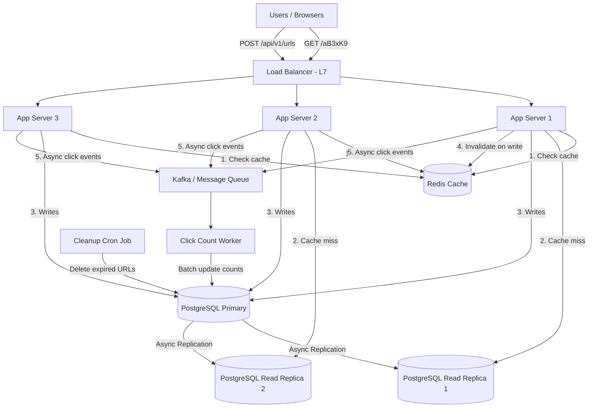

# System Design: URL Shortener

> Design a URL shortening service like bit.ly that handles 100M new URLs per month and 10B redirects per month, with sub-50ms redirect latency.

---

## Concepts Covered

- **Concept 01** - Horizontal vs Vertical Scaling & Auto-scaling
- **Concept 02** - Load Balancing Deep Dive
- **Concept 05** - API Design Patterns
- **Concept 06** - SQL Databases at Scale
- **Concept 10** - Caching Strategies
- **Concept 11** - Consistent Hashing
- **Concept 12** - Data Modeling for Scale
- **Concept 21** - Monitoring, Observability & SLOs/SLAs

---

## Step 1: Requirements & Scope

### Functional Requirements

- **Create short URL**: Given a long URL, generate a unique short URL (e.g., `short.ly/aB3xK9`) → This is the core write path.
- **Redirect**: When a user visits a short URL, redirect them to the original long URL via HTTP 301/302 → This is the core read path and will dominate traffic (~100:1 read-to-write ratio).
- **Custom aliases**: Users can optionally specify a custom short URL (e.g., `short.ly/my-brand`) → Adds a uniqueness constraint check on writes.
- **Expiration**: URLs can have an optional expiration time after which they stop working → Requires TTL tracking and cleanup.
- **Analytics (basic)**: Track click count per short URL → Needs a counter mechanism that doesn't slow down redirects.

### Non-Functional Requirements

- **Availability**: 99.99% uptime — if the redirect service is down, every short URL on the internet is broken. This is a read-heavy service where availability is paramount.
- **Redirect latency**: < 50ms p99 — users expect instant redirects. Anything noticeable feels broken.
- **Write latency**: < 200ms p99 — URL creation can be slightly slower since it's less frequent.
- **Scale**: 100M new URLs/month (~40 writes/sec average, ~120/sec peak), 10B redirects/month (~3,800 reads/sec average, ~12,000/sec peak).
- **Durability**: Once a URL is created, it must not be lost. Losing URL mappings means broken links across the internet.
- **Consistency**: Strong consistency for URL creation (no duplicate short URLs), eventual consistency acceptable for analytics.

### Out of Scope

- User accounts and authentication (we'll treat this as an open API with rate limiting).
- Link-in-bio pages or link management dashboards.
- QR code generation.
- Detailed analytics (geographic breakdown, referrer tracking, device breakdown) — we'll only track total click count.

These are excluded because they add UI and analytics complexity that's orthogonal to the core system design challenge of generating, storing, and resolving short URLs at scale.

---

## Step 2: Back-of-Envelope Estimation

### Traffic Estimation

Starting point: 100M new URLs created per month, 10B redirects per month.

```
Write QPS:
  100M URLs / 30 days / 86,400 seconds = ~38.6 writes/sec (average)
  Peak write QPS (3x multiplier) = ~116 writes/sec

Read QPS:
  10B redirects / 30 days / 86,400 seconds = ~3,858 reads/sec (average)
  Peak read QPS (3x multiplier) = ~11,574 reads/sec

Read:Write ratio = 10B / 100M = 100:1
```

This is clearly a read-heavy system — caching will be essential.

### Storage Estimation

Each URL record contains:
```
  short_url_hash:    7 bytes (7-character base62 string)
  original_url:      average 200 bytes (URLs vary, but 200 is a safe average)
  created_at:        8 bytes (timestamp)
  expires_at:        8 bytes (nullable timestamp)
  click_count:       8 bytes (64-bit integer)
  total per record:  ~231 bytes → round to 250 bytes for overhead
```

Storage over time:
```
  Per month:  100M × 250 bytes = 25 GB
  Per year:   25 GB × 12 = 300 GB
  Over 5 years: 300 GB × 5 = 1.5 TB
  With 3x replication: 1.5 TB × 3 = 4.5 TB
```

4.5 TB over 5 years is very manageable for modern databases.

### Bandwidth Estimation

```
  Incoming (writes): 116 writes/sec × 250 bytes = ~29 KB/sec (negligible)
  Outgoing (reads):  11,574 reads/sec × 250 bytes = ~2.9 MB/sec (very manageable)
```

### Memory Estimation (for caching)

Applying the 80/20 rule — 20% of URLs get 80% of traffic.

```
  Total URLs after 1 year: 1.2 billion
  Hot URLs (20%): 240 million
  Cache size: 240M × 250 bytes = 60 GB
```

60 GB fits comfortably in a Redis cluster (e.g., 4 nodes × 16 GB each).

But in practice, the distribution is even more skewed. The hottest 5% of URLs likely account for 50%+ of traffic. Caching just the top 5% would need:

```
  1.2B × 5% × 250 bytes = 15 GB
```

15 GB fits in a single Redis instance. We'll start with this and scale up based on observed hit ratio.

### Summary Table

| Metric | Value |
|--------|-------|
| Write QPS (average) | ~39 |
| Write QPS (peak) | ~116 |
| Read QPS (average) | ~3,858 |
| Read QPS (peak) | ~11,574 |
| Storage (5 years, with replication) | ~4.5 TB |
| Cache memory (top 5%) | ~15 GB |
| Outgoing bandwidth (peak) | ~2.9 MB/sec |

---

## Step 3: API Design

We'll use REST since this is a simple CRUD-like service with no need for streaming or complex queries. REST is the right choice here because the operations map cleanly to HTTP methods, and every HTTP client in existence supports it.

Cross-reference: **Concept 05 - API Design Patterns** for deeper exploration of REST vs gRPC vs GraphQL decisions.

### Create Short URL

```
POST /api/v1/urls
```

**Request Body:**
| Parameter | Type | Required | Description |
|-----------|------|----------|-------------|
| original_url | string | Yes | The long URL to shorten |
| custom_alias | string | No | User-specified custom short code |
| expires_at | ISO 8601 | No | When the short URL should expire |

**Response (201 Created):**
```json
{
  "short_url": "https://short.ly/aB3xK9",
  "original_url": "https://example.com/very/long/path",
  "hash": "aB3xK9",
  "created_at": "2025-01-15T10:30:00Z",
  "expires_at": null
}
```

**Design notes:** We return the full short URL (not just the hash) so clients can use it directly. The `v1` in the path enables future API versioning without breaking existing clients. Rate limiting applies at 100 requests/minute per IP for unauthenticated access.

### Redirect (the hot path)

```
GET /{hash}
```

**Response:** HTTP 301 (Moved Permanently) with `Location: <original_url>` header.

**Design notes:** We use HTTP 301 (permanent redirect) rather than 302 (temporary) because the mapping doesn't change. This lets browsers cache the redirect, further reducing load on our servers. However, 301 caching means browsers won't hit our servers for repeat visits — so analytics undercounts. If analytics accuracy matters more, use 302 to force every click through our servers.

This is a meaningful tradeoff worth discussing: **301 reduces server load but sacrifices analytics accuracy. 302 gives accurate analytics but means every click hits our servers.** For this design, we'll use 301 to prioritize performance and accept approximate analytics.

### Get URL Info

```
GET /api/v1/urls/{hash}
```

**Response (200 OK):**
```json
{
  "short_url": "https://short.ly/aB3xK9",
  "original_url": "https://example.com/very/long/path",
  "created_at": "2025-01-15T10:30:00Z",
  "expires_at": null,
  "click_count": 14523
}
```

### Delete URL

```
DELETE /api/v1/urls/{hash}
```

**Response:** 204 No Content

---

## Step 4: Data Model

### Database Choice

We'll use **PostgreSQL** as the primary data store.

Why PostgreSQL:
- Strong consistency guarantees — critical because we need uniqueness on the hash column (no two short URLs should map to different destinations).
- Excellent B-tree indexing — our primary access pattern (lookup by hash) is a simple primary key lookup, which PostgreSQL handles in O(log n) with B-tree indexes, effectively <1ms for our data size.
- Proven at this scale — Instagram ran on PostgreSQL serving 1 billion+ rows before sharding, and our projected data (1.5 TB over 5 years) is well within single-instance PostgreSQL capacity.

We considered DynamoDB for its managed auto-scaling, but our access pattern is so simple (key-value lookup by hash) that PostgreSQL's operational overhead is minimal, and we avoid vendor lock-in.

Cross-reference: **Concept 06 - SQL Databases at Scale** for deeper understanding of PostgreSQL indexing and query optimization.

### Schema Design

```
Table: urls
├── hash          VARCHAR(7)      PRIMARY KEY     -- The short URL code, 7 chars base62
├── original_url  TEXT            NOT NULL        -- The destination URL
├── created_at    TIMESTAMP       NOT NULL        -- When the URL was created
├── expires_at    TIMESTAMP       NULLABLE        -- Optional expiration time
├── click_count   BIGINT          DEFAULT 0       -- Total redirect count
│
├── INDEX: idx_urls_expires ON (expires_at) WHERE expires_at IS NOT NULL
│   -- Partial index for cleanup job to find expired URLs efficiently
└── INDEX: idx_urls_created ON (created_at)
    -- For analytics queries and pagination of recent URLs
```

The hash is the primary key because our dominant access pattern is "given a hash, return the original URL." This makes the redirect path a single primary key lookup — the fastest possible query.

We use a partial index on `expires_at` — it only indexes rows where `expires_at IS NOT NULL`, saving space because most URLs won't have an expiration.

### Access Patterns

- **Redirect (95% of queries):** `SELECT original_url FROM urls WHERE hash = $1` → Primary key lookup, O(1) effectively. This is the hot path.
- **Create URL:** `INSERT INTO urls (hash, original_url, created_at, expires_at) VALUES (...)` → Single insert with uniqueness check on primary key.
- **Increment click count:** `UPDATE urls SET click_count = click_count + 1 WHERE hash = $1` → We'll batch these asynchronously to avoid slowing the redirect path.
- **Cleanup expired URLs:** `DELETE FROM urls WHERE expires_at < NOW()` → Uses the partial index, runs as a background job.

Cross-reference: **Concept 12 - Data Modeling for Scale** for more on access-pattern-driven schema design.

---

## Step 5: High-Level Architecture

### Mermaid Diagram



### Architecture Walkthrough

Let's trace through the two most important flows: a redirect (read) and a URL creation (write).

**The Redirect Flow (the hot path — 95%+ of all traffic):**

A user clicks a short URL like `short.ly/aB3xK9`. Their browser sends an HTTP GET request to `short.ly/aB3xK9`. This request first arrives at our L7 load balancer. We use an L7 (application layer) load balancer rather than L4 because we need to route based on URL path — redirect requests go to the same server pool as API requests, but L7 gives us the flexibility to split these later if needed. The load balancer uses least-connections algorithm to distribute across three stateless application servers.

The application server receives the request and extracts the hash `aB3xK9`. Step 1: it queries the Redis cache with this hash as the key. Redis stores the mapping `aB3xK9 → https://example.com/original/url` in memory and responds in about 0.5ms. If the cache has this data (a cache hit, which happens ~90-95% of the time for a URL shortener since popular links get clicked repeatedly), the app server immediately returns an HTTP 301 redirect with the `Location` header set to the original URL. Total time: about 5-10ms including network hops. The user's browser follows the redirect to the original URL.

Step 2 only happens on a cache miss (5-10% of requests). The app server queries a PostgreSQL read replica. We have two read replicas to distribute read load and provide redundancy. The query is a simple primary key lookup: `SELECT original_url FROM urls WHERE hash = 'aB3xK9'`. PostgreSQL returns the result in 1-5ms thanks to the B-tree index on the primary key. The app server then writes this result into Redis with a 24-hour TTL before returning the redirect response to the user. Total time on cache miss: about 15-25ms — still well within our 50ms p99 target.

Step 5 happens asynchronously after the redirect is sent. The app server publishes a click event to a Kafka topic. This decouples the analytics tracking from the redirect latency — we don't want to slow down redirects by updating the database click counter synchronously. A dedicated click count worker consumes events from Kafka and batch-updates click counts in PostgreSQL every few seconds. This means click counts might be slightly delayed (eventual consistency), but redirects stay fast.

**The URL Creation Flow (the write path):**

A user or API client sends a POST request to `/api/v1/urls` with their long URL. The load balancer routes this to an app server. The app server generates a short hash (details in Deep Dive 1 below), then attempts to insert the new record into the PostgreSQL primary database. If the hash already exists (collision), the server retries with a different hash. Once the insert succeeds, the app server returns the new short URL to the client.

Writes go exclusively to the PostgreSQL primary. The primary asynchronously replicates to the two read replicas, typically within a few milliseconds. We don't write to the cache on URL creation — we use cache-aside, so the cache will be populated on the first redirect request. This avoids caching URLs that might never be visited.

**What about the cleanup cron job?** A scheduled job runs every hour, querying the partial index on `expires_at` to find and delete expired URLs. This keeps the database clean and prevents unbounded growth. Deleted URL hashes become available for reuse, though in practice with a 7-character base62 space (3.5 trillion possibilities), we'll never run out.

Cross-reference: **Concept 02 - Load Balancing Deep Dive** for L4 vs L7 load balancing tradeoffs. **Concept 10 - Caching Strategies** for cache-aside pattern details.

---

## Step 6: Deep Dives

### Deep Dive 1: Hash Generation — How Do We Create Short URLs?

This is the central algorithmic challenge of a URL shortener. We need to generate a unique 7-character string for each URL. With base62 encoding (a-z, A-Z, 0-9), 7 characters give us 62^7 = 3.52 trillion possible URLs — far more than we'll ever need.

**Approach 1: MD5/SHA256 Hash + Truncation**

Hash the original URL with MD5 (128-bit output), then take the first 43 bits and base62-encode them to get 7 characters. The problem is collision — two different URLs might produce the same 7-character prefix. With the birthday paradox, the probability of collision reaches 1% after about 200 million URLs. At our scale (100M URLs/month), we'd hit collisions within a few months.

To handle collisions: on insert, if the hash already exists, append a counter to the URL before re-hashing (`original_url + "1"`, `original_url + "2"`, etc.) and retry. This works but adds latency to writes that collide.

**Approach 2: Counter-Based (our chosen approach)**

Maintain a global auto-incrementing counter. Each new URL gets the next counter value, which is then base62-encoded to produce the short hash. Counter value 1 becomes "0000001", counter value 62 becomes "0000010", and so on.

This eliminates collisions entirely — every counter value maps to a unique hash. The challenge is generating unique counter values in a distributed system. Options:

- **Single database sequence**: PostgreSQL `SERIAL` or `BIGSERIAL` column. Simple and correct, but the primary database becomes a write bottleneck.
- **Pre-allocated ranges**: Each app server pre-allocates a range of counter values (e.g., server 1 gets 1-10,000, server 2 gets 10,001-20,000). Servers generate hashes locally without coordination. When a range is exhausted, the server requests a new range from a central coordinator (like ZooKeeper or a simple database row). This approach is used by services like Twitter's Snowflake ID generator.
- **UUID-based**: Generate a UUID and base62-encode it. No coordination needed, but UUIDs are 128 bits — we'd need to truncate, reintroducing collision risk.

We'll use the **pre-allocated ranges** approach because it's collision-free, doesn't bottleneck on a single database, and each server can generate hashes without network calls (until its range is exhausted).

A subtle issue: counter-based hashes are sequential, which means they're predictable. A user could enumerate all URLs by incrementing the hash. If this is a concern, we can add a bijective shuffle — a reversible mathematical transformation that maps sequential counters to seemingly random hashes. Techniques like modular multiplicative inverses or format-preserving encryption (like FPE) achieve this.

Cross-reference: **Concept 11 - Consistent Hashing** for understanding hash distribution concepts.

### Deep Dive 2: Caching Strategy for Redirects

The redirect path is our hot path — every millisecond matters. Let's design the caching layer carefully.

**Cache-aside with delete-on-write** is our strategy. On redirect: check Redis → if hit, return → if miss, query PostgreSQL → write to Redis → return. On URL update or deletion: delete the key from Redis.

**TTL selection**: We set a 24-hour TTL. Why 24 hours? Most URL shortener traffic follows a burst pattern — a link is shared, gets heavy traffic for hours or days, then dies down. A 24-hour TTL ensures popular links stay cached during their peak while not permanently occupying memory for links that go cold. The cleanup of cold entries is handled by eviction (LRU) if memory pressure increases.

**Cache key design**: We use the hash directly as the Redis key: `GET aB3xK9` returns the original URL. Simple and fast — no serialization overhead, no complex key construction.

**Handling the hot-key problem**: If a single short URL goes mega-viral (millions of clicks per second), that single Redis key becomes a hot spot on one shard. Solutions: (1) Local in-process cache on each app server with a 60-second TTL — this absorbs the heaviest traffic before it reaches Redis. (2) Key replication across multiple Redis shards by appending a random suffix: `aB3xK9:1`, `aB3xK9:2`, `aB3xK9:3` — the app server randomly picks one, spreading load across shards.

**Cache warm-up**: After a cache node restart, the cache is cold and all requests hit PostgreSQL. We mitigate this by: (1) using Redis persistence (RDB snapshots every 5 minutes) so a restarted node recovers most of its data, and (2) ensuring our PostgreSQL read replicas are scaled to handle full traffic temporarily during cache warm-up.

Cross-reference: **Concept 10 - Caching Strategies** for the cache-aside pattern, cache stampede mitigation, and eviction policy details.

### Deep Dive 3: Analytics Without Slowing Down Redirects

Tracking click counts is a requirement, but we absolutely cannot let it slow down the redirect path. Updating the database synchronously on every redirect would add 5-15ms of latency and create write pressure on the primary database.

**Our approach: asynchronous event-based counting.**

When a redirect happens, the app server publishes a lightweight event to Kafka:
```json
{"hash": "aB3xK9", "timestamp": "2025-01-15T10:30:15Z", "ip": "203.0.113.42"}
```

A dedicated click count worker consumes these events and batch-processes them. Every 5 seconds, the worker aggregates all events received and issues a single batch UPDATE:
```sql
UPDATE urls SET click_count = click_count + 47 WHERE hash = 'aB3xK9';
UPDATE urls SET click_count = click_count + 12 WHERE hash = 'xY7mN2';
-- ... batched for all hashes seen in this 5-second window
```

This collapses potentially thousands of individual UPDATE statements into a handful of batched updates, reducing database write load by 100x or more.

**Tradeoff**: Click counts are eventually consistent — they might lag by up to 5-10 seconds behind real-time. For a URL shortener's basic analytics, this is perfectly acceptable.

**Handling Kafka failures**: If Kafka is temporarily unavailable, the app server can buffer events in memory (up to a configurable limit) and retry. If the buffer fills, we drop events — losing a few click counts during an outage is acceptable given our consistency requirements.

Cross-reference: **Concept 14 - Message Queues & Stream Processing** for Kafka's delivery guarantees and batching patterns.

### Deep Dive 4: Hash Space and Long-Term Capacity Planning

With 7 base62 characters, we have 62^7 = 3.52 trillion possible hashes. At 100M new URLs per month (1.2B per year), it would take ~2,933 years to exhaust this space. We're safe.

But what about hash recycling from expired URLs? When a URL expires, its hash becomes available for reuse. However, reusing hashes is dangerous — if someone bookmarked or cached the old short URL, they'd be redirected to a completely different destination. For safety, we never reuse hashes. Expired URLs return a 410 Gone response.

If we ever needed more capacity (we won't), we could extend to 8 characters (62^8 = 218 trillion) with a simple migration.

---

## Step 7: Bottlenecks & Scaling

### Identifying Bottlenecks

**At 10x scale (120,000 redirects/sec peak):**

The Redis cache becomes the first concern. A single Redis node handles ~100,000 ops/sec, which is close to our limit. We'd need to shard Redis across 2-3 nodes using consistent hashing. The cache hit ratio might also drop as the working set grows, increasing load on PostgreSQL read replicas.

The PostgreSQL read replicas are fine — at our cache miss rate of 5-10%, they'd see 6,000-12,000 QPS, which is well within PostgreSQL's capacity.

**At 100x scale (1.2M redirects/sec peak):**

We'd need a Redis cluster of 12-15 nodes. The app server pool would need to scale to ~30-50 instances. PostgreSQL read replicas would need to increase to 5-6 to handle cache misses at this volume. The Kafka click tracking pipeline would need multiple partitions and consumer instances to keep up with event volume.

The primary database write path (URL creation at ~12,000 writes/sec peak) would still be manageable for a single PostgreSQL primary, since our writes are simple inserts.

### Scaling Solutions

| Bottleneck | Solution | New Capacity |
|------------|----------|--------------|
| Redis single node | Redis Cluster with consistent hashing | ~1M+ ops/sec |
| App server pool | Horizontal scaling with auto-scaling groups | Linear with servers |
| Read replica load | Add more replicas | ~30K QPS per replica |
| Kafka throughput | Increase partitions + consumers | Linear with partitions |

### Failure Scenarios

**Redis cache goes down**: All redirect traffic hits PostgreSQL read replicas. At 10x scale, the replicas receive ~120,000 QPS — they cannot handle this without caching. Mitigation: Redis Sentinel for automatic failover (failover in <30 seconds), plus circuit breaker on the app servers that returns 503 with retry headers if both Redis and PostgreSQL are overwhelmed, rather than cascading the failure.

**PostgreSQL primary goes down**: No new URLs can be created, but redirects continue functioning (reads go to replicas and cache). We use streaming replication with a standby that auto-promotes via Patroni or pg_auto_failover. Failover time: ~10-30 seconds.

**A single app server crashes**: The load balancer detects the failure via health checks (typically within 10 seconds) and stops routing traffic. No data is lost because app servers are stateless. Remaining servers absorb the extra traffic.

**Kafka goes down**: Click events are lost during the outage. Redirects continue functioning — analytics tracking is decoupled from the critical path. App servers log events locally as fallback and replay them when Kafka recovers.

---

## Step 8: Monitoring & Alerting

### Key Metrics to Track

**Business metrics:**
- URLs created per minute — sudden drops indicate write path issues
- Redirects per second — our core traffic metric, sudden drops mean something is very wrong
- 404 rate (invalid short URLs) — a spike might indicate a scraping attack or data loss

**Infrastructure metrics:**
- Redis cache hit ratio — should stay above 90%; below 85% means our working set outgrew the cache
- Redirect latency p50/p95/p99 — our primary user experience metric
- PostgreSQL connection pool utilization — approaching 80% means we need more replicas or larger pool
- PostgreSQL replication lag — above 1 second means read replicas might serve stale data
- Kafka consumer lag — growing lag means click count workers can't keep up

### SLOs

- **Redirect availability**: 99.99% measured over a rolling 30-day window (allows ~4.3 minutes of downtime per month)
- **Redirect latency**: 99% of redirects complete in < 50ms
- **URL creation availability**: 99.9% (slightly lower than redirects because a brief creation outage is less impactful)
- **Durability**: Zero URL data loss once a creation is acknowledged

### Alerting Rules

- **CRITICAL**: Redirect p99 latency > 200ms for 3 minutes → page on-call (our 50ms target is breached, likely a cache issue)
- **CRITICAL**: Redirect error rate > 0.5% for 2 minutes → page on-call (significant user impact)
- **WARNING**: Cache hit ratio < 85% for 15 minutes → ticket for investigation (may need to increase cache size)
- **WARNING**: PostgreSQL replication lag > 5 seconds for 10 minutes → ticket (replicas falling behind)
- **CRITICAL**: PostgreSQL primary disk usage > 85% → page on-call (approaching capacity)
- **INFO**: Kafka consumer lag > 100,000 events → investigate (analytics pipeline falling behind)

Cross-reference: **Concept 21 - Monitoring, Observability & SLOs/SLAs** for SLO calculation methodology and alerting best practices.

---

## Summary

### Key Design Decisions

1. **Cache-aside with Redis** for the redirect path, achieving ~90-95% cache hit ratio and sub-10ms latency for the vast majority of requests.
2. **Counter-based hash generation with pre-allocated ranges** to avoid collisions entirely without requiring coordination on every write.
3. **Asynchronous click tracking via Kafka** to decouple analytics from the latency-critical redirect path.
4. **HTTP 301 redirects** to let browsers cache redirects, trading analytics accuracy for reduced server load.
5. **PostgreSQL with read replicas** rather than NoSQL, because our access pattern is simple enough that PostgreSQL's proven reliability and strong consistency outweigh any minor performance advantage of a key-value store.

### Top Tradeoffs

1. **301 vs 302 redirect**: We chose 301 (permanent) for better performance, accepting that browser caching means we undercount clicks. If analytics accuracy were a core requirement, we'd switch to 302 and size our infrastructure for higher read QPS.
2. **Eventual consistency for click counts**: By tracking clicks asynchronously, we accept that counts might be 5-10 seconds stale. In exchange, our redirect latency stays below 10ms and our database write load is reduced by 100x.
3. **No hash reuse for expired URLs**: We never reassign expired hashes to new URLs, even though this means slowly consuming our hash space. The risk of redirecting someone to a completely different page is worse than any storage savings. With 3.5 trillion possible hashes, exhaustion is a non-issue.

### Alternative Approaches

- **For smaller scale (< 1M URLs)**: Skip Redis entirely. A single PostgreSQL instance with proper indexing handles ~30,000 QPS. Simpler to operate, fewer failure modes.
- **For massive scale (>100B redirects/month)**: Consider using a distributed key-value store like DynamoDB or Cassandra instead of PostgreSQL, with DynamoDB Accelerator (DAX) as the caching layer. This trades operational simplicity for near-infinite horizontal scaling.
- **For strong analytics requirements**: Replace Kafka + batch workers with a real-time analytics pipeline (like Flink) and use 302 redirects. Add a dedicated analytics data store (ClickHouse or Druid) optimized for time-series aggregation queries.
